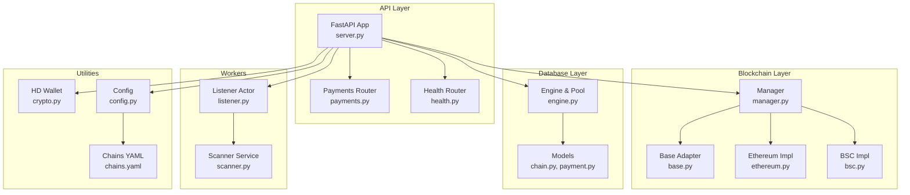
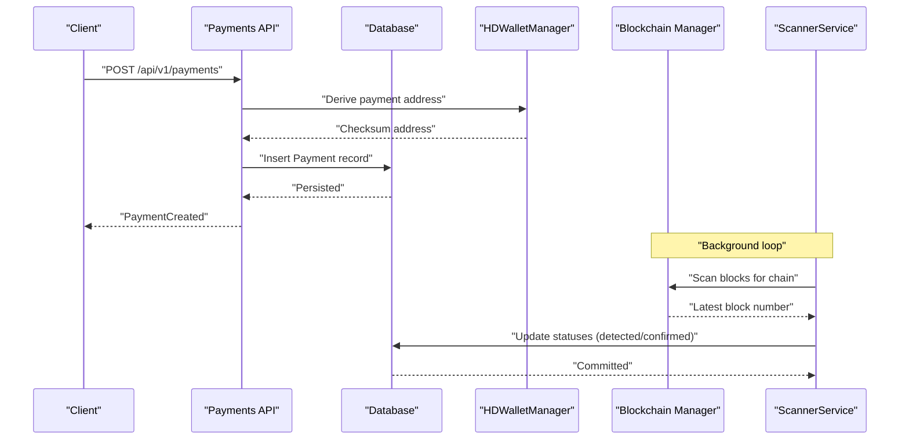
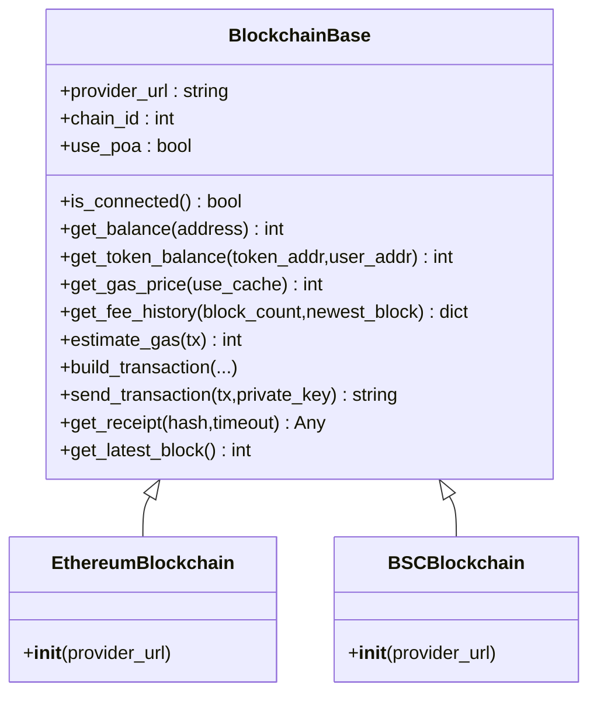
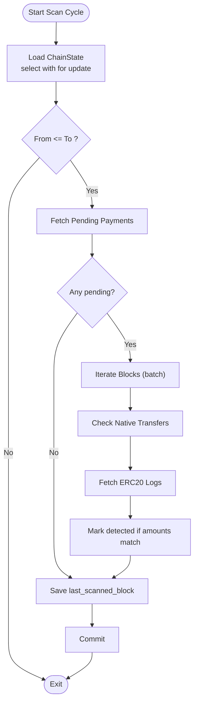
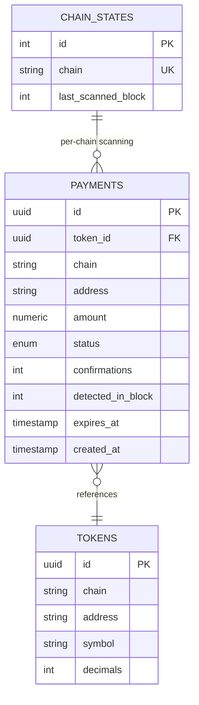
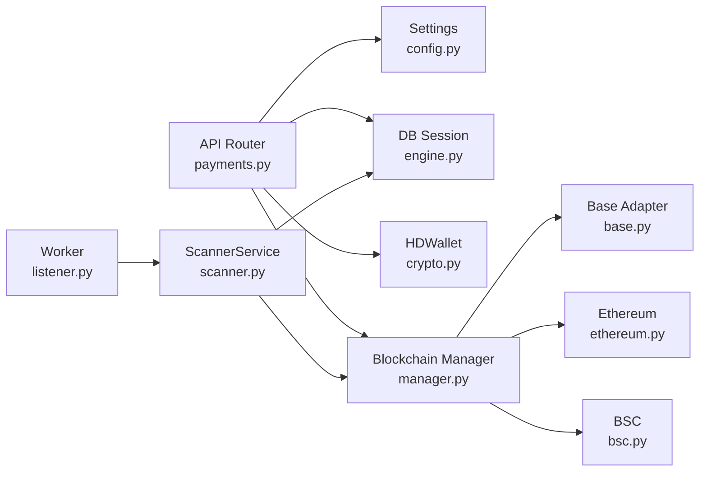

# Advanced Topics

<cite>
**Referenced Files in This Document**
- [server.py](https://github.com/rakibhossain72/ctrip/blob/main/server.py)
- [manager.py](https://github.com/rakibhossain72/ctrip/blob/main/app/blockchain/manager.py)
- [base.py](https://github.com/rakibhossain72/ctrip/blob/main/app/blockchain/base.py)
- [ethereum.py](https://github.com/rakibhossain72/ctrip/blob/main/app/blockchain/ethereum.py)
- [bsc.py](https://github.com/rakibhossain72/ctrip/blob/main/app/blockchain/bsc.py)
- [config.py](https://github.com/rakibhossain72/ctrip/blob/main/app/core/config.py)
- [chains.yaml](https://github.com/rakibhossain72/ctrip/blob/main/chains.yaml)
- [engine.py](https://github.com/rakibhossain72/ctrip/blob/main/app/db/engine.py)
- [chain.py](https://github.com/rakibhossain72/ctrip/blob/main/app/db/models/chain.py)
- [payment.py](https://github.com/rakibhossain72/ctrip/blob/main/app/db/models/payment.py)
- [scanner.py](https://github.com/rakibhossain72/ctrip/blob/main/app/services/blockchain/scanner.py)
- [listener.py](https://github.com/rakibhossain72/ctrip/blob/main/app/workers/listener.py)
- [crypto.py](https://github.com/rakibhossain72/ctrip/blob/main/app/utils/crypto.py)
- [payments.py](https://github.com/rakibhossain72/ctrip/blob/main/app/api/v1/payments.py)
- [logger.py](https://github.com/rakibhossain72/ctrip/blob/main/app/core/logger.py)
</cite>

## Table of Contents
1. [Introduction](#introduction)
2. [Project Structure](#project-structure)
3. [Core Components](#core-components)
4. [Architecture Overview](#architecture-overview)
5. [Detailed Component Analysis](#detailed-component-analysis)
6. [Dependency Analysis](#dependency-analysis)
7. [Performance Considerations](#performance-considerations)
8. [Troubleshooting Guide](#troubleshooting-guide)
9. [Conclusion](#conclusion)
10. [Appendices](#appendices)

## Introduction
This document provides advanced topics for the cTrip Payment Gateway, focusing on sophisticated implementation details and optimization strategies. It covers custom chain integration patterns, performance tuning for async operations and databases, error handling and resilience, observability and monitoring, and guidance for system architects and senior developers building complex distributed systems.

## Project Structure
The system is organized around a FastAPI application with modular components:
- API layer for payment creation and health checks
- Blockchain abstraction supporting multiple networks
- Database layer with SQLAlchemy ORM models and async engine
- Workers for background scanning and sweeping
- Utilities for HD wallet generation and cryptographic operations
- Configuration and environment-driven settings

**Diagram sources**
- [server.py](https://github.com/rakibhossain72/ctrip/blob/main/server.py#L45-L47)
- [manager.py](https://github.com/rakibhossain72/ctrip/blob/main/app/blockchain/manager.py#L8-L32)
- [base.py](https://github.com/rakibhossain72/ctrip/blob/main/app/blockchain/base.py#L22-L146)
- [ethereum.py](https://github.com/rakibhossain72/ctrip/blob/main/app/blockchain/ethereum.py#L3-L6)
- [bsc.py](https://github.com/rakibhossain72/ctrip/blob/main/app/blockchain/bsc.py#L3-L6)
- [engine.py](https://github.com/rakibhossain72/ctrip/blob/main/app/db/engine.py#L19-L31)
- [chain.py](https://github.com/rakibhossain72/ctrip/blob/main/app/db/models/chain.py#L9-L17)
- [payment.py](https://github.com/rakibhossain72/ctrip/blob/main/app/db/models/payment.py#L41-L74)
- [listener.py](https://github.com/rakibhossain72/ctrip/blob/main/app/workers/listener.py#L21-L46)
- [scanner.py](https://github.com/rakibhossain72/ctrip/blob/main/app/services/blockchain/scanner.py#L14-L134)
- [crypto.py](https://github.com/rakibhossain72/ctrip/blob/main/app/utils/crypto.py#L5-L90)
- [config.py](https://github.com/rakibhossain72/ctrip/blob/main/app/core/config.py#L44-L56)
- [chains.yaml](https://github.com/rakibhossain72/ctrip/blob/main/chains.yaml#L12-L23)

**Section sources**
- [server.py](https://github.com/rakibhossain72/ctrip/blob/main/server.py#L1-L56)
- [manager.py](https://github.com/rakibhossain72/ctrip/blob/main/app/blockchain/manager.py#L1-L33)
- [engine.py](https://github.com/rakibhossain72/ctrip/blob/main/app/db/engine.py#L1-L32)
- [config.py](https://github.com/rakibhossain72/ctrip/blob/main/app/core/config.py#L1-L126)
- [chains.yaml](https://github.com/rakibhossain72/ctrip/blob/main/chains.yaml#L1-L24)

## Core Components
- Application lifecycle and startup orchestration
- Blockchain adapter factory and per-chain implementations
- Database engine configuration with connection pooling and async support
- Payment creation API with validation and HD wallet address derivation
- Background scanning and confirmation service
- Configuration-driven chain discovery and runtime settings

Key implementation highlights:
- Startup initializes blockchain adapters and seeds chain states
- Manager builds a registry of supported chains from configuration
- Engine sets up synchronous and asynchronous engines with pooling
- ScannerService performs batched block scans and confirmation updates
- Payments API validates chain/token compatibility and creates payment records

**Section sources**
- [server.py](https://github.com/rakibhossain72/ctrip/blob/main/server.py#L21-L42)
- [manager.py](https://github.com/rakibhossain72/ctrip/blob/main/app/blockchain/manager.py#L8-L32)
- [engine.py](https://github.com/rakibhossain72/ctrip/blob/main/app/db/engine.py#L19-L31)
- [payments.py](https://github.com/rakibhossain72/ctrip/blob/main/app/api/v1/payments.py#L18-L54)
- [scanner.py](https://github.com/rakibhossain72/ctrip/blob/main/app/services/blockchain/scanner.py#L20-L96)

## Architecture Overview
The system follows a layered architecture with clear separation of concerns:
- API layer exposes payment creation and health endpoints
- Blockchain layer abstracts network-specific details behind a common interface
- Database layer persists payment and chain state records
- Worker layer runs periodic scanning and confirmation tasks
- Configuration layer drives chain selection and environment-specific behavior

**Diagram sources**
- [payments.py](https://github.com/rakibhossain72/ctrip/blob/main/app/api/v1/payments.py#L18-L54)
- [crypto.py](https://github.com/rakibhossain72/ctrip/blob/main/app/utils/crypto.py#L27-L46)
- [scanner.py](https://github.com/rakibhossain72/ctrip/blob/main/app/services/blockchain/scanner.py#L20-L96)
- [chain.py](https://github.com/rakibhossain72/ctrip/blob/main/app/db/models/chain.py#L9-L17)

**Section sources**
- [payments.py](https://github.com/rakibhossain72/ctrip/blob/main/app/api/v1/payments.py#L1-L62)
- [scanner.py](https://github.com/rakibhossain72/ctrip/blob/main/app/services/blockchain/scanner.py#L1-L134)
- [chain.py](https://github.com/rakibhossain72/ctrip/blob/main/app/db/models/chain.py#L1-L17)

## Detailed Component Analysis

### Custom Chain Implementation Patterns
The gateway supports multiple blockchain networks through a shared base class and specialized implementations. The manager constructs a registry keyed by chain name, enabling dynamic addition of new chains.

- Extending to new chains:
  - Add a new subclass of BlockchainBase with chain-specific defaults (e.g., chain_id, PoA handling)
  - Register the new chain in the manager factory by extending the conditional logic
  - Provide a configuration entry in chains.yaml with name and rpc_url
  - Optionally define token metadata for supported assets

**Diagram sources**
- [base.py](https://github.com/rakibhossain72/ctrip/blob/main/app/blockchain/base.py#L22-L146)
- [ethereum.py](https://github.com/rakibhossain72/ctrip/blob/main/app/blockchain/ethereum.py#L3-L6)
- [bsc.py](https://github.com/rakibhossain72/ctrip/blob/main/app/blockchain/bsc.py#L3-L6)
- [manager.py](https://github.com/rakibhossain72/ctrip/blob/main/app/blockchain/manager.py#L8-L32)
- [chains.yaml](https://github.com/rakibhossain72/ctrip/blob/main/chains.yaml#L12-L23)

**Section sources**
- [base.py](https://github.com/rakibhossain72/ctrip/blob/main/app/blockchain/base.py#L22-L146)
- [ethereum.py](https://github.com/rakibhossain72/ctrip/blob/main/app/blockchain/ethereum.py#L1-L7)
- [bsc.py](https://github.com/rakibhossain72/ctrip/blob/main/app/blockchain/bsc.py#L1-L7)
- [manager.py](https://github.com/rakibhossain72/ctrip/blob/main/app/blockchain/manager.py#L8-L32)
- [chains.yaml](https://github.com/rakibhossain72/ctrip/blob/main/chains.yaml#L1-L24)

### Performance Optimization Techniques
- Connection pooling and async engines:
  - Synchronous engine configured with pre-ping and a fixed pool size
  - Asynchronous engine configured for asyncpg/sqlite+aiosqlite
- Gas estimation and caching:
  - Gas price cache with short TTL reduces RPC calls
  - EIP-1559 fee estimation fallback to legacy pricing
- Batch scanning and confirmation:
  - Block batching limits per-iteration work
  - Confirmation thresholds prevent premature settlement
- Async operation tuning:
  - Dramatiq actors schedule periodic scanning cycles
  - Event loops and asyncio.run used within actors for isolated execution

**Diagram sources**
- [scanner.py](https://github.com/rakibhossain72/ctrip/blob/main/app/services/blockchain/scanner.py#L20-L96)
- [engine.py](https://github.com/rakibhossain72/ctrip/blob/main/app/db/engine.py#L22-L31)

**Section sources**
- [engine.py](https://github.com/rakibhossain72/ctrip/blob/main/app/db/engine.py#L19-L31)
- [base.py](https://github.com/rakibhossain72/ctrip/blob/main/app/blockchain/base.py#L65-L81)
- [scanner.py](https://github.com/rakibhossain72/ctrip/blob/main/app/services/blockchain/scanner.py#L14-L96)
- [listener.py](https://github.com/rakibhossain72/ctrip/blob/main/app/workers/listener.py#L21-L46)

### Error Handling Strategies, Circuit Breaker Patterns, and Graceful Degradation
- Connectivity checks:
  - is_connected method wraps provider connectivity verification with logging
- Gas estimation fallback:
  - estimate_gas falls back to conservative defaults when RPC fails
- Transaction building:
  - EIP-1559 fee calculation with legacy fallback ensures robustness
- API error handling:
  - Payments endpoint rolls back on exceptions and returns structured errors
- Worker resilience:
  - Actors schedule next run even after exceptions to avoid halting the pipeline

Recommended enhancements:
- Circuit breaker for RPC providers to temporarily disable failing endpoints
- Retry with exponential backoff for transient failures
- Health checks and degraded mode when critical subsystems fail

**Section sources**
- [base.py](https://github.com/rakibhossain72/ctrip/blob/main/app/blockchain/base.py#L45-L50)
- [base.py](https://github.com/rakibhossain72/ctrip/blob/main/app/blockchain/base.py#L86-L92)
- [payments.py](https://github.com/rakibhossain72/ctrip/blob/main/app/api/v1/payments.py#L56-L62)
- [listener.py](https://github.com/rakibhossain72/ctrip/blob/main/app/workers/listener.py#L43-L46)

### Monitoring and Observability
- Logging:
  - Centralized logger instances used across modules
  - Structured logs in workers and services aid correlation
- Metrics:
  - Integrate application metrics (e.g., Prometheus) to track:
    - Request latency and error rates for payment endpoints
    - Worker cycle durations and detection rates
    - Gas price and block scanning throughput
- Distributed tracing:
  - Add OpenTelemetry instrumentation around:
    - Payment creation requests
    - Blockchain adapter calls
    - Database transactions
    - Worker actor executions

**Section sources**
- [logger.py](https://github.com/rakibhossain72/ctrip/blob/main/app/core/logger.py#L1-L4)
- [listener.py](https://github.com/rakibhossain72/ctrip/blob/main/app/workers/listener.py#L9-L13)
- [scanner.py](https://github.com/rakibhossain72/ctrip/blob/main/app/services/blockchain/scanner.py#L1-L10)

### Advanced Database Optimization
- Connection management:
  - Pre-ping enabled to detect stale connections
  - Separate sync and async engines for optimal performance
- Query optimization:
  - Use of select with for update for atomic state updates
  - Efficient filtering on indexed columns (chain, status)
- Performance tuning:
  - Tune pool size and timeouts based on workload
  - Consider read replicas for heavy read patterns
  - Indexes on chain, status, and timestamps for scanning queries

**Diagram sources**
- [chain.py](https://github.com/rakibhossain72/ctrip/blob/main/app/db/models/chain.py#L9-L17)
- [payment.py](https://github.com/rakibhossain72/ctrip/blob/main/app/db/models/payment.py#L41-L74)

**Section sources**
- [engine.py](https://github.com/rakibhossain72/ctrip/blob/main/app/db/engine.py#L22-L31)
- [chain.py](https://github.com/rakibhossain72/ctrip/blob/main/app/db/models/chain.py#L1-L17)
- [payment.py](https://github.com/rakibhossain72/ctrip/blob/main/app/db/models/payment.py#L1-L74)
- [scanner.py](https://github.com/rakibhossain72/ctrip/blob/main/app/services/blockchain/scanner.py#L24-L49)

### Troubleshooting Methodologies
- Multi-component issues:
  - Validate chain configuration and RPC reachability
  - Inspect worker schedules and logs for recurring failures
  - Correlate payment statuses with chain state and block scanning
- Diagnostic steps:
  - Verify database connectivity and pool exhaustion
  - Confirm HD wallet mnemonic and derived addresses
  - Check token metadata alignment with on-chain addresses
- Remediation:
  - Rotate RPC endpoints and enable circuit breaker behavior
  - Increase block batch sizes gradually under load testing
  - Add targeted retries for transient RPC errors

**Section sources**
- [manager.py](https://github.com/rakibhossain72/ctrip/blob/main/app/blockchain/manager.py#L8-L32)
- [config.py](https://github.com/rakibhossain72/ctrip/blob/main/app/core/config.py#L44-L56)
- [listener.py](https://github.com/rakibhossain72/ctrip/blob/main/app/workers/listener.py#L21-L46)
- [scanner.py](https://github.com/rakibhossain72/ctrip/blob/main/app/services/blockchain/scanner.py#L20-L96)

### Architectural Decision Records, Design Patterns, and Anti-patterns
- Decisions:
  - Use of async Web3 for non-blocking blockchain calls
  - Centralized configuration via pydantic settings with environment-specific overrides
  - Factory-based blockchain adapter construction
- Patterns:
  - Adapter pattern for blockchain networks
  - Worker actor pattern for periodic tasks
  - Repository-style service layer for scanning logic
- Anti-patterns:
  - Mixing blocking DB calls inside async contexts
  - Hardcoding chain parameters; prefer configuration-driven design
  - Performing expensive operations in hot paths without caching or batching

**Section sources**
- [base.py](https://github.com/rakibhossain72/ctrip/blob/main/app/blockchain/base.py#L34-L39)
- [config.py](https://github.com/rakibhossain72/ctrip/blob/main/app/core/config.py#L10-L122)
- [manager.py](https://github.com/rakibhossain72/ctrip/blob/main/app/blockchain/manager.py#L8-L32)
- [listener.py](https://github.com/rakibhossain72/ctrip/blob/main/app/workers/listener.py#L21-L46)
- [scanner.py](https://github.com/rakibhossain72/ctrip/blob/main/app/services/blockchain/scanner.py#L14-L96)

## Dependency Analysis
The system exhibits low coupling and high cohesion:
- API depends on database sessions and blockchain manager
- Blockchain manager depends on configuration and concrete implementations
- Workers depend on async sessions and scanner service
- Database models encapsulate persistence logic

**Diagram sources**
- [payments.py](https://github.com/rakibhossain72/ctrip/blob/main/app/api/v1/payments.py#L1-L62)
- [config.py](https://github.com/rakibhossain72/ctrip/blob/main/app/core/config.py#L1-L126)
- [engine.py](https://github.com/rakibhossain72/ctrip/blob/main/app/db/engine.py#L1-L32)
- [crypto.py](https://github.com/rakibhossain72/ctrip/blob/main/app/utils/crypto.py#L1-L90)
- [manager.py](https://github.com/rakibhossain72/ctrip/blob/main/app/blockchain/manager.py#L1-L33)
- [base.py](https://github.com/rakibhossain72/ctrip/blob/main/app/blockchain/base.py#L1-L146)
- [ethereum.py](https://github.com/rakibhossain72/ctrip/blob/main/app/blockchain/ethereum.py#L1-L7)
- [bsc.py](https://github.com/rakibhossain72/ctrip/blob/main/app/blockchain/bsc.py#L1-L7)
- [listener.py](https://github.com/rakibhossain72/ctrip/blob/main/app/workers/listener.py#L1-L46)
- [scanner.py](https://github.com/rakibhossain72/ctrip/blob/main/app/services/blockchain/scanner.py#L1-L134)

**Section sources**
- [payments.py](https://github.com/rakibhossain72/ctrip/blob/main/app/api/v1/payments.py#L1-L62)
- [manager.py](https://github.com/rakibhossain72/ctrip/blob/main/app/blockchain/manager.py#L1-L33)
- [engine.py](https://github.com/rakibhossain72/ctrip/blob/main/app/db/engine.py#L1-L32)
- [listener.py](https://github.com/rakibhossain72/ctrip/blob/main/app/workers/listener.py#L1-L46)
- [scanner.py](https://github.com/rakibhossain72/ctrip/blob/main/app/services/blockchain/scanner.py#L1-L134)

## Performance Considerations
- Network I/O:
  - Cache gas prices and fee history to reduce RPC calls
  - Use EIP-1559 when available; fallback gracefully to legacy pricing
- Database I/O:
  - Use connection pooling and pre-ping to maintain healthy connections
  - Batch updates and minimize round-trips in scanning loops
- Concurrency:
  - Run workers as separate actors to isolate failures and scale horizontally
  - Avoid mixing sync and async operations in the same thread
- Tuning guidelines:
  - Adjust pool sizes based on concurrent workers and API traffic
  - Monitor queue depths and backpressure in the message broker

[No sources needed since this section provides general guidance]

## Troubleshooting Guide
- Symptom: Payments not detected
  - Check chain state last scanned block and latest block number
  - Verify token metadata matches on-chain addresses
  - Confirm worker scheduling and logs
- Symptom: High latency in payment creation
  - Review database pool saturation and connection churn
  - Validate HD wallet mnemonic and derivation performance
- Symptom: Frequent RPC errors
  - Enable circuit breaker behavior and fallback strategies
  - Rotate to alternate RPC endpoints

**Section sources**
- [scanner.py](https://github.com/rakibhossain72/ctrip/blob/main/app/services/blockchain/scanner.py#L97-L134)
- [chain.py](https://github.com/rakibhossain72/ctrip/blob/main/app/db/models/chain.py#L9-L17)
- [listener.py](https://github.com/rakibhossain72/ctrip/blob/main/app/workers/listener.py#L21-L46)
- [base.py](https://github.com/rakibhossain72/ctrip/blob/main/app/blockchain/base.py#L86-L92)

## Conclusion
The cTrip Payment Gateway demonstrates a robust foundation for multi-chain payments with strong separation of concerns, async-first design, and configuration-driven extensibility. By applying the optimization strategies, resilience patterns, and observability practices outlined here, architects and senior developers can scale the system while maintaining reliability and performance across complex distributed environments.

[No sources needed since this section summarizes without analyzing specific files]

## Appendices
- Configuration keys and environment variables are defined in the settings module and loaded from environment files
- Chain configurations are loaded from a YAML file and merged into the runtime settings

**Section sources**
- [config.py](https://github.com/rakibhossain72/ctrip/blob/main/app/core/config.py#L10-L122)
- [chains.yaml](https://github.com/rakibhossain72/ctrip/blob/main/chains.yaml#L1-L24)