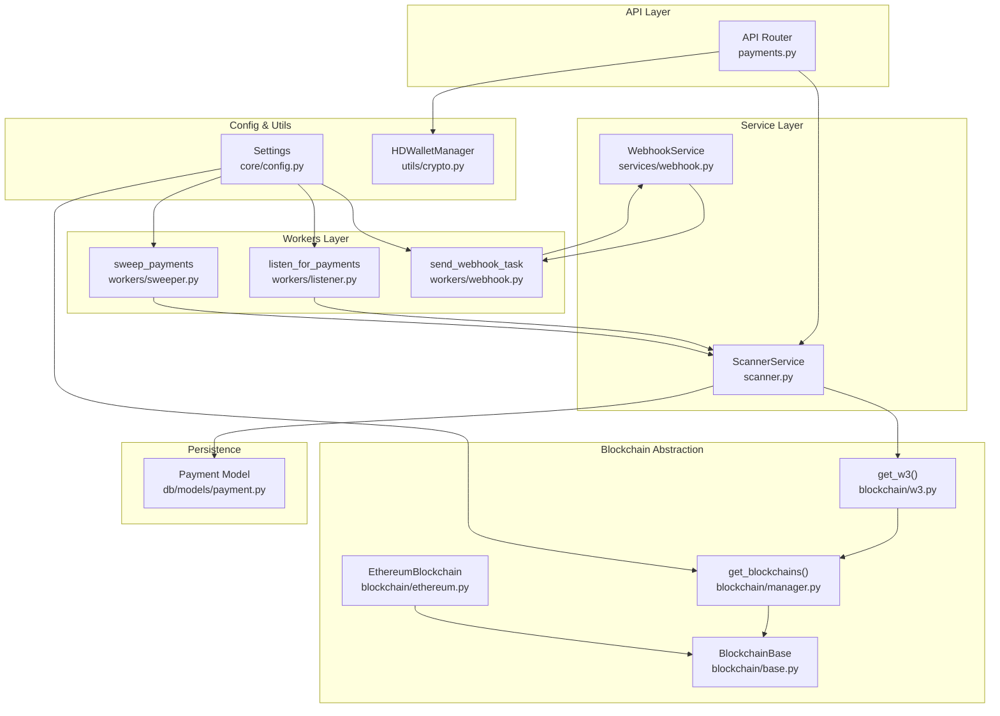
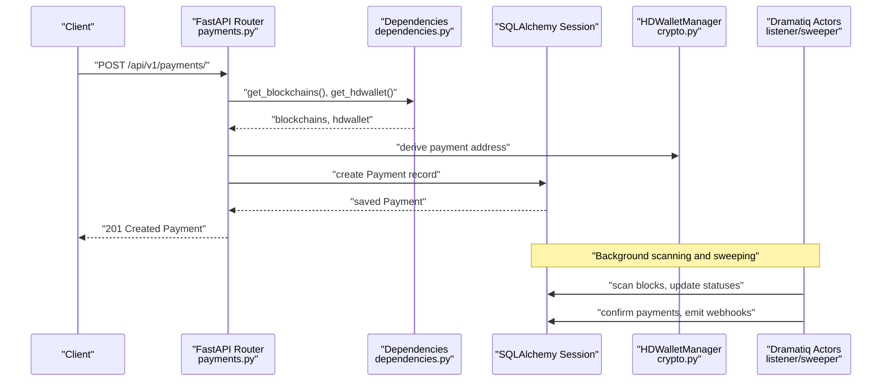
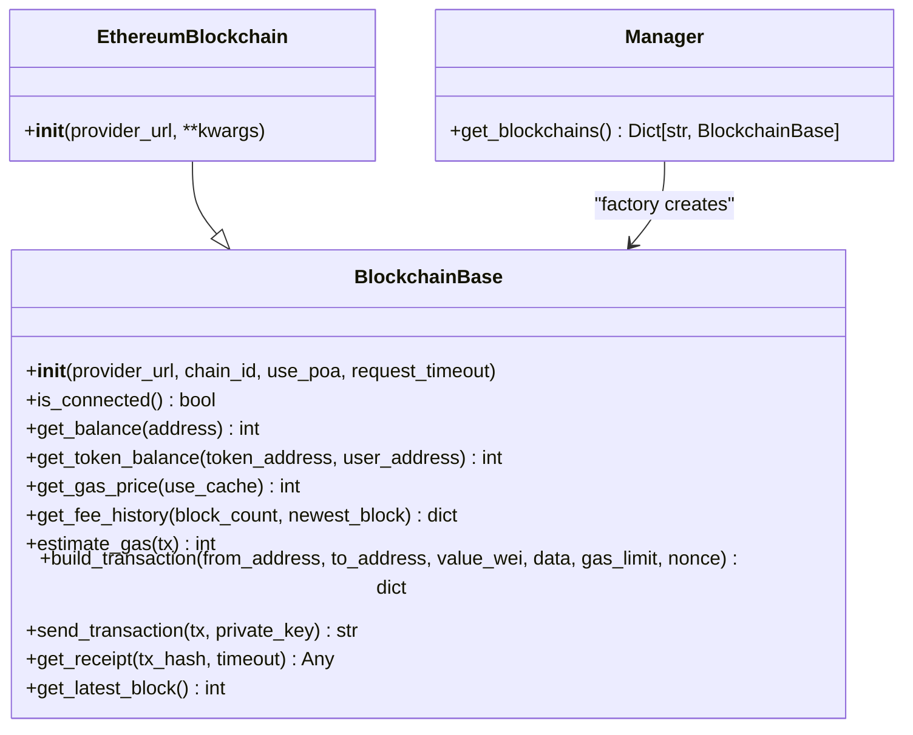
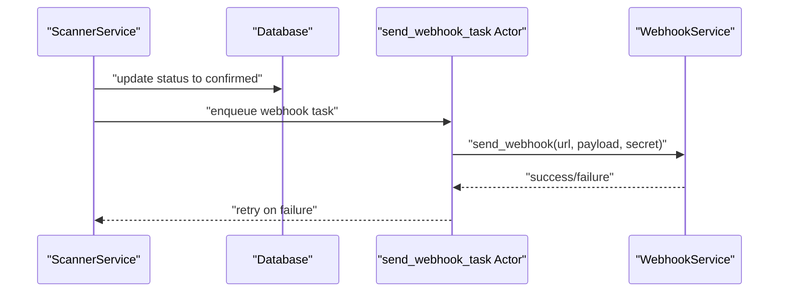
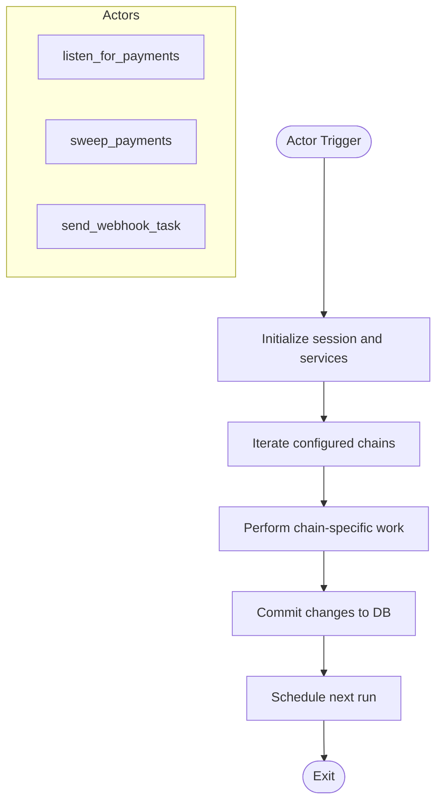
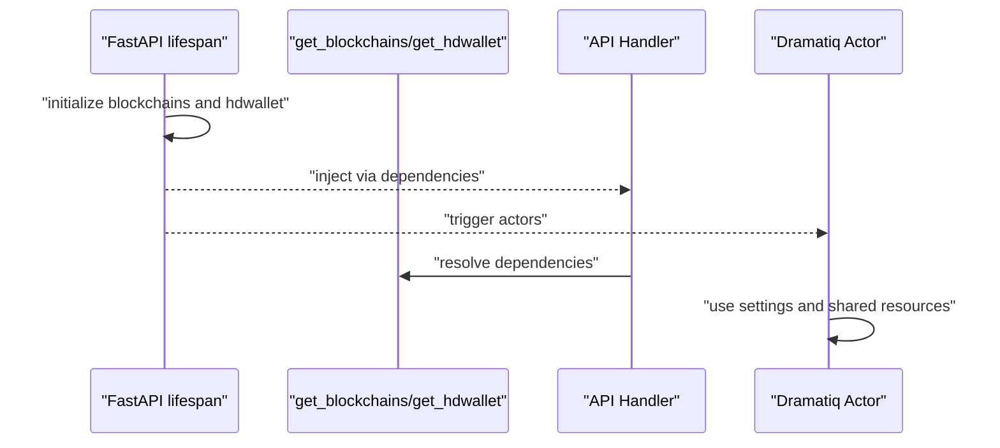
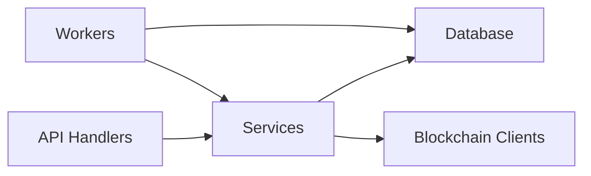
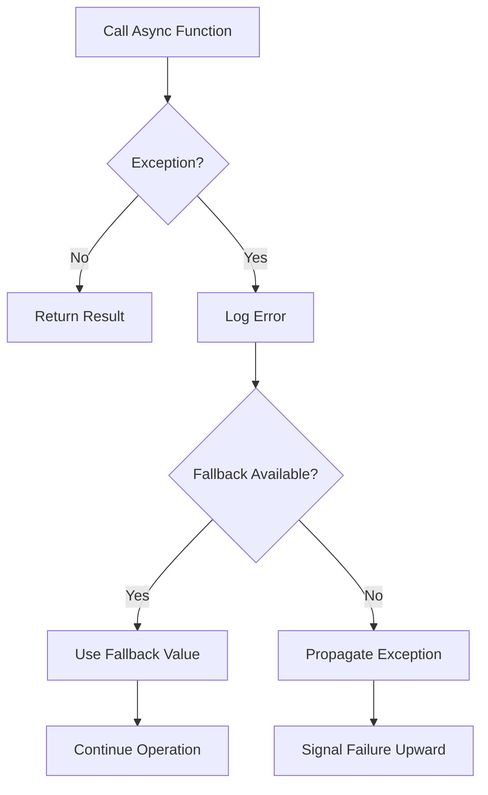
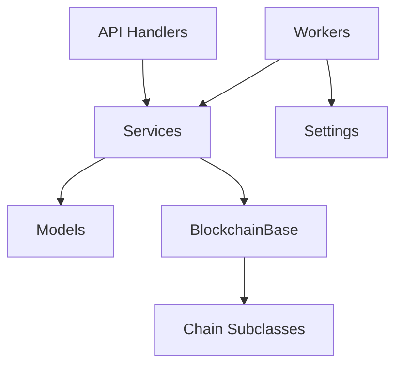

# Architectural Patterns and Design Principles

<cite>
**Referenced Files in This Document**
- [server.py](file://server.py)
- [app/blockchain/manager.py](file://app/blockchain/manager.py)
- [app/blockchain/base.py](file://app/blockchain/base.py)
- [app/blockchain/ethereum.py](file://app/blockchain/ethereum.py)
- [app/blockchain/w3.py](file://app/blockchain/w3.py)
- [app/api/v1/payments.py](file://app/api/v1/payments.py)
- [app/api/dependencies.py](file://app/api/dependencies.py)
- [app/services/blockchain/scanner.py](file://app/services/blockchain/scanner.py)
- [app/services/webhook.py](file://app/services/webhook.py)
- [app/workers/listener.py](file://app/workers/listener.py)
- [app/workers/sweeper.py](file://app/workers/sweeper.py)
- [app/workers/webhook.py](file://app/workers/webhook.py)
- [app/utils/crypto.py](file://app/utils/crypto.py)
- [app/db/models/payment.py](file://app/db/models/payment.py)
- [app/core/config.py](file://app/core/config.py)
</cite>

## Table of Contents
1. [Introduction](#introduction)
2. [Project Structure](#project-structure)
3. [Core Components](#core-components)
4. [Architecture Overview](#architecture-overview)
5. [Detailed Component Analysis](#detailed-component-analysis)
6. [Dependency Analysis](#dependency-analysis)
7. [Performance Considerations](#performance-considerations)
8. [Troubleshooting Guide](#troubleshooting-guide)
9. [Conclusion](#conclusion)
10. [Appendices](#appendices)

## Introduction
This document analyzes the cTrip Payment Gateway codebase to extract and explain advanced architectural patterns and design principles that guide system design for distributed payment processing. It focuses on:
- Factory pattern implementation in blockchain manager
- Observer-like notification via webhook worker
- Worker pattern for background task processing
- Dependency injection via FastAPI lifespan and dependency providers
- Service layer architecture and layered system design
- Asynchronous operation handling, error propagation, and graceful degradation
- Architectural decision records, trade-offs, and design rationale
- Anti-patterns, refactoring strategies, and maintainability considerations

## Project Structure
The system follows a layered architecture:
- API layer (FastAPI routers) handles HTTP requests and delegates to services
- Service layer encapsulates business logic (scanning, sweeping, webhook delivery)
- Workers layer runs background tasks using Dramatiq actors
- Blockchain abstraction layer manages multiple chains via a factory-style initializer
- Persistence layer uses SQLAlchemy ORM models
- Utilities and configuration provide cryptographic and environment utilities

**Diagram sources**
- [server.py](file://server.py#L21-L47)
- [app/api/v1/payments.py](file://app/api/v1/payments.py#L1-L62)
- [app/api/dependencies.py](file://app/api/dependencies.py#L1-L15)
- [app/services/blockchain/scanner.py](file://app/services/blockchain/scanner.py#L1-L134)
- [app/services/webhook.py](file://app/services/webhook.py#L1-L45)
- [app/workers/listener.py](file://app/workers/listener.py#L1-L46)
- [app/workers/sweeper.py](file://app/workers/sweeper.py#L1-L40)
- [app/workers/webhook.py](file://app/workers/webhook.py#L1-L37)
- [app/blockchain/manager.py](file://app/blockchain/manager.py#L1-L33)
- [app/blockchain/base.py](file://app/blockchain/base.py#L1-L146)
- [app/blockchain/ethereum.py](file://app/blockchain/ethereum.py#L1-L7)
- [app/blockchain/w3.py](file://app/blockchain/w3.py#L1-L9)
- [app/db/models/payment.py](file://app/db/models/payment.py#L1-L74)
- [app/core/config.py](file://app/core/config.py#L1-L126)
- [app/utils/crypto.py](file://app/utils/crypto.py#L1-L90)

**Section sources**
- [server.py](file://server.py#L21-L47)
- [app/core/config.py](file://app/core/config.py#L1-L126)

## Core Components
- Blockchain abstraction and factory:
  - BlockchainBase defines async operations for balance, gas estimation, transaction building, signing, and receipts.
  - EthereumBlockchain extends base with chain-specific defaults.
  - get_blockchains() constructs a registry of blockchain instances keyed by chain name.
  - get_w3() resolves AsyncWeb3 clients from the registry.
- Service layer:
  - ScannerService scans blocks for incoming payments and confirms them after required confirmations, emitting webhooks.
  - WebhookService sends signed webhook payloads asynchronously.
- Workers:
  - listen_for_payments and sweep_payments are Dramatiq actors that run periodic scanning and sweeping cycles.
  - send_webhook_task is a Dramatiq actor that delivers webhooks asynchronously.
- API and DI:
  - FastAPI lifespan initializes global state (blockchains, HD wallet) and seeds chain states.
  - get_blockchains() and get_hdwallet() are dependency providers that inject shared resources.
- Persistence:
  - Payment model tracks payment lifecycle and metadata.
- Utilities:
  - HDWalletManager supports deterministic address derivation for payment addresses.

**Section sources**
- [app/blockchain/base.py](file://app/blockchain/base.py#L22-L146)
- [app/blockchain/ethereum.py](file://app/blockchain/ethereum.py#L1-L7)
- [app/blockchain/manager.py](file://app/blockchain/manager.py#L8-L33)
- [app/blockchain/w3.py](file://app/blockchain/w3.py#L1-L9)
- [app/services/blockchain/scanner.py](file://app/services/blockchain/scanner.py#L14-L134)
- [app/services/webhook.py](file://app/services/webhook.py#L10-L45)
- [app/workers/listener.py](file://app/workers/listener.py#L21-L46)
- [app/workers/sweeper.py](file://app/workers/sweeper.py#L19-L40)
- [app/workers/webhook.py](file://app/workers/webhook.py#L13-L37)
- [app/api/dependencies.py](file://app/api/dependencies.py#L5-L15)
- [app/db/models/payment.py](file://app/db/models/payment.py#L41-L74)
- [app/utils/crypto.py](file://app/utils/crypto.py#L5-L90)
- [server.py](file://server.py#L21-L47)

## Architecture Overview
The system employs a layered, event-driven design:
- API layer orchestrates request handling and delegates to services.
- Service layer encapsulates domain logic and coordinates persistence and blockchain interactions.
- Workers run periodic tasks independently using Dramatiq actors, decoupling long-running work from request latency.
- Blockchain abstraction centralizes chain-specific concerns behind a unified interface.
- Configuration drives chain selection and runtime behavior.

**Diagram sources**
- [app/api/v1/payments.py](file://app/api/v1/payments.py#L18-L54)
- [app/api/dependencies.py](file://app/api/dependencies.py#L5-L15)
- [app/utils/crypto.py](file://app/utils/crypto.py#L27-L46)
- [app/workers/listener.py](file://app/workers/listener.py#L29-L40)
- [app/workers/sweeper.py](file://app/workers/sweeper.py#L27-L34)

## Detailed Component Analysis

### Factory Pattern in Blockchain Manager
The blockchain manager implements a factory that constructs chain-specific blockchain clients from configuration. It selects implementations based on chain name and falls back to a default when configuration is missing.

Key characteristics:
- Centralized instantiation logic in get_blockchains()
- Registry pattern: returns a dictionary of chain name to blockchain instance
- Extensibility: adding new chains requires updating the factory switch and ensuring a subclass of BlockchainBase exists

**Diagram sources**
- [app/blockchain/base.py](file://app/blockchain/base.py#L22-L146)
- [app/blockchain/ethereum.py](file://app/blockchain/ethereum.py#L3-L7)
- [app/blockchain/manager.py](file://app/blockchain/manager.py#L8-L33)

**Section sources**
- [app/blockchain/manager.py](file://app/blockchain/manager.py#L8-L33)
- [app/blockchain/base.py](file://app/blockchain/base.py#L22-L146)
- [app/blockchain/ethereum.py](file://app/blockchain/ethereum.py#L1-L7)

### Observer Pattern in Webhook Notifications
The system uses an observer-like pattern for notifications:
- ScannerService observes payment state changes and triggers observers (webhook delivery).
- send_webhook_task acts as an observer actor that asynchronously delivers events.

**Diagram sources**
- [app/services/blockchain/scanner.py](file://app/services/blockchain/scanner.py#L117-L131)
- [app/workers/webhook.py](file://app/workers/webhook.py#L13-L37)
- [app/services/webhook.py](file://app/services/webhook.py#L10-L45)

**Section sources**
- [app/services/blockchain/scanner.py](file://app/services/blockchain/scanner.py#L117-L131)
- [app/workers/webhook.py](file://app/workers/webhook.py#L13-L37)
- [app/services/webhook.py](file://app/services/webhook.py#L10-L45)

### Worker Pattern in Background Task Processing
Background tasks are implemented as Dramatiq actors:
- listen_for_payments periodically scans for incoming payments and updates statuses
- sweep_payments periodically sweeps confirmed payments
- send_webhook_task asynchronously delivers webhook notifications

**Diagram sources**
- [app/workers/listener.py](file://app/workers/listener.py#L21-L46)
- [app/workers/sweeper.py](file://app/workers/sweeper.py#L19-L40)
- [app/workers/webhook.py](file://app/workers/webhook.py#L13-L37)

**Section sources**
- [app/workers/listener.py](file://app/workers/listener.py#L21-L46)
- [app/workers/sweeper.py](file://app/workers/sweeper.py#L19-L40)
- [app/workers/webhook.py](file://app/workers/webhook.py#L13-L37)

### Dependency Injection Patterns
The system uses FastAPI’s lifespan and dependency injection:
- Global initialization in lifespan sets app.state.blockchains and app.state.hdwallet
- get_blockchains() and get_hdwallet() are dependency providers that raise explicit errors if not initialized
- This ensures predictable resource sharing and avoids magic globals inside request handlers

**Diagram sources**
- [server.py](file://server.py#L21-L47)
- [app/api/dependencies.py](file://app/api/dependencies.py#L5-L15)

**Section sources**
- [server.py](file://server.py#L21-L47)
- [app/api/dependencies.py](file://app/api/dependencies.py#L5-L15)

### Service Layer Architecture and Layered Design
- API layer validates inputs and delegates to services
- Services encapsulate business logic and coordinate persistence and blockchain interactions
- Workers isolate long-running tasks from request paths
- Clear separation of concerns improves testability and maintainability

**Diagram sources**
- [app/api/v1/payments.py](file://app/api/v1/payments.py#L18-L54)
- [app/services/blockchain/scanner.py](file://app/services/blockchain/scanner.py#L14-L134)
- [app/workers/listener.py](file://app/workers/listener.py#L29-L40)

**Section sources**
- [app/api/v1/payments.py](file://app/api/v1/payments.py#L18-L54)
- [app/services/blockchain/scanner.py](file://app/services/blockchain/scanner.py#L14-L134)

### Asynchronous Operations, Error Propagation, and Graceful Degradation
- Asynchronous blockchain operations are implemented with AsyncWeb3 and awaited in services and workers
- Error propagation:
  - ScannerService logs detection and confirmation outcomes; exceptions are handled per-chain iteration
  - WebhookService returns booleans and logs failures; send_webhook_task raises to trigger Dramatiq retries
  - BlockchainBase wraps connection and gas estimation in try/catch blocks
- Graceful degradation:
  - Gas estimation falls back to defaults when provider calls fail
  - Missing chain configuration falls back to a default chain
  - Webhook delivery is retried by Dramatiq; absence of webhook URL does not block confirmation

**Diagram sources**
- [app/blockchain/base.py](file://app/blockchain/base.py#L86-L92)
- [app/blockchain/manager.py](file://app/blockchain/manager.py#L28-L32)
- [app/services/webhook.py](file://app/services/webhook.py#L39-L44)
- [app/workers/webhook.py](file://app/workers/webhook.py#L24-L36)

**Section sources**
- [app/blockchain/base.py](file://app/blockchain/base.py#L45-L92)
- [app/blockchain/manager.py](file://app/blockchain/manager.py#L28-L32)
- [app/services/webhook.py](file://app/services/webhook.py#L39-L44)
- [app/workers/webhook.py](file://app/workers/webhook.py#L24-L36)

### Architectural Decision Records and Trade-Offs
- Factory vs. DI container:
  - Chosen: explicit factory for deterministic chain registration from configuration
  - Trade-off: less dynamic than a full DI framework; easier to audit and test
- Observer-like webhooks:
  - Chosen: separate actor for delivery to decouple from confirmation logic
  - Trade-off: adds operational complexity; mitigated by retries and logging
- Worker pattern:
  - Chosen: Dramatiq actors for periodic tasks to avoid blocking API threads
  - Trade-off: requires Redis; increases deployment complexity
- Gas estimation fallback:
  - Chosen: conservative defaults to keep flows moving
  - Trade-off: potential overpayment; acceptable for UX continuity

[No sources needed since this section synthesizes decisions without quoting specific code]

### Anti-Patterns, Refactoring Strategies, and Maintainability
- Anti-patterns observed:
  - Magic globals: resolved by injecting via FastAPI lifespan and dependencies
  - Inline configuration parsing: centralized in Settings with validators
  - Blocking I/O in actors: addressed by using async operations and avoiding blocking loops
- Refactoring strategies:
  - Introduce a dedicated BlockchainRegistry singleton to centralize chain resolution and caching
  - Extract webhook signing into a shared utility to reduce duplication
  - Add circuit breaker around external RPC calls to prevent cascading failures
- Maintainability:
  - Keep chain-specific subclasses minimal and delegate heavy logic to base class
  - Use typed configuration and environment validation to catch misconfiguration early
  - Add structured logging and metrics for worker throughput and error rates

[No sources needed since this section provides general guidance]

## Dependency Analysis
The system exhibits low coupling and high cohesion:
- API depends on services and dependencies; services depend on models and blockchain abstractions
- Workers depend on services and configuration; they do not directly touch API routes
- BlockchainBase is the core abstraction; concrete chains extend it

**Diagram sources**
- [app/api/v1/payments.py](file://app/api/v1/payments.py#L18-L54)
- [app/services/blockchain/scanner.py](file://app/services/blockchain/scanner.py#L14-L134)
- [app/workers/listener.py](file://app/workers/listener.py#L29-L40)
- [app/blockchain/base.py](file://app/blockchain/base.py#L22-L146)
- [app/core/config.py](file://app/core/config.py#L44-L56)

**Section sources**
- [app/api/v1/payments.py](file://app/api/v1/payments.py#L18-L54)
- [app/services/blockchain/scanner.py](file://app/services/blockchain/scanner.py#L14-L134)
- [app/workers/listener.py](file://app/workers/listener.py#L29-L40)
- [app/blockchain/base.py](file://app/blockchain/base.py#L22-L146)
- [app/core/config.py](file://app/core/config.py#L44-L56)

## Performance Considerations
- Batch scanning: ScannerService processes blocks in batches to limit per-cycle work
- Gas cache: BlockchainBase caches gas price for a short duration to reduce RPC calls
- Async I/O: All blockchain operations are asynchronous to maximize throughput
- Retry and timeouts: WebhookService and AsyncWeb3 providers set timeouts to bound latency
- Actor scheduling: Workers schedule next runs with fixed delays to regulate load

[No sources needed since this section provides general guidance]

## Troubleshooting Guide
Common issues and diagnostics:
- Blockchain connectivity:
  - Use is_connected() checks and log provider URL errors
- Gas estimation failures:
  - Confirm fallback defaults are applied; inspect warnings and adjust buffers
- Webhook delivery failures:
  - Verify signatures and payload correctness; check actor retries and logs
- Worker scheduling:
  - Ensure Redis availability and actor startup; monitor scheduled runs

**Section sources**
- [app/blockchain/base.py](file://app/blockchain/base.py#L45-L50)
- [app/blockchain/base.py](file://app/blockchain/base.py#L86-L92)
- [app/services/webhook.py](file://app/services/webhook.py#L39-L44)
- [app/workers/webhook.py](file://app/workers/webhook.py#L24-L36)

## Conclusion
The cTrip Payment Gateway demonstrates robust architectural patterns suited for distributed payment processing:
- Factory pattern for extensible blockchain client management
- Observer-like webhook delivery via asynchronous actors
- Worker pattern for reliable background processing
- Clean dependency injection via FastAPI lifespan and providers
- Strong separation of concerns across layers
- Practical error handling and graceful degradation strategies

These patterns provide a blueprint for building scalable, maintainable payment infrastructure with clear boundaries, observable behavior, and resilient operations.

[No sources needed since this section summarizes without analyzing specific files]

## Appendices
- Configuration keys and roles are defined in Settings, including chains, RPC endpoints, secrets, and webhook parameters.
- Payment model enumerations define lifecycle states and support persistence.

**Section sources**
- [app/core/config.py](file://app/core/config.py#L10-L126)
- [app/db/models/payment.py](file://app/db/models/payment.py#L21-L58)