# Custom Chain Implementation

<cite>
**Referenced Files in This Document**
- [base.py](https://github.com/rakibhossain72/ctrip/blob/main/app/blockchain/base.py)
- [manager.py](https://github.com/rakibhossain72/ctrip/blob/main/app/blockchain/manager.py)
- [w3.py](https://github.com/rakibhossain72/ctrip/blob/main/app/blockchain/w3.py)
- [ethereum.py](https://github.com/rakibhossain72/ctrip/blob/main/app/blockchain/ethereum.py)
- [bsc.py](https://github.com/rakibhossain72/ctrip/blob/main/app/blockchain/bsc.py)
- [anvil.py](https://github.com/rakibhossain72/ctrip/blob/main/app/blockchain/anvil.py)
- [config.py](https://github.com/rakibhossain72/ctrip/blob/main/app/core/config.py)
- [chains.yaml](https://github.com/rakibhossain72/ctrip/blob/main/chains.yaml)
- [scanner.py](https://github.com/rakibhossain72/ctrip/blob/main/app/services/blockchain/scanner.py)
- [sweeper.py](https://github.com/rakibhossain72/ctrip/blob/main/app/services/blockchain/sweeper.py)
- [server.py](https://github.com/rakibhossain72/ctrip/blob/main/server.py)
- [ERC20.json](https://github.com/rakibhossain72/ctrip/blob/main/app/blockchain/ABI/ERC20.json)
</cite>

## Table of Contents
1. [Introduction](#introduction)
2. [Project Structure](#project-structure)
3. [Core Components](#core-components)
4. [Architecture Overview](#architecture-overview)
5. [Detailed Component Analysis](#detailed-component-analysis)
6. [Dependency Analysis](#dependency-analysis)
7. [Performance Considerations](#performance-considerations)
8. [Troubleshooting Guide](#troubleshooting-guide)
9. [Conclusion](#conclusion)
10. [Appendices](#appendices)

## Introduction
This document explains how to implement custom blockchain chains in the cTrip Payment Gateway. It focuses on the BlockchainBase class architecture, inheritance patterns, and the factory-based blockchain manager. You will learn how to configure RPC providers, manage gas pricing (including EIP-1559), build transactions, enable POA middleware, and integrate new chains using the existing factory pattern. Practical examples show how to extend the base class for new networks, configure chain parameters, and handle common issues such as gas estimation failures, connectivity problems, and signing variations across EVM-compatible networks.

## Project Structure
The blockchain subsystem is organized around a shared base class with specialized subclasses for supported networks, a configuration-driven factory, and convenience wrappers for Web3 access.

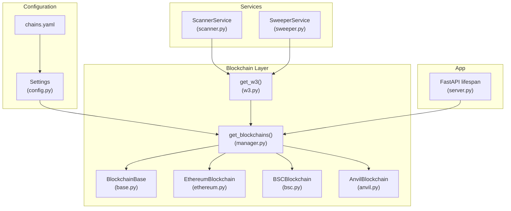

**Diagram sources**
- [base.py](https://github.com/rakibhossain72/ctrip/blob/main/app/blockchain/base.py#L22-L146)
- [ethereum.py](https://github.com/rakibhossain72/ctrip/blob/main/app/blockchain/ethereum.py#L1-L7)
- [bsc.py](https://github.com/rakibhossain72/ctrip/blob/main/app/blockchain/bsc.py#L1-L7)
- [anvil.py](https://github.com/rakibhossain72/ctrip/blob/main/app/blockchain/anvil.py#L1-L57)
- [manager.py](https://github.com/rakibhossain72/ctrip/blob/main/app/blockchain/manager.py#L1-L33)
- [w3.py](https://github.com/rakibhossain72/ctrip/blob/main/app/blockchain/w3.py#L1-L9)
- [config.py](https://github.com/rakibhossain72/ctrip/blob/main/app/core/config.py#L1-L126)
- [chains.yaml](https://github.com/rakibhossain72/ctrip/blob/main/chains.yaml#L1-L24)
- [scanner.py](https://github.com/rakibhossain72/ctrip/blob/main/app/services/blockchain/scanner.py#L1-L134)
- [sweeper.py](https://github.com/rakibhossain72/ctrip/blob/main/app/services/blockchain/sweeper.py#L1-L54)
- [server.py](https://github.com/rakibhossain72/ctrip/blob/main/server.py#L21-L47)

**Section sources**
- [base.py](https://github.com/rakibhossain72/ctrip/blob/main/app/blockchain/base.py#L1-L146)
- [manager.py](https://github.com/rakibhossain72/ctrip/blob/main/app/blockchain/manager.py#L1-L33)
- [w3.py](https://github.com/rakibhossain72/ctrip/blob/main/app/blockchain/w3.py#L1-L9)
- [config.py](https://github.com/rakibhossain72/ctrip/blob/main/app/core/config.py#L1-L126)
- [chains.yaml](https://github.com/rakibhossain72/ctrip/blob/main/chains.yaml#L1-L24)
- [scanner.py](https://github.com/rakibhossain72/ctrip/blob/main/app/services/blockchain/scanner.py#L1-L134)
- [sweeper.py](https://github.com/rakibhossain72/ctrip/blob/main/app/services/blockchain/sweeper.py#L1-L54)
- [server.py](https://github.com/rakibhossain72/ctrip/blob/main/server.py#L21-L47)

## Core Components
- BlockchainBase: Shared async interface for RPC connectivity, gas management, transaction building, and receipts. Supports POA middleware injection and EIP-1559 fee calculation fallback.
- Specialized chains:
  - EthereumBlockchain: Sets chain ID for Ethereum Mainnet and disables POA.
  - BSCBlockchain: Sets chain ID for BSC Mainnet and enables POA middleware.
  - AnvilBlockchain: Adds developer utilities (mining, impersonation, balance manipulation) while inheriting base capabilities.
- Factory and access:
  - get_blockchains(): Builds a registry from configuration, instantiating specialized or generic base classes per chain.
  - get_w3(): Provides AsyncWeb3 instances keyed by chain name.
- Configuration:
  - Settings: Loads chains from chains.yaml and validates secrets.
  - chains.yaml: Declares chain name, RPC URL, and optional token metadata.

Key capabilities:
- Connectivity checks and balance queries (native and ERC20).
- Gas caching and estimation with safe defaults.
- Transaction builder with EIP-1559 or legacy gas pricing.
- Receipt polling with timeouts.

**Section sources**
- [base.py](https://github.com/rakibhossain72/ctrip/blob/main/app/blockchain/base.py#L22-L146)
- [ethereum.py](https://github.com/rakibhossain72/ctrip/blob/main/app/blockchain/ethereum.py#L1-L7)
- [bsc.py](https://github.com/rakibhossain72/ctrip/blob/main/app/blockchain/bsc.py#L1-L7)
- [anvil.py](https://github.com/rakibhossain72/ctrip/blob/main/app/blockchain/anvil.py#L1-L57)
- [manager.py](https://github.com/rakibhossain72/ctrip/blob/main/app/blockchain/manager.py#L1-L33)
- [w3.py](https://github.com/rakibhossain72/ctrip/blob/main/app/blockchain/w3.py#L1-L9)
- [config.py](https://github.com/rakibhossain72/ctrip/blob/main/app/core/config.py#L1-L126)
- [chains.yaml](https://github.com/rakibhossain72/ctrip/blob/main/chains.yaml#L1-L24)

## Architecture Overview
The system initializes blockchain clients during app startup, registers them in app.state, and exposes them via get_w3(). Services consume these clients to scan blocks, detect payments, and perform sweeping.

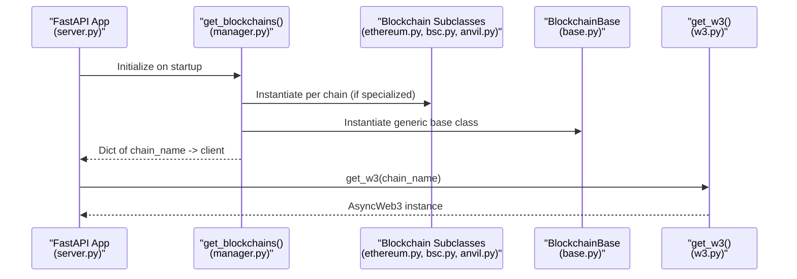

**Diagram sources**
- [server.py](https://github.com/rakibhossain72/ctrip/blob/main/server.py#L21-L47)
- [manager.py](https://github.com/rakibhossain72/ctrip/blob/main/app/blockchain/manager.py#L8-L33)
- [ethereum.py](https://github.com/rakibhossain72/ctrip/blob/main/app/blockchain/ethereum.py#L1-L7)
- [bsc.py](https://github.com/rakibhossain72/ctrip/blob/main/app/blockchain/bsc.py#L1-L7)
- [anvil.py](https://github.com/rakibhossain72/ctrip/blob/main/app/blockchain/anvil.py#L1-L57)
- [base.py](https://github.com/rakibhossain72/ctrip/blob/main/app/blockchain/base.py#L22-L146)
- [w3.py](https://github.com/rakibhossain72/ctrip/blob/main/app/blockchain/w3.py#L1-L9)

## Detailed Component Analysis

### BlockchainBase Class
BlockchainBase encapsulates:
- AsyncWeb3 initialization with configurable timeout.
- Optional POA middleware injection.
- Gas cache with duration control.
- EIP-1559 fee history retrieval and fallback to legacy gas pricing.
- Transaction building with nonce resolution, chain ID, and gas limits.
- Transaction signing and receipt polling.

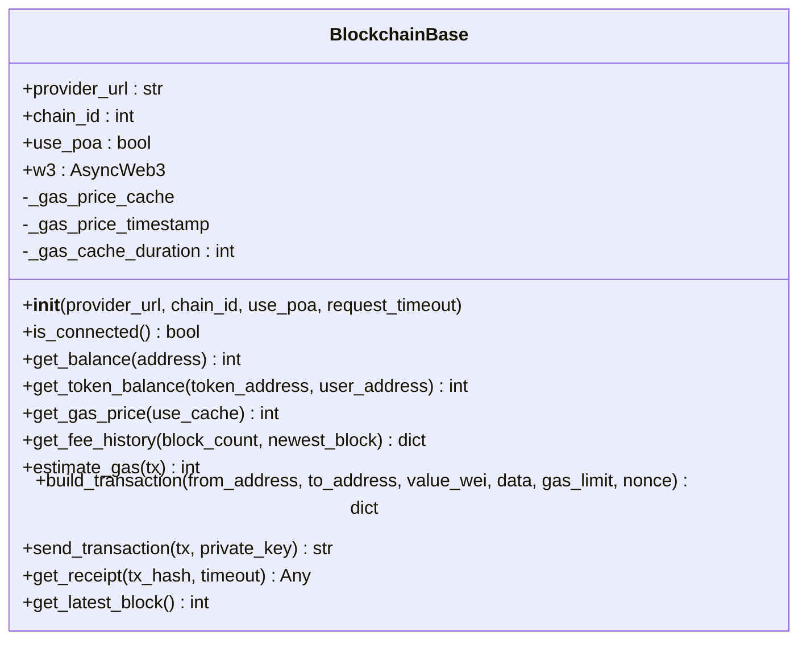

**Diagram sources**
- [base.py](https://github.com/rakibhossain72/ctrip/blob/main/app/blockchain/base.py#L22-L146)

**Section sources**
- [base.py](https://github.com/rakibhossain72/ctrip/blob/main/app/blockchain/base.py#L22-L146)

### Specialized Chain Classes
- EthereumBlockchain: Hardcodes chain ID for Ethereum Mainnet and disables POA.
- BSCBlockchain: Hardcodes chain ID for BSC Mainnet and enables POA middleware.
- AnvilBlockchain: Inherits base behavior and adds developer utilities for mining, impersonation, and balance manipulation.

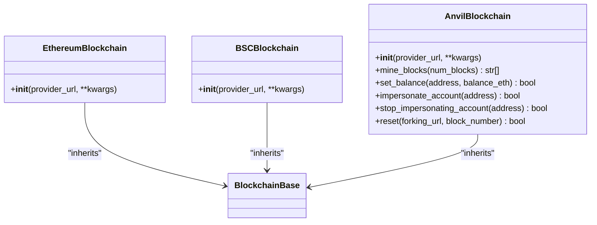

**Diagram sources**
- [base.py](https://github.com/rakibhossain72/ctrip/blob/main/app/blockchain/base.py#L22-L146)
- [ethereum.py](https://github.com/rakibhossain72/ctrip/blob/main/app/blockchain/ethereum.py#L1-L7)
- [bsc.py](https://github.com/rakibhossain72/ctrip/blob/main/app/blockchain/bsc.py#L1-L7)
- [anvil.py](https://github.com/rakibhossain72/ctrip/blob/main/app/blockchain/anvil.py#L1-L57)

**Section sources**
- [ethereum.py](https://github.com/rakibhossain72/ctrip/blob/main/app/blockchain/ethereum.py#L1-L7)
- [bsc.py](https://github.com/rakibhossain72/ctrip/blob/main/app/blockchain/bsc.py#L1-L7)
- [anvil.py](https://github.com/rakibhossain72/ctrip/blob/main/app/blockchain/anvil.py#L1-L57)

### Factory Pattern and Configuration
The factory builds a registry of blockchain clients from configuration. If a specialized subclass exists for a chain, it is instantiated; otherwise, a generic base class is used. A fallback ensures at least a local Anvil client is available when configuration is missing.

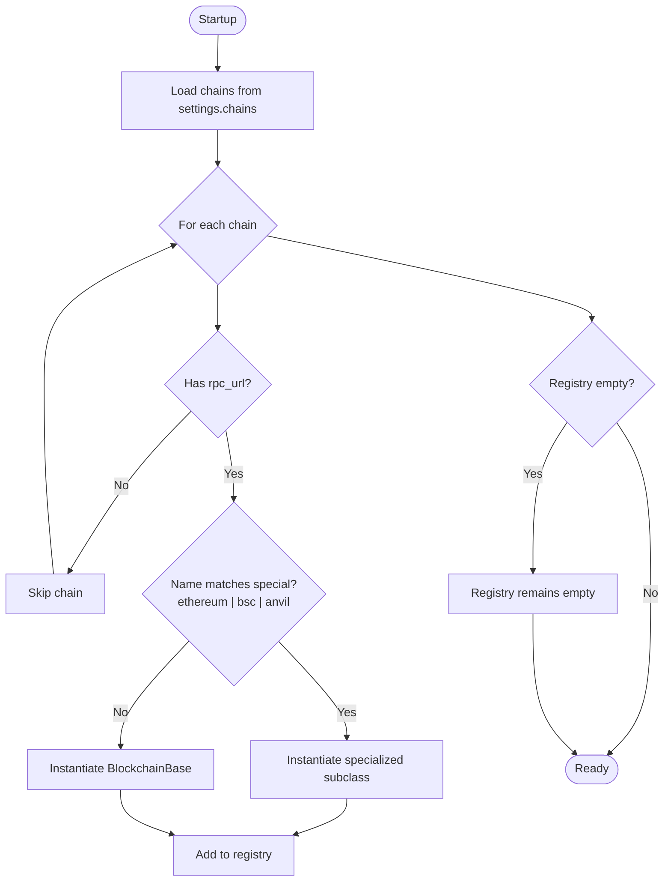

**Diagram sources**
- [manager.py](https://github.com/rakibhossain72/ctrip/blob/main/app/blockchain/manager.py#L8-L33)
- [config.py](https://github.com/rakibhossain72/ctrip/blob/main/app/core/config.py#L44-L57)

**Section sources**
- [manager.py](https://github.com/rakibhossain72/ctrip/blob/main/app/blockchain/manager.py#L1-L33)
- [config.py](https://github.com/rakibhossain72/ctrip/blob/main/app/core/config.py#L1-L126)
- [chains.yaml](https://github.com/rakibhossain72/ctrip/blob/main/chains.yaml#L1-L24)

### Web3 Access Wrapper
The get_w3() function retrieves a configured AsyncWeb3 instance by chain name, raising an error if the chain is not configured.

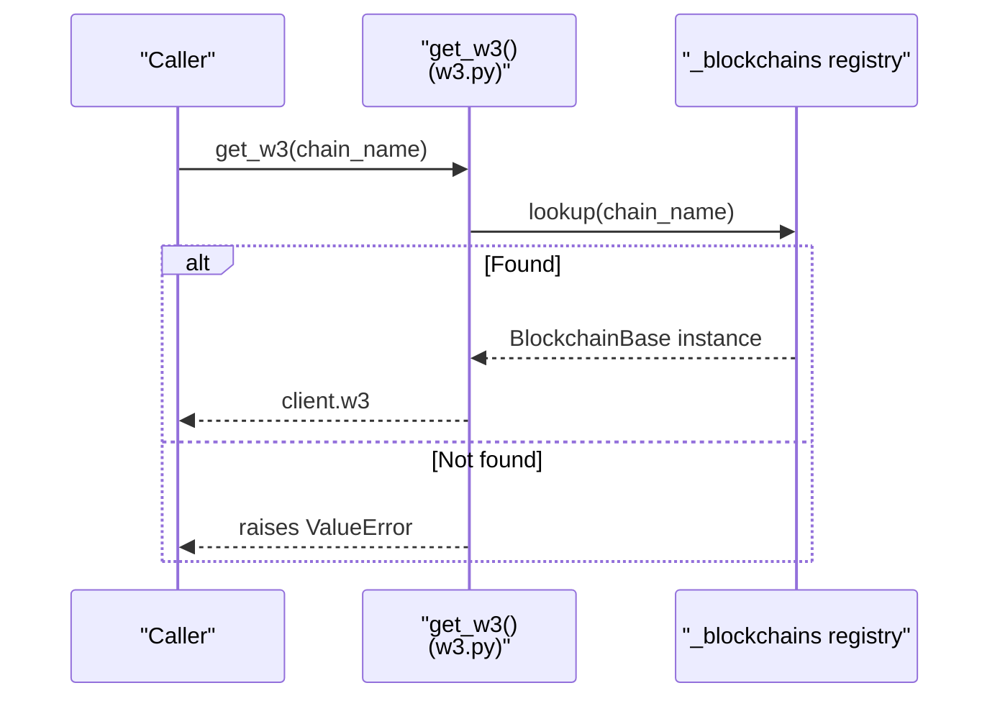

**Diagram sources**
- [w3.py](https://github.com/rakibhossain72/ctrip/blob/main/app/blockchain/w3.py#L1-L9)
- [manager.py](https://github.com/rakibhossain72/ctrip/blob/main/app/blockchain/manager.py#L1-L33)

**Section sources**
- [w3.py](https://github.com/rakibhossain72/ctrip/blob/main/app/blockchain/w3.py#L1-L9)

### Transaction Building and Gas Management
The build_transaction method:
- Resolves checksum addresses and nonce.
- Attempts EIP-1559 pricing using fee_history and sets maxFeePerGas and maxPriorityFeePerGas.
- Falls back to legacy gasPrice if fee_history fails.
- Estimates gas with a safety margin and applies a gas limit multiplier.
- Returns a complete transaction dict ready for signing.

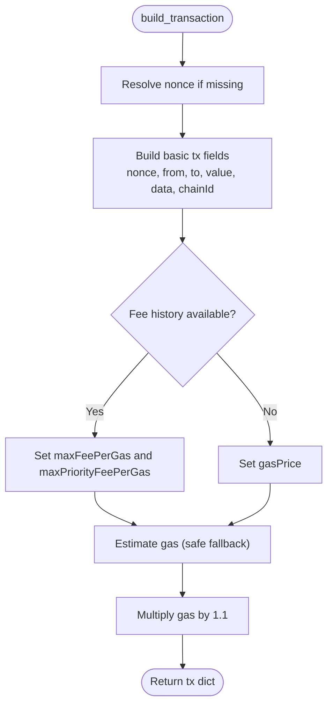

**Diagram sources**
- [base.py](https://github.com/rakibhossain72/ctrip/blob/main/app/blockchain/base.py#L93-L133)

**Section sources**
- [base.py](https://github.com/rakibhossain72/ctrip/blob/main/app/blockchain/base.py#L65-L133)

### POA Middleware Integration
POA middleware is injected automatically when use_poa is enabled during initialization. BSC uses POA, so its constructor enables it.

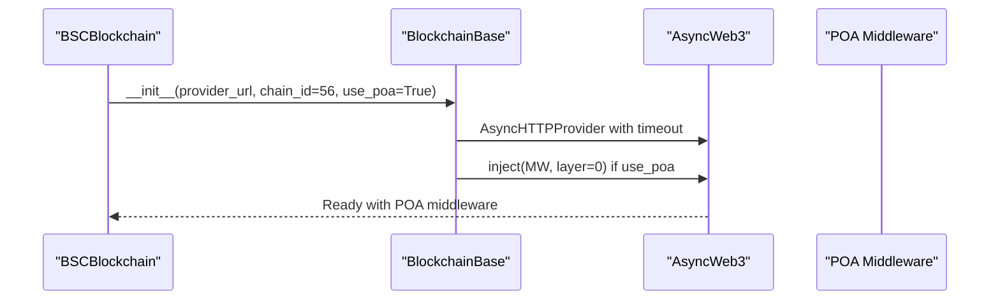

**Diagram sources**
- [bsc.py](https://github.com/rakibhossain72/ctrip/blob/main/app/blockchain/bsc.py#L1-L7)
- [base.py](https://github.com/rakibhossain72/ctrip/blob/main/app/blockchain/base.py#L34-L43)

**Section sources**
- [bsc.py](https://github.com/rakibhossain72/ctrip/blob/main/app/blockchain/bsc.py#L1-L7)
- [base.py](https://github.com/rakibhossain72/ctrip/blob/main/app/blockchain/base.py#L34-L43)

### EIP-1559 Fee Calculation Integration
Fee history is fetched and used to compute suggested prices. If unavailable, legacy gas pricing is used as a fallback.

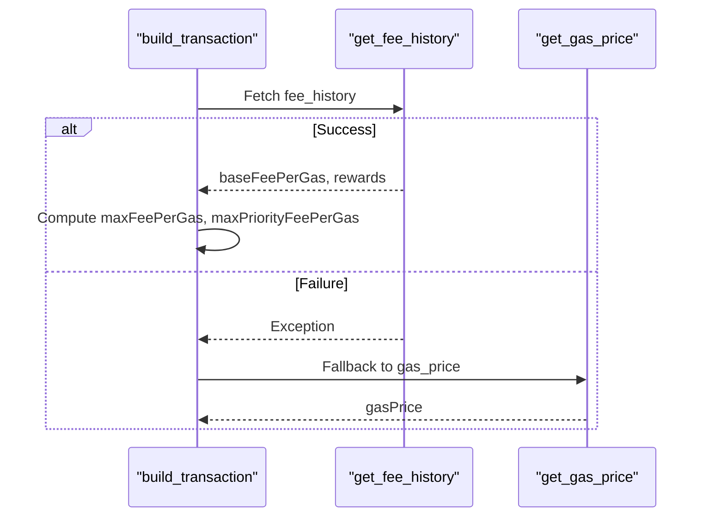

**Diagram sources**
- [base.py](https://github.com/rakibhossain72/ctrip/blob/main/app/blockchain/base.py#L82-L127)

**Section sources**
- [base.py](https://github.com/rakibhossain72/ctrip/blob/main/app/blockchain/base.py#L82-L127)

### Service Integration Examples
- ScannerService scans blocks for native and ERC20 payments using get_w3(chain_name).
- SweeperService uses get_w3(chain_name) and settings.private_key to settle funds.

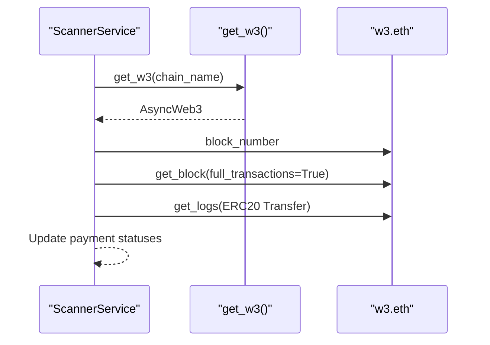

**Diagram sources**
- [scanner.py](https://github.com/rakibhossain72/ctrip/blob/main/app/services/blockchain/scanner.py#L20-L95)
- [w3.py](https://github.com/rakibhossain72/ctrip/blob/main/app/blockchain/w3.py#L6-L9)

**Section sources**
- [scanner.py](https://github.com/rakibhossain72/ctrip/blob/main/app/services/blockchain/scanner.py#L1-L134)
- [sweeper.py](https://github.com/rakibhossain72/ctrip/blob/main/app/services/blockchain/sweeper.py#L1-L54)
- [w3.py](https://github.com/rakibhossain72/ctrip/blob/main/app/blockchain/w3.py#L1-L9)

## Dependency Analysis
The following diagram shows module-level dependencies among blockchain components and configuration.

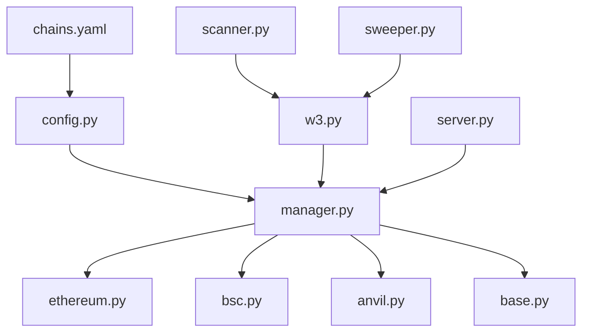

**Diagram sources**
- [config.py](https://github.com/rakibhossain72/ctrip/blob/main/app/core/config.py#L1-L126)
- [chains.yaml](https://github.com/rakibhossain72/ctrip/blob/main/chains.yaml#L1-L24)
- [manager.py](https://github.com/rakibhossain72/ctrip/blob/main/app/blockchain/manager.py#L1-L33)
- [w3.py](https://github.com/rakibhossain72/ctrip/blob/main/app/blockchain/w3.py#L1-L9)
- [base.py](https://github.com/rakibhossain72/ctrip/blob/main/app/blockchain/base.py#L1-L146)
- [ethereum.py](https://github.com/rakibhossain72/ctrip/blob/main/app/blockchain/ethereum.py#L1-L7)
- [bsc.py](https://github.com/rakibhossain72/ctrip/blob/main/app/blockchain/bsc.py#L1-L7)
- [anvil.py](https://github.com/rakibhossain72/ctrip/blob/main/app/blockchain/anvil.py#L1-L57)
- [scanner.py](https://github.com/rakibhossain72/ctrip/blob/main/app/services/blockchain/scanner.py#L1-L134)
- [sweeper.py](https://github.com/rakibhossain72/ctrip/blob/main/app/services/blockchain/sweeper.py#L1-L54)
- [server.py](https://github.com/rakibhossain72/ctrip/blob/main/server.py#L21-L47)

**Section sources**
- [config.py](https://github.com/rakibhossain72/ctrip/blob/main/app/core/config.py#L1-L126)
- [chains.yaml](https://github.com/rakibhossain72/ctrip/blob/main/chains.yaml#L1-L24)
- [manager.py](https://github.com/rakibhossain72/ctrip/blob/main/app/blockchain/manager.py#L1-L33)
- [w3.py](https://github.com/rakibhossain72/ctrip/blob/main/app/blockchain/w3.py#L1-L9)
- [base.py](https://github.com/rakibhossain72/ctrip/blob/main/app/blockchain/base.py#L1-L146)
- [ethereum.py](https://github.com/rakibhossain72/ctrip/blob/main/app/blockchain/ethereum.py#L1-L7)
- [bsc.py](https://github.com/rakibhossain72/ctrip/blob/main/app/blockchain/bsc.py#L1-L7)
- [anvil.py](https://github.com/rakibhossain72/ctrip/blob/main/app/blockchain/anvil.py#L1-L57)
- [scanner.py](https://github.com/rakibhossain72/ctrip/blob/main/app/services/blockchain/scanner.py#L1-L134)
- [sweeper.py](https://github.com/rakibhossain72/ctrip/blob/main/app/services/blockchain/sweeper.py#L1-L54)
- [server.py](https://github.com/rakibhossain72/ctrip/blob/main/server.py#L21-L47)

## Performance Considerations
- Gas caching: The base class caches gas price for a short duration to reduce RPC calls.
- Gas estimation fallback: On failure, a conservative default is used to avoid blocking transactions.
- EIP-1559 prioritization: Prefer fee_history pricing when available for better fee control.
- Batch scanning: Services scan blocks in batches to limit per-iteration work.
- Middleware overhead: POA middleware adds minimal overhead but is essential for BSC compatibility.

[No sources needed since this section provides general guidance]

## Troubleshooting Guide
Common issues and resolutions:
- Gas estimation failures:
  - Symptom: Transactions fail or stall during estimation.
  - Resolution: The base class falls back to conservative defaults; review transaction data and ensure proper ABI for contract interactions.
  - Reference: [base.py](https://github.com/rakibhossain72/ctrip/blob/main/app/blockchain/base.py#L86-L92)

- Network connectivity errors:
  - Symptom: is_connected returns false or calls raise exceptions.
  - Resolution: Verify RPC URL and timeout settings; check firewall and provider availability.
  - Reference: [base.py](https://github.com/rakibhossain72/ctrip/blob/main/app/blockchain/base.py#L45-L50)

- Transaction signing variations:
  - Symptom: Transactions rejected due to chain ID mismatch or nonce errors.
  - Resolution: Ensure chainId is set correctly; resolve pending nonce via provider; sign with the correct private key.
  - Reference: [base.py](https://github.com/rakibhossain72/ctrip/blob/main/app/blockchain/base.py#L104-L114), [base.py](https://github.com/rakibhossain72/ctrip/blob/main/app/blockchain/base.py#L135-L139)

- POA-specific issues on BSC:
  - Symptom: Blocks rejected or extradata errors.
  - Resolution: Enable POA middleware via use_poa; specialized BSC class already handles this.
  - Reference: [bsc.py](https://github.com/rakibhossain72/ctrip/blob/main/app/blockchain/bsc.py#L1-L7), [base.py](https://github.com/rakibhossain72/ctrip/blob/main/app/blockchain/base.py#L38-L39)

- Missing chain configuration:
  - Symptom: get_w3 raises a "not configured" error.
  - Resolution: Add chain entries to chains.yaml and restart the app; the factory provides a fallback Anvil client if config is empty.
  - Reference: [w3.py](https://github.com/rakibhossain72/ctrip/blob/main/app/blockchain/w3.py#L6-L9), [manager.py](https://github.com/rakibhossain72/ctrip/blob/main/app/blockchain/manager.py#L28-L32)

**Section sources**
- [base.py](https://github.com/rakibhossain72/ctrip/blob/main/app/blockchain/base.py#L45-L50)
- [base.py](https://github.com/rakibhossain72/ctrip/blob/main/app/blockchain/base.py#L86-L92)
- [base.py](https://github.com/rakibhossain72/ctrip/blob/main/app/blockchain/base.py#L104-L114)
- [base.py](https://github.com/rakibhossain72/ctrip/blob/main/app/blockchain/base.py#L135-L139)
- [bsc.py](https://github.com/rakibhossain72/ctrip/blob/main/app/blockchain/bsc.py#L1-L7)
- [w3.py](https://github.com/rakibhossain72/ctrip/blob/main/app/blockchain/w3.py#L6-L9)
- [manager.py](https://github.com/rakibhossain72/ctrip/blob/main/app/blockchain/manager.py#L28-L32)

## Conclusion
The cTrip Payment Gateway provides a robust, extensible foundation for multi-chain support. By inheriting from BlockchainBase and registering chains via the factory, you can quickly add new EVM-compatible networks. The design cleanly separates concerns: configuration-driven instantiation, shared transaction logic, and service-layer consumption. Following the patterns documented here ensures correct RPC configuration, gas management, POA handling, and integration with the broader application lifecycle.

[No sources needed since this section summarizes without analyzing specific files]

## Appendices

### Step-by-Step: Implementing a New Custom Chain
1. Create a new subclass in app/blockchain/<your_chain>.py:
   - Import BlockchainBase.
   - Override __init__ to set chain_id and use_poa as needed.
   - Example reference: [ethereum.py](https://github.com/rakibhossain72/ctrip/blob/main/app/blockchain/ethereum.py#L1-L7), [bsc.py](https://github.com/rakibhossain72/ctrip/blob/main/app/blockchain/bsc.py#L1-L7)

2. Register the subclass in the factory:
   - Extend get_blockchains() to instantiate your subclass when name matches.
   - Example reference: [manager.py](https://github.com/rakibhossain72/ctrip/blob/main/app/blockchain/manager.py#L8-L27)

3. Configure the chain:
   - Add an entry to chains.yaml with name and rpc_url.
   - Optionally include token metadata.
   - Example reference: [chains.yaml](https://github.com/rakibhossain72/ctrip/blob/main/chains.yaml#L12-L24)

4. Verify connectivity and transactions:
   - Use get_w3(chain_name) in services to access AsyncWeb3.
   - Test balance, gas estimation, and transaction building.
   - Example reference: [w3.py](https://github.com/rakibhossain72/ctrip/blob/main/app/blockchain/w3.py#L1-L9), [base.py](https://github.com/rakibhossain72/ctrip/blob/main/app/blockchain/base.py#L93-L133)

5. Handle network-specific optimizations:
   - Enable POA middleware if required (already handled in base class).
   - Integrate EIP-1559 pricing automatically via fee_history.
   - Reference: [base.py](https://github.com/rakibhossain72/ctrip/blob/main/app/blockchain/base.py#L38-L39), [base.py](https://github.com/rakibhossain72/ctrip/blob/main/app/blockchain/base.py#L116-L127)

6. Integrate with services:
   - Use ScannerService and SweeperService with get_w3(chain_name).
   - Reference: [scanner.py](https://github.com/rakibhossain72/ctrip/blob/main/app/services/blockchain/scanner.py#L20-L95), [sweeper.py](https://github.com/rakibhossain72/ctrip/blob/main/app/services/blockchain/sweeper.py#L16-L53)

7. Handle signing and private keys:
   - Sign transactions using Account.from_key and sign_transaction.
   - Reference: [base.py](https://github.com/rakibhossain72/ctrip/blob/main/app/blockchain/base.py#L135-L139)

8. Manage ABI dependencies:
   - ERC20 ABI is loaded by base class; ensure your contracts align with expected ABIs.
   - Reference: [base.py](https://github.com/rakibhossain72/ctrip/blob/main/app/blockchain/base.py#L15-L19), [ERC20.json](https://github.com/rakibhossain72/ctrip/blob/main/app/blockchain/ABI/ERC20.json#L1-L1)

**Section sources**
- [ethereum.py](https://github.com/rakibhossain72/ctrip/blob/main/app/blockchain/ethereum.py#L1-L7)
- [bsc.py](https://github.com/rakibhossain72/ctrip/blob/main/app/blockchain/bsc.py#L1-L7)
- [manager.py](https://github.com/rakibhossain72/ctrip/blob/main/app/blockchain/manager.py#L8-L27)
- [chains.yaml](https://github.com/rakibhossain72/ctrip/blob/main/chains.yaml#L12-L24)
- [w3.py](https://github.com/rakibhossain72/ctrip/blob/main/app/blockchain/w3.py#L1-L9)
- [base.py](https://github.com/rakibhossain72/ctrip/blob/main/app/blockchain/base.py#L15-L19)
- [base.py](https://github.com/rakibhossain72/ctrip/blob/main/app/blockchain/base.py#L38-L39)
- [base.py](https://github.com/rakibhossain72/ctrip/blob/main/app/blockchain/base.py#L93-L133)
- [base.py](https://github.com/rakibhossain72/ctrip/blob/main/app/blockchain/base.py#L116-L127)
- [base.py](https://github.com/rakibhossain72/ctrip/blob/main/app/blockchain/base.py#L135-L139)
- [scanner.py](https://github.com/rakibhossain72/ctrip/blob/main/app/services/blockchain/scanner.py#L20-L95)
- [sweeper.py](https://github.com/rakibhossain72/ctrip/blob/main/app/services/blockchain/sweeper.py#L16-L53)
- [ERC20.json](https://github.com/rakibhossain72/ctrip/blob/main/app/blockchain/ABI/ERC20.json#L1-L1)