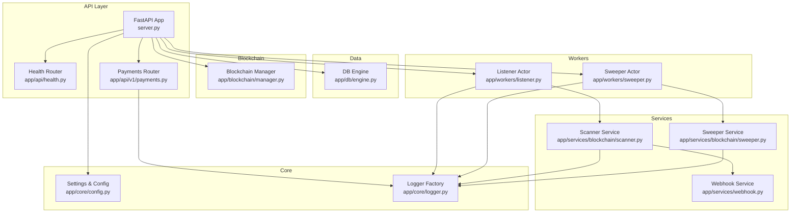
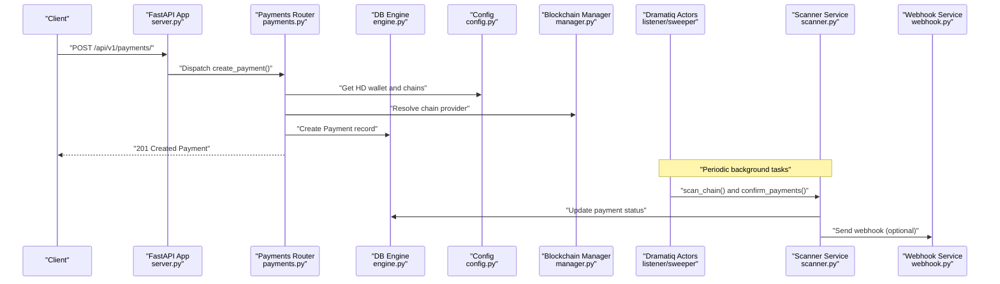
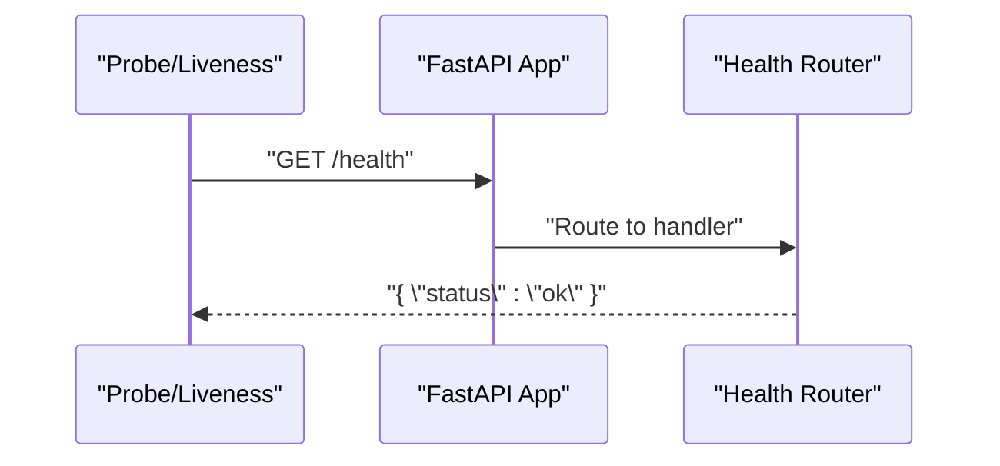
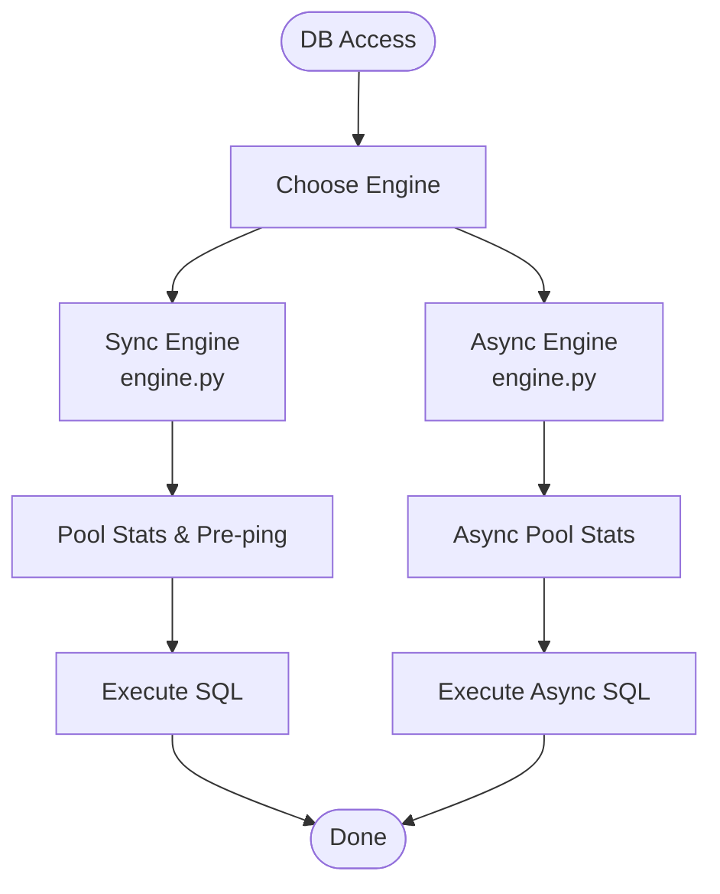
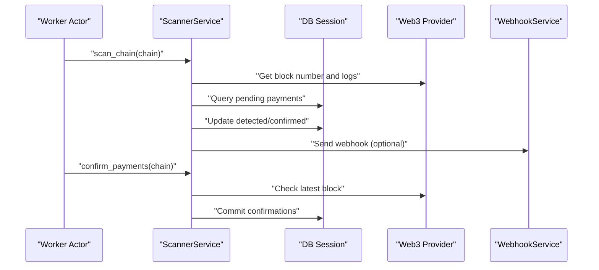
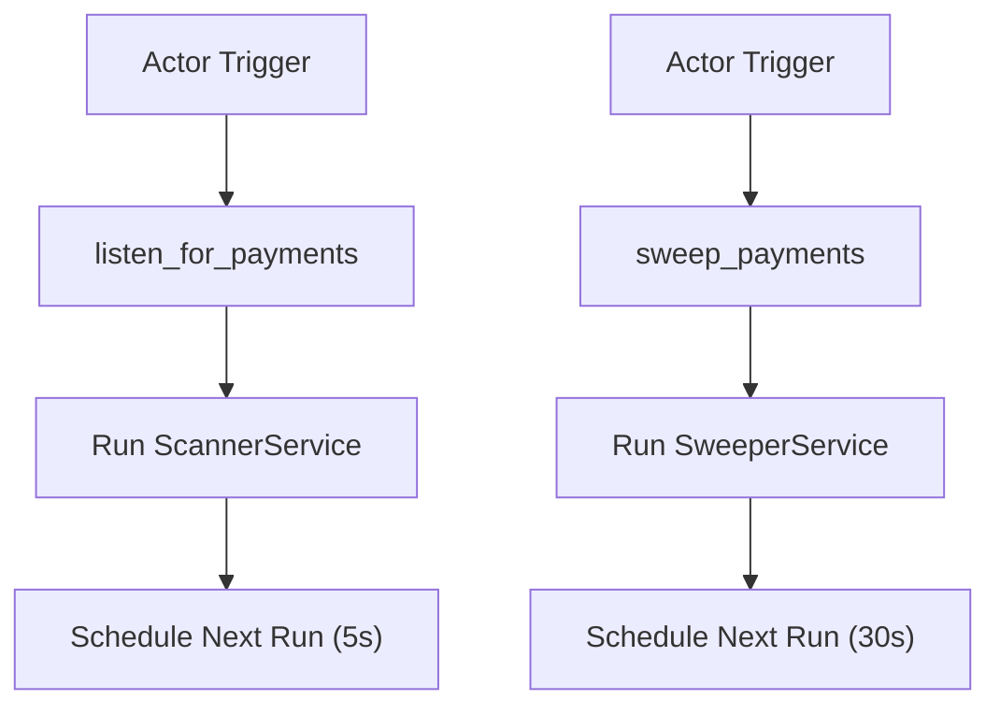
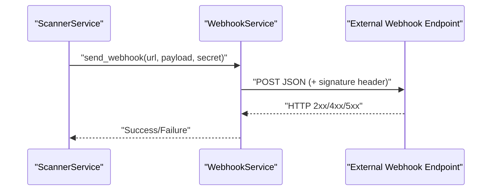
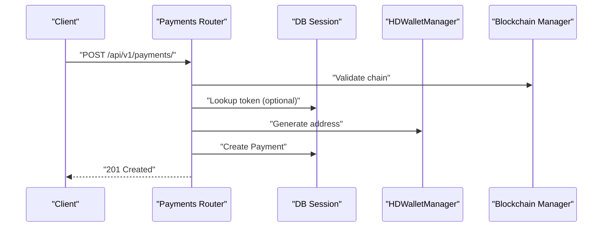
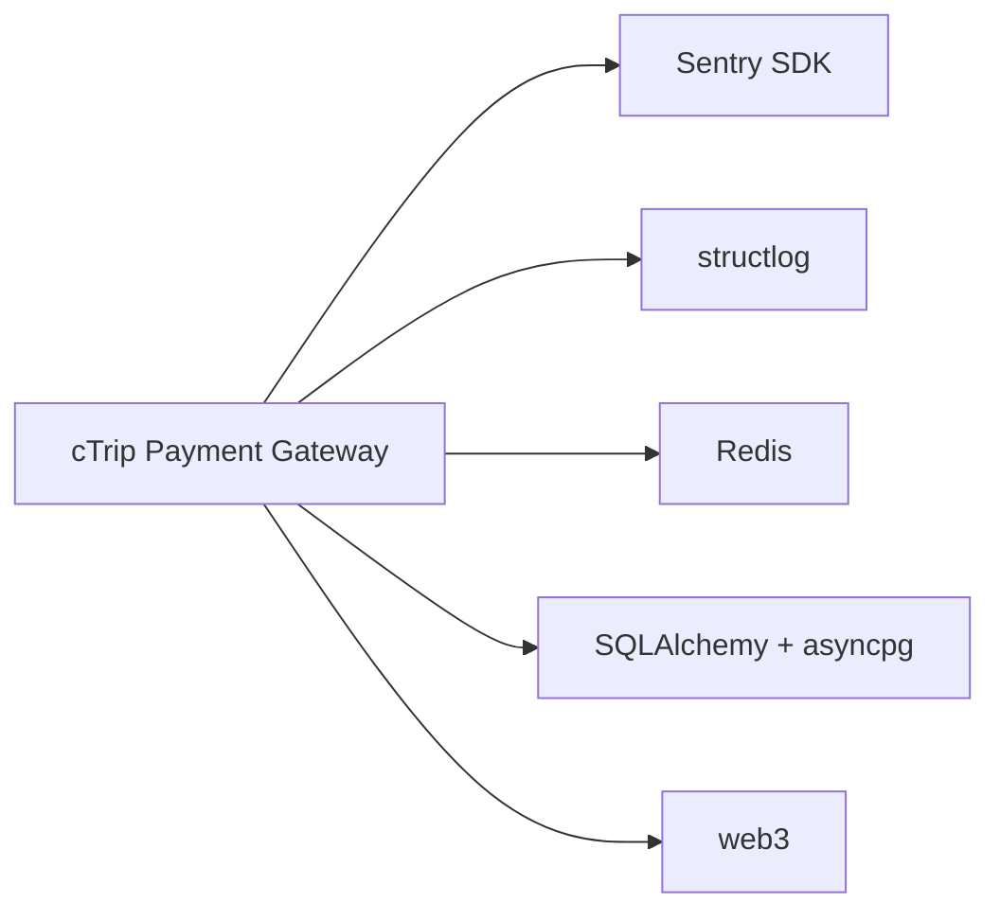

# Monitoring and Observability

<cite>
**Referenced Files in This Document**
- [server.py](https://github.com/rakibhossain72/ctrip/blob/main/server.py)
- [app/api/health.py](https://github.com/rakibhossain72/ctrip/blob/main/app/api/health.py)
- [app/api/v1/payments.py](https://github.com/rakibhossain72/ctrip/blob/main/app/api/v1/payments.py)
- [app/core/config.py](https://github.com/rakibhossain72/ctrip/blob/main/app/core/config.py)
- [app/core/logger.py](https://github.com/rakibhossain72/ctrip/blob/main/app/core/logger.py)
- [app/db/engine.py](https://github.com/rakibhossain72/ctrip/blob/main/app/db/engine.py)
- [app/blockchain/manager.py](https://github.com/rakibhossain72/ctrip/blob/main/app/blockchain/manager.py)
- [app/services/blockchain/scanner.py](https://github.com/rakibhossain72/ctrip/blob/main/app/services/blockchain/scanner.py)
- [app/services/blockchain/sweeper.py](https://github.com/rakibhossain72/ctrip/blob/main/app/services/blockchain/sweeper.py)
- [app/services/webhook.py](https://github.com/rakibhossain72/ctrip/blob/main/app/services/webhook.py)
- [app/workers/listener.py](https://github.com/rakibhossain72/ctrip/blob/main/app/workers/listener.py)
- [app/workers/sweeper.py](https://github.com/rakibhossain72/ctrip/blob/main/app/workers/sweeper.py)
- [docker-compose.yml](https://github.com/rakibhossain72/ctrip/blob/main/docker-compose.yml)
- [requirements.txt](https://github.com/rakibhossain72/ctrip/blob/main/requirements.txt)
</cite>

## Table of Contents
1. [Introduction](#introduction)
2. [Project Structure](#project-structure)
3. [Core Components](#core-components)
4. [Architecture Overview](#architecture-overview)
5. [Detailed Component Analysis](#detailed-component-analysis)
6. [Dependency Analysis](#dependency-analysis)
7. [Performance Considerations](#performance-considerations)
8. [Troubleshooting Guide](#troubleshooting-guide)
9. [Conclusion](#conclusion)
10. [Appendices](#appendices)

## Introduction
This document provides comprehensive monitoring and observability guidance for the cTrip Payment Gateway. It covers logging configuration patterns, health checks, background worker monitoring, database performance monitoring, blockchain interaction observability, and webhook delivery tracking. It also outlines integration strategies with external monitoring platforms and alerting approaches tailored for payment-critical operations.

## Project Structure
The system is organized around:
- FastAPI application lifecycle and routers
- Configuration and environment-driven settings
- Database connectivity and async engine
- Blockchain abstraction and chain manager
- Worker actors for scanning and sweeping
- Webhook service for out-of-band notifications
- Health endpoint for readiness/liveness checks

**Diagram sources**
- [server.py](https://github.com/rakibhossain72/ctrip/blob/main/server.py#L45-L47)
- [app/api/health.py](https://github.com/rakibhossain72/ctrip/blob/main/app/api/health.py#L4-L7)
- [app/api/v1/payments.py](https://github.com/rakibhossain72/ctrip/blob/main/app/api/v1/payments.py#L12-L54)
- [app/core/config.py](https://github.com/rakibhossain72/ctrip/blob/main/app/core/config.py#L10-L126)
- [app/core/logger.py](https://github.com/rakibhossain72/ctrip/blob/main/app/core/logger.py#L1-L4)
- [app/db/engine.py](https://github.com/rakibhossain72/ctrip/blob/main/app/db/engine.py#L1-L32)
- [app/blockchain/manager.py](https://github.com/rakibhossain72/ctrip/blob/main/app/blockchain/manager.py#L8-L32)
- [app/workers/listener.py](https://github.com/rakibhossain72/ctrip/blob/main/app/workers/listener.py#L21-L46)
- [app/workers/sweeper.py](https://github.com/rakibhossain72/ctrip/blob/main/app/workers/sweeper.py#L19-L40)
- [app/services/blockchain/scanner.py](https://github.com/rakibhossain72/ctrip/blob/main/app/services/blockchain/scanner.py#L14-L134)
- [app/services/blockchain/sweeper.py](https://github.com/rakibhossain72/ctrip/blob/main/app/services/blockchain/sweeper.py#L11-L54)
- [app/services/webhook.py](https://github.com/rakibhossain72/ctrip/blob/main/app/services/webhook.py#L10-L45)

**Section sources**
- [server.py](https://github.com/rakibhossain72/ctrip/blob/main/server.py#L1-L56)
- [app/api/health.py](https://github.com/rakibhossain72/ctrip/blob/main/app/api/health.py#L1-L7)
- [app/api/v1/payments.py](https://github.com/rakibhossain72/ctrip/blob/main/app/api/v1/payments.py#L1-L62)
- [app/core/config.py](https://github.com/rakibhossain72/ctrip/blob/main/app/core/config.py#L1-L126)
- [app/core/logger.py](https://github.com/rakibhossain72/ctrip/blob/main/app/core/logger.py#L1-L4)
- [app/db/engine.py](https://github.com/rakibhossain72/ctrip/blob/main/app/db/engine.py#L1-L32)
- [app/blockchain/manager.py](https://github.com/rakibhossain72/ctrip/blob/main/app/blockchain/manager.py#L1-L33)
- [app/workers/listener.py](https://github.com/rakibhossain72/ctrip/blob/main/app/workers/listener.py#L1-L46)
- [app/workers/sweeper.py](https://github.com/rakibhossain72/ctrip/blob/main/app/workers/sweeper.py#L1-L40)
- [app/services/blockchain/scanner.py](https://github.com/rakibhossain72/ctrip/blob/main/app/services/blockchain/scanner.py#L1-L134)
- [app/services/blockchain/sweeper.py](https://github.com/rakibhossain72/ctrip/blob/main/app/services/blockchain/sweeper.py#L1-L54)
- [app/services/webhook.py](https://github.com/rakibhossain72/ctrip/blob/main/app/services/webhook.py#L1-L45)

## Core Components
- Logging: Centralized logger factory and per-module loggers are used across services and workers.
- Configuration: Strongly typed settings with environment-aware defaults and validators.
- Health Endpoint: Minimalist health check returning a simple status payload.
- Database Engine: Sync and async engines with connection pooling and pre-ping enabled.
- Blockchain Manager: Dynamic chain registry based on configuration.
- Workers: Dramatiq actors for periodic scanning and sweeping with scheduled retries.
- Webhook Service: Asynchronous webhook sender with HMAC signing support.

**Section sources**
- [app/core/logger.py](https://github.com/rakibhossain72/ctrip/blob/main/app/core/logger.py#L1-L4)
- [app/core/config.py](https://github.com/rakibhossain72/ctrip/blob/main/app/core/config.py#L10-L126)
- [app/api/health.py](https://github.com/rakibhossain72/ctrip/blob/main/app/api/health.py#L4-L7)
- [app/db/engine.py](https://github.com/rakibhossain72/ctrip/blob/main/app/db/engine.py#L1-L32)
- [app/blockchain/manager.py](https://github.com/rakibhossain72/ctrip/blob/main/app/blockchain/manager.py#L8-L32)
- [app/workers/listener.py](https://github.com/rakibhossain72/ctrip/blob/main/app/workers/listener.py#L9-L13)
- [app/workers/sweeper.py](https://github.com/rakibhossain72/ctrip/blob/main/app/workers/sweeper.py#L10-L14)
- [app/services/webhook.py](https://github.com/rakibhossain72/ctrip/blob/main/app/services/webhook.py#L10-L45)

## Architecture Overview
The cTrip Payment Gateway integrates FastAPI, SQLAlchemy, Web3, Dramatiq, Redis, PostgreSQL, and optional external webhooks. The runtime spans:
- API requests for payment creation
- Background scanning of blockchain events
- Confirmation and settlement workflows
- Outbound webhook notifications

**Diagram sources**
- [server.py](https://github.com/rakibhossain72/ctrip/blob/main/server.py#L45-L47)
- [app/api/v1/payments.py](https://github.com/rakibhossain72/ctrip/blob/main/app/api/v1/payments.py#L18-L54)
- [app/db/engine.py](https://github.com/rakibhossain72/ctrip/blob/main/app/db/engine.py#L19-L31)
- [app/core/config.py](https://github.com/rakibhossain72/ctrip/blob/main/app/core/config.py#L44-L91)
- [app/blockchain/manager.py](https://github.com/rakibhossain72/ctrip/blob/main/app/blockchain/manager.py#L8-L32)
- [app/workers/listener.py](https://github.com/rakibhossain72/ctrip/blob/main/app/workers/listener.py#L21-L46)
- [app/services/blockchain/scanner.py](https://github.com/rakibhossain72/ctrip/blob/main/app/services/blockchain/scanner.py#L20-L96)
- [app/services/webhook.py](https://github.com/rakibhossain72/ctrip/blob/main/app/services/webhook.py#L12-L44)

## Detailed Component Analysis

### Logging Configuration Patterns
- Logger factory: A module-level logger is created for reuse across modules.
- Per-module loggers: Services, workers, and utilities define their own loggers to isolate contexts.
- Worker logging: Both listener and sweeper configure basic logging with timestamps and levels.
- Recommendations:
  - Standardize log formatting and levels across modules.
  - Add correlation IDs to trace requests across API, workers, and blockchain interactions.
  - Ship structured logs to centralized logging (e.g., ELK, Loki) for aggregation.

**Section sources**
- [app/core/logger.py](https://github.com/rakibhossain72/ctrip/blob/main/app/core/logger.py#L1-L4)
- [app/workers/listener.py](https://github.com/rakibhossain72/ctrip/blob/main/app/workers/listener.py#L9-L13)
- [app/workers/sweeper.py](https://github.com/rakibhossain72/ctrip/blob/main/app/workers/sweeper.py#L10-L14)
- [app/services/blockchain/scanner.py](https://github.com/rakibhossain72/ctrip/blob/main/app/services/blockchain/scanner.py#L10-L10)
- [app/services/blockchain/sweeper.py](https://github.com/rakibhossain72/ctrip/blob/main/app/services/blockchain/sweeper.py#L9-L9)
- [app/services/webhook.py](https://github.com/rakibhossain72/ctrip/blob/main/app/services/webhook.py#L8-L8)

### Health Check Endpoint
- Endpoint: GET /health returns a minimal JSON payload indicating service availability.
- Integration: Included in the FastAPI app and reachable via standard ingress.

**Diagram sources**
- [server.py](https://github.com/rakibhossain72/ctrip/blob/main/server.py#L45-L47)
- [app/api/health.py](https://github.com/rakibhossain72/ctrip/blob/main/app/api/health.py#L5-L7)

**Section sources**
- [app/api/health.py](https://github.com/rakibhossain72/ctrip/blob/main/app/api/health.py#L4-L7)
- [server.py](https://github.com/rakibhossain72/ctrip/blob/main/server.py#L45-L47)

### Database Performance Monitoring
- Engines:
  - Sync engine with connection pooling and pre-ping.
  - Async engine for non-blocking IO.
- Recommendations:
  - Track pool utilization, connection timeouts, and slow queries.
  - Instrument SQLAlchemy queries with timing and error metrics.
  - Monitor pool exhaustion and retry/backoff behavior.

**Diagram sources**
- [app/db/engine.py](https://github.com/rakibhossain72/ctrip/blob/main/app/db/engine.py#L19-L31)

**Section sources**
- [app/db/engine.py](https://github.com/rakibhossain72/ctrip/blob/main/app/db/engine.py#L1-L32)

### Blockchain Interaction Observability
- Chain Registry: Dynamically constructs blockchain clients from configuration.
- Scanner Service:
  - Scans blocks within a batch window.
  - Detects native and ERC20 transfers.
  - Updates payment statuses and triggers webhooks when configured.
- Sweeper Service:
  - Identifies confirmed payments and performs settlement actions.
- Recommendations:
  - Add metrics for scanned block ranges, detection rates, confirmation latency, and settlement throughput.
  - Instrument RPC calls with latency and error counters.
  - Track reorg safety margins and stale scans.

**Diagram sources**
- [app/blockchain/manager.py](https://github.com/rakibhossain72/ctrip/blob/main/app/blockchain/manager.py#L8-L32)
- [app/services/blockchain/scanner.py](https://github.com/rakibhossain72/ctrip/blob/main/app/services/blockchain/scanner.py#L20-L96)
- [app/services/blockchain/scanner.py](https://github.com/rakibhossain72/ctrip/blob/main/app/services/blockchain/scanner.py#L97-L134)
- [app/services/webhook.py](https://github.com/rakibhossain72/ctrip/blob/main/app/services/webhook.py#L12-L44)

**Section sources**
- [app/blockchain/manager.py](https://github.com/rakibhossain72/ctrip/blob/main/app/blockchain/manager.py#L8-L32)
- [app/services/blockchain/scanner.py](https://github.com/rakibhossain72/ctrip/blob/main/app/services/blockchain/scanner.py#L14-L134)
- [app/services/blockchain/sweeper.py](https://github.com/rakibhossain72/ctrip/blob/main/app/services/blockchain/sweeper.py#L11-L54)

### Background Worker Health Tracking
- Listener Actor:
  - Periodic runs with scheduled retries.
  - Logs lifecycle events and exceptions.
- Sweeper Actor:
  - Periodic settlement runs with scheduled retries.
  - Logs outcomes and errors.
- Recommendations:
  - Track actor execution duration, failure rates, and retry counts.
  - Monitor Redis broker queue depth and backlog.
  - Alert on stalled or stuck actors.

**Diagram sources**
- [app/workers/listener.py](https://github.com/rakibhossain72/ctrip/blob/main/app/workers/listener.py#L21-L46)
- [app/workers/sweeper.py](https://github.com/rakibhossain72/ctrip/blob/main/app/workers/sweeper.py#L19-L40)

**Section sources**
- [app/workers/listener.py](https://github.com/rakibhossain72/ctrip/blob/main/app/workers/listener.py#L1-L46)
- [app/workers/sweeper.py](https://github.com/rakibhossain72/ctrip/blob/main/app/workers/sweeper.py#L1-L40)

### Webhook Delivery Tracking
- WebhookService:
  - Sends asynchronous HTTP requests with optional HMAC signature.
  - Logs success/failure and status codes.
- Recommendations:
  - Add metrics for delivery latency, retry attempts, and failure reasons.
  - Implement dead-letter handling and manual retry queues.
  - Enforce idempotency at the consumer.

**Diagram sources**
- [app/services/blockchain/scanner.py](https://github.com/rakibhossain72/ctrip/blob/main/app/services/blockchain/scanner.py#L117-L131)
- [app/services/webhook.py](https://github.com/rakibhossain72/ctrip/blob/main/app/services/webhook.py#L12-L44)

**Section sources**
- [app/services/webhook.py](https://github.com/rakibhossain72/ctrip/blob/main/app/services/webhook.py#L10-L45)
- [app/services/blockchain/scanner.py](https://github.com/rakibhossain72/ctrip/blob/main/app/services/blockchain/scanner.py#L117-L131)

### Payment Creation Endpoint Observability
- Endpoint: POST /api/v1/payments/
- Responsibilities:
  - Validates chain and token existence.
  - Generates a payment address via HD wallet.
  - Persists payment metadata and returns created resource.
- Recommendations:
  - Add request/response metrics, error breakdowns, and chain/token-specific counters.
  - Instrument dependency resolution (HD wallet, blockchain provider).

**Diagram sources**
- [app/api/v1/payments.py](https://github.com/rakibhossain72/ctrip/blob/main/app/api/v1/payments.py#L18-L54)

**Section sources**
- [app/api/v1/payments.py](https://github.com/rakibhossain72/ctrip/blob/main/app/api/v1/payments.py#L1-L62)

## Dependency Analysis
External dependencies relevant to observability:
- Sentry SDK: Available for error tracking and performance monitoring.
- structlog: Structured logging library present for advanced logging.
- redis: Used by Dramatiq for message queuing.
- SQLAlchemy and asyncpg: Database connectivity and async drivers.
- web3: Blockchain interaction library.

**Diagram sources**
- [requirements.txt](https://github.com/rakibhossain72/ctrip/blob/main/requirements.txt#L85-L91)

**Section sources**
- [requirements.txt](https://github.com/rakibhossain72/ctrip/blob/main/requirements.txt#L1-L106)

## Performance Considerations
- Database:
  - Use async sessions for I/O-bound operations.
  - Monitor pool saturation and query latency.
- Blockchain:
  - Batch block scanning and tune batch sizes based on network conditions.
  - Cache provider connections and avoid redundant calls.
- Workers:
  - Schedule actors with jitter to prevent thundering herd.
  - Monitor execution time and adjust timeouts.
- Webhooks:
  - Use bounded retries and circuit breaker patterns.
  - Track delivery SLAs and backoff strategies.

[No sources needed since this section provides general guidance]

## Troubleshooting Guide
Common operational issues and diagnostics:
- Health endpoint returns unexpected status:
  - Verify application startup hooks and dependencies initialization.
- Database connection failures:
  - Check environment variables and connection URLs.
  - Inspect pool configuration and pre-ping settings.
- Blockchain scanning stalls:
  - Confirm RPC endpoint reachability and rate limits.
  - Review chain configuration and fallback provider.
- Worker not processing jobs:
  - Validate Redis connectivity and Dramatiq broker configuration.
  - Inspect actor logs for exceptions and retry behavior.
- Webhook failures:
  - Check signature secret and payload formatting.
  - Review HTTP client timeouts and status codes.

**Section sources**
- [app/api/health.py](https://github.com/rakibhossain72/ctrip/blob/main/app/api/health.py#L5-L7)
- [app/db/engine.py](https://github.com/rakibhossain72/ctrip/blob/main/app/db/engine.py#L19-L31)
- [app/blockchain/manager.py](https://github.com/rakibhossain72/ctrip/blob/main/app/blockchain/manager.py#L8-L32)
- [app/workers/listener.py](https://github.com/rakibhossain72/ctrip/blob/main/app/workers/listener.py#L21-L46)
- [app/workers/sweeper.py](https://github.com/rakibhossain72/ctrip/blob/main/app/workers/sweeper.py#L19-L40)
- [app/services/webhook.py](https://github.com/rakibhossain72/ctrip/blob/main/app/services/webhook.py#L12-L44)

## Conclusion
The cTrip Payment Gateway establishes a solid foundation for observability through health checks, structured logging, configurable settings, and background workers. To mature the monitoring posture, integrate structured logging, add metrics instrumentation, enable distributed tracing, and wire up alerting for critical payment operations. Align these improvements with the existing architecture to maintain reliability and operational visibility.

[No sources needed since this section summarizes without analyzing specific files]

## Appendices

### Monitoring Integration Checklist
- Logging
  - Standardize log format and levels across modules.
  - Centralize logs and add correlation IDs.
- Metrics
  - Expose Prometheus-compatible metrics for API, DB, workers, and blockchain.
  - Track request rates, durations, and error ratios.
- Tracing
  - Add distributed tracing for API requests and worker jobs.
  - Correlate traces with logs and metrics.
- Alerts
  - Define SLOs for payment creation, confirmation, and webhook delivery.
  - Configure alerts for health check failures, DB pool exhaustion, and worker stalls.
- Platform Integration
  - Integrate with Sentry for error tracking.
  - Connect to Grafana/Prometheus for dashboards and alerting.

[No sources needed since this section provides general guidance]