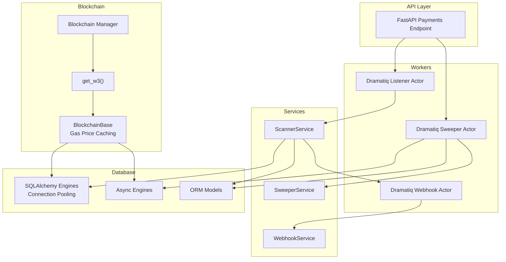
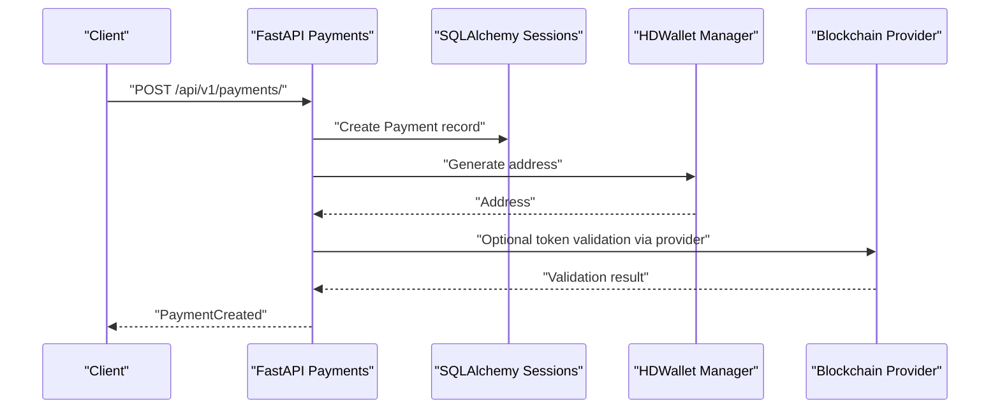
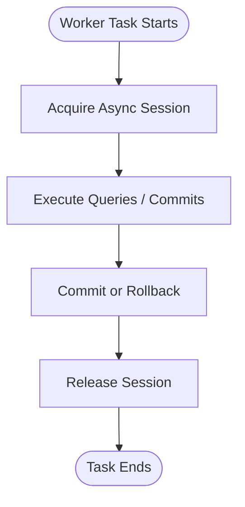
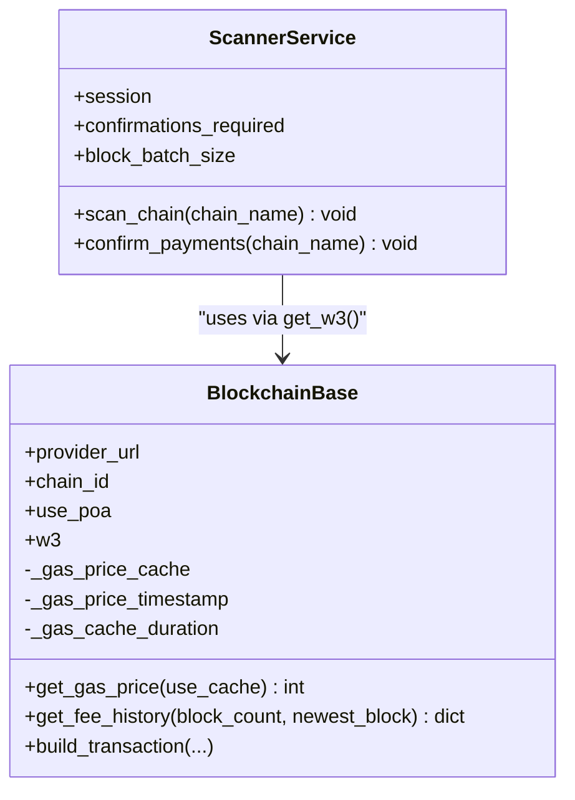
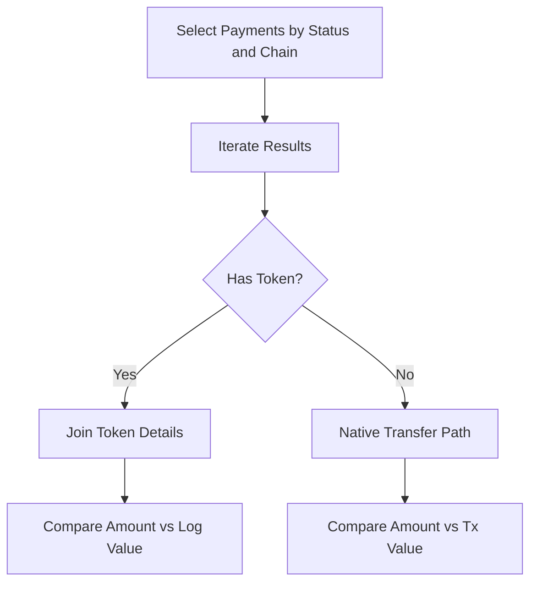
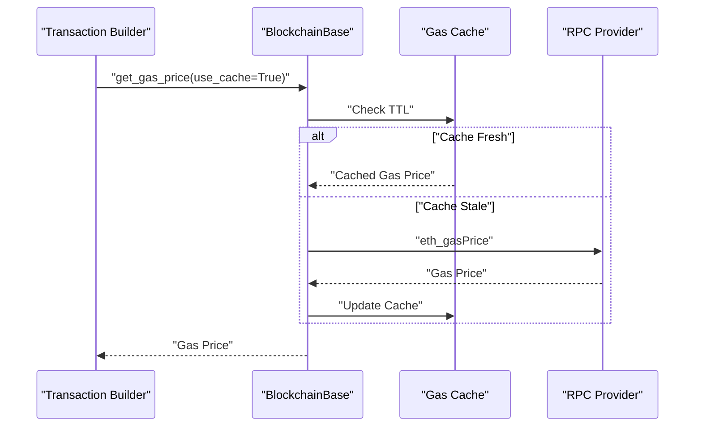
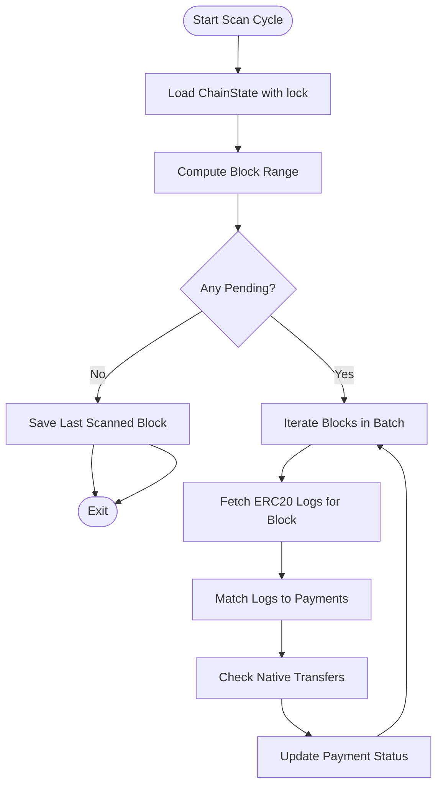
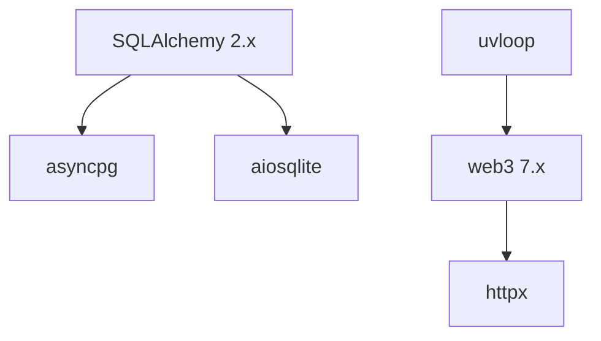
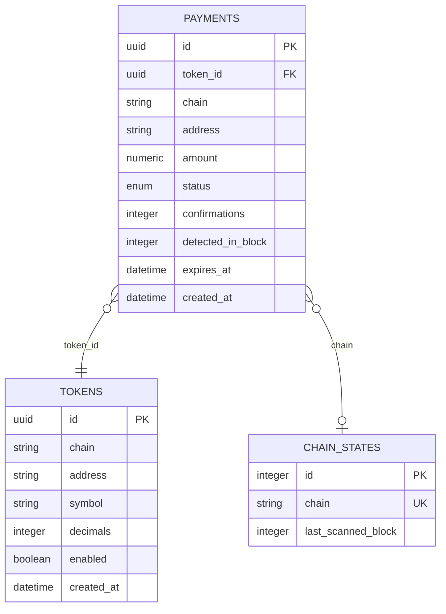

# Performance Optimization

<cite>
**Referenced Files in This Document**
- [app/db/engine.py](file://app/db/engine.py)
- [app/db/session.py](file://app/db/session.py)
- [app/db/async_session.py](file://app/db/async_session.py)
- [app/db/models/payment.py](file://app/db/models/payment.py)
- [app/db/models/chain.py](file://app/db/models/chain.py)
- [app/blockchain/base.py](file://app/blockchain/base.py)
- [app/blockchain/w3.py](file://app/blockchain/w3.py)
- [app/blockchain/manager.py](file://app/blockchain/manager.py)
- [app/services/blockchain/scanner.py](file://app/services/blockchain/scanner.py)
- [app/workers/listener.py](file://app/workers/listener.py)
- [app/workers/webhook.py](file://app/workers/webhook.py)
- [app/services/webhook.py](file://app/services/webhook.py)
- [app/api/v1/payments.py](file://app/api/v1/payments.py)
- [app/core/config.py](file://app/core/config.py)
- [requirements.txt](file://requirements.txt)
- [alembic/versions/2026_01_27_1807-5ec6405addd0_initial_database_schema.py](file://alembic/versions/2026_01_27_1807-5ec6405addd0_initial_database_schema.py)
</cite>

## Table of Contents
1. [Introduction](#introduction)
2. [Project Structure](#project-structure)
3. [Core Components](#core-components)
4. [Architecture Overview](#architecture-overview)
5. [Detailed Component Analysis](#detailed-component-analysis)
6. [Dependency Analysis](#dependency-analysis)
7. [Performance Considerations](#performance-considerations)
8. [Troubleshooting Guide](#troubleshooting-guide)
9. [Conclusion](#conclusion)
10. [Appendices](#appendices)

## Introduction
This document provides a comprehensive performance optimization guide for the cTrip Payment Gateway. It focuses on system-wide tuning strategies across database connection pooling, asynchronous blockchain interactions, memory management, query optimization, caching for gas price and blockchain data, async/await best practices, monitoring and bottleneck identification, and scaling for high-throughput payment processing. Specific optimization examples are drawn from the codebase, including gas price caching, connection reuse patterns, and efficient blockchain polling strategies.

## Project Structure
The application follows a layered architecture:
- API layer: FastAPI endpoints for payment creation and health checks
- Worker layer: Dramatiq actors orchestrating scanning and sweeping tasks
- Service layer: Business logic for scanning, confirming, and webhook dispatch
- Blockchain layer: Web3 providers abstraction with per-chain configuration
- Database layer: SQLAlchemy ORM models and async engines with connection pooling



**Diagram sources**
- [app/api/v1/payments.py](file://app/api/v1/payments.py#L1-L62)
- [app/workers/listener.py](file://app/workers/listener.py#L1-L46)
- [app/workers/sweeper.py](file://app/workers/sweeper.py#L1-L40)
- [app/workers/webhook.py](file://app/workers/webhook.py#L1-L37)
- [app/services/webhook.py](file://app/services/webhook.py#L1-L45)
- [app/services/blockchain/scanner.py](file://app/services/blockchain/scanner.py#L1-L134)
- [app/blockchain/manager.py](file://app/blockchain/manager.py#L1-L33)
- [app/blockchain/w3.py](file://app/blockchain/w3.py#L1-L9)
- [app/blockchain/base.py](file://app/blockchain/base.py#L1-L133)
- [app/db/engine.py](file://app/db/engine.py#L1-L32)
- [app/db/async_session.py](file://app/db/async_session.py#L1-L15)
- [app/db/models/payment.py](file://app/db/models/payment.py#L1-L74)
- [app/db/models/chain.py](file://app/db/models/chain.py#L1-L17)

**Section sources**
- [app/api/v1/payments.py](file://app/api/v1/payments.py#L1-L62)
- [app/workers/listener.py](file://app/workers/listener.py#L1-L46)
- [app/workers/sweeper.py](file://app/workers/sweeper.py#L1-L40)
- [app/workers/webhook.py](file://app/workers/webhook.py#L1-L37)
- [app/services/webhook.py](file://app/services/webhook.py#L1-L45)
- [app/services/blockchain/scanner.py](file://app/services/blockchain/scanner.py#L1-L134)
- [app/blockchain/manager.py](file://app/blockchain/manager.py#L1-L33)
- [app/blockchain/w3.py](file://app/blockchain/w3.py#L1-L9)
- [app/blockchain/base.py](file://app/blockchain/base.py#L1-L133)
- [app/db/engine.py](file://app/db/engine.py#L1-L32)
- [app/db/async_session.py](file://app/db/async_session.py#L1-L15)
- [app/db/models/payment.py](file://app/db/models/payment.py#L1-L74)
- [app/db/models/chain.py](file://app/db/models/chain.py#L1-L17)

## Core Components
- Database connection pooling: synchronous and asynchronous engines configured with pre-ping and tuned pool sizes
- Asynchronous session management: scoped async sessions for worker tasks
- Blockchain abstraction: per-chain providers with gas price caching and fee history support
- Worker orchestration: Dramatiq actors for scanning, sweeping, and webhook dispatch
- Query optimization: targeted queries with explicit joins and minimal scans
- Caching: gas price caching with short TTL to reduce RPC overhead
- Async/await best practices: structured concurrency with proper event loops and timeouts

**Section sources**
- [app/db/engine.py](file://app/db/engine.py#L1-L32)
- [app/db/session.py](file://app/db/session.py#L1-L17)
- [app/db/async_session.py](file://app/db/async_session.py#L1-L15)
- [app/blockchain/base.py](file://app/blockchain/base.py#L65-L80)
- [app/blockchain/w3.py](file://app/blockchain/w3.py#L1-L9)
- [app/blockchain/manager.py](file://app/blockchain/manager.py#L1-L33)
- [app/services/blockchain/scanner.py](file://app/services/blockchain/scanner.py#L1-L134)
- [app/workers/listener.py](file://app/workers/listener.py#L1-L46)
- [app/workers/webhook.py](file://app/workers/webhook.py#L1-L37)
- [app/services/webhook.py](file://app/services/webhook.py#L1-L45)

## Architecture Overview
The system integrates FastAPI endpoints, Dramatiq workers, and blockchain providers with a robust database layer. The key performance levers are:
- Connection pooling for PostgreSQL and SQLite
- Async session reuse in worker tasks
- Gas price caching in blockchain providers
- Efficient blockchain polling with batched blocks and targeted logs
- Structured async workflows with timeouts and retries



**Diagram sources**
- [app/api/v1/payments.py](file://app/api/v1/payments.py#L18-L54)
- [app/db/session.py](file://app/db/session.py#L11-L16)
- [app/blockchain/w3.py](file://app/blockchain/w3.py#L6-L9)

## Detailed Component Analysis

### Database Connection Pooling and Session Management
- Synchronous engine configured with pre-ping and a fixed pool size suitable for typical workloads
- Asynchronous engine configured with pre-ping for connection health checks
- Session factories ensure proper lifecycle management and closure
- Async session factory yields sessions within worker tasks to avoid leaks



**Diagram sources**
- [app/db/async_session.py](file://app/db/async_session.py#L12-L15)
- [app/db/session.py](file://app/db/session.py#L11-L16)

**Section sources**
- [app/db/engine.py](file://app/db/engine.py#L22-L31)
- [app/db/session.py](file://app/db/session.py#L5-L16)
- [app/db/async_session.py](file://app/db/async_session.py#L6-L15)

### Async Operation Optimization for Blockchain Interactions
- BlockchainBase caches gas price with a short TTL to minimize RPC calls
- Fee history is used to construct EIP-1559 transactions when available, falling back to legacy pricing
- get_w3 returns cached AsyncWeb3 instances per chain
- ScannerService batches block scanning and uses targeted logs for ERC20 detection



**Diagram sources**
- [app/blockchain/base.py](file://app/blockchain/base.py#L41-L80)
- [app/services/blockchain/scanner.py](file://app/services/blockchain/scanner.py#L14-L96)

**Section sources**
- [app/blockchain/base.py](file://app/blockchain/base.py#L65-L80)
- [app/blockchain/base.py](file://app/blockchain/base.py#L116-L133)
- [app/blockchain/w3.py](file://app/blockchain/w3.py#L6-L9)
- [app/services/blockchain/scanner.py](file://app/services/blockchain/scanner.py#L20-L96)

### Memory Management Techniques
- Avoid building large intermediate lists unnecessarily; process logs and transactions iteratively
- Use scalar queries and minimal projections to reduce memory footprint
- Reuse AsyncWeb3 instances per chain to avoid repeated provider initialization
- Close sessions promptly after use to free resources

**Section sources**
- [app/services/blockchain/scanner.py](file://app/services/blockchain/scanner.py#L41-L50)
- [app/services/blockchain/scanner.py](file://app/services/blockchain/scanner.py#L72-L92)
- [app/db/async_session.py](file://app/db/async_session.py#L12-L15)

### Query Optimization Strategies for SQLAlchemy Models
- Use targeted selects with filters to avoid full-table scans
- Leverage foreign keys and indexes for joins (e.g., payments.token_id -> tokens.id)
- Use with_for_update() to coordinate scanning state safely
- Keep queries minimal; fetch only required columns



**Diagram sources**
- [app/services/blockchain/scanner.py](file://app/services/blockchain/scanner.py#L41-L92)
- [app/db/models/payment.py](file://app/db/models/payment.py#L41-L57)
- [app/db/models/token.py](file://app/db/models/token.py#L1-L74)

**Section sources**
- [app/services/blockchain/scanner.py](file://app/services/blockchain/scanner.py#L24-L32)
- [app/services/blockchain/scanner.py](file://app/services/blockchain/scanner.py#L41-L50)
- [app/db/models/payment.py](file://app/db/models/payment.py#L41-L57)

### Caching Mechanisms for Gas Price and Blockchain Data
- Gas price cache with a 10-second TTL reduces frequent RPC calls
- Fee history enables dynamic fee calculation for EIP-1559 transactions
- Per-chain AsyncWeb3 instances are reused across requests



**Diagram sources**
- [app/blockchain/base.py](file://app/blockchain/base.py#L65-L80)

**Section sources**
- [app/blockchain/base.py](file://app/blockchain/base.py#L41-L80)

### Async/Await Best Practices Throughout the Application
- Workers use asyncio.run within actors to execute async tasks
- Proper event loop management ensures compatibility with Dramatiq
- Webhook actor wraps async execution and raises exceptions for retries
- Timeout configuration for HTTP clients prevents hanging requests

```mermaid
sequenceDiagram
participant Actor as "Dramatiq Actor"
participant Loop as "Event Loop"
participant Runner as "Async Runner"
participant Service as "Service Layer"
Actor->>Loop : "Set loop"
Actor->>Runner : "async def run()"
Runner->>Service : "Call async methods"
Service-->>Runner : "Results"
Runner-->>Actor : "Complete"
```

**Diagram sources**
- [app/workers/listener.py](file://app/workers/listener.py#L29-L40)
- [app/workers/webhook.py](file://app/workers/webhook.py#L24-L36)
- [app/services/webhook.py](file://app/services/webhook.py#L33-L36)

**Section sources**
- [app/workers/listener.py](file://app/workers/listener.py#L18-L46)
- [app/workers/webhook.py](file://app/workers/webhook.py#L9-L37)
- [app/services/webhook.py](file://app/services/webhook.py#L33-L36)

### Efficient Blockchain Polling Strategies
- Batch scanning by configurable block_batch_size to limit per-cycle RPC calls
- Use targeted logs for ERC20 transfers to avoid scanning all blocks
- Confirm payments after sufficient confirmations to reduce re-scans
- Use chain-specific providers with POA middleware when needed



**Diagram sources**
- [app/services/blockchain/scanner.py](file://app/services/blockchain/scanner.py#L20-L96)

**Section sources**
- [app/services/blockchain/scanner.py](file://app/services/blockchain/scanner.py#L14-L18)
- [app/services/blockchain/scanner.py](file://app/services/blockchain/scanner.py#L34-L39)
- [app/services/blockchain/scanner.py](file://app/services/blockchain/scanner.py#L72-L92)

## Dependency Analysis
External dependencies relevant to performance:
- SQLAlchemy 2.x for ORM and async engines
- asyncpg for async PostgreSQL driver
- aiosqlite for async SQLite driver
- web3 7.x for blockchain interactions
- uvloop for improved asyncio performance
- httpx for async HTTP requests in webhooks



**Diagram sources**
- [requirements.txt](file://requirements.txt#L89-L106)

**Section sources**
- [requirements.txt](file://requirements.txt#L89-L106)

## Performance Considerations
- Connection pooling
  - Tune pool_size and pool_pre_ping according to database capacity and concurrent workload
  - Prefer async engines for I/O-bound tasks; keep sync engines for CPU-bound migrations
- Async operations
  - Use structured concurrency; avoid blocking calls inside async contexts
  - Set timeouts for external HTTP calls and RPC requests
- Memory usage
  - Minimize intermediate collections; stream results where possible
  - Reuse provider instances; avoid recreating AsyncWeb3 per request
- Query performance
  - Add indexes on frequently filtered columns (e.g., payments.status, payments.chain)
  - Use targeted selects and joins; avoid N+1 queries
- Caching
  - Adjust gas cache duration based on network volatility
  - Cache chain metadata and provider configurations
- Monitoring and observability
  - Instrument async tasks and database queries
  - Track latency distributions and error rates
- Scaling
  - Horizontal scaling via multiple worker processes
  - Use separate queues for high-priority tasks (e.g., confirmations)
  - Consider read replicas for heavy reads

[No sources needed since this section provides general guidance]

## Troubleshooting Guide
- Database connectivity issues
  - Verify pool_pre_ping settings and connection URLs
  - Monitor pool utilization and timeouts
- Blockchain provider errors
  - Validate RPC URLs and chain IDs
  - Check gas price cache staleness and fallback behavior
- Worker failures
  - Inspect Dramatiq actor logs and retry policies
  - Ensure proper event loop setup in actors
- Webhook delivery problems
  - Confirm timeout settings and signatures
  - Review webhook service error handling

**Section sources**
- [app/db/engine.py](file://app/db/engine.py#L22-L31)
- [app/blockchain/base.py](file://app/blockchain/base.py#L45-L50)
- [app/workers/webhook.py](file://app/workers/webhook.py#L32-L36)
- [app/services/webhook.py](file://app/services/webhook.py#L39-L44)

## Conclusion
By combining efficient database pooling, structured async workflows, targeted query patterns, and strategic caching, the cTrip Payment Gateway can achieve high throughput while maintaining reliability. The provided patterns—connection reuse, gas price caching, and batched blockchain polling—are grounded in the existing codebase and can be tuned further based on production metrics and scaling needs.

[No sources needed since this section summarizes without analyzing specific files]

## Appendices

### Database Schema and Indexes
- Payments table includes numeric amount and indexed fields for chain and status
- Tokens table includes address and chain indexes for efficient joins
- ChainStates table tracks scanned blocks with a unique constraint on chain



**Diagram sources**
- [alembic/versions/2026_01_27_1807-5ec6405addd0_initial_database_schema.py](file://alembic/versions/2026_01_27_1807-5ec6405addd0_initial_database_schema.py#L58-L82)
- [app/db/models/payment.py](file://app/db/models/payment.py#L41-L57)
- [app/db/models/token.py](file://app/db/models/token.py#L1-L74)
- [app/db/models/chain.py](file://app/db/models/chain.py#L9-L17)