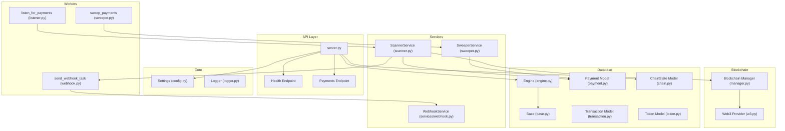
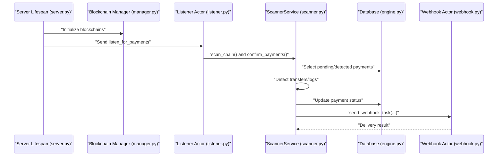
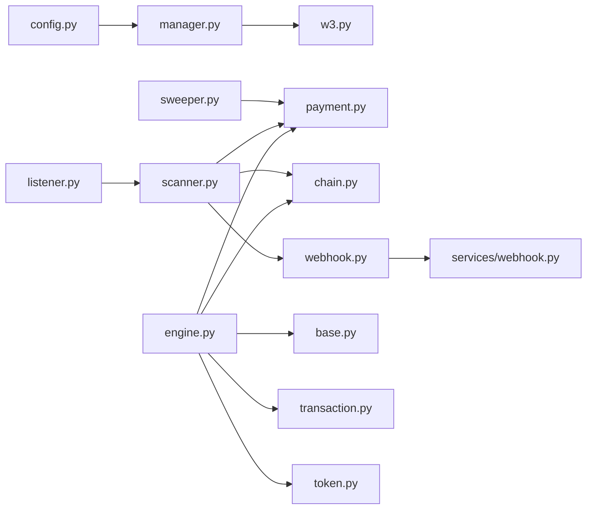
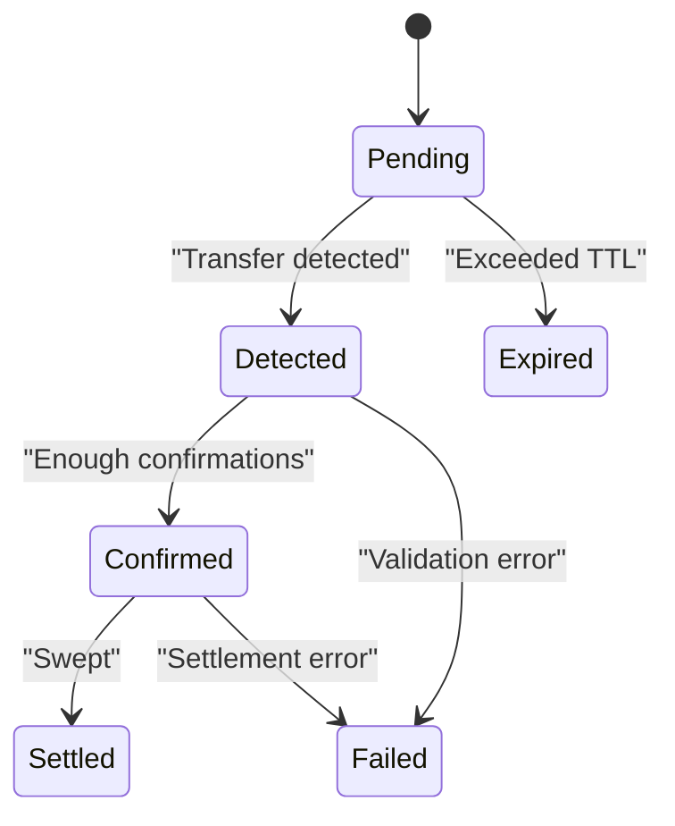
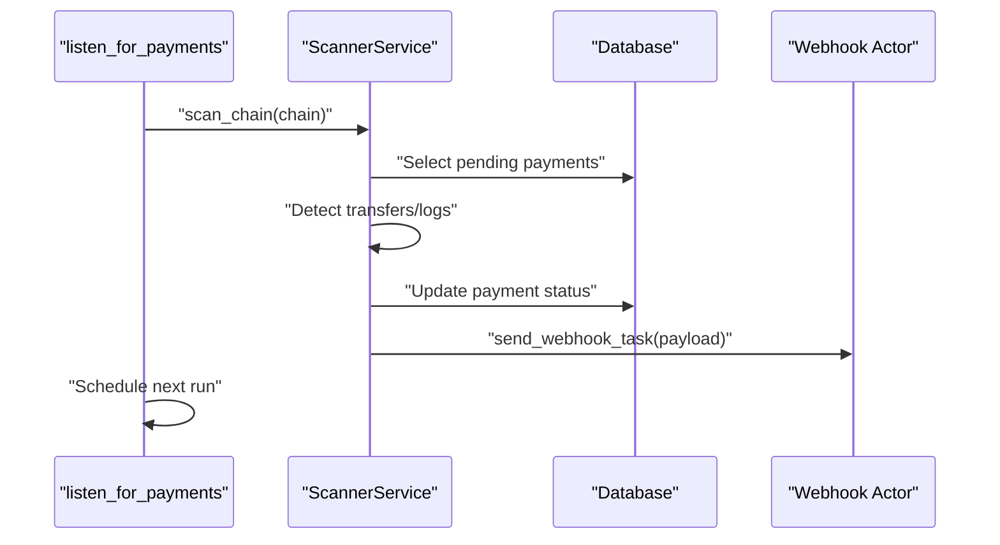

# Troubleshooting Guide

<cite>
**Referenced Files in This Document**
- [README.md](file://README.md)
- [server.py](file://server.py)
- [app/core/config.py](file://app/core/config.py)
- [app/core/logger.py](file://app/core/logger.py)
- [app/db/engine.py](file://app/db/engine.py)
- [app/db/base.py](file://app/db/base.py)
- [app/db/models/payment.py](file://app/db/models/payment.py)
- [app/db/models/transaction.py](file://app/db/models/transaction.py)
- [app/db/models/token.py](file://app/db/models/token.py)
- [app/db/models/chain.py](file://app/db/models/chain.py)
- [app/blockchain/manager.py](file://app/blockchain/manager.py)
- [app/blockchain/w3.py](file://app/blockchain/w3.py)
- [app/services/blockchain/scanner.py](file://app/services/blockchain/scanner.py)
- [app/services/blockchain/sweeper.py](file://app/services/blockchain/sweeper.py)
- [app/workers/listener.py](file://app/workers/listener.py)
- [app/workers/sweeper.py](file://app/workers/sweeper.py)
- [app/workers/webhook.py](file://app/workers/webhook.py)
- [app/services/webhook.py](file://app/services/webhook.py)
- [migrate.py](file://migrate.py)
- [MIGRATIONS.md](file://MIGRATIONS.md)
</cite>

## Table of Contents
1. [Introduction](#introduction)
2. [Project Structure](#project-structure)
3. [Core Components](#core-components)
4. [Architecture Overview](#architecture-overview)
5. [Detailed Component Analysis](#detailed-component-analysis)
6. [Dependency Analysis](#dependency-analysis)
7. [Performance Considerations](#performance-considerations)
8. [Troubleshooting Guide](#troubleshooting-guide)
9. [Conclusion](#conclusion)
10. [Appendices](#appendices)

## Introduction
This guide provides a comprehensive troubleshooting methodology for the cTrip Payment Gateway. It focuses on diagnosing and resolving payment processing failures, blockchain connectivity issues, database synchronization problems, and background worker malfunctions. It also covers debugging techniques for transaction submission failures, gas estimation errors, and network timeouts, along with error analysis workflows, log interpretation strategies, escalation procedures, and recovery steps for scenarios such as payment detection failures, webhook delivery issues, and database corruption recovery.

## Project Structure
The system is organized around:
- API layer (FastAPI) with health and payment endpoints
- Blockchain abstraction supporting multiple chains
- Asynchronous database operations with SQLAlchemy 2.0 and Alembic migrations
- Background workers powered by Dramatiq and Redis
- Services for scanning, sweeping, and webhook delivery

**Diagram sources**
- [server.py](file://server.py#L21-L47)
- [app/core/config.py](file://app/core/config.py#L10-L126)
- [app/core/logger.py](file://app/core/logger.py#L1-L4)
- [app/blockchain/manager.py](file://app/blockchain/manager.py#L8-L33)
- [app/blockchain/w3.py](file://app/blockchain/w3.py)
- [app/services/blockchain/scanner.py](file://app/services/blockchain/scanner.py#L14-L134)
- [app/services/blockchain/sweeper.py](file://app/services/blockchain/sweeper.py#L11-L54)
- [app/workers/listener.py](file://app/workers/listener.py#L21-L46)
- [app/workers/sweeper.py](file://app/workers/sweeper.py#L19-L40)
- [app/workers/webhook.py](file://app/workers/webhook.py#L13-L37)
- [app/db/engine.py](file://app/db/engine.py#L1-L32)
- [app/db/base.py](file://app/db/base.py#L1-L5)
- [app/db/models/payment.py](file://app/db/models/payment.py#L41-L74)
- [app/db/models/transaction.py](file://app/db/models/transaction.py#L29-L40)
- [app/db/models/token.py](file://app/db/models/token.py#L6-L15)
- [app/db/models/chain.py](file://app/db/models/chain.py#L9-L17)

**Section sources**
- [README.md](file://README.md#L1-L87)
- [server.py](file://server.py#L1-L56)

## Core Components
- Settings and configuration: centralizes environment, RPC, Redis, chains, secrets, and database URLs.
- Database engine and models: async/sync engines, Base declarative, and ORM models for payments, transactions, tokens, and chain states.
- Blockchain manager and provider: dynamic chain selection and Web3 provider retrieval.
- Services: ScannerService for detecting and confirming payments; SweeperService for settling confirmed payments.
- Workers: Dramatiq actors for continuous scanning, sweeping, and webhook dispatch.
- Health and API: FastAPI endpoints and lifecycle hooks.

Key responsibilities and failure points:
- Configuration validation and secrets correctness
- Blockchain RPC availability and response consistency
- Database connectivity, migrations, and concurrent access
- Worker scheduling, retries, and event loop management
- Webhook delivery reliability and signature verification

**Section sources**
- [app/core/config.py](file://app/core/config.py#L10-L126)
- [app/db/engine.py](file://app/db/engine.py#L1-L32)
- [app/db/models/payment.py](file://app/db/models/payment.py#L41-L74)
- [app/db/models/transaction.py](file://app/db/models/transaction.py#L29-L40)
- [app/db/models/token.py](file://app/db/models/token.py#L6-L15)
- [app/db/models/chain.py](file://app/db/models/chain.py#L9-L17)
- [app/blockchain/manager.py](file://app/blockchain/manager.py#L8-L33)
- [app/services/blockchain/scanner.py](file://app/services/blockchain/scanner.py#L14-L134)
- [app/services/blockchain/sweeper.py](file://app/services/blockchain/sweeper.py#L11-L54)
- [app/workers/listener.py](file://app/workers/listener.py#L21-L46)
- [app/workers/sweeper.py](file://app/workers/sweeper.py#L19-L40)
- [app/workers/webhook.py](file://app/workers/webhook.py#L13-L37)

## Architecture Overview
High-level runtime flow:
- On startup, the server initializes blockchain clients, HD wallet, chain states, and triggers workers.
- Workers periodically scan for new payments and confirm detected ones, updating statuses and optionally emitting webhooks.
- Sweeper settles confirmed payments by marking them as settled.
- Database operations are performed via async sessions and committed atomically per chain iteration.

**Diagram sources**
- [server.py](file://server.py#L21-L47)
- [app/blockchain/manager.py](file://app/blockchain/manager.py#L8-L33)
- [app/workers/listener.py](file://app/workers/listener.py#L21-L46)
- [app/services/blockchain/scanner.py](file://app/services/blockchain/scanner.py#L20-L134)
- [app/workers/webhook.py](file://app/workers/webhook.py#L13-L37)

## Detailed Component Analysis

### Blockchain Connectivity and Scanning
- ScannerService coordinates scanning within configured block ranges, updates ChainState, detects native and ERC20 transfers, and transitions payment statuses.
- It relies on Web3 provider retrieval and uses database transactions with row-level locking for ChainState updates.

Common failure modes:
- RPC endpoint unreachable or rate-limited
- Incorrect chain configuration or missing RPC URL
- Empty or stale ChainState leading to no-op scans
- Insufficient confirmations threshold misconfiguration

Operational checks:
- Verify RPC URL validity and chain name mapping
- Confirm ChainState exists and is recent
- Validate transfer topics and token addresses for ERC20 detection

**Section sources**
- [app/services/blockchain/scanner.py](file://app/services/blockchain/scanner.py#L14-L134)
- [app/blockchain/manager.py](file://app/blockchain/manager.py#L8-L33)
- [app/db/models/chain.py](file://app/db/models/chain.py#L9-L17)

### Payment Status Lifecycle and Confirmation Logic
- Payments progress through pending → detected → confirmed → settled.
- Confirmation depends on block height difference and configured confirmations threshold.
- Webhooks are dispatched upon confirmation when configured.

Failure scenarios:
- Payment remains stuck in pending due to missed detection
- Confirmation threshold too high causing delays
- Webhook delivery failures and retries

**Section sources**
- [app/db/models/payment.py](file://app/db/models/payment.py#L21-L58)
- [app/services/blockchain/scanner.py](file://app/services/blockchain/scanner.py#L97-L134)

### Sweeper and Settlement
- Sweeper identifies confirmed payments and marks them as settled.
- In a production implementation, this would broadcast transactions; currently a placeholder.

Failure scenarios:
- No confirmed payments to settle
- Errors during settlement placeholder logic
- Private key or account derivation issues

**Section sources**
- [app/services/blockchain/sweeper.py](file://app/services/blockchain/sweeper.py#L11-L54)
- [app/db/models/payment.py](file://app/db/models/payment.py#L21-L58)

### Webhook Delivery
- WebhookService sends notifications asynchronously; Dramatiq actor handles retries and error logging.
- Payload includes payment metadata; optional signature verification supported by configuration.

Failure scenarios:
- Destination endpoint unreachable or slow
- Signature mismatch or invalid secret
- Dramatiq retry exhaustion

**Section sources**
- [app/workers/webhook.py](file://app/workers/webhook.py#L13-L37)
- [app/services/webhook.py](file://app/services/webhook.py)

### Database Models and Synchronization
- Payments, Transactions, Tokens, and ChainStates define the core domain.
- Alembic manages schema evolution; helper script wraps common operations.

Failure scenarios:
- Schema mismatch after deployment
- Migration conflicts or unapplied changes
- SQLite-specific limitations requiring batch operations

**Section sources**
- [app/db/models/payment.py](file://app/db/models/payment.py#L41-L74)
- [app/db/models/transaction.py](file://app/db/models/transaction.py#L29-L40)
- [app/db/models/token.py](file://app/db/models/token.py#L6-L15)
- [app/db/models/chain.py](file://app/db/models/chain.py#L9-L17)
- [migrate.py](file://migrate.py#L1-L112)
- [MIGRATIONS.md](file://MIGRATIONS.md#L172-L216)

## Dependency Analysis

**Diagram sources**
- [app/core/config.py](file://app/core/config.py#L10-L126)
- [app/blockchain/manager.py](file://app/blockchain/manager.py#L8-L33)
- [app/blockchain/w3.py](file://app/blockchain/w3.py)
- [app/workers/listener.py](file://app/workers/listener.py#L21-L46)
- [app/services/blockchain/scanner.py](file://app/services/blockchain/scanner.py#L14-L134)
- [app/services/blockchain/sweeper.py](file://app/services/blockchain/sweeper.py#L11-L54)
- [app/workers/webhook.py](file://app/workers/webhook.py#L13-L37)
- [app/db/engine.py](file://app/db/engine.py#L1-L32)
- [app/db/base.py](file://app/db/base.py#L1-L5)
- [app/db/models/payment.py](file://app/db/models/payment.py#L41-L74)
- [app/db/models/transaction.py](file://app/db/models/transaction.py#L29-L40)
- [app/db/models/token.py](file://app/db/models/token.py#L6-L15)
- [app/db/models/chain.py](file://app/db/models/chain.py#L9-L17)

**Section sources**
- [app/core/config.py](file://app/core/config.py#L10-L126)
- [app/db/engine.py](file://app/db/engine.py#L1-L32)

## Performance Considerations
- Event loop isolation in workers: ensure each actor uses its own loop to avoid conflicts.
- Batch scanning: tune block batch size and confirmation thresholds to balance responsiveness and load.
- Database pooling: adjust pool sizes and pre-ping settings according to workload.
- Webhook concurrency: limit concurrent deliveries and configure retry backoff.

[No sources needed since this section provides general guidance]

## Troubleshooting Guide

### Payment Detection Failures
Symptoms:
- Payments remain in pending despite inbound transfers
- No entries in chain_states or outdated last_scanned_block

Checklist:
- Verify chains configuration and RPC URLs
- Confirm ChainState exists and is advancing
- Inspect scanner logs for detection attempts and block range
- Validate transfer amounts meet or exceed payment.amount
- For ERC20, verify token.address matches log address and decimals conversion

Remediation:
- Recreate ChainState rows if missing
- Adjust block_batch_size and confirmations_required
- Restart listener actor to re-scan recent blocks

**Section sources**
- [app/services/blockchain/scanner.py](file://app/services/blockchain/scanner.py#L20-L96)
- [app/db/models/chain.py](file://app/db/models/chain.py#L9-L17)
- [app/blockchain/manager.py](file://app/blockchain/manager.py#L8-L33)

### Confirmation Delays and Threshold Issues
Symptoms:
- Detected payments not transitioning to confirmed
- Excessively long confirmation times

Checklist:
- Review confirmations_required and block_batch_size
- Compare detected_in_block with latest block number
- Check for RPC latency or low block production rates

Remediation:
- Lower confirmations_required temporarily for testing
- Increase block_batch_size to reduce overhead
- Monitor latest block number and network health

**Section sources**
- [app/services/blockchain/scanner.py](file://app/services/blockchain/scanner.py#L97-L134)

### Webhook Delivery Issues
Symptoms:
- Webhook actor errors and retries
- Missing or delayed notifications

Checklist:
- Validate webhook_url and webhook_secret
- Inspect Dramatiq broker connectivity (Redis)
- Review webhook service logs and payload structure
- Confirm destination endpoint availability and response codes

Remediation:
- Fix endpoint URL and secret
- Increase Dramatiq max_retries cautiously
- Add circuit breaker or dead-letter handling

**Section sources**
- [app/workers/webhook.py](file://app/workers/webhook.py#L13-L37)
- [app/core/config.py](file://app/core/config.py#L63-L71)

### Blockchain Connectivity Problems
Symptoms:
- ScannerService unable to fetch blocks or logs
- RPC timeouts or rate limits

Checklist:
- Verify RPC_URL and chain name mapping
- Test RPC endpoint with curl or web3 client
- Confirm firewall and network policies
- Check for chain-specific RPC quotas

Remediation:
- Switch to a reliable RPC provider
- Implement retry/backoff and circuit breaker
- Use fallback providers for redundancy

**Section sources**
- [app/core/config.py](file://app/core/config.py#L28-L32)
- [app/blockchain/manager.py](file://app/blockchain/manager.py#L8-L33)
- [app/services/blockchain/scanner.py](file://app/services/blockchain/scanner.py#L20-L96)

### Database Synchronization and Migration Issues
Symptoms:
- Schema mismatches, missing tables, or constraint violations
- Alembic errors or unapplied migrations

Checklist:
- Run migration helper to inspect current revision and history
- Review generated migrations for destructive changes
- Ensure all models are imported in Alembic env
- For SQLite, confirm batch mode compatibility

Remediation:
- Apply pending migrations or downgrade as needed
- Use stamp head to mark DB current if safe
- Backup DB before applying migrations in production

**Section sources**
- [migrate.py](file://migrate.py#L1-L112)
- [MIGRATIONS.md](file://MIGRATIONS.md#L172-L216)

### Background Worker Malfunctions
Symptoms:
- Workers not running or stuck cycles
- Event loop errors or actor restart loops

Checklist:
- Confirm Redis connectivity and queue health
- Validate Dramatiq actor decorators and scheduling
- Inspect worker logs for exceptions and retry counts
- Ensure each actor uses its own event loop

Remediation:
- Restart workers and verify broker connectivity
- Reduce time_limit and max_retries for stability
- Add health checks for worker liveness

**Section sources**
- [app/workers/listener.py](file://app/workers/listener.py#L21-L46)
- [app/workers/sweeper.py](file://app/workers/sweeper.py#L19-L40)
- [MIGRATIONS.md](file://MIGRATIONS.md#L174-L176)

### Transaction Submission Failures and Gas Estimation Errors
Note: The sweeper currently marks payments as settled without broadcasting transactions. If implementing transaction submission:
- Validate private key and account derivation
- Estimate gas price/gas limit and handle estimation failures
- Implement nonce management and resubmission logic
- Monitor for replacement fee requirements and mempool congestion

[No sources needed since this section provides general guidance]

### Network Timeout Issues
Symptoms:
- Slow or hanging blockchain queries
- Timeouts during block or log retrieval

Checklist:
- Tune RPC timeouts and retry backoff
- Use connection pooling and keep-alive
- Consider caching recent block data locally

Remediation:
- Increase timeout values and implement exponential backoff
- Switch to faster RPC providers or local nodes
- Add circuit breaker to prevent cascading failures

[No sources needed since this section provides general guidance]

### Log Interpretation Strategies
- Use structured logs emitted by workers and services
- Correlate timestamps with ChainState last_scanned_block and payment detected_in_block
- Filter by actor names (listen_for_payments, sweep_payments, send_webhook_task)
- Track database commit points and error boundaries

**Section sources**
- [app/workers/listener.py](file://app/workers/listener.py#L21-L46)
- [app/workers/sweeper.py](file://app/workers/sweeper.py#L19-L40)
- [app/workers/webhook.py](file://app/workers/webhook.py#L13-L37)
- [app/services/blockchain/scanner.py](file://app/services/blockchain/scanner.py#L20-L134)

### Escalation Procedures for Critical Failures
- Isolate failing subsystem (disable webhooks, pause sweeping, or reduce scan frequency)
- Capture logs, database snapshots, and migration diffs
- Roll back to known-good revisions if necessary
- Engage platform team for RPC provider or infrastructure issues

[No sources needed since this section provides general guidance]

### Diagnostic Commands and Tools
- Health checks: use FastAPI health endpoints
- Database migrations: use helper script to inspect and apply migrations
- Worker status: monitor Dramatiq broker queues and actor logs
- Blockchain health: query latest block number and estimate gas

**Section sources**
- [README.md](file://README.md#L45-L69)
- [migrate.py](file://migrate.py#L1-L112)
- [app/workers/listener.py](file://app/workers/listener.py#L21-L46)
- [app/workers/sweeper.py](file://app/workers/sweeper.py#L19-L40)

### Recovery Procedures
- Payment detection recovery: reset ChainState last_scanned_block to a recent block and trigger listener
- Webhook recovery: re-send failed payloads and adjust retry policy
- Database recovery: backup and restore from last known good migration; use stamp head only if schema is correct but revision table is inconsistent
- Worker recovery: restart actors and verify Redis connectivity

**Section sources**
- [app/services/blockchain/scanner.py](file://app/services/blockchain/scanner.py#L20-L96)
- [app/workers/webhook.py](file://app/workers/webhook.py#L13-L37)
- [migrate.py](file://migrate.py#L1-L112)
- [MIGRATIONS.md](file://MIGRATIONS.md#L189-L194)

### Performance Troubleshooting, Memory Leaks, and Resource Exhaustion
- Monitor worker CPU and memory usage; reduce concurrency if needed
- Limit block_batch_size and confirmations_required to lower peak load
- Enable database pool diagnostics and adjust pool sizes
- Watch for event loop contention and ensure proper loop isolation per actor

[No sources needed since this section provides general guidance]

## Conclusion
This guide outlines a systematic approach to diagnosing and resolving cTrip Payment Gateway issues across payment processing, blockchain connectivity, database synchronization, and background workers. By validating configuration, interpreting logs, and following the remediation steps and recovery procedures outlined above, most operational problems can be identified and resolved efficiently.

[No sources needed since this section summarizes without analyzing specific files]

## Appendices

### A. Payment Status Transition Flow

**Diagram sources**
- [app/db/models/payment.py](file://app/db/models/payment.py#L21-L58)
- [app/services/blockchain/scanner.py](file://app/services/blockchain/scanner.py#L97-L134)
- [app/services/blockchain/sweeper.py](file://app/services/blockchain/sweeper.py#L16-L54)

### B. Worker Execution Sequence

**Diagram sources**
- [app/workers/listener.py](file://app/workers/listener.py#L21-L46)
- [app/services/blockchain/scanner.py](file://app/services/blockchain/scanner.py#L20-L134)
- [app/workers/webhook.py](file://app/workers/webhook.py#L13-L37)