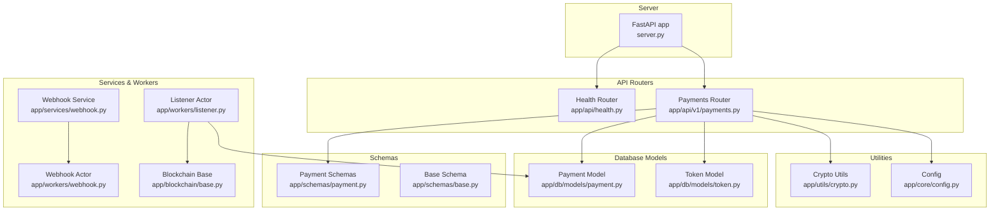
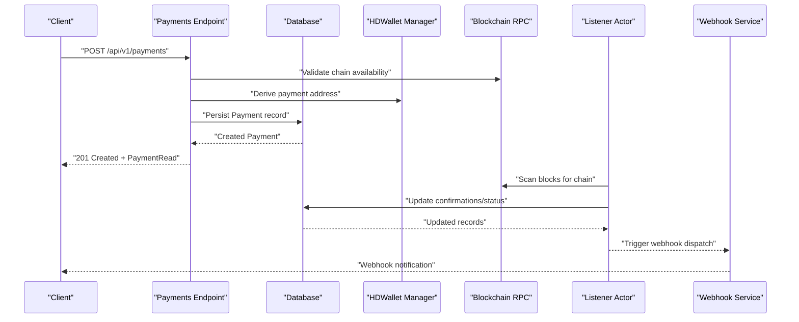
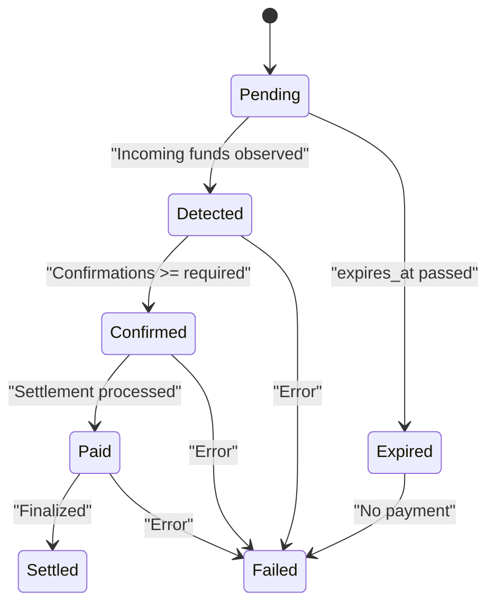
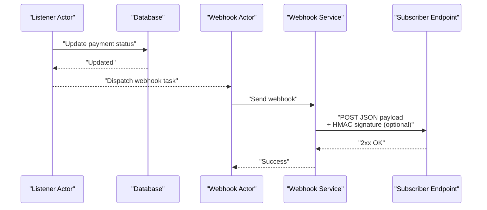
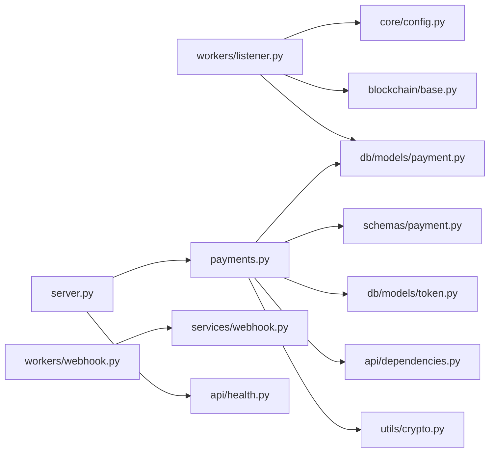
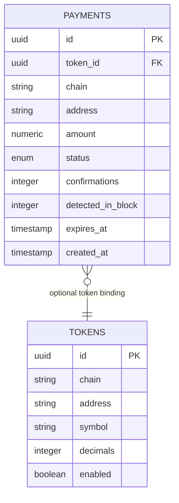

# API Reference

<cite>
**Referenced Files in This Document**
- [server.py](https://github.com/rakibhossain72/ctrip/blob/main/server.py)
- [app/api/v1/payments.py](https://github.com/rakibhossain72/ctrip/blob/main/app/api/v1/payments.py)
- [app/api/health.py](https://github.com/rakibhossain72/ctrip/blob/main/app/api/health.py)
- [app/api/dependencies.py](https://github.com/rakibhossain72/ctrip/blob/main/app/api/dependencies.py)
- [app/schemas/payment.py](https://github.com/rakibhossain72/ctrip/blob/main/app/schemas/payment.py)
- [app/schemas/base.py](https://github.com/rakibhossain72/ctrip/blob/main/app/schemas/base.py)
- [app/db/models/payment.py](https://github.com/rakibhossain72/ctrip/blob/main/app/db/models/payment.py)
- [app/db/models/token.py](https://github.com/rakibhossain72/ctrip/blob/main/app/db/models/token.py)
- [app/utils/crypto.py](https://github.com/rakibhossain72/ctrip/blob/main/app/utils/crypto.py)
- [app/services/webhook.py](https://github.com/rakibhossain72/ctrip/blob/main/app/services/webhook.py)
- [app/workers/webhook.py](https://github.com/rakibhossain72/ctrip/blob/main/app/workers/webhook.py)
- [app/workers/listener.py](https://github.com/rakibhossain72/ctrip/blob/main/app/workers/listener.py)
- [app/blockchain/base.py](https://github.com/rakibhossain72/ctrip/blob/main/app/blockchain/base.py)
- [app/core/config.py](https://github.com/rakibhossain72/ctrip/blob/main/app/core/config.py)
- [chains.yaml](https://github.com/rakibhossain72/ctrip/blob/main/chains.yaml)
</cite>

## Table of Contents
1. [Introduction](#introduction)
2. [Project Structure](#project-structure)
3. [Core Components](#core-components)
4. [Architecture Overview](#architecture-overview)
5. [Detailed Component Analysis](#detailed-component-analysis)
6. [Dependency Analysis](#dependency-analysis)
7. [Performance Considerations](#performance-considerations)
8. [Troubleshooting Guide](#troubleshooting-guide)
9. [Conclusion](#conclusion)
10. [Appendices](#appendices)

## Introduction
This document provides comprehensive API documentation for the cTrip Payment Gateway. It covers:
- Payment creation endpoint: HTTP method, URL pattern, request/response schemas, validation rules, and error handling
- Health check endpoint for system monitoring
- Payment lifecycle, status transitions, and webhook integration patterns
- Client implementation guidelines, rate limiting considerations, and best practices
- Debugging techniques and operational insights

The API is built with FastAPI and exposes REST endpoints under a versioned namespace. Payments are created with blockchain-specific addresses and optional token support. Background workers monitor incoming transactions and update payment statuses accordingly.

## Project Structure
Key API and supporting components:
- API routers: health and payments endpoints
- Schemas: request/response models and base configuration
- Database models: payment entity and token metadata
- Utilities: HD wallet generation and cryptographic helpers
- Services: webhook delivery
- Workers: asynchronous listeners and webhook dispatchers
- Blockchain integration: generic base class for RPC interactions
- Configuration: runtime settings and chain definitions

**Diagram sources**
- [server.py](https://github.com/rakibhossain72/ctrip/blob/main/server.py#L45-L47)
- [app/api/health.py](https://github.com/rakibhossain72/ctrip/blob/main/app/api/health.py#L4-L7)
- [app/api/v1/payments.py](https://github.com/rakibhossain72/ctrip/blob/main/app/api/v1/payments.py#L12-L62)
- [app/schemas/payment.py](https://github.com/rakibhossain72/ctrip/blob/main/app/schemas/payment.py#L12-L62)
- [app/schemas/base.py](https://github.com/rakibhossain72/ctrip/blob/main/app/schemas/base.py#L4-L10)
- [app/db/models/payment.py](https://github.com/rakibhossain72/ctrip/blob/main/app/db/models/payment.py#L41-L58)
- [app/db/models/token.py](https://github.com/rakibhossain72/ctrip/blob/main/app/db/models/token.py#L6-L15)
- [app/utils/crypto.py](https://github.com/rakibhossain72/ctrip/blob/main/app/utils/crypto.py#L5-L46)
- [app/services/webhook.py](https://github.com/rakibhossain72/ctrip/blob/main/app/services/webhook.py#L10-L45)
- [app/workers/webhook.py](https://github.com/rakibhossain72/ctrip/blob/main/app/workers/webhook.py#L13-L37)
- [app/workers/listener.py](https://github.com/rakibhossain72/ctrip/blob/main/app/workers/listener.py#L21-L46)
- [app/blockchain/base.py](https://github.com/rakibhossain72/ctrip/blob/main/app/blockchain/base.py#L22-L146)
- [app/core/config.py](https://github.com/rakibhossain72/ctrip/blob/main/app/core/config.py#L10-L126)

**Section sources**
- [server.py](https://github.com/rakibhossain72/ctrip/blob/main/server.py#L45-L47)
- [app/api/health.py](https://github.com/rakibhossain72/ctrip/blob/main/app/api/health.py#L4-L7)
- [app/api/v1/payments.py](https://github.com/rakibhossain72/ctrip/blob/main/app/api/v1/payments.py#L12-L62)
- [app/schemas/payment.py](https://github.com/rakibhossain72/ctrip/blob/main/app/schemas/payment.py#L12-L62)
- [app/schemas/base.py](https://github.com/rakibhossain72/ctrip/blob/main/app/schemas/base.py#L4-L10)
- [app/db/models/payment.py](https://github.com/rakibhossain72/ctrip/blob/main/app/db/models/payment.py#L41-L58)
- [app/db/models/token.py](https://github.com/rakibhossain72/ctrip/blob/main/app/db/models/token.py#L6-L15)
- [app/utils/crypto.py](https://github.com/rakibhossain72/ctrip/blob/main/app/utils/crypto.py#L5-L46)
- [app/services/webhook.py](https://github.com/rakibhossain72/ctrip/blob/main/app/services/webhook.py#L10-L45)
- [app/workers/webhook.py](https://github.com/rakibhossain72/ctrip/blob/main/app/workers/webhook.py#L13-L37)
- [app/workers/listener.py](https://github.com/rakibhossain72/ctrip/blob/main/app/workers/listener.py#L21-L46)
- [app/blockchain/base.py](https://github.com/rakibhossain72/ctrip/blob/main/app/blockchain/base.py#L22-L146)
- [app/core/config.py](https://github.com/rakibhossain72/ctrip/blob/main/app/core/config.py#L10-L126)

## Core Components
- Health check endpoint: GET /health
- Payment creation endpoint: POST /api/v1/payments/

Authentication and authorization:
- No explicit authentication middleware is present in the documented files. Authentication and rate limiting should be enforced at the reverse proxy or API gateway level.

Rate limiting:
- Not implemented in the application code. Apply rate limiting at ingress or via external controls.

Operational settings:
- Chain configurations are loaded from a YAML file and injected into the application state during startup.

**Section sources**
- [app/api/health.py](https://github.com/rakibhossain72/ctrip/blob/main/app/api/health.py#L4-L7)
- [app/api/v1/payments.py](https://github.com/rakibhossain72/ctrip/blob/main/app/api/v1/payments.py#L12-L62)
- [server.py](https://github.com/rakibhossain72/ctrip/blob/main/server.py#L21-L42)
- [chains.yaml](https://github.com/rakibhossain72/ctrip/blob/main/chains.yaml#L1-L24)

## Architecture Overview
High-level API flow:
- Client calls payment creation endpoint with chain, token_id (optional), and amount.
- The backend validates chain support and token existence, derives a payment address using an HD wallet, sets an expiration, persists the record, and returns the payment details.
- Background workers scan blocks, detect incoming payments, update confirmations and statuses, and optionally send webhooks.

**Diagram sources**
- [app/api/v1/payments.py](https://github.com/rakibhossain72/ctrip/blob/main/app/api/v1/payments.py#L18-L54)
- [app/utils/crypto.py](https://github.com/rakibhossain72/ctrip/blob/main/app/utils/crypto.py#L27-L46)
- [app/db/models/payment.py](https://github.com/rakibhossain72/ctrip/blob/main/app/db/models/payment.py#L41-L58)
- [app/workers/listener.py](https://github.com/rakibhossain72/ctrip/blob/main/app/workers/listener.py#L21-L46)
- [app/services/webhook.py](https://github.com/rakibhossain72/ctrip/blob/main/app/services/webhook.py#L10-L45)

## Detailed Component Analysis

### Health Check Endpoint
- Method: GET
- Path: /health
- Purpose: System readiness and liveness probe
- Response: JSON object with status field set to ok

Example request:
- GET /health

Example response:
- 200 OK
- Body: {"status":"ok"}

Notes:
- No authentication required
- Intended for monitoring systems and load balancers

**Section sources**
- [app/api/health.py](https://github.com/rakibhossain72/ctrip/blob/main/app/api/health.py#L4-L7)

### Payment Creation Endpoint
- Method: POST
- Path: /api/v1/payments
- Description: Creates a new payment with a blockchain address and expiration. Optionally binds to a token on the same chain.

Request body schema (PaymentCreate):
- amount: integer, required, must be greater than 0
- chain: string, required, length between 3 and 20 characters
- token_id: UUID, optional, must match a token on the same chain

Validation rules:
- chain must be supported (loaded from configuration)
- token_id must correspond to a token record on the same chain
- amount must be positive
- address is generated by the HD wallet manager
- expires_at is set to 30 minutes from UTC now

Response body schema (PaymentRead):
- id: UUID
- chain: string
- token_id: UUID or null
- address: string
- amount: integer
- status: enum among pending, detected, confirmed, paid, expired, settled, failed
- confirmations: integer
- created_at: datetime
- expires_at: datetime

Success response:
- 201 Created
- Body: PaymentRead

Error response:
- 400 Bad Request
- Body: {"detail": "<error message>"}
- Rollback is performed on exceptions

Example request (JSON):
- POST /api/v1/payments
- Headers: Content-Type: application/json
- Body:
  - amount: 1000000000000000000
  - chain: "bsc"
  - token_id: "123e4567-e89b-12d3-a456-426614174000"

Example response (JSON):
- 201 Created
- Body:
  - id: "98765432-1234-5678-9abc-1234567890ab"
  - chain: "bsc"
  - token_id: "123e4567-e89b-12d3-a456-426614174000"
  - address: "0x..."
  - amount: 1000000000000000000
  - status: "pending"
  - confirmations: 0
  - created_at: "2025-01-01T12:00:00Z"
  - expires_at: "2025-01-01T12:30:00Z"

Error response (JSON):
- 400 Bad Request
- Body: {"detail": "Unsupported chain: <chain>"}
- Or: {"detail": "Token <id> not found for chain <chain>"}

Notes:
- Authentication: Not implemented in code; enforce at ingress
- Rate limiting: Not implemented in code; apply externally
- Expiration: Fixed 30-minute TTL from creation time

**Section sources**
- [app/api/v1/payments.py](https://github.com/rakibhossain72/ctrip/blob/main/app/api/v1/payments.py#L18-L62)
- [app/schemas/payment.py](https://github.com/rakibhossain72/ctrip/blob/main/app/schemas/payment.py#L20-L24)
- [app/schemas/payment.py](https://github.com/rakibhossain72/ctrip/blob/main/app/schemas/payment.py#L35-L41)
- [app/db/models/payment.py](https://github.com/rakibhossain72/ctrip/blob/main/app/db/models/payment.py#L21-L39)
- [app/db/models/token.py](https://github.com/rakibhossain72/ctrip/blob/main/app/db/models/token.py#L6-L15)
- [app/api/dependencies.py](https://github.com/rakibhossain72/ctrip/blob/main/app/api/dependencies.py#L5-L15)
- [app/utils/crypto.py](https://github.com/rakibhossain72/ctrip/blob/main/app/utils/crypto.py#L27-L46)

### Payment Lifecycle and Status Transitions
Status enumeration:
- pending, detected, confirmed, paid, expired, settled, failed

Lifecycle overview:
- Creation: status starts as pending
- Detection: incoming funds observed on-chain
- Confirmation: confirmations threshold reached
- Paid: sufficient confirmations and settlement logic applied
- Expired: expires_at exceeded without payment
- Settled: final state after successful settlement
- Failed: errors encountered during processing

**Diagram sources**
- [app/db/models/payment.py](https://github.com/rakibhossain72/ctrip/blob/main/app/db/models/payment.py#L21-L39)

**Section sources**
- [app/db/models/payment.py](https://github.com/rakibhossain72/ctrip/blob/main/app/db/models/payment.py#L21-L39)

### Webhook Integration Patterns
Webhook delivery:
- Asynchronous via Dramatiq actors
- Signed with HMAC-SHA256 when a secret is configured
- Payload delivered as JSON with X-Webhook-Signature header

Configuration:
- Global webhook URL and secret are provided via settings
- Webhook signing is optional

Actor behavior:
- Retries are configured; failures are logged and retried per actor settings

**Diagram sources**
- [app/workers/listener.py](https://github.com/rakibhossain72/ctrip/blob/main/app/workers/listener.py#L21-L46)
- [app/workers/webhook.py](https://github.com/rakibhossain72/ctrip/blob/main/app/workers/webhook.py#L13-L37)
- [app/services/webhook.py](https://github.com/rakibhossain72/ctrip/blob/main/app/services/webhook.py#L10-L45)
- [app/core/config.py](https://github.com/rakibhossain72/ctrip/blob/main/app/core/config.py#L63-L71)

**Section sources**
- [app/services/webhook.py](https://github.com/rakibhossain72/ctrip/blob/main/app/services/webhook.py#L10-L45)
- [app/workers/webhook.py](https://github.com/rakibhossain72/ctrip/blob/main/app/workers/webhook.py#L13-L37)
- [app/core/config.py](https://github.com/rakibhossain72/ctrip/blob/main/app/core/config.py#L63-L71)

### Blockchain and Chain Support
Chain configuration:
- Chains are loaded from a YAML file and injected into application state
- Supported chains include at least bsc and anvil in the provided sample

RPC interactions:
- Generic base class supports balance queries, gas price estimation, transaction building, and receipt polling
- POA support and caching of gas prices are included

**Section sources**
- [chains.yaml](https://github.com/rakibhossain72/ctrip/blob/main/chains.yaml#L12-L24)
- [app/blockchain/base.py](https://github.com/rakibhossain72/ctrip/blob/main/app/blockchain/base.py#L22-L146)
- [server.py](https://github.com/rakibhossain72/ctrip/blob/main/server.py#L21-L34)

## Dependency Analysis
Key dependencies and relationships:
- Payments endpoint depends on database session, HD wallet manager, and blockchain registry
- Schemas define request/response contracts and inherit shared configuration
- Database models define persistence and relationships
- Workers depend on configuration and blockchain services

**Diagram sources**
- [app/api/v1/payments.py](https://github.com/rakibhossain72/ctrip/blob/main/app/api/v1/payments.py#L1-L11)
- [app/schemas/payment.py](https://github.com/rakibhossain72/ctrip/blob/main/app/schemas/payment.py#L1-L10)
- [app/db/models/payment.py](https://github.com/rakibhossain72/ctrip/blob/main/app/db/models/payment.py#L1-L10)
- [app/db/models/token.py](https://github.com/rakibhossain72/ctrip/blob/main/app/db/models/token.py#L1-L5)
- [app/api/dependencies.py](https://github.com/rakibhossain72/ctrip/blob/main/app/api/dependencies.py#L1-L15)
- [app/utils/crypto.py](https://github.com/rakibhossain72/ctrip/blob/main/app/utils/crypto.py#L1-L10)
- [app/workers/listener.py](https://github.com/rakibhossain72/ctrip/blob/main/app/workers/listener.py#L1-L16)
- [app/core/config.py](https://github.com/rakibhossain72/ctrip/blob/main/app/core/config.py#L1-L20)
- [app/blockchain/base.py](https://github.com/rakibhossain72/ctrip/blob/main/app/blockchain/base.py#L1-L20)
- [app/services/webhook.py](https://github.com/rakibhossain72/ctrip/blob/main/app/services/webhook.py#L1-L10)
- [app/workers/webhook.py](https://github.com/rakibhossain72/ctrip/blob/main/app/workers/webhook.py#L1-L10)
- [server.py](https://github.com/rakibhossain72/ctrip/blob/main/server.py#L1-L20)

**Section sources**
- [app/api/v1/payments.py](https://github.com/rakibhossain72/ctrip/blob/main/app/api/v1/payments.py#L1-L11)
- [app/schemas/payment.py](https://github.com/rakibhossain72/ctrip/blob/main/app/schemas/payment.py#L1-L10)
- [app/db/models/payment.py](https://github.com/rakibhossain72/ctrip/blob/main/app/db/models/payment.py#L1-L10)
- [app/db/models/token.py](https://github.com/rakibhossain72/ctrip/blob/main/app/db/models/token.py#L1-L5)
- [app/api/dependencies.py](https://github.com/rakibhossain72/ctrip/blob/main/app/api/dependencies.py#L1-L15)
- [app/utils/crypto.py](https://github.com/rakibhossain72/ctrip/blob/main/app/utils/crypto.py#L1-L10)
- [app/workers/listener.py](https://github.com/rakibhossain72/ctrip/blob/main/app/workers/listener.py#L1-L16)
- [app/core/config.py](https://github.com/rakibhossain72/ctrip/blob/main/app/core/config.py#L1-L20)
- [app/blockchain/base.py](https://github.com/rakibhossain72/ctrip/blob/main/app/blockchain/base.py#L1-L20)
- [app/services/webhook.py](https://github.com/rakibhossain72/ctrip/blob/main/app/services/webhook.py#L1-L10)
- [app/workers/webhook.py](https://github.com/rakibhossain72/ctrip/blob/main/app/workers/webhook.py#L1-L10)
- [server.py](https://github.com/rakibhossain72/ctrip/blob/main/server.py#L1-L20)

## Performance Considerations
- Gas price caching: The blockchain base class caches gas price updates for a short duration to reduce RPC calls
- Batch scanning: Listener actor scans in batches and schedules periodic runs to avoid excessive load
- Asynchronous delivery: Webhooks are sent asynchronously to prevent blocking the main processing pipeline
- Recommendations:
  - Configure rate limiting at ingress
  - Monitor blockchain RPC latency and adjust timeouts
  - Scale workers horizontally if throughput increases

**Section sources**
- [app/blockchain/base.py](https://github.com/rakibhossain72/ctrip/blob/main/app/blockchain/base.py#L65-L80)
- [app/workers/listener.py](https://github.com/rakibhossain72/ctrip/blob/main/app/workers/listener.py#L15-L16)
- [app/services/webhook.py](https://github.com/rakibhossain72/ctrip/blob/main/app/services/webhook.py#L33-L36)

## Troubleshooting Guide
Common issues and resolutions:
- Unsupported chain error: Verify chain name matches entries in configuration
- Token not found: Ensure token_id exists and belongs to the same chain
- Webhook delivery failures: Check webhook URL and secret configuration; inspect actor logs for retry attempts
- Payment stuck in pending: Confirm listener actor is running and blockchain connectivity is healthy
- Expiration handling: Clients should poll or rely on webhooks for updates after expiration

Debugging steps:
- Health check: Call /health to verify service availability
- Logs: Review application and worker logs for errors and warnings
- Configuration: Validate chains.yaml and environment settings

**Section sources**
- [app/api/v1/payments.py](https://github.com/rakibhossain72/ctrip/blob/main/app/api/v1/payments.py#L25-L34)
- [app/workers/webhook.py](https://github.com/rakibhossain72/ctrip/blob/main/app/workers/webhook.py#L24-L36)
- [app/workers/listener.py](https://github.com/rakibhossain72/ctrip/blob/main/app/workers/listener.py#L21-L46)
- [app/api/health.py](https://github.com/rakibhossain72/ctrip/blob/main/app/api/health.py#L4-L7)

## Conclusion
The cTrip Payment Gateway exposes a clean REST interface for payment creation and system health checks, backed by robust schema validation, asynchronous processing, and webhook notifications. Clients should implement authentication and rate limiting at the ingress layer, ensure proper chain and token configuration, and integrate with webhooks for real-time updates. Operational monitoring and worker health are essential for reliable payment lifecycle management.

## Appendices

### API Definitions

- Health Check
  - Method: GET
  - Path: /health
  - Response: 200 OK with {"status":"ok"}

- Payment Creation
  - Method: POST
  - Path: /api/v1/payments
  - Request JSON fields:
    - amount: integer > 0
    - chain: string (3–20 chars)
    - token_id: UUID (optional)
  - Response JSON fields:
    - id, chain, token_id, address, amount, status, confirmations, created_at, expires_at
  - Success: 201 Created
  - Errors: 400 Bad Request with {"detail": "..."} on validation or processing failure

**Section sources**
- [app/api/health.py](https://github.com/rakibhossain72/ctrip/blob/main/app/api/health.py#L4-L7)
- [app/api/v1/payments.py](https://github.com/rakibhossain72/ctrip/blob/main/app/api/v1/payments.py#L18-L62)
- [app/schemas/payment.py](https://github.com/rakibhossain72/ctrip/blob/main/app/schemas/payment.py#L20-L24)
- [app/schemas/payment.py](https://github.com/rakibhossain72/ctrip/blob/main/app/schemas/payment.py#L35-L41)

### Data Models

**Diagram sources**
- [app/db/models/payment.py](https://github.com/rakibhossain72/ctrip/blob/main/app/db/models/payment.py#L41-L58)
- [app/db/models/token.py](https://github.com/rakibhossain72/ctrip/blob/main/app/db/models/token.py#L6-L15)

### Client Implementation Guidelines
- Authentication: Enforce at reverse proxy or API gateway; do not rely on application-layer auth
- Rate limiting: Apply per-client limits at ingress
- Request validation: Match PaymentCreate schema precisely
- Webhook handling: Verify signatures when secret is configured; idempotently process events
- Retry strategy: Use exponential backoff for transient failures
- Monitoring: Track endpoint latencies, error rates, and worker queue depths

[No sources needed since this section provides general guidance]