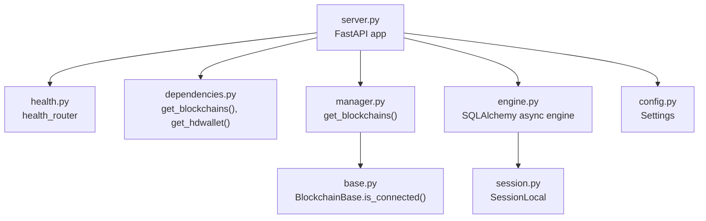
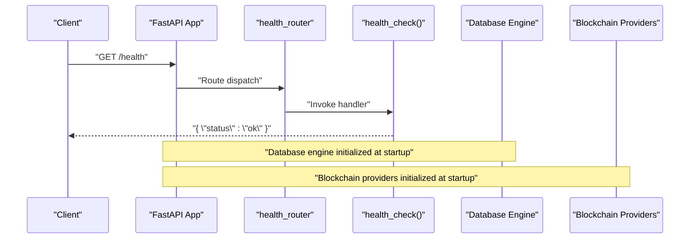
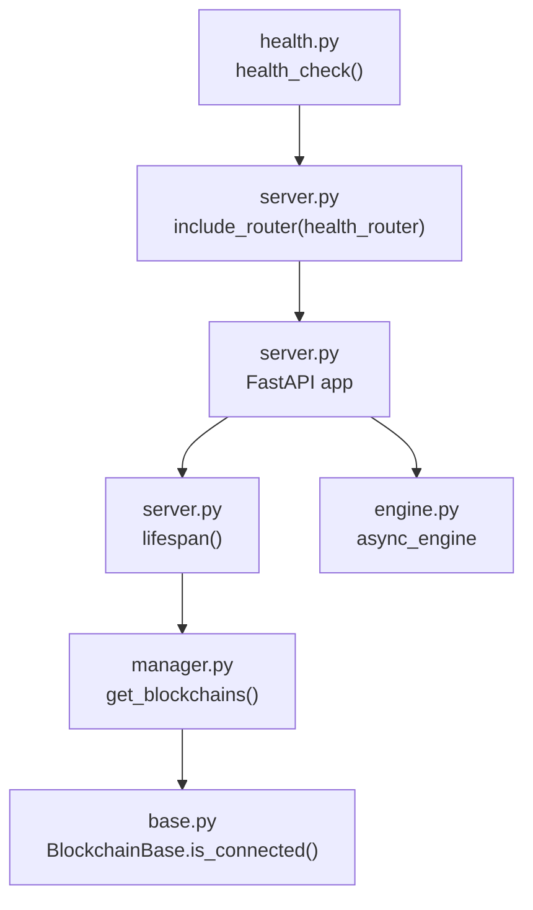

# Health Check Endpoint

<cite>
**Referenced Files in This Document**
- [health.py](file://app/api/health.py)
- [server.py](file://server.py)
- [dependencies.py](file://app/api/dependencies.py)
- [manager.py](file://app/blockchain/manager.py)
- [base.py](file://app/blockchain/base.py)
- [engine.py](file://app/db/engine.py)
- [session.py](file://app/db/session.py)
- [config.py](file://app/core/config.py)
- [__init__.py](file://app/api/__init__.py)
</cite>

## Table of Contents
1. [Introduction](#introduction)
2. [Project Structure](#project-structure)
3. [Core Components](#core-components)
4. [Architecture Overview](#architecture-overview)
5. [Detailed Component Analysis](#detailed-component-analysis)
6. [Dependency Analysis](#dependency-analysis)
7. [Performance Considerations](#performance-considerations)
8. [Troubleshooting Guide](#troubleshooting-guide)
9. [Conclusion](#conclusion)
10. [Appendices](#appendices)

## Introduction
This document provides API documentation for the health check endpoint. It covers the GET /health endpoint, including HTTP method, URL pattern, response format, and the underlying health check mechanism. It explains how the system verifies service availability, database connectivity, and blockchain provider status. It also includes examples of successful responses, potential error scenarios, integration guidelines for load balancers and monitoring systems, and scheduling/alerting recommendations.

## Project Structure
The health check endpoint is defined as a FastAPI route and registered at the application level. The endpoint itself returns a minimal JSON payload indicating service status. The broader system initializes blockchain providers and an HD wallet during application startup, which indirectly contributes to overall system health.

**Diagram sources**
- [server.py](file://server.py#L45-L47)
- [health.py](file://app/api/health.py#L4-L7)
- [dependencies.py](file://app/api/dependencies.py#L5-L15)
- [manager.py](file://app/blockchain/manager.py#L8-L33)
- [base.py](file://app/blockchain/base.py#L45-L50)
- [engine.py](file://app/db/engine.py#L28-L32)
- [session.py](file://app/db/session.py#L5-L17)
- [config.py](file://app/core/config.py#L10-L126)

**Section sources**
- [server.py](file://server.py#L45-L47)
- [health.py](file://app/api/health.py#L4-L7)
- [dependencies.py](file://app/api/dependencies.py#L5-L15)
- [manager.py](file://app/blockchain/manager.py#L8-L33)
- [base.py](file://app/blockchain/base.py#L45-L50)
- [engine.py](file://app/db/engine.py#L28-L32)
- [session.py](file://app/db/session.py#L5-L17)
- [config.py](file://app/core/config.py#L10-L126)

## Core Components
- Health endpoint definition: The health endpoint is defined as a GET route at /health and returns a simple JSON object with a status field.
- Application registration: The health router is included in the FastAPI application instance.
- Runtime dependencies: The health endpoint does not depend on blockchain or database connections at runtime; however, the application lifecycle initializes blockchain providers and an HD wallet, which can influence overall system health.

Key implementation references:
- Health route definition and response: [health.py](file://app/api/health.py#L4-L7)
- Application registration of health router: [server.py](file://server.py#L45-L47)
- Blockchain initialization during app lifespan: [server.py](file://server.py#L21-L42)
- Blockchain provider factory: [manager.py](file://app/blockchain/manager.py#L8-L33)
- Blockchain connectivity check method: [base.py](file://app/blockchain/base.py#L45-L50)

**Section sources**
- [health.py](file://app/api/health.py#L4-L7)
- [server.py](file://server.py#L21-L47)
- [manager.py](file://app/blockchain/manager.py#L8-L33)
- [base.py](file://app/blockchain/base.py#L45-L50)

## Architecture Overview
The health check endpoint is part of the FastAPI application and is registered at startup. It does not perform explicit checks against the database or blockchain providers at request time. Instead, it relies on the application’s lifecycle to initialize resources that contribute to overall system health.

**Diagram sources**
- [server.py](file://server.py#L45-L47)
- [health.py](file://app/api/health.py#L4-L7)
- [engine.py](file://app/db/engine.py#L28-L32)
- [manager.py](file://app/blockchain/manager.py#L8-L33)

## Detailed Component Analysis

### Health Endpoint Definition
- HTTP Method: GET
- URL Pattern: /health
- Route Registration: Included in the FastAPI app instance.
- Response Format: JSON object with a single field indicating service status.

Behavior and response:
- The handler returns a JSON object with a status field set to an indicator of service health.
- The current implementation returns a simple success indicator without detailed subsystem checks.

Integration references:
- Route definition: [health.py](file://app/api/health.py#L4-L7)
- Application registration: [server.py](file://server.py#L45-L47)

**Section sources**
- [health.py](file://app/api/health.py#L4-L7)
- [server.py](file://server.py#L45-L47)

### Health Check Mechanism
- Service Availability: The endpoint confirms the API server is reachable and responding.
- Database Connectivity: The application initializes the database engine at startup; while the health endpoint does not explicitly check the database at request time, the presence of a working engine indicates connectivity.
- Blockchain Provider Status: The application initializes blockchain providers during startup. The health endpoint does not perform live checks against blockchain nodes; however, the existence of initialized providers suggests readiness.

Runtime initialization highlights:
- Blockchain providers are created and stored in app state during lifespan.
- An HD wallet manager is initialized and stored in app state.
- Background workers are started during lifespan.

References:
- Lifespan initialization: [server.py](file://server.py#L21-L42)
- Blockchain provider factory: [manager.py](file://app/blockchain/manager.py#L8-L33)
- Base blockchain connectivity method: [base.py](file://app/blockchain/base.py#L45-L50)
- Database engine initialization: [engine.py](file://app/db/engine.py#L28-L32)

**Section sources**
- [server.py](file://server.py#L21-L42)
- [manager.py](file://app/blockchain/manager.py#L8-L33)
- [base.py](file://app/blockchain/base.py#L45-L50)
- [engine.py](file://app/db/engine.py#L28-L32)

### Response Format
- Content-Type: application/json
- Body: A JSON object containing a status field indicating service health.
- Example successful response body:
  - {"status": "ok"}

Note: The current implementation returns a simple success indicator. There are no explicit fields for database or blockchain provider status in the response.

References:
- Handler response: [health.py](file://app/api/health.py#L4-L7)

**Section sources**
- [health.py](file://app/api/health.py#L4-L7)

### Error Scenarios
- Application Initialization Failure: If the application fails to initialize during startup, the health endpoint will not be available until initialization completes successfully.
- Missing Runtime Dependencies: If blockchain providers or the HD wallet manager are not initialized in app state, dependent routes may fail, but the health endpoint itself does not depend on these at runtime.
- Database Engine Issues: If the database engine fails to initialize, dependent routes requiring database access will fail, but the health endpoint does not explicitly check the database at request time.

Operational references:
- Lifespan initialization and error propagation: [server.py](file://server.py#L21-L42)
- Blockchain provider initialization: [manager.py](file://app/blockchain/manager.py#L8-L33)
- Database engine initialization: [engine.py](file://app/db/engine.py#L28-L32)

**Section sources**
- [server.py](file://server.py#L21-L42)
- [manager.py](file://app/blockchain/manager.py#L8-L33)
- [engine.py](file://app/db/engine.py#L28-L32)

### Integration Guidelines
- Load Balancers and Proxies:
  - Configure health probes to target GET /health.
  - Use a short timeout (e.g., 5–10 seconds) to quickly detect unresponsive instances.
  - Set acceptable failure thresholds (e.g., 2–3 consecutive failures) before marking an instance unhealthy.
- Monitoring Systems:
  - Treat HTTP 200 responses from /health as healthy.
  - Track latency metrics for /health requests to detect performance degradation.
  - Correlate with application logs for deeper diagnostics.
- Container Orchestration Platforms:
  - Kubernetes: Use livenessProbe and readinessProbe pointing to /health.
  - Docker Compose: Use healthcheck with interval, timeout, and retries aligned with platform defaults.
  - Platform-specific restart policies should be configured to handle transient failures.

[No sources needed since this section provides general guidance]

### Scheduling Recommendations and Alerting Thresholds
- Scheduling:
  - Probe interval: Every 10–30 seconds depending on environment stability.
  - Timeout: 5–10 seconds to avoid false positives during brief stalls.
  - Retries: 2–3 consecutive failures before marking unhealthy.
- Alerting:
  - Immediate alerts for sustained unavailability of /health.
  - Secondary alerts for increased latency or non-200 responses.
  - Correlate with application logs and database/chain provider metrics.

[No sources needed since this section provides general guidance]

## Dependency Analysis
The health endpoint depends on the application being initialized and the router being registered. It does not directly depend on database or blockchain checks at runtime.

**Diagram sources**
- [health.py](file://app/api/health.py#L4-L7)
- [server.py](file://server.py#L45-L47)
- [manager.py](file://app/blockchain/manager.py#L8-L33)
- [base.py](file://app/blockchain/base.py#L45-L50)
- [engine.py](file://app/db/engine.py#L28-L32)

**Section sources**
- [health.py](file://app/api/health.py#L4-L7)
- [server.py](file://server.py#L45-L47)
- [manager.py](file://app/blockchain/manager.py#L8-L33)
- [base.py](file://app/blockchain/base.py#L45-L50)
- [engine.py](file://app/db/engine.py#L28-L32)

## Performance Considerations
- The health endpoint is lightweight and synchronous, returning immediately without external I/O.
- For high-throughput environments, ensure the underlying FastAPI server is tuned appropriately.
- Keep health probe intervals balanced to avoid unnecessary load while maintaining responsiveness.

[No sources needed since this section provides general guidance]

## Troubleshooting Guide
- Endpoint Not Reachable:
  - Verify the health router is included in the application.
  - Confirm the application is running and listening on the expected port.
- Unexpected Failures:
  - Check application logs for initialization errors during startup.
  - Validate that blockchain providers and the HD wallet manager are initialized in app state.
  - Review database engine initialization and connection settings.

Operational references:
- Router registration: [server.py](file://server.py#L45-L47)
- Lifespan initialization: [server.py](file://server.py#L21-L42)
- Blockchain provider factory: [manager.py](file://app/blockchain/manager.py#L8-L33)
- Database engine initialization: [engine.py](file://app/db/engine.py#L28-L32)

**Section sources**
- [server.py](file://server.py#L21-L47)
- [manager.py](file://app/blockchain/manager.py#L8-L33)
- [engine.py](file://app/db/engine.py#L28-L32)

## Conclusion
The GET /health endpoint provides a simple, fast indication of service availability. While it does not perform explicit checks against the database or blockchain providers at request time, the application’s startup lifecycle initializes these components, contributing to overall system health. Integrate the endpoint with load balancers, monitoring systems, and container orchestration platforms using the recommended scheduling and alerting thresholds.

[No sources needed since this section summarizes without analyzing specific files]

## Appendices

### API Definition Summary
- Method: GET
- Path: /health
- Content-Type: application/json
- Response Body: {"status": "ok"}

**Section sources**
- [health.py](file://app/api/health.py#L4-L7)