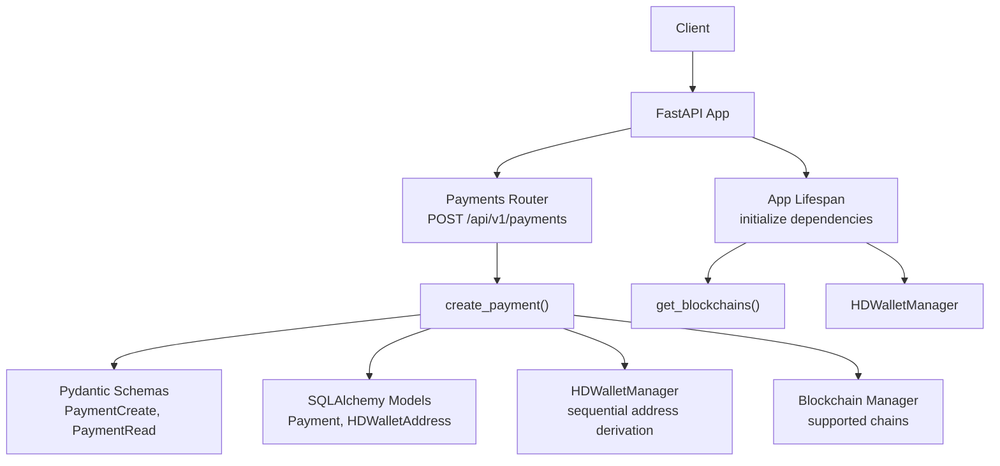
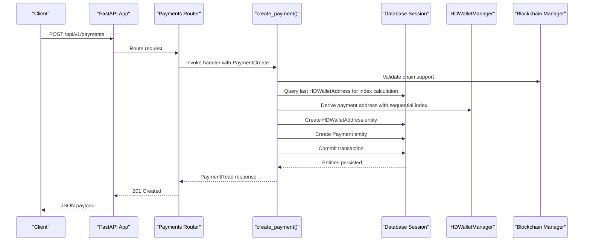
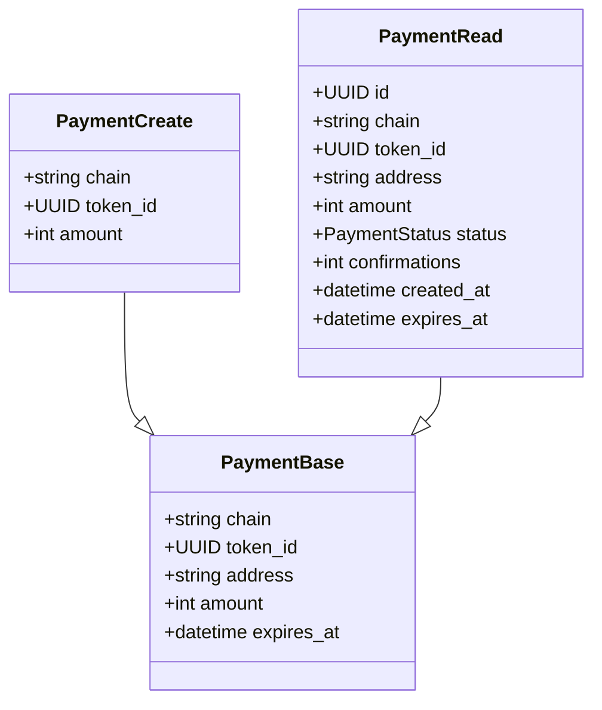
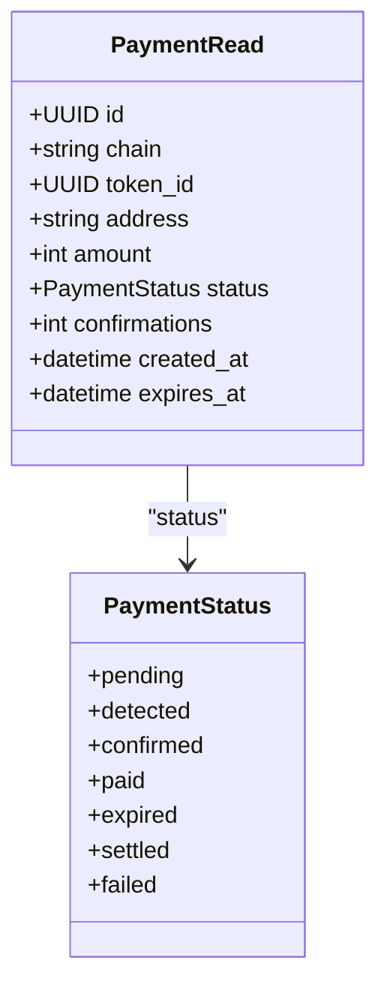
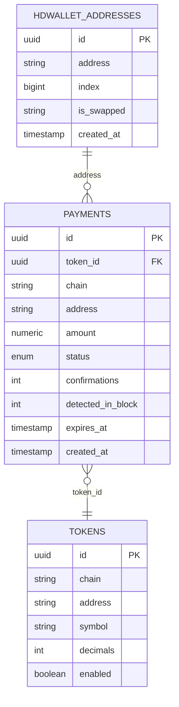
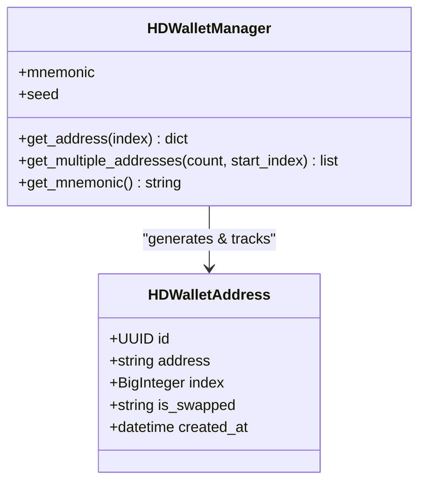
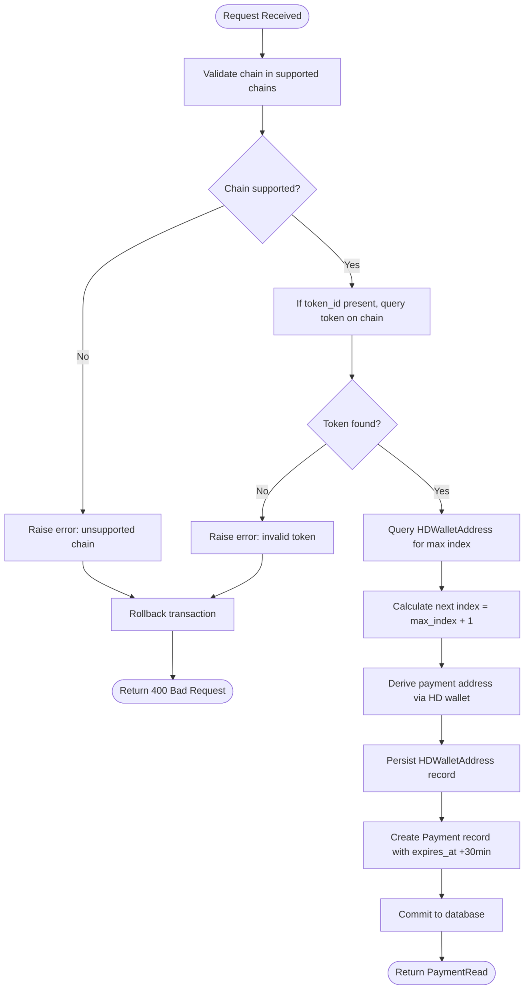
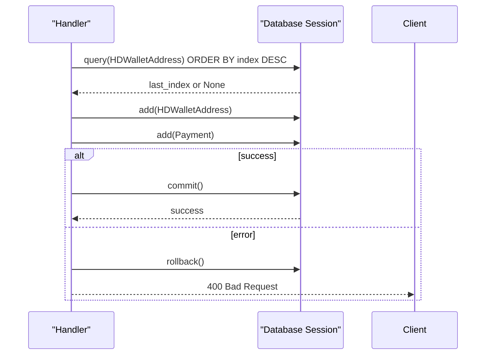
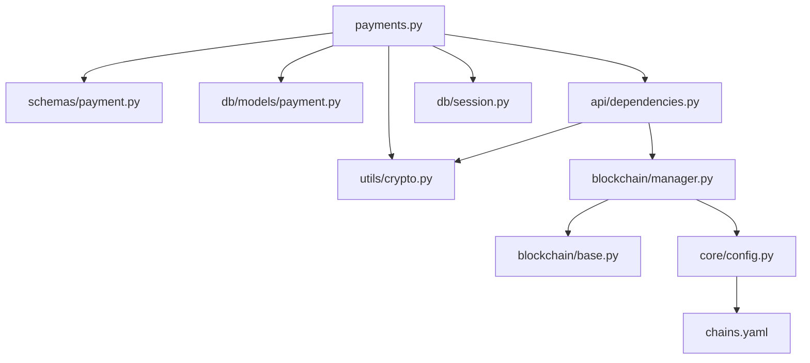

# Payment Endpoints

<cite>
**Referenced Files in This Document**
- [server.py](file://server.py)
- [app/api/v1/payments.py](file://app/api/v1/payments.py)
- [app/api/dependencies.py](file://app/api/dependencies.py)
- [app/schemas/payment.py](file://app/schemas/payment.py)
- [app/schemas/base.py](file://app/schemas/base.py)
- [app/db/models/payment.py](file://app/db/models/payment.py)
- [app/db/models/token.py](file://app/db/models/token.py)
- [app/db/models/chain.py](file://app/db/models/chain.py)
- [app/db/session.py](file://app/db/session.py)
- [app/utils/crypto.py](file://app/utils/crypto.py)
- [app/blockchain/manager.py](file://app/blockchain/manager.py)
- [app/blockchain/base.py](file://app/blockchain/base.py)
- [app/core/config.py](file://app/core/config.py)
- [chains.yaml](file://chains.yaml)
</cite>

## Update Summary
**Changes Made**
- Updated HD Wallet Integration section to reflect sequential address generation with automatic index calculation
- Added new HDWalletAddress persistence section documenting address tracking and index management
- Enhanced Payment Creation Flow diagram to show sequential index calculation and address persistence
- Updated Database Models section to include HDWalletAddress table schema
- Modified Transaction Management section to reflect dual persistence of Payment and HDWalletAddress entities

## Table of Contents
1. [Introduction](#introduction)
2. [Project Structure](#project-structure)
3. [Core Components](#core-components)
4. [Architecture Overview](#architecture-overview)
5. [Detailed Component Analysis](#detailed-component-analysis)
6. [Dependency Analysis](#dependency-analysis)
7. [Performance Considerations](#performance-considerations)
8. [Troubleshooting Guide](#troubleshooting-guide)
9. [Conclusion](#conclusion)
10. [Appendices](#appendices)

## Introduction
This document provides comprehensive API documentation for the payment creation endpoint. It covers the POST /api/v1/payments endpoint, including HTTP methods, URL patterns, request/response schemas, authentication requirements, validation rules, database transaction management, and enhanced HD wallet integration for sequential address generation. It also documents the 30-minute expiration logic, automatic index calculation, and HDWalletAddress persistence for tracking generated addresses. The document provides client implementation guidelines and error handling strategies.

## Project Structure
The payment endpoint is implemented as part of a FastAPI application. The key components involved in the payment creation flow include:
- API router and endpoint handler
- Pydantic schemas for request/response validation
- SQLAlchemy models for persistence (Payment and HDWalletAddress)
- HD wallet manager for sequential address derivation
- Blockchain manager for supported chains
- Application lifecycle initialization for dependency injection

**Diagram sources**
- [server.py](file://server.py#L21-L47)
- [app/api/v1/payments.py](file://app/api/v1/payments.py#L12-L74)
- [app/schemas/payment.py](file://app/schemas/payment.py#L20-L41)
- [app/db/models/payment.py](file://app/db/models/payment.py#L41-L74)
- [app/utils/crypto.py](file://app/utils/crypto.py#L5-L46)
- [app/blockchain/manager.py](file://app/blockchain/manager.py#L8-L32)

**Section sources**
- [server.py](file://server.py#L21-L47)
- [app/api/v1/payments.py](file://app/api/v1/payments.py#L12-L74)

## Core Components
- Endpoint: POST /api/v1/payments
- Authentication: Not enforced by the endpoint itself; depends on application-level middleware configuration
- Response: PaymentRead schema with payment metadata and status
- Validation: Request schema PaymentCreate validated by Pydantic rules
- Persistence: SQLAlchemy ORM models for Payment and HDWalletAddress
- Sequential Address Generation: HD wallet manager derives payment addresses with automatic index calculation
- Chain Support: Blockchain manager resolves supported chains from configuration

**Section sources**
- [app/api/v1/payments.py](file://app/api/v1/payments.py#L12-L74)
- [app/schemas/payment.py](file://app/schemas/payment.py#L20-L41)
- [app/db/models/payment.py](file://app/db/models/payment.py#L41-L74)
- [app/utils/crypto.py](file://app/utils/crypto.py#L5-L46)
- [app/blockchain/manager.py](file://app/blockchain/manager.py#L8-L32)

## Architecture Overview
The payment creation flow integrates several layers with enhanced sequential HD wallet address generation:
- API Layer: FastAPI router and dependency injection
- Validation Layer: Pydantic schemas for request/response
- Persistence Layer: SQLAlchemy ORM models and database session
- Business Logic: Payment creation with sequential address generation and expiration
- Infrastructure: Blockchain manager and HD wallet manager with automatic index tracking

**Diagram sources**
- [app/api/v1/payments.py](file://app/api/v1/payments.py#L18-L66)
- [app/api/dependencies.py](file://app/api/dependencies.py#L5-L14)
- [app/utils/crypto.py](file://app/utils/crypto.py#L27-L46)
- [app/db/session.py](file://app/db/session.py#L11-L16)
- [app/blockchain/manager.py](file://app/blockchain/manager.py#L8-L32)

## Detailed Component Analysis

### Endpoint Definition
- Method: POST
- URL Pattern: /api/v1/payments
- Authentication: Not enforced by the endpoint; relies on application-level configuration
- Response Model: PaymentRead
- Status Codes:
  - 201 Created on successful creation
  - 400 Bad Request on validation errors or unsupported chains/tokens

**Section sources**
- [app/api/v1/payments.py](file://app/api/v1/payments.py#L12-L17)

### Request Schema: PaymentCreate
The PaymentCreate schema defines the incoming request body for payment creation.

Fields:
- chain: string, required, length 3–20, describes blockchain identifier (e.g., ethereum, bsc, base)
- token_id: UUID, optional, references token record
- amount: integer, required, greater than 0, amount in smallest unit (Wei or token base unit)

Validation Rules:
- chain must match a configured blockchain
- token_id must correspond to a token on the same chain
- amount must be positive

**Diagram sources**
- [app/schemas/payment.py](file://app/schemas/payment.py#L20-L41)

**Section sources**
- [app/schemas/payment.py](file://app/schemas/payment.py#L20-L24)

### Response Schema: PaymentRead
The PaymentRead schema defines the outgoing response body.

Fields:
- id: UUID, unique payment identifier
- chain: string, blockchain identifier
- token_id: UUID, optional token reference
- address: string, derived payment address
- amount: integer, amount in smallest unit
- status: enum, initial status is pending
- confirmations: integer, confirmation count
- created_at: datetime, record creation timestamp
- expires_at: datetime, expiration timestamp (30 minutes from creation)

**Diagram sources**
- [app/schemas/payment.py](file://app/schemas/payment.py#L35-L41)
- [app/db/models/payment.py](file://app/db/models/payment.py#L21-L38)

**Section sources**
- [app/schemas/payment.py](file://app/schemas/payment.py#L35-L41)
- [app/db/models/payment.py](file://app/db/models/payment.py#L21-L38)

### Database Models
The Payment model persists payment records with the following attributes:
- id: UUID primary key
- chain: string, non-null
- token_id: UUID foreign key to tokens
- address: string, non-null
- amount: numeric, non-null
- status: enum with pending/detected/confirmed/paid/expired/settled/failed
- confirmations: integer, default 0
- detected_in_block: integer, optional
- expires_at: datetime, non-null
- created_at: datetime, UTC, non-null

The Token model stores token metadata:
- id: UUID primary key
- chain: string, indexed
- address: string, optional (null for native tokens)
- symbol: string, non-null
- decimals: integer, default 18
- enabled: boolean, default true

**Updated** Added HDWalletAddress model for tracking generated addresses with sequential indexing

The HDWalletAddress model tracks generated payment addresses with automatic index management:
- id: UUID primary key
- address: string, non-null, unique
- index: BigInteger, non-null, sequential index
- is_swapped: string, default "false", tracks swap status
- created_at: datetime, UTC, non-null

**Diagram sources**
- [app/db/models/payment.py](file://app/db/models/payment.py#L41-L74)
- [app/db/models/token.py](file://app/db/models/token.py#L6-L14)

**Section sources**
- [app/db/models/payment.py](file://app/db/models/payment.py#L41-L74)
- [app/db/models/token.py](file://app/db/models/token.py#L6-L14)

### HD Wallet Integration
**Updated** The HD wallet manager now supports sequential address generation with automatic index calculation and persistence tracking.

The HD wallet manager derives payment addresses using BIP-44 path m/44'/60'/0'/0/{index}. For payment creation, the system automatically calculates the next sequential index by querying the highest existing index in the HDWalletAddress table.

Key behaviors:
- Generates a 12-word mnemonic if none is provided
- Derives checksummed Ethereum addresses from seed and path
- Automatically calculates next index using `ORDER BY index DESC LIMIT 1`
- Persists generated addresses in HDWalletAddress table for tracking
- Returns address and derivation path for the calculated index

**Diagram sources**
- [app/utils/crypto.py](file://app/utils/crypto.py#L5-L46)
- [app/db/models/payment.py](file://app/db/models/payment.py#L65-L74)

**Section sources**
- [app/utils/crypto.py](file://app/utils/crypto.py#L27-L46)
- [app/db/models/payment.py](file://app/db/models/payment.py#L65-L74)

### Chain Support and Validation
Chain support is determined by the blockchain manager, which reads chain configurations from settings and constructs blockchain instances. The payment endpoint validates that the requested chain is supported before proceeding.

Supported chains are loaded from configuration:
- ethereum: RPC URL for mainnet
- bsc: RPC URL for BSC
- anvil: local development RPC URL

Validation logic:
- Unsupported chain raises a validation error
- If token_id is provided, the token must exist and belong to the same chain

**Diagram sources**
- [app/api/v1/payments.py](file://app/api/v1/payments.py#L25-L66)
- [app/blockchain/manager.py](file://app/blockchain/manager.py#L8-L32)
- [app/db/models/token.py](file://app/db/models/token.py#L6-L14)

**Section sources**
- [app/api/v1/payments.py](file://app/api/v1/payments.py#L25-L66)
- [app/blockchain/manager.py](file://app/blockchain/manager.py#L8-L32)
- [chains.yaml](file://chains.yaml#L12-L23)

### Transaction Management
**Updated** The endpoint now manages two entities in a single transaction: Payment and HDWalletAddress.

The endpoint uses a synchronous SQLAlchemy session with explicit commit and rollback semantics:
- On success: commit both Payment and HDWalletAddress entities, then refresh the Payment record
- On failure: rollback the transaction and return a 400 error with detail message

**Diagram sources**
- [app/api/v1/payments.py](file://app/api/v1/payments.py#L36-L66)
- [app/db/session.py](file://app/db/session.py#L11-L16)

**Section sources**
- [app/api/v1/payments.py](file://app/api/v1/payments.py#L36-L66)
- [app/db/session.py](file://app/db/session.py#L11-L16)

### Expiration Logic
The payment record is set to expire 30 minutes after creation. The expiration timestamp is computed using UTC time.

Behavior:
- expires_at is set to current UTC plus 30 minutes
- Subsequent scanning and status updates should reflect expired state accordingly

**Section sources**
- [app/api/v1/payments.py](file://app/api/v1/payments.py#L51-L52)
- [app/db/models/payment.py](file://app/db/models/payment.py#L52-L55)

## Dependency Analysis
The payment endpoint depends on:
- Database session for persistence
- HD wallet manager for sequential address generation
- Blockchain manager for chain validation
- Pydantic schemas for validation
- SQLAlchemy models for ORM mapping (Payment and HDWalletAddress)

**Diagram sources**
- [app/api/v1/payments.py](file://app/api/v1/payments.py#L1-L11)
- [app/api/dependencies.py](file://app/api/dependencies.py#L1-L15)
- [app/schemas/payment.py](file://app/schemas/payment.py#L1-L10)
- [app/db/models/payment.py](file://app/db/models/payment.py#L1-L18)
- [app/utils/crypto.py](file://app/utils/crypto.py#L1-L9)
- [app/db/session.py](file://app/db/session.py#L1-L9)
- [app/blockchain/manager.py](file://app/blockchain/manager.py#L1-L6)
- [app/blockchain/base.py](file://app/blockchain/base.py#L1-L13)
- [app/core/config.py](file://app/core/config.py#L1-L7)
- [chains.yaml](file://chains.yaml#L1-L24)

**Section sources**
- [app/api/v1/payments.py](file://app/api/v1/payments.py#L1-L11)
- [app/api/dependencies.py](file://app/api/dependencies.py#L1-L15)
- [app/blockchain/manager.py](file://app/blockchain/manager.py#L8-L32)

## Performance Considerations
- Address generation is deterministic and lightweight; cost scales with number of addresses generated
- Database writes occur synchronously; consider batching for high-throughput scenarios
- Chain validation uses in-memory dictionaries; ensure minimal overhead
- Sequential index calculation requires a single query per payment creation
- HDWalletAddress persistence adds minimal overhead for address tracking
- Gas estimation and transaction building are asynchronous; not used in payment creation but relevant for related workflows

## Troubleshooting Guide
Common issues and resolutions:
- Unsupported chain error: Verify chain name matches configuration keys (ethereum, bsc, anvil)
- Invalid token error: Ensure token_id exists and belongs to the specified chain
- Database commit failures: Check connectivity and permissions; review rollback behavior
- HD wallet initialization failures: Confirm mnemonic is valid and accessible during app startup
- Index calculation failures: Verify HDWalletAddress table exists and contains proper indices

Error handling specifics:
- Validation errors return 400 with detail message
- Unsupported chains and invalid tokens trigger validation exceptions
- Database errors trigger rollback and 400 response
- Index calculation errors fall back to index 0 for the first payment

**Section sources**
- [app/api/v1/payments.py](file://app/api/v1/payments.py#L27-L34)
- [app/api/v1/payments.py](file://app/api/v1/payments.py#L68-L74)

## Conclusion
The payment creation endpoint provides a robust mechanism for generating blockchain payment addresses with strict validation, deterministic sequential indexing, and comprehensive address tracking. It integrates seamlessly with HD wallet management and chain configuration, while maintaining clear separation of concerns across the API, validation, persistence, and infrastructure layers. The enhanced sequential address generation ensures predictable address derivation and reliable tracking of all generated payment addresses.

## Appendices

### API Definition
- Method: POST
- URL: /api/v1/payments
- Authentication: Not enforced by endpoint; depends on application configuration
- Response: 201 Created with PaymentRead payload

**Section sources**
- [app/api/v1/payments.py](file://app/api/v1/payments.py#L12-L17)

### Request Schema Details
- chain: string, required, length 3–20
- token_id: UUID, optional
- amount: integer, required, > 0

Validation:
- chain must be supported
- token_id must exist and match chain

**Section sources**
- [app/schemas/payment.py](file://app/schemas/payment.py#L20-L24)
- [app/api/v1/payments.py](file://app/api/v1/payments.py#L25-L34)

### Response Schema Details
- id: UUID
- chain: string
- token_id: UUID
- address: string
- amount: integer
- status: enum (pending initially)
- confirmations: integer
- created_at: datetime
- expires_at: datetime (+30 minutes)

**Section sources**
- [app/schemas/payment.py](file://app/schemas/payment.py#L35-L41)
- [app/db/models/payment.py](file://app/db/models/payment.py#L41-L57)

### Example Requests and Responses
Request (JSON):
{
  "chain": "bsc",
  "token_id": null,
  "amount": 1000000000000000000
}

Response (JSON):
{
  "id": "123e4567-e89b-12d3-a456-426614174000",
  "chain": "bsc",
  "token_id": null,
  "address": "0x...",
  "amount": 1000000000000000000,
  "status": "pending",
  "confirmations": 0,
  "created_at": "2025-01-01T12:00:00Z",
  "expires_at": "2025-01-01T12:30:00Z"
}

Error Response (JSON):
{
  "detail": "Unsupported chain: invalid_chain"
}

**Section sources**
- [app/api/v1/payments.py](file://app/api/v1/payments.py#L27-L28)
- [app/api/v1/payments.py](file://app/api/v1/payments.py#L68-L74)

### Client Implementation Guidelines
- Validate chain against supported list before sending requests
- Ensure amount is in the smallest unit (Wei for native, token base unit for ERC20)
- Store payment_id for subsequent status checks
- Implement retry with exponential backoff for transient failures
- Respect expires_at and prompt users to recreate payments if expired
- Handle sequential address generation transparently - no client-side index management required

### Configuration Notes
- Chain configurations are loaded from chains.yaml
- Mnemonic for HD wallet is sourced from settings
- Blockchain manager constructs chain-specific clients
- HDWalletAddress table is automatically created during database migration

**Section sources**
- [chains.yaml](file://chains.yaml#L12-L23)
- [app/core/config.py](file://app/core/config.py#L58-L61)
- [app/blockchain/manager.py](file://app/blockchain/manager.py#L8-L32)
- [alembic/versions/2026_01_27_1807-5ec6405addd0_initial_database_schema.py](file://alembic/versions/2026_01_27_1807-5ec6405addd0_initial_database_schema.py#L37-L44)