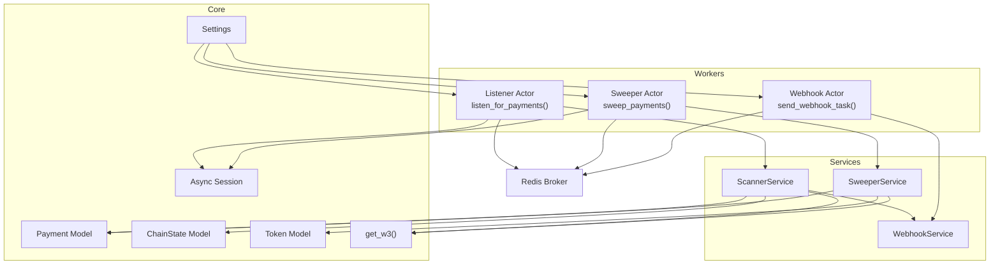
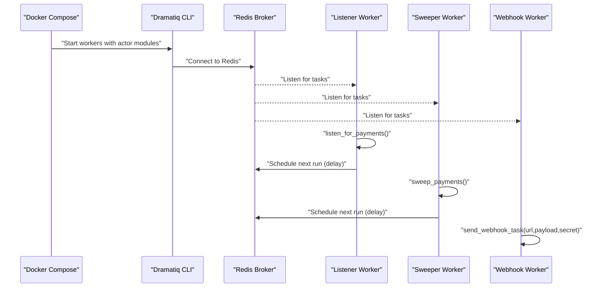
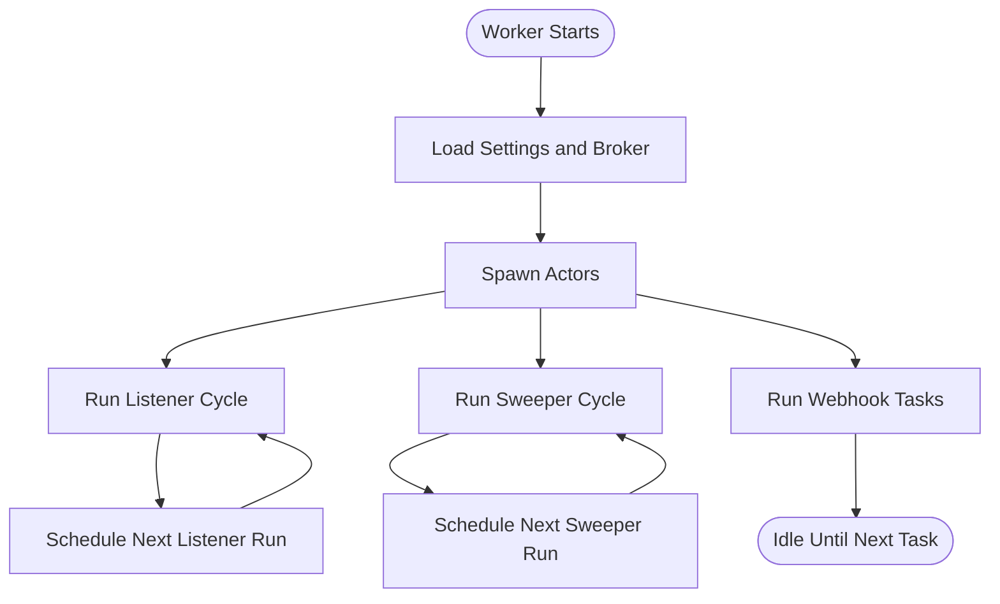
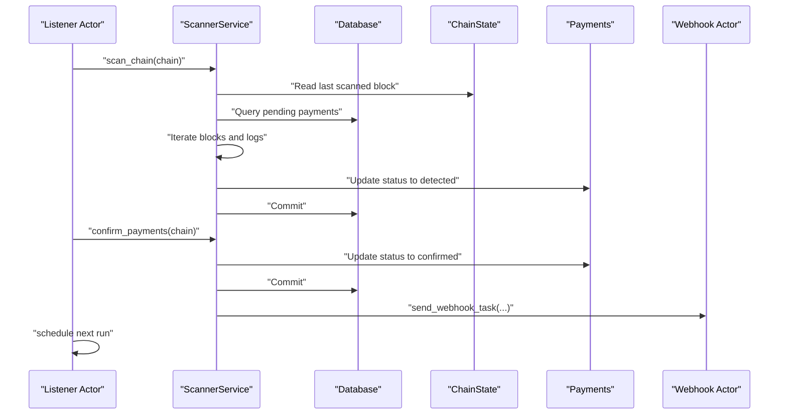
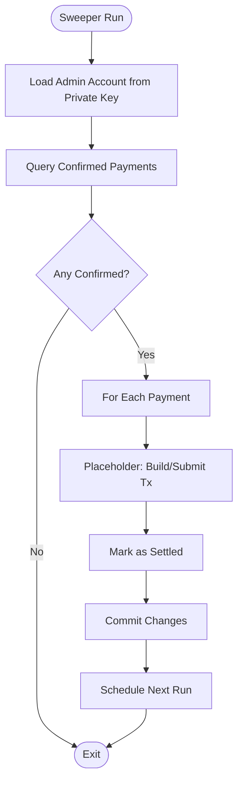
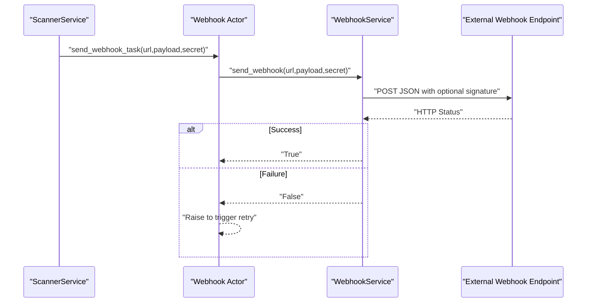
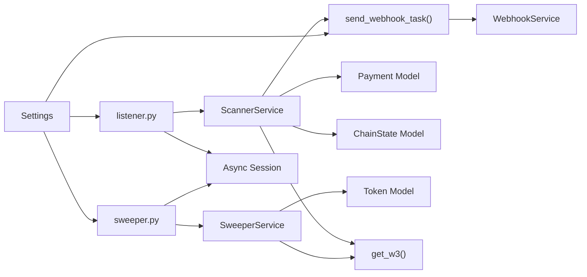

# Background Processing

<cite>
**Referenced Files in This Document**
- [app/workers/__init__.py](https://github.com/rakibhossain72/ctrip/blob/main/app/workers/__init__.py)
- [app/workers/listener.py](https://github.com/rakibhossain72/ctrip/blob/main/app/workers/listener.py)
- [app/workers/sweeper.py](https://github.com/rakibhossain72/ctrip/blob/main/app/workers/sweeper.py)
- [app/workers/webhook.py](https://github.com/rakibhossain72/ctrip/blob/main/app/workers/webhook.py)
- [app/services/blockchain/scanner.py](https://github.com/rakibhossain72/ctrip/blob/main/app/services/blockchain/scanner.py)
- [app/services/blockchain/sweeper.py](https://github.com/rakibhossain72/ctrip/blob/main/app/services/blockchain/sweeper.py)
- [app/services/webhook.py](https://github.com/rakibhossain72/ctrip/blob/main/app/services/webhook.py)
- [app/core/config.py](https://github.com/rakibhossain72/ctrip/blob/main/app/core/config.py)
- [app/db/models/payment.py](https://github.com/rakibhossain72/ctrip/blob/main/app/db/models/payment.py)
- [app/db/models/chain.py](https://github.com/rakibhossain72/ctrip/blob/main/app/db/models/chain.py)
- [app/db/models/token.py](https://github.com/rakibhossain72/ctrip/blob/main/app/db/models/token.py)
- [app/db/async_session.py](https://github.com/rakibhossain72/ctrip/blob/main/app/db/async_session.py)
- [app/blockchain/w3.py](https://github.com/rakibhossain72/ctrip/blob/main/app/blockchain/w3.py)
- [app/utils/crypto.py](https://github.com/rakibhossain72/ctrip/blob/main/app/utils/crypto.py)
- [requirements.txt](https://github.com/rakibhossain72/ctrip/blob/main/requirements.txt)
- [docker-compose.yml](https://github.com/rakibhossain72/ctrip/blob/main/docker-compose.yml)
- [chains.yaml](https://github.com/rakibhossain72/ctrip/blob/main/chains.yaml)
- [README.md](https://github.com/rakibhossain72/ctrip/blob/main/README.md)
</cite>

## Table of Contents
1. [Introduction](#introduction)
2. [Project Structure](#project-structure)
3. [Core Components](#core-components)
4. [Architecture Overview](#architecture-overview)
5. [Detailed Component Analysis](#detailed-component-analysis)
6. [Dependency Analysis](#dependency-analysis)
7. [Performance Considerations](#performance-considerations)
8. [Troubleshooting Guide](#troubleshooting-guide)
9. [Conclusion](#conclusion)
10. [Appendices](#appendices)

## Introduction
This document explains the background processing subsystem of the cTrip Payment Gateway, powered by Dramatiq and Redis. It covers the worker architecture (listener, sweeper, webhook), task scheduling patterns, message queuing, distributed task processing, worker initialization and lifecycle, execution and error handling, retry logic, dead letter queue management, actor patterns, serialization strategies, monitoring, scaling, load balancing, and troubleshooting. It also provides examples of worker task definitions and integration with core services.

## Project Structure
The background processing system centers around three Dramatiq actors:
- Listener actor: Scans blockchain(s) for incoming payments and triggers confirmations.
- Sweeper actor: Transfers confirmed funds to an admin wallet.
- Webhook actor: Sends asynchronous notifications for payment events.

Workers are initialized via a module that sets the Redis broker globally for Dramatiq. The system integrates with:
- Blockchain scanning and sweeping services
- Webhook service
- Database models and sessions
- Configuration and chain definitions

**Diagram sources**
- [app/workers/listener.py](https://github.com/rakibhossain72/ctrip/blob/main/app/workers/listener.py#L21-L46)
- [app/workers/sweeper.py](https://github.com/rakibhossain72/ctrip/blob/main/app/workers/sweeper.py#L19-L40)
- [app/workers/webhook.py](https://github.com/rakibhossain72/ctrip/blob/main/app/workers/webhook.py#L13-L37)
- [app/services/blockchain/scanner.py](https://github.com/rakibhossain72/ctrip/blob/main/app/services/blockchain/scanner.py#L14-L134)
- [app/services/blockchain/sweeper.py](https://github.com/rakibhossain72/ctrip/blob/main/app/services/blockchain/sweeper.py#L11-L54)
- [app/services/webhook.py](https://github.com/rakibhossain72/ctrip/blob/main/app/services/webhook.py#L10-L45)
- [app/core/config.py](https://github.com/rakibhossain72/ctrip/blob/main/app/core/config.py#L10-L126)
- [app/db/models/payment.py](https://github.com/rakibhossain72/ctrip/blob/main/app/db/models/payment.py#L41-L74)
- [app/db/models/chain.py](https://github.com/rakibhossain72/ctrip/blob/main/app/db/models/chain.py#L9-L17)
- [app/db/models/token.py](https://github.com/rakibhossain72/ctrip/blob/main/app/db/models/token.py#L6-L15)
- [app/db/async_session.py](https://github.com/rakibhossain72/ctrip/blob/main/app/db/async_session.py#L6-L15)
- [app/blockchain/w3.py](https://github.com/rakibhossain72/ctrip/blob/main/app/blockchain/w3.py#L6-L9)
- [app/workers/__init__.py](https://github.com/rakibhossain72/ctrip/blob/main/app/workers/__init__.py#L3-L7)

**Section sources**
- [README.md](https://github.com/rakibhossain72/ctrip/blob/main/README.md#L1-L87)
- [docker-compose.yml](https://github.com/rakibhossain72/ctrip/blob/main/docker-compose.yml#L37-L51)
- [requirements.txt](https://github.com/rakibhossain72/ctrip/blob/main/requirements.txt#L24-L77)

## Core Components
- Worker initialization and broker setup
  - The workers package initializes a Redis broker and sets it globally for Dramatiq.
  - See [app/workers/__init__.py](https://github.com/rakibhossain72/ctrip/blob/main/app/workers/__init__.py#L1-L8).

- Listener worker
  - Actor scans configured chains, detects incoming payments, and confirms them after required confirmations.
  - Schedules itself to run again after a fixed delay.
  - See [app/workers/listener.py](https://github.com/rakibhossain72/ctrip/blob/main/app/workers/listener.py#L21-L46).

- Sweeper worker
  - Actor sweeps confirmed payments per chain and marks them settled.
  - Schedules itself to run periodically.
  - See [app/workers/sweeper.py](https://github.com/rakibhossain72/ctrip/blob/main/app/workers/sweeper.py#L19-L40).

- Webhook worker
  - Actor sends asynchronous webhooks with optional HMAC signature.
  - Retries are handled by Dramatiq based on actor configuration.
  - See [app/workers/webhook.py](https://github.com/rakibhossain72/ctrip/blob/main/app/workers/webhook.py#L13-L37).

- Services
  - ScannerService orchestrates scanning and confirmation logic and triggers webhooks.
  - SweeperService performs settlement actions against the blockchain.
  - WebhookService handles HTTP delivery and signing.
  - See [app/services/blockchain/scanner.py](https://github.com/rakibhossain72/ctrip/blob/main/app/services/blockchain/scanner.py#L14-L134), [app/services/blockchain/sweeper.py](https://github.com/rakibhossain72/ctrip/blob/main/app/services/blockchain/sweeper.py#L11-L54), [app/services/webhook.py](https://github.com/rakibhossain72/ctrip/blob/main/app/services/webhook.py#L10-L45).

- Configuration and models
  - Settings provide Redis URL, chains, webhook endpoints, and secrets.
  - Payment, ChainState, and Token models define persistence for payment lifecycle and chain state.
  - See [app/core/config.py](https://github.com/rakibhossain72/ctrip/blob/main/app/core/config.py#L10-L126), [app/db/models/payment.py](https://github.com/rakibhossain72/ctrip/blob/main/app/db/models/payment.py#L41-L74), [app/db/models/chain.py](https://github.com/rakibhossain72/ctrip/blob/main/app/db/models/chain.py#L9-L17), [app/db/models/token.py](https://github.com/rakibhossain72/ctrip/blob/main/app/db/models/token.py#L6-L15).

**Section sources**
- [app/workers/__init__.py](https://github.com/rakibhossain72/ctrip/blob/main/app/workers/__init__.py#L1-L8)
- [app/workers/listener.py](https://github.com/rakibhossain72/ctrip/blob/main/app/workers/listener.py#L21-L46)
- [app/workers/sweeper.py](https://github.com/rakibhossain72/ctrip/blob/main/app/workers/sweeper.py#L19-L40)
- [app/workers/webhook.py](https://github.com/rakibhossain72/ctrip/blob/main/app/workers/webhook.py#L13-L37)
- [app/services/blockchain/scanner.py](https://github.com/rakibhossain72/ctrip/blob/main/app/services/blockchain/scanner.py#L14-L134)
- [app/services/blockchain/sweeper.py](https://github.com/rakibhossain72/ctrip/blob/main/app/services/blockchain/sweeper.py#L11-L54)
- [app/services/webhook.py](https://github.com/rakibhossain72/ctrip/blob/main/app/services/webhook.py#L10-L45)
- [app/core/config.py](https://github.com/rakibhossain72/ctrip/blob/main/app/core/config.py#L10-L126)
- [app/db/models/payment.py](https://github.com/rakibhossain72/ctrip/blob/main/app/db/models/payment.py#L41-L74)
- [app/db/models/chain.py](https://github.com/rakibhossain72/ctrip/blob/main/app/db/models/chain.py#L9-L17)
- [app/db/models/token.py](https://github.com/rakibhossain72/ctrip/blob/main/app/db/models/token.py#L6-L15)

## Architecture Overview
The background processing architecture uses Dramatiq with Redis as the broker. Workers are launched via the Dramatiq CLI and consume tasks from named queues. Actors schedule themselves to run periodically, while event-driven tasks (webhooks) are enqueued from services.

**Diagram sources**
- [docker-compose.yml](https://github.com/rakibhossain72/ctrip/blob/main/docker-compose.yml#L37-L51)
- [app/workers/__init__.py](https://github.com/rakibhossain72/ctrip/blob/main/app/workers/__init__.py#L3-L7)
- [app/workers/listener.py](https://github.com/rakibhossain72/ctrip/blob/main/app/workers/listener.py#L42-L46)
- [app/workers/sweeper.py](https://github.com/rakibhossain72/ctrip/blob/main/app/workers/sweeper.py#L36-L40)
- [app/workers/webhook.py](https://github.com/rakibhossain72/ctrip/blob/main/app/workers/webhook.py#L33-L37)

## Detailed Component Analysis

### Worker Initialization and Lifecycle
- Broker setup
  - A Redis broker is created from settings and set as the global Dramatiq broker.
  - See [app/workers/__init__.py](https://github.com/rakibhossain72/ctrip/blob/main/app/workers/__init__.py#L3-L7).

- Worker startup
  - Docker Compose launches the Dramatiq CLI with the three worker modules.
  - See [docker-compose.yml](https://github.com/rakibhossain72/ctrip/blob/main/docker-compose.yml#L37-L51).

- Actor lifecycle
  - Each actor runs, performs work, logs outcomes, and schedules the next run using a delay option.
  - See [app/workers/listener.py](https://github.com/rakibhossain72/ctrip/blob/main/app/workers/listener.py#L42-L46), [app/workers/sweeper.py](https://github.com/rakibhossain72/ctrip/blob/main/app/workers/sweeper.py#L36-L40).

**Diagram sources**
- [app/workers/__init__.py](https://github.com/rakibhossain72/ctrip/blob/main/app/workers/__init__.py#L3-L7)
- [app/workers/listener.py](https://github.com/rakibhossain72/ctrip/blob/main/app/workers/listener.py#L42-L46)
- [app/workers/sweeper.py](https://github.com/rakibhossain72/ctrip/blob/main/app/workers/sweeper.py#L36-L40)

**Section sources**
- [app/workers/__init__.py](https://github.com/rakibhossain72/ctrip/blob/main/app/workers/__init__.py#L1-L8)
- [docker-compose.yml](https://github.com/rakibhossain72/ctrip/blob/main/docker-compose.yml#L37-L51)
- [app/workers/listener.py](https://github.com/rakibhossain72/ctrip/blob/main/app/workers/listener.py#L42-L46)
- [app/workers/sweeper.py](https://github.com/rakibhossain72/ctrip/blob/main/app/workers/sweeper.py#L36-L40)

### Listener Worker: Payment Detection and Confirmation
- Responsibilities
  - Scan configured chains for pending payments.
  - Detect native and ERC20 transfers meeting thresholds.
  - Confirm payments after required block confirmations.
  - Emit webhooks upon confirmation when configured.

- Execution pattern
  - Uses an async session to query pending and detected payments.
  - Iterates over a block batch window per chain.
  - Updates payment statuses and schedules the next run.
  - See [app/workers/listener.py](https://github.com/rakibhossain72/ctrip/blob/main/app/workers/listener.py#L21-L46), [app/services/blockchain/scanner.py](https://github.com/rakibhossain72/ctrip/blob/main/app/services/blockchain/scanner.py#L20-L134).

**Diagram sources**
- [app/workers/listener.py](https://github.com/rakibhossain72/ctrip/blob/main/app/workers/listener.py#L21-L46)
- [app/services/blockchain/scanner.py](https://github.com/rakibhossain72/ctrip/blob/main/app/services/blockchain/scanner.py#L20-L134)
- [app/workers/webhook.py](https://github.com/rakibhossain72/ctrip/blob/main/app/workers/webhook.py#L13-L37)

**Section sources**
- [app/workers/listener.py](https://github.com/rakibhossain72/ctrip/blob/main/app/workers/listener.py#L21-L46)
- [app/services/blockchain/scanner.py](https://github.com/rakibhossain72/ctrip/blob/main/app/services/blockchain/scanner.py#L20-L134)

### Sweeper Worker: Fund Settlement
- Responsibilities
  - Sweep confirmed payments per chain.
  - Placeholder for actual transaction submission; currently marks as settled.

- Execution pattern
  - Loads admin account from private key.
  - Queries confirmed payments and updates status.
  - Schedules the next run.
  - See [app/workers/sweeper.py](https://github.com/rakibhossain72/ctrip/blob/main/app/workers/sweeper.py#L19-L40), [app/services/blockchain/sweeper.py](https://github.com/rakibhossain72/ctrip/blob/main/app/services/blockchain/sweeper.py#L16-L54).

**Diagram sources**
- [app/workers/sweeper.py](https://github.com/rakibhossain72/ctrip/blob/main/app/workers/sweeper.py#L19-L40)
- [app/services/blockchain/sweeper.py](https://github.com/rakibhossain72/ctrip/blob/main/app/services/blockchain/sweeper.py#L16-L54)

**Section sources**
- [app/workers/sweeper.py](https://github.com/rakibhossain72/ctrip/blob/main/app/workers/sweeper.py#L19-L40)
- [app/services/blockchain/sweeper.py](https://github.com/rakibhossain72/ctrip/blob/main/app/services/blockchain/sweeper.py#L16-L54)

### Webhook Worker: Asynchronous Notifications
- Responsibilities
  - Send HTTP POST requests to a configured webhook URL.
  - Optionally sign payloads using HMAC-SHA256 with a shared secret.
  - Retry behavior governed by Dramatiq actor configuration.

- Execution pattern
  - Accepts URL, payload, and optional secret.
  - Uses an event loop managed inside the actor.
  - Raises exceptions to trigger retries when delivery fails.
  - See [app/workers/webhook.py](https://github.com/rakibhossain72/ctrip/blob/main/app/workers/webhook.py#L13-L37), [app/services/webhook.py](https://github.com/rakibhossain72/ctrip/blob/main/app/services/webhook.py#L10-L45).

**Diagram sources**
- [app/services/blockchain/scanner.py](https://github.com/rakibhossain72/ctrip/blob/main/app/services/blockchain/scanner.py#L117-L131)
- [app/workers/webhook.py](https://github.com/rakibhossain72/ctrip/blob/main/app/workers/webhook.py#L13-L37)
- [app/services/webhook.py](https://github.com/rakibhossain72/ctrip/blob/main/app/services/webhook.py#L10-L45)

**Section sources**
- [app/workers/webhook.py](https://github.com/rakibhossain72/ctrip/blob/main/app/workers/webhook.py#L13-L37)
- [app/services/webhook.py](https://github.com/rakibhossain72/ctrip/blob/main/app/services/webhook.py#L10-L45)

### Task Serialization Strategies
- Actor arguments
  - Webhook task accepts URL, payload dictionary, and optional secret.
  - These are serializable types suitable for Dramatiq/Redis transport.
  - See [app/workers/webhook.py](https://github.com/rakibhossain72/ctrip/blob/main/app/workers/webhook.py#L14-L18).

- Payload signing
  - WebhookService signs payloads using HMAC-SHA256 when a secret is present.
  - See [app/services/webhook.py](https://github.com/rakibhossain72/ctrip/blob/main/app/services/webhook.py#L25-L31).

**Section sources**
- [app/workers/webhook.py](https://github.com/rakibhossain72/ctrip/blob/main/app/workers/webhook.py#L14-L18)
- [app/services/webhook.py](https://github.com/rakibhossain72/ctrip/blob/main/app/services/webhook.py#L25-L31)

### Error Handling, Retry Logic, and Dead Letter Queue
- Listener and Sweeper actors
  - Defined with zero retries; failures are logged and the actor reschedules itself after a delay.
  - See [app/workers/listener.py](https://github.com/rakibhossain72/ctrip/blob/main/app/workers/listener.py#L21-L46), [app/workers/sweeper.py](https://github.com/rakibhossain72/ctrip/blob/main/app/workers/sweeper.py#L19-L40).

- Webhook actor
  - Defined with a small number of retries; raising exceptions allows Dramatiq to retry automatically.
  - See [app/workers/webhook.py](https://github.com/rakibhossain72/ctrip/blob/main/app/workers/webhook.py#L13-L37).

- Dead letter queue
  - Not explicitly configured in the current setup; default Dramatiq behavior applies.
  - Consider configuring broker-level dead-letter handling if needed for mission-critical tasks.

**Section sources**
- [app/workers/listener.py](https://github.com/rakibhossain72/ctrip/blob/main/app/workers/listener.py#L21-L46)
- [app/workers/sweeper.py](https://github.com/rakibhossain72/ctrip/blob/main/app/workers/sweeper.py#L19-L40)
- [app/workers/webhook.py](https://github.com/rakibhossain72/ctrip/blob/main/app/workers/webhook.py#L13-L37)

### Message Queuing with Redis and Distributed Task Processing
- Broker and queues
  - Redis broker is used globally; Dramatiq actors consume tasks from queues derived from actor names.
  - See [app/workers/__init__.py](https://github.com/rakibhossain72/ctrip/blob/main/app/workers/__init__.py#L3-L7), [docker-compose.yml](https://github.com/rakibhossain72/ctrip/blob/main/docker-compose.yml#L37-L51).

- Task scheduling
  - Actors schedule subsequent runs using a delay option, enabling periodic execution.
  - See [app/workers/listener.py](https://github.com/rakibhossain72/ctrip/blob/main/app/workers/listener.py#L42-L46), [app/workers/sweeper.py](https://github.com/rakibhossain72/ctrip/blob/main/app/workers/sweeper.py#L36-L40).

**Section sources**
- [app/workers/__init__.py](https://github.com/rakibhossain72/ctrip/blob/main/app/workers/__init__.py#L3-L7)
- [docker-compose.yml](https://github.com/rakibhossain72/ctrip/blob/main/docker-compose.yml#L37-L51)
- [app/workers/listener.py](https://github.com/rakibhossain72/ctrip/blob/main/app/workers/listener.py#L42-L46)
- [app/workers/sweeper.py](https://github.com/rakibhossain72/ctrip/blob/main/app/workers/sweeper.py#L36-L40)

### Monitoring Approaches
- Logging
  - Actors and services log informational and error messages; configure log aggregation to monitor worker health and task outcomes.
  - See [app/workers/listener.py](https://github.com/rakibhossain72/ctrip/blob/main/app/workers/listener.py#L9-L13), [app/workers/sweeper.py](https://github.com/rakibhossain72/ctrip/blob/main/app/workers/sweeper.py#L10-L14), [app/services/webhook.py](https://github.com/rakibhossain72/ctrip/blob/main/app/services/webhook.py#L8-L9).

- Metrics
  - Integrate Prometheus or similar to export queue depth, task durations, and failure rates.
  - Monitor Redis memory and connection counts.

- Health checks
  - Use Dramatiq’s broker introspection to check queue sizes and consumer activity.

[No sources needed since this section provides general guidance]

### Scaling Considerations and Load Balancing
- Horizontal scaling
  - Run multiple worker instances behind the same Redis broker to distribute load.
  - See [docker-compose.yml](https://github.com/rakibhossain72/ctrip/blob/main/docker-compose.yml#L37-L51).

- Concurrency
  - Adjust Dramatiq process and thread concurrency per worker process to match CPU and I/O characteristics.

- Queue isolation
  - Consider separate queues per actor or per chain for fine-grained control.

[No sources needed since this section provides general guidance]

## Dependency Analysis
The following diagram shows key dependencies among workers, services, and core components.

**Diagram sources**
- [app/workers/listener.py](https://github.com/rakibhossain72/ctrip/blob/main/app/workers/listener.py#L21-L46)
- [app/workers/sweeper.py](https://github.com/rakibhossain72/ctrip/blob/main/app/workers/sweeper.py#L19-L40)
- [app/workers/webhook.py](https://github.com/rakibhossain72/ctrip/blob/main/app/workers/webhook.py#L13-L37)
- [app/services/blockchain/scanner.py](https://github.com/rakibhossain72/ctrip/blob/main/app/services/blockchain/scanner.py#L14-L134)
- [app/services/blockchain/sweeper.py](https://github.com/rakibhossain72/ctrip/blob/main/app/services/blockchain/sweeper.py#L11-L54)
- [app/services/webhook.py](https://github.com/rakibhossain72/ctrip/blob/main/app/services/webhook.py#L10-L45)
- [app/db/models/payment.py](https://github.com/rakibhossain72/ctrip/blob/main/app/db/models/payment.py#L41-L74)
- [app/db/models/chain.py](https://github.com/rakibhossain72/ctrip/blob/main/app/db/models/chain.py#L9-L17)
- [app/db/models/token.py](https://github.com/rakibhossain72/ctrip/blob/main/app/db/models/token.py#L6-L15)
- [app/db/async_session.py](https://github.com/rakibhossain72/ctrip/blob/main/app/db/async_session.py#L6-L15)
- [app/blockchain/w3.py](https://github.com/rakibhossain72/ctrip/blob/main/app/blockchain/w3.py#L6-L9)
- [app/core/config.py](https://github.com/rakibhossain72/ctrip/blob/main/app/core/config.py#L10-L126)

**Section sources**
- [app/workers/listener.py](https://github.com/rakibhossain72/ctrip/blob/main/app/workers/listener.py#L21-L46)
- [app/workers/sweeper.py](https://github.com/rakibhossain72/ctrip/blob/main/app/workers/sweeper.py#L19-L40)
- [app/workers/webhook.py](https://github.com/rakibhossain72/ctrip/blob/main/app/workers/webhook.py#L13-L37)
- [app/services/blockchain/scanner.py](https://github.com/rakibhossain72/ctrip/blob/main/app/services/blockchain/scanner.py#L14-L134)
- [app/services/blockchain/sweeper.py](https://github.com/rakibhossain72/ctrip/blob/main/app/services/blockchain/sweeper.py#L11-L54)
- [app/services/webhook.py](https://github.com/rakibhossain72/ctrip/blob/main/app/services/webhook.py#L10-L45)
- [app/db/models/payment.py](https://github.com/rakibhossain72/ctrip/blob/main/app/db/models/payment.py#L41-L74)
- [app/db/models/chain.py](https://github.com/rakibhossain72/ctrip/blob/main/app/db/models/chain.py#L9-L17)
- [app/db/models/token.py](https://github.com/rakibhossain72/ctrip/blob/main/app/db/models/token.py#L6-L15)
- [app/db/async_session.py](https://github.com/rakibhossain72/ctrip/blob/main/app/db/async_session.py#L6-L15)
- [app/blockchain/w3.py](https://github.com/rakibhossain72/ctrip/blob/main/app/blockchain/w3.py#L6-L9)
- [app/core/config.py](https://github.com/rakibhossain72/ctrip/blob/main/app/core/config.py#L10-L126)

## Performance Considerations
- Batch sizes and intervals
  - Tune block batch size and polling intervals to balance responsiveness and resource usage.
  - See [app/workers/listener.py](https://github.com/rakibhossain72/ctrip/blob/main/app/workers/listener.py#L15-L16).

- Async I/O
  - All database and blockchain operations are async; ensure the database and RPC endpoints can handle concurrent requests.

- Redis sizing
  - Monitor queue depth and latency; scale Redis and worker replicas accordingly.

[No sources needed since this section provides general guidance]

## Troubleshooting Guide
- Worker does not start
  - Verify Redis connectivity and broker URL in settings.
  - Ensure Dramatiq CLI is invoked with the correct module paths.
  - See [app/workers/__init__.py](https://github.com/rakibhossain72/ctrip/blob/main/app/workers/__init__.py#L3-L7), [docker-compose.yml](https://github.com/rakibhossain72/ctrip/blob/main/docker-compose.yml#L37-L51).

- Tasks not processed
  - Confirm actors are imported and loaded by Dramatiq.
  - Check Redis connectivity and queue visibility.
  - See [docker-compose.yml](https://github.com/rakibhossain72/ctrip/blob/main/docker-compose.yml#L37-L51).

- Webhook failures
  - Inspect webhook actor logs and service error handling.
  - Validate webhook URL and secret configuration.
  - See [app/workers/webhook.py](https://github.com/rakibhossain72/ctrip/blob/main/app/workers/webhook.py#L32-L37), [app/services/webhook.py](https://github.com/rakibhossain72/ctrip/blob/main/app/services/webhook.py#L39-L44).

- Payment detection gaps
  - Review chain state last scanned block and block batch size.
  - Validate RPC endpoints and network availability.
  - See [app/services/blockchain/scanner.py](https://github.com/rakibhossain72/ctrip/blob/main/app/services/blockchain/scanner.py#L24-L95), [app/db/models/chain.py](https://github.com/rakibhossain72/ctrip/blob/main/app/db/models/chain.py#L9-L17), [chains.yaml](https://github.com/rakibhossain72/ctrip/blob/main/chains.yaml#L1-L24).

**Section sources**
- [app/workers/__init__.py](https://github.com/rakibhossain72/ctrip/blob/main/app/workers/__init__.py#L3-L7)
- [docker-compose.yml](https://github.com/rakibhossain72/ctrip/blob/main/docker-compose.yml#L37-L51)
- [app/workers/webhook.py](https://github.com/rakibhossain72/ctrip/blob/main/app/workers/webhook.py#L32-L37)
- [app/services/webhook.py](https://github.com/rakibhossain72/ctrip/blob/main/app/services/webhook.py#L39-L44)
- [app/services/blockchain/scanner.py](https://github.com/rakibhossain72/ctrip/blob/main/app/services/blockchain/scanner.py#L24-L95)
- [app/db/models/chain.py](https://github.com/rakibhossain72/ctrip/blob/main/app/db/models/chain.py#L9-L17)
- [chains.yaml](https://github.com/rakibhossain72/ctrip/blob/main/chains.yaml#L1-L24)

## Conclusion
The cTrip Payment Gateway employs a robust, scalable background processing system using Dramatiq and Redis. The listener and sweeper actors implement periodic, resilient workflows with explicit scheduling and logging. The webhook actor provides asynchronous notifications with configurable retries. With proper Redis sizing, worker scaling, and monitoring, the system can reliably process multi-chain payment detection, confirmation, and settlement tasks.

[No sources needed since this section summarizes without analyzing specific files]

## Appendices

### Configuration Reference
- Settings keys used by workers
  - redis_url: Redis broker URL
  - chains: List of chain configurations
  - webhook_url: Global webhook endpoint
  - webhook_secret: HMAC secret for signing
  - private_key: Admin account private key
  - See [app/core/config.py](https://github.com/rakibhossain72/ctrip/blob/main/app/core/config.py#L34-L77).

- Chains configuration
  - Chains and tokens are defined in YAML and consumed by workers and services.
  - See [chains.yaml](https://github.com/rakibhossain72/ctrip/blob/main/chains.yaml#L1-L24).

**Section sources**
- [app/core/config.py](https://github.com/rakibhossain72/ctrip/blob/main/app/core/config.py#L34-L77)
- [chains.yaml](https://github.com/rakibhossain72/ctrip/blob/main/chains.yaml#L1-L24)

### Example Worker Task Definitions
- Listener actor definition
  - See [app/workers/listener.py](https://github.com/rakibhossain72/ctrip/blob/main/app/workers/listener.py#L21-L46).

- Sweeper actor definition
  - See [app/workers/sweeper.py](https://github.com/rakibhossain72/ctrip/blob/main/app/workers/sweeper.py#L19-L40).

- Webhook actor definition
  - See [app/workers/webhook.py](https://github.com/rakibhossain72/ctrip/blob/main/app/workers/webhook.py#L13-L37).

**Section sources**
- [app/workers/listener.py](https://github.com/rakibhossain72/ctrip/blob/main/app/workers/listener.py#L21-L46)
- [app/workers/sweeper.py](https://github.com/rakibhossain72/ctrip/blob/main/app/workers/sweeper.py#L19-L40)
- [app/workers/webhook.py](https://github.com/rakibhossain72/ctrip/blob/main/app/workers/webhook.py#L13-L37)