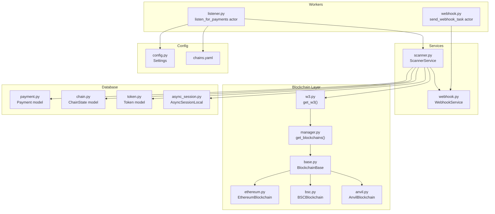
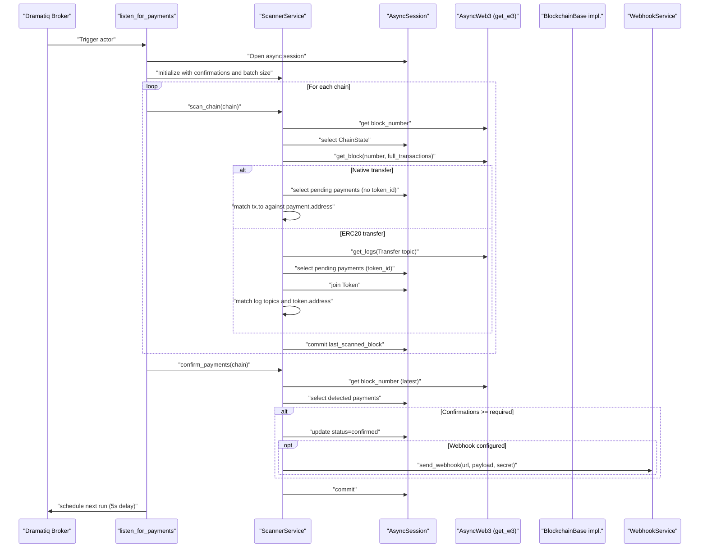
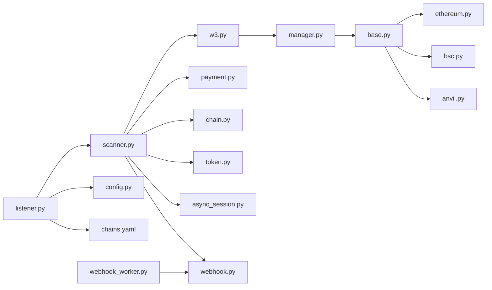
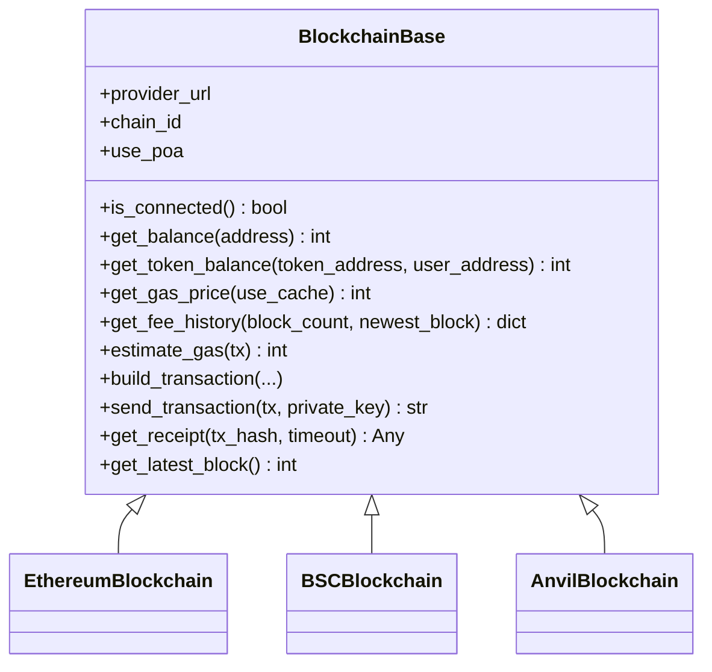

# Listener Worker

<cite>
**Referenced Files in This Document**
- [listener.py](https://github.com/rakibhossain72/ctrip/blob/main/app/workers/listener.py)
- [scanner.py](https://github.com/rakibhossain72/ctrip/blob/main/app/services/blockchain/scanner.py)
- [w3.py](https://github.com/rakibhossain72/ctrip/blob/main/app/blockchain/w3.py)
- [manager.py](https://github.com/rakibhossain72/ctrip/blob/main/app/blockchain/manager.py)
- [base.py](https://github.com/rakibhossain72/ctrip/blob/main/app/blockchain/base.py)
- [ethereum.py](https://github.com/rakibhossain72/ctrip/blob/main/app/blockchain/ethereum.py)
- [bsc.py](https://github.com/rakibhossain72/ctrip/blob/main/app/blockchain/bsc.py)
- [anvil.py](https://github.com/rakibhossain72/ctrip/blob/main/app/blockchain/anvil.py)
- [config.py](https://github.com/rakibhossain72/ctrip/blob/main/app/core/config.py)
- [payment.py](https://github.com/rakibhossain72/ctrip/blob/main/app/db/models/payment.py)
- [chain.py](https://github.com/rakibhossain72/ctrip/blob/main/app/db/models/chain.py)
- [token.py](https://github.com/rakibhossain72/ctrip/blob/main/app/db/models/token.py)
- [webhook.py](https://github.com/rakibhossain72/ctrip/blob/main/app/services/webhook.py)
- [webhook_worker.py](https://github.com/rakibhossain72/ctrip/blob/main/app/workers/webhook.py)
- [async_session.py](https://github.com/rakibhossain72/ctrip/blob/main/app/db/async_session.py)
- [chains.yaml](https://github.com/rakibhossain72/ctrip/blob/main/chains.yaml)
- [workers_init.py](https://github.com/rakibhossain72/ctrip/blob/main/app/workers/__init__.py)
</cite>

## Table of Contents
1. [Introduction](#introduction)
2. [Project Structure](#project-structure)
3. [Core Components](#core-components)
4. [Architecture Overview](#architecture-overview)
5. [Detailed Component Analysis](#detailed-component-analysis)
6. [Dependency Analysis](#dependency-analysis)
7. [Performance Considerations](#performance-considerations)
8. [Troubleshooting Guide](#troubleshooting-guide)
9. [Conclusion](#conclusion)
10. [Appendices](#appendices)

## Introduction
This document describes the Listener Worker responsible for blockchain payment monitoring in the cTrip Payment Gateway. It explains how the worker scans blockchain networks for incoming payments, detects transactions, verifies amounts, and transitions payments through internal statuses. It also covers integration with blockchain managers, scanner services, and payment processing workflows; task scheduling patterns; polling intervals and scan frequency configurations; error handling and retry mechanisms; interaction with external blockchain APIs; rate-limiting considerations; network timeout handling; and performance monitoring and logging patterns.

## Project Structure
The Listener Worker resides in the workers package and orchestrates scanning via a service layer that interacts with blockchain providers and the database. Key modules include:
- Workers: listener actor and webhook sender
- Services: blockchain scanner service
- Blockchain: provider abstraction and chain-specific implementations
- Database models: payment, chain state, token
- Configuration: runtime settings and chain configuration file
- Asynchronous database session management

**Diagram sources**
- [listener.py](https://github.com/rakibhossain72/ctrip/blob/main/app/workers/listener.py#L1-L46)
- [scanner.py](https://github.com/rakibhossain72/ctrip/blob/main/app/services/blockchain/scanner.py#L1-L134)
- [w3.py](https://github.com/rakibhossain72/ctrip/blob/main/app/blockchain/w3.py#L1-L9)
- [manager.py](https://github.com/rakibhossain72/ctrip/blob/main/app/blockchain/manager.py#L1-L33)
- [base.py](https://github.com/rakibhossain72/ctrip/blob/main/app/blockchain/base.py#L1-L146)
- [ethereum.py](https://github.com/rakibhossain72/ctrip/blob/main/app/blockchain/ethereum.py#L1-L7)
- [bsc.py](https://github.com/rakibhossain72/ctrip/blob/main/app/blockchain/bsc.py#L1-L7)
- [anvil.py](https://github.com/rakibhossain72/ctrip/blob/main/app/blockchain/anvil.py#L1-L57)
- [payment.py](https://github.com/rakibhossain72/ctrip/blob/main/app/db/models/payment.py#L1-L74)
- [chain.py](https://github.com/rakibhossain72/ctrip/blob/main/app/db/models/chain.py#L1-L17)
- [token.py](https://github.com/rakibhossain72/ctrip/blob/main/app/db/models/token.py#L1-L15)
- [webhook.py](https://github.com/rakibhossain72/ctrip/blob/main/app/services/webhook.py#L1-L45)
- [webhook_worker.py](https://github.com/rakibhossain72/ctrip/blob/main/app/workers/webhook.py#L1-L37)
- [async_session.py](https://github.com/rakibhossain72/ctrip/blob/main/app/db/async_session.py#L1-L15)
- [config.py](https://github.com/rakibhossain72/ctrip/blob/main/app/core/config.py#L1-L126)
- [chains.yaml](https://github.com/rakibhossain72/ctrip/blob/main/chains.yaml#L1-L24)

**Section sources**
- [listener.py](https://github.com/rakibhossain72/ctrip/blob/main/app/workers/listener.py#L1-L46)
- [scanner.py](https://github.com/rakibhossain72/ctrip/blob/main/app/services/blockchain/scanner.py#L1-L134)
- [w3.py](https://github.com/rakibhossain72/ctrip/blob/main/app/blockchain/w3.py#L1-L9)
- [manager.py](https://github.com/rakibhossain72/ctrip/blob/main/app/blockchain/manager.py#L1-L33)
- [base.py](https://github.com/rakibhossain72/ctrip/blob/main/app/blockchain/base.py#L1-L146)
- [payment.py](https://github.com/rakibhossain72/ctrip/blob/main/app/db/models/payment.py#L1-L74)
- [chain.py](https://github.com/rakibhossain72/ctrip/blob/main/app/db/models/chain.py#L1-L17)
- [token.py](https://github.com/rakibhossain72/ctrip/blob/main/app/db/models/token.py#L1-L15)
- [webhook.py](https://github.com/rakibhossain72/ctrip/blob/main/app/services/webhook.py#L1-L45)
- [webhook_worker.py](https://github.com/rakibhossain72/ctrip/blob/main/app/workers/webhook.py#L1-L37)
- [async_session.py](https://github.com/rakibhossain72/ctrip/blob/main/app/db/async_session.py#L1-L15)
- [config.py](https://github.com/rakibhossain72/ctrip/blob/main/app/core/config.py#L1-L126)
- [chains.yaml](https://github.com/rakibhossain72/ctrip/blob/main/chains.yaml#L1-L24)

## Core Components
- Listener Worker (Dramatiq actor): Triggers scanning cycles for configured chains, schedules next run, and handles errors.
- Scanner Service: Scans blocks for native and ERC20 transfers, updates detected payments, and confirms payments after required confirmations.
- Blockchain Provider Abstraction: AsyncWeb3-backed clients per chain with POA support, gas estimation, and transaction building.
- Database Models: Payment, ChainState, Token; used to track pending payments, last scanned block, and token metadata.
- Webhook Integration: Asynchronous webhook sender via Dramatiq with retries and HMAC signing.

Key configuration and constants:
- Confirmation threshold and block batch size are defined in the listener worker.
- Chains are loaded from a YAML file and mapped to provider instances.
- Webhook URL and secret are configurable.

**Section sources**
- [listener.py](https://github.com/rakibhossain72/ctrip/blob/main/app/workers/listener.py#L15-L16)
- [scanner.py](https://github.com/rakibhossain72/ctrip/blob/main/app/services/blockchain/scanner.py#L12-L18)
- [config.py](https://github.com/rakibhossain72/ctrip/blob/main/app/core/config.py#L44-L56)
- [chains.yaml](https://github.com/rakibhossain72/ctrip/blob/main/chains.yaml#L1-L24)
- [webhook_worker.py](https://github.com/rakibhossain72/ctrip/blob/main/app/workers/webhook.py#L13-L36)

## Architecture Overview
The Listener Worker runs periodically, invoking the Scanner Service for each configured chain. The Scanner Service queries the latest block number, determines a block range based on ChainState and batch size, and scans blocks for matching payments. It updates payment status to detected and later to confirmed after sufficient confirmations. On confirmation, the worker optionally triggers a webhook notification.

**Diagram sources**
- [listener.py](https://github.com/rakibhossain72/ctrip/blob/main/app/workers/listener.py#L21-L46)
- [scanner.py](https://github.com/rakibhossain72/ctrip/blob/main/app/services/blockchain/scanner.py#L20-L96)
- [scanner.py](https://github.com/rakibhossain72/ctrip/blob/main/app/services/blockchain/scanner.py#L97-L134)
- [w3.py](https://github.com/rakibhossain72/ctrip/blob/main/app/blockchain/w3.py#L6-L9)
- [manager.py](https://github.com/rakibhossain72/ctrip/blob/main/app/blockchain/manager.py#L8-L32)
- [base.py](https://github.com/rakibhossain72/ctrip/blob/main/app/blockchain/base.py#L34-L36)
- [webhook_worker.py](https://github.com/rakibhossain72/ctrip/blob/main/app/workers/webhook.py#L13-L36)
- [webhook.py](https://github.com/rakibhossain72/ctrip/blob/main/app/services/webhook.py#L10-L44)

## Detailed Component Analysis

### Listener Worker
Responsibilities:
- Periodic execution via Dramatiq actor.
- Builds ScannerService with configuration constants.
- Iterates over configured chains, scanning and confirming payments.
- Schedules the next run with a fixed delay.

Behavioral notes:
- Uses a time limit and disables retries at the actor level.
- Schedules the next run unconditionally after each cycle.
- Logs lifecycle events and exceptions.

Operational parameters:
- Confirmation threshold and block batch size are constants in the module.
- Chain list comes from settings.chains, defaults to a local chain if none configured.

Scheduling pattern:
- Actor completion triggers a delayed message (5 seconds) to repeat the cycle.

Error handling:
- Catches exceptions during the run and logs them.
- Ensures the next scheduled run is still queued.

**Section sources**
- [listener.py](https://github.com/rakibhossain72/ctrip/blob/main/app/workers/listener.py#L15-L16)
- [listener.py](https://github.com/rakibhossain72/ctrip/blob/main/app/workers/listener.py#L21-L46)
- [config.py](https://github.com/rakibhossain72/ctrip/blob/main/app/core/config.py#L44-L56)
- [chains.yaml](https://github.com/rakibhossain72/ctrip/blob/main/chains.yaml#L12-L23)

### Scanner Service
Responsibilities:
- Scan a single chain for new blocks and detect payments.
- Confirm detected payments based on required confirmations.
- Persist ChainState and update Payment records.

Scan algorithm:
- Load ChainState for the chain; skip if not found.
- Determine from/to block window using last scanned block and batch size.
- If no pending payments, update last scanned block and return.
- For each block in the window:
  - Native transfers: iterate transactions, match destination address, compare amount.
  - ERC20 transfers: fetch Transfer logs, match topics and token address, compare value.
- Update ChainState.last_scanned_block and commit.

Confirmation algorithm:
- For each detected payment, compute confirmations as latest block minus detected block plus one.
- If confirmations meet or exceed required threshold, mark as confirmed and optionally emit a webhook.

Logging:
- Emits informational messages for detected and confirmed payments, and scan progress.

**Section sources**
- [scanner.py](https://github.com/rakibhossain72/ctrip/blob/main/app/services/blockchain/scanner.py#L14-L18)
- [scanner.py](https://github.com/rakibhossain72/ctrip/blob/main/app/services/blockchain/scanner.py#L20-L96)
- [scanner.py](https://github.com/rakibhossain72/ctrip/blob/main/app/services/blockchain/scanner.py#L97-L134)
- [chain.py](https://github.com/rakibhossain72/ctrip/blob/main/app/db/models/chain.py#L9-L17)
- [payment.py](https://github.com/rakibhossain72/ctrip/blob/main/app/db/models/payment.py#L41-L57)
- [token.py](https://github.com/rakibhossain72/ctrip/blob/main/app/db/models/token.py#L6-L15)

### Blockchain Provider Abstraction
- BlockchainBase encapsulates AsyncWeb3 provider creation, POA middleware injection, and gas/fee helpers.
- Chain-specific subclasses set chain IDs and POA flags.
- get_w3 resolves AsyncWeb3 instances from configured chains.

Timeouts and reliability:
- AsyncHTTPProvider supports a request timeout parameter.
- Connection checks and error logging are provided.

**Section sources**
- [base.py](https://github.com/rakibhossain72/ctrip/blob/main/app/blockchain/base.py#L22-L44)
- [base.py](https://github.com/rakibhossain72/ctrip/blob/main/app/blockchain/base.py#L45-L50)
- [ethereum.py](https://github.com/rakibhossain72/ctrip/blob/main/app/blockchain/ethereum.py#L3-L6)
- [bsc.py](https://github.com/rakibhossain72/ctrip/blob/main/app/blockchain/bsc.py#L3-L6)
- [anvil.py](https://github.com/rakibhossain72/ctrip/blob/main/app/blockchain/anvil.py#L8-L11)
- [w3.py](https://github.com/rakibhossain72/ctrip/blob/main/app/blockchain/w3.py#L4-L9)
- [manager.py](https://github.com/rakibhossain72/ctrip/blob/main/app/blockchain/manager.py#L8-L32)

### Database Models and Sessions
- Payment tracks chain, address, amount, status, confirmations, detection block, expiry, and timestamps.
- ChainState tracks last scanned block per chain.
- Token stores chain, address, symbol, decimals, and enabled flag.
- AsyncSessionLocal provides async SQLAlchemy sessions for the worker’s lifecycle.

**Section sources**
- [payment.py](https://github.com/rakibhossain72/ctrip/blob/main/app/db/models/payment.py#L41-L57)
- [chain.py](https://github.com/rakibhossain72/ctrip/blob/main/app/db/models/chain.py#L9-L17)
- [token.py](https://github.com/rakibhossain72/ctrip/blob/main/app/db/models/token.py#L6-L15)
- [async_session.py](https://github.com/rakibhossain72/ctrip/blob/main/app/db/async_session.py#L6-L10)

### Webhook Integration
- WebhookService sends asynchronous HTTP requests with optional HMAC signature.
- send_webhook_task is a Dramatiq actor that invokes WebhookService and raises on failure to trigger retries.
- ScannerService conditionally enqueues a webhook task upon confirmation.

**Section sources**
- [webhook.py](https://github.com/rakibhossain72/ctrip/blob/main/app/services/webhook.py#L10-L44)
- [webhook_worker.py](https://github.com/rakibhossain72/ctrip/blob/main/app/workers/webhook.py#L13-L36)
- [scanner.py](https://github.com/rakibhossain72/ctrip/blob/main/app/services/blockchain/scanner.py#L117-L131)
- [config.py](https://github.com/rakibhossain72/ctrip/blob/main/app/core/config.py#L63-L71)

### Task Scheduling and Polling
- The listener actor is scheduled by the broker; after each run completes, it schedules the next run with a fixed delay.
- Block scanning uses a batch size to limit work per cycle.
- Confirmation checks use the latest block number to evaluate confirmations.

Configuration:
- Fixed delay between cycles is set in the listener.
- Batch size and confirmation threshold are constants in the listener and scanner respectively.

**Section sources**
- [listener.py](https://github.com/rakibhossain72/ctrip/blob/main/app/workers/listener.py#L42-L46)
- [listener.py](https://github.com/rakibhossain72/ctrip/blob/main/app/workers/listener.py#L15-L16)
- [scanner.py](https://github.com/rakibhossain72/ctrip/blob/main/app/services/blockchain/scanner.py#L15-L18)

### Transaction Detection Algorithms
- Native transfers: Match transaction recipient address against payment addresses and compare transferred value with required amount.
- ERC20 transfers: Filter logs by Transfer topic, decode destination from topic index, match token address, and compare log data value.

Complexity considerations:
- Native scanning iterates all transactions per block; ER20 scanning fetches logs per block.
- Address matching uses hash maps keyed by lowercased addresses for O(1) lookup.

**Section sources**
- [scanner.py](https://github.com/rakibhossain72/ctrip/blob/main/app/services/blockchain/scanner.py#L55-L92)
- [scanner.py](https://github.com/rakibhossain72/ctrip/blob/main/app/services/blockchain/scanner.py#L12-L12)

### Payment Verification and Status Transitions
- Pending payments are matched against detected transfers; status updated to detected.
- After sufficient confirmations, status transitions to confirmed.
- Webhook is emitted on confirmation if configured.

**Section sources**
- [scanner.py](https://github.com/rakibhossain72/ctrip/blob/main/app/services/blockchain/scanner.py#L65-L91)
- [scanner.py](https://github.com/rakibhossain72/ctrip/blob/main/app/services/blockchain/scanner.py#L111-L115)
- [payment.py](https://github.com/rakibhossain72/ctrip/blob/main/app/db/models/payment.py#L21-L39)

### Error Handling, Retry Mechanisms, and Failure Recovery
- Listener catches exceptions, logs them, and still schedules the next run.
- Webhook actor raises on failure to enable Dramatiq retries with a small backoff.
- WebhookService logs HTTP errors and generic exceptions, returning failure status.
- BlockchainBase logs connection failures and warns on gas estimation fallbacks.

Recovery:
- Next cycle resumes scanning from ChainState.last_scanned_block.
- Webhook failures are retried by the broker until successful or exhausted.

**Section sources**
- [listener.py](https://github.com/rakibhossain72/ctrip/blob/main/app/workers/listener.py#L43-L45)
- [webhook_worker.py](https://github.com/rakibhossain72/ctrip/blob/main/app/workers/webhook.py#L24-L36)
- [webhook.py](https://github.com/rakibhossain72/ctrip/blob/main/app/services/webhook.py#L39-L44)
- [base.py](https://github.com/rakibhossain72/ctrip/blob/main/app/blockchain/base.py#L48-L50)
- [base.py](https://github.com/rakibhossain72/ctrip/blob/main/app/blockchain/base.py#L89-L91)

### External API Interaction, Rate Limiting, and Timeouts
- AsyncWeb3 uses AsyncHTTPProvider with a configurable request timeout.
- Gas and fee estimation include caching and fallbacks.
- get_logs and get_block are called per block; batching reduces load.
- WebhookService uses an async HTTP client with a short timeout.

Recommendations:
- Monitor provider latency and adjust batch size accordingly.
- Consider provider-side rate limits and implement backoff if needed.
- Use chain-specific timeouts and circuit breaker patterns if available.

**Section sources**
- [base.py](https://github.com/rakibhossain72/ctrip/blob/main/app/blockchain/base.py#L28-L36)
- [base.py](https://github.com/rakibhossain72/ctrip/blob/main/app/blockchain/base.py#L65-L81)
- [base.py](https://github.com/rakibhossain72/ctrip/blob/main/app/blockchain/base.py#L86-L92)
- [webhook.py](https://github.com/rakibhossain72/ctrip/blob/main/app/services/webhook.py#L33-L36)
- [scanner.py](https://github.com/rakibhossain72/ctrip/blob/main/app/services/blockchain/scanner.py#L34-L36)

### Performance Monitoring, Logging, and Debugging
- Logging is used extensively in scanner, listener, and webhook components.
- Key metrics include detected and confirmed counts per cycle.
- Debugging tips:
  - Verify ChainState last scanned block alignment with actual chain progress.
  - Confirm payment addresses and token addresses match chain configuration.
  - Inspect webhook delivery logs and signatures.

**Section sources**
- [scanner.py](https://github.com/rakibhossain72/ctrip/blob/main/app/services/blockchain/scanner.py#L66-L69)
- [scanner.py](https://github.com/rakibhossain72/ctrip/blob/main/app/services/blockchain/scanner.py#L88-L91)
- [scanner.py](https://github.com/rakibhossain72/ctrip/blob/main/app/services/blockchain/scanner.py#L112-L115)
- [webhook_worker.py](https://github.com/rakibhossain72/ctrip/blob/main/app/workers/webhook.py#L22-L23)

## Dependency Analysis
The listener depends on the scanner service and configuration; the scanner depends on database models, AsyncWeb3 via get_w3, and the webhook service. Providers are resolved through a manager that maps chain names to implementations.

**Diagram sources**
- [listener.py](https://github.com/rakibhossain72/ctrip/blob/main/app/workers/listener.py#L1-L46)
- [scanner.py](https://github.com/rakibhossain72/ctrip/blob/main/app/services/blockchain/scanner.py#L1-L134)
- [w3.py](https://github.com/rakibhossain72/ctrip/blob/main/app/blockchain/w3.py#L1-L9)
- [manager.py](https://github.com/rakibhossain72/ctrip/blob/main/app/blockchain/manager.py#L1-L33)
- [base.py](https://github.com/rakibhossain72/ctrip/blob/main/app/blockchain/base.py#L1-L146)
- [ethereum.py](https://github.com/rakibhossain72/ctrip/blob/main/app/blockchain/ethereum.py#L1-L7)
- [bsc.py](https://github.com/rakibhossain72/ctrip/blob/main/app/blockchain/bsc.py#L1-L7)
- [anvil.py](https://github.com/rakibhossain72/ctrip/blob/main/app/blockchain/anvil.py#L1-L57)
- [payment.py](https://github.com/rakibhossain72/ctrip/blob/main/app/db/models/payment.py#L1-L74)
- [chain.py](https://github.com/rakibhossain72/ctrip/blob/main/app/db/models/chain.py#L1-L17)
- [token.py](https://github.com/rakibhossain72/ctrip/blob/main/app/db/models/token.py#L1-L15)
- [webhook.py](https://github.com/rakibhossain72/ctrip/blob/main/app/services/webhook.py#L1-L45)
- [webhook_worker.py](https://github.com/rakibhossain72/ctrip/blob/main/app/workers/webhook.py#L1-L37)
- [async_session.py](https://github.com/rakibhossain72/ctrip/blob/main/app/db/async_session.py#L1-L15)
- [config.py](https://github.com/rakibhossain72/ctrip/blob/main/app/core/config.py#L1-L126)
- [chains.yaml](https://github.com/rakibhossain72/ctrip/blob/main/chains.yaml#L1-L24)

**Section sources**
- [listener.py](https://github.com/rakibhossain72/ctrip/blob/main/app/workers/listener.py#L1-L46)
- [scanner.py](https://github.com/rakibhossain72/ctrip/blob/main/app/services/blockchain/scanner.py#L1-L134)
- [w3.py](https://github.com/rakibhossain72/ctrip/blob/main/app/blockchain/w3.py#L1-L9)
- [manager.py](https://github.com/rakibhossain72/ctrip/blob/main/app/blockchain/manager.py#L1-L33)
- [base.py](https://github.com/rakibhossain72/ctrip/blob/main/app/blockchain/base.py#L1-L146)
- [payment.py](https://github.com/rakibhossain72/ctrip/blob/main/app/db/models/payment.py#L1-L74)
- [chain.py](https://github.com/rakibhossain72/ctrip/blob/main/app/db/models/chain.py#L1-L17)
- [token.py](https://github.com/rakibhossain72/ctrip/blob/main/app/db/models/token.py#L1-L15)
- [webhook.py](https://github.com/rakibhossain72/ctrip/blob/main/app/services/webhook.py#L1-L45)
- [webhook_worker.py](https://github.com/rakibhossain72/ctrip/blob/main/app/workers/webhook.py#L1-L37)
- [async_session.py](https://github.com/rakibhossain72/ctrip/blob/main/app/db/async_session.py#L1-L15)
- [config.py](https://github.com/rakibhossain72/ctrip/blob/main/app/core/config.py#L1-L126)
- [chains.yaml](https://github.com/rakibhossain72/ctrip/blob/main/chains.yaml#L1-L24)

## Performance Considerations
- Block batch size controls work per cycle; larger batches increase throughput but risk timeouts or overload.
- Confirmation threshold balances safety and latency; higher thresholds reduce reorg risk but delay finalization.
- Gas and fee estimation cache reduces repeated provider calls.
- Webhook delivery is asynchronous; tune broker concurrency and retry policies.
- Consider provider rate limits and implement backoff or pagination if needed.

[No sources needed since this section provides general guidance]

## Troubleshooting Guide
Common issues and resolutions:
- No chain state found: Ensure ChainState entries exist for each chain before scanning.
- Payments not detected: Verify addresses and amounts; check token decimals and ERC20 topic filtering.
- Webhook failures: Check URL, secret, and network connectivity; inspect webhook logs for HTTP errors.
- Timeout errors: Increase provider request timeout or reduce batch size; monitor provider latency.
- Reorgs: Increase confirmation threshold to mitigate late-mine scenarios.

**Section sources**
- [scanner.py](https://github.com/rakibhossain72/ctrip/blob/main/app/services/blockchain/scanner.py#L30-L32)
- [scanner.py](https://github.com/rakibhossain72/ctrip/blob/main/app/services/blockchain/scanner.py#L117-L131)
- [webhook.py](https://github.com/rakibhossain72/ctrip/blob/main/app/services/webhook.py#L39-L44)
- [base.py](https://github.com/rakibhossain72/ctrip/blob/main/app/blockchain/base.py#L28-L36)

## Conclusion
The Listener Worker provides a robust, modular pipeline for monitoring blockchain payments. It leverages asynchronous primitives, configurable chain providers, and a clear status lifecycle to reliably detect and confirm payments. With proper configuration of batch sizes, confirmation thresholds, and webhook delivery, it integrates cleanly with the broader payment gateway infrastructure while offering resilient error handling and observability.

[No sources needed since this section summarizes without analyzing specific files]

## Appendices

### Configuration Reference
- Chains configuration file path and content format.
- Runtime settings for database, RPC, Redis, and webhook parameters.

**Section sources**
- [config.py](https://github.com/rakibhossain72/ctrip/blob/main/app/core/config.py#L39-L56)
- [chains.yaml](https://github.com/rakibhossain72/ctrip/blob/main/chains.yaml#L1-L24)

### Class Relationships

**Diagram sources**
- [base.py](https://github.com/rakibhossain72/ctrip/blob/main/app/blockchain/base.py#L22-L146)
- [ethereum.py](https://github.com/rakibhossain72/ctrip/blob/main/app/blockchain/ethereum.py#L3-L6)
- [bsc.py](https://github.com/rakibhossain72/ctrip/blob/main/app/blockchain/bsc.py#L3-L6)
- [anvil.py](https://github.com/rakibhossain72/ctrip/blob/main/app/blockchain/anvil.py#L8-L57)