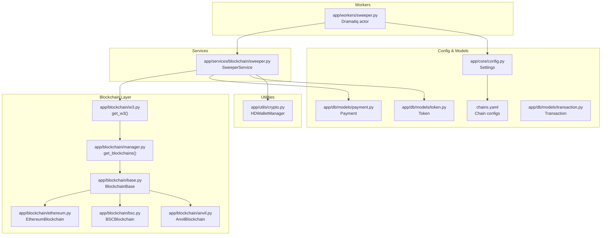
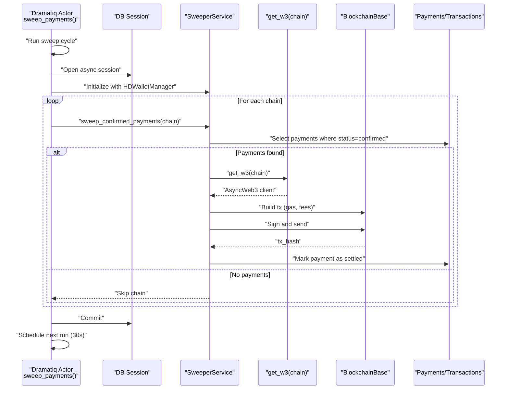
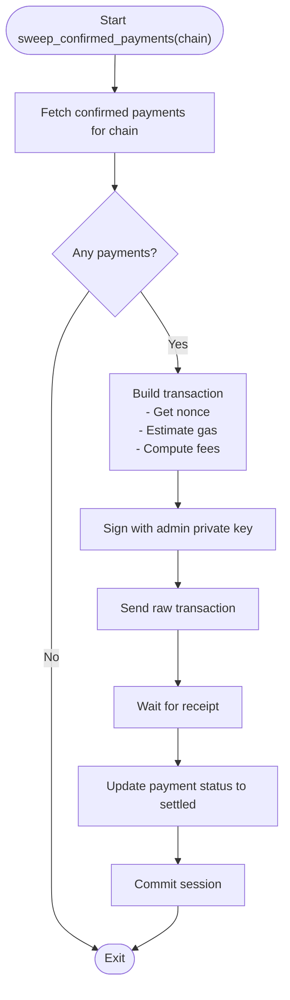
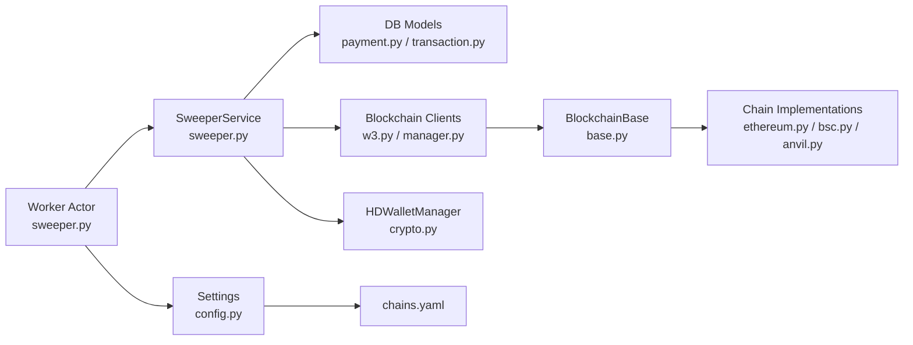

# Sweeper Worker

<cite>
**Referenced Files in This Document**
- [sweeper.py](https://github.com/rakibhossain72/ctrip/blob/main/app/workers/sweeper.py)
- [sweeper_service.py](https://github.com/rakibhossain72/ctrip/blob/main/app/services/blockchain/sweeper.py)
- [config.py](https://github.com/rakibhossain72/ctrip/blob/main/app/core/config.py)
- [w3.py](https://github.com/rakibhossain72/ctrip/blob/main/app/blockchain/w3.py)
- [manager.py](https://github.com/rakibhossain72/ctrip/blob/main/app/blockchain/manager.py)
- [base.py](https://github.com/rakibhossain72/ctrip/blob/main/app/blockchain/base.py)
- [ethereum.py](https://github.com/rakibhossain72/ctrip/blob/main/app/blockchain/ethereum.py)
- [bsc.py](https://github.com/rakibhossain72/ctrip/blob/main/app/blockchain/bsc.py)
- [anvil.py](https://github.com/rakibhossain72/ctrip/blob/main/app/blockchain/anvil.py)
- [crypto.py](https://github.com/rakibhossain72/ctrip/blob/main/app/utils/crypto.py)
- [payment_model.py](https://github.com/rakibhossain72/ctrip/blob/main/app/db/models/payment.py)
- [transaction_model.py](https://github.com/rakibhossain72/ctrip/blob/main/app/db/models/transaction.py)
- [token_model.py](https://github.com/rakibhossain72/ctrip/blob/main/app/db/models/token.py)
- [chains.yaml](https://github.com/rakibhossain72/ctrip/blob/main/chains.yaml)
- [workers_init.py](https://github.com/rakibhossain72/ctrip/blob/main/app/workers/__init__.py)
</cite>

## Table of Contents
1. [Introduction](#introduction)
2. [Project Structure](#project-structure)
3. [Core Components](#core-components)
4. [Architecture Overview](#architecture-overview)
5. [Detailed Component Analysis](#detailed-component-analysis)
6. [Dependency Analysis](#dependency-analysis)
7. [Performance Considerations](#performance-considerations)
8. [Troubleshooting Guide](#troubleshooting-guide)
9. [Conclusion](#conclusion)
10. [Appendices](#appendices)

## Introduction
This document describes the Sweeper Worker responsible for automatic fund collection and settlement processing in the cTrip Payment Gateway. It explains how the sweeper transfers confirmed payments to administrator wallets, integrates with blockchain services, manages wallet keys, and prepares transactions for broadcasting. It also covers sweep triggers, confirmation thresholds, batch processing behavior, gas optimization strategies, prioritization, fee management, error handling, retry policies, manual intervention procedures, and monitoring approaches for fund transfer operations.

## Project Structure
The sweeper spans several modules:
- Worker entrypoint and scheduling via Dramatiq actors
- Sweeper service orchestrating per-chain settlement
- Blockchain abstraction and transaction building
- Configuration and chain discovery
- Database models for payments and transactions
- Utilities for HD wallet management

**Diagram sources**
- [sweeper.py](https://github.com/rakibhossain72/ctrip/blob/main/app/workers/sweeper.py#L1-L40)
- [sweeper_service.py](https://github.com/rakibhossain72/ctrip/blob/main/app/services/blockchain/sweeper.py#L1-L54)
- [w3.py](https://github.com/rakibhossain72/ctrip/blob/main/app/blockchain/w3.py#L1-L9)
- [manager.py](https://github.com/rakibhossain72/ctrip/blob/main/app/blockchain/manager.py#L1-L33)
- [base.py](https://github.com/rakibhossain72/ctrip/blob/main/app/blockchain/base.py#L1-L146)
- [ethereum.py](https://github.com/rakibhossain72/ctrip/blob/main/app/blockchain/ethereum.py#L1-L7)
- [bsc.py](https://github.com/rakibhossain72/ctrip/blob/main/app/blockchain/bsc.py#L1-L7)
- [anvil.py](https://github.com/rakibhossain72/ctrip/blob/main/app/blockchain/anvil.py#L1-L57)
- [config.py](https://github.com/rakibhossain72/ctrip/blob/main/app/core/config.py#L1-L126)
- [chains.yaml](https://github.com/rakibhossain72/ctrip/blob/main/chains.yaml#L1-L24)
- [token_model.py](https://github.com/rakibhossain72/ctrip/blob/main/app/db/models/token.py#L1-L15)
- [payment_model.py](https://github.com/rakibhossain72/ctrip/blob/main/app/db/models/payment.py#L1-L74)
- [transaction_model.py](https://github.com/rakibhossain72/ctrip/blob/main/app/db/models/transaction.py#L1-L40)
- [crypto.py](https://github.com/rakibhossain72/ctrip/blob/main/app/utils/crypto.py#L1-L90)

**Section sources**
- [sweeper.py](https://github.com/rakibhossain72/ctrip/blob/main/app/workers/sweeper.py#L1-L40)
- [sweeper_service.py](https://github.com/rakibhossain72/ctrip/blob/main/app/services/blockchain/sweeper.py#L1-L54)
- [w3.py](https://github.com/rakibhossain72/ctrip/blob/main/app/blockchain/w3.py#L1-L9)
- [manager.py](https://github.com/rakibhossain72/ctrip/blob/main/app/blockchain/manager.py#L1-L33)
- [base.py](https://github.com/rakibhossain72/ctrip/blob/main/app/blockchain/base.py#L1-L146)
- [config.py](https://github.com/rakibhossain72/ctrip/blob/main/app/core/config.py#L1-L126)
- [chains.yaml](https://github.com/rakibhossain72/ctrip/blob/main/chains.yaml#L1-L24)
- [payment_model.py](https://github.com/rakibhossain72/ctrip/blob/main/app/db/models/payment.py#L1-L74)
- [transaction_model.py](https://github.com/rakibhossain72/ctrip/blob/main/app/db/models/transaction.py#L1-L40)
- [token_model.py](https://github.com/rakibhossain72/ctrip/blob/main/app/db/models/token.py#L1-L15)
- [crypto.py](https://github.com/rakibhossain72/ctrip/blob/main/app/utils/crypto.py#L1-L90)

## Core Components
- Sweeper Worker Actor: A scheduled Dramatiq actor that triggers sweeping cycles, initializes sessions, and iterates chains to settle confirmed payments.
- SweeperService: Orchestrates per-chain settlement by fetching confirmed payments, preparing transactions, and marking them as settled.
- Blockchain Abstraction: Provides AsyncWeb3-backed clients per chain, gas estimation, fee calculation, and transaction signing/send/receipt retrieval.
- Configuration: Centralized settings including chains, RPC endpoints, and secrets for private key and mnemonic.
- Database Models: Payment and Transaction models define statuses, confirmations, and relationships used by the sweeper.
- HD Wallet Manager: Generates derived addresses and private keys for payment addresses (used conceptually; current sweeper marks as settled without broadcasting).

Key responsibilities:
- Triggering sweep cycles and scheduling next runs
- Selecting confirmed payments per chain
- Building and broadcasting transactions (conceptual; current implementation marks as settled)
- Managing gas optimization and fee strategies
- Persisting settlement outcomes

**Section sources**
- [sweeper.py](https://github.com/rakibhossain72/ctrip/blob/main/app/workers/sweeper.py#L19-L40)
- [sweeper_service.py](https://github.com/rakibhossain72/ctrip/blob/main/app/services/blockchain/sweeper.py#L11-L54)
- [base.py](https://github.com/rakibhossain72/ctrip/blob/main/app/blockchain/base.py#L65-L146)
- [config.py](https://github.com/rakibhossain72/ctrip/blob/main/app/core/config.py#L44-L102)
- [payment_model.py](https://github.com/rakibhossain72/ctrip/blob/main/app/db/models/payment.py#L21-L58)
- [transaction_model.py](https://github.com/rakibhossain72/ctrip/blob/main/app/db/models/transaction.py#L17-L40)
- [crypto.py](https://github.com/rakibhossain72/ctrip/blob/main/app/utils/crypto.py#L5-L67)

## Architecture Overview
The sweeper follows a modular architecture:
- Worker actor schedules periodic runs and delegates work to the sweeper service.
- The sweeper service queries the database for confirmed payments, selects the appropriate chain client, and prepares transactions.
- Transactions are built with dynamic gas pricing and fee calculation, then broadcast via the blockchain client.
- Settlement updates are persisted to the database.

**Diagram sources**
- [sweeper.py](https://github.com/rakibhossain72/ctrip/blob/main/app/workers/sweeper.py#L19-L40)
- [sweeper_service.py](https://github.com/rakibhossain72/ctrip/blob/main/app/services/blockchain/sweeper.py#L16-L54)
- [w3.py](https://github.com/rakibhossain72/ctrip/blob/main/app/blockchain/w3.py#L6-L9)
- [base.py](https://github.com/rakibhossain72/ctrip/blob/main/app/blockchain/base.py#L93-L146)
- [payment_model.py](https://github.com/rakibhossain72/ctrip/blob/main/app/db/models/payment.py#L21-L58)
- [transaction_model.py](https://github.com/rakibhossain72/ctrip/blob/main/app/db/models/transaction.py#L17-L40)

## Detailed Component Analysis

### Sweeper Worker Actor
- Role: Periodic trigger for sweeping confirmed payments across configured chains.
- Scheduling: Uses Dramatiq with a fixed delay to schedule the next run after each cycle.
- Initialization: Builds an async database session, instantiates HDWalletManager from settings, and iterates chains from configuration.
- Error handling: Logs exceptions and ensures the next run is scheduled regardless of errors.

Operational notes:
- The actor does not currently enforce a maximum retry count at the actor level; scheduling occurs in the finally block.
- Chains are derived from settings.chains, with a fallback to a local chain if none are configured.

**Section sources**
- [sweeper.py](https://github.com/rakibhossain72/ctrip/blob/main/app/workers/sweeper.py#L19-L40)
- [workers_init.py](https://github.com/rakibhossain72/ctrip/blob/main/app/workers/__init__.py#L1-L8)
- [config.py](https://github.com/rakibhossain72/ctrip/blob/main/app/core/config.py#L44-L57)

### SweeperService
- Responsibilities:
  - Resolve AsyncWeb3 client per chain via get_w3.
  - Load admin account from private key in settings.
  - Query confirmed payments for the given chain.
  - For each payment, prepare and broadcast a transaction (placeholder logic currently marks as settled).
  - Commit database changes.

- Current placeholder behavior:
  - Sets payment status to settled without broadcasting a transaction.
  - Intended future steps include deriving payment private keys, checking balances, sending funds to the admin address, and updating transaction records.

- Status transitions:
  - Payments move from confirmed to settled upon successful completion.

**Section sources**
- [sweeper_service.py](https://github.com/rakibhossain72/ctrip/blob/main/app/services/blockchain/sweeper.py#L11-L54)
- [config.py](https://github.com/rakibhossain72/ctrip/blob/main/app/core/config.py#L74-L102)
- [payment_model.py](https://github.com/rakibhossain72/ctrip/blob/main/app/db/models/payment.py#L21-L58)

### Blockchain Integration and Gas Optimization
- Chain selection and clients:
  - get_blockchains builds a registry of configured chains and falls back to a local chain if none are configured.
  - get_w3 resolves an AsyncWeb3 client per chain name.

- Transaction building and broadcasting:
  - build_transaction constructs unsigned transactions with nonce, chainId, and gas parameters.
  - Fee calculation attempts EIP-1559 fee history; falls back to legacy gas price if unavailable.
  - estimate_gas uses provider estimation with safe defaults if estimation fails.
  - send_transaction signs and sends raw transactions; get_receipt waits for confirmation.

- Gas optimization strategies:
  - Caches gas price for a short duration to reduce RPC calls.
  - Applies a small gas limit multiplier to avoid underestimation.
  - Uses fee_history to compute dynamic maxFeePerGas and maxPriorityFeePerGas.

- POA support:
  - BSC uses POA middleware injection for compatibility.

**Section sources**
- [manager.py](https://github.com/rakibhossain72/ctrip/blob/main/app/blockchain/manager.py#L8-L33)
- [w3.py](https://github.com/rakibhossain72/ctrip/blob/main/app/blockchain/w3.py#L4-L9)
- [base.py](https://github.com/rakibhossain72/ctrip/blob/main/app/blockchain/base.py#L22-L146)
- [ethereum.py](https://github.com/rakibhossain72/ctrip/blob/main/app/blockchain/ethereum.py#L3-L7)
- [bsc.py](https://github.com/rakibhossain72/ctrip/blob/main/app/blockchain/bsc.py#L3-L7)
- [anvil.py](https://github.com/rakibhossain72/ctrip/blob/main/app/blockchain/anvil.py#L8-L57)

### Wallet Management and Keys
- HDWalletManager supports BIP-44 derivation for Ethereum-compatible addresses.
- Methods include generating mnemonics, deriving addresses by index, and retrieving multiple addresses.
- The sweeper currently uses a single admin private key from settings for settlement operations.

Note: The sweeper’s current placeholder logic does not derive per-payment private keys; this is intended for future implementation.

**Section sources**
- [crypto.py](https://github.com/rakibhossain72/ctrip/blob/main/app/utils/crypto.py#L5-L67)
- [config.py](https://github.com/rakibhossain72/ctrip/blob/main/app/core/config.py#L58-L82)
- [sweeper_service.py](https://github.com/rakibhossain72/ctrip/blob/main/app/services/blockchain/sweeper.py#L21-L22)

### Database Models and Batch Processing
- Payment model:
  - Tracks id, chain, address, amount, status, confirmations, and timestamps.
  - Settlement status is represented by the settled state.

- Transaction model:
  - Links to a payment, stores tx_hash, block_number, confirmations, and status.

- Batch processing:
  - The sweeper fetches all confirmed payments for a chain in a single query and processes them sequentially.
  - There is no explicit batching or pagination; performance depends on the number of confirmed payments.

- Confirmation thresholds:
  - Payments are selected based on status=confirmed; no additional block confirmations are enforced in the sweeper.

**Section sources**
- [payment_model.py](https://github.com/rakibhossain72/ctrip/blob/main/app/db/models/payment.py#L21-L58)
- [transaction_model.py](https://github.com/rakibhossain72/ctrip/blob/main/app/db/models/transaction.py#L17-L40)

### Sweep Triggers, Scheduling, and Retry Policies
- Trigger: The Dramatiq actor is invoked periodically with a fixed delay between runs.
- Retry policy: The actor is configured without retries; the worker schedules the next run in the finally block.
- Manual intervention: The actor can be triggered manually via the Dramatiq broker; logs provide visibility into failures.

Recommendations:
- Add explicit retry with backoff for transient failures.
- Consider idempotency checks to prevent duplicate settlements.

**Section sources**
- [sweeper.py](https://github.com/rakibhossain72/ctrip/blob/main/app/workers/sweeper.py#L19-L40)
- [workers_init.py](https://github.com/rakibhossain72/ctrip/blob/main/app/workers/__init__.py#L1-L8)

### Transaction Broadcasting and Settlement Flow

**Diagram sources**
- [sweeper_service.py](https://github.com/rakibhossain72/ctrip/blob/main/app/services/blockchain/sweeper.py#L16-L54)
- [base.py](https://github.com/rakibhossain72/ctrip/blob/main/app/blockchain/base.py#L93-L146)

## Dependency Analysis
- Worker-to-Service: The actor constructs SweeperService with a database session and HDWalletManager.
- Service-to-Blockchain: SweeperService obtains AsyncWeb3 clients via get_w3 and delegates transaction construction to the blockchain base class.
- Configuration-to-Chain Discovery: Settings.chains and chains.yaml drive chain registration and fallback behavior.
- Models-to-Service: Payment and Transaction models are used to query and update settlement state.

**Diagram sources**
- [sweeper.py](https://github.com/rakibhossain72/ctrip/blob/main/app/workers/sweeper.py#L19-L40)
- [sweeper_service.py](https://github.com/rakibhossain72/ctrip/blob/main/app/services/blockchain/sweeper.py#L11-L54)
- [w3.py](https://github.com/rakibhossain72/ctrip/blob/main/app/blockchain/w3.py#L1-L9)
- [manager.py](https://github.com/rakibhossain72/ctrip/blob/main/app/blockchain/manager.py#L1-L33)
- [base.py](https://github.com/rakibhossain72/ctrip/blob/main/app/blockchain/base.py#L1-L146)
- [ethereum.py](https://github.com/rakibhossain72/ctrip/blob/main/app/blockchain/ethereum.py#L1-L7)
- [bsc.py](https://github.com/rakibhossain72/ctrip/blob/main/app/blockchain/bsc.py#L1-L7)
- [anvil.py](https://github.com/rakibhossain72/ctrip/blob/main/app/blockchain/anvil.py#L1-L57)
- [config.py](https://github.com/rakibhossain72/ctrip/blob/main/app/core/config.py#L1-L126)
- [chains.yaml](https://github.com/rakibhossain72/ctrip/blob/main/chains.yaml#L1-L24)
- [payment_model.py](https://github.com/rakibhossain72/ctrip/blob/main/app/db/models/payment.py#L1-L74)
- [transaction_model.py](https://github.com/rakibhossain72/ctrip/blob/main/app/db/models/transaction.py#L1-L40)
- [crypto.py](https://github.com/rakibhossain72/ctrip/blob/main/app/utils/crypto.py#L1-L90)

**Section sources**
- [sweeper.py](https://github.com/rakibhossain72/ctrip/blob/main/app/workers/sweeper.py#L19-L40)
- [sweeper_service.py](https://github.com/rakibhossain72/ctrip/blob/main/app/services/blockchain/sweeper.py#L11-L54)
- [w3.py](https://github.com/rakibhossain72/ctrip/blob/main/app/blockchain/w3.py#L1-L9)
- [manager.py](https://github.com/rakibhossain72/ctrip/blob/main/app/blockchain/manager.py#L1-L33)
- [base.py](https://github.com/rakibhossain72/ctrip/blob/main/app/blockchain/base.py#L1-L146)
- [config.py](https://github.com/rakibhossain72/ctrip/blob/main/app/core/config.py#L1-L126)
- [chains.yaml](https://github.com/rakibhossain72/ctrip/blob/main/chains.yaml#L1-L24)
- [payment_model.py](https://github.com/rakibhossain72/ctrip/blob/main/app/db/models/payment.py#L1-L74)
- [transaction_model.py](https://github.com/rakibhossain72/ctrip/blob/main/app/db/models/transaction.py#L1-L40)
- [crypto.py](https://github.com/rakibhossain72/ctrip/blob/main/app/utils/crypto.py#L1-L90)

## Performance Considerations
- Gas caching: The blockchain base caches gas price for a short duration to reduce RPC overhead.
- Gas limit buffer: Adds a small multiplier to estimated gas to mitigate underestimation risk.
- Fee calculation: Prefers EIP-1559 dynamic fees with fallback to legacy gas price.
- Batch size: The sweeper retrieves all confirmed payments for a chain in one query; consider pagination or chunking for very large datasets.
- Concurrency: The actor runs synchronously; consider parallelizing per-chain processing if needed.
- Network timeouts: Receipt polling and provider timeouts are configurable in the blockchain base.

[No sources needed since this section provides general guidance]

## Troubleshooting Guide
Common issues and remedies:
- No chains configured:
  - The sweeper falls back to a local chain if settings.chains is empty. Verify chains.yaml and settings.chains.
- Private key validation:
  - Settings.validate_private_key ensures a valid Ethereum private key; check configuration.
- RPC connectivity:
  - BlockchainBase.is_connected can be used to probe chain availability; ensure provider URLs are reachable.
- Transaction failures:
  - The blockchain base’s estimate_gas and send_transaction handle errors; review logs for estimation or signing failures.
- Settlement stuck:
  - Confirm payment status transitions and database commit behavior; ensure the sweeper completes and commits.

Manual intervention:
- Restart the worker actor to reattempt failed cycles.
- Inspect payment and transaction records for stuck statuses.
- Adjust chain configurations and RPC endpoints as needed.

**Section sources**
- [config.py](https://github.com/rakibhossain72/ctrip/blob/main/app/core/config.py#L44-L102)
- [base.py](https://github.com/rakibhossain72/ctrip/blob/main/app/blockchain/base.py#L45-L50)
- [base.py](https://github.com/rakibhossain72/ctrip/blob/main/app/blockchain/base.py#L86-L92)
- [sweeper.py](https://github.com/rakibhossain72/ctrip/blob/main/app/workers/sweeper.py#L37-L40)
- [sweeper_service.py](https://github.com/rakibhossain72/ctrip/blob/main/app/services/blockchain/sweeper.py#L50-L54)

## Conclusion
The Sweeper Worker provides a robust foundation for automated fund collection and settlement. It integrates cleanly with blockchain clients, leverages configuration-driven chain management, and implements gas optimization strategies. While the current implementation marks payments as settled without broadcasting, the architecture is ready to incorporate full transaction building, signing, and broadcasting with minimal changes. Operational improvements such as retries, idempotency, and monitoring can further enhance reliability and observability.

[No sources needed since this section summarizes without analyzing specific files]

## Appendices

### Configuration Reference
- Chains and RPC endpoints:
  - Loaded from chains.yaml and settings.chains.
  - Supported chains include ethereum, bsc, and anvil with POA support.
- Private key and mnemonic:
  - Admin private key is validated and used for settlement operations.
  - Mnemonic is available for HD wallet management.

**Section sources**
- [chains.yaml](https://github.com/rakibhossain72/ctrip/blob/main/chains.yaml#L1-L24)
- [config.py](https://github.com/rakibhossain72/ctrip/blob/main/app/core/config.py#L44-L102)
- [manager.py](https://github.com/rakibhossain72/ctrip/blob/main/app/blockchain/manager.py#L8-L33)

### Monitoring and Metrics
- Logging:
  - The sweeper logs start/end of cycles, per-chain progress, and errors.
- Metrics ideas:
  - Count of swept payments per cycle.
  - Time to settle per payment.
  - Gas price and gas used per transaction.
  - Failure rates and reasons.
- Dashboards:
  - Track logs and integrate with external monitoring systems for alerts and dashboards.

**Section sources**
- [sweeper.py](https://github.com/rakibhossain72/ctrip/blob/main/app/workers/sweeper.py#L21-L40)
- [sweeper_service.py](https://github.com/rakibhossain72/ctrip/blob/main/app/services/blockchain/sweeper.py#L16-L54)
- [base.py](https://github.com/rakibhossain72/ctrip/blob/main/app/blockchain/base.py#L65-L92)