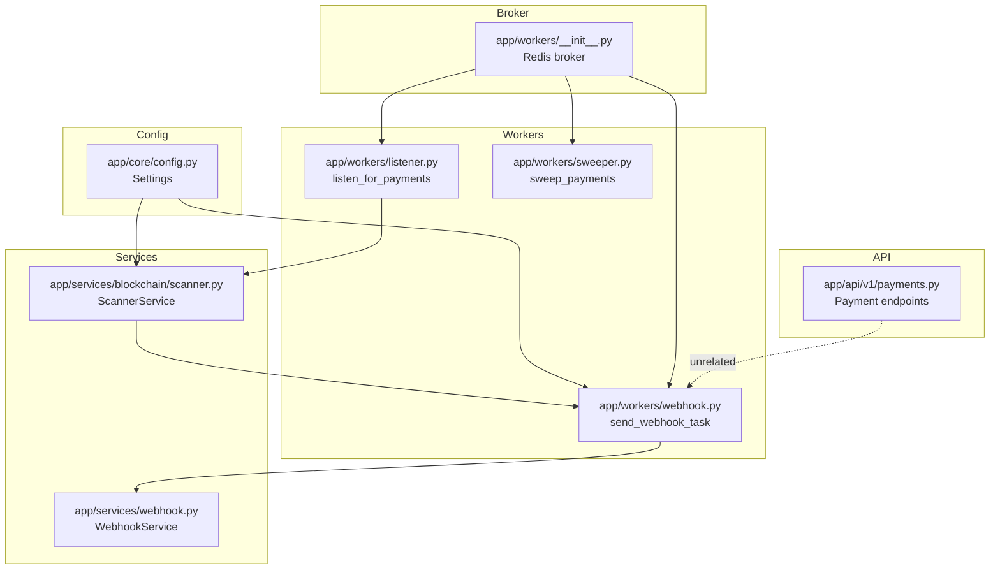
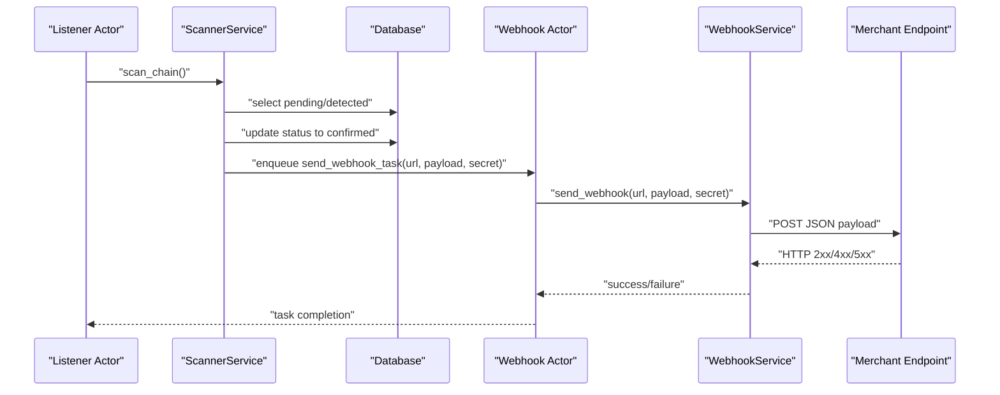
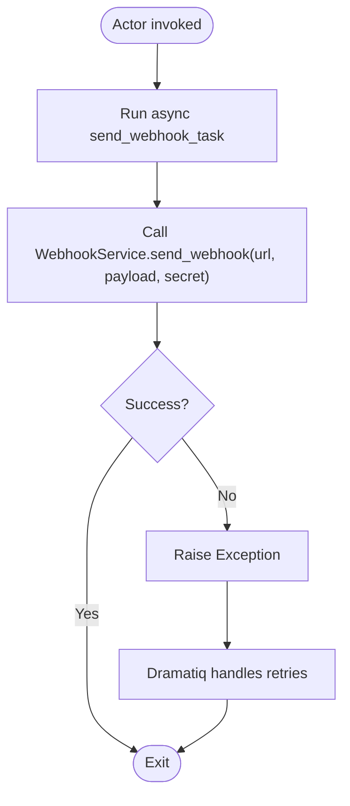
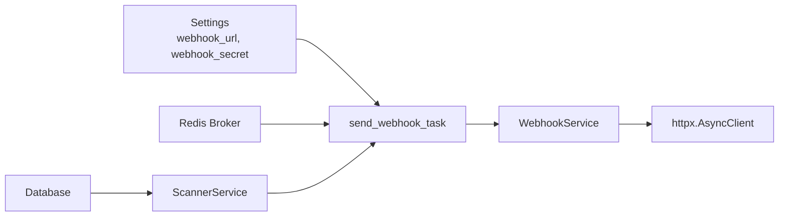

# Webhook Worker

<cite>
**Referenced Files in This Document**
- [webhook.py](https://github.com/rakibhossain72/ctrip/blob/main/app/workers/webhook.py)
- [webhook.py](https://github.com/rakibhossain72/ctrip/blob/main/app/services/webhook.py)
- [scanner.py](https://github.com/rakibhossain72/ctrip/blob/main/app/services/blockchain/scanner.py)
- [config.py](https://github.com/rakibhossain72/ctrip/blob/main/app/core/config.py)
- [__init__.py](https://github.com/rakibhossain72/ctrip/blob/main/app/workers/__init__.py)
- [listener.py](https://github.com/rakibhossain72/ctrip/blob/main/app/workers/listener.py)
- [sweeper.py](https://github.com/rakibhossain72/ctrip/blob/main/app/workers/sweeper.py)
- [payment.py](https://github.com/rakibhossain72/ctrip/blob/main/app/api/v1/payments.py)
- [README.md](https://github.com/rakibhossain72/ctrip/blob/main/README.md)
</cite>

## Table of Contents
1. [Introduction](#introduction)
2. [Project Structure](#project-structure)
3. [Core Components](#core-components)
4. [Architecture Overview](#architecture-overview)
5. [Detailed Component Analysis](#detailed-component-analysis)
6. [Dependency Analysis](#dependency-analysis)
7. [Performance Considerations](#performance-considerations)
8. [Troubleshooting Guide](#troubleshooting-guide)
9. [Conclusion](#conclusion)
10. [Appendices](#appendices)

## Introduction
This document describes the Webhook Worker responsible for delivering payment status notifications in the cTrip Payment Gateway. It explains how the worker sends webhook callbacks to merchant endpoints, how payloads are formatted and signed, and how delivery outcomes are handled. It also documents retry behavior, signature verification, security measures, filtering and categorization of events, batch processing, authentication, rate limiting, endpoint validation, monitoring, resubmission workflows, and manual intervention procedures.

## Project Structure
The webhook system spans several modules:
- Workers: background task actors powered by Dramatiq and Redis
- Services: core logic for sending webhooks and blockchain scanning
- Configuration: global settings for webhook URL and secret
- API: payment creation endpoints (unrelated to webhook delivery)
- Listener and Sweeper: periodic workers that drive scanning and sweeping

**Diagram sources**
- [webhook.py](https://github.com/rakibhossain72/ctrip/blob/main/app/workers/webhook.py#L1-L37)
- [webhook.py](https://github.com/rakibhossain72/ctrip/blob/main/app/services/webhook.py#L1-L45)
- [scanner.py](https://github.com/rakibhossain72/ctrip/blob/main/app/services/blockchain/scanner.py#L1-L134)
- [config.py](https://github.com/rakibhossain72/ctrip/blob/main/app/core/config.py#L1-L126)
- [__init__.py](https://github.com/rakibhossain72/ctrip/blob/main/app/workers/__init__.py#L1-L8)
- [listener.py](https://github.com/rakibhossain72/ctrip/blob/main/app/workers/listener.py#L1-L46)
- [sweeper.py](https://github.com/rakibhossain72/ctrip/blob/main/app/workers/sweeper.py#L1-L40)
- [payment.py](https://github.com/rakibhossain72/ctrip/blob/main/app/api/v1/payments.py#L1-L62)

**Section sources**
- [README.md](https://github.com/rakibhossain72/ctrip/blob/main/README.md#L71-L78)
- [__init__.py](https://github.com/rakibhossain72/ctrip/blob/main/app/workers/__init__.py#L1-L8)

## Core Components
- Webhook Actor: a Dramatiq actor that sends webhooks asynchronously and participates in the retry mechanism.
- Webhook Service: encapsulates HTTP posting, JSON serialization, optional HMAC-SHA256 signing, and logging.
- Scanner Service: detects and confirms payments, then triggers webhook delivery via the actor.
- Configuration: exposes webhook_url and webhook_secret used by the actor and service.
- Broker Initialization: wires Redis as the Dramatiq broker for reliable task delivery.

Key responsibilities:
- Asynchronous webhook delivery with structured logging
- Optional payload signing for authenticity verification
- Retry handling via Dramatiq’s built-in retry policy
- Event categorization by payment status transitions
- Batch processing through periodic scanning and confirmation cycles

**Section sources**
- [webhook.py](https://github.com/rakibhossain72/ctrip/blob/main/app/workers/webhook.py#L13-L37)
- [webhook.py](https://github.com/rakibhossain72/ctrip/blob/main/app/services/webhook.py#L10-L45)
- [scanner.py](https://github.com/rakibhossain72/ctrip/blob/main/app/services/blockchain/scanner.py#L97-L134)
- [config.py](https://github.com/rakibhossain72/ctrip/blob/main/app/core/config.py#L63-L71)
- [__init__.py](https://github.com/rakibhossain72/ctrip/blob/main/app/workers/__init__.py#L6-L7)

## Architecture Overview
The webhook delivery pipeline is event-driven and asynchronous:
- Listener periodically scans for detected payments and confirms them
- On confirmation, the system constructs a webhook payload and enqueues a task
- The Webhook Actor executes the task, signs the payload if configured, and posts to the merchant endpoint
- Delivery outcomes are logged; failures trigger Dramatiq retries

**Diagram sources**
- [listener.py](https://github.com/rakibhossain72/ctrip/blob/main/app/workers/listener.py#L21-L46)
- [scanner.py](https://github.com/rakibhossain72/ctrip/blob/main/app/services/blockchain/scanner.py#L97-L134)
- [webhook.py](https://github.com/rakibhossain72/ctrip/blob/main/app/workers/webhook.py#L13-L37)
- [webhook.py](https://github.com/rakibhossain72/ctrip/blob/main/app/services/webhook.py#L10-L45)

## Detailed Component Analysis

### Webhook Actor
The Webhook Actor wraps the asynchronous sending logic and integrates with Dramatiq’s retry mechanism. It:
- Receives the merchant URL, payload, and optional secret
- Runs an internal async loop to call the Webhook Service
- Raises exceptions on failure to trigger retries
- Logs errors and forwards them to Dramatiq

**Diagram sources**
- [webhook.py](https://github.com/rakibhossain72/ctrip/blob/main/app/workers/webhook.py#L13-L37)
- [webhook.py](https://github.com/rakibhossain72/ctrip/blob/main/app/services/webhook.py#L10-L45)

**Section sources**
- [webhook.py](https://github.com/rakibhossain72/ctrip/blob/main/app/workers/webhook.py#L13-L37)

### Webhook Service
The Webhook Service performs:
- JSON serialization of the payload
- Optional HMAC-SHA256 signing with a shared secret
- HTTP POST using an async client with a fixed timeout
- Structured logging for successes and failures
- Returning a boolean outcome for the caller

Security and formatting:
- Content-Type header set to application/json
- Signature header name is standardized for merchant verification
- Timeout configured to bound network latency

**Section sources**
- [webhook.py](https://github.com/rakibhossain72/ctrip/blob/main/app/services/webhook.py#L10-L45)

### Payload Structure and Event Categorization
The payload delivered upon confirmation includes:
- payment_id: unique identifier
- status: current status (confirmed)
- address: destination address
- amount: payment amount (as string)
- chain: blockchain identifier
- token_id: associated token identifier if applicable

Event categorization:
- Payments move from pending to detected to confirmed during lifecycle
- Webhooks are triggered only on confirmation transitions
- Filtering occurs implicitly by selecting only confirmed payments

**Section sources**
- [scanner.py](https://github.com/rakibhossain72/ctrip/blob/main/app/services/blockchain/scanner.py#L117-L131)

### Retry Logic and Exponential Backoff
- The actor is configured with a finite number of retries
- On failure, the actor raises an exception to signal failure to Dramatiq
- Dramatiq’s default retry policy applies; explicit exponential backoff is not implemented in code
- Consider adding jitter and backoff configuration for production hardening

**Section sources**
- [webhook.py](https://github.com/rakibhossain72/ctrip/blob/main/app/workers/webhook.py#L13-L13)

### Dead Letter Queue (DLQ) Handling
- The code does not configure a DLQ for failed tasks
- Failed tasks remain in the queue until max_retries is exhausted
- Production deployments should consider configuring a DLQ for failed messages

**Section sources**
- [webhook.py](https://github.com/rakibhossain72/ctrip/blob/main/app/workers/webhook.py#L13-L37)

### Signature Verification and Security Measures
- The service optionally signs payloads using HMAC-SHA256 with a shared secret
- The header name for signatures is standardized for merchant-side verification
- Merchant endpoints should verify the signature using the same algorithm and shared secret
- Additional security measures:
  - Enforce HTTPS endpoints
  - Rotate secrets periodically
  - Limit exposed fields in payloads
  - Validate endpoint URLs before enqueueing tasks

**Section sources**
- [webhook.py](https://github.com/rakibhossain72/ctrip/blob/main/app/services/webchain/webhook.py#L25-L31)
- [config.py](https://github.com/rakibhossain72/ctrip/blob/main/app/core/config.py#L63-L71)

### Authentication Methods
- Shared secret-based HMAC signature for payload integrity
- Optional endpoint authentication can be implemented by merchants using the provided signature
- No built-in HTTP authentication (e.g., Basic/Digest) in the worker

**Section sources**
- [webhook.py](https://github.com/rakibhossain72/ctrip/blob/main/app/services/webhook.py#L25-L31)

### Rate Limiting and Endpoint Validation
- Built-in rate limiting is not implemented in the worker
- The service sets a fixed timeout to avoid long blocking
- Endpoint validation:
  - Verify webhook_url and webhook_secret are present before triggering tasks
  - Consider validating endpoint reachability or using circuit breaker patterns at the service level

**Section sources**
- [config.py](https://github.com/rakibhossain72/ctrip/blob/main/app/core/config.py#L63-L71)
- [webhook.py](https://github.com/rakibhossain72/ctrip/blob/main/app/services/webhook.py#L33-L35)

### Monitoring and Observability
- Logging is used for success and failure events
- Recommendations:
  - Add metrics for delivery success rate, latency, and retry counts
  - Instrument the actor and service with counters and histograms
  - Correlate logs with payment_id for traceability
  - Monitor queue depth and backlog

**Section sources**
- [webhook.py](https://github.com/rakibhossain72/ctrip/blob/main/app/services/webhook.py#L36-L42)

### Resubmission Workflows and Manual Intervention
- Resubmission:
  - Re-enqueue tasks for specific payment_id/status combinations
  - Use administrative endpoints or scripts to trigger resubmissions
- Manual intervention:
  - Inspect logs and database state
  - Manually post payloads to endpoints for testing
  - Adjust configuration (URL/secret) and restart workers if needed

[No sources needed since this section provides general guidance]

## Dependency Analysis
The webhook system depends on:
- Dramatiq with Redis for task queuing and retries
- Async HTTP client for outbound requests
- Configuration for webhook URL and secret
- Database for payment state transitions

**Diagram sources**
- [config.py](https://github.com/rakibhossain72/ctrip/blob/main/app/core/config.py#L63-L71)
- [webhook.py](https://github.com/rakibhossain72/ctrip/blob/main/app/workers/webhook.py#L13-L37)
- [webhook.py](https://github.com/rakibhossain72/ctrip/blob/main/app/services/webhook.py#L10-L45)
- [__init__.py](https://github.com/rakibhossain72/ctrip/blob/main/app/workers/__init__.py#L6-L7)
- [scanner.py](https://github.com/rakibhossain72/ctrip/blob/main/app/services/blockchain/scanner.py#L97-L134)

**Section sources**
- [config.py](https://github.com/rakibhossain72/ctrip/blob/main/app/core/config.py#L63-L71)
- [__init__.py](https://github.com/rakibhossain72/ctrip/blob/main/app/workers/__init__.py#L6-L7)

## Performance Considerations
- Asynchronous I/O reduces blocking during outbound HTTP calls
- Fixed timeout prevents long-tail latency issues
- Consider:
  - Configurable timeouts and retry backoff
  - Connection pooling and keep-alive
  - Batching multiple webhooks per payment if appropriate
  - Circuit breakers to protect downstream endpoints

[No sources needed since this section provides general guidance]

## Troubleshooting Guide
Common issues and resolutions:
- Webhook delivery fails:
  - Check merchant endpoint availability and TLS configuration
  - Verify webhook_url and webhook_secret in settings
  - Review logs for HTTP status and exceptions
- Signature mismatch:
  - Confirm the merchant endpoint uses HMAC-SHA256 with the correct secret
  - Ensure payload serialization matches exactly (order, encoding)
- Retries exhausted:
  - Inspect task queue backlog and broker connectivity
  - Consider increasing max_retries or implementing exponential backoff
- Endpoint validation:
  - Validate URLs before enqueueing tasks
  - Use health checks for endpoints

**Section sources**
- [webhook.py](https://github.com/rakibhossain72/ctrip/blob/main/app/services/webhook.py#L39-L44)
- [webhook.py](https://github.com/rakibhossain72/ctrip/blob/main/app/workers/webhook.py#L34-L36)
- [config.py](https://github.com/rakibhossain72/ctrip/blob/main/app/core/config.py#L63-L71)

## Conclusion
The Webhook Worker provides a robust, asynchronous delivery mechanism for payment status notifications. It leverages Dramatiq for reliability, supports optional payload signing for security, and integrates cleanly with the payment confirmation pipeline. Production deployments should consider adding configurable retry backoff, DLQ handling, rate limiting, and comprehensive observability to ensure high delivery success rates and operability.

## Appendices

### Webhook Payload Reference
- Fields: payment_id, status, address, amount, chain, token_id (optional)
- Content-Type: application/json
- Signature header (when secret configured): standardized name for HMAC-SHA256

**Section sources**
- [scanner.py](https://github.com/rakibhossain72/ctrip/blob/main/app/services/blockchain/scanner.py#L117-L131)
- [webhook.py](https://github.com/rakibhossain72/ctrip/blob/main/app/services/webhook.py#L22-L31)

### Running Workers
- Start the Dramatiq workers to process webhook tasks alongside listener and sweeper.

**Section sources**
- [README.md](https://github.com/rakibhossain72/ctrip/blob/main/README.md#L66-L69)