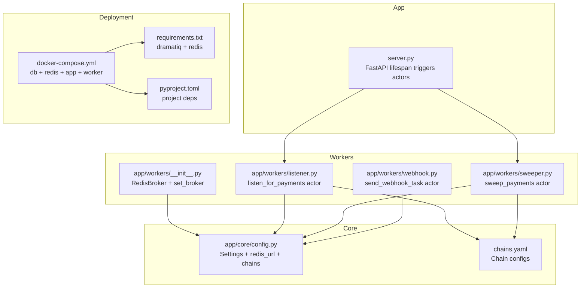
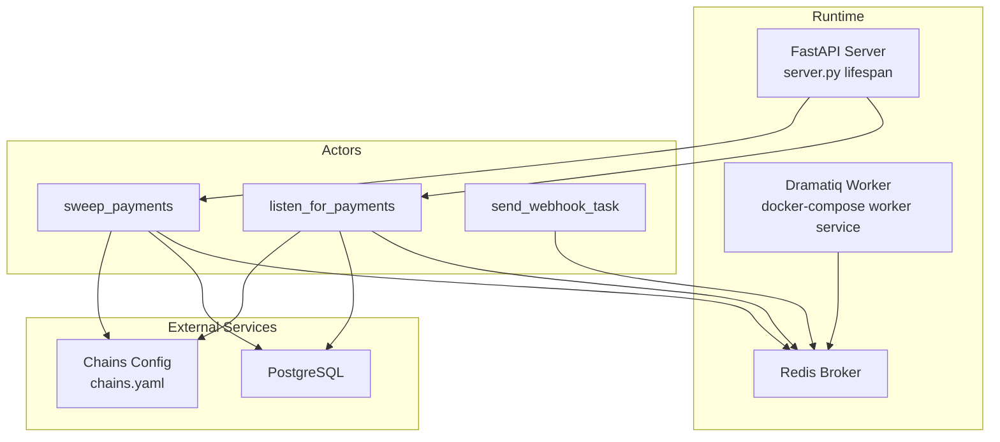
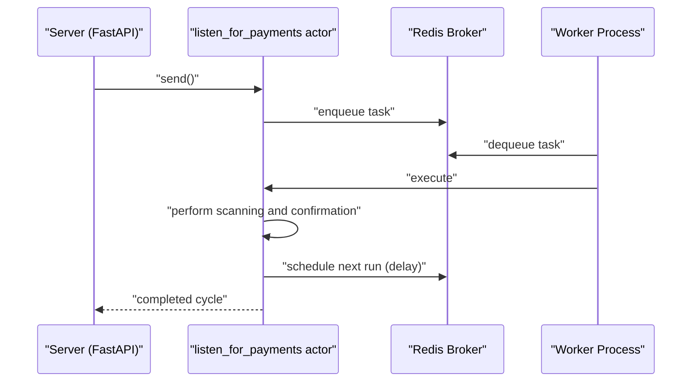
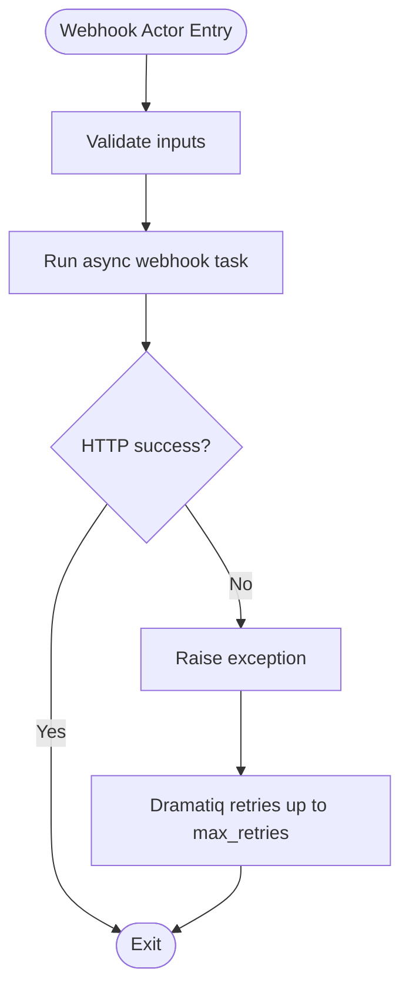
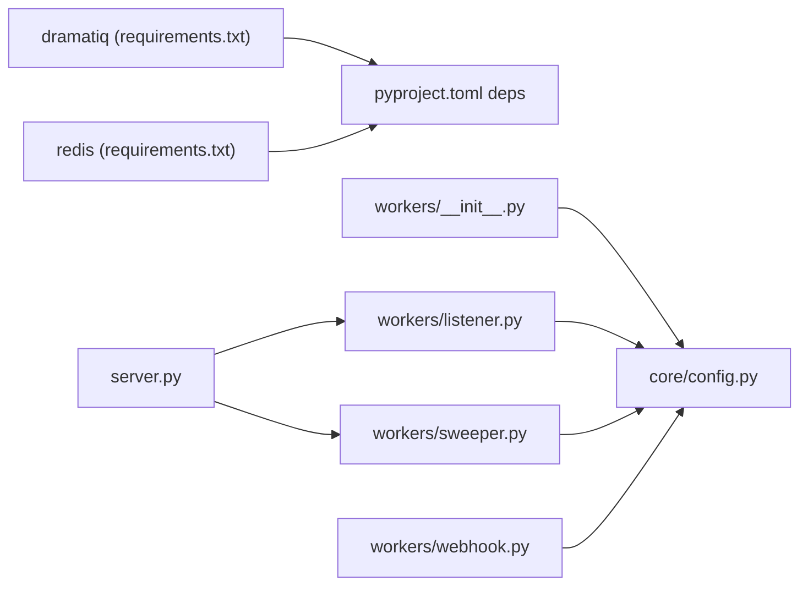

# Worker Architecture

<cite>
**Referenced Files in This Document**
- [app/workers/__init__.py](https://github.com/rakibhossain72/ctrip/blob/main/app/workers/__init__.py)
- [app/workers/listener.py](https://github.com/rakibhossain72/ctrip/blob/main/app/workers/listener.py)
- [app/workers/sweeper.py](https://github.com/rakibhossain72/ctrip/blob/main/app/workers/sweeper.py)
- [app/workers/webhook.py](https://github.com/rakibhossain72/ctrip/blob/main/app/workers/webhook.py)
- [app/core/config.py](https://github.com/rakibhossain72/ctrip/blob/main/app/core/config.py)
- [docker-compose.yml](https://github.com/rakibhossain72/ctrip/blob/main/docker-compose.yml)
- [pyproject.toml](https://github.com/rakibhossain72/ctrip/blob/main/pyproject.toml)
- [requirements.txt](https://github.com/rakibhossain72/ctrip/blob/main/requirements.txt)
- [server.py](https://github.com/rakibhossain72/ctrip/blob/main/server.py)
- [app/blockchain/manager.py](https://github.com/rakibhossain72/ctrip/blob/main/app/blockchain/manager.py)
- [app/services/webhook.py](https://github.com/rakibhossain72/ctrip/blob/main/app/services/webhook.py)
- [chains.yaml](https://github.com/rakibhossain72/ctrip/blob/main/chains.yaml)
</cite>

## Table of Contents
1. [Introduction](#introduction)
2. [Project Structure](#project-structure)
3. [Core Components](#core-components)
4. [Architecture Overview](#architecture-overview)
5. [Detailed Component Analysis](#detailed-component-analysis)
6. [Dependency Analysis](#dependency-analysis)
7. [Performance Considerations](#performance-considerations)
8. [Troubleshooting Guide](#troubleshooting-guide)
9. [Conclusion](#conclusion)
10. [Appendices](#appendices)

## Introduction
This document describes the Dramatiq worker architecture used in the cTrip Payment Gateway. It covers Redis broker configuration, worker initialization, message queue setup, actor definitions, task routing, lifecycle management, health monitoring, deployment patterns, isolation, and performance optimization. The system integrates Dramatiq actors with Redis for asynchronous task execution, orchestrated by a dedicated worker process launched via Docker Compose.

## Project Structure
The worker architecture spans several modules:
- Workers: Redis broker initialization and three actors for payment listening, sweeping, and webhook dispatch.
- Core configuration: Centralized settings including Redis URL, chains configuration, and secrets.
- Application entrypoint: FastAPI server that triggers recurring tasks via Dramatiq.
- Deployment: Docker Compose defines the database, Redis, API server, and worker service.

**Diagram sources**
- [app/workers/__init__.py](https://github.com/rakibhossain72/ctrip/blob/main/app/workers/__init__.py#L1-L8)
- [app/workers/listener.py](https://github.com/rakibhossain72/ctrip/blob/main/app/workers/listener.py#L1-L46)
- [app/workers/sweeper.py](https://github.com/rakibhossain72/ctrip/blob/main/app/workers/sweeper.py#L1-L40)
- [app/workers/webhook.py](https://github.com/rakibhossain72/ctrip/blob/main/app/workers/webhook.py#L1-L37)
- [app/core/config.py](https://github.com/rakibhossain72/ctrip/blob/main/app/core/config.py#L1-L126)
- [chains.yaml](https://github.com/rakibhossain72/ctrip/blob/main/chains.yaml#L1-L24)
- [server.py](https://github.com/rakibhossain72/ctrip/blob/main/server.py#L1-L56)
- [docker-compose.yml](https://github.com/rakibhossain72/ctrip/blob/main/docker-compose.yml#L1-L54)
- [requirements.txt](https://github.com/rakibhossain72/ctrip/blob/main/requirements.txt#L1-L106)
- [pyproject.toml](https://github.com/rakibhossain72/ctrip/blob/main/pyproject.toml#L1-L59)

**Section sources**
- [app/workers/__init__.py](https://github.com/rakibhossain72/ctrip/blob/main/app/workers/__init__.py#L1-L8)
- [app/core/config.py](https://github.com/rakibhossain72/ctrip/blob/main/app/core/config.py#L1-L126)
- [server.py](https://github.com/rakibhossain72/ctrip/blob/main/server.py#L1-L56)
- [docker-compose.yml](https://github.com/rakibhossain72/ctrip/blob/main/docker-compose.yml#L1-L54)

## Core Components
- Redis broker initialization: Creates a Redis-backed Dramatiq broker and sets it globally.
- Actors:
  - listen_for_payments: Scans chains and confirms payments, reschedules itself periodically.
  - sweep_payments: Sweeps confirmed payments per chain, reschedules itself periodically.
  - send_webhook_task: Sends webhooks asynchronously with retry support.
- Configuration:
  - redis_url: Used to connect to Redis.
  - chains: Loads chain configurations from chains.yaml for runtime chain enumeration.
- Server lifecycle: On startup, triggers both recurring actors to begin work.

Key implementation references:
- Broker setup and global broker assignment
- Actor definitions and scheduling
- Chain configuration loading
- Server-triggered actor invocation

**Section sources**
- [app/workers/__init__.py](https://github.com/rakibhossain72/ctrip/blob/main/app/workers/__init__.py#L1-L8)
- [app/workers/listener.py](https://github.com/rakibhossain72/ctrip/blob/main/app/workers/listener.py#L1-L46)
- [app/workers/sweeper.py](https://github.com/rakibhossain72/ctrip/blob/main/app/workers/sweeper.py#L1-L40)
- [app/workers/webhook.py](https://github.com/rakibhossain72/ctrip/blob/main/app/workers/webhook.py#L1-L37)
- [app/core/config.py](https://github.com/rakibhossain72/ctrip/blob/main/app/core/config.py#L34-L56)
- [chains.yaml](https://github.com/rakibhossain72/ctrip/blob/main/chains.yaml#L1-L24)
- [server.py](https://github.com/rakibhossain72/ctrip/blob/main/server.py#L36-L41)

## Architecture Overview
The Dramatiq worker architecture uses a single Redis broker shared by the application and worker processes. The server initializes the broker and triggers recurring actors on startup. Workers consume messages from Redis queues and execute actor functions. Webhooks are dispatched asynchronously with retries.

**Diagram sources**
- [app/workers/__init__.py](https://github.com/rakibhossain72/ctrip/blob/main/app/workers/__init__.py#L6-L7)
- [server.py](https://github.com/rakibhossain72/ctrip/blob/main/server.py#L36-L41)
- [docker-compose.yml](https://github.com/rakibhossain72/ctrip/blob/main/docker-compose.yml#L37-L50)
- [app/workers/listener.py](https://github.com/rakibhossain72/ctrip/blob/main/app/workers/listener.py#L21-L46)
- [app/workers/sweeper.py](https://github.com/rakibhossain72/ctrip/blob/main/app/workers/sweeper.py#L19-L40)
- [app/workers/webhook.py](https://github.com/rakibhossain72/ctrip/blob/main/app/workers/webhook.py#L13-L37)
- [chains.yaml](https://github.com/rakibhossain72/ctrip/blob/main/chains.yaml#L1-L24)

## Detailed Component Analysis

### Redis Broker Configuration and Initialization
- The broker is instantiated using the Redis URL from settings and set globally for Dramatiq.
- This ensures all actors enqueue and dequeue messages against the same Redis instance.

Implementation highlights:
- Broker creation from settings.redis_url
- Global broker assignment for the process

**Section sources**
- [app/workers/__init__.py](https://github.com/rakibhossain72/ctrip/blob/main/app/workers/__init__.py#L6-L7)
- [app/core/config.py](https://github.com/rakibhossain72/ctrip/blob/main/app/core/config.py#L34-L37)

### Worker Initialization Patterns
- The worker process is started via the Docker Compose command that invokes Dramatiq with module paths for each actor module.
- This pattern loads the modules and registers their actors with the global Redis broker.

Operational flow:
- Docker Compose builds the image and runs the worker command.
- Dramatiq loads the modules and registers actors.
- Workers consume tasks from Redis queues.

**Section sources**
- [docker-compose.yml](https://github.com/rakibhossain72/ctrip/blob/main/docker-compose.yml#L37-L50)
- [pyproject.toml](https://github.com/rakibhossain72/ctrip/blob/main/pyproject.toml#L26-L27)

### Message Queue Setup and Task Routing
- Tasks are enqueued implicitly when actors are invoked (e.g., server triggers actors on startup).
- Actors schedule themselves for periodic execution using send_with_options(delay=...).
- Webhook actor uses a local event loop to run asynchronous tasks synchronously within the actor.

Routing characteristics:
- Single Redis broker routes tasks to worker processes.
- Actor names correspond to function names; Dramatiq uses these names for routing.

**Section sources**
- [server.py](https://github.com/rakibhossain72/ctrip/blob/main/server.py#L36-L41)
- [app/workers/listener.py](https://github.com/rakibhossain72/ctrip/blob/main/app/workers/listener.py#L42-L46)
- [app/workers/sweeper.py](https://github.com/rakibhossain72/ctrip/blob/main/app/workers/sweeper.py#L36-L40)
- [app/workers/webhook.py](https://github.com/rakibhossain72/ctrip/blob/main/app/workers/webhook.py#L10-L11)

### Actor Definitions and Execution Semantics
- listen_for_payments: Scans chains and confirms payments; schedules next run after completion.
- sweep_payments: Iterates chains and performs sweeping actions; schedules next run after completion.
- send_webhook_task: Sends webhooks asynchronously with retries; raises exceptions to trigger Dramatiq retries.

Execution patterns:
- Periodic rescheduling via send_with_options(delay=...)
- Asynchronous execution using asyncio loops within actors.

**Diagram sources**
- [server.py](https://github.com/rakibhossain72/ctrip/blob/main/server.py#L36-L41)
- [app/workers/listener.py](https://github.com/rakibhossain72/ctrip/blob/main/app/workers/listener.py#L21-L46)

**Section sources**
- [app/workers/listener.py](https://github.com/rakibhossain72/ctrip/blob/main/app/workers/listener.py#L1-L46)
- [app/workers/sweeper.py](https://github.com/rakibhossain72/ctrip/blob/main/app/workers/sweeper.py#L1-L40)
- [app/workers/webhook.py](https://github.com/rakibhossain72/ctrip/blob/main/app/workers/webhook.py#L1-L37)

### Chain Configuration and Runtime Behavior
- Chains are loaded from chains.yaml at runtime; if absent, defaults are applied.
- Actors iterate over configured chains to perform operations.

Behavioral notes:
- Empty chains fallback to a default chain.
- Chain-specific RPC endpoints are used by blockchain services.

**Section sources**
- [app/core/config.py](https://github.com/rakibhossain72/ctrip/blob/main/app/core/config.py#L44-L56)
- [chains.yaml](https://github.com/rakibhossain72/ctrip/blob/main/chains.yaml#L1-L24)
- [app/blockchain/manager.py](https://github.com/rakibhossain72/ctrip/blob/main/app/blockchain/manager.py#L8-L32)

### Webhook Actor and Retry Strategy
- The webhook actor runs on a dedicated event loop and raises exceptions to trigger Dramatiq retries.
- WebhookService signs payloads when a secret is provided and handles HTTP errors.

**Diagram sources**
- [app/workers/webhook.py](https://github.com/rakibhossain72/ctrip/blob/main/app/workers/webhook.py#L13-L37)
- [app/services/webhook.py](https://github.com/rakibhossain72/ctrip/blob/main/app/services/webhook.py#L10-L45)

**Section sources**
- [app/workers/webhook.py](https://github.com/rakibhossain72/ctrip/blob/main/app/workers/webhook.py#L1-L37)
- [app/services/webhook.py](https://github.com/rakibhossain72/ctrip/blob/main/app/services/webhook.py#L1-L45)

## Dependency Analysis
- Dramatiq and Redis are declared as dependencies in both requirements and pyproject.
- The worker initialization module depends on settings for Redis URL.
- Actors depend on settings for chain configuration and on external services for blockchain and webhook operations.
- The server depends on worker modules to trigger initial tasks.

**Diagram sources**
- [requirements.txt](https://github.com/rakibhossain72/ctrip/blob/main/requirements.txt#L24-L77)
- [pyproject.toml](https://github.com/rakibhossain72/ctrip/blob/main/pyproject.toml#L14-L32)
- [app/workers/__init__.py](https://github.com/rakibhossain72/ctrip/blob/main/app/workers/__init__.py#L1-L8)
- [app/core/config.py](https://github.com/rakibhossain72/ctrip/blob/main/app/core/config.py#L1-L126)
- [server.py](https://github.com/rakibhossain72/ctrip/blob/main/server.py#L1-L56)
- [app/workers/listener.py](https://github.com/rakibhossain72/ctrip/blob/main/app/workers/listener.py#L1-L46)
- [app/workers/sweeper.py](https://github.com/rakibhossain72/ctrip/blob/main/app/workers/sweeper.py#L1-L40)
- [app/workers/webhook.py](https://github.com/rakibhossain72/ctrip/blob/main/app/workers/webhook.py#L1-L37)

**Section sources**
- [requirements.txt](https://github.com/rakibhossain72/ctrip/blob/main/requirements.txt#L1-L106)
- [pyproject.toml](https://github.com/rakibhossain72/ctrip/blob/main/pyproject.toml#L1-L59)
- [app/workers/__init__.py](https://github.com/rakibhossain72/ctrip/blob/main/app/workers/__init__.py#L1-L8)
- [app/core/config.py](https://github.com/rakibhossain72/ctrip/blob/main/app/core/config.py#L1-L126)
- [server.py](https://github.com/rakibhossain72/ctrip/blob/main/server.py#L1-L56)

## Performance Considerations
- Event loop management: The webhook actor maintains a persistent event loop to avoid overhead from creating new loops per task.
- Time limits and retries: Actors define time limits and retry policies to bound execution and improve resilience.
- Periodic scheduling: Actors reschedule themselves after completing cycles; tune delays to balance throughput and resource usage.
- Redis connectivity: Ensure the Redis URL is reachable and optimized for latency; consider connection pooling and network topology.
- Chain enumeration: Limit the number of chains processed per cycle to reduce contention and improve responsiveness.

[No sources needed since this section provides general guidance]

## Troubleshooting Guide
Common issues and remedies:
- Redis connectivity failures: Verify REDIS_URL and network reachability; check Redis service status.
- Missing chains.yaml: If chains.yaml is missing or invalid, actors fall back to default chain behavior; ensure the file exists and is valid.
- Webhook failures: Inspect webhook actor logs and WebhookService error handling; verify signatures and timeouts.
- Actor not running: Confirm the worker service is started with the correct Dramatiq command and that modules are importable.
- Health checks: Use the /health endpoint to validate API availability.

**Section sources**
- [app/core/config.py](https://github.com/rakibhossain72/ctrip/blob/main/app/core/config.py#L44-L56)
- [app/services/webhook.py](https://github.com/rakibhossain72/ctrip/blob/main/app/services/webhook.py#L39-L44)
- [docker-compose.yml](https://github.com/rakibhossain72/ctrip/blob/main/docker-compose.yml#L37-L50)
- [app/api/health.py](https://github.com/rakibhossain72/ctrip/blob/main/app/api/health.py#L1-L7)

## Conclusion
The cTrip Payment Gateway employs a straightforward Dramatiq worker architecture centered on a Redis broker. Workers are deployed as a separate service and consume tasks enqueued by the FastAPI server. Actors encapsulate distinct responsibilities—payment scanning, sweeping, and webhook dispatch—with built-in scheduling and retry mechanisms. Configuration is centralized via settings and chains.yaml, enabling flexible chain support. The architecture supports horizontal scaling by running multiple worker instances against the same broker.

[No sources needed since this section summarizes without analyzing specific files]

## Appendices

### Configuration Options and Parameters
- Redis connectivity
  - redis_url: Connection string for Redis broker
- Broker parameters
  - Broker is initialized with the Redis URL; additional broker options can be passed during construction
- Worker pool sizing
  - Adjust the number of worker processes via Docker Compose replicas for concurrency
- Chain configuration
  - chains_yaml_path: Path to chains.yaml
  - chains: Loaded chain configurations for runtime iteration

**Section sources**
- [app/core/config.py](https://github.com/rakibhossain72/ctrip/blob/main/app/core/config.py#L34-L42)
- [chains.yaml](https://github.com/rakibhossain72/ctrip/blob/main/chains.yaml#L1-L24)
- [docker-compose.yml](https://github.com/rakibhossain72/ctrip/blob/main/docker-compose.yml#L37-L50)

### Deployment Patterns and Load Distribution
- Single Redis broker: All workers share the same broker for task distribution.
- Multiple worker instances: Scale horizontally by increasing worker replicas; tasks are distributed automatically.
- Isolation: Separate services for app and worker ensure process isolation; containers share the same Redis backend.

**Section sources**
- [docker-compose.yml](https://github.com/rakibhossain72/ctrip/blob/main/docker-compose.yml#L1-L54)