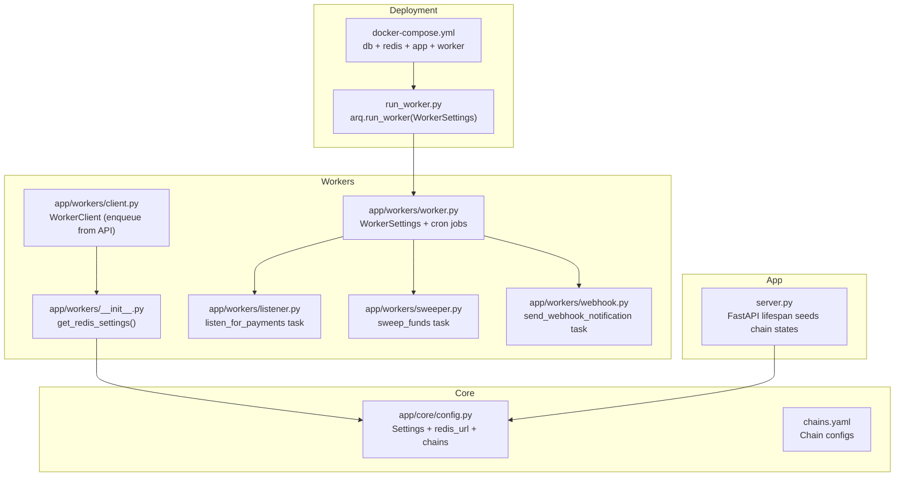
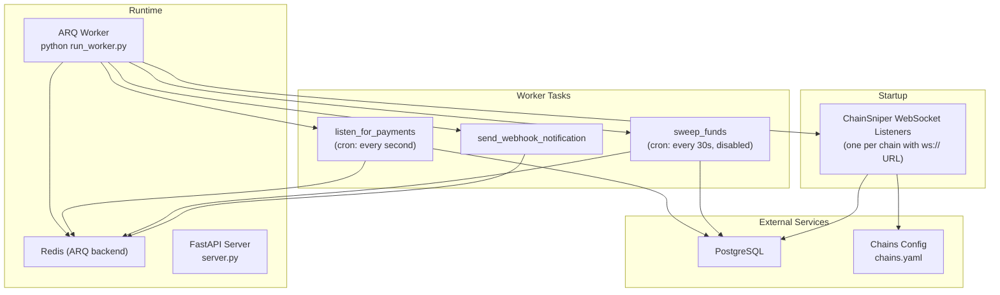
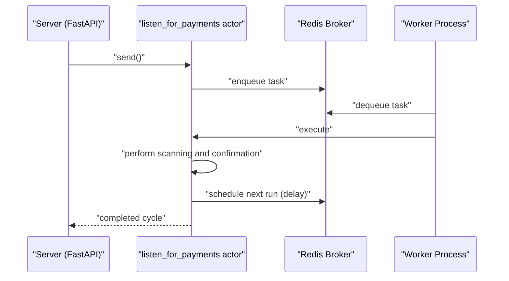
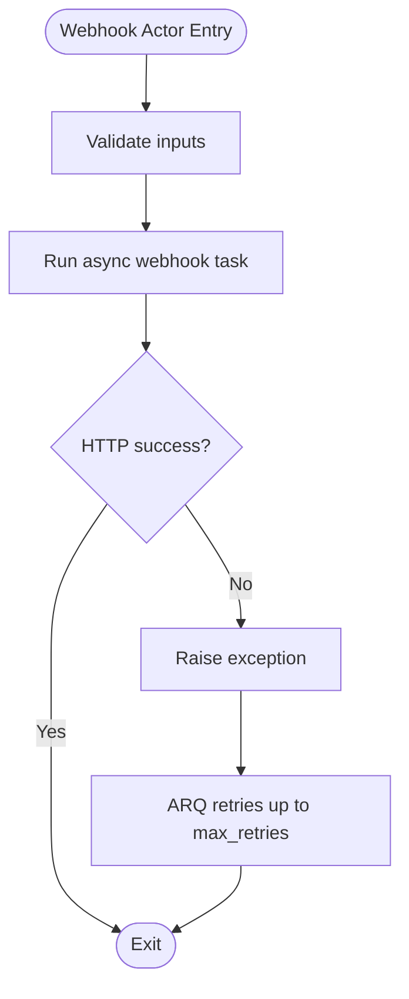
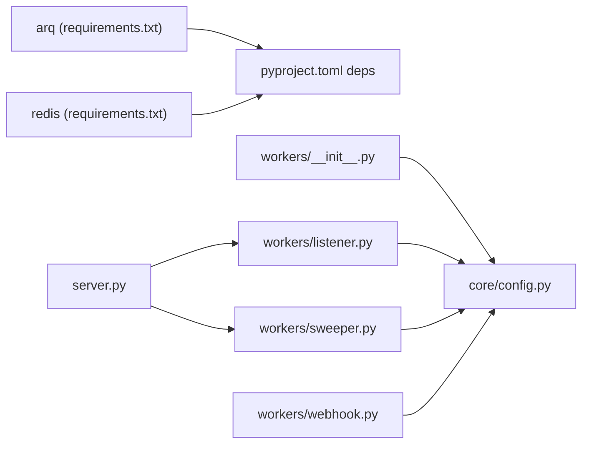

# Worker Architecture

<cite>
**Referenced Files in This Document**
- [app/workers/__init__.py](https://github.com/rakibhossain72/ctrip/blob/main/app/workers/__init__.py)
- [app/workers/listener.py](https://github.com/rakibhossain72/ctrip/blob/main/app/workers/listener.py)
- [app/workers/sweeper.py](https://github.com/rakibhossain72/ctrip/blob/main/app/workers/sweeper.py)
- [app/workers/webhook.py](https://github.com/rakibhossain72/ctrip/blob/main/app/workers/webhook.py)
- [app/core/config.py](https://github.com/rakibhossain72/ctrip/blob/main/app/core/config.py)
- [docker-compose.yml](https://github.com/rakibhossain72/ctrip/blob/main/docker-compose.yml)
- [pyproject.toml](https://github.com/rakibhossain72/ctrip/blob/main/pyproject.toml)
- [requirements.txt](https://github.com/rakibhossain72/ctrip/blob/main/requirements.txt)
- [server.py](https://github.com/rakibhossain72/ctrip/blob/main/server.py)
- [app/blockchain/manager.py](https://github.com/rakibhossain72/ctrip/blob/main/app/blockchain/manager.py)
- [app/services/webhook.py](https://github.com/rakibhossain72/ctrip/blob/main/app/services/webhook.py)
- [chains.yaml](https://github.com/rakibhossain72/ctrip/blob/main/chains.yaml)
</cite>

## Table of Contents
1. [Introduction](#introduction)
2. [Project Structure](#project-structure)
3. [Core Components](#core-components)
4. [Architecture Overview](#architecture-overview)
5. [Detailed Component Analysis](#detailed-component-analysis)
6. [Dependency Analysis](#dependency-analysis)
7. [Performance Considerations](#performance-considerations)
8. [Troubleshooting Guide](#troubleshooting-guide)
9. [Conclusion](#conclusion)
10. [Appendices](#appendices)

## Introduction
This document describes the ARQ worker architecture used in the cTrip Payment Gateway. It covers Redis connection configuration, worker initialization, task scheduling via ARQ cron jobs, lifecycle hooks, and the three main task modules: listener (confirmation/expiry), sweeper (fund settlement), and webhook dispatch. The system uses ARQ (async task queue) with Redis for background processing, orchestrated by a dedicated worker process launched via `python run_worker.py` or Docker Compose.

## Project Structure
The worker architecture spans several modules:
- Workers: ARQ `WorkerSettings`, Redis connection helpers, and task functions for payment confirmation, sweeping, and webhook dispatch.
- Core configuration: Centralized settings including Redis URL, chains configuration, and secrets.
- Application entrypoint: FastAPI server that seeds chain states on startup; workers run as a separate process.
- Deployment: Docker Compose defines the database, Redis, API server, and worker service.

```mermaid
graph TB
subgraph "Workers"
WInit["app/workers/__init__.py<br/>get_redis_settings()"]
WWorker["app/workers/worker.py<br/>WorkerSettings + cron jobs"]
WListener["app/workers/listener.py<br/>listen_for_payments task"]
WSweeper["app/workers/sweeper.py<br/>sweep_funds task"]
WWebhook["app/workers/webhook.py<br/>send_webhook_notification task"]
WClient["app/workers/client.py<br/>WorkerClient (enqueue from API)"]
end
subgraph "Core"
Cfg["app/core/config.py<br/>Settings + redis_url + chains"]
Chains["chains.yaml<br/>Chain configs"]
end
subgraph "App"
Srv["server.py<br/>FastAPI lifespan seeds chain states"]
end
subgraph "Deployment"
Dc["docker-compose.yml<br/>db + redis + app + worker"]
RunW["run_worker.py<br/>arq.run_worker(WorkerSettings)"]
end
WInit --> Cfg
WWorker --> WListener
WWorker --> WSweeper
WWorker --> WWebhook
WClient --> WInit
Srv --> Cfg
Dc --> RunW
RunW --> WWorker
```

**Diagram sources**
- [app/workers/__init__.py](https://github.com/rakibhossain72/ctrip/blob/main/app/workers/__init__.py#L1-L8)
- [app/workers/listener.py](https://github.com/rakibhossain72/ctrip/blob/main/app/workers/listener.py#L1-L46)
- [app/workers/sweeper.py](https://github.com/rakibhossain72/ctrip/blob/main/app/workers/sweeper.py#L1-L40)
- [app/workers/webhook.py](https://github.com/rakibhossain72/ctrip/blob/main/app/workers/webhook.py#L1-L37)
- [app/core/config.py](https://github.com/rakibhossain72/ctrip/blob/main/app/core/config.py#L1-L126)
- [chains.yaml](https://github.com/rakibhossain72/ctrip/blob/main/chains.yaml#L1-L24)
- [server.py](https://github.com/rakibhossain72/ctrip/blob/main/server.py#L1-L56)
- [docker-compose.yml](https://github.com/rakibhossain72/ctrip/blob/main/docker-compose.yml#L1-L54)
- [requirements.txt](https://github.com/rakibhossain72/ctrip/blob/main/requirements.txt#L1-L106)
- [pyproject.toml](https://github.com/rakibhossain72/ctrip/blob/main/pyproject.toml#L1-L59)

**Section sources**
- [app/workers/__init__.py](https://github.com/rakibhossain72/ctrip/blob/main/app/workers/__init__.py#L1-L8)
- [app/core/config.py](https://github.com/rakibhossain72/ctrip/blob/main/app/core/config.py#L1-L126)
- [server.py](https://github.com/rakibhossain72/ctrip/blob/main/server.py#L1-L56)
- [docker-compose.yml](https://github.com/rakibhossain72/ctrip/blob/main/docker-compose.yml#L1-L54)

## Core Components
- ARQ Redis connection: `get_redis_settings()` parses `REDIS_URL` and returns `RedisSettings` for ARQ.
- `WorkerSettings`: Defines all task functions, cron schedules, lifecycle hooks, and worker parameters.
- Tasks:
  - `listen_for_payments`: Cron task (every second) that confirms detected payments and expires stale ones. Block detection is handled by always-on ChainSniper WebSocket listeners.
  - `sweep_funds`: Cron task (every 30 seconds, currently commented out) that sweeps confirmed payments to the admin wallet.
  - `send_webhook_notification`: Task for sending webhook notifications for payment events.
  - `retry_failed_webhooks`: Cron task for retrying failed webhooks (placeholder).
  - `send_custom_webhook`: Task for sending custom webhooks.
- Lifecycle hooks:
  - `startup`: Launches ChainSniper WebSocket listeners via `ScannerService.start_listeners()`.
  - `shutdown`: Cancels running ChainSniper tasks.
- `WorkerClient`: Used by FastAPI admin endpoints to enqueue tasks on demand.

Key implementation references:
- ARQ `WorkerSettings` class in `app/workers/worker.py`
- Redis settings parsing in `app/workers/__init__.py`
- ChainSniper startup in `app/services/blockchain/scanner.py`

**Section sources**
- [app/workers/__init__.py](https://github.com/rakibhossain72/ctrip/blob/main/app/workers/__init__.py#L1-L8)
- [app/workers/listener.py](https://github.com/rakibhossain72/ctrip/blob/main/app/workers/listener.py#L1-L46)
- [app/workers/sweeper.py](https://github.com/rakibhossain72/ctrip/blob/main/app/workers/sweeper.py#L1-L40)
- [app/workers/webhook.py](https://github.com/rakibhossain72/ctrip/blob/main/app/workers/webhook.py#L1-L37)
- [app/core/config.py](https://github.com/rakibhossain72/ctrip/blob/main/app/core/config.py#L34-L56)
- [chains.yaml](https://github.com/rakibhossain72/ctrip/blob/main/chains.yaml#L1-L24)
- [server.py](https://github.com/rakibhossain72/ctrip/blob/main/server.py#L36-L41)

## Architecture Overview
The ARQ worker architecture uses Redis as the task queue backend. The worker process is started separately from the API and runs ARQ's event loop. On startup, it launches ChainSniper WebSocket listeners for real-time block detection. Cron jobs handle periodic confirmation checks, sweeping, and webhook retries.

```mermaid
graph TB
subgraph "Runtime"
Redis["Redis (ARQ backend)"]
API["FastAPI Server<br/>server.py"]
Worker["ARQ Worker<br/>python run_worker.py"]
end
subgraph "Worker Tasks"
LFP["listen_for_payments<br/>(cron: every second)"]
SWP["sweep_funds<br/>(cron: every 30s, disabled)"]
WHT["send_webhook_notification"]
end
subgraph "Startup"
Sniper["ChainSniper WebSocket Listeners<br/>(one per chain with ws:// URL)"]
end
subgraph "External Services"
DB["PostgreSQL"]
CHAINS["Chains Config<br/>chains.yaml"]
end
Worker --> Redis
Worker --> Sniper
LFP --> Redis
SWP --> Redis
WHT --> Redis
Worker --> LFP
Worker --> SWP
Worker --> WHT
LFP --> DB
SWP --> DB
Sniper --> DB
Sniper --> CHAINS
```

**Diagram sources**
- [app/workers/__init__.py](https://github.com/rakibhossain72/ctrip/blob/main/app/workers/__init__.py#L6-L7)
- [server.py](https://github.com/rakibhossain72/ctrip/blob/main/server.py#L36-L41)
- [docker-compose.yml](https://github.com/rakibhossain72/ctrip/blob/main/docker-compose.yml#L37-L50)
- [app/workers/listener.py](https://github.com/rakibhossain72/ctrip/blob/main/app/workers/listener.py#L21-L46)
- [app/workers/sweeper.py](https://github.com/rakibhossain72/ctrip/blob/main/app/workers/sweeper.py#L19-L40)
- [app/workers/webhook.py](https://github.com/rakibhossain72/ctrip/blob/main/app/workers/webhook.py#L13-L37)
- [chains.yaml](https://github.com/rakibhossain72/ctrip/blob/main/chains.yaml#L1-L24)

## Detailed Component Analysis

### ARQ Redis Connection and WorkerSettings
- `get_redis_settings()` in `app/workers/__init__.py` parses `REDIS_URL` and returns an ARQ `RedisSettings` object.
- `WorkerSettings` in `app/workers/worker.py` is the central ARQ configuration class defining:
  - `functions`: list of task functions available to the worker
  - `cron_jobs`: scheduled tasks using ARQ's `cron()` helper
  - `on_startup` / `on_shutdown`: lifecycle hooks
  - `redis_settings`: connection to Redis
  - `max_jobs`, `job_timeout`, `keep_result`, `max_tries`: operational parameters

### Worker Initialization and Startup
- The worker process is started via `python run_worker.py`, which calls `arq.run_worker(WorkerSettings)`.
- In Docker Compose, the `worker` service runs `python run_worker.py`.
- On startup, the `startup` hook calls `ScannerService.start_listeners()` which launches one ChainSniper WebSocket listener per chain that has a `ws://` or `wss://` RPC URL.
- References to running tasks are stored in `_sniper_tasks` to prevent garbage collection.

Operational flow:
- Docker Compose builds the image and runs `python run_worker.py`.
- ARQ loads `WorkerSettings`, connects to Redis, and starts the event loop.
- `startup` hook fires, launching ChainSniper listeners.
- Cron jobs begin executing on their schedules.

### Task Scheduling and Cron Jobs
- ARQ uses `cron()` to schedule tasks at specific second/minute intervals.
- `listen_for_payments` runs every second (`second=set(range(60))`).
- `sweep_funds` is defined but commented out in the current `WorkerSettings`.
- Tasks are enqueued by ARQ's scheduler and consumed by the same worker process.

### Payment Detection vs Confirmation Split
- **Detection** (real-time): ChainSniper WebSocket listeners call `ScannerService._on_block()` and `ScannerService._on_log()` for every new block/log. These update payment status to `DETECTED` immediately.
- **Confirmation** (cron): `listen_for_payments` calls `ScannerService.confirm_payments()` every second to promote `DETECTED` payments to `CONFIRMED` once enough blocks have passed.
- **Expiry** (cron): `listen_for_payments` also calls `ScannerService.check_expired_payments()` to mark stale payments as `EXPIRED`.

### Admin API and WorkerClient
- `app/workers/client.py` provides `WorkerClient`, which uses `arq.create_pool()` to enqueue tasks from FastAPI endpoints.
- `app/api/admin.py` exposes `/admin/*` endpoints for manual task triggering:
  - `POST /admin/scan-now` — triggers `listen_for_payments`
  - `POST /admin/sweep-now` — triggers `sweep_funds`
  - `POST /admin/sweep-address` — triggers `sweep_specific_address`
  - `POST /admin/process-payment` — triggers `process_single_payment`
  - `POST /admin/send-webhook` — triggers `send_webhook_notification`
  - `POST /admin/custom-webhook` — triggers `send_custom_webhook`
- listen_for_payments: Scans chains and confirms payments; schedules next run after completion.
- sweep_funds: Iterates chains and performs sweeping actions; schedules next run after completion.
- send_webhook_task: Sends webhooks asynchronously with retries; raises exceptions to trigger ARQ retries.

Execution patterns:
- Periodic rescheduling via send_with_options(delay=...)
- Asynchronous execution using asyncio loops within actors.

```mermaid
sequenceDiagram
participant S as "Server (FastAPI)"
participant L as "listen_for_payments actor"
participant R as "Redis Broker"
participant W as "Worker Process"
S->>L : "send()"
L->>R : "enqueue task"
W->>R : "dequeue task"
W->>L : "execute"
L->>L : "perform scanning and confirmation"
L->>R : "schedule next run (delay)"
L-->>S : "completed cycle"
```

**Diagram sources**
- [server.py](https://github.com/rakibhossain72/ctrip/blob/main/server.py#L36-L41)
- [app/workers/listener.py](https://github.com/rakibhossain72/ctrip/blob/main/app/workers/listener.py#L21-L46)

**Section sources**
- [app/workers/listener.py](https://github.com/rakibhossain72/ctrip/blob/main/app/workers/listener.py#L1-L46)
- [app/workers/sweeper.py](https://github.com/rakibhossain72/ctrip/blob/main/app/workers/sweeper.py#L1-L40)
- [app/workers/webhook.py](https://github.com/rakibhossain72/ctrip/blob/main/app/workers/webhook.py#L1-L37)

### Chain Configuration and Runtime Behavior
- Chains are loaded from chains.yaml at runtime; if absent, defaults are applied.
- Actors iterate over configured chains to perform operations.

Behavioral notes:
- Empty chains fallback to a default chain.
- Chain-specific RPC endpoints are used by blockchain services.

**Section sources**
- [app/core/config.py](https://github.com/rakibhossain72/ctrip/blob/main/app/core/config.py#L44-L56)
- [chains.yaml](https://github.com/rakibhossain72/ctrip/blob/main/chains.yaml#L1-L24)
- [app/blockchain/manager.py](https://github.com/rakibhossain72/ctrip/blob/main/app/blockchain/manager.py#L8-L32)

### Webhook Actor and Retry Strategy
- The webhook actor runs on a dedicated event loop and raises exceptions to trigger ARQ retries.
- WebhookService signs payloads when a secret is provided and handles HTTP errors.

```mermaid
flowchart TD
Start(["Webhook Actor Entry"]) --> Validate["Validate inputs"]
Validate --> RunTask["Run async webhook task"]
RunTask --> Success{"HTTP success?"}
Success --> |Yes| Done(["Exit"])
Success --> |No| RaiseErr["Raise exception"]
RaiseErr --> Retry["ARQ retries up to max_retries"]
Retry --> Done
```

**Diagram sources**
- [app/workers/webhook.py](https://github.com/rakibhossain72/ctrip/blob/main/app/workers/webhook.py#L13-L37)
- [app/services/webhook.py](https://github.com/rakibhossain72/ctrip/blob/main/app/services/webhook.py#L10-L45)

**Section sources**
- [app/workers/webhook.py](https://github.com/rakibhossain72/ctrip/blob/main/app/workers/webhook.py#L1-L37)
- [app/services/webhook.py](https://github.com/rakibhossain72/ctrip/blob/main/app/services/webhook.py#L1-L45)

## Dependency Analysis
- ARQ and Redis are declared as dependencies in both requirements and pyproject.
- The worker initialization module depends on settings for Redis URL.
- Actors depend on settings for chain configuration and on external services for blockchain and webhook operations.
- The server depends on worker modules to trigger initial tasks.

```mermaid
graph LR
ARQ["arq (requirements.txt)"]
RedisDep["redis (requirements.txt)"]
PjDeps["pyproject.toml deps"]
WInit["workers/__init__.py"]
Cfg["core/config.py"]
Srv["server.py"]
WList["workers/listener.py"]
WSwp["workers/sweeper.py"]
WWeb["workers/webhook.py"]
ARQ --> PjDeps
RedisDep --> PjDeps
WInit --> Cfg
Srv --> WList
Srv --> WSwp
WList --> Cfg
WSwp --> Cfg
WWeb --> Cfg
```

**Diagram sources**
- [requirements.txt](https://github.com/rakibhossain72/ctrip/blob/main/requirements.txt#L24-L77)
- [pyproject.toml](https://github.com/rakibhossain72/ctrip/blob/main/pyproject.toml#L14-L32)
- [app/workers/__init__.py](https://github.com/rakibhossain72/ctrip/blob/main/app/workers/__init__.py#L1-L8)
- [app/core/config.py](https://github.com/rakibhossain72/ctrip/blob/main/app/core/config.py#L1-L126)
- [server.py](https://github.com/rakibhossain72/ctrip/blob/main/server.py#L1-L56)
- [app/workers/listener.py](https://github.com/rakibhossain72/ctrip/blob/main/app/workers/listener.py#L1-L46)
- [app/workers/sweeper.py](https://github.com/rakibhossain72/ctrip/blob/main/app/workers/sweeper.py#L1-L40)
- [app/workers/webhook.py](https://github.com/rakibhossain72/ctrip/blob/main/app/workers/webhook.py#L1-L37)

**Section sources**
- [requirements.txt](https://github.com/rakibhossain72/ctrip/blob/main/requirements.txt#L1-L106)
- [pyproject.toml](https://github.com/rakibhossain72/ctrip/blob/main/pyproject.toml#L1-L59)
- [app/workers/__init__.py](https://github.com/rakibhossain72/ctrip/blob/main/app/workers/__init__.py#L1-L8)
- [app/core/config.py](https://github.com/rakibhossain72/ctrip/blob/main/app/core/config.py#L1-L126)
- [server.py](https://github.com/rakibhossain72/ctrip/blob/main/server.py#L1-L56)

## Performance Considerations
- Event loop management: The webhook actor maintains a persistent event loop to avoid overhead from creating new loops per task.
- Time limits and retries: Actors define time limits and retry policies to bound execution and improve resilience.
- Periodic scheduling: Actors reschedule themselves after completing cycles; tune delays to balance throughput and resource usage.
- Redis connectivity: Ensure the Redis URL is reachable and optimized for latency; consider connection pooling and network topology.
- Chain enumeration: Limit the number of chains processed per cycle to reduce contention and improve responsiveness.

[No sources needed since this section provides general guidance]

## Troubleshooting Guide
Common issues and remedies:
- Redis connectivity failures: Verify REDIS_URL and network reachability; check Redis service status.
- Missing chains.yaml: If chains.yaml is missing or invalid, actors fall back to default chain behavior; ensure the file exists and is valid.
- Webhook failures: Inspect webhook actor logs and WebhookService error handling; verify signatures and timeouts.
- Actor not running: Confirm the worker service is started with the correct ARQ command and that modules are importable.
- Health checks: Use the /health endpoint to validate API availability.

**Section sources**
- [app/core/config.py](https://github.com/rakibhossain72/ctrip/blob/main/app/core/config.py#L44-L56)
- [app/services/webhook.py](https://github.com/rakibhossain72/ctrip/blob/main/app/services/webhook.py#L39-L44)
- [docker-compose.yml](https://github.com/rakibhossain72/ctrip/blob/main/docker-compose.yml#L37-L50)
- [app/api/health.py](https://github.com/rakibhossain72/ctrip/blob/main/app/api/health.py#L1-L7)

## Conclusion
The cTrip Payment Gateway employs a straightforward ARQ worker architecture centered on a Redis broker. Workers are deployed as a separate service and consume tasks enqueued by the FastAPI server. Actors encapsulate distinct responsibilities—payment scanning, sweeping, and webhook dispatch—with built-in scheduling and retry mechanisms. Configuration is centralized via settings and chains.yaml, enabling flexible chain support. The architecture supports horizontal scaling by running multiple worker instances against the same broker.

[No sources needed since this section summarizes without analyzing specific files]

## Appendices

### Configuration Options and Parameters
- Redis connectivity
  - redis_url: Connection string for Redis broker
- Broker parameters
  - Broker is initialized with the Redis URL; additional broker options can be passed during construction
- Worker pool sizing
  - Adjust the number of worker processes via Docker Compose replicas for concurrency
- Chain configuration
  - chains_yaml_path: Path to chains.yaml
  - chains: Loaded chain configurations for runtime iteration

**Section sources**
- [app/core/config.py](https://github.com/rakibhossain72/ctrip/blob/main/app/core/config.py#L34-L42)
- [chains.yaml](https://github.com/rakibhossain72/ctrip/blob/main/chains.yaml#L1-L24)
- [docker-compose.yml](https://github.com/rakibhossain72/ctrip/blob/main/docker-compose.yml#L37-L50)

### Deployment Patterns and Load Distribution
- Single Redis broker: All workers share the same broker for task distribution.
- Multiple worker instances: Scale horizontally by increasing worker replicas; tasks are distributed automatically.
- Isolation: Separate services for app and worker ensure process isolation; containers share the same Redis backend.

**Section sources**
- [docker-compose.yml](https://github.com/rakibhossain72/ctrip/blob/main/docker-compose.yml#L1-L54)