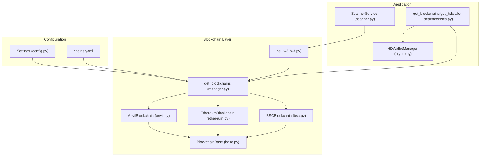
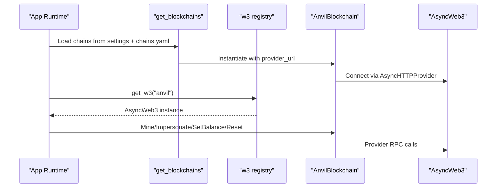
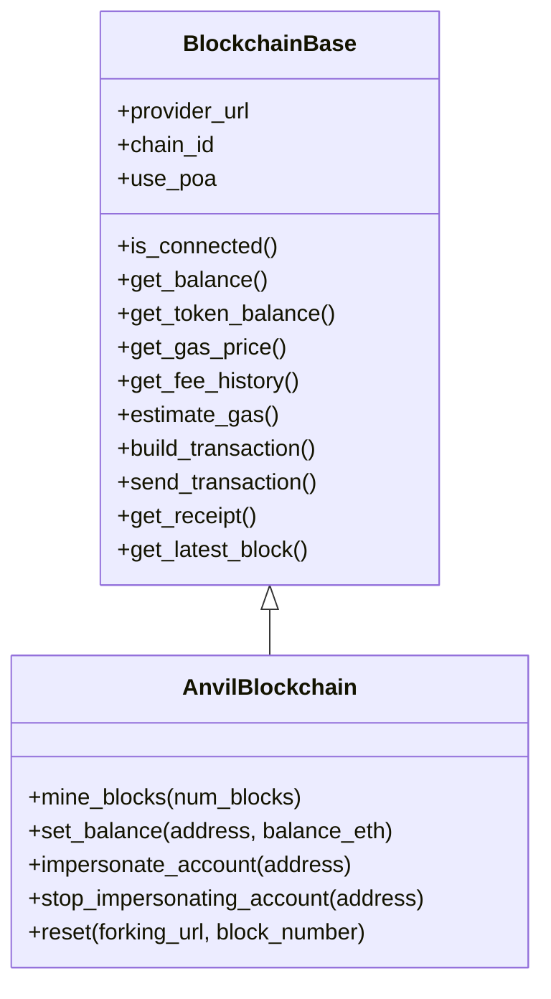
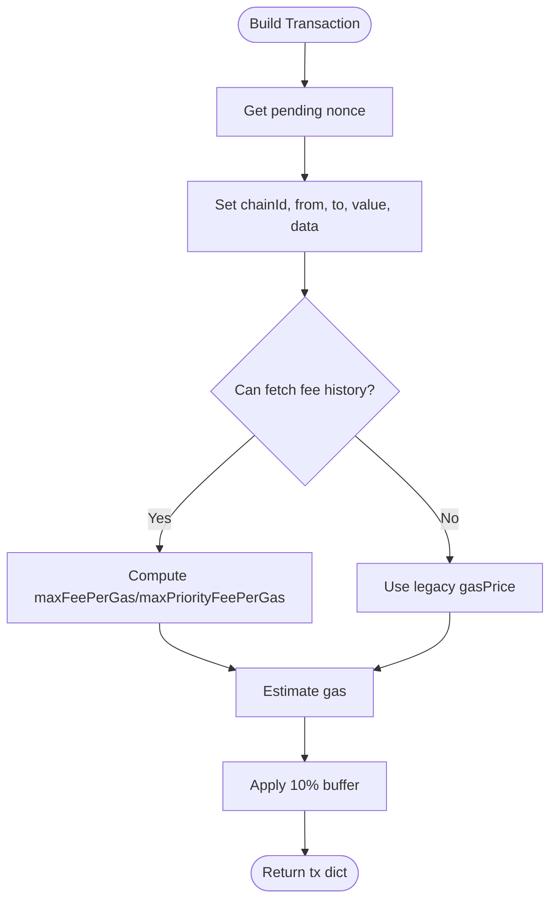
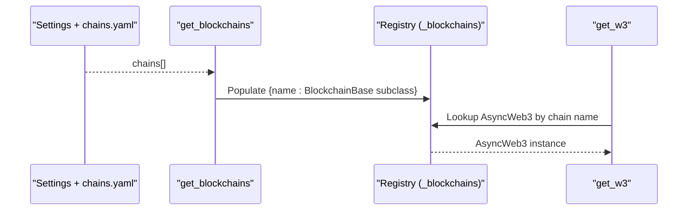
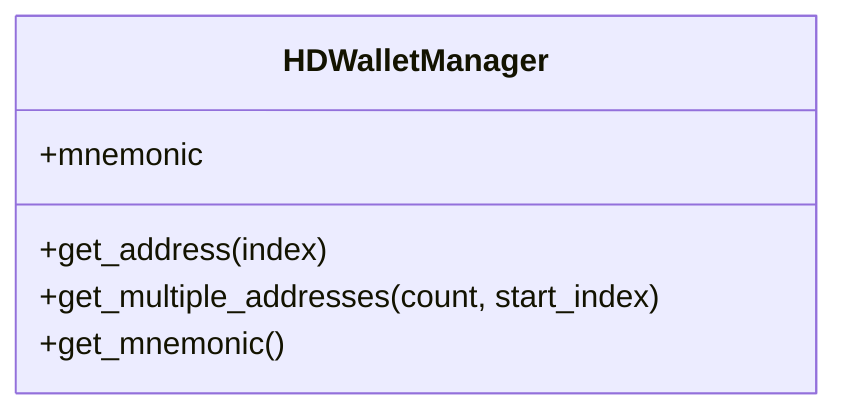
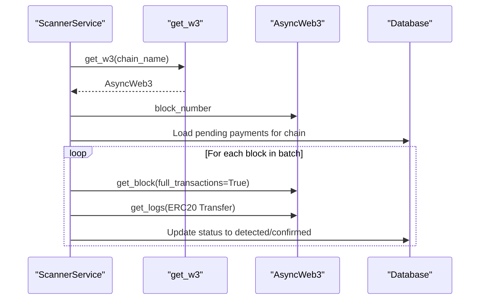
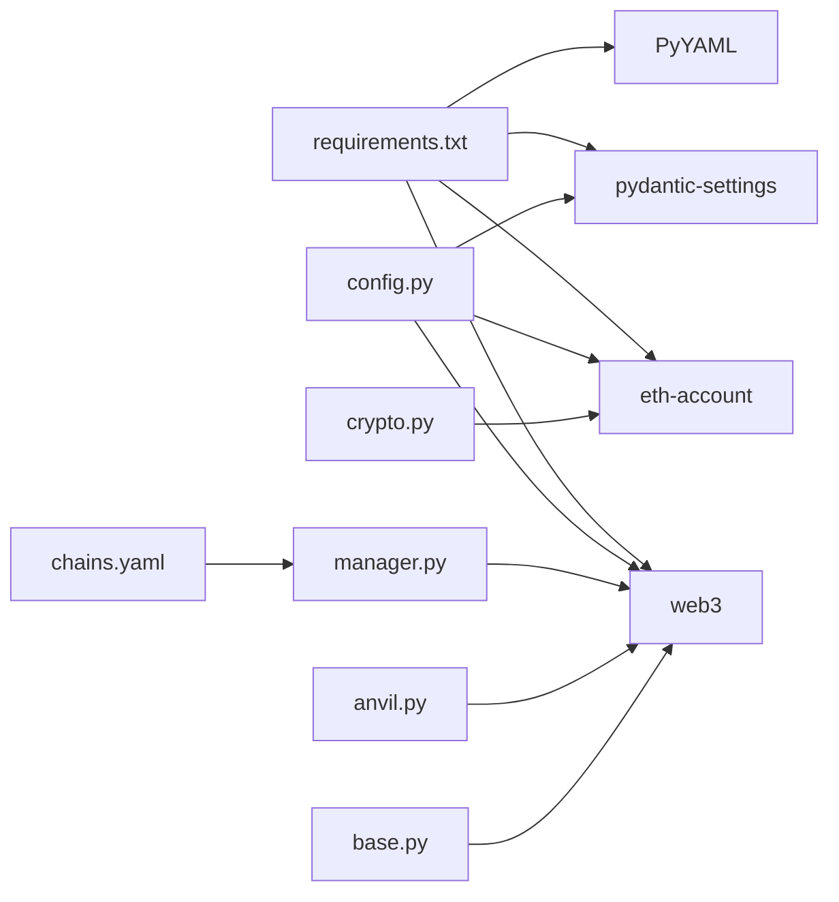

# Anvil Local Network

<cite>
**Referenced Files in This Document**
- [anvil.py](https://github.com/rakibhossain72/ctrip/blob/main/app/blockchain/anvil.py)
- [base.py](https://github.com/rakibhossain72/ctrip/blob/main/app/blockchain/base.py)
- [manager.py](https://github.com/rakibhossain72/ctrip/blob/main/app/blockchain/manager.py)
- [w3.py](https://github.com/rakibhossain72/ctrip/blob/main/app/blockchain/w3.py)
- [ethereum.py](https://github.com/rakibhossain72/ctrip/blob/main/app/blockchain/ethereum.py)
- [bsc.py](https://github.com/rakibhossain72/ctrip/blob/main/app/blockchain/bsc.py)
- [config.py](https://github.com/rakibhossain72/ctrip/blob/main/app/core/config.py)
- [chains.yaml](https://github.com/rakibhossain72/ctrip/blob/main/chains.yaml)
- [docker-compose.yml](https://github.com/rakibhossain72/ctrip/blob/main/docker-compose.yml)
- [crypto.py](https://github.com/rakibhossain72/ctrip/blob/main/app/utils/crypto.py)
- [dependencies.py](https://github.com/rakibhossain72/ctrip/blob/main/app/api/dependencies.py)
- [scanner.py](https://github.com/rakibhossain72/ctrip/blob/main/app/services/blockchain/scanner.py)
- [requirements.txt](https://github.com/rakibhossain72/ctrip/blob/main/requirements.txt)
- [README.md](https://github.com/rakibhossain72/ctrip/blob/main/README.md)
</cite>

## Table of Contents
1. [Introduction](#introduction)
2. [Project Structure](#project-structure)
3. [Core Components](#core-components)
4. [Architecture Overview](#architecture-overview)
5. [Detailed Component Analysis](#detailed-component-analysis)
6. [Dependency Analysis](#dependency-analysis)
7. [Performance Considerations](#performance-considerations)
8. [Troubleshooting Guide](#troubleshooting-guide)
9. [Conclusion](#conclusion)
10. [Appendices](#appendices)

## Introduction
This document explains the Anvil local blockchain network implementation used for development and testing. It focuses on the AnvilBlockchain class, its role in enabling fast and deterministic local testing, and how it integrates with the broader system for payment gateway functionality. You will learn how to set up Anvil, configure networks, manage private keys via HD wallets, and leverage Anvil’s capabilities for automated testing, local debugging, and streamlined development workflows.

## Project Structure
The Anvil integration is centered around a small set of modules that provide a unified interface to EVM-compatible chains, with Anvil as a special-case local chain. Configuration is driven by environment variables and a chains YAML file, while runtime access is provided via a global registry of blockchain instances.

**Diagram sources**
- [config.py](https://github.com/rakibhossain72/ctrip/blob/main/app/core/config.py#L10-L126)
- [chains.yaml](https://github.com/rakibhossain72/ctrip/blob/main/chains.yaml#L1-L24)
- [manager.py](https://github.com/rakibhossain72/ctrip/blob/main/app/blockchain/manager.py#L8-L33)
- [anvil.py](https://github.com/rakibhossain72/ctrip/blob/main/app/blockchain/anvil.py#L8-L57)
- [base.py](https://github.com/rakibhossain72/ctrip/blob/main/app/blockchain/base.py#L22-L146)
- [ethereum.py](https://github.com/rakibhossain72/ctrip/blob/main/app/blockchain/ethereum.py#L3-L7)
- [bsc.py](https://github.com/rakibhossain72/ctrip/blob/main/app/blockchain/bsc.py#L3-L7)
- [w3.py](https://github.com/rakibhossain72/ctrip/blob/main/app/blockchain/w3.py#L1-L9)
- [dependencies.py](https://github.com/rakibhossain72/ctrip/blob/main/app/api/dependencies.py#L5-L15)
- [scanner.py](https://github.com/rakibhossain72/ctrip/blob/main/app/services/blockchain/scanner.py#L14-L134)
- [crypto.py](https://github.com/rakibhossain72/ctrip/blob/main/app/utils/crypto.py#L5-L90)

**Section sources**
- [README.md](https://github.com/rakibhossain72/ctrip/blob/main/README.md#L1-L87)
- [config.py](https://github.com/rakibhossain72/ctrip/blob/main/app/core/config.py#L10-L126)
- [chains.yaml](https://github.com/rakibhossain72/ctrip/blob/main/chains.yaml#L1-L24)
- [manager.py](https://github.com/rakibhossain72/ctrip/blob/main/app/blockchain/manager.py#L8-L33)
- [w3.py](https://github.com/rakibhossain72/ctrip/blob/main/app/blockchain/w3.py#L1-L9)
- [dependencies.py](https://github.com/rakibhossain72/ctrip/blob/main/app/api/dependencies.py#L5-L15)

## Core Components
- AnvilBlockchain: Specialized EVM client for local development with Anvil, exposing mining, balance manipulation, impersonation, and reset controls.
- BlockchainBase: Shared async Web3 utilities for connection checks, balances, gas estimation, transaction building, signing, sending, and receipts.
- Manager and Registry: Build a chain registry from configuration, selecting Anvil or other chains based on settings.
- HD Wallet: Deterministic key/address generation for local testing and payment address derivation.
- Scanner: Detects incoming native and ERC20 payments on configured chains and advances statuses accordingly.

Key advantages for testing:
- Fast block times and instant confirmations via mining control.
- Deterministic state via impersonation and balance setting.
- Easy reset and fork control for repeatable tests.

**Section sources**
- [anvil.py](https://github.com/rakibhossain72/ctrip/blob/main/app/blockchain/anvil.py#L8-L57)
- [base.py](https://github.com/rakibhossain72/ctrip/blob/main/app/blockchain/base.py#L22-L146)
- [manager.py](https://github.com/rakibhossain72/ctrip/blob/main/app/blockchain/manager.py#L8-L33)
- [w3.py](https://github.com/rakibhossain72/ctrip/blob/main/app/blockchain/w3.py#L1-L9)
- [crypto.py](https://github.com/rakibhossain72/ctrip/blob/main/app/utils/crypto.py#L5-L90)
- [scanner.py](https://github.com/rakibhossain72/ctrip/blob/main/app/services/blockchain/scanner.py#L14-L134)

## Architecture Overview
The system initializes blockchain clients from configuration, exposes them via a registry, and allows services to scan and react to on-chain activity. Anvil is treated as a first-class chain with specialized RPC methods for rapid iteration.

**Diagram sources**
- [manager.py](https://github.com/rakibhossain72/ctrip/blob/main/app/blockchain/manager.py#L8-L33)
- [w3.py](https://github.com/rakibhossain72/ctrip/blob/main/app/blockchain/w3.py#L1-L9)
- [anvil.py](https://github.com/rakibhossain72/ctrip/blob/main/app/blockchain/anvil.py#L8-L57)
- [base.py](https://github.com/rakibhossain72/ctrip/blob/main/app/blockchain/base.py#L34-L36)

## Detailed Component Analysis

### AnvilBlockchain
Purpose:
- Provide Anvil-specific operations: mining blocks, setting balances, impersonating accounts, and resetting/forking the chain.
- Wrap base Web3 utilities for gas, transactions, receipts, and balance queries.

Capabilities:
- Mining: Mine N blocks in sequence to advance chain state deterministically.
- Balance control: Set native ETH balance for any address.
- Impersonation: Temporarily act as any account for signing and state reads.
- Reset/Fork: Reset to clean state or fork from a remote endpoint at a specific block.

Implementation highlights:
- Uses JSON-RPC methods exposed by Anvil (e.g., evm_mine, anvil_setBalance, anvil_impersonateAccount, anvil_reset).
- Inherits robust gas estimation, transaction building, and signing from BlockchainBase.

**Diagram sources**
- [base.py](https://github.com/rakibhossain72/ctrip/blob/main/app/blockchain/base.py#L22-L146)
- [anvil.py](https://github.com/rakibhossain72/ctrip/blob/main/app/blockchain/anvil.py#L8-L57)

**Section sources**
- [anvil.py](https://github.com/rakibhossain72/ctrip/blob/main/app/blockchain/anvil.py#L8-L57)
- [base.py](https://github.com/rakibhossain72/ctrip/blob/main/app/blockchain/base.py#L22-L146)

### BlockchainBase Utilities
Purpose:
- Provide a shared async Web3 toolkit for gas pricing, fee history, transaction construction, signing, sending, and receipt polling.

Notable features:
- Gas caching and fallback logic.
- EIP-1559 fee calculation with legacy fallback.
- Robust transaction building with dynamic gas limits and buffers.
- Receipt polling with timeouts.

**Diagram sources**
- [base.py](https://github.com/rakibhossain72/ctrip/blob/main/app/blockchain/base.py#L93-L133)

**Section sources**
- [base.py](https://github.com/rakibhossain72/ctrip/blob/main/app/blockchain/base.py#L22-L146)

### Chain Registry and Access
Purpose:
- Construct a registry of blockchain clients from configuration and expose a simple accessor for async Web3.

How it works:
- Loads chain configs from settings and chains.yaml.
- Instantiates AnvilBlockchain for the "anvil" chain, EthereumBlockchain for "ethereum", BSCBlockchain for "bsc", or a generic BlockchainBase otherwise.
- Provides a fallback to a default Anvil instance if configuration is missing.
- Exposes get_w3(chain_name) to retrieve an AsyncWeb3 instance for a given chain.

**Diagram sources**
- [manager.py](https://github.com/rakibhossain72/ctrip/blob/main/app/blockchain/manager.py#L8-L33)
- [w3.py](https://github.com/rakibhossain72/ctrip/blob/main/app/blockchain/w3.py#L1-L9)
- [config.py](https://github.com/rakibhossain72/ctrip/blob/main/app/core/config.py#L44-L56)
- [chains.yaml](https://github.com/rakibhossain72/ctrip/blob/main/chains.yaml#L1-L24)

**Section sources**
- [manager.py](https://github.com/rakibhossain72/ctrip/blob/main/app/blockchain/manager.py#L8-L33)
- [w3.py](https://github.com/rakibhossain72/ctrip/blob/main/app/blockchain/w3.py#L1-L9)
- [config.py](https://github.com/rakibhossain72/ctrip/blob/main/app/core/config.py#L44-L56)
- [chains.yaml](https://github.com/rakibhossain72/ctrip/blob/main/chains.yaml#L1-L24)

### HD Wallet and Private Key Management
Purpose:
- Generate deterministic payment addresses using BIP-44 derivation for local testing and payment address allocation.

Highlights:
- Mnemonic-based HD derivation with configurable seed.
- Derives Ethereum addresses at m/44'/60'/0'/0/{index}.
- Provides helpers to generate multiple addresses and retrieve mnemonic for backup.

Integration:
- Used by payment creation to derive unique addresses per payment.
- Private keys are managed via environment configuration and used by BlockchainBase to sign transactions.

**Diagram sources**
- [crypto.py](https://github.com/rakibhossain72/ctrip/blob/main/app/utils/crypto.py#L5-L90)

**Section sources**
- [crypto.py](https://github.com/rakibhossain72/ctrip/blob/main/app/utils/crypto.py#L5-L90)
- [config.py](https://github.com/rakibhossain72/ctrip/blob/main/app/core/config.py#L58-L102)

### Payment Scanning and Confirmation
Purpose:
- Scan blocks for incoming native and ERC20 payments to a set of target addresses and confirm them after required block confirmations.

Key steps:
- Retrieve last scanned block from state and scan in batches.
- For native payments, check transaction values to destination addresses.
- For ERC20, filter logs by transfer topic and match token addresses and amounts.
- Advance status to detected and later confirmed after sufficient confirmations.

**Diagram sources**
- [scanner.py](https://github.com/rakibhossain72/ctrip/blob/main/app/services/blockchain/scanner.py#L20-L96)
- [w3.py](https://github.com/rakibhossain72/ctrip/blob/main/app/blockchain/w3.py#L6-L9)

**Section sources**
- [scanner.py](https://github.com/rakibhossain72/ctrip/blob/main/app/services/blockchain/scanner.py#L14-L134)
- [w3.py](https://github.com/rakibhossain72/ctrip/blob/main/app/blockchain/w3.py#L1-L9)

## Dependency Analysis
External dependencies relevant to Anvil and blockchain operations:
- web3: AsyncWeb3 provider and middleware stack.
- eth-account: HD wallet and private key utilities.
- pydantic/pydantic-settings: Strongly typed configuration with environment loading.
- yaml: Chains configuration parsing.

**Diagram sources**
- [requirements.txt](https://github.com/rakibhossain72/ctrip/blob/main/requirements.txt#L27-L102)
- [config.py](https://github.com/rakibhossain72/ctrip/blob/main/app/core/config.py#L1-L126)
- [chains.yaml](https://github.com/rakibhossain72/ctrip/blob/main/chains.yaml#L1-L24)
- [manager.py](https://github.com/rakibhossain72/ctrip/blob/main/app/blockchain/manager.py#L1-L33)
- [anvil.py](https://github.com/rakibhossain72/ctrip/blob/main/app/blockchain/anvil.py#L1-L57)
- [base.py](https://github.com/rakibhossain72/ctrip/blob/main/app/blockchain/base.py#L1-L146)
- [crypto.py](https://github.com/rakibhossain72/ctrip/blob/main/app/utils/crypto.py#L1-L90)

**Section sources**
- [requirements.txt](https://github.com/rakibhossain72/ctrip/blob/main/requirements.txt#L1-L106)
- [config.py](https://github.com/rakibhossain72/ctrip/blob/main/app/core/config.py#L1-L126)
- [chains.yaml](https://github.com/rakibhossain72/ctrip/blob/main/chains.yaml#L1-L24)
- [manager.py](https://github.com/rakibhossain72/ctrip/blob/main/app/blockchain/manager.py#L1-L33)
- [anvil.py](https://github.com/rakibhossain72/ctrip/blob/main/app/blockchain/anvil.py#L1-L57)
- [base.py](https://github.com/rakibhossain72/ctrip/blob/main/app/blockchain/base.py#L1-L146)
- [crypto.py](https://github.com/rakibhossain72/ctrip/blob/main/app/utils/crypto.py#L1-L90)

## Performance Considerations
- Mining control: Use mining APIs to advance blocks instantly during tests, avoiding long waits.
- Gas caching: Base class caches gas prices to reduce repeated RPC calls.
- Batch scanning: ScannerService processes blocks in batches to avoid overloading the node.
- Confirmations: Tune confirmations to balance speed vs. safety in local tests.

[No sources needed since this section provides general guidance]

## Troubleshooting Guide
Common issues and resolutions:
- Provider connectivity failures: Use the base connection checker to verify RPC reachability.
- Missing chain configuration: Manager falls back to a default Anvil instance; ensure chains.yaml or settings are correct.
- Invalid private key: Settings validator rejects invalid keys; ensure PRIVATE_KEY is a valid Ethereum private key.
- HD wallet mnemonic errors: Mnemonic must be valid; regenerate if corrupted.
- Scanner not finding payments: Verify target addresses, token addresses, and that the chain is properly registered.

**Section sources**
- [base.py](https://github.com/rakibhossain72/ctrip/blob/main/app/blockchain/base.py#L45-L50)
- [manager.py](https://github.com/rakibhossain72/ctrip/blob/main/app/blockchain/manager.py#L28-L32)
- [config.py](https://github.com/rakibhossain72/ctrip/blob/main/app/core/config.py#L94-L102)
- [crypto.py](https://github.com/rakibhossain72/ctrip/blob/main/app/utils/crypto.py#L64-L66)
- [scanner.py](https://github.com/rakibhossain72/ctrip/blob/main/app/services/blockchain/scanner.py#L20-L32)

## Conclusion
Anvil is integrated as a first-class local chain with powerful developer controls for rapid iteration. By combining AnvilBlockchain’s specialized methods with BlockchainBase utilities and HD wallet management, the system enables deterministic, fast, and repeatable testing of payment gateway flows. The registry pattern and configuration-driven chain selection keep the system flexible and maintainable across environments.

[No sources needed since this section summarizes without analyzing specific files]

## Appendices

### A. Anvil Setup Procedures
- Run Anvil locally or via Docker Compose. The default RPC URL is configured in settings and can be overridden via environment variables.
- Ensure the chains configuration includes the "anvil" chain with the correct RPC URL.

Practical steps:
- Start Anvil on port 8545.
- Confirm connectivity using the base connection checker.
- Optionally fork from a mainnet endpoint for realistic testing.

**Section sources**
- [config.py](https://github.com/rakibhossain72/ctrip/blob/main/app/core/config.py#L28-L32)
- [chains.yaml](https://github.com/rakibhossain72/ctrip/blob/main/chains.yaml#L19-L24)
- [docker-compose.yml](https://github.com/rakibhossain72/ctrip/blob/main/docker-compose.yml#L30-L31)
- [base.py](https://github.com/rakibhossain72/ctrip/blob/main/app/blockchain/base.py#L45-L50)

### B. Network Configuration and Chain Selection
- Configure chains in chains.yaml and load them via settings.
- Manager selects AnvilBlockchain for "anvil", EthereumBlockchain for "ethereum", BSCBlockchain for "bsc", or a generic base class otherwise.
- Fallback ensures Anvil is available even if configuration is empty.

**Section sources**
- [chains.yaml](https://github.com/rakibhossain72/ctrip/blob/main/chains.yaml#L1-L24)
- [config.py](https://github.com/rakibhossain72/ctrip/blob/main/app/core/config.py#L44-L56)
- [manager.py](https://github.com/rakibhossain72/ctrip/blob/main/app/blockchain/manager.py#L8-L33)

### C. Private Key Management for Local Development
- Private key is validated by settings and used by BlockchainBase to sign transactions.
- Mnemonic is used by HDWalletManager to derive deterministic addresses for payment generation.
- Keep mnemonics and private keys secure; use environment variables and secrets management.

**Section sources**
- [config.py](https://github.com/rakibhossain72/ctrip/blob/main/app/core/config.py#L74-L102)
- [crypto.py](https://github.com/rakibhossain72/ctrip/blob/main/app/utils/crypto.py#L5-L90)
- [base.py](https://github.com/rakibhossain72/ctrip/blob/main/app/blockchain/base.py#L135-L139)

### D. Advantages for Testing Payment Gateways
- Fast transaction speeds: Mine blocks instantly to simulate confirmations.
- Deterministic behavior: Impersonate accounts and set balances for reproducible tests.
- Easy state management: Reset/fork to known states between test runs.

**Section sources**
- [anvil.py](https://github.com/rakibhossain72/ctrip/blob/main/app/blockchain/anvil.py#L13-L56)
- [base.py](https://github.com/rakibhossain72/ctrip/blob/main/app/blockchain/base.py#L65-L91)

### E. Integration with Development Workflows
- API endpoints depend on the chain registry to validate and route requests.
- Background workers scan chains and update payment statuses.
- Use the registry to access AsyncWeb3 for chain-specific operations.

**Section sources**
- [dependencies.py](https://github.com/rakibhossain72/ctrip/blob/main/app/api/dependencies.py#L5-L15)
- [w3.py](https://github.com/rakibhossain72/ctrip/blob/main/app/blockchain/w3.py#L1-L9)
- [scanner.py](https://github.com/rakibhossain72/ctrip/blob/main/app/services/blockchain/scanner.py#L14-L134)

### F. Practical Examples and Best Practices
- Example operations:
  - Mine blocks to advance time: [mine_blocks](https://github.com/rakibhossain72/ctrip/blob/main/app/blockchain/anvil.py#L13-L18)
  - Set balances for test accounts: [set_balance](https://github.com/rakibhossain72/ctrip/blob/main/app/blockchain/anvil.py#L20-L28)
  - Impersonate accounts for signing: [impersonate_account](https://github.com/rakibhossain72/ctrip/blob/main/app/blockchain/anvil.py#L30-L35)
  - Reset/fork to clean state: [reset](https://github.com/rakibhossain72/ctrip/blob/main/app/blockchain/anvil.py#L44-L56)
- Best practices:
  - Use separate test mnemonics and private keys.
  - Keep chains.yaml minimal and environment overrides for local dev.
  - Use reset/fork between test suites to avoid cross-test contamination.

**Section sources**
- [anvil.py](https://github.com/rakibhossain72/ctrip/blob/main/app/blockchain/anvil.py#L13-L56)
- [config.py](https://github.com/rakibhossain72/ctrip/blob/main/app/core/config.py#L28-L32)
- [chains.yaml](https://github.com/rakibhossain72/ctrip/blob/main/chains.yaml#L19-L24)