# Architecture Overview

<cite>
**Referenced Files in This Document**
- [manager.py](file://app/blockchain/manager.py)
- [base.py](file://app/blockchain/base.py)
- [w3.py](file://app/blockchain/w3.py)
- [ethereum.py](file://app/blockchain/ethereum.py)
- [bsc.py](file://app/blockchain/bsc.py)
- [anvil.py](file://app/blockchain/anvil.py)
- [config.py](file://app/core/config.py)
- [chains.yaml](file://chains.yaml)
- [scanner.py](file://app/services/blockchain/scanner.py)
- [sweeper.py](file://app/services/blockchain/sweeper.py)
- [listener.py](file://app/workers/listener.py)
- [chain.py](file://app/db/models/chain.py)
- [payment.py](file://app/db/models/payment.py)
- [token.py](file://app/db/models/token.py)
- [ERC20.json](file://app/blockchain/ABI/ERC20.json)
</cite>

## Table of Contents
1. [Introduction](#introduction)
2. [Project Structure](#project-structure)
3. [Core Components](#core-components)
4. [Architecture Overview](#architecture-overview)
5. [Detailed Component Analysis](#detailed-component-analysis)
6. [Dependency Analysis](#dependency-analysis)
7. [Performance Considerations](#performance-considerations)
8. [Troubleshooting Guide](#troubleshooting-guide)
9. [Conclusion](#conclusion)

## Introduction
This document explains the blockchain integration layer architecture used to manage multiple chains (Ethereum, BSC, Anvil) with a unified interface. It covers:
- Factory pattern implementation that instantiates chain-specific providers based on configuration
- The base blockchain interface and shared functionality
- Web3 provider management and connection handling
- How configuration drives instantiation and runtime behavior
- Error handling, fallback mechanisms, and chain availability monitoring
- Architectural diagrams illustrating component interactions and data flow

## Project Structure
The blockchain integration layer is organized around a factory that reads chain configuration and constructs chain-specific implementations. A thin Web3 accessor exposes per-chain AsyncWeb3 clients. Services consume these clients to scan blocks, detect payments, and settle transactions.

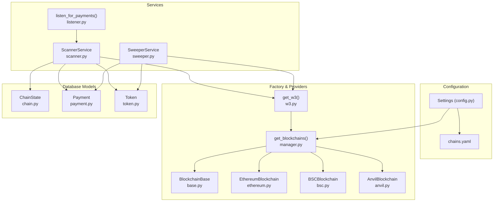

**Diagram sources**
- [config.py](file://app/core/config.py#L44-L56)
- [chains.yaml](file://chains.yaml#L1-L24)
- [manager.py](file://app/blockchain/manager.py#L8-L32)
- [w3.py](file://app/blockchain/w3.py#L4-L9)
- [base.py](file://app/blockchain/base.py#L22-L146)
- [ethereum.py](file://app/blockchain/ethereum.py#L3-L7)
- [bsc.py](file://app/blockchain/bsc.py#L3-L7)
- [anvil.py](file://app/blockchain/anvil.py#L8-L57)
- [scanner.py](file://app/services/blockchain/scanner.py#L14-L134)
- [sweeper.py](file://app/services/blockchain/sweeper.py#L11-L54)
- [listener.py](file://app/workers/listener.py#L21-L46)
- [chain.py](file://app/db/models/chain.py#L9-L17)
- [payment.py](file://app/db/models/payment.py#L41-L74)
- [token.py](file://app/db/models/token.py#L6-L15)

**Section sources**
- [manager.py](file://app/blockchain/manager.py#L1-L33)
- [config.py](file://app/core/config.py#L44-L56)
- [chains.yaml](file://chains.yaml#L1-L24)

## Core Components
- Blockchain Manager Factory: Builds a dictionary of chain instances keyed by chain name, selecting implementations based on configuration and falling back to a default chain when none are configured.
- Base Provider Interface: Provides a shared set of async operations (connection checks, balance queries, gas estimation, transaction building, signing, sending, receipts, block number retrieval).
- Chain-Specific Implementations: Ethereum and BSC specialize base behavior with chain IDs and POA middleware; Anvil adds developer-focused capabilities.
- Web3 Accessor: Exposes per-chain AsyncWeb3 clients via a simple lookup.
- Services: ScannerService scans blocks and confirms payments; SweeperService settles confirmed payments; Listener schedules scanning cycles.

**Section sources**
- [manager.py](file://app/blockchain/manager.py#L8-L32)
- [base.py](file://app/blockchain/base.py#L22-L146)
- [ethereum.py](file://app/blockchain/ethereum.py#L3-L7)
- [bsc.py](file://app/blockchain/bsc.py#L3-L7)
- [anvil.py](file://app/blockchain/anvil.py#L8-L57)
- [w3.py](file://app/blockchain/w3.py#L4-L9)
- [scanner.py](file://app/services/blockchain/scanner.py#L14-L134)
- [sweeper.py](file://app/services/blockchain/sweeper.py#L11-L54)
- [listener.py](file://app/workers/listener.py#L21-L46)

## Architecture Overview
The integration layer follows a factory-driven composition:
- Configuration (YAML + Settings) defines chains and RPC endpoints.
- The factory selects a chain implementation and initializes a Web3 client with optional middleware.
- Services request a chain’s Web3 client via the accessor and operate against the blockchain.

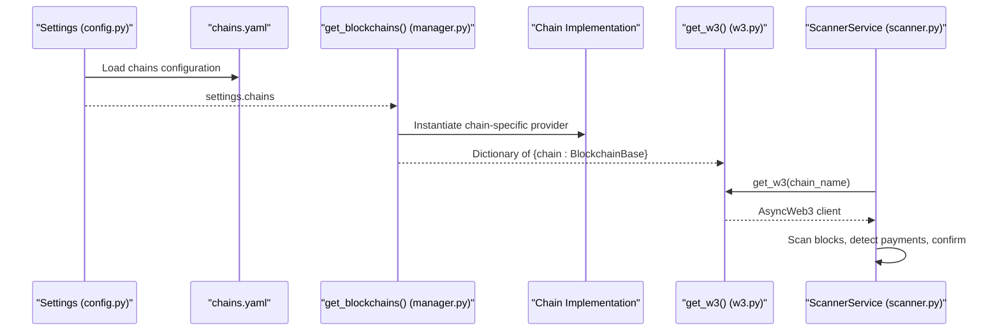

**Diagram sources**
- [config.py](file://app/core/config.py#L44-L56)
- [chains.yaml](file://chains.yaml#L1-L24)
- [manager.py](file://app/blockchain/manager.py#L8-L32)
- [w3.py](file://app/blockchain/w3.py#L4-L9)
- [scanner.py](file://app/services/blockchain/scanner.py#L20-L96)

## Detailed Component Analysis

### Factory Pattern: Blockchain Manager
- Reads chain configurations from settings and builds a mapping from chain name to a BlockchainBase-derived instance.
- Supports Ethereum, BSC, and Anvil; falls back to Anvil if no chains are configured.
- Uses provider_url from configuration to initialize AsyncWeb3.

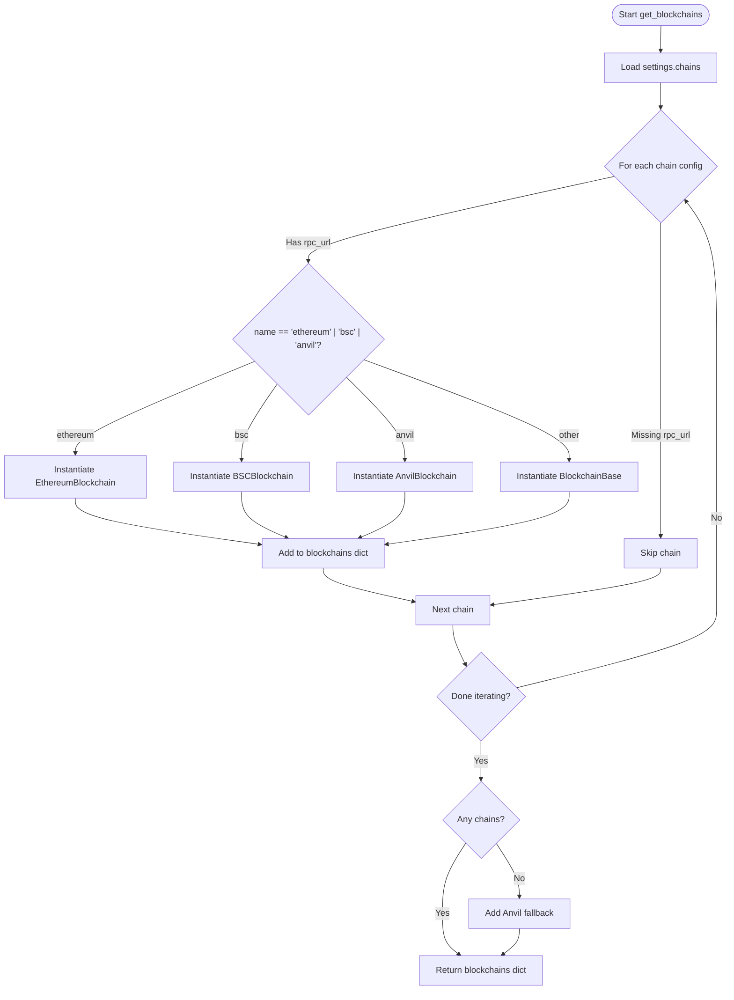

**Diagram sources**
- [manager.py](file://app/blockchain/manager.py#L8-L32)

**Section sources**
- [manager.py](file://app/blockchain/manager.py#L8-L32)

### Base Blockchain Interface: Shared Functionality
- Initializes AsyncWeb3 with a timeout and optional POA middleware injection.
- Provides connectivity check, native and token balance retrieval, gas price caching, fee history, gas estimation with defaults, transaction building (EIP-1559 preferred), signing, sending, receipt polling, and latest block number.

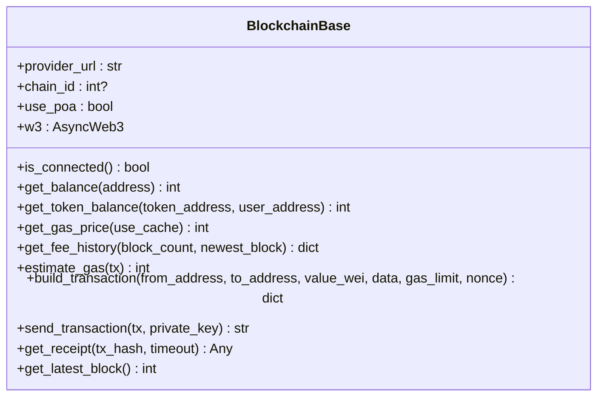

**Diagram sources**
- [base.py](file://app/blockchain/base.py#L22-L146)

**Section sources**
- [base.py](file://app/blockchain/base.py#L22-L146)

### Chain-Specific Implementations
- EthereumBlockchain: Sets chain_id to 1 and disables POA middleware.
- BSCBlockchain: Sets chain_id to 56 and enables POA middleware.
- AnvilBlockchain: Adds developer utilities (mine blocks, set balances, impersonate accounts, reset/fork) while inheriting base behavior.

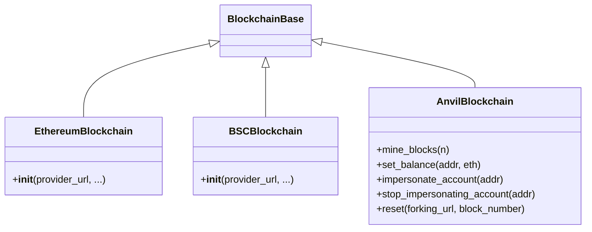

**Diagram sources**
- [ethereum.py](file://app/blockchain/ethereum.py#L3-L7)
- [bsc.py](file://app/blockchain/bsc.py#L3-L7)
- [anvil.py](file://app/blockchain/anvil.py#L8-L57)
- [base.py](file://app/blockchain/base.py#L22-L146)

**Section sources**
- [ethereum.py](file://app/blockchain/ethereum.py#L3-L7)
- [bsc.py](file://app/blockchain/bsc.py#L3-L7)
- [anvil.py](file://app/blockchain/anvil.py#L8-L57)

### Web3 Provider Management and Accessor
- get_blockchains() constructs a singleton-like cache of chain instances.
- get_w3(chain_name) returns the AsyncWeb3 client for a given chain, raising an error if the chain is not configured.

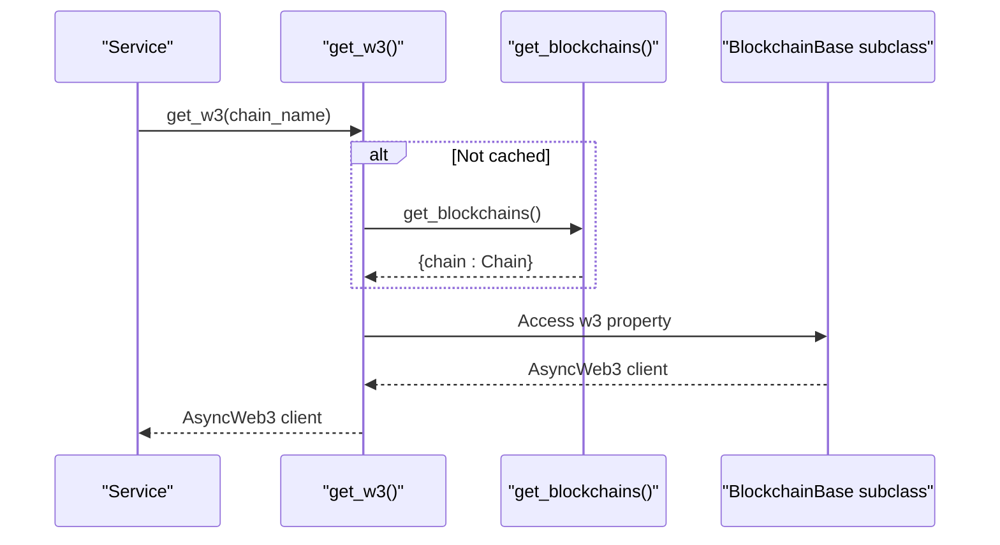

**Diagram sources**
- [w3.py](file://app/blockchain/w3.py#L4-L9)
- [manager.py](file://app/blockchain/manager.py#L8-L32)
- [base.py](file://app/blockchain/base.py#L34-L36)

**Section sources**
- [w3.py](file://app/blockchain/w3.py#L4-L9)

### Relationship Between Configuration and Instantiation
- settings.chains loads chain entries from chains.yaml.
- Each entry supplies a name and rpc_url; the factory maps names to implementations.
- If chains.yaml is missing or empty, the factory falls back to Anvil using a default RPC URL from settings.

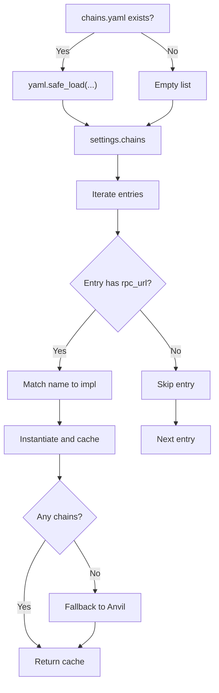

**Diagram sources**
- [config.py](file://app/core/config.py#L44-L56)
- [chains.yaml](file://chains.yaml#L1-L24)
- [manager.py](file://app/blockchain/manager.py#L12-L32)

**Section sources**
- [config.py](file://app/core/config.py#L44-L56)
- [chains.yaml](file://chains.yaml#L1-L24)
- [manager.py](file://app/blockchain/manager.py#L12-L32)

### Error Handling Patterns and Fallback Mechanisms
- Connection checks wrap AsyncWeb3 connectivity in a guarded method returning a boolean and logging errors.
- Gas estimation falls back to conservative defaults when RPC calls fail.
- Transaction building prefers EIP-1559 fee calculation; on failure, it falls back to legacy gas price.
- The factory provides a fallback chain when configuration yields no chains.
- Services handle missing chain state and skip scanning when appropriate.

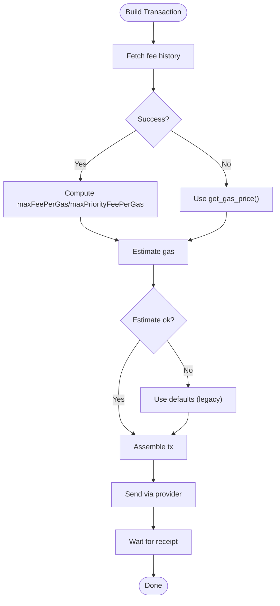

**Diagram sources**
- [base.py](file://app/blockchain/base.py#L86-L133)

**Section sources**
- [base.py](file://app/blockchain/base.py#L45-L50)
- [base.py](file://app/blockchain/base.py#L87-L92)
- [base.py](file://app/blockchain/base.py#L116-L133)
- [manager.py](file://app/blockchain/manager.py#L28-L31)

### Chain Availability Monitoring and Health Checks
- is_connected() performs a basic connectivity probe via AsyncWeb3 and logs failures.
- Services rely on get_w3() to access a working provider; missing chains raise explicit errors.
- The listener schedules periodic scanning cycles and retries after each run.

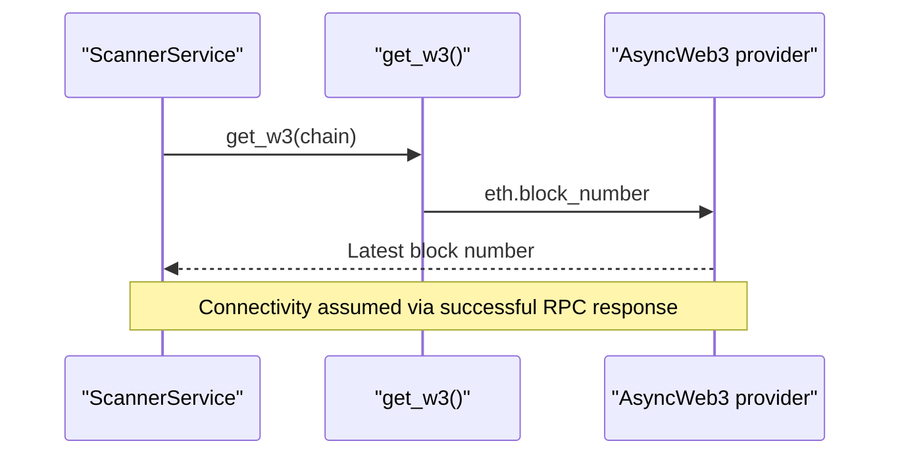

**Diagram sources**
- [scanner.py](file://app/services/blockchain/scanner.py#L34-L36)
- [w3.py](file://app/blockchain/w3.py#L6-L9)
- [base.py](file://app/blockchain/base.py#L45-L50)

**Section sources**
- [base.py](file://app/blockchain/base.py#L45-L50)
- [scanner.py](file://app/services/blockchain/scanner.py#L34-L36)
- [listener.py](file://app/workers/listener.py#L29-L46)

### Data Models and Service Interactions
- ChainState tracks the last scanned block per chain.
- Payment records payment requests with status transitions (pending → detected → confirmed → settled).
- Token defines token metadata per chain.
- ScannerService reads ChainState, queries blocks, detects native and ERC20 transfers, updates Payment statuses, and triggers webhooks.
- SweeperService uses the configured private key to settle confirmed payments.

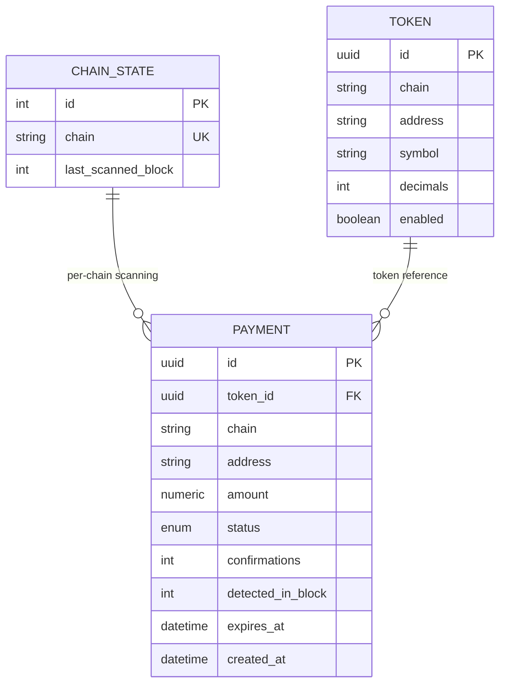

**Diagram sources**
- [chain.py](file://app/db/models/chain.py#L9-L17)
- [token.py](file://app/db/models/token.py#L6-L15)
- [payment.py](file://app/db/models/payment.py#L41-L74)

**Section sources**
- [chain.py](file://app/db/models/chain.py#L9-L17)
- [token.py](file://app/db/models/token.py#L6-L15)
- [payment.py](file://app/db/models/payment.py#L41-L74)
- [scanner.py](file://app/services/blockchain/scanner.py#L20-L134)
- [sweeper.py](file://app/services/blockchain/sweeper.py#L16-L54)

## Dependency Analysis
- Configuration drives instantiation: settings.chains feeds the factory, which depends on chains.yaml.
- The factory depends on chain-specific implementations and the base class.
- The Web3 accessor depends on the factory’s cached instances.
- Services depend on the Web3 accessor and database models.
- Anvil implementation extends base behavior without affecting other chains.

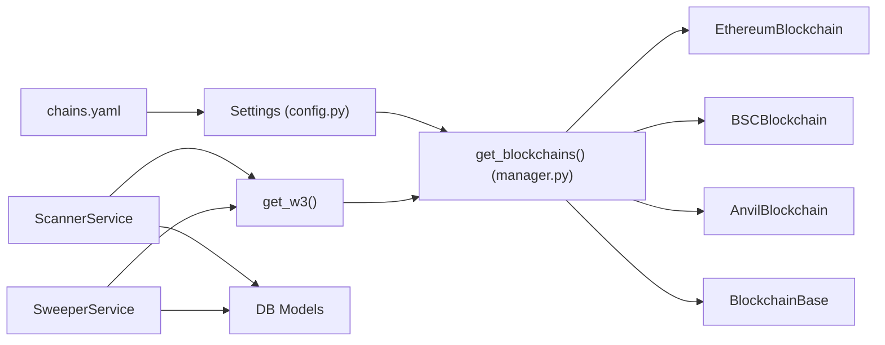

**Diagram sources**
- [config.py](file://app/core/config.py#L44-L56)
- [chains.yaml](file://chains.yaml#L1-L24)
- [manager.py](file://app/blockchain/manager.py#L8-L32)
- [w3.py](file://app/blockchain/w3.py#L4-L9)
- [scanner.py](file://app/services/blockchain/scanner.py#L14-L134)
- [sweeper.py](file://app/services/blockchain/sweeper.py#L11-L54)
- [chain.py](file://app/db/models/chain.py#L9-L17)
- [payment.py](file://app/db/models/payment.py#L41-L74)
- [token.py](file://app/db/models/token.py#L6-L15)

**Section sources**
- [config.py](file://app/core/config.py#L44-L56)
- [manager.py](file://app/blockchain/manager.py#L8-L32)
- [w3.py](file://app/blockchain/w3.py#L4-L9)
- [scanner.py](file://app/services/blockchain/scanner.py#L14-L134)
- [sweeper.py](file://app/services/blockchain/sweeper.py#L11-L54)

## Performance Considerations
- Gas price caching reduces repeated RPC calls for fee estimation.
- Transaction building applies a small gas limit buffer to avoid frequent rejections.
- Block scanning batches blocks to limit work per cycle; adjust batch size based on network conditions.
- Consider adding connection pooling or retry/backoff for RPC endpoints if encountering rate limits or transient failures.

[No sources needed since this section provides general guidance]

## Troubleshooting Guide
Common issues and resolutions:
- Missing or invalid chains.yaml: The factory returns an empty set; a fallback Anvil instance is created. Verify chains.yaml path and content.
- RPC endpoint unreachable: is_connected() logs errors and returns False; ensure endpoints are reachable and healthy.
- Gas estimation failures: The library falls back to conservative defaults; inspect transaction parameters and network conditions.
- Chain not configured error: get_w3() raises an error if the requested chain is not present; ensure settings.chains includes the chain name.
- Scanning skips chains: If no ChainState exists for a chain, scanning is skipped; create ChainState records before scanning.

**Section sources**
- [manager.py](file://app/blockchain/manager.py#L28-L31)
- [base.py](file://app/blockchain/base.py#L45-L50)
- [base.py](file://app/blockchain/base.py#L87-L92)
- [w3.py](file://app/blockchain/w3.py#L7-L9)
- [scanner.py](file://app/services/blockchain/scanner.py#L30-L33)

## Conclusion
The blockchain integration layer cleanly separates configuration, instantiation, and runtime operations:
- Factory-driven instantiation ensures predictable chain-specific behavior.
- A shared base class encapsulates common Web3 operations with robust fallbacks.
- Services operate independently of chain specifics via a simple Web3 accessor.
- Clear error handling and availability checks support resilient operation across heterogeneous networks.