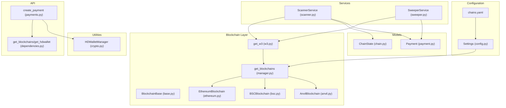
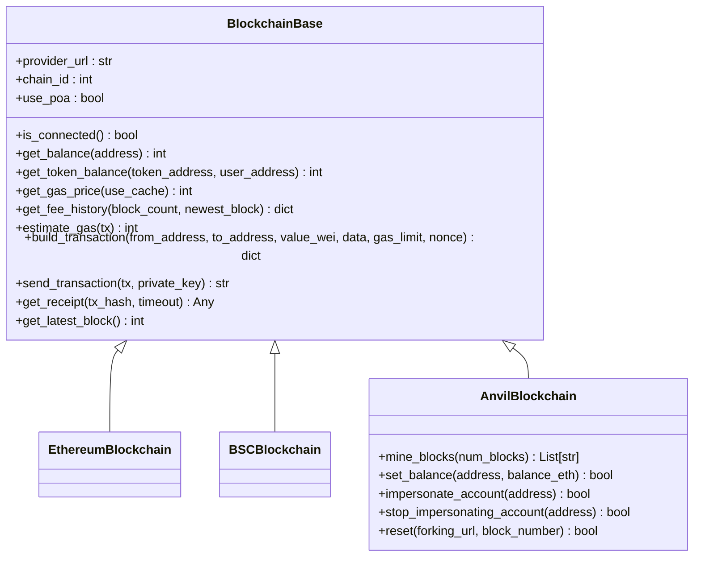
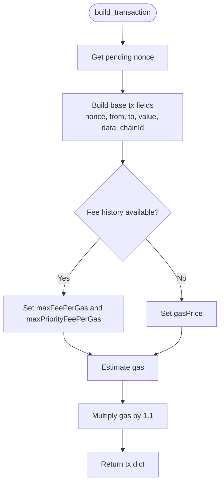
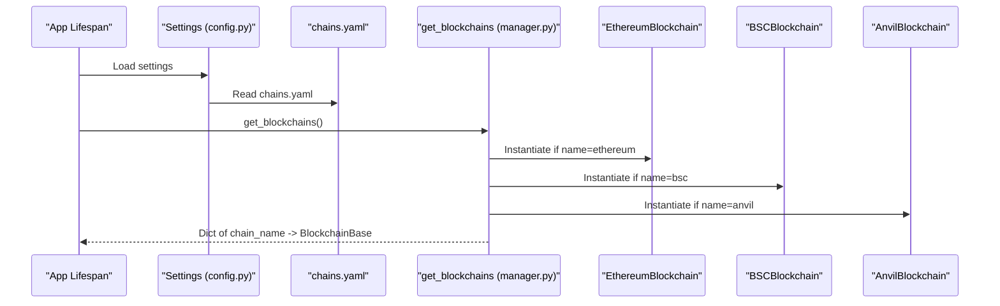
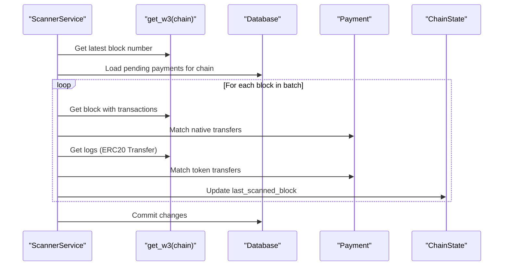
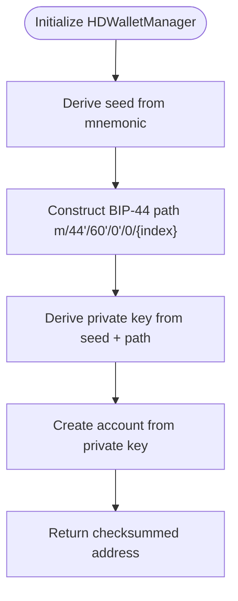
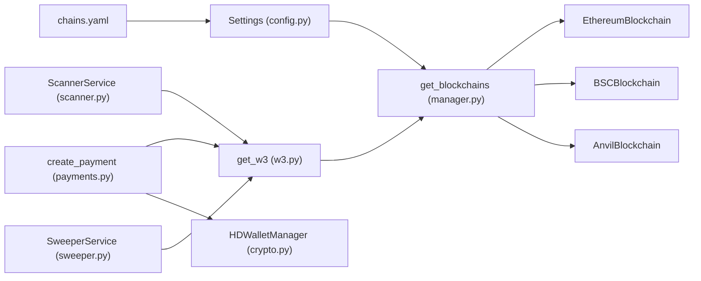
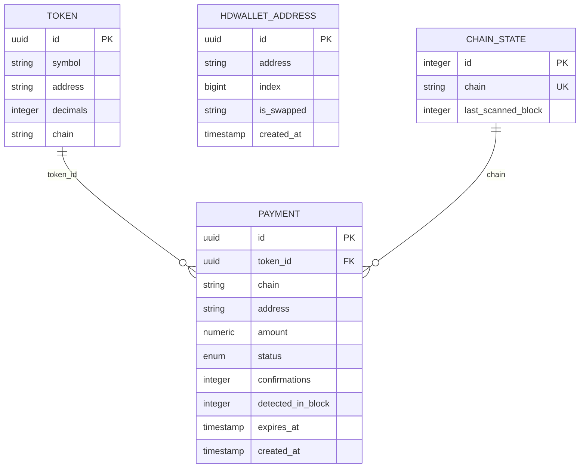

# Blockchain Integration

<cite>
**Referenced Files in This Document**
- [app/blockchain/base.py](https://github.com/rakibhossain72/ctrip/blob/main/app/blockchain/base.py)
- [app/blockchain/ethereum.py](https://github.com/rakibhossain72/ctrip/blob/main/app/blockchain/ethereum.py)
- [app/blockchain/bsc.py](https://github.com/rakibhossain72/ctrip/blob/main/app/blockchain/bsc.py)
- [app/blockchain/anvil.py](https://github.com/rakibhossain72/ctrip/blob/main/app/blockchain/anvil.py)
- [app/blockchain/manager.py](https://github.com/rakibhossain72/ctrip/blob/main/app/blockchain/manager.py)
- [app/blockchain/w3.py](https://github.com/rakibhossain72/ctrip/blob/main/app/blockchain/w3.py)
- [app/core/config.py](https://github.com/rakibhossain72/ctrip/blob/main/app/core/config.py)
- [chains.yaml](https://github.com/rakibhossain72/ctrip/blob/main/chains.yaml)
- [app/services/blockchain/scanner.py](https://github.com/rakibhossain72/ctrip/blob/main/app/services/blockchain/scanner.py)
- [app/services/blockchain/sweeper.py](https://github.com/rakibhossain72/ctrip/blob/main/app/services/blockchain/sweeper.py)
- [app/utils/crypto.py](https://github.com/rakibhossain72/ctrip/blob/main/app/utils/crypto.py)
- [app/db/models/payment.py](https://github.com/rakibhossain72/ctrip/blob/main/app/db/models/payment.py)
- [app/db/models/chain.py](https://github.com/rakibhossain72/ctrip/blob/main/app/db/models/chain.py)
- [app/api/v1/payments.py](https://github.com/rakibhossain72/ctrip/blob/main/app/api/v1/payments.py)
- [app/api/dependencies.py](https://github.com/rakibhossain72/ctrip/blob/main/app/api/dependencies.py)
</cite>

## Table of Contents
1. [Introduction](#introduction)
2. [Project Structure](#project-structure)
3. [Core Components](#core-components)
4. [Architecture Overview](#architecture-overview)
5. [Detailed Component Analysis](#detailed-component-analysis)
6. [Dependency Analysis](#dependency-analysis)
7. [Performance Considerations](#performance-considerations)
8. [Troubleshooting Guide](#troubleshooting-guide)
9. [Conclusion](#conclusion)
10. [Appendices](#appendices)

## Introduction
This document explains the blockchain integration for the cTrip Payment Gateway. It covers the multi-chain architecture built on a factory-like manager that instantiates chain-specific implementations using a shared base interface. The gateway supports Ethereum Mainnet, BSC (Binance Smart Chain), and Anvil local testing networks. It also documents Web3 provider management, transaction monitoring, gas management, and HD wallet integration using BIP-44 for generating unique payment addresses per transaction.

## Project Structure
The blockchain integration is organized around a base class extended by chain-specific implementations, a manager that constructs chains from configuration, and supporting services for scanning and sweeping transactions. Configuration is loaded from environment and a YAML file. API endpoints integrate with the blockchain layer to provision payment addresses and track transactions.

**Diagram sources**
- [app/blockchain/base.py](https://github.com/rakibhossain72/ctrip/blob/main/app/blockchain/base.py#L22-L146)
- [app/blockchain/ethereum.py](https://github.com/rakibhossain72/ctrip/blob/main/app/blockchain/ethereum.py#L1-L7)
- [app/blockchain/bsc.py](https://github.com/rakibhossain72/ctrip/blob/main/app/blockchain/bsc.py#L1-L7)
- [app/blockchain/anvil.py](https://github.com/rakibhossain72/ctrip/blob/main/app/blockchain/anvil.py#L1-L57)
- [app/blockchain/manager.py](https://github.com/rakibhossain72/ctrip/blob/main/app/blockchain/manager.py#L8-L33)
- [app/blockchain/w3.py](https://github.com/rakibhossain72/ctrip/blob/main/app/blockchain/w3.py#L1-L9)
- [app/core/config.py](https://github.com/rakibhossain72/ctrip/blob/main/app/core/config.py#L44-L56)
- [chains.yaml](https://github.com/rakibhossain72/ctrip/blob/main/chains.yaml#L1-L24)
- [app/services/blockchain/scanner.py](https://github.com/rakibhossain72/ctrip/blob/main/app/services/blockchain/scanner.py#L14-L134)
- [app/services/blockchain/sweeper.py](https://github.com/rakibhossain72/ctrip/blob/main/app/services/blockchain/sweeper.py#L11-L54)
- [app/utils/crypto.py](https://github.com/rakibhossain72/ctrip/blob/main/app/utils/crypto.py#L5-L90)
- [app/db/models/payment.py](https://github.com/rakibhossain72/ctrip/blob/main/app/db/models/payment.py#L41-L74)
- [app/db/models/chain.py](https://github.com/rakibhossain72/ctrip/blob/main/app/db/models/chain.py#L9-L17)
- [app/api/v1/payments.py](https://github.com/rakibhossain72/ctrip/blob/main/app/api/v1/payments.py#L18-L62)
- [app/api/dependencies.py](https://github.com/rakibhossain72/ctrip/blob/main/app/api/dependencies.py#L5-L15)

**Section sources**
- [app/blockchain/base.py](https://github.com/rakibhossain72/ctrip/blob/main/app/blockchain/base.py#L22-L146)
- [app/blockchain/manager.py](https://github.com/rakibhossain72/ctrip/blob/main/app/blockchain/manager.py#L8-L33)
- [app/core/config.py](https://github.com/rakibhossain72/ctrip/blob/main/app/core/config.py#L44-L56)
- [chains.yaml](https://github.com/rakibhossain72/ctrip/blob/main/chains.yaml#L1-L24)

## Core Components
- BlockchainBase: Shared asynchronous Web3 interface with POA support, gas caching, EIP-1559 fee handling, transaction building, signing, and receipt polling.
- EthereumBlockchain: Extends base for Ethereum Mainnet with chain ID 1 and no POA middleware.
- BSCBlockchain: Extends base for BSC Mainnet with chain ID 56 and POA middleware enabled.
- AnvilBlockchain: Extends base for local Anvil testing with chain ID 31337 and additional developer utilities (balance, impersonation, mining, reset).
- Manager: Factory-like loader that builds chain instances from configuration.
- Web3 accessor: Centralized get_w3(chain_name) to retrieve AsyncWeb3 instances.
- ScannerService: Scans blocks for incoming native and ERC20 payments and updates statuses.
- SweeperService: Placeholder for sweeping confirmed funds to an admin wallet.
- HDWalletManager: BIP-44 derivation for generating unique payment addresses per transaction.
- Models: Payment and ChainState for persistence of payment records and scan progress.

**Section sources**
- [app/blockchain/base.py](https://github.com/rakibhossain72/ctrip/blob/main/app/blockchain/base.py#L22-L146)
- [app/blockchain/ethereum.py](https://github.com/rakibhossain72/ctrip/blob/main/app/blockchain/ethereum.py#L1-L7)
- [app/blockchain/bsc.py](https://github.com/rakibhossain72/ctrip/blob/main/app/blockchain/bsc.py#L1-L7)
- [app/blockchain/anvil.py](https://github.com/rakibhossain72/ctrip/blob/main/app/blockchain/anvil.py#L8-L57)
- [app/blockchain/manager.py](https://github.com/rakibhossain72/ctrip/blob/main/app/blockchain/manager.py#L8-L33)
- [app/blockchain/w3.py](https://github.com/rakibhossain72/ctrip/blob/main/app/blockchain/w3.py#L1-L9)
- [app/services/blockchain/scanner.py](https://github.com/rakibhossain72/ctrip/blob/main/app/services/blockchain/scanner.py#L14-L134)
- [app/services/blockchain/sweeper.py](https://github.com/rakibhossain72/ctrip/blob/main/app/services/blockchain/sweeper.py#L11-L54)
- [app/utils/crypto.py](https://github.com/rakibhossain72/ctrip/blob/main/app/utils/crypto.py#L5-L90)
- [app/db/models/payment.py](https://github.com/rakibhossain72/ctrip/blob/main/app/db/models/payment.py#L41-L74)
- [app/db/models/chain.py](https://github.com/rakibhossain72/ctrip/blob/main/app/db/models/chain.py#L9-L17)

## Architecture Overview
The system uses a layered architecture:
- Configuration layer loads chain settings from environment and YAML.
- Manager layer instantiates chain-specific implementations.
- Services layer interacts with the chosen chain via a unified Web3 accessor.
- Utilities layer provides HD wallet generation and BIP-44 derivation.
- Persistence layer stores payment and chain state.

**Diagram sources**
- [app/blockchain/base.py](https://github.com/rakibhossain72/ctrip/blob/main/app/blockchain/base.py#L22-L146)
- [app/blockchain/ethereum.py](https://github.com/rakibhossain72/ctrip/blob/main/app/blockchain/ethereum.py#L1-L7)
- [app/blockchain/bsc.py](https://github.com/rakibhossain72/ctrip/blob/main/app/blockchain/bsc.py#L1-L7)
- [app/blockchain/anvil.py](https://github.com/rakibhossain72/ctrip/blob/main/app/blockchain/anvil.py#L8-L57)

## Detailed Component Analysis

### Base Blockchain Interface (BlockchainBase)
- Provider initialization: Asynchronous HTTP provider with configurable timeout.
- POA support: Optional injection of ExtraDataToPOAMiddleware for networks requiring it.
- Gas management: Caches gas price for a short duration and falls back to legacy pricing if EIP-1559 is unavailable.
- Transaction building: Supports EIP-1559 fee fields when available; otherwise uses legacy gasPrice. Adds 10% gas buffer and sets chainId.
- Signing and sending: Uses eth_account to sign and send raw transactions.
- Receipt polling: Waits for transaction receipts with a configurable timeout.
- Balance and token queries: Uses ERC20 ABI to query balances.

**Diagram sources**
- [app/blockchain/base.py](https://github.com/rakibhossain72/ctrip/blob/main/app/blockchain/base.py#L93-L133)

**Section sources**
- [app/blockchain/base.py](https://github.com/rakibhossain72/ctrip/blob/main/app/blockchain/base.py#L22-L146)

### Ethereum Mainnet Implementation
- Chain ID: 1.
- POA: Disabled.
- Typical RPC endpoints: Infura, Alchemy, or self-hosted nodes.
- Gas management: Inherits base EIP-1559 fee handling and caching.
- Transaction monitoring: Use ScannerService to detect incoming payments.

**Section sources**
- [app/blockchain/ethereum.py](https://github.com/rakibhossain72/ctrip/blob/main/app/blockchain/ethereum.py#L1-L7)
- [chains.yaml](https://github.com/rakibhossain72/ctrip/blob/main/chains.yaml#L2-L10)

### BSC (Binance Smart Chain) Implementation
- Chain ID: 56.
- POA: Enabled via POA middleware injection.
- Network-specific optimizations: POA middleware improves compatibility with BSC’s consensus.
- RPC configuration: Public nodes or self-hosted endpoints.

**Section sources**
- [app/blockchain/bsc.py](https://github.com/rakibhossain72/ctrip/blob/main/app/blockchain/bsc.py#L1-L7)
- [chains.yaml](https://github.com/rakibhossain72/ctrip/blob/main/chains.yaml#L12-L18)

### Anvil Local Testing Network
- Chain ID: 31337.
- Developer utilities: Mine blocks, set balances, impersonate accounts, reset/fork configuration.
- Useful for local testing and deterministic environments.

**Section sources**
- [app/blockchain/anvil.py](https://github.com/rakibhossain72/ctrip/blob/main/app/blockchain/anvil.py#L8-L57)

### Manager and Web3 Provider Management
- Manager: Loads chains from settings.chains and instantiates appropriate classes. Falls back to Anvil if configuration is empty.
- Web3 accessor: get_w3(chain_name) returns the AsyncWeb3 instance for a given chain.

**Diagram sources**
- [app/blockchain/manager.py](https://github.com/rakibhossain72/ctrip/blob/main/app/blockchain/manager.py#L8-L33)
- [app/core/config.py](https://github.com/rakibhossain72/ctrip/blob/main/app/core/config.py#L44-L56)
- [chains.yaml](https://github.com/rakibhossain72/ctrip/blob/main/chains.yaml#L1-L24)

**Section sources**
- [app/blockchain/manager.py](https://github.com/rakibhossain72/ctrip/blob/main/app/blockchain/manager.py#L8-L33)
- [app/blockchain/w3.py](https://github.com/rakibhossain72/ctrip/blob/main/app/blockchain/w3.py#L1-L9)

### Transaction Monitoring and Confirmation
- ScannerService scans blocks for native and ERC20 transfers, updates payment status to detected, and later confirms based on required confirmations.
- Uses event topics for efficient ERC20 transfer detection.

**Diagram sources**
- [app/services/blockchain/scanner.py](https://github.com/rakibhossain72/ctrip/blob/main/app/services/blockchain/scanner.py#L20-L96)
- [app/db/models/payment.py](https://github.com/rakibhossain72/ctrip/blob/main/app/db/models/payment.py#L41-L74)
- [app/db/models/chain.py](https://github.com/rakibhossain72/ctrip/blob/main/app/db/models/chain.py#L9-L17)

**Section sources**
- [app/services/blockchain/scanner.py](https://github.com/rakibhossain72/ctrip/blob/main/app/services/blockchain/scanner.py#L14-L134)
- [app/db/models/payment.py](https://github.com/rakibhossain72/ctrip/blob/main/app/db/models/payment.py#L41-L74)
- [app/db/models/chain.py](https://github.com/rakibhossain72/ctrip/blob/main/app/db/models/chain.py#L9-L17)

### HD Wallet Integration (BIP-44)
- Generates unique payment addresses per transaction using BIP-44 path m/44'/60'/0'/0/{index}.
- Mnemonic can be generated or supplied; seed derived deterministically.
- Used by API to provision a fresh address for each payment.

**Diagram sources**
- [app/utils/crypto.py](https://github.com/rakibhossain72/ctrip/blob/main/app/utils/crypto.py#L5-L90)

**Section sources**
- [app/utils/crypto.py](https://github.com/rakibhossain72/ctrip/blob/main/app/utils/crypto.py#L5-L90)
- [app/api/v1/payments.py](https://github.com/rakibhossain72/ctrip/blob/main/app/api/v1/payments.py#L36-L37)

### API Integration and Lifecycle
- create_payment validates chain/token, derives an address via HD wallet, persists a Payment record, and returns it.
- Dependencies inject blockchains and HD wallet managers from application state.

**Section sources**
- [app/api/v1/payments.py](https://github.com/rakibhossain72/ctrip/blob/main/app/api/v1/payments.py#L18-L62)
- [app/api/dependencies.py](https://github.com/rakibhossain72/ctrip/blob/main/app/api/dependencies.py#L5-L15)

## Dependency Analysis
- Configuration drives chain instantiation.
- Manager encapsulates factory logic and handles fallbacks.
- Services depend on get_w3 for chain access.
- API depends on manager and HD wallet for provisioning.

**Diagram sources**
- [app/core/config.py](https://github.com/rakibhossain72/ctrip/blob/main/app/core/config.py#L44-L56)
- [chains.yaml](https://github.com/rakibhossain72/ctrip/blob/main/chains.yaml#L1-L24)
- [app/blockchain/manager.py](https://github.com/rakibhossain72/ctrip/blob/main/app/blockchain/manager.py#L8-L33)
- [app/blockchain/w3.py](https://github.com/rakibhossain72/ctrip/blob/main/app/blockchain/w3.py#L1-L9)
- [app/api/v1/payments.py](https://github.com/rakibhossain72/ctrip/blob/main/app/api/v1/payments.py#L18-L62)
- [app/utils/crypto.py](https://github.com/rakibhossain72/ctrip/blob/main/app/utils/crypto.py#L5-L90)
- [app/services/blockchain/scanner.py](https://github.com/rakibhossain72/ctrip/blob/main/app/services/blockchain/scanner.py#L14-L134)
- [app/services/blockchain/sweeper.py](https://github.com/rakibhossain72/ctrip/blob/main/app/services/blockchain/sweeper.py#L11-L54)

**Section sources**
- [app/blockchain/manager.py](https://github.com/rakibhossain72/ctrip/blob/main/app/blockchain/manager.py#L8-L33)
- [app/blockchain/w3.py](https://github.com/rakibhossain72/ctrip/blob/main/app/blockchain/w3.py#L1-L9)
- [app/api/v1/payments.py](https://github.com/rakibhossain72/ctrip/blob/main/app/api/v1/payments.py#L18-L62)

## Performance Considerations
- Gas caching: Base class caches gas price for a short duration to reduce RPC calls.
- EIP-1559 prioritization: Uses fee history when available for dynamic pricing; falls back to legacy gasPrice otherwise.
- Gas estimation with defaults: Provides conservative defaults if estimation fails.
- Batch scanning: ScannerService processes blocks in batches to avoid long single requests.
- Confirmations: Requires a minimum number of confirmations before marking payments as confirmed.
- POA middleware: BSC uses POA middleware to handle extraData, improving reliability on that network.

[No sources needed since this section provides general guidance]

## Troubleshooting Guide
- Connection failures: is_connected checks provider availability and logs errors.
- Gas estimation failures: estimate_gas logs warnings and applies safe defaults.
- Missing chain configuration: get_blockchains raises ValueError if chain is not configured; manager falls back to Anvil if config is empty.
- HD wallet initialization: get_hdwallet raises runtime error if not initialized in lifespan.
- Private key validation: Settings validates private key format early.
- Anvil operations: Methods like impersonate_account and set_balance require the Anvil provider to be reachable.

**Section sources**
- [app/blockchain/base.py](https://github.com/rakibhossain72/ctrip/blob/main/app/blockchain/base.py#L45-L50)
- [app/blockchain/base.py](https://github.com/rakibhossain72/ctrip/blob/main/app/blockchain/base.py#L86-L91)
- [app/blockchain/w3.py](https://github.com/rakibhossain72/ctrip/blob/main/app/blockchain/w3.py#L6-L8)
- [app/blockchain/manager.py](https://github.com/rakibhossain72/ctrip/blob/main/app/blockchain/manager.py#L28-L30)
- [app/api/dependencies.py](https://github.com/rakibhossain72/ctrip/blob/main/app/api/dependencies.py#L11-L14)
- [app/core/config.py](https://github.com/rakibhossain72/ctrip/blob/main/app/core/config.py#L94-L102)
- [app/blockchain/anvil.py](https://github.com/rakibhossain72/ctrip/blob/main/app/blockchain/anvil.py#L30-L42)

## Conclusion
The cTrip Payment Gateway implements a clean, extensible multi-chain architecture centered on a shared base interface with chain-specific specializations. It leverages asynchronous Web3, robust gas management, and deterministic HD wallet derivation to support secure and scalable payment provisioning across Ethereum Mainnet, BSC, and Anvil. Services provide efficient monitoring and sweeping capabilities, while configuration-driven instantiation ensures flexibility across environments.

[No sources needed since this section summarizes without analyzing specific files]

## Appendices

### Configuration Options
- Environment: development, production, testing.
- Chains configuration path: chains.yaml.
- RPC endpoints: configured per chain.
- Private key: validated and required in production.
- Webhook URL and secret: optional for payment notifications.

**Section sources**
- [app/core/config.py](https://github.com/rakibhossain72/ctrip/blob/main/app/core/config.py#L10-L122)
- [chains.yaml](https://github.com/rakibhossain72/ctrip/blob/main/chains.yaml#L1-L24)

### Data Model Overview

**Diagram sources**
- [app/db/models/payment.py](https://github.com/rakibhossain72/ctrip/blob/main/app/db/models/payment.py#L41-L74)
- [app/db/models/chain.py](https://github.com/rakibhossain72/ctrip/blob/main/app/db/models/chain.py#L9-L17)