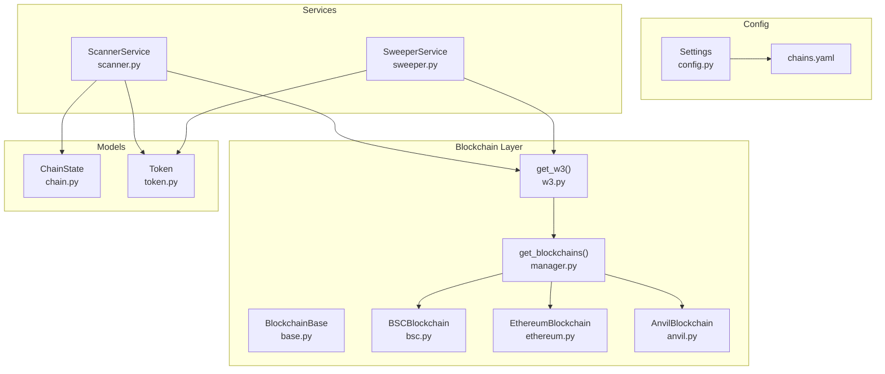
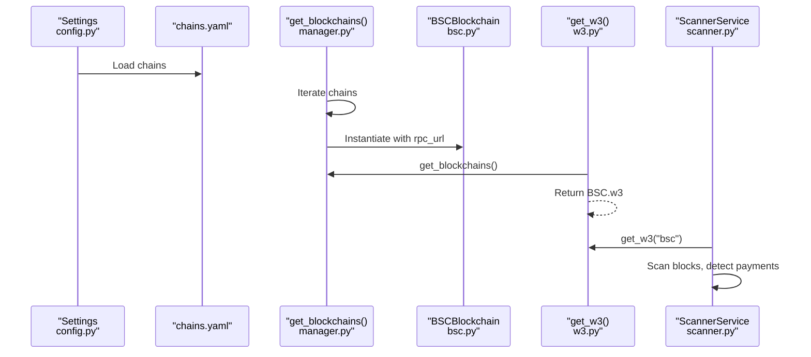
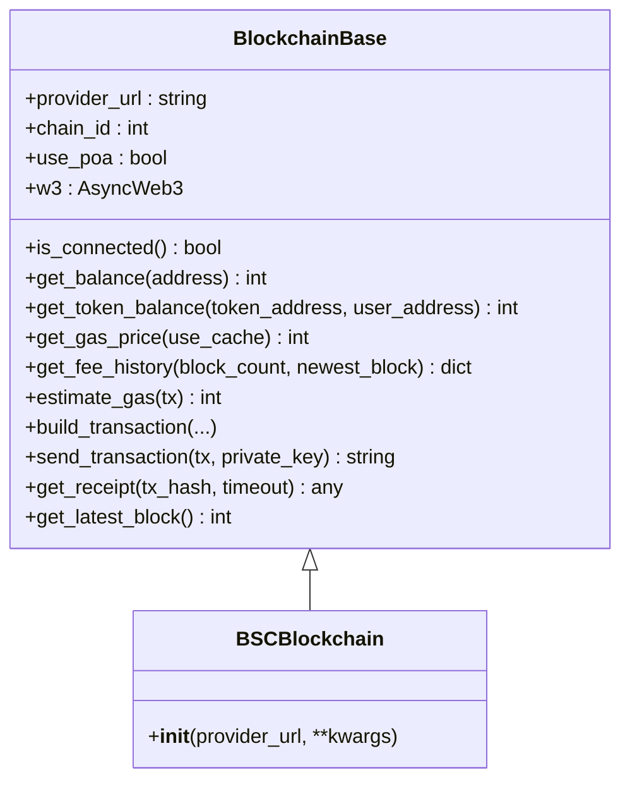
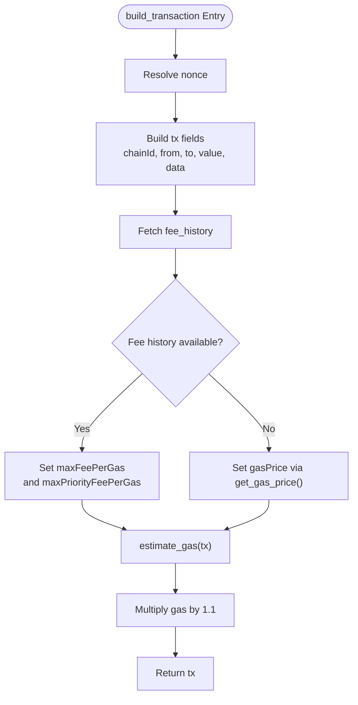
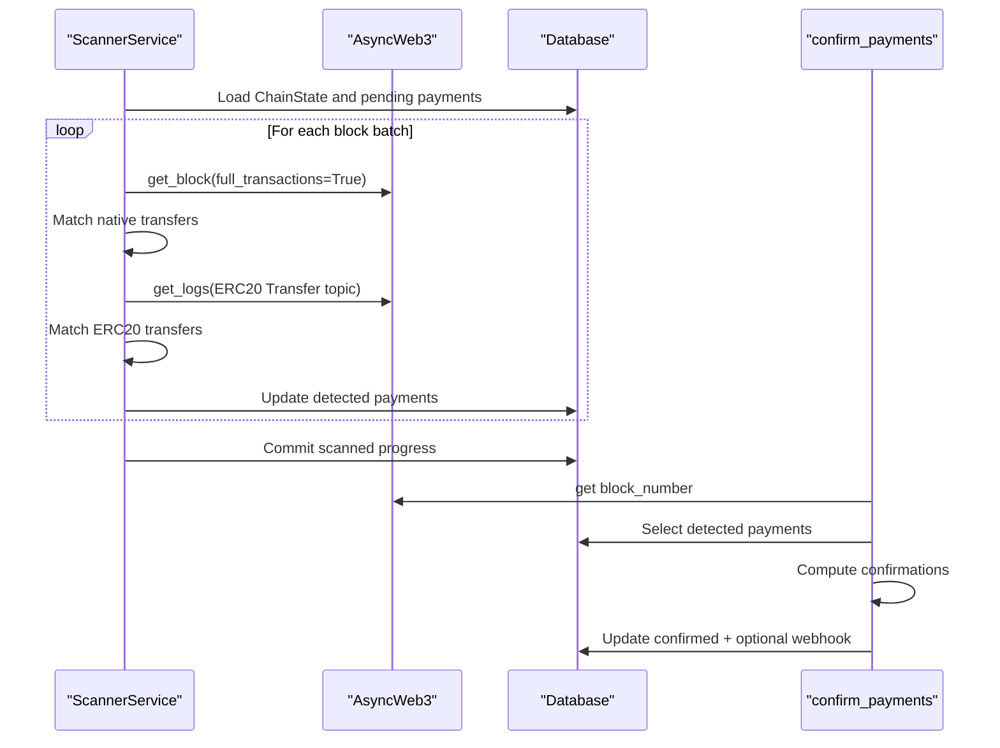
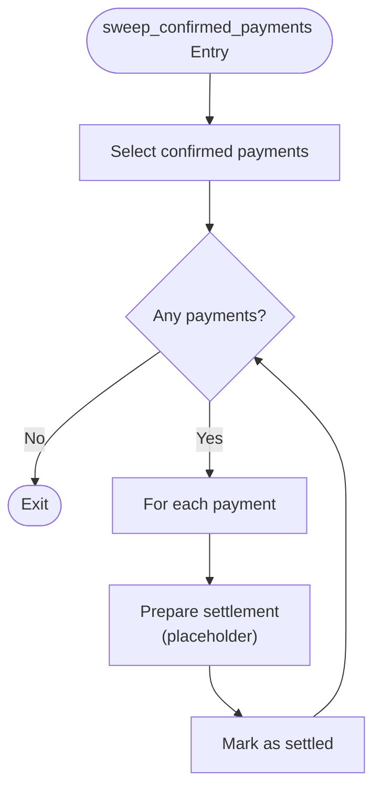
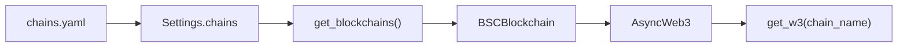
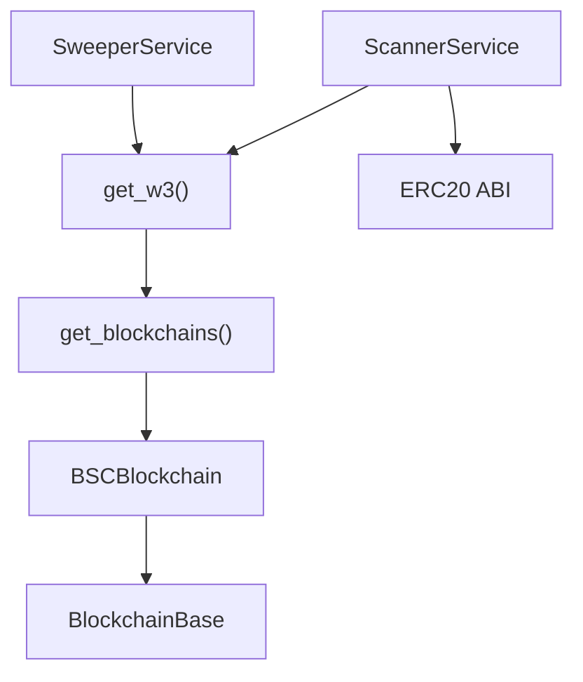

# BSC Implementation

<cite>
**Referenced Files in This Document**
- [app/blockchain/bsc.py](file://app/blockchain/bsc.py)
- [app/blockchain/base.py](file://app/blockchain/base.py)
- [app/blockchain/ethereum.py](file://app/blockchain/ethereum.py)
- [app/blockchain/anvil.py](file://app/blockchain/anvil.py)
- [app/blockchain/manager.py](file://app/blockchain/manager.py)
- [app/blockchain/w3.py](file://app/blockchain/w3.py)
- [app/blockchain/ABI/ERC20.json](file://app/blockchain/ABI/ERC20.json)
- [chains.yaml](file://chains.yaml)
- [app/core/config.py](file://app/core/config.py)
- [app/services/blockchain/scanner.py](file://app/services/blockchain/scanner.py)
- [app/services/blockchain/sweeper.py](file://app/services/blockchain/sweeper.py)
- [app/db/models/chain.py](file://app/db/models/chain.py)
- [app/db/models/token.py](file://app/db/models/token.py)
</cite>

## Table of Contents
1. [Introduction](#introduction)
2. [Project Structure](#project-structure)
3. [Core Components](#core-components)
4. [Architecture Overview](#architecture-overview)
5. [Detailed Component Analysis](#detailed-component-analysis)
6. [Dependency Analysis](#dependency-analysis)
7. [Performance Considerations](#performance-considerations)
8. [Troubleshooting Guide](#troubleshooting-guide)
9. [Conclusion](#conclusion)
10. [Appendices](#appendices)

## Introduction
This document explains the Binance Smart Chain (BSC) implementation in the codebase. It focuses on the BSCBlockchain class, network-specific optimizations, RPC configuration, and transaction monitoring via scanning and sweeping services. It also covers BSC mainnet configuration, token standard support (ERC-20), integration patterns, performance considerations, and troubleshooting steps.

## Project Structure
The BSC implementation is organized around a shared base class and a specialized BSC subclass, with configuration loaded from a YAML file and accessed through a central manager and Web3 accessor.

**Diagram sources**
- [app/blockchain/base.py](file://app/blockchain/base.py#L22-L146)
- [app/blockchain/bsc.py](file://app/blockchain/bsc.py#L1-L7)
- [app/blockchain/ethereum.py](file://app/blockchain/ethereum.py#L1-L7)
- [app/blockchain/anvil.py](file://app/blockchain/anvil.py#L1-L57)
- [app/blockchain/manager.py](file://app/blockchain/manager.py#L8-L33)
- [app/blockchain/w3.py](file://app/blockchain/w3.py#L1-L9)
- [app/core/config.py](file://app/core/config.py#L44-L57)
- [chains.yaml](file://chains.yaml#L12-L18)
- [app/services/blockchain/scanner.py](file://app/services/blockchain/scanner.py#L14-L134)
- [app/services/blockchain/sweeper.py](file://app/services/blockchain/sweeper.py#L11-L54)
- [app/db/models/chain.py](file://app/db/models/chain.py#L9-L17)
- [app/db/models/token.py](file://app/db/models/token.py#L6-L15)

**Section sources**
- [app/blockchain/bsc.py](file://app/blockchain/bsc.py#L1-L7)
- [app/blockchain/base.py](file://app/blockchain/base.py#L22-L146)
- [app/blockchain/manager.py](file://app/blockchain/manager.py#L8-L33)
- [app/blockchain/w3.py](file://app/blockchain/w3.py#L1-L9)
- [app/core/config.py](file://app/core/config.py#L44-L57)
- [chains.yaml](file://chains.yaml#L12-L18)

## Core Components
- BSCBlockchain: Specializes the base blockchain client for BSC mainnet with chain ID 56 and Proof-of-Authority middleware enabled.
- BlockchainBase: Provides shared RPC connectivity, gas estimation, transaction building, signing, sending, and receipt polling. Includes EIP-1559 fee handling and a gas cache.
- Manager and W3 Accessor: Centralized factory that loads chain configs and exposes AsyncWeb3 instances per chain.
- ScannerService: Scans blocks for native and ERC-20 payments, updates detection state, and triggers confirmations.
- SweeperService: Collects confirmed payments and prepares settlement logic (placeholder in this codebase).
- Models: ChainState tracks scanned progress; Token defines supported tokens per chain.

Key BSC specifics:
- Chain ID 56 and POA middleware enable compatibility with BSC’s consensus.
- Gas optimization via EIP-1559 fee history fallback to legacy gas price.
- ERC-20 support via shared ABI and log-based detection.

**Section sources**
- [app/blockchain/bsc.py](file://app/blockchain/bsc.py#L3-L6)
- [app/blockchain/base.py](file://app/blockchain/base.py#L22-L146)
- [app/blockchain/manager.py](file://app/blockchain/manager.py#L8-L33)
- [app/blockchain/w3.py](file://app/blockchain/w3.py#L6-L9)
- [app/services/blockchain/scanner.py](file://app/services/blockchain/scanner.py#L14-L134)
- [app/services/blockchain/sweeper.py](file://app/services/blockchain/sweeper.py#L11-L54)
- [app/db/models/chain.py](file://app/db/models/chain.py#L9-L17)
- [app/db/models/token.py](file://app/db/models/token.py#L6-L15)

## Architecture Overview
The BSC implementation follows a layered design:
- Configuration layer: chains.yaml and Settings load chain definitions.
- Factory layer: get_blockchains builds chain-specific clients.
- Accessor layer: get_w3 retrieves AsyncWeb3 for a named chain.
- Services layer: ScannerService monitors chain activity; SweeperService handles settlement.

**Diagram sources**
- [app/core/config.py](file://app/core/config.py#L44-L57)
- [chains.yaml](file://chains.yaml#L12-L18)
- [app/blockchain/manager.py](file://app/blockchain/manager.py#L8-L33)
- [app/blockchain/bsc.py](file://app/blockchain/bsc.py#L3-L6)
- [app/blockchain/w3.py](file://app/blockchain/w3.py#L6-L9)
- [app/services/blockchain/scanner.py](file://app/services/blockchain/scanner.py#L20-L96)

## Detailed Component Analysis

### BSCBlockchain Class
BSCBlockchain extends the base client and sets:
- chain_id to 56 for BSC mainnet.
- use_poa to True to enable POA middleware for ExtraData compatibility.

**Diagram sources**
- [app/blockchain/base.py](file://app/blockchain/base.py#L22-L146)
- [app/blockchain/bsc.py](file://app/blockchain/bsc.py#L3-L6)

**Section sources**
- [app/blockchain/bsc.py](file://app/blockchain/bsc.py#L3-L6)
- [app/blockchain/base.py](file://app/blockchain/base.py#L22-L146)

### Transaction Building and Gas Optimization
The base class implements EIP-1559 fee calculation using fee history and falls back to legacy gas pricing. It caches gas prices and adds a small buffer to gas estimates.

**Diagram sources**
- [app/blockchain/base.py](file://app/blockchain/base.py#L93-L133)
- [app/blockchain/base.py](file://app/blockchain/base.py#L65-L81)

**Section sources**
- [app/blockchain/base.py](file://app/blockchain/base.py#L65-L133)

### Transaction Monitoring and Confirmation
The ScannerService scans blocks for native and ERC-20 transfers, marks detections, and confirms after a configurable number of confirmations. Confirmations trigger optional webhooks.

**Diagram sources**
- [app/services/blockchain/scanner.py](file://app/services/blockchain/scanner.py#L20-L96)
- [app/services/blockchain/scanner.py](file://app/services/blockchain/scanner.py#L97-L134)
- [app/db/models/chain.py](file://app/db/models/chain.py#L9-L17)
- [app/db/models/token.py](file://app/db/models/token.py#L6-L15)

**Section sources**
- [app/services/blockchain/scanner.py](file://app/services/blockchain/scanner.py#L14-L134)
- [app/db/models/chain.py](file://app/db/models/chain.py#L9-L17)
- [app/db/models/token.py](file://app/db/models/token.py#L6-L15)

### Settlement Workflow
The SweeperService identifies confirmed payments and prepares settlement logic. In this codebase, settlement is a placeholder; production systems would sign and submit transactions here.

**Diagram sources**
- [app/services/blockchain/sweeper.py](file://app/services/blockchain/sweeper.py#L16-L54)

**Section sources**
- [app/services/blockchain/sweeper.py](file://app/services/blockchain/sweeper.py#L11-L54)

### Configuration and Integration Patterns
- Chains are defined in chains.yaml with name, RPC URL, and token metadata.
- Settings.chains property loads and parses the YAML.
- get_blockchains constructs BSCBlockchain instances for configured chains.
- get_w3 resolves an AsyncWeb3 instance by chain name.

**Diagram sources**
- [chains.yaml](file://chains.yaml#L12-L18)
- [app/core/config.py](file://app/core/config.py#L44-L57)
- [app/blockchain/manager.py](file://app/blockchain/manager.py#L8-L33)
- [app/blockchain/w3.py](file://app/blockchain/w3.py#L6-L9)

**Section sources**
- [chains.yaml](file://chains.yaml#L12-L18)
- [app/core/config.py](file://app/core/config.py#L44-L57)
- [app/blockchain/manager.py](file://app/blockchain/manager.py#L8-L33)
- [app/blockchain/w3.py](file://app/blockchain/w3.py#L6-L9)

## Dependency Analysis
- BSCBlockchain depends on BlockchainBase for RPC, gas, and transaction primitives.
- Manager selects BSCBlockchain when chains.yaml specifies name "bsc".
- ScannerService and SweeperService depend on get_w3 to access BSC.w3.
- ERC-20 detection relies on shared ABI and event topic filtering.

**Diagram sources**
- [app/blockchain/bsc.py](file://app/blockchain/bsc.py#L3-L6)
- [app/blockchain/base.py](file://app/blockchain/base.py#L22-L146)
- [app/blockchain/manager.py](file://app/blockchain/manager.py#L8-L33)
- [app/blockchain/w3.py](file://app/blockchain/w3.py#L6-L9)
- [app/services/blockchain/scanner.py](file://app/services/blockchain/scanner.py#L12)
- [app/blockchain/ABI/ERC20.json](file://app/blockchain/ABI/ERC20.json#L1-L1)

**Section sources**
- [app/blockchain/bsc.py](file://app/blockchain/bsc.py#L3-L6)
- [app/blockchain/base.py](file://app/blockchain/base.py#L22-L146)
- [app/blockchain/manager.py](file://app/blockchain/manager.py#L8-L33)
- [app/blockchain/w3.py](file://app/blockchain/w3.py#L6-L9)
- [app/services/blockchain/scanner.py](file://app/services/blockchain/scanner.py#L12)
- [app/blockchain/ABI/ERC20.json](file://app/blockchain/ABI/ERC20.json#L1-L1)

## Performance Considerations
- Gas optimization:
  - EIP-1559 fee calculation reduces variability and improves throughput predictability.
  - Gas cache avoids frequent RPC calls; gas estimates include a small buffer to prevent failures.
- Block scanning:
  - Batch size controls RPC load; adjust to balance responsiveness and provider rate limits.
  - Confirmations reduce reorg risk; tune based on chain stability and SLAs.
- Network reliability:
  - AsyncWeb3 with timeouts supports resilient connections; monitor connection health and retry strategies.
- Throughput expectations:
  - BSC’s faster block times compared to Ethereum enable quicker confirmations; align confirmation thresholds accordingly.

[No sources needed since this section provides general guidance]

## Troubleshooting Guide
Common issues and remedies:
- Provider connectivity:
  - Verify provider URL and network reachability; use is_connected checks and logs.
- POA middleware:
  - Ensure use_poa is enabled for BSC to handle ExtraData; misconfiguration causes signature errors.
- Gas estimation failures:
  - Fallback values are applied when estimation fails; validate transaction parameters and balances.
- Missing chain configuration:
  - Confirm chains.yaml includes the "bsc" entry with a valid RPC URL; otherwise, manager falls back to local Anvil.
- Detection gaps:
  - Adjust block batch size and confirmations; ensure ChainState last_scanned_block is advancing.
- Token detection:
  - Confirm token addresses and decimals match chains.yaml; ERC-20 topics must match the ABI.

**Section sources**
- [app/blockchain/base.py](file://app/blockchain/base.py#L45-L50)
- [app/blockchain/base.py](file://app/blockchain/base.py#L86-L92)
- [app/blockchain/manager.py](file://app/blockchain/manager.py#L28-L32)
- [app/services/blockchain/scanner.py](file://app/services/blockchain/scanner.py#L34-L96)
- [chains.yaml](file://chains.yaml#L12-L18)

## Conclusion
The BSC implementation leverages a shared base class for RPC, gas, and transaction primitives while specializing BSC with chain ID 56 and POA middleware. Configuration-driven instantiation and a centralized Web3 accessor enable clean integration. The scanner and sweeper services provide robust monitoring and settlement foundations, with room for production enhancements such as dynamic gas buffers, improved error handling, and token-native sweeping logic.

[No sources needed since this section summarizes without analyzing specific files]

## Appendices

### BSC Mainnet and Testnet Configuration
- Mainnet:
  - Chain name: "bsc"
  - RPC URL: BSC mainnet endpoint
  - Tokens: USDT with chain address and decimals
- Testnet:
  - Not explicitly configured in the provided chains.yaml; add a new entry with a testnet RPC URL and token addresses if needed.

**Section sources**
- [chains.yaml](file://chains.yaml#L12-L18)

### Token Standard Support
- ERC-20:
  - Shared ABI enables balance queries and transfer log detection.
  - ScannerService filters ERC-20 Transfer events by topic and verifies token address and amount.

**Section sources**
- [app/blockchain/ABI/ERC20.json](file://app/blockchain/ABI/ERC20.json#L1-L1)
- [app/services/blockchain/scanner.py](file://app/services/blockchain/scanner.py#L71-L92)

### Practical Configuration Examples
- Define BSC chain in chains.yaml with rpc_url and tokens.
- Ensure Settings.chains is loaded and get_blockchains instantiates BSCBlockchain.
- Use get_w3("bsc") to access AsyncWeb3 for BSC operations.

**Section sources**
- [chains.yaml](file://chains.yaml#L12-L18)
- [app/core/config.py](file://app/core/config.py#L44-L57)
- [app/blockchain/manager.py](file://app/blockchain/manager.py#L8-L33)
- [app/blockchain/w3.py](file://app/blockchain/w3.py#L6-L9)