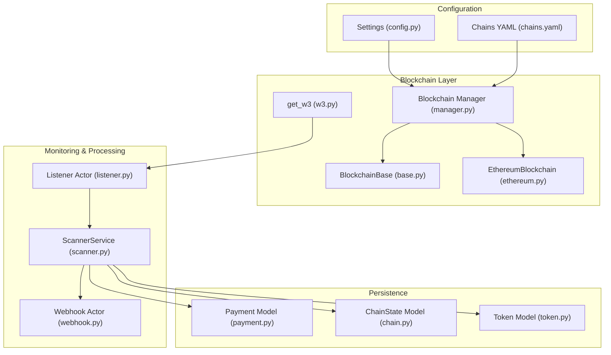
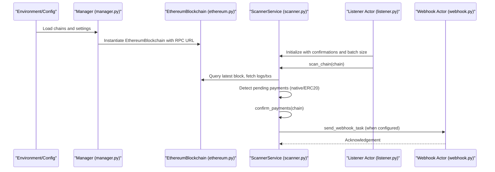
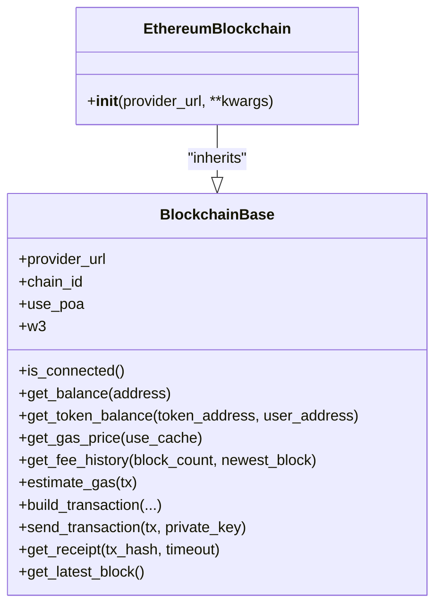
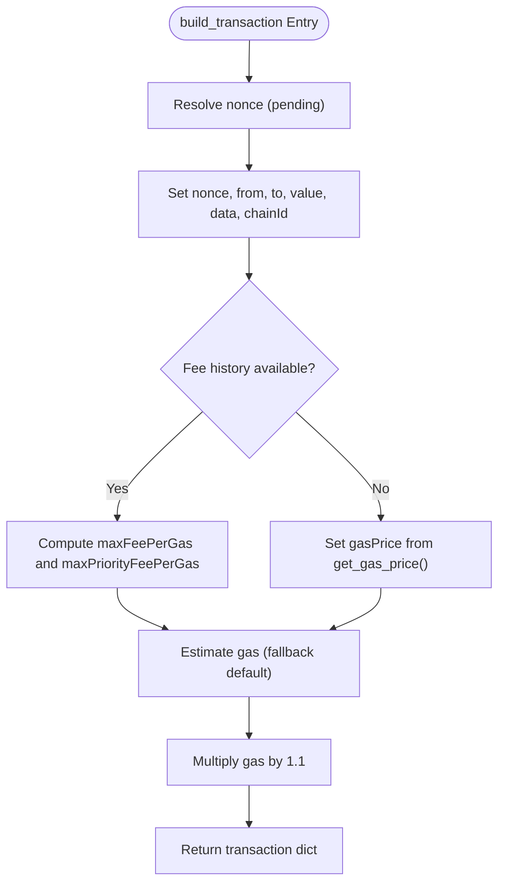
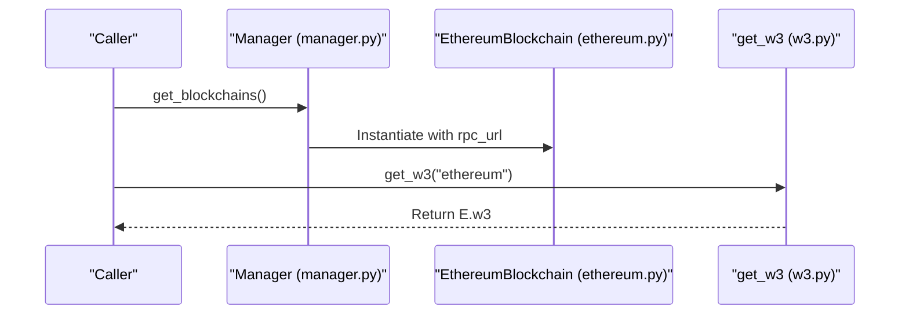
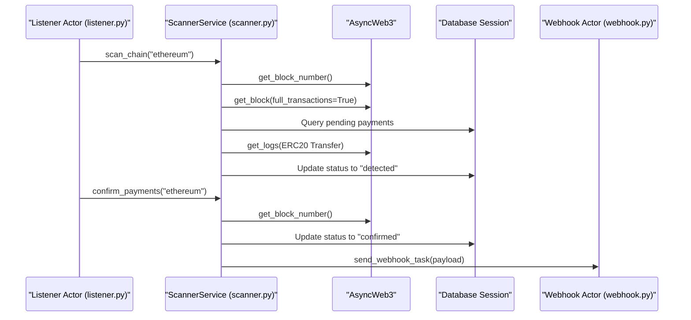
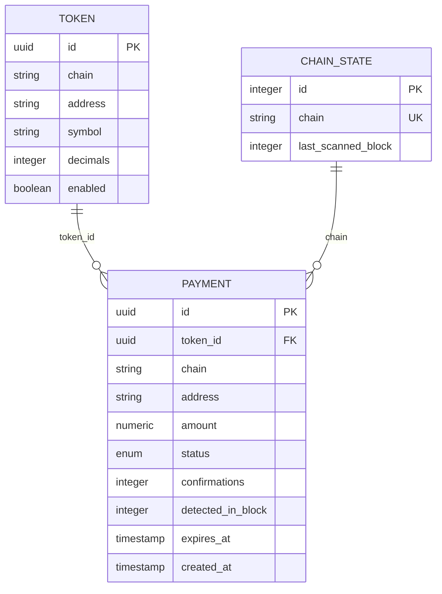
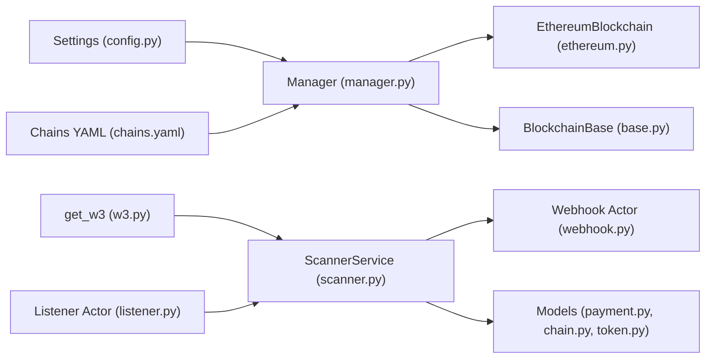

# Ethereum Implementation

<cite>
**Referenced Files in This Document**
- [ethereum.py](https://github.com/rakibhossain72/ctrip/blob/main/app/blockchain/ethereum.py)
- [base.py](https://github.com/rakibhossain72/ctrip/blob/main/app/blockchain/base.py)
- [manager.py](https://github.com/rakibhossain72/ctrip/blob/main/app/blockchain/manager.py)
- [w3.py](https://github.com/rakibhossain72/ctrip/blob/main/app/blockchain/w3.py)
- [config.py](https://github.com/rakibhossain72/ctrip/blob/main/app/core/config.py)
- [scanner.py](https://github.com/rakibhossain72/ctrip/blob/main/app/services/blockchain/scanner.py)
- [listener.py](https://github.com/rakibhossain72/ctrip/blob/main/app/workers/listener.py)
- [webhook.py](https://github.com/rakibhossain72/ctrip/blob/main/app/workers/webhook.py)
- [payment.py](https://github.com/rakibhossain72/ctrip/blob/main/app/db/models/payment.py)
- [chain.py](https://github.com/rakibhossain72/ctrip/blob/main/app/db/models/chain.py)
- [token.py](https://github.com/rakibhossain72/ctrip/blob/main/app/db/models/token.py)
- [chains.yaml](https://github.com/rakibhossain72/ctrip/blob/main/chains.yaml)
</cite>

## Table of Contents
1. [Introduction](#introduction)
2. [Project Structure](#project-structure)
3. [Core Components](#core-components)
4. [Architecture Overview](#architecture-overview)
5. [Detailed Component Analysis](#detailed-component-analysis)
6. [Dependency Analysis](#dependency-analysis)
7. [Performance Considerations](#performance-considerations)
8. [Troubleshooting Guide](#troubleshooting-guide)
9. [Conclusion](#conclusion)
10. [Appendices](#appendices)

## Introduction
This document explains the Ethereum blockchain implementation in the project, focusing on the EthereumBlockchain class, RPC configuration, transaction monitoring, gas management, and Ethereum-specific optimizations. It also covers network considerations, performance tuning, transaction receipt handling, event-based payment detection, confirmation thresholds, and production best practices.

## Project Structure
The Ethereum implementation centers around a shared base class that encapsulates common blockchain operations and an Ethereum-specific subclass that sets mainnet defaults. Configuration is loaded from environment and a chains YAML file, and scanning/confirmation logic is implemented in a service orchestrated by a worker.

**Diagram sources**
- [config.py](https://github.com/rakibhossain72/ctrip/blob/main/app/core/config.py#L10-L126)
- [chains.yaml](https://github.com/rakibhossain72/ctrip/blob/main/chains.yaml#L1-L24)
- [manager.py](https://github.com/rakibhossain72/ctrip/blob/main/app/blockchain/manager.py#L8-L33)
- [ethereum.py](https://github.com/rakibhossain72/ctrip/blob/main/app/blockchain/ethereum.py#L3-L7)
- [base.py](https://github.com/rakibhossain72/ctrip/blob/main/app/blockchain/base.py#L22-L146)
- [w3.py](https://github.com/rakibhossain72/ctrip/blob/main/app/blockchain/w3.py#L1-L9)
- [listener.py](https://github.com/rakibhossain72/ctrip/blob/main/app/workers/listener.py#L21-L46)
- [scanner.py](https://github.com/rakibhossain72/ctrip/blob/main/app/services/blockchain/scanner.py#L14-L134)
- [webhook.py](https://github.com/rakibhossain72/ctrip/blob/main/app/workers/webhook.py#L13-L37)
- [payment.py](https://github.com/rakibhossain72/ctrip/blob/main/app/db/models/payment.py#L41-L74)
- [chain.py](https://github.com/rakibhossain72/ctrip/blob/main/app/db/models/chain.py#L9-L17)
- [token.py](https://github.com/rakibhossain72/ctrip/blob/main/app/db/models/token.py#L6-L15)

**Section sources**
- [config.py](https://github.com/rakibhossain72/ctrip/blob/main/app/core/config.py#L10-L126)
- [chains.yaml](https://github.com/rakibhossain72/ctrip/blob/main/chains.yaml#L1-L24)
- [manager.py](https://github.com/rakibhossain72/ctrip/blob/main/app/blockchain/manager.py#L8-L33)
- [ethereum.py](https://github.com/rakibhossain72/ctrip/blob/main/app/blockchain/ethereum.py#L3-L7)
- [base.py](https://github.com/rakibhossain72/ctrip/blob/main/app/blockchain/base.py#L22-L146)
- [w3.py](https://github.com/rakibhossain72/ctrip/blob/main/app/blockchain/w3.py#L1-L9)
- [listener.py](https://github.com/rakibhossain72/ctrip/blob/main/app/workers/listener.py#L21-L46)
- [scanner.py](https://github.com/rakibhossain72/ctrip/blob/main/app/services/blockchain/scanner.py#L14-L134)
- [webhook.py](https://github.com/rakibhossain72/ctrip/blob/main/app/workers/webhook.py#L13-L37)
- [payment.py](https://github.com/rakibhossain72/ctrip/blob/main/app/db/models/payment.py#L41-L74)
- [chain.py](https://github.com/rakibhossain72/ctrip/blob/main/app/db/models/chain.py#L9-L17)
- [token.py](https://github.com/rakibhossain72/ctrip/blob/main/app/db/models/token.py#L6-L15)

## Core Components
- EthereumBlockchain: Extends the base class with Ethereum mainnet defaults (chain ID 1, no POA middleware).
- BlockchainBase: Provides AsyncWeb3 client initialization, POA middleware toggle, gas price caching, fee history retrieval, gas estimation, transaction building (including EIP-1559 support), signing and sending, receipt polling, and block number queries.
- Manager: Builds a registry of configured blockchains from settings and chains YAML, instantiating EthereumBlockchain for Ethereum.
- get_w3: Returns the AsyncWeb3 instance for a named chain.
- ScannerService: Scans blocks for native and ERC20 payments, detects and confirms them based on a configurable confirmation threshold, and triggers webhooks.
- Listener Actor: Periodically runs scanning and confirmation cycles for configured chains.
- Webhook Actor: Asynchronously sends webhooks for confirmed payments.
- Models: Define payment lifecycle, chain state, and token metadata.

**Section sources**
- [ethereum.py](https://github.com/rakibhossain72/ctrip/blob/main/app/blockchain/ethereum.py#L3-L7)
- [base.py](https://github.com/rakibhossain72/ctrip/blob/main/app/blockchain/base.py#L22-L146)
- [manager.py](https://github.com/rakibhossain72/ctrip/blob/main/app/blockchain/manager.py#L8-L33)
- [w3.py](https://github.com/rakibhossain72/ctrip/blob/main/app/blockchain/w3.py#L1-L9)
- [scanner.py](https://github.com/rakibhossain72/ctrip/blob/main/app/services/blockchain/scanner.py#L14-L134)
- [listener.py](https://github.com/rakibhossain72/ctrip/blob/main/app/workers/listener.py#L21-L46)
- [webhook.py](https://github.com/rakibhossain72/ctrip/blob/main/app/workers/webhook.py#L13-L37)
- [payment.py](https://github.com/rakibhossain72/ctrip/blob/main/app/db/models/payment.py#L41-L74)
- [chain.py](https://github.com/rakibhossain72/ctrip/blob/main/app/db/models/chain.py#L9-L17)
- [token.py](https://github.com/rakibhossain72/ctrip/blob/main/app/db/models/token.py#L6-L15)

## Architecture Overview
The system integrates configuration-driven blockchain instantiation, asynchronous scanning, and confirmation logic with optional webhook notifications.

**Diagram sources**
- [config.py](https://github.com/rakibhossain72/ctrip/blob/main/app/core/config.py#L10-L126)
- [chains.yaml](https://github.com/rakibhossain72/ctrip/blob/main/chains.yaml#L1-L24)
- [manager.py](https://github.com/rakibhossain72/ctrip/blob/main/app/blockchain/manager.py#L8-L33)
- [ethereum.py](https://github.com/rakibhossain72/ctrip/blob/main/app/blockchain/ethereum.py#L3-L7)
- [scanner.py](https://github.com/rakibhossain72/ctrip/blob/main/app/services/blockchain/scanner.py#L14-L134)
- [listener.py](https://github.com/rakibhossain72/ctrip/blob/main/app/workers/listener.py#L21-L46)
- [webhook.py](https://github.com/rakibhossain72/ctrip/blob/main/app/workers/webhook.py#L13-L37)

## Detailed Component Analysis

### EthereumBlockchain
- Purpose: Specialization of the base class for Ethereum mainnet.
- Defaults: Sets chain ID to 1 and disables POA middleware.
- Integration: Used by the manager when the chain name is "ethereum".

**Diagram sources**
- [base.py](https://github.com/rakibhossain72/ctrip/blob/main/app/blockchain/base.py#L22-L146)
- [ethereum.py](https://github.com/rakibhossain72/ctrip/blob/main/app/blockchain/ethereum.py#L3-L7)

**Section sources**
- [ethereum.py](https://github.com/rakibhossain72/ctrip/blob/main/app/blockchain/ethereum.py#L3-L7)
- [base.py](https://github.com/rakibhossain72/ctrip/blob/main/app/blockchain/base.py#L22-L146)

### BlockchainBase: Gas Management and Transaction Building
- Gas price caching: Stores last fetched gas price and timestamp, caches for a short duration.
- Fee history: Retrieves EIP-1559 fee history to compute maxFeePerGas and maxPriorityFeePerGas.
- Legacy fallback: Uses gasPrice if fee history is unavailable.
- Gas estimation: Estimates gas with a default fallback when estimation fails.
- Transaction building: Adds chainId, nonce, and gas parameters; applies 10% gas limit buffer.
- Signing and sending: Uses a private key to sign and send raw transactions.
- Receipt polling: Waits for transaction receipts with a configurable timeout.

**Diagram sources**
- [base.py](https://github.com/rakibhossain72/ctrip/blob/main/app/blockchain/base.py#L93-L133)

**Section sources**
- [base.py](https://github.com/rakibhossain72/ctrip/blob/main/app/blockchain/base.py#L65-L146)

### Configuration and RPC Setup
- Settings: Centralized configuration including RPC URL, chains YAML path, and private key validation.
- Chains YAML: Defines per-chain RPC endpoints and token metadata; Ethereum configuration is commented out by default.
- Manager: Instantiates EthereumBlockchain when the chain name matches "ethereum".
- get_w3: Provides AsyncWeb3 instance for a given chain name.

**Diagram sources**
- [config.py](https://github.com/rakibhossain72/ctrip/blob/main/app/core/config.py#L28-L56)
- [chains.yaml](https://github.com/rakibhossain72/ctrip/blob/main/chains.yaml#L1-L24)
- [manager.py](https://github.com/rakibhossain72/ctrip/blob/main/app/blockchain/manager.py#L8-L33)
- [ethereum.py](https://github.com/rakibhossain72/ctrip/blob/main/app/blockchain/ethereum.py#L3-L7)
- [w3.py](https://github.com/rakibhossain72/ctrip/blob/main/app/blockchain/w3.py#L1-L9)

**Section sources**
- [config.py](https://github.com/rakibhossain72/ctrip/blob/main/app/core/config.py#L28-L56)
- [chains.yaml](https://github.com/rakibhossain72/ctrip/blob/main/chains.yaml#L1-L24)
- [manager.py](https://github.com/rakibhossain72/ctrip/blob/main/app/blockchain/manager.py#L8-L33)
- [w3.py](https://github.com/rakibhossain72/ctrip/blob/main/app/blockchain/w3.py#L1-L9)

### Transaction Monitoring and Confirmation
- ScannerService:
  - Scans blocks within a batch window, detects native and ERC20 transfers.
  - Updates payment status to "detected" when amounts meet thresholds.
  - Confirms payments after a configurable number of confirmations.
  - Emits webhooks upon confirmation when configured.
- Listener Actor: Runs periodic scanning and confirmation cycles for all configured chains.
- Webhook Actor: Sends asynchronous webhooks with signed payloads.

**Diagram sources**
- [listener.py](https://github.com/rakibhossain72/ctrip/blob/main/app/workers/listener.py#L21-L46)
- [scanner.py](https://github.com/rakibhossain72/ctrip/blob/main/app/services/blockchain/scanner.py#L14-L134)
- [webhook.py](https://github.com/rakibhossain72/ctrip/blob/main/app/workers/webhook.py#L13-L37)
- [payment.py](https://github.com/rakibhossain72/ctrip/blob/main/app/db/models/payment.py#L41-L74)
- [chain.py](https://github.com/rakibhossain72/ctrip/blob/main/app/db/models/chain.py#L9-L17)
- [token.py](https://github.com/rakibhossain72/ctrip/blob/main/app/db/models/token.py#L6-L15)

**Section sources**
- [scanner.py](https://github.com/rakibhossain72/ctrip/blob/main/app/services/blockchain/scanner.py#L14-L134)
- [listener.py](https://github.com/rakibhossain72/ctrip/blob/main/app/workers/listener.py#L21-L46)
- [webhook.py](https://github.com/rakibhossain72/ctrip/blob/main/app/workers/webhook.py#L13-L37)
- [payment.py](https://github.com/rakibhossain72/ctrip/blob/main/app/db/models/payment.py#L41-L74)
- [chain.py](https://github.com/rakibhossain72/ctrip/blob/main/app/db/models/chain.py#L9-L17)
- [token.py](https://github.com/rakibhossain72/ctrip/blob/main/app/db/models/token.py#L6-L15)

### Data Models for Payments and Chain State
- Payment: Tracks chain, address, amount, status, confirmations, detection block, expiration, and timestamps.
- ChainState: Tracks the last scanned block per chain.
- Token: Holds token metadata including address, symbol, decimals, and chain.

**Diagram sources**
- [payment.py](https://github.com/rakibhossain72/ctrip/blob/main/app/db/models/payment.py#L41-L74)
- [token.py](https://github.com/rakibhossain72/ctrip/blob/main/app/db/models/token.py#L6-L15)
- [chain.py](https://github.com/rakibhossain72/ctrip/blob/main/app/db/models/chain.py#L9-L17)

**Section sources**
- [payment.py](https://github.com/rakibhossain72/ctrip/blob/main/app/db/models/payment.py#L41-L74)
- [token.py](https://github.com/rakibhossain72/ctrip/blob/main/app/db/models/token.py#L6-L15)
- [chain.py](https://github.com/rakibhossain72/ctrip/blob/main/app/db/models/chain.py#L9-L17)

## Dependency Analysis
- Manager depends on settings and chains YAML to instantiate EthereumBlockchain.
- EthereumBlockchain inherits from BlockchainBase, reusing gas and transaction logic.
- get_w3 provides a centralized AsyncWeb3 accessor used by the scanner.
- ScannerService depends on AsyncWeb3, database models, and the webhook actor.
- Listener Actor orchestrates ScannerService and schedules periodic runs.
- Webhook Actor depends on a webhook service to deliver notifications.

**Diagram sources**
- [config.py](https://github.com/rakibhossain72/ctrip/blob/main/app/core/config.py#L10-L126)
- [chains.yaml](https://github.com/rakibhossain72/ctrip/blob/main/chains.yaml#L1-L24)
- [manager.py](https://github.com/rakibhossain72/ctrip/blob/main/app/blockchain/manager.py#L8-L33)
- [ethereum.py](https://github.com/rakibhossain72/ctrip/blob/main/app/blockchain/ethereum.py#L3-L7)
- [base.py](https://github.com/rakibhossain72/ctrip/blob/main/app/blockchain/base.py#L22-L146)
- [w3.py](https://github.com/rakibhossain72/ctrip/blob/main/app/blockchain/w3.py#L1-L9)
- [scanner.py](https://github.com/rakibhossain72/ctrip/blob/main/app/services/blockchain/scanner.py#L14-L134)
- [listener.py](https://github.com/rakibhossain72/ctrip/blob/main/app/workers/listener.py#L21-L46)
- [webhook.py](https://github.com/rakibhossain72/ctrip/blob/main/app/workers/webhook.py#L13-L37)
- [payment.py](https://github.com/rakibhossain72/ctrip/blob/main/app/db/models/payment.py#L41-L74)
- [chain.py](https://github.com/rakibhossain72/ctrip/blob/main/app/db/models/chain.py#L9-L17)
- [token.py](https://github.com/rakibhossain72/ctrip/blob/main/app/db/models/token.py#L6-L15)

**Section sources**
- [config.py](https://github.com/rakibhossain72/ctrip/blob/main/app/core/config.py#L10-L126)
- [chains.yaml](https://github.com/rakibhossain72/ctrip/blob/main/chains.yaml#L1-L24)
- [manager.py](https://github.com/rakibhossain72/ctrip/blob/main/app/blockchain/manager.py#L8-L33)
- [ethereum.py](https://github.com/rakibhossain72/ctrip/blob/main/app/blockchain/ethereum.py#L3-L7)
- [base.py](https://github.com/rakibhossain72/ctrip/blob/main/app/blockchain/base.py#L22-L146)
- [w3.py](https://github.com/rakibhossain72/ctrip/blob/main/app/blockchain/w3.py#L1-L9)
- [scanner.py](https://github.com/rakibhossain72/ctrip/blob/main/app/services/blockchain/scanner.py#L14-L134)
- [listener.py](https://github.com/rakibhossain72/ctrip/blob/main/app/workers/listener.py#L21-L46)
- [webhook.py](https://github.com/rakibhossain72/ctrip/blob/main/app/workers/webhook.py#L13-L37)
- [payment.py](https://github.com/rakibhossain72/ctrip/blob/main/app/db/models/payment.py#L41-L74)
- [chain.py](https://github.com/rakibhossain72/ctrip/blob/main/app/db/models/chain.py#L9-L17)
- [token.py](https://github.com/rakibhossain72/ctrip/blob/main/app/db/models/token.py#L6-L15)

## Performance Considerations
- Gas price caching: Reduces repeated RPC calls for gas price by caching for a short duration.
- Fee history usage: Prefer EIP-1559 pricing when available; fallback to legacy gasPrice ensures compatibility.
- Gas estimation with buffer: Applies a 10% gas limit buffer to reduce underestimation risk.
- Batch scanning: Scanning blocks in batches reduces load and improves throughput.
- Confirmation threshold: Adjust confirmations_required to balance speed vs. reorg safety.
- Timeout tuning: Receipt polling timeout can be tuned via get_receipt to match network conditions.
- Network selection: Use reliable RPC providers for mainnet to minimize latency and failures.

[No sources needed since this section provides general guidance]

## Troubleshooting Guide
- Connection failures: Use is_connected to detect provider issues; check provider_url and network availability.
- Gas estimation errors: The base class falls back to conservative defaults when estimation fails; review transaction parameters.
- Missing receipts: Increase timeout in get_receipt or ensure the provider supports wait_for_transaction_receipt.
- Incorrect balances: Verify checksum addresses and token contract ABI; ensure token_address and user_address are properly formatted.
- Webhook delivery issues: Inspect webhook actor logs and retry configuration; ensure webhook_url and secret are set.
- Chain state gaps: Confirm ChainState updates after each scan cycle; verify last_scanned_block increments.
- Private key validation: Settings enforce valid Ethereum private keys; ensure private_key is set and correct.

**Section sources**
- [base.py](https://github.com/rakibhossain72/ctrip/blob/main/app/blockchain/base.py#L45-L50)
- [base.py](https://github.com/rakibhossain72/ctrip/blob/main/app/blockchain/base.py#L86-L92)
- [base.py](https://github.com/rakibhossain72/ctrip/blob/main/app/blockchain/base.py#L141-L142)
- [config.py](https://github.com/rakibhossain72/ctrip/blob/main/app/core/config.py#L94-L102)
- [webhook.py](https://github.com/rakibhossain72/ctrip/blob/main/app/workers/webhook.py#L13-L37)
- [chain.py](https://github.com/rakibhossain72/ctrip/blob/main/app/db/models/chain.py#L9-L17)

## Conclusion
The Ethereum implementation leverages a robust base class for gas management, transaction building, and receipt handling, specialized for mainnet defaults. Configuration-driven instantiation, asynchronous scanning, and confirmation logic provide a scalable foundation for payment detection and settlement. Production deployments should focus on reliable RPC providers, appropriate confirmation thresholds, and secure configuration management.

[No sources needed since this section summarizes without analyzing specific files]

## Appendices

### Ethereum-Specific Configuration Examples
- Configure Ethereum RPC in chains YAML:
  - Uncomment and set the ethereum entry with a mainnet RPC URL and token metadata.
- Environment configuration:
  - Ensure private_key is valid and set for signing transactions.
  - Set webhook_url and webhook_secret if notifications are required.

**Section sources**
- [chains.yaml](https://github.com/rakibhossain72/ctrip/blob/main/chains.yaml#L1-L24)
- [config.py](https://github.com/rakibhossain72/ctrip/blob/main/app/core/config.py#L58-L82)
- [config.py](https://github.com/rakibhossain72/ctrip/blob/main/app/core/config.py#L94-L102)

### Best Practices for Production Deployments
- Use high-availability RPC endpoints for mainnet.
- Monitor gas price trends and adjust confirmation thresholds during congestion.
- Securely manage private_key and webhook_secret.
- Tune block_batch_size and confirmations_required for desired trade-offs between speed and safety.
- Instrument logs for provider connectivity, gas estimation outcomes, and webhook delivery.

[No sources needed since this section provides general guidance]