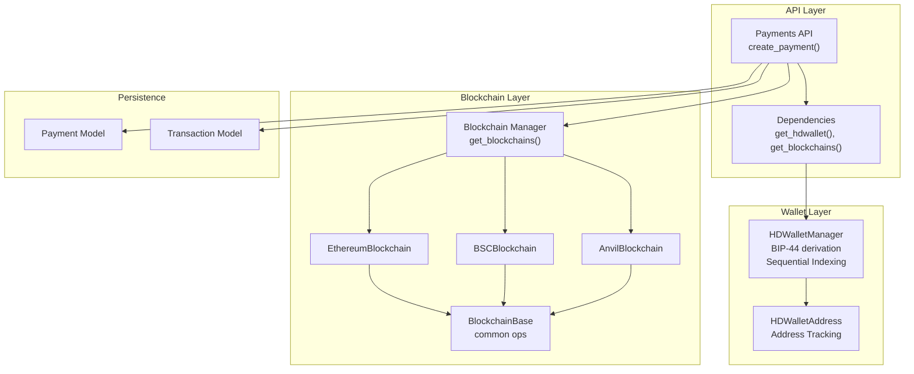
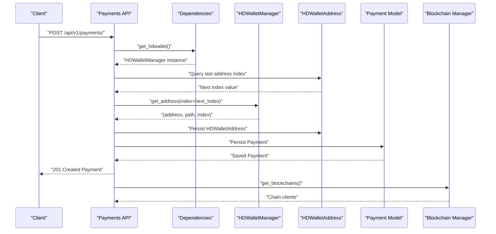
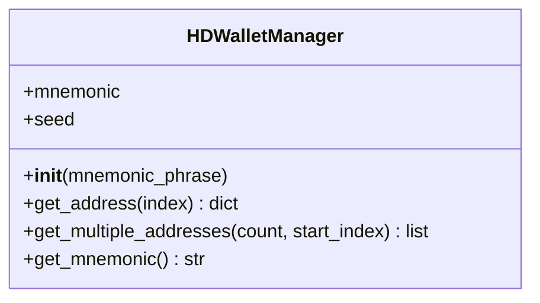
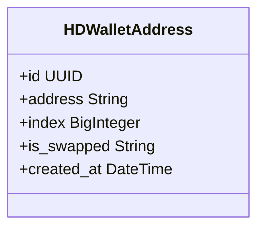
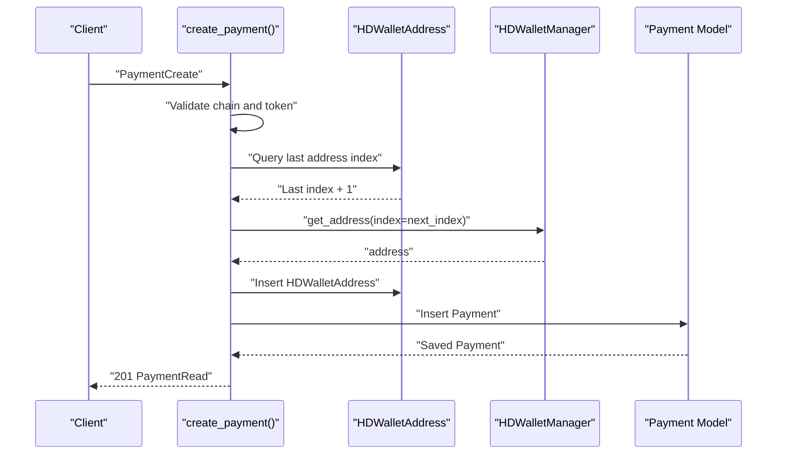
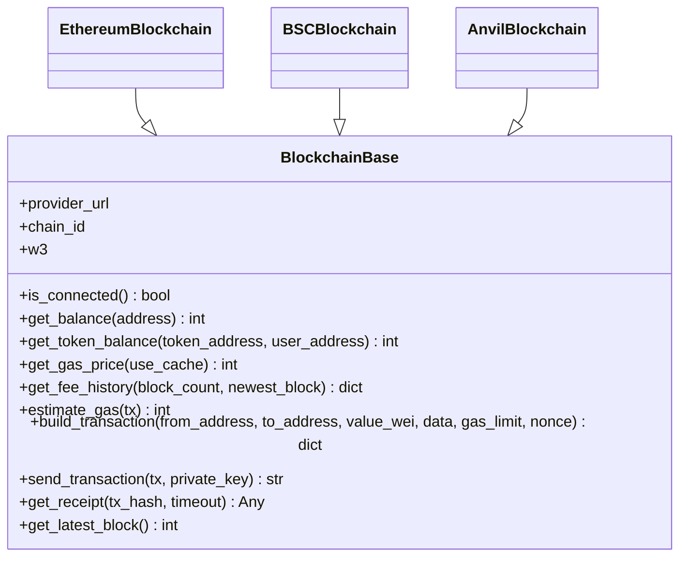
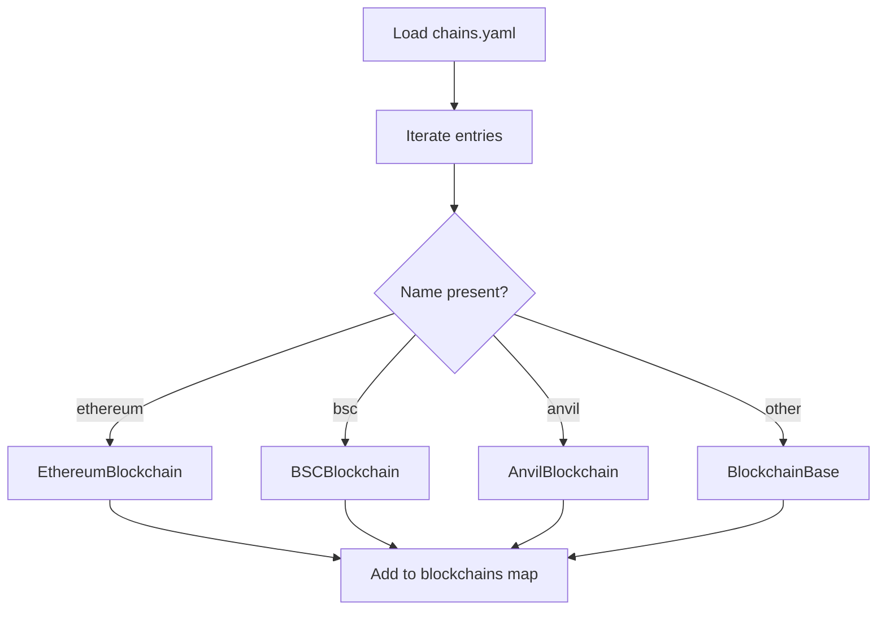
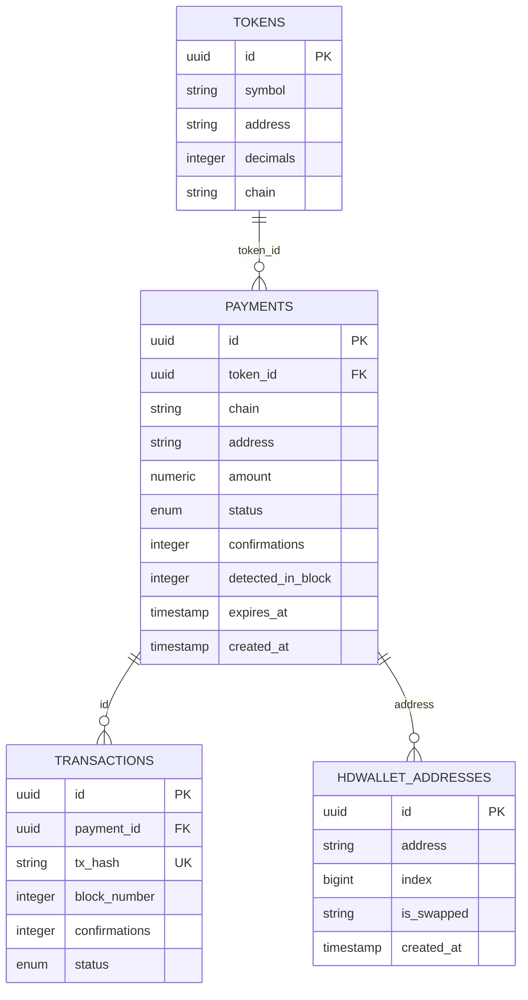
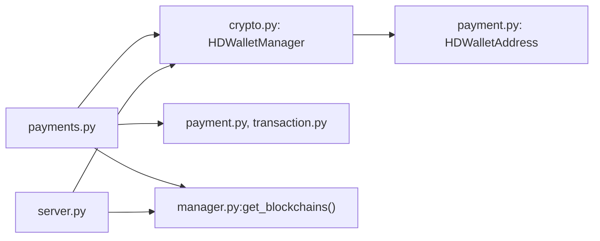

# HD Wallet Management

<cite>
**Referenced Files in This Document**
- [crypto.py](file://app/utils/crypto.py)
- [dependencies.py](file://app/api/dependencies.py)
- [payments.py](file://app/api/v1/payments.py)
- [server.py](file://server.py)
- [config.py](file://app/core/config.py)
- [manager.py](file://app/blockchain/manager.py)
- [base.py](file://app/blockchain/base.py)
- [ethereum.py](file://app/blockchain/ethereum.py)
- [bsc.py](file://app/blockchain/bsc.py)
- [anvil.py](file://app/blockchain/anvil.py)
- [payment.py](file://app/db/models/payment.py)
- [transaction.py](file://app/db/models/transaction.py)
- [chains.yaml](file://chains.yaml)
</cite>

## Update Summary
**Changes Made**
- Enhanced HD wallet functionality documentation with automatic index calculation capabilities
- Added documentation for sequential address generation with persistent tracking
- Updated payment creation process to reflect automatic index assignment
- Added comprehensive coverage of HDWalletAddress model and its role in sequential derivation
- Enhanced BIP-44 derivation documentation with automatic index management

## Table of Contents
1. [Introduction](#introduction)
2. [Project Structure](#project-structure)
3. [Core Components](#core-components)
4. [Architecture Overview](#architecture-overview)
5. [Detailed Component Analysis](#detailed-component-analysis)
6. [Dependency Analysis](#dependency-analysis)
7. [Performance Considerations](#performance-considerations)
8. [Troubleshooting Guide](#troubleshooting-guide)
9. [Conclusion](#conclusion)

## Introduction
This document explains the hierarchical deterministic (HD) wallet system and BIP-44 derivation used to generate unique payment addresses per transaction. The system has been enhanced with sequential address generation capabilities, automatic index calculation, and persistent address tracking. It covers how the HD wallet integrates with blockchain interactions, how addresses are derived, and how payment records are persisted. It also documents security considerations, private key management, and seed phrase handling, along with practical examples and troubleshooting guidance.

## Project Structure
The HD wallet and BIP-44 implementation is centered around a dedicated utility module that derives Ethereum-compatible addresses from a mnemonic seed. These addresses are used by the payment API to create unique payment addresses for incoming transactions with automatic sequential indexing. Blockchain connectivity is abstracted behind a shared base class and chain-specific implementations, while persistence is handled by SQLAlchemy models including dedicated tracking for generated addresses.

**Diagram sources**
- [payments.py](file://app/api/v1/payments.py#L18-L54)
- [dependencies.py](file://app/api/dependencies.py#L5-L15)
- [crypto.py](file://app/utils/crypto.py#L5-L66)
- [manager.py](file://app/blockchain/manager.py#L8-L32)
- [base.py](file://app/blockchain/base.py#L22-L146)
- [ethereum.py](file://app/blockchain/ethereum.py#L3-L6)
- [bsc.py](file://app/blockchain/bsc.py#L3-L6)
- [anvil.py](file://app/blockchain/anvil.py#L8-L56)
- [payment.py](file://app/db/models/payment.py#L41-L74)
- [transaction.py](file://app/db/models/transaction.py#L29-L39)

**Section sources**
- [payments.py](file://app/api/v1/payments.py#L1-L62)
- [dependencies.py](file://app/api/dependencies.py#L1-L15)
- [crypto.py](file://app/utils/crypto.py#L1-L90)
- [manager.py](file://app/blockchain/manager.py#L1-L33)
- [base.py](file://app/blockchain/base.py#L1-L146)
- [ethereum.py](file://app/blockchain/ethereum.py#L1-L7)
- [bsc.py](file://app/blockchain/bsc.py#L1-L7)
- [anvil.py](file://app/blockchain/anvil.py#L1-L57)
- [payment.py](file://app/db/models/payment.py#L1-L74)
- [transaction.py](file://app/db/models/transaction.py#L1-L40)

## Core Components
- **HDWalletManager**: Generates a mnemonic (if not provided), derives a seed, and produces Ethereum addresses using BIP-44 path m/44'/60'/0'/0/{index}. It supports deriving a single address or multiple sequential addresses and maintains automatic index calculation for sequential payment generation.
- **HDWalletAddress Model**: Tracks generated addresses and their sequential indices to ensure proper BIP-44 derivation order and prevent index reuse.
- **Payments API**: Validates chain support, optionally validates token, automatically calculates the next sequential index, derives a new address from the HD wallet, persists both payment and address tracking records, and returns the payment.
- **BlockchainBase and chain implementations**: Provide asynchronous connectivity to various chains, gas estimation, transaction building, signing, and sending.
- **Persistence models**: Payment and Transaction models persist payment requests and transaction outcomes, while HDWalletAddress tracks generated addresses.

Key implementation references:
- HD derivation and address generation: [crypto.py](file://app/utils/crypto.py#L27-L46)
- Multiple address generation: [crypto.py](file://app/utils/crypto.py#L48-L62)
- Automatic index calculation: [payments.py](file://app/api/v1/payments.py#L36-L38)
- Address tracking persistence: [payments.py](file://app/api/v1/payments.py#L44-L49)
- HDWalletAddress model definition: [payment.py](file://app/db/models/payment.py#L65-L74)
- Payment creation and address derivation: [payments.py](file://app/api/v1/payments.py#L36-L52)
- Blockchain abstraction and transaction building: [base.py](file://app/blockchain/base.py#L93-L133)
- Chain selection and instantiation: [manager.py](file://app/blockchain/manager.py#L8-L32)

**Section sources**
- [crypto.py](file://app/utils/crypto.py#L5-L66)
- [payments.py](file://app/api/v1/payments.py#L18-L54)
- [payment.py](file://app/db/models/payment.py#L65-L74)
- [base.py](file://app/blockchain/base.py#L22-L146)
- [manager.py](file://app/blockchain/manager.py#L8-L32)

## Architecture Overview
The system initializes an HD wallet during application startup and exposes it via dependency injection. When a payment is requested, the API automatically calculates the next sequential index, derives a unique address from the HD wallet, persists both payment and address tracking records, and relies on blockchain scanning and webhook services to detect and confirm payments.

**Diagram sources**
- [server.py](file://server.py#L21-L28)
- [dependencies.py](file://app/api/dependencies.py#L11-L15)
- [crypto.py](file://app/utils/crypto.py#L27-L46)
- [payments.py](file://app/api/v1/payments.py#L18-L54)
- [manager.py](file://app/blockchain/manager.py#L8-L32)

## Detailed Component Analysis

### HDWalletManager: BIP-44 Derivation and Sequential Address Generation
The HD wallet manager encapsulates:
- Mnemonic generation (when none is provided) and seed derivation.
- BIP-44 path construction for Ethereum: m/44'/60'/0'/0/{index}.
- Private key derivation from seed and path, followed by account creation to produce an address.
- Sequential address generation for multiple indices with configurable start positions.
- Automatic index calculation support for payment systems requiring sequential derivation.

**Diagram sources**
- [crypto.py](file://app/utils/crypto.py#L5-L66)

Implementation highlights:
- Initialization and seed derivation: [crypto.py](file://app/utils/crypto.py#L11-L25)
- Single address derivation: [crypto.py](file://app/utils/crypto.py#L27-L46)
- Multiple sequential addresses: [crypto.py](file://app/utils/crypto.py#L48-L62)
- Mnemonic retrieval: [crypto.py](file://app/utils/crypto.py#L64-L66)

Security note:
- The mnemonic must be kept secret and protected at rest and in transit.
- Private keys are derived on-demand for signing; avoid storing raw private keys.

**Section sources**
- [crypto.py](file://app/utils/crypto.py#L5-L66)

### HDWalletAddress Model: Sequential Address Tracking
The HDWalletAddress model provides persistent tracking of generated addresses and their sequential indices:
- Stores generated addresses with their corresponding BIP-44 indices.
- Prevents index reuse and ensures proper sequential derivation order.
- Supports address verification and audit trails for payment processing.
- Includes timestamp tracking for address generation history.

**Diagram sources**
- [payment.py](file://app/db/models/payment.py#L65-L74)

Implementation highlights:
- Address storage with unique constraints: [payment.py](file://app/db/models/payment.py#L68-L70)
- Sequential index tracking: [payment.py](file://app/db/models/payment.py#L70)
- Timestamp management: [payment.py](file://app/db/models/payment.py#L72-L74)

**Section sources**
- [payment.py](file://app/db/models/payment.py#L65-L74)

### Payments API: Enhanced Wallet Integration and Automatic Index Management
The payment creation endpoint has been enhanced with automatic sequential index management:
- Validates the requested chain against configured chains.
- Optionally validates token availability for the chain.
- Automatically calculates the next sequential index by querying the HDWalletAddress table.
- Derives a new address from the HD wallet using the calculated sequential index.
- Persists both the payment record and address tracking record.
- Returns the created payment with all relevant metadata.

**Diagram sources**
- [payments.py](file://app/api/v1/payments.py#L18-L54)
- [crypto.py](file://app/utils/crypto.py#L27-L46)
- [payment.py](file://app/db/models/payment.py#L41-L58)

Operational details:
- Chain validation and token lookup: [payments.py](file://app/api/v1/payments.py#L26-L34)
- Automatic index calculation: [payments.py](file://app/api/v1/payments.py#L36-L38)
- Address derivation and dual persistence: [payments.py](file://app/api/v1/payments.py#L40-L50)

**Section sources**
- [payments.py](file://app/api/v1/payments.py#L18-L54)
- [payment.py](file://app/db/models/payment.py#L41-L58)

### Blockchain Layer: Transaction Building, Signing, and Sending
The base blockchain class provides:
- Asynchronous connectivity and POA middleware support.
- Gas price and fee history retrieval, with fallbacks.
- Transaction building with EIP-1559 or legacy pricing.
- Transaction signing and submission using a private key.
- Balance and token balance queries.

**Diagram sources**
- [base.py](file://app/blockchain/base.py#L22-L146)
- [ethereum.py](file://app/blockchain/ethereum.py#L3-L6)
- [bsc.py](file://app/blockchain/bsc.py#L3-L6)
- [anvil.py](file://app/blockchain/anvil.py#L8-L56)

Usage references:
- Transaction building and signing: [base.py](file://app/blockchain/base.py#L93-L139)
- Gas estimation and caching: [base.py](file://app/blockchain/base.py#L65-L91)

**Section sources**
- [base.py](file://app/blockchain/base.py#L22-L146)
- [ethereum.py](file://app/blockchain/ethereum.py#L1-L7)
- [bsc.py](file://app/blockchain/bsc.py#L1-L7)
- [anvil.py](file://app/blockchain/anvil.py#L1-L57)

### Chain Configuration and Selection
Chains are loaded from a YAML configuration file and instantiated at startup. The manager maps chain names to concrete blockchain implementations.

**Diagram sources**
- [chains.yaml](file://chains.yaml#L1-L24)
- [manager.py](file://app/blockchain/manager.py#L8-L32)

**Section sources**
- [chains.yaml](file://chains.yaml#L1-L24)
- [manager.py](file://app/blockchain/manager.py#L8-L32)

### Persistence Models: Payments, Transactions, and Address Tracking
Payment records capture chain, address, amount, status, confirmations, and expiration. Transaction records track hash, block number, confirmations, and status. HDWalletAddress records track generated addresses and their sequential indices for proper BIP-44 derivation management.

**Diagram sources**
- [payment.py](file://app/db/models/payment.py#L41-L74)
- [transaction.py](file://app/db/models/transaction.py#L29-L39)

**Section sources**
- [payment.py](file://app/db/models/payment.py#L1-L74)
- [transaction.py](file://app/db/models/transaction.py#L1-L40)

## Dependency Analysis
The system exhibits clean separation of concerns with enhanced sequential address management:
- API depends on HD wallet and blockchain manager for payment creation.
- HD wallet is injected via dependency injection and initialized at startup.
- Automatic index calculation ensures sequential BIP-44 derivation order.
- HDWalletAddress model provides persistent tracking of generated addresses.
- Blockchain manager selects chain implementations based on configuration.
- Persistence models decouple payment lifecycle from blockchain operations.

**Diagram sources**
- [payments.py](file://app/api/v1/payments.py#L1-L62)
- [crypto.py](file://app/utils/crypto.py#L1-L90)
- [manager.py](file://app/blockchain/manager.py#L1-L33)
- [base.py](file://app/blockchain/base.py#L1-L146)
- [ethereum.py](file://app/blockchain/ethereum.py#L1-L7)
- [bsc.py](file://app/blockchain/bsc.py#L1-L7)
- [anvil.py](file://app/blockchain/anvil.py#L1-L57)
- [payment.py](file://app/db/models/payment.py#L1-L74)
- [transaction.py](file://app/db/models/transaction.py#L1-L40)
- [server.py](file://server.py#L21-L28)

**Section sources**
- [payments.py](file://app/api/v1/payments.py#L1-L62)
- [crypto.py](file://app/utils/crypto.py#L1-L90)
- [manager.py](file://app/blockchain/manager.py#L1-L33)
- [base.py](file://app/blockchain/base.py#L1-L146)
- [ethereum.py](file://app/blockchain/ethereum.py#L1-L7)
- [bsc.py](file://app/blockchain/bsc.py#L1-L7)
- [anvil.py](file://app/blockchain/anvil.py#L1-L57)
- [payment.py](file://app/db/models/payment.py#L1-L74)
- [transaction.py](file://app/db/models/transaction.py#L1-L40)
- [server.py](file://server.py#L21-L28)

## Performance Considerations
- Gas estimation and caching: The base blockchain class caches gas price for a short duration to reduce RPC calls.
- Fee calculation: EIP-1559 fee history is preferred with a legacy fallback to ensure transaction propagation.
- Transaction building buffer: A small gas buffer is applied to estimated gas limits to improve success rates.
- Sequential index optimization: HDWalletAddress table uses efficient indexing on the index column for fast sequential lookup.
- Batch address generation: The get_multiple_addresses method enables batch generation for high-volume scenarios.

Recommendations:
- Monitor fee spikes and adjust buffers accordingly.
- Prefer batched operations for high-volume scenarios using get_multiple_addresses.
- Use chain-specific optimizations (e.g., POA middleware for BSC).
- Implement proper database indexing on HDWalletAddress.index for optimal performance.

**Section sources**
- [base.py](file://app/blockchain/base.py#L65-L91)
- [base.py](file://app/blockchain/base.py#L116-L131)
- [crypto.py](file://app/utils/crypto.py#L48-L62)

## Troubleshooting Guide
Common issues and resolutions:
- Unsupported chain in payment creation:
  - Cause: Chain not present in configuration or not recognized.
  - Resolution: Verify chains.yaml and ensure the chain name matches supported names.
  - Reference: [payments.py](file://app/api/v1/payments.py#L27-L28), [manager.py](file://app/blockchain/manager.py#L13-L26)
- Token not found for chain:
  - Cause: Token does not exist or mismatched chain.
  - Resolution: Confirm token exists and belongs to the requested chain.
  - Reference: [payments.py](file://app/api/v1/payments.py#L32-L34)
- HD wallet not initialized:
  - Cause: Dependency injection expects app state to contain the HD wallet.
  - Resolution: Ensure server lifespan initializes the HD wallet.
  - Reference: [server.py](file://server.py#L21-L28), [dependencies.py](file://app/api/dependencies.py#L11-L15)
- Sequential index calculation failures:
  - Cause: HDWalletAddress table empty or corrupted index values.
  - Resolution: Verify HDWalletAddress table integrity and ensure proper sequential indexing.
  - Reference: [payments.py](file://app/api/v1/payments.py#L36-L38)
- Address tracking inconsistencies:
  - Cause: Missing or duplicate address entries in HDWalletAddress table.
  - Resolution: Implement proper transaction handling and address uniqueness constraints.
  - Reference: [payments.py](file://app/api/v1/payments.py#L44-L49)
- Blockchain connectivity failures:
  - Cause: RPC endpoint unreachable or invalid.
  - Resolution: Validate provider URL and network accessibility.
  - Reference: [base.py](file://app/blockchain/base.py#L45-L50)
- Transaction signing errors:
  - Cause: Invalid private key or nonce issues.
  - Resolution: Validate private key and check pending nonce.
  - Reference: [base.py](file://app/blockchain/base.py#L135-L139)

**Section sources**
- [payments.py](file://app/api/v1/payments.py#L26-L34)
- [server.py](file://server.py#L21-L28)
- [dependencies.py](file://app/api/dependencies.py#L11-L15)
- [base.py](file://app/blockchain/base.py#L45-L50)
- [base.py](file://app/blockchain/base.py#L135-L139)

## Conclusion
The system implements a robust HD wallet and BIP-44 derivation pipeline integrated with blockchain connectivity and persistent payment records. The enhanced functionality now includes automatic sequential address generation with proper index management, ensuring unique addresses per payment while maintaining BIP-44 compliance. By deriving unique addresses per payment with automatic index calculation and leveraging chain-specific implementations, it supports scalable and secure payment processing. The addition of HDWalletAddress tracking provides reliable sequential derivation management and audit capabilities. Adhering to the security and operational recommendations herein ensures reliable and maintainable deployments with proper sequential address management.