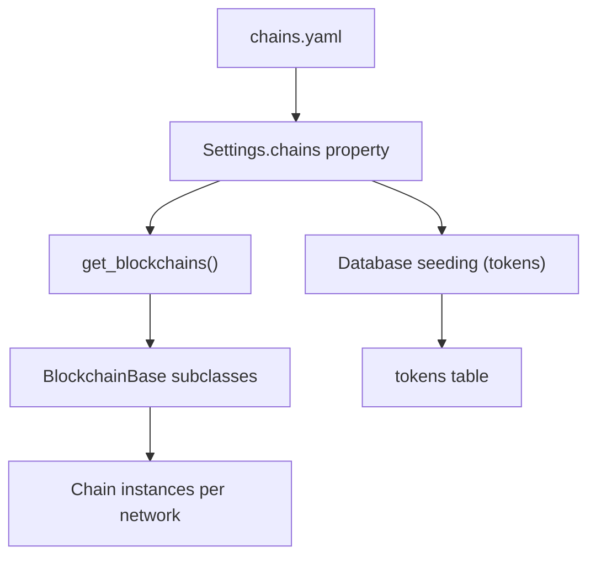
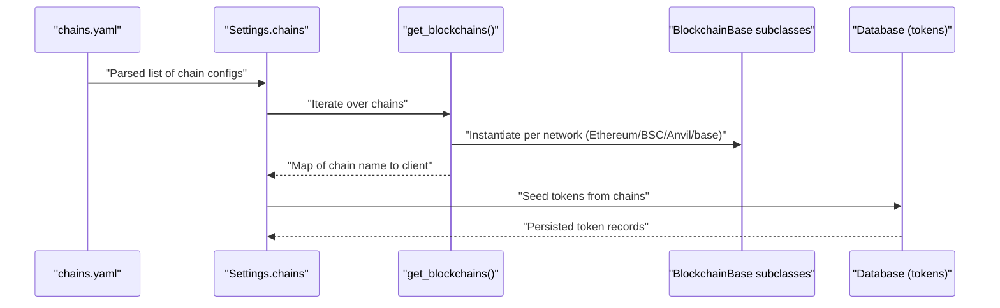
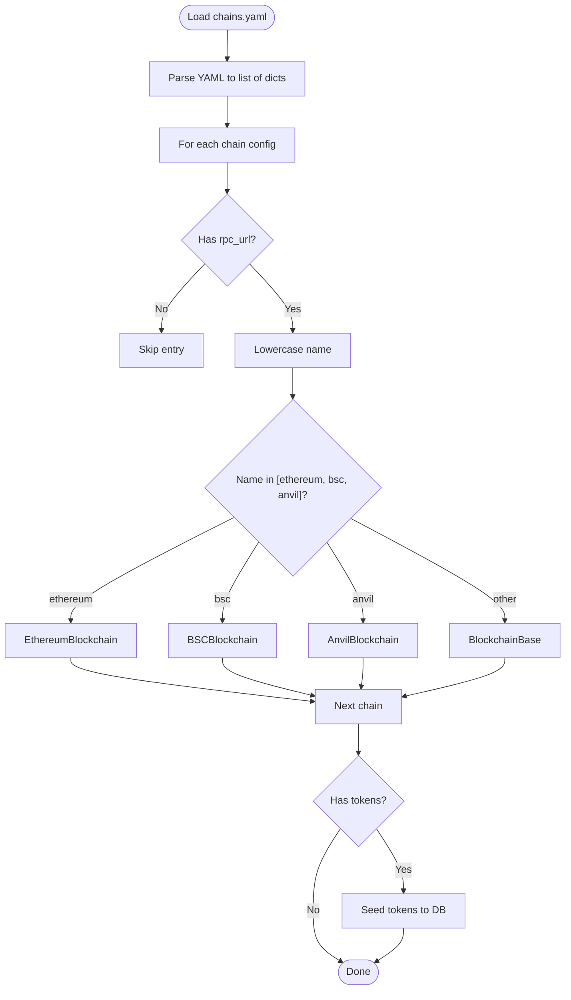
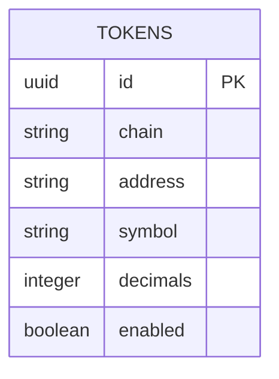
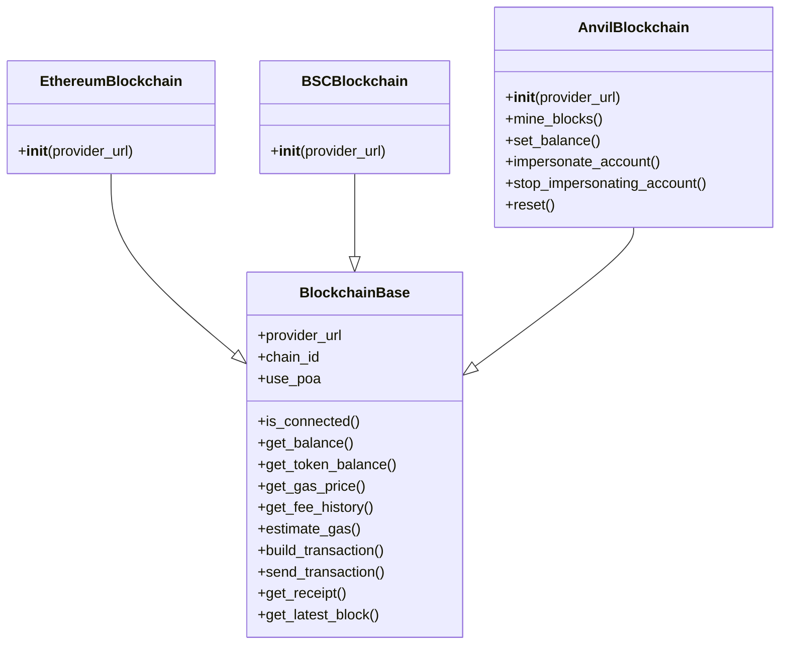
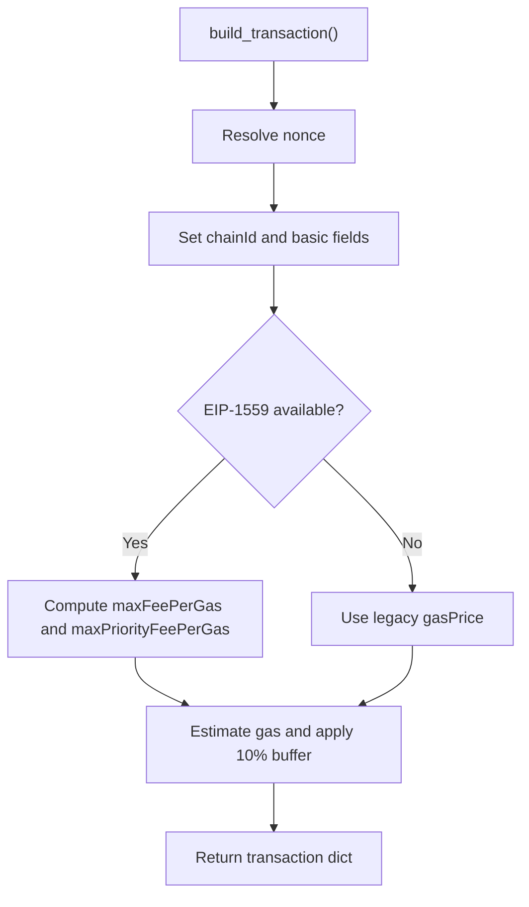
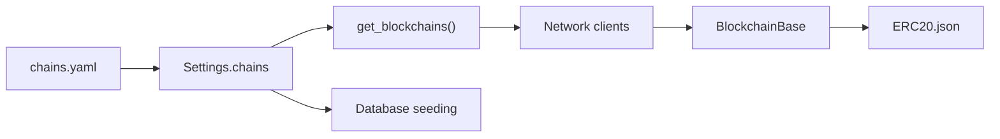

# Chains Configuration

<cite>
**Referenced Files in This Document**
- [chains.yaml](https://github.com/rakibhossain72/ctrip/blob/main/chains.yaml)
- [app/core/config.py](https://github.com/rakibhossain72/ctrip/blob/main/app/core/config.py)
- [app/blockchain/manager.py](https://github.com/rakibhossain72/ctrip/blob/main/app/blockchain/manager.py)
- [app/blockchain/base.py](https://github.com/rakibhossain72/ctrip/blob/main/app/blockchain/base.py)
- [app/blockchain/ethereum.py](https://github.com/rakibhossain72/ctrip/blob/main/app/blockchain/ethereum.py)
- [app/blockchain/bsc.py](https://github.com/rakibhossain72/ctrip/blob/main/app/blockchain/bsc.py)
- [app/blockchain/anvil.py](https://github.com/rakibhossain72/ctrip/blob/main/app/blockchain/anvil.py)
- [app/db/seed.py](https://github.com/rakibhossain72/ctrip/blob/main/app/db/seed.py)
- [app/db/models/token.py](https://github.com/rakibhossain72/ctrip/blob/main/app/db/models/token.py)
- [app/db/models/chain.py](https://github.com/rakibhossain72/ctrip/blob/main/app/db/models/chain.py)
- [app/blockchain/ABI/ERC20.json](https://github.com/rakibhossain72/ctrip/blob/main/app/blockchain/ABI/ERC20.json)
</cite>

## Table of Contents
1. [Introduction](#introduction)
2. [Project Structure](#project-structure)
3. [Core Components](#core-components)
4. [Architecture Overview](#architecture-overview)
5. [Detailed Component Analysis](#detailed-component-analysis)
6. [Dependency Analysis](#dependency-analysis)
7. [Performance Considerations](#performance-considerations)
8. [Troubleshooting Guide](#troubleshooting-guide)
9. [Conclusion](#conclusion)
10. [Appendices](#appendices)

## Introduction
This document explains the chains.yaml configuration format and how blockchain networks are set up and consumed by the application. It covers:
- The YAML structure for defining blockchain networks, RPC endpoints, and token configurations
- The hierarchical configuration format: network parameters and token definitions
- Supported blockchain networks (Ethereum, BSC, Anvil) and their specific configuration requirements
- Token configuration including symbol, contract addresses, and decimal precision
- Examples for extending chains.yaml with custom networks, configuring multiple tokens per chain, and handling network-specific parameters
- Troubleshooting guidance for common configuration errors and validation issues

## Project Structure
The chains configuration is loaded from a YAML file and integrated into the application via settings and blockchain managers. Tokens defined in chains.yaml are persisted into the database for runtime use.

**Diagram sources**
- [chains.yaml](https://github.com/rakibhossain72/ctrip/blob/main/chains.yaml#L1-L24)
- [app/core/config.py](https://github.com/rakibhossain72/ctrip/blob/main/app/core/config.py#L44-L56)
- [app/blockchain/manager.py](https://github.com/rakibhossain72/ctrip/blob/main/app/blockchain/manager.py#L8-L32)
- [app/db/seed.py](https://github.com/rakibhossain72/ctrip/blob/main/app/db/seed.py#L19-L43)
- [app/db/models/token.py](https://github.com/rakibhossain72/ctrip/blob/main/app/db/models/token.py#L6-L14)

**Section sources**
- [chains.yaml](https://github.com/rakibhossain72/ctrip/blob/main/chains.yaml#L1-L24)
- [app/core/config.py](https://github.com/rakibhossain72/ctrip/blob/main/app/core/config.py#L39-L56)
- [app/blockchain/manager.py](https://github.com/rakibhossain72/ctrip/blob/main/app/blockchain/manager.py#L8-L32)
- [app/db/seed.py](https://github.com/rakibhossain72/ctrip/blob/main/app/db/seed.py#L19-L43)

## Core Components
- chains.yaml: Defines networks and tokens. Each network entry includes a name and RPC URL, and optionally a list of tokens with symbol, optional contract address, and decimals.
- Settings.chains: Loads and exposes the parsed YAML as a list of dictionaries for downstream consumers.
- Blockchain managers: Build network clients per configured chain, selecting specialized implementations for known networks and a generic base class otherwise.
- Token persistence: Seeds the tokens table from chains.yaml, enabling runtime selection of tokens per chain.

Key behaviors:
- Unknown networks fall back to the base client class.
- If chains.yaml is missing or unreadable, the system still initializes with a default Anvil client using the global RPC endpoint.
- Token entries without an address are treated as native tokens (e.g., ETH).

**Section sources**
- [chains.yaml](https://github.com/rakibhossain72/ctrip/blob/main/chains.yaml#L1-L24)
- [app/core/config.py](https://github.com/rakibhossain72/ctrip/blob/main/app/core/config.py#L44-L56)
- [app/blockchain/manager.py](https://github.com/rakibhossain72/ctrip/blob/main/app/blockchain/manager.py#L8-L32)
- [app/db/seed.py](https://github.com/rakibhossain72/ctrip/blob/main/app/db/seed.py#L19-L43)
- [app/db/models/token.py](https://github.com/rakibhossain72/ctrip/blob/main/app/db/models/token.py#L10-L13)

## Architecture Overview
The configuration pipeline connects YAML definitions to runtime blockchain clients and persistent token definitions.

**Diagram sources**
- [chains.yaml](https://github.com/rakibhossain72/ctrip/blob/main/chains.yaml#L1-L24)
- [app/core/config.py](https://github.com/rakibhossain72/ctrip/blob/main/app/core/config.py#L44-L56)
- [app/blockchain/manager.py](https://github.com/rakibhossain72/ctrip/blob/main/app/blockchain/manager.py#L8-L32)
- [app/blockchain/ethereum.py](https://github.com/rakibhossain72/ctrip/blob/main/app/blockchain/ethereum.py#L3-L6)
- [app/blockchain/bsc.py](https://github.com/rakibhossain72/ctrip/blob/main/app/blockchain/bsc.py#L3-L6)
- [app/blockchain/anvil.py](https://github.com/rakibhossain72/ctrip/blob/main/app/blockchain/anvil.py#L8-L11)
- [app/db/seed.py](https://github.com/rakibhossain72/ctrip/blob/main/app/db/seed.py#L19-L43)
- [app/db/models/token.py](https://github.com/rakibhossain72/ctrip/blob/main/app/db/models/token.py#L6-L14)

## Detailed Component Analysis

### chains.yaml Structure and Semantics
- Top-level: list of network entries
- Network entry fields:
  - name: lowercase network identifier (e.g., ethereum, bsc, anvil)
  - rpc_url: HTTP(S) endpoint for the network
  - tokens: optional list of token definitions
- Token definition fields:
  - symbol: token ticker
  - address: optional contract address (omit for native token)
  - decimals: token decimals (defaults to 18 if omitted)

Supported networks and defaults:
- ethereum: chain ID 1, no proof-of-authority middleware
- bsc: chain ID 56, proof-of-authority middleware enabled
- anvil: chain ID 31337, no POA middleware
- unknown: base client with provided RPC URL

**Diagram sources**
- [chains.yaml](https://github.com/rakibhossain72/ctrip/blob/main/chains.yaml#L1-L24)
- [app/blockchain/manager.py](https://github.com/rakibhossain72/ctrip/blob/main/app/blockchain/manager.py#L8-L32)
- [app/blockchain/ethereum.py](https://github.com/rakibhossain72/ctrip/blob/main/app/blockchain/ethereum.py#L3-L6)
- [app/blockchain/bsc.py](https://github.com/rakibhossain72/ctrip/blob/main/app/blockchain/bsc.py#L3-L6)
- [app/blockchain/anvil.py](https://github.com/rakibhossain72/ctrip/blob/main/app/blockchain/anvil.py#L8-L11)
- [app/db/seed.py](https://github.com/rakibhossain72/ctrip/blob/main/app/db/seed.py#L19-L43)

**Section sources**
- [chains.yaml](https://github.com/rakibhossain72/ctrip/blob/main/chains.yaml#L1-L24)
- [app/blockchain/manager.py](https://github.com/rakibhossain72/ctrip/blob/main/app/blockchain/manager.py#L8-L32)
- [app/blockchain/ethereum.py](https://github.com/rakibhossain72/ctrip/blob/main/app/blockchain/ethereum.py#L3-L6)
- [app/blockchain/bsc.py](https://github.com/rakibhossain72/ctrip/blob/main/app/blockchain/bsc.py#L3-L6)
- [app/blockchain/anvil.py](https://github.com/rakibhossain72/ctrip/blob/main/app/blockchain/anvil.py#L8-L11)
- [app/db/seed.py](https://github.com/rakibhossain72/ctrip/blob/main/app/db/seed.py#L19-L43)

### Token Model and Seeding
Tokens are persisted with:
- chain: network name
- address: contract address or null for native token
- symbol: token symbol
- decimals: token decimals
- enabled: default true

Seeding logic:
- Iterates over chains.yaml entries
- For each token, checks existence by chain, symbol, and address
- Inserts new tokens if not present

**Diagram sources**
- [app/db/models/token.py](https://github.com/rakibhossain72/ctrip/blob/main/app/db/models/token.py#L6-L14)
- [app/db/seed.py](https://github.com/rakibhossain72/ctrip/blob/main/app/db/seed.py#L19-L43)

**Section sources**
- [app/db/models/token.py](https://github.com/rakibhossain72/ctrip/blob/main/app/db/models/token.py#L6-L14)
- [app/db/seed.py](https://github.com/rakibhossain72/ctrip/blob/main/app/db/seed.py#L19-L43)

### Blockchain Clients and Network-Specific Parameters
- EthereumBlockchain: sets chain ID 1 and disables POA middleware
- BSCBlockchain: sets chain ID 56 and enables POA middleware
- AnvilBlockchain: sets chain ID 31337 and disables POA middleware; adds mining and impersonation helpers
- BlockchainBase: shared client with gas estimation, fee history, transaction building, and receipt polling

**Diagram sources**
- [app/blockchain/base.py](https://github.com/rakibhossain72/ctrip/blob/main/app/blockchain/base.py#L22-L146)
- [app/blockchain/ethereum.py](https://github.com/rakibhossain72/ctrip/blob/main/app/blockchain/ethereum.py#L3-L6)
- [app/blockchain/bsc.py](https://github.com/rakibhossain72/ctrip/blob/main/app/blockchain/bsc.py#L3-L6)
- [app/blockchain/anvil.py](https://github.com/rakibhossain72/ctrip/blob/main/app/blockchain/anvil.py#L8-L56)

**Section sources**
- [app/blockchain/base.py](https://github.com/rakibhossain72/ctrip/blob/main/app/blockchain/base.py#L22-L146)
- [app/blockchain/ethereum.py](https://github.com/rakibhossain72/ctrip/blob/main/app/blockchain/ethereum.py#L3-L6)
- [app/blockchain/bsc.py](https://github.com/rakibhossain72/ctrip/blob/main/app/blockchain/bsc.py#L3-L6)
- [app/blockchain/anvil.py](https://github.com/rakibhossain72/ctrip/blob/main/app/blockchain/anvil.py#L8-L56)

### Transaction Building and Gas Handling
The base client supports EIP-1559 fee calculation with fallback to legacy gas pricing and sensible gas limits with padding. It also loads an ERC20 ABI for token balance queries.

**Diagram sources**
- [app/blockchain/base.py](https://github.com/rakibhossain72/ctrip/blob/main/app/blockchain/base.py#L93-L133)
- [app/blockchain/ABI/ERC20.json](https://github.com/rakibhossain72/ctrip/blob/main/app/blockchain/ABI/ERC20.json#L1-L1)

**Section sources**
- [app/blockchain/base.py](https://github.com/rakibhossain72/ctrip/blob/main/app/blockchain/base.py#L93-L133)
- [app/blockchain/ABI/ERC20.json](https://github.com/rakibhossain72/ctrip/blob/main/app/blockchain/ABI/ERC20.json#L1-L1)

## Dependency Analysis
- chains.yaml is consumed by Settings.chains, which is used by get_blockchains() to instantiate blockchain clients.
- Token definitions from chains.yaml are used by the database seeding routine to populate the tokens table.
- The base client depends on AsyncWeb3 and an ERC20 ABI for token interactions.

**Diagram sources**
- [chains.yaml](https://github.com/rakibhossain72/ctrip/blob/main/chains.yaml#L1-L24)
- [app/core/config.py](https://github.com/rakibhossain72/ctrip/blob/main/app/core/config.py#L44-L56)
- [app/blockchain/manager.py](https://github.com/rakibhossain72/ctrip/blob/main/app/blockchain/manager.py#L8-L32)
- [app/db/seed.py](https://github.com/rakibhossain72/ctrip/blob/main/app/db/seed.py#L19-L43)
- [app/blockchain/base.py](https://github.com/rakibhossain72/ctrip/blob/main/app/blockchain/base.py#L15-L19)
- [app/blockchain/ABI/ERC20.json](https://github.com/rakibhossain72/ctrip/blob/main/app/blockchain/ABI/ERC20.json#L1-L1)

**Section sources**
- [app/core/config.py](https://github.com/rakibhossain72/ctrip/blob/main/app/core/config.py#L44-L56)
- [app/blockchain/manager.py](https://github.com/rakibhossain72/ctrip/blob/main/app/blockchain/manager.py#L8-L32)
- [app/db/seed.py](https://github.com/rakibhossain72/ctrip/blob/main/app/db/seed.py#L19-L43)
- [app/blockchain/base.py](https://github.com/rakibhossain72/ctrip/blob/main/app/blockchain/base.py#L15-L19)

## Performance Considerations
- Gas caching: The base client caches gas prices for a short duration to reduce repeated RPC calls.
- Gas estimation fallback: On failure, conservative defaults are used to avoid blocking transactions.
- Fee history availability: EIP-1559 parameters are only computed when fee history is available; otherwise, legacy pricing is used.

Recommendations:
- Prefer EIP-1559-capable nodes for accurate fee estimation.
- Monitor gas price cache refresh intervals and adjust timeouts as needed.
- Ensure RPC endpoints are reliable and responsive to minimize transaction build delays.

**Section sources**
- [app/blockchain/base.py](https://github.com/rakibhossain72/ctrip/blob/main/app/blockchain/base.py#L65-L91)

## Troubleshooting Guide
Common configuration errors and resolutions:
- Missing chains.yaml or unreadable file
  - Symptom: Empty chain list and initialization with a default Anvil client.
  - Resolution: Ensure the file exists at the configured path and is valid YAML.
  - Reference: [app/core/config.py](https://github.com/rakibhossain72/ctrip/blob/main/app/core/config.py#L44-L56), [app/blockchain/manager.py](https://github.com/rakibhossain72/ctrip/blob/main/app/blockchain/manager.py#L28-L30)

- Missing rpc_url in a chain entry
  - Symptom: That chain is skipped during client instantiation.
  - Resolution: Add a valid HTTP(S) RPC endpoint.
  - Reference: [app/blockchain/manager.py](https://github.com/rakibhossain72/ctrip/blob/main/app/blockchain/manager.py#L13-L17)

- Unknown network name
  - Symptom: Falls back to the base client class.
  - Resolution: Use supported names (ethereum, bsc, anvil) or extend get_blockchains() with custom logic.
  - Reference: [app/blockchain/manager.py](https://github.com/rakibhossain72/ctrip/blob/main/app/blockchain/manager.py#L25-L26)

- Token without address
  - Symptom: Treated as a native token (e.g., ETH).
  - Resolution: Omit address for native tokens; specify address for ERC-20 contracts.
  - Reference: [app/db/models/token.py](https://github.com/rakibhossain72/ctrip/blob/main/app/db/models/token.py#L10-L13), [app/db/seed.py](https://github.com/rakibhossain72/ctrip/blob/main/app/db/seed.py#L24-L26)

- Token decimals not specified
  - Symptom: Defaults to 18 decimals.
  - Resolution: Explicitly set decimals for tokens requiring different precision.
  - Reference: [app/db/seed.py](https://github.com/rakibhossain72/ctrip/blob/main/app/db/seed.py#L26)

- Unsupported chain in API requests
  - Symptom: Validation error when creating payments for unsupported chains.
  - Resolution: Add the chain to chains.yaml and redeploy clients.
  - Reference: [app/api/v1/payments.py](https://github.com/rakibhossain72/ctrip/blob/main/app/api/v1/payments.py#L27)

- RPC connectivity issues
  - Symptom: Connection failures reported by the base client.
  - Resolution: Verify endpoint reachability and network configuration.
  - Reference: [app/blockchain/base.py](https://github.com/rakibhossain72/ctrip/blob/main/app/blockchain/base.py#L45-L50)

**Section sources**
- [app/core/config.py](https://github.com/rakibhossain72/ctrip/blob/main/app/core/config.py#L44-L56)
- [app/blockchain/manager.py](https://github.com/rakibhossain72/ctrip/blob/main/app/blockchain/manager.py#L13-L26)
- [app/db/models/token.py](https://github.com/rakibhossain72/ctrip/blob/main/app/db/models/token.py#L10-L13)
- [app/db/seed.py](https://github.com/rakibhossain72/ctrip/blob/main/app/db/seed.py#L24-L26)
- [app/api/v1/payments.py](https://github.com/rakibhossain72/ctrip/blob/main/app/api/v1/payments.py#L27)
- [app/blockchain/base.py](https://github.com/rakibhossain72/ctrip/blob/main/app/blockchain/base.py#L45-L50)

## Conclusion
The chains.yaml configuration provides a concise, hierarchical way to define blockchain networks and tokens. The application loads this configuration into runtime clients and persists token definitions for seamless operation across supported networks. By following the structure and guidelines outlined here, you can add custom networks, configure multiple tokens per chain, and troubleshoot common issues effectively.

## Appendices

### Example: Adding a Custom Network
- Add a new entry under the top-level list with name, rpc_url, and optional tokens.
- Use supported names for specialized behavior or rely on the base client for unknown networks.
- Reference: [chains.yaml](https://github.com/rakibhossain72/ctrip/blob/main/chains.yaml#L1-L24), [app/blockchain/manager.py](https://github.com/rakibhossain72/ctrip/blob/main/app/blockchain/manager.py#L19-L26)

### Example: Configuring Multiple Tokens Per Chain
- Under a chain’s tokens list, define multiple entries with distinct symbols and addresses.
- Native tokens can omit the address field.
- Reference: [chains.yaml](https://github.com/rakibhossain72/ctrip/blob/main/chains.yaml#L4-L10), [app/db/seed.py](https://github.com/rakibhossain72/ctrip/blob/main/app/db/seed.py#L23-L26)

### Example: Network-Specific Parameters
- ethereum: chain ID 1, no POA middleware
- bsc: chain ID 56, POA middleware enabled
- anvil: chain ID 31337, POA disabled; includes mining and impersonation helpers
- Reference: [app/blockchain/ethereum.py](https://github.com/rakibhossain72/ctrip/blob/main/app/blockchain/ethereum.py#L3-L6), [app/blockchain/bsc.py](https://github.com/rakibhossain72/ctrip/blob/main/app/blockchain/bsc.py#L3-L6), [app/blockchain/anvil.py](https://github.com/rakibhossain72/ctrip/blob/main/app/blockchain/anvil.py#L8-L11)