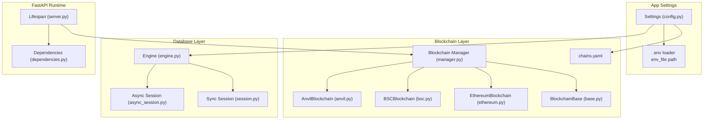
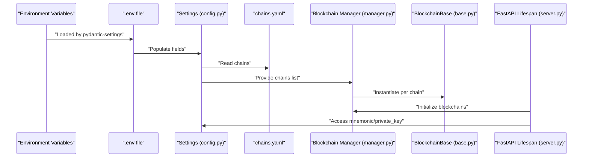
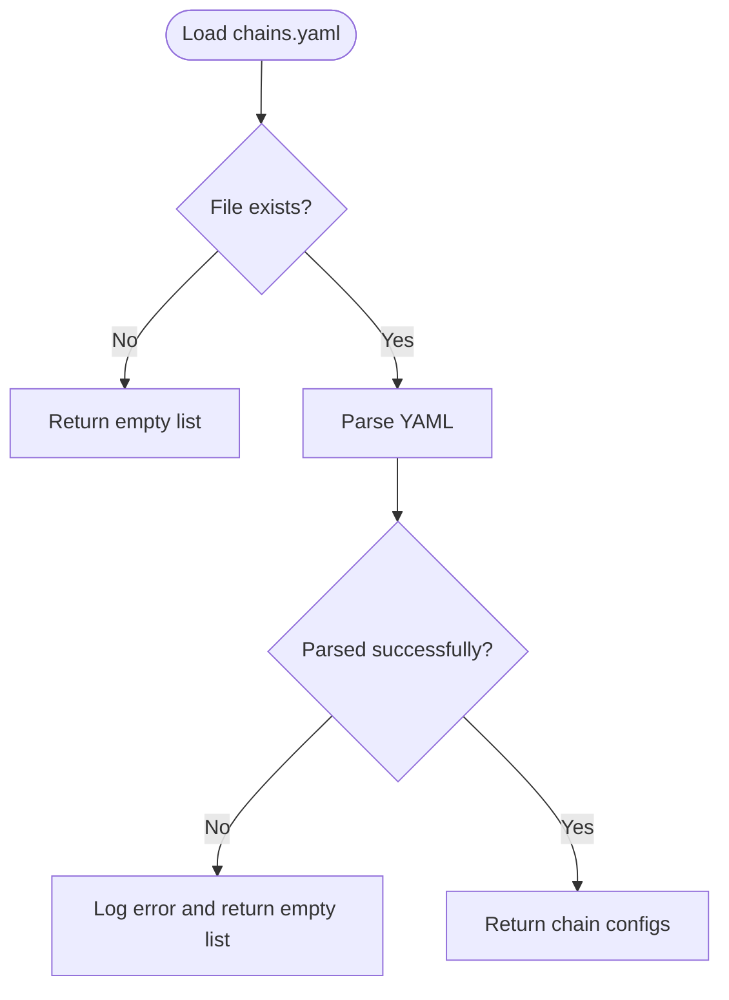
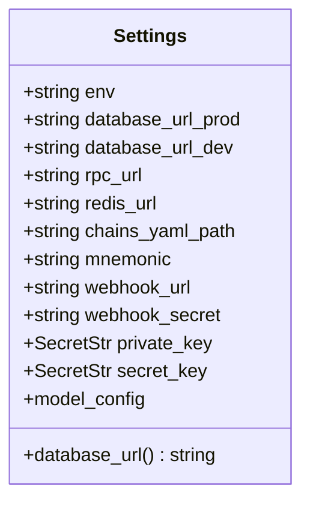
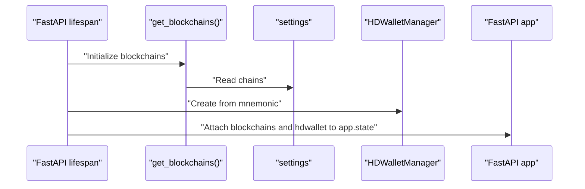
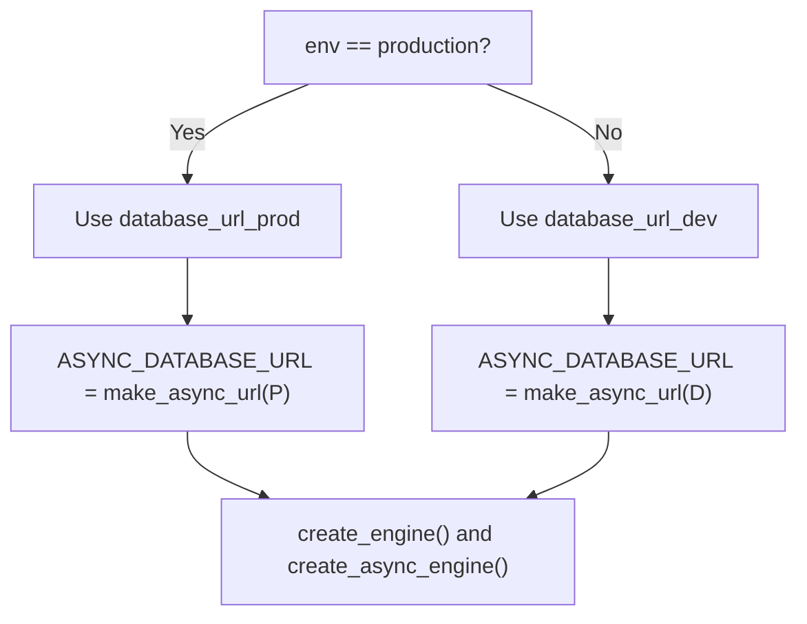
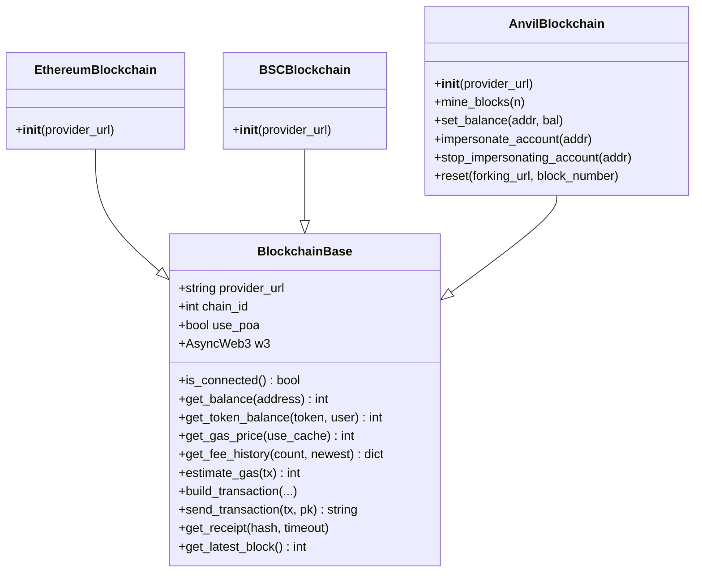
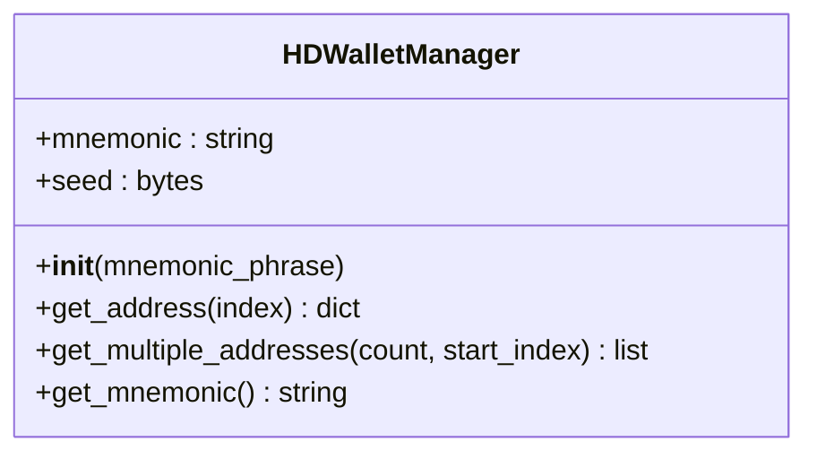
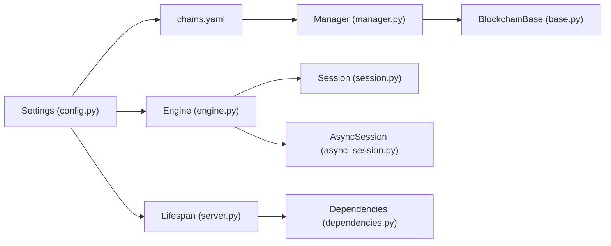

# Configuration Management

<cite>
**Referenced Files in This Document**
- [chains.yaml](https://github.com/rakibhossain72/ctrip/blob/main/chains.yaml)
- [config.py](https://github.com/rakibhossain72/ctrip/blob/main/app/core/config.py)
- [dependencies.py](https://github.com/rakibhossain72/ctrip/blob/main/app/api/dependencies.py)
- [docker-compose.yml](https://github.com/rakibhossain72/ctrip/blob/main/docker-compose.yml)
- [pyproject.toml](https://github.com/rakibhossain72/ctrip/blob/main/pyproject.toml)
- [engine.py](https://github.com/rakibhossain72/ctrip/blob/main/app/db/engine.py)
- [session.py](https://github.com/rakibhossain72/ctrip/blob/main/app/db/session.py)
- [async_session.py](https://github.com/rakibhossain72/ctrip/blob/main/app/db/async_session.py)
- [manager.py](https://github.com/rakibhossain72/ctrip/blob/main/app/blockchain/manager.py)
- [base.py](https://github.com/rakibhossain72/ctrip/blob/main/app/blockchain/base.py)
- [anvil.py](https://github.com/rakibhossain72/ctrip/blob/main/app/blockchain/anvil.py)
- [ethereum.py](https://github.com/rakibhossain72/ctrip/blob/main/app/blockchain/ethereum.py)
- [bsc.py](https://github.com/rakibhossain72/ctrip/blob/main/app/blockchain/bsc.py)
- [crypto.py](https://github.com/rakibhossain72/ctrip/blob/main/app/utils/crypto.py)
- [server.py](https://github.com/rakibhossain72/ctrip/blob/main/server.py)
- [requirements.txt](https://github.com/rakibhossain72/ctrip/blob/main/requirements.txt)
</cite>

## Table of Contents
1. [Introduction](#introduction)
2. [Project Structure](#project-structure)
3. [Core Components](#core-components)
4. [Architecture Overview](#architecture-overview)
5. [Detailed Component Analysis](#detailed-component-analysis)
6. [Dependency Analysis](#dependency-analysis)
7. [Performance Considerations](#performance-considerations)
8. [Troubleshooting Guide](#troubleshooting-guide)
9. [Conclusion](#conclusion)
10. [Appendices](#appendices)

## Introduction
This document explains how cTrip Payment Gateway manages configuration across environments. It covers:
- The chains.yaml format for blockchain network definitions
- Environment variable configuration for secrets and infrastructure
- FastAPI dependency injection patterns and configuration loading
- Database configuration for PostgreSQL and SQLite development
- Security considerations and production best practices
- Common configuration scenarios and troubleshooting steps

## Project Structure
Configuration spans several layers:
- Application settings and environment variables are defined in a Pydantic-based settings class
- Blockchain networks are loaded from a YAML file
- Database engines and sessions are constructed from settings
- FastAPI lifecycle initializes blockchain clients and HD wallet managers
- Docker Compose defines environment-specific defaults and service wiring

**Diagram sources**
- [config.py](https://github.com/rakibhossain72/ctrip/blob/main/app/core/config.py#L10-L126)
- [chains.yaml](https://github.com/rakibhossain72/ctrip/blob/main/chains.yaml#L1-L24)
- [manager.py](https://github.com/rakibhossain72/ctrip/blob/main/app/blockchain/manager.py#L8-L33)
- [base.py](https://github.com/rakibhossain72/ctrip/blob/main/app/blockchain/base.py#L22-L146)
- [ethereum.py](https://github.com/rakibhossain72/ctrip/blob/main/app/blockchain/ethereum.py#L1-L7)
- [bsc.py](https://github.com/rakibhossain72/ctrip/blob/main/app/blockchain/bsc.py#L1-L7)
- [anvil.py](https://github.com/rakibhossain72/ctrip/blob/main/app/blockchain/anvil.py#L8-L57)
- [engine.py](https://github.com/rakibhossain72/ctrip/blob/main/app/db/engine.py#L1-L32)
- [session.py](https://github.com/rakibhossain72/ctrip/blob/main/app/db/session.py#L1-L17)
- [async_session.py](https://github.com/rakibhossain72/ctrip/blob/main/app/db/async_session.py#L1-L15)
- [server.py](https://github.com/rakibhossain72/ctrip/blob/main/server.py#L21-L47)
- [dependencies.py](https://github.com/rakibhossain72/ctrip/blob/main/app/api/dependencies.py#L1-L15)

**Section sources**
- [config.py](https://github.com/rakibhossain72/ctrip/blob/main/app/core/config.py#L10-L126)
- [chains.yaml](https://github.com/rakibhossain72/ctrip/blob/main/chains.yaml#L1-L24)
- [engine.py](https://github.com/rakibhossain72/ctrip/blob/main/app/db/engine.py#L1-L32)
- [session.py](https://github.com/rakibhossain72/ctrip/blob/main/app/db/session.py#L1-L17)
- [async_session.py](https://github.com/rakibhossain72/ctrip/blob/main/app/db/async_session.py#L1-L15)
- [manager.py](https://github.com/rakibhossain72/ctrip/blob/main/app/blockchain/manager.py#L8-L33)
- [base.py](https://github.com/rakibhossain72/ctrip/blob/main/app/blockchain/base.py#L22-L146)
- [server.py](https://github.com/rakibhossain72/ctrip/blob/main/server.py#L21-L47)
- [dependencies.py](https://github.com/rakibhossain72/ctrip/blob/main/app/api/dependencies.py#L1-L15)

## Core Components
- Settings model encapsulates environment, database URLs, RPC endpoints, Redis, chains YAML path, mnemonic, optional webhook settings, and secrets. It dynamically selects the active database URL based on environment and validates private and secret keys.
- Chains YAML defines blockchain networks with name and RPC URL, and optionally token metadata per chain.
- Blockchain manager constructs chain-specific clients from settings.chains or falls back to a default RPC URL.
- Database engines and sessions are derived from settings and transformed to async variants for PostgreSQL/SQLite.
- FastAPI lifespan initializes blockchain clients and HD wallet manager, and seeds chain states.

**Section sources**
- [config.py](https://github.com/rakibhossain72/ctrip/blob/main/app/core/config.py#L10-L126)
- [chains.yaml](https://github.com/rakibhossain72/ctrip/blob/main/chains.yaml#L1-L24)
- [manager.py](https://github.com/rakibhossain72/ctrip/blob/main/app/blockchain/manager.py#L8-L33)
- [engine.py](https://github.com/rakibhossain72/ctrip/blob/main/app/db/engine.py#L5-L32)
- [session.py](https://github.com/rakibhossain72/ctrip/blob/main/app/db/session.py#L5-L17)
- [async_session.py](https://github.com/rakibhossain72/ctrip/blob/main/app/db/async_session.py#L6-L15)
- [server.py](https://github.com/rakibhossain72/ctrip/blob/main/server.py#L21-L47)

## Architecture Overview
The configuration pipeline connects environment variables, settings, YAML, and runtime initialization.

**Diagram sources**
- [config.py](https://github.com/rakibhossain72/ctrip/blob/main/app/core/config.py#L115-L122)
- [chains.yaml](https://github.com/rakibhossain72/ctrip/blob/main/chains.yaml#L1-L24)
- [manager.py](https://github.com/rakibhossain72/ctrip/blob/main/app/blockchain/manager.py#L8-L33)
- [base.py](https://github.com/rakibhossain72/ctrip/blob/main/app/blockchain/base.py#L22-L44)
- [server.py](https://github.com/rakibhossain72/ctrip/blob/main/server.py#L21-L47)

## Detailed Component Analysis

### Chains YAML Format
- Purpose: Define blockchain networks with RPC endpoints and optional token metadata.
- Structure:
  - Top-level list of chain entries
  - Each entry requires a name and rpc_url
  - Optional tokens list with symbol, address, and decimals
- Behavior:
  - Loaded by the settings.chains property
  - Manager iterates entries to construct chain clients
  - Falls back to a default RPC URL if no chains are configured

**Diagram sources**
- [config.py](https://github.com/rakibhossain72/ctrip/blob/main/app/core/config.py#L44-L57)
- [manager.py](https://github.com/rakibhossain72/ctrip/blob/main/app/blockchain/manager.py#L13-L17)

**Section sources**
- [chains.yaml](https://github.com/rakibhossain72/ctrip/blob/main/chains.yaml#L1-L24)
- [config.py](https://github.com/rakibhossain72/ctrip/blob/main/app/core/config.py#L44-L57)
- [manager.py](https://github.com/rakibhossain72/ctrip/blob/main/app/blockchain/manager.py#L8-L33)

### Environment Variable Configuration
- Environment selection: env controls production vs development/other behavior.
- Database URLs:
  - database_url_prod and database_url_dev are read from environment variables
  - database_url dynamically resolves to the appropriate URL based on env
- Infrastructure:
  - rpc_url, redis_url, chains_yaml_path, mnemonic, webhook_url, webhook_secret
- Secrets:
  - private_key is required and validated as a valid Ethereum private key
  - secret_key must be changed from default in production
- Loading mechanism:
  - Pydantic settings loads from .env using a computed env_file path
  - Case-insensitive, no prefix, extra fields ignored, re-validation enabled

**Diagram sources**
- [config.py](https://github.com/rakibhossain72/ctrip/blob/main/app/core/config.py#L10-L126)

**Section sources**
- [config.py](https://github.com/rakibhossain72/ctrip/blob/main/app/core/config.py#L10-L126)

### FastAPI Dependency Injection Patterns
- Lifespan initialization:
  - Builds blockchains from settings.chains or falls back to default RPC
  - Creates HDWalletManager from settings.mnemonic
  - Seeds chain states and starts background workers
- Dependencies:
  - get_blockchains(request): returns the initialized blockchains dict
  - get_hdwallet(request): returns the HD wallet manager instance
- Usage:
  - These are injected into route handlers via FastAPI dependency injection

**Diagram sources**
- [server.py](https://github.com/rakibhossain72/ctrip/blob/main/server.py#L21-L47)
- [dependencies.py](https://github.com/rakibhossain72/ctrip/blob/main/app/api/dependencies.py#L5-L15)
- [manager.py](https://github.com/rakibhossain72/ctrip/blob/main/app/blockchain/manager.py#L8-L33)
- [config.py](https://github.com/rakibhossain72/ctrip/blob/main/app/core/config.py#L58-L61)

**Section sources**
- [server.py](https://github.com/rakibhossain72/ctrip/blob/main/server.py#L21-L47)
- [dependencies.py](https://github.com/rakibhossain72/ctrip/blob/main/app/api/dependencies.py#L1-L15)
- [manager.py](https://github.com/rakibhossain72/ctrip/blob/main/app/blockchain/manager.py#L8-L33)
- [config.py](https://github.com/rakibhossain72/ctrip/blob/main/app/core/config.py#L58-L61)

### Database Configuration Options
- URL resolution:
  - database_url resolves to production or development URL depending on env
  - get_database_url() centralizes selection
- Engine construction:
  - Sync engine for SQLAlchemy 2.x
  - Async engine with protocol conversion for PostgreSQL/SQLite
- Sessions:
  - Synchronous sessionmaker and generator
  - Asynchronous sessionmaker and generator
- Development vs Production:
  - Development defaults to an SQLite file path
  - Production defaults to a PostgreSQL URL

**Diagram sources**
- [config.py](https://github.com/rakibhossain72/ctrip/blob/main/app/core/config.py#L84-L92)
- [engine.py](https://github.com/rakibhossain72/ctrip/blob/main/app/db/engine.py#L5-L32)
- [session.py](https://github.com/rakibhossain72/ctrip/blob/main/app/db/session.py#L5-L17)
- [async_session.py](https://github.com/rakibhossain72/ctrip/blob/main/app/db/async_session.py#L6-L15)

**Section sources**
- [config.py](https://github.com/rakibhossain72/ctrip/blob/main/app/core/config.py#L18-L26)
- [config.py](https://github.com/rakibhossain72/ctrip/blob/main/app/core/config.py#L84-L92)
- [engine.py](https://github.com/rakibhossain72/ctrip/blob/main/app/db/engine.py#L5-L32)
- [session.py](https://github.com/rakibhossain72/ctrip/blob/main/app/db/session.py#L1-L17)
- [async_session.py](https://github.com/rakibhossain72/ctrip/blob/main/app/db/async_session.py#L1-L15)

### Blockchain Clients and Chain IDs
- Base client:
  - Initializes AsyncWeb3 with AsyncHTTPProvider and optional POA middleware
  - Provides helpers for balance, token balance, gas price, fee history, transaction building, sending, and receipts
- Chain-specific clients:
  - Ethereum: sets chain ID 1
  - BSC: sets chain ID 56 with POA enabled
  - Anvil: sets chain ID 31337, adds mining and impersonation utilities
- Manager:
  - Iterates settings.chains to instantiate appropriate clients
  - Falls back to default RPC URL if none configured

**Diagram sources**
- [base.py](https://github.com/rakibhossain72/ctrip/blob/main/app/blockchain/base.py#L22-L146)
- [ethereum.py](https://github.com/rakibhossain72/ctrip/blob/main/app/blockchain/ethereum.py#L1-L7)
- [bsc.py](https://github.com/rakibhossain72/ctrip/blob/main/app/blockchain/bsc.py#L1-L7)
- [anvil.py](https://github.com/rakibhossain72/ctrip/blob/main/app/blockchain/anvil.py#L8-L57)

**Section sources**
- [base.py](https://github.com/rakibhossain72/ctrip/blob/main/app/blockchain/base.py#L22-L146)
- [ethereum.py](https://github.com/rakibhossain72/ctrip/blob/main/app/blockchain/ethereum.py#L1-L7)
- [bsc.py](https://github.com/rakibhossain72/ctrip/blob/main/app/blockchain/bsc.py#L1-L7)
- [anvil.py](https://github.com/rakibhossain72/ctrip/blob/main/app/blockchain/anvil.py#L8-L57)
- [manager.py](https://github.com/rakibhossain72/ctrip/blob/main/app/blockchain/manager.py#L8-L33)

### HD Wallet Mnemonic and Private Keys
- HDWalletManager:
  - Accepts a mnemonic phrase or generates a new 12-word mnemonic
  - Derives Ethereum addresses using BIP-44 path m/44'/60'/0'/0/{index}
  - Exposes methods to get single or multiple addresses
- Settings:
  - mnemonic is configurable via environment
  - private_key is required and validated as a valid Ethereum private key
  - secret_key must be changed from default in production

**Diagram sources**
- [crypto.py](https://github.com/rakibhossain72/ctrip/blob/main/app/utils/crypto.py#L5-L90)
- [config.py](https://github.com/rakibhossain72/ctrip/blob/main/app/core/config.py#L58-L82)

**Section sources**
- [crypto.py](https://github.com/rakibhossain72/ctrip/blob/main/app/utils/crypto.py#L5-L90)
- [config.py](https://github.com/rakibhossain72/ctrip/blob/main/app/core/config.py#L58-L82)

### Environment-Specific Defaults and Docker Compose
- Docker Compose:
  - Defines default DATABASE_URL, REDIS_URL, ENV, RPC_URL, PRIVATE_KEY, and MNEMONIC
  - Uses variable substitution with defaults for RPC_URL and MNEMONIC
  - Exposes db and redis services for local development
- Pyproject dependencies:
  - Includes pydantic, pydantic-settings, pyyaml, web3, eth-account, redis, python-dotenv, and others

**Section sources**
- [docker-compose.yml](https://github.com/rakibhossain72/ctrip/blob/main/docker-compose.yml#L26-L32)
- [docker-compose.yml](https://github.com/rakibhossain72/ctrip/blob/main/docker-compose.yml#L42-L47)
- [pyproject.toml](https://github.com/rakibhossain72/ctrip/blob/main/pyproject.toml#L14-L32)
- [requirements.txt](https://github.com/rakibhossain72/ctrip/blob/main/requirements.txt#L16-L32)

## Dependency Analysis
Configuration dependencies span settings, YAML, blockchain manager, engines, and FastAPI lifecycle.

**Diagram sources**
- [config.py](https://github.com/rakibhossain72/ctrip/blob/main/app/core/config.py#L10-L126)
- [chains.yaml](https://github.com/rakibhossain72/ctrip/blob/main/chains.yaml#L1-L24)
- [manager.py](https://github.com/rakibhossain72/ctrip/blob/main/app/blockchain/manager.py#L8-L33)
- [base.py](https://github.com/rakibhossain72/ctrip/blob/main/app/blockchain/base.py#L22-L44)
- [engine.py](https://github.com/rakibhossain72/ctrip/blob/main/app/db/engine.py#L1-L32)
- [session.py](https://github.com/rakibhossain72/ctrip/blob/main/app/db/session.py#L1-L17)
- [async_session.py](https://github.com/rakibhossain72/ctrip/blob/main/app/db/async_session.py#L1-L15)
- [server.py](https://github.com/rakibhossain72/ctrip/blob/main/server.py#L21-L47)
- [dependencies.py](https://github.com/rakibhossain72/ctrip/blob/main/app/api/dependencies.py#L1-L15)

**Section sources**
- [config.py](https://github.com/rakibhossain72/ctrip/blob/main/app/core/config.py#L10-L126)
- [engine.py](https://github.com/rakibhossain72/ctrip/blob/main/app/db/engine.py#L1-L32)
- [manager.py](https://github.com/rakibhossain72/ctrip/blob/main/app/blockchain/manager.py#L8-L33)
- [server.py](https://github.com/rakibhossain72/ctrip/blob/main/server.py#L21-L47)

## Performance Considerations
- Gas caching: BlockchainBase caches gas price for a short duration to reduce RPC calls
- Pool sizing: Database engines enable pre-ping and set a moderate pool size for concurrency
- Async engines: PostgreSQL and SQLite URLs are transformed to async-compatible drivers for better throughput
- Timeout configuration: Web3 provider requests use a configurable timeout to avoid hanging calls

**Section sources**
- [base.py](https://github.com/rakibhossain72/ctrip/blob/main/app/blockchain/base.py#L65-L80)
- [engine.py](https://github.com/rakibhossain72/ctrip/blob/main/app/db/engine.py#L22-L31)
- [engine.py](https://github.com/rakibhossain72/ctrip/blob/main/app/db/engine.py#L12-L17)

## Troubleshooting Guide
Common configuration issues and resolutions:
- Missing or invalid private key:
  - Symptom: Validation error during settings load
  - Resolution: Set a valid Ethereum private key in environment; ensure it passes validation
- Default secret key in production:
  - Symptom: Validation error indicating default secret key must be changed
  - Resolution: Override secret_key in environment before deploying to production
- Empty chains.yaml:
  - Symptom: Blockchain manager falls back to default RPC URL
  - Resolution: Provide a valid chains.yaml with at least one chain entry
- Database URL mismatch:
  - Symptom: Engine creation errors or connection failures
  - Resolution: Verify DATABASE_URL or DATABASE_URL_DEV matches the intended backend; confirm async driver mapping for PostgreSQL/SQLite
- Redis connectivity:
  - Symptom: Worker startup or cache failures
  - Resolution: Confirm REDIS_URL is reachable and accessible from the container/host
- Environment selection:
  - Symptom: Unexpected database URL selection
  - Resolution: Set env to development, testing, or production as appropriate; verify dynamic database_url behavior

**Section sources**
- [config.py](https://github.com/rakibhossain72/ctrip/blob/main/app/core/config.py#L94-L112)
- [config.py](https://github.com/rakibhossain72/ctrip/blob/main/app/core/config.py#L84-L92)
- [manager.py](https://github.com/rakibhossain72/ctrip/blob/main/app/blockchain/manager.py#L28-L31)
- [engine.py](https://github.com/rakibhossain72/ctrip/blob/main/app/db/engine.py#L12-L17)
- [docker-compose.yml](https://github.com/rakibhossain72/ctrip/blob/main/docker-compose.yml#L26-L32)

## Conclusion
cTrip Payment Gateway centralizes configuration through a robust Pydantic settings model, environment variables, and a chains YAML file. FastAPI’s lifespan ensures blockchain clients and HD wallets are initialized early, while database engines and sessions adapt to environment needs. By following the security and operational guidance herein, teams can deploy reliably across development, staging, and production environments.

## Appendices

### A. Environment Variables Reference
- env: Selects environment (development, testing, production)
- DATABASE_URL: Production database URL
- DATABASE_URL_DEV: Development database URL (defaults to SQLite)
- RPC_URL: Default RPC endpoint used when chains.yaml is empty
- REDIS_URL: Redis connection URL
- CHAINS_YAML_PATH: Path to chains.yaml
- MNEMONIC: HD wallet mnemonic phrase
- WEBHOOK_URL: Global webhook URL for payment notifications
- WEBHOOK_SECRET: Secret for signing webhook payloads
- PRIVATE_KEY: Required Ethereum private key
- SECRET_KEY: Application secret key (must change in production)

**Section sources**
- [config.py](https://github.com/rakibhossain72/ctrip/blob/main/app/core/config.py#L12-L82)
- [docker-compose.yml](https://github.com/rakibhossain72/ctrip/blob/main/docker-compose.yml#L26-L32)
- [docker-compose.yml](https://github.com/rakibhossain72/ctrip/blob/main/docker-compose.yml#L42-L47)

### B. Chains YAML Example Scenarios
- Minimal Ethereum mainnet with Infura
- BSC mainnet with default RPC
- Local Anvil node for development
- Mixed tokens per chain (symbol, address, decimals)

**Section sources**
- [chains.yaml](https://github.com/rakibhossain72/ctrip/blob/main/chains.yaml#L1-L24)

### C. Database URL Transformation Rules
- PostgreSQL: Convert to async driver variant
- SQLite: Convert to async driver variant
- Other schemes: Returned unchanged

**Section sources**
- [engine.py](https://github.com/rakibhossain72/ctrip/blob/main/app/db/engine.py#L12-L17)