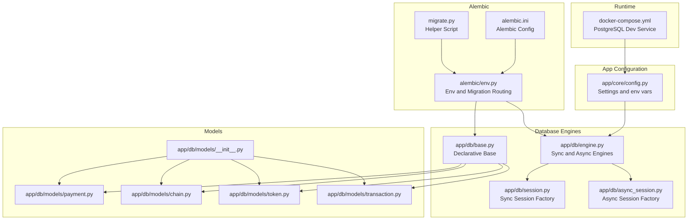
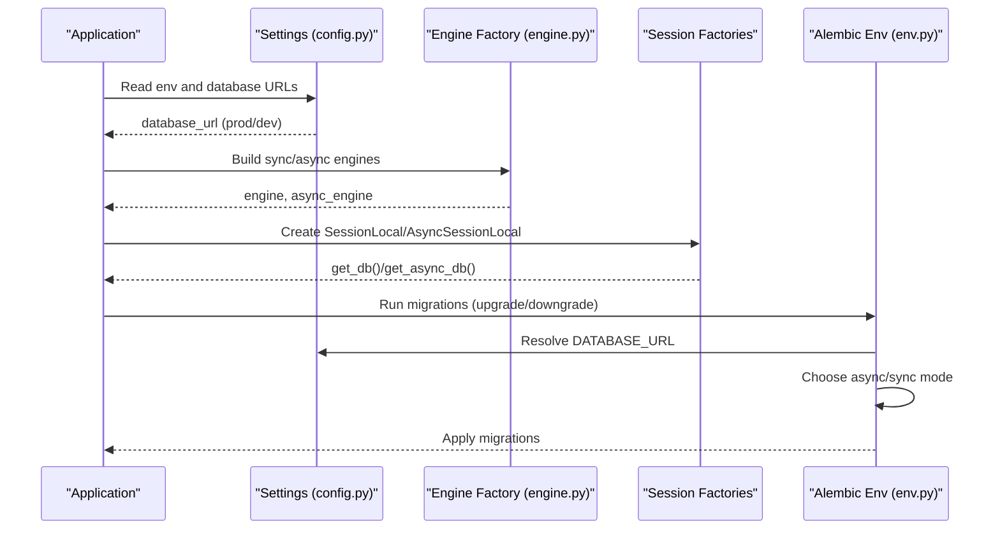
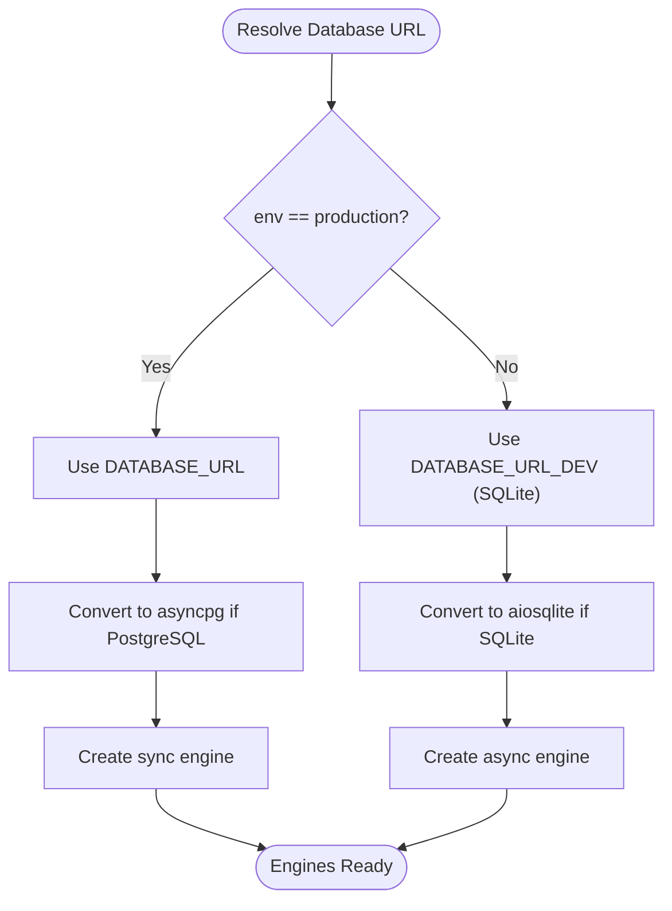
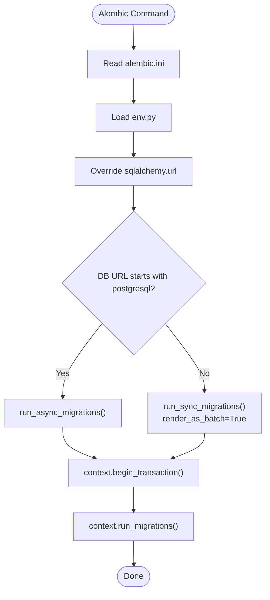
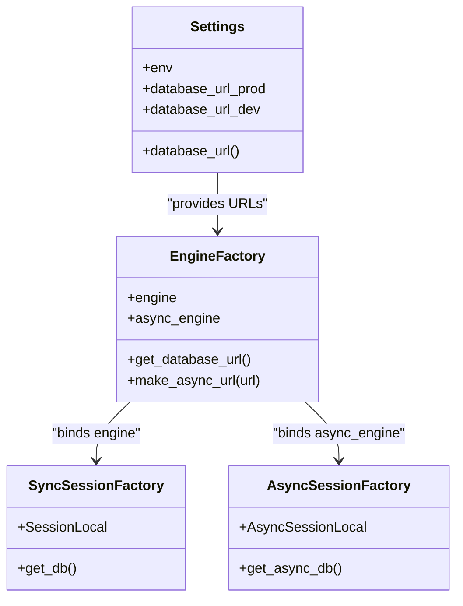
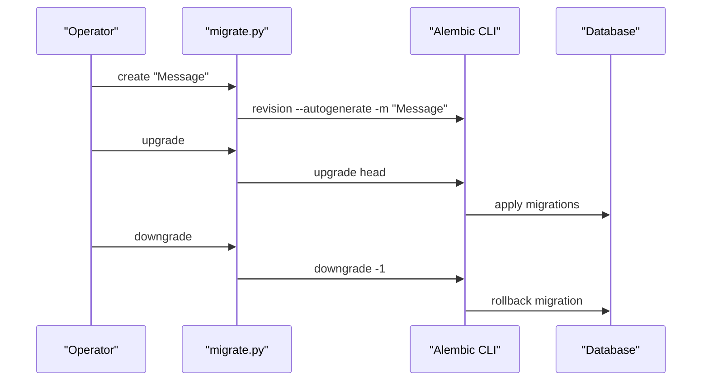
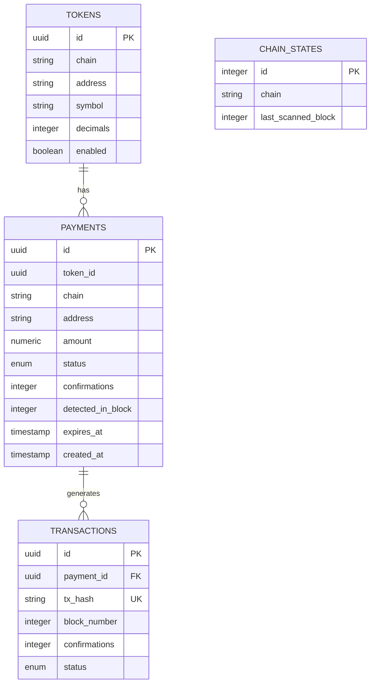
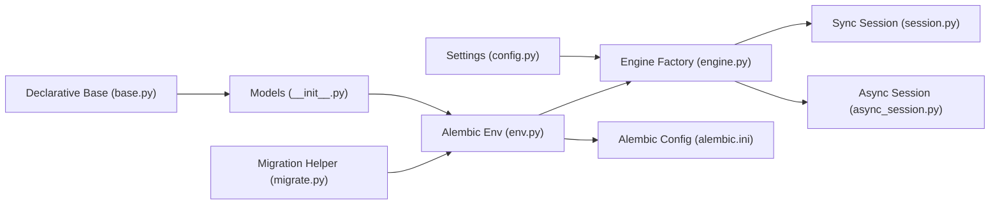

# Database Configuration

<cite>
**Referenced Files in This Document**
- [app/core/config.py](file://app/core/config.py)
- [app/db/engine.py](file://app/db/engine.py)
- [app/db/session.py](file://app/db/session.py)
- [app/db/async_session.py](file://app/db/async_session.py)
- [app/db/base.py](file://app/db/base.py)
- [app/db/models/__init__.py](file://app/db/models/__init__.py)
- [app/db/models/payment.py](file://app/db/models/payment.py)
- [app/db/models/chain.py](file://app/db/models/chain.py)
- [app/db/models/token.py](file://app/db/models/token.py)
- [app/db/models/transaction.py](file://app/db/models/transaction.py)
- [alembic/env.py](file://alembic/env.py)
- [alembic.ini](file://alembic.ini)
- [migrate.py](file://migrate.py)
- [MIGRATIONS.md](file://MIGRATIONS.md)
- [docker-compose.yml](file://docker-compose.yml)
</cite>

## Table of Contents
1. [Introduction](#introduction)
2. [Project Structure](#project-structure)
3. [Core Components](#core-components)
4. [Architecture Overview](#architecture-overview)
5. [Detailed Component Analysis](#detailed-component-analysis)
6. [Dependency Analysis](#dependency-analysis)
7. [Performance Considerations](#performance-considerations)
8. [Troubleshooting Guide](#troubleshooting-guide)
9. [Conclusion](#conclusion)
10. [Appendices](#appendices)

## Introduction
This document describes the database configuration for the cTrip Payment Gateway. It covers connection settings for PostgreSQL and SQLite, Alembic migration configuration and version management, async database session configuration and connection pooling, initialization and migration execution, rollback strategies, environment-specific configuration, security considerations for credentials, examples of custom configurations, connection tuning parameters, troubleshooting connectivity issues, and backup/recovery/maintenance procedures.

## Project Structure
The database configuration spans several modules:
- Settings and environment-aware database URLs
- Synchronous and asynchronous SQLAlchemy engines
- Session factories for sync and async usage
- Alembic configuration for migrations
- Helper script for migration operations
- Docker Compose for local development with PostgreSQL

**Diagram sources**
- [app/core/config.py](file://app/core/config.py#L1-L126)
- [app/db/engine.py](file://app/db/engine.py#L1-L32)
- [app/db/session.py](file://app/db/session.py#L1-L17)
- [app/db/async_session.py](file://app/db/async_session.py#L1-L15)
- [app/db/base.py](file://app/db/base.py#L1-L5)
- [app/db/models/__init__.py](file://app/db/models/__init__.py#L1-L12)
- [app/db/models/payment.py](file://app/db/models/payment.py#L1-L74)
- [app/db/models/chain.py](file://app/db/models/chain.py#L1-L17)
- [app/db/models/token.py](file://app/db/models/token.py#L1-L15)
- [app/db/models/transaction.py](file://app/db/models/transaction.py#L1-L40)
- [alembic/env.py](file://alembic/env.py#L1-L142)
- [alembic.ini](file://alembic.ini#L1-L151)
- [migrate.py](file://migrate.py#L1-L112)
- [docker-compose.yml](file://docker-compose.yml#L1-L54)

**Section sources**
- [app/core/config.py](file://app/core/config.py#L1-L126)
- [app/db/engine.py](file://app/db/engine.py#L1-L32)
- [app/db/session.py](file://app/db/session.py#L1-L17)
- [app/db/async_session.py](file://app/db/async_session.py#L1-L15)
- [app/db/base.py](file://app/db/base.py#L1-L5)
- [app/db/models/__init__.py](file://app/db/models/__init__.py#L1-L12)
- [alembic/env.py](file://alembic/env.py#L1-L142)
- [alembic.ini](file://alembic.ini#L1-L151)
- [migrate.py](file://migrate.py#L1-L112)
- [MIGRATIONS.md](file://MIGRATIONS.md#L1-L283)
- [docker-compose.yml](file://docker-compose.yml#L1-L54)

## Core Components
- Settings and environment-aware database URLs:
  - Development: SQLite by default
  - Production: PostgreSQL via environment variable
  - Dynamic selection based on environment
- Engines:
  - Synchronous engine with connection pooling and pre-ping
  - Asynchronous engine with asyncpg/aiosqlite prefixes
- Sessions:
  - Sync session factory
  - Async session factory with generator lifecycle
- Alembic:
  - Env overrides URL from settings
  - Auto-selects async or sync migrations based on URL
  - Batch mode for SQLite compatibility
- Migration helper:
  - Wraps common Alembic commands with defaults and error handling

**Section sources**
- [app/core/config.py](file://app/core/config.py#L10-L92)
- [app/db/engine.py](file://app/db/engine.py#L5-L32)
- [app/db/session.py](file://app/db/session.py#L5-L17)
- [app/db/async_session.py](file://app/db/async_session.py#L6-L15)
- [alembic/env.py](file://alembic/env.py#L20-L136)
- [alembic.ini](file://alembic.ini#L86-L91)
- [migrate.py](file://migrate.py#L22-L112)

## Architecture Overview
The runtime database architecture integrates configuration-driven URLs, engine creation, and session factories. Alembic orchestrates migrations using the same URL resolution logic.

**Diagram sources**
- [app/core/config.py](file://app/core/config.py#L10-L92)
- [app/db/engine.py](file://app/db/engine.py#L5-L32)
- [app/db/session.py](file://app/db/session.py#L5-L17)
- [app/db/async_session.py](file://app/db/async_session.py#L6-L15)
- [alembic/env.py](file://alembic/env.py#L20-L136)

## Detailed Component Analysis

### Database Connection Settings
- Environment selection:
  - Development: SQLite file path
  - Production: PostgreSQL URL from environment variable
- URL construction:
  - Synchronous engine uses a fixed pool size and pre-ping
  - Asynchronous engine uses asyncpg/aiosqlite prefixes derived from the base URL
- Docker Compose:
  - PostgreSQL service exposes port 5432
  - Application connects using asyncpg driver

**Diagram sources**
- [app/core/config.py](file://app/core/config.py#L10-L92)
- [app/db/engine.py](file://app/db/engine.py#L5-L32)
- [docker-compose.yml](file://docker-compose.yml#L26-L29)

**Section sources**
- [app/core/config.py](file://app/core/config.py#L10-L92)
- [app/db/engine.py](file://app/db/engine.py#L5-L32)
- [docker-compose.yml](file://docker-compose.yml#L26-L29)

### Alembic Migration Configuration and Version Management
- Alembic configuration:
  - Script location and file templates
  - Logging configuration
  - URL override in env.py
- Migration routing:
  - Offline/Online modes
  - Async migrations for PostgreSQL
  - Sync migrations with batch mode for SQLite
- Helper script:
  - Wraps common Alembic commands
  - Provides defaults and error handling

**Diagram sources**
- [alembic/env.py](file://alembic/env.py#L20-L136)
- [alembic.ini](file://alembic.ini#L8-L91)

**Section sources**
- [alembic/env.py](file://alembic/env.py#L1-L142)
- [alembic.ini](file://alembic.ini#L1-L151)
- [migrate.py](file://migrate.py#L1-L112)
- [MIGRATIONS.md](file://MIGRATIONS.md#L1-L283)

### Async Database Session Configuration and Connection Pooling
- Synchronous sessions:
  - Session factory bound to sync engine
  - Generator-based lifecycle
- Asynchronous sessions:
  - Session factory bound to async engine
  - Async generator for scoped sessions
- Connection pooling:
  - Pre-ping enabled for resilience
  - Fixed pool size for sync engine
  - Async engine uses default pooling behavior

**Diagram sources**
- [app/core/config.py](file://app/core/config.py#L10-L92)
- [app/db/engine.py](file://app/db/engine.py#L5-L32)
- [app/db/session.py](file://app/db/session.py#L5-L17)
- [app/db/async_session.py](file://app/db/async_session.py#L6-L15)

**Section sources**
- [app/db/session.py](file://app/db/session.py#L1-L17)
- [app/db/async_session.py](file://app/db/async_session.py#L1-L15)
- [app/db/engine.py](file://app/db/engine.py#L22-L32)

### Database Initialization Procedures, Migration Execution, and Rollback Strategies
- Initialization:
  - Ensure migrations are applied before starting the server
  - Use helper script or Alembic CLI
- Execution:
  - Upgrade to latest revision
  - Review and commit migration files
- Rollback:
  - Downgrade by one revision or to a specific revision
  - Use stamp to mark without running when necessary

**Diagram sources**
- [migrate.py](file://migrate.py#L30-L68)
- [MIGRATIONS.md](file://MIGRATIONS.md#L7-L43)

**Section sources**
- [migrate.py](file://migrate.py#L1-L112)
- [MIGRATIONS.md](file://MIGRATIONS.md#L70-L171)

### Environment-Specific Configuration and Security Considerations
- Environments:
  - Development: SQLite file path
  - Production: PostgreSQL URL from environment variable
  - Testing: Inherits from environment selection
- Security:
  - Private key validated as Ethereum key
  - Secret key must be changed in production
  - Credentials stored in environment variables
- Docker Compose:
  - PostgreSQL credentials and database name
  - Application connects using asyncpg driver

**Section sources**
- [app/core/config.py](file://app/core/config.py#L10-L122)
- [docker-compose.yml](file://docker-compose.yml#L4-L13)
- [docker-compose.yml](file://docker-compose.yml#L26-L29)

### Examples of Custom Database Configurations and Connection Tuning
- Custom PostgreSQL:
  - Use asyncpg driver with async URL
  - Adjust pool size and pre-ping as needed
- Custom SQLite:
  - Use aiosqlite driver with async URL
  - Consider WAL mode and pragmas for performance
- Alembic tuning:
  - Timestamped filenames for organization
  - Compare types and server defaults for strictness

**Section sources**
- [app/db/engine.py](file://app/db/engine.py#L12-L32)
- [alembic.ini](file://alembic.ini#L10-L16)
- [alembic/env.py](file://alembic/env.py#L63-L74)

### Database Schema Overview
The models define the core entities for payments, transactions, tokens, and chain state. They inherit from a shared declarative base and are imported into Alembic’s metadata for migration detection.

**Diagram sources**
- [app/db/models/payment.py](file://app/db/models/payment.py#L41-L58)
- [app/db/models/transaction.py](file://app/db/models/transaction.py#L29-L40)
- [app/db/models/token.py](file://app/db/models/token.py#L6-L15)
- [app/db/models/chain.py](file://app/db/models/chain.py#L9-L17)
- [app/db/base.py](file://app/db/base.py#L1-L5)

**Section sources**
- [app/db/models/__init__.py](file://app/db/models/__init__.py#L1-L12)
- [app/db/models/payment.py](file://app/db/models/payment.py#L1-L74)
- [app/db/models/transaction.py](file://app/db/models/transaction.py#L1-L40)
- [app/db/models/token.py](file://app/db/models/token.py#L1-L15)
- [app/db/models/chain.py](file://app/db/models/chain.py#L1-L17)

## Dependency Analysis
The following diagram shows how configuration, engines, sessions, and Alembic interrelate.

**Diagram sources**
- [app/core/config.py](file://app/core/config.py#L10-L92)
- [app/db/engine.py](file://app/db/engine.py#L5-L32)
- [app/db/session.py](file://app/db/session.py#L5-L17)
- [app/db/async_session.py](file://app/db/async_session.py#L6-L15)
- [app/db/base.py](file://app/db/base.py#L1-L5)
- [app/db/models/__init__.py](file://app/db/models/__init__.py#L1-L12)
- [alembic/env.py](file://alembic/env.py#L9-L29)
- [alembic.ini](file://alembic.ini#L8-L91)
- [migrate.py](file://migrate.py#L22-L68)

**Section sources**
- [app/core/config.py](file://app/core/config.py#L10-L92)
- [app/db/engine.py](file://app/db/engine.py#L5-L32)
- [app/db/session.py](file://app/db/session.py#L5-L17)
- [app/db/async_session.py](file://app/db/async_session.py#L6-L15)
- [app/db/base.py](file://app/db/base.py#L1-L5)
- [app/db/models/__init__.py](file://app/db/models/__init__.py#L1-L12)
- [alembic/env.py](file://alembic/env.py#L9-L29)
- [alembic.ini](file://alembic.ini#L8-L91)
- [migrate.py](file://migrate.py#L22-L68)

## Performance Considerations
- Connection pooling:
  - Pre-ping enabled for robustness
  - Fixed pool size for sync engine; adjust based on workload
- Async drivers:
  - Prefer asyncpg for PostgreSQL
  - Use aiosqlite for SQLite
- SQLite:
  - Batch mode for ALTER TABLE compatibility
  - Consider WAL mode and pragmas for write-heavy workloads
- Alembic:
  - Timestamped filenames aid organization
  - Strict type comparison helps prevent subtle schema drift

[No sources needed since this section provides general guidance]

## Troubleshooting Guide
Common issues and resolutions:
- Event loop conflicts:
  - Use new event loops per task when integrating with workers
- SQLite ALTER TABLE errors:
  - Alembic runs in batch mode; review and refine migrations if needed
- Migration detection problems:
  - Ensure all models are imported in Alembic env and inherit from the shared base
- Database out of sync:
  - Stamp the revision table to mark current without running migrations

**Section sources**
- [MIGRATIONS.md](file://MIGRATIONS.md#L172-L195)

## Conclusion
The cTrip Payment Gateway employs environment-aware database configuration, robust Alembic migrations, and both sync and async session factories. Production deployments should use PostgreSQL with asyncpg, while development defaults to SQLite. Adhering to the documented migration workflow, security practices, and troubleshooting steps ensures reliable operation across environments.

[No sources needed since this section summarizes without analyzing specific files]

## Appendices

### Appendix A: Environment Variables and Defaults
- DATABASE_URL: Production PostgreSQL URL
- DATABASE_URL_DEV: Development SQLite file path
- REDIS_URL: Redis connection URL
- ENV: Application environment (development/production/testing)
- RPC_URL: Ethereum RPC endpoint
- PRIVATE_KEY: Required for production
- SECRET_KEY: Must be changed in production

**Section sources**
- [app/core/config.py](file://app/core/config.py#L10-L92)
- [docker-compose.yml](file://docker-compose.yml#L26-L32)

### Appendix B: Migration Commands Reference
- Create migration: generate with autogenerate
- Apply migrations: upgrade to head
- Rollback: downgrade by one or to a specific revision
- Inspect: show current and history
- Stamp: mark database as current without running

**Section sources**
- [migrate.py](file://migrate.py#L30-L68)
- [MIGRATIONS.md](file://MIGRATIONS.md#L7-L43)

### Appendix C: Backup, Recovery, and Maintenance
- Backup:
  - Use database-native tools (e.g., pg_dump for PostgreSQL)
- Recovery:
  - Restore from backups and re-run migrations if necessary
- Maintenance:
  - Vacuum/analyze for PostgreSQL
  - PRAGMA statements for SQLite (e.g., WAL, integrity checks)

[No sources needed since this section provides general guidance]