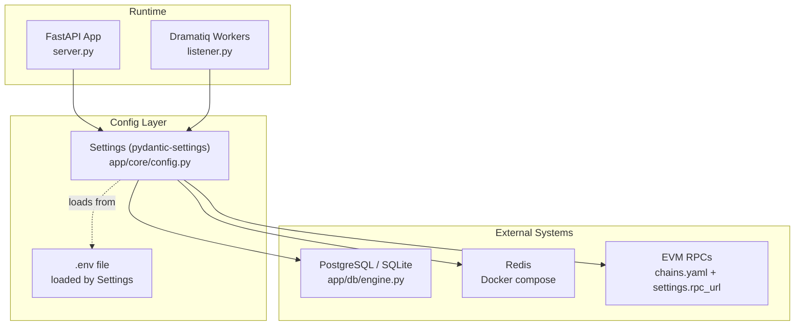
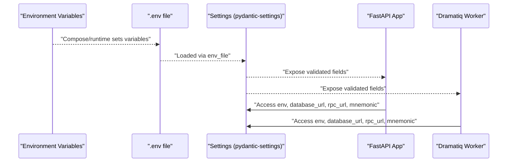
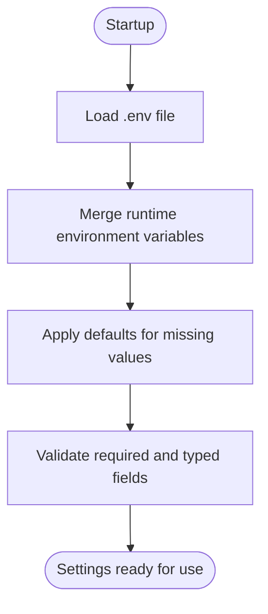
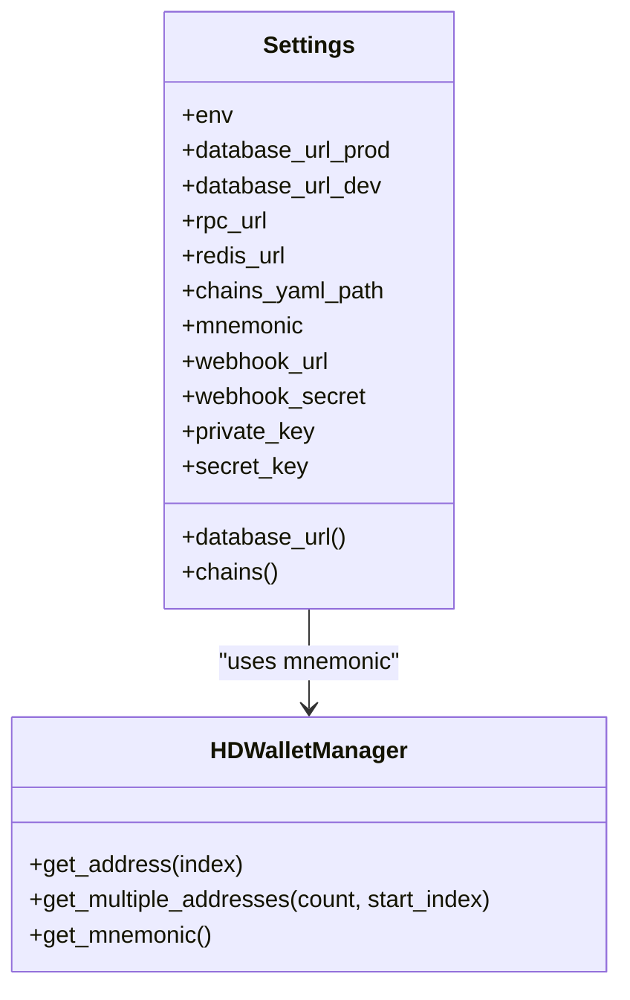
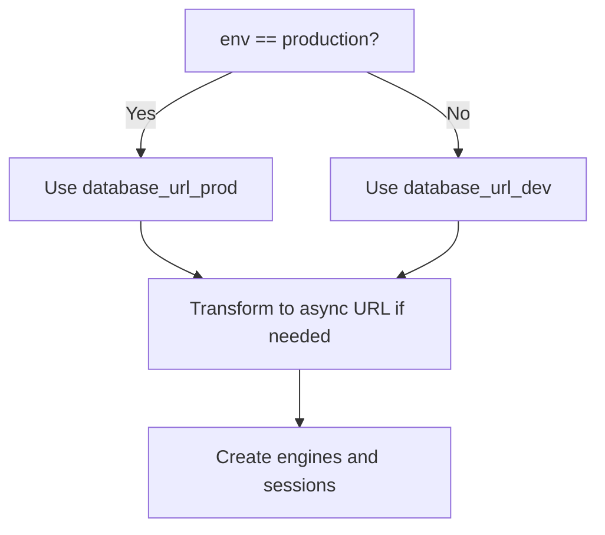
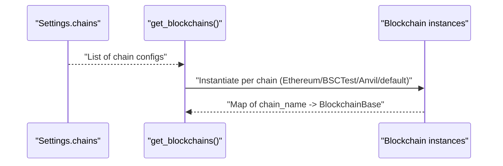
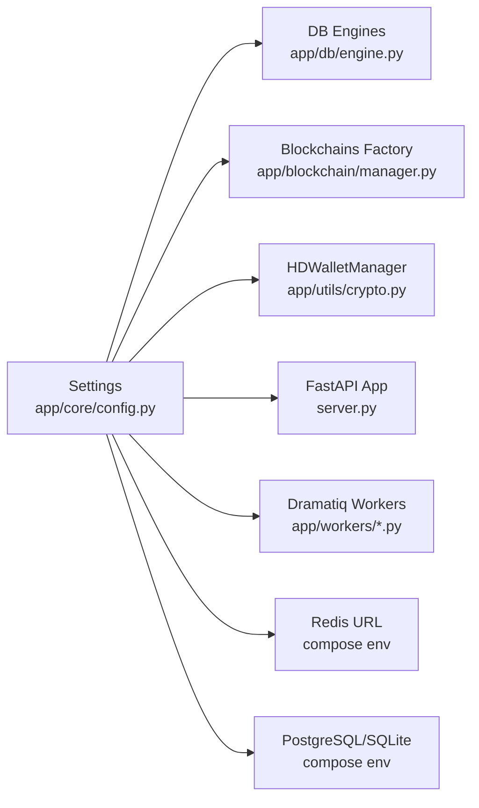
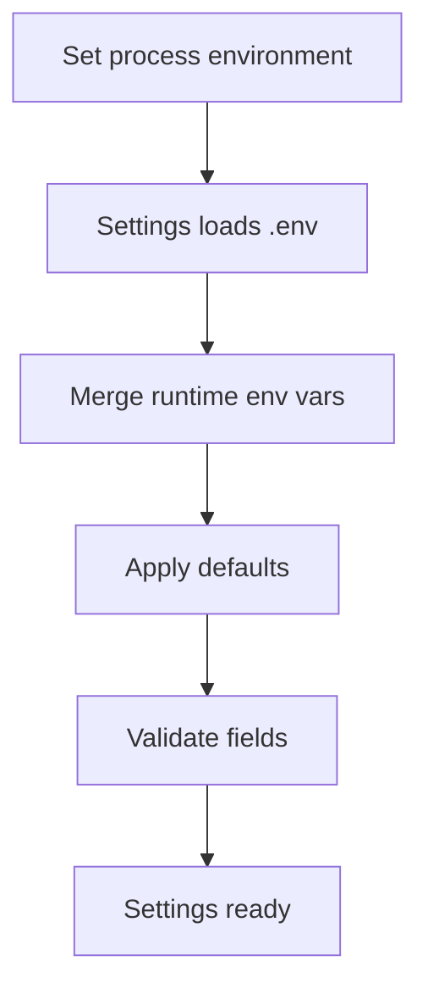

# Environment Variables

<cite>
**Referenced Files in This Document**
- [config.py](https://github.com/rakibhossain72/ctrip/blob/main/app/core/config.py)
- [server.py](https://github.com/rakibhossain72/ctrip/blob/main/server.py)
- [docker-compose.yml](https://github.com/rakibhossain72/ctrip/blob/main/docker-compose.yml)
- [Dockerfile](https://github.com/rakibhossain72/ctrip/blob/main/Dockerfile)
- [chains.yaml](https://github.com/rakibhossain72/ctrip/blob/main/chains.yaml)
- [crypto.py](https://github.com/rakibhossain72/ctrip/blob/main/app/utils/crypto.py)
- [base.py](https://github.com/rakibhossain72/ctrip/blob/main/app/blockchain/base.py)
- [manager.py](https://github.com/rakibhossain72/ctrip/blob/main/app/blockchain/manager.py)
- [engine.py](https://github.com/rakibhossain72/ctrip/blob/main/app/db/engine.py)
- [listener.py](https://github.com/rakibhossain72/ctrip/blob/main/app/workers/listener.py)
- [README.md](https://github.com/rakibhossain72/ctrip/blob/main/README.md)
</cite>

## Table of Contents
1. [Introduction](#introduction)
2. [Project Structure](#project-structure)
3. [Core Components](#core-components)
4. [Architecture Overview](#architecture-overview)
5. [Detailed Component Analysis](#detailed-component-analysis)
6. [Dependency Analysis](#dependency-analysis)
7. [Performance Considerations](#performance-considerations)
8. [Troubleshooting Guide](#troubleshooting-guide)
9. [Conclusion](#conclusion)
10. [Appendices](#appendices)

## Introduction
This document explains how environment variables are defined, loaded, validated, and used across the cTrip Payment Gateway. It covers required and optional variables, precedence rules, sensitive data handling, development versus production differences, and practical configuration scenarios. It also documents configuration validation and error handling for missing or invalid values.

## Project Structure
The configuration system centers around a single settings class that loads values from environment variables and a .env file, with defaults applied when variables are absent. Services and workers consume these settings to configure databases, blockchains, Redis, and cryptographic keys.

**Diagram sources**
- [config.py](https://github.com/rakibhossain72/ctrip/blob/main/app/core/config.py#L10-L126)
- [server.py](https://github.com/rakibhossain72/ctrip/blob/main/server.py#L18-L47)
- [engine.py](https://github.com/rakibhossain72/ctrip/blob/main/app/db/engine.py#L1-L32)
- [docker-compose.yml](https://github.com/rakibhossain72/ctrip/blob/main/docker-compose.yml#L26-L50)
- [chains.yaml](https://github.com/rakibhossain72/ctrip/blob/main/chains.yaml#L1-L24)

**Section sources**
- [config.py](https://github.com/rakibhossain72/ctrip/blob/main/app/core/config.py#L10-L126)
- [server.py](https://github.com/rakibhossain72/ctrip/blob/main/server.py#L18-L47)
- [engine.py](https://github.com/rakibhossain72/ctrip/blob/main/app/db/engine.py#L1-L32)
- [docker-compose.yml](https://github.com/rakibhossain72/ctrip/blob/main/docker-compose.yml#L26-L50)
- [chains.yaml](https://github.com/rakibhossain72/ctrip/blob/main/chains.yaml#L1-L24)

## Core Components
This section enumerates all environment variables recognized by the application, their roles, and whether they are required or optional. Defaults are documented where applicable.

- Required variables
  - PRIVATE_KEY: Ethereum private key used for signing transactions. Required in production.
  - DATABASE_URL: Full database URL for the running environment. Production uses the production URL; development uses the dev URL. The compose file sets this for containers.
  - REDIS_URL: Redis connection URL for background workers.
  - RPC_URL: EVM RPC endpoint used when chains.yaml does not define chains or when fallback is needed.

- Optional variables
  - ENV: Application environment selector ("development", "production", "testing"). Defaults to "development".
  - MNEMONIC: HD wallet mnemonic phrase used to derive payment addresses. Defaults to a test phrase.
  - CHAINS_YAML_PATH: Path to the YAML file containing chain configurations. Defaults to "chains.yaml".
  - WEBHOOK_URL: Global webhook URL for payment notifications.
  - WEBHOOK_SECRET: Secret key for signing webhook payloads.
  - SECRET_KEY: Application secret for cryptography. Must be changed in production.

Notes:
- The settings class loads variables from a .env file located at the repository root and applies defaults when variables are missing.
- The application selects the appropriate database URL based on the environment setting.

**Section sources**
- [config.py](https://github.com/rakibhossain72/ctrip/blob/main/app/core/config.py#L11-L122)
- [docker-compose.yml](https://github.com/rakibhossain72/ctrip/blob/main/docker-compose.yml#L26-L50)
- [engine.py](https://github.com/rakibhossain72/ctrip/blob/main/app/db/engine.py#L5-L11)

## Architecture Overview
The configuration loading pipeline and runtime usage are illustrated below.

**Diagram sources**
- [config.py](https://github.com/rakibhossain72/ctrip/blob/main/app/core/config.py#L115-L122)
- [server.py](https://github.com/rakibhossain72/ctrip/blob/main/server.py#L18-L47)
- [listener.py](https://github.com/rakibhossain72/ctrip/blob/main/app/workers/listener.py#L21-L46)

## Detailed Component Analysis

### Configuration Loading Mechanism and Precedence
- Source order and precedence:
  - Environment variables set at runtime override values in the .env file.
  - The .env file is loaded automatically by the settings class.
  - Defaults are applied when neither environment nor .env provide a value.
- Case sensitivity:
  - Environment variable names are case-insensitive.
- Prefix and extras:
  - No environment variable prefix is expected.
  - Unknown variables are ignored.
- Validation:
  - Private key is validated as a valid Ethereum private key.
  - Secret key must be changed from default in production.

**Diagram sources**
- [config.py](https://github.com/rakibhossain72/ctrip/blob/main/app/core/config.py#L115-L122)
- [config.py](https://github.com/rakibhossain72/ctrip/blob/main/app/core/config.py#L94-L112)

**Section sources**
- [config.py](https://github.com/rakibhossain72/ctrip/blob/main/app/core/config.py#L115-L122)
- [config.py](https://github.com/rakibhossain72/ctrip/blob/main/app/core/config.py#L94-L112)

### Sensitive Data Management
- Private key handling:
  - Stored as a secret field and validated as a valid Ethereum private key.
  - Required in production; must not be committed to source control.
- Mnemonic phrase storage:
  - Used to derive HD wallet payment addresses.
  - Defaults to a test mnemonic for development; must be replaced with a secure, offline-backed mnemonic in production.
- Credential rotation:
  - Rotate SECRET_KEY in production by replacing the value in .env or environment.
  - Replace PRIVATE_KEY periodically using secure key management systems.

**Diagram sources**
- [config.py](https://github.com/rakibhossain72/ctrip/blob/main/app/core/config.py#L10-L126)
- [crypto.py](https://github.com/rakibhossain72/ctrip/blob/main/app/utils/crypto.py#L5-L67)

**Section sources**
- [config.py](https://github.com/rakibhossain72/ctrip/blob/main/app/core/config.py#L74-L82)
- [config.py](https://github.com/rakibhossain72/ctrip/blob/main/app/core/config.py#L94-L112)
- [crypto.py](https://github.com/rakibhossain72/ctrip/blob/main/app/utils/crypto.py#L5-L67)

### Database Configuration
- Dynamic selection:
  - The effective database URL is chosen based on the environment setting.
- URL transformation:
  - The engine module converts PostgreSQL and SQLite URLs to async variants for async database operations.
- Compose defaults:
  - The compose file sets DATABASE_URL for app and worker services.

**Diagram sources**
- [config.py](https://github.com/rakibhossain72/ctrip/blob/main/app/core/config.py#L84-L92)
- [engine.py](https://github.com/rakibhossain72/ctrip/blob/main/app/db/engine.py#L5-L17)

**Section sources**
- [config.py](https://github.com/rakibhossain72/ctrip/blob/main/app/core/config.py#L18-L26)
- [config.py](https://github.com/rakibhossain72/ctrip/blob/main/app/core/config.py#L84-L92)
- [engine.py](https://github.com/rakibhossain72/ctrip/blob/main/app/db/engine.py#L5-L17)
- [docker-compose.yml](https://github.com/rakibhossain72/ctrip/blob/main/docker-compose.yml#L27-L28)

### Blockchain RPC Configuration
- Chain definitions:
  - Chains are loaded from a YAML file; each chain defines a name and RPC URL.
- Fallback:
  - If the YAML file is missing or empty, a default Anvil chain is used with the RPC URL from settings.
- Runtime usage:
  - Blockchains are instantiated per configured chain and used by workers and services.

**Diagram sources**
- [config.py](https://github.com/rakibhossain72/ctrip/blob/main/app/core/config.py#L44-L56)
- [manager.py](https://github.com/rakibhossain72/ctrip/blob/main/app/blockchain/manager.py#L8-L32)
- [chains.yaml](https://github.com/rakibhossain72/ctrip/blob/main/chains.yaml#L1-L24)

**Section sources**
- [config.py](https://github.com/rakibhossain72/ctrip/blob/main/app/core/config.py#L39-L42)
- [config.py](https://github.com/rakibhossain72/ctrip/blob/main/app/core/config.py#L44-L56)
- [manager.py](https://github.com/rakibhossain72/ctrip/blob/main/app/blockchain/manager.py#L8-L32)
- [chains.yaml](https://github.com/rakibhossain72/ctrip/blob/main/chains.yaml#L1-L24)

### Redis and Background Workers
- Redis URL:
  - Provided via environment variable and used by Dramatiq workers.
- Worker startup:
  - Workers are started separately and inherit the same environment configuration.

**Section sources**
- [config.py](https://github.com/rakibhossain72/ctrip/blob/main/app/core/config.py#L34-L37)
- [docker-compose.yml](https://github.com/rakibhossain72/ctrip/blob/main/docker-compose.yml#L42-L50)
- [listener.py](https://github.com/rakibhossain72/ctrip/blob/main/app/workers/listener.py#L21-L46)

### Webhook Configuration
- Optional webhook URL and secret:
  - Used to sign and deliver payment notifications.
- Not enforced as required; absence disables webhook features.

**Section sources**
- [config.py](https://github.com/rakibhossain72/ctrip/blob/main/app/core/config.py#L63-L71)

### Development vs Production Differences
- Environment mode:
  - ENV controls which database URL is selected and whether strict secret key validation applies.
- Production requirements:
  - PRIVATE_KEY must be present and valid.
  - SECRET_KEY must not match default values.
- Development defaults:
  - DATABASE_URL_DEV points to a local SQLite database.
  - MNEMONIC defaults to a test phrase.

**Section sources**
- [config.py](https://github.com/rakibhossain72/ctrip/blob/main/app/core/config.py#L12-L15)
- [config.py](https://github.com/rakibhossain72/ctrip/blob/main/app/core/config.py#L84-L92)
- [config.py](https://github.com/rakibhossain72/ctrip/blob/main/app/core/config.py#L104-L112)
- [engine.py](https://github.com/rakibhossain72/ctrip/blob/main/app/db/engine.py#L5-L11)

## Dependency Analysis
The following diagram shows how configuration is consumed across the system.

**Diagram sources**
- [config.py](https://github.com/rakibhossain72/ctrip/blob/main/app/core/config.py#L10-L126)
- [engine.py](https://github.com/rakibhossain72/ctrip/blob/main/app/db/engine.py#L1-L32)
- [manager.py](https://github.com/rakibhossain72/ctrip/blob/main/app/blockchain/manager.py#L1-L33)
- [crypto.py](https://github.com/rakibhossain72/ctrip/blob/main/app/utils/crypto.py#L1-L90)
- [server.py](https://github.com/rakibhossain72/ctrip/blob/main/server.py#L18-L47)
- [listener.py](https://github.com/rakibhossain72/ctrip/blob/main/app/workers/listener.py#L1-L46)
- [docker-compose.yml](https://github.com/rakibhossain72/ctrip/blob/main/docker-compose.yml#L26-L50)

**Section sources**
- [config.py](https://github.com/rakibhossain72/ctrip/blob/main/app/core/config.py#L10-L126)
- [engine.py](https://github.com/rakibhossain72/ctrip/blob/main/app/db/engine.py#L1-L32)
- [manager.py](https://github.com/rakibhossain72/ctrip/blob/main/app/blockchain/manager.py#L1-L33)
- [crypto.py](https://github.com/rakibhossain72/ctrip/blob/main/app/utils/crypto.py#L1-L90)
- [server.py](https://github.com/rakibhossain72/ctrip/blob/main/server.py#L18-L47)
- [listener.py](https://github.com/rakibhossain72/ctrip/blob/main/app/workers/listener.py#L1-L46)
- [docker-compose.yml](https://github.com/rakibhossain72/ctrip/blob/main/docker-compose.yml#L26-L50)

## Performance Considerations
- Keep RPC endpoints responsive; consider multiple RPC URLs for redundancy.
- Use async database engines for throughput; ensure connection pooling settings match workload.
- Avoid frequent private key rotations during peak operation; schedule maintenance windows.

## Troubleshooting Guide
Common issues and resolutions:

- Missing PRIVATE_KEY in production
  - Symptom: Validation error indicating invalid private key or missing required value.
  - Resolution: Set PRIVATE_KEY in .env or environment and ensure it is a valid Ethereum private key.

- Invalid SECRET_KEY in production
  - Symptom: Validation error requiring a non-default secret key.
  - Resolution: Change SECRET_KEY to a strong, random value in .env or environment.

- Database connectivity errors
  - Symptom: Connection failures when starting the app or workers.
  - Resolution: Verify DATABASE_URL matches the running database service; confirm network connectivity and credentials.

- Blockchain connectivity errors
  - Symptom: Failure to connect to RPC endpoints.
  - Resolution: Confirm RPC_URL is reachable and valid; check chains.yaml entries; ensure fallback RPC_URL is set if chains.yaml is empty.

- Redis connectivity errors for workers
  - Symptom: Workers cannot connect to Redis.
  - Resolution: Verify REDIS_URL points to the running Redis instance.

- HD wallet mnemonic issues
  - Symptom: Unexpected payment addresses or mnemonic-related errors.
  - Resolution: Replace MNEMONIC with a secure, offline-backed phrase in production.

- Environment mode misconfiguration
  - Symptom: Wrong database URL selected or unexpected behavior.
  - Resolution: Set ENV to "development", "production", or "testing" appropriately.

**Section sources**
- [config.py](https://github.com/rakibhossain72/ctrip/blob/main/app/core/config.py#L94-L112)
- [engine.py](https://github.com/rakibhossain72/ctrip/blob/main/app/db/engine.py#L5-L11)
- [manager.py](https://github.com/rakibhossain72/ctrip/blob/main/app/blockchain/manager.py#L28-L32)
- [docker-compose.yml](https://github.com/rakibhossain72/ctrip/blob/main/docker-compose.yml#L26-L50)

## Conclusion
The cTrip Payment Gateway centralizes configuration through a validated settings class that reads from .env and environment variables, with sensible defaults and strict validation for production safety. By following the guidance here—securing secrets, validating configuration, and using environment-specific overrides—you can reliably operate the system across development and production.

## Appendices

### Environment Variable Reference
- PRIVATE_KEY: Ethereum private key (required in production)
- DATABASE_URL: Database URL for app and workers
- REDIS_URL: Redis connection URL for workers
- RPC_URL: Default EVM RPC endpoint
- ENV: Environment mode ("development", "production", "testing")
- MNEMONIC: HD wallet mnemonic phrase
- CHAINS_YAML_PATH: Path to chain configuration YAML
- WEBHOOK_URL: Webhook notification URL
- WEBHOOK_SECRET: Webhook signature secret
- SECRET_KEY: Application cryptography secret (must change in production)

**Section sources**
- [config.py](https://github.com/rakibhossain72/ctrip/blob/main/app/core/config.py#L11-L122)
- [docker-compose.yml](https://github.com/rakibhossain72/ctrip/blob/main/docker-compose.yml#L26-L50)

### Configuration Loading Flow

**Diagram sources**
- [config.py](https://github.com/rakibhossain72/ctrip/blob/main/app/core/config.py#L115-L122)

### Example Scenarios
- Development with local services
  - Use compose defaults for DATABASE_URL, REDIS_URL, RPC_URL, PRIVATE_KEY, and MNEMONIC.
  - Keep ENV=development to select the dev database URL.

- Production with managed services
  - Provide DATABASE_URL pointing to PostgreSQL, REDIS_URL to Redis, RPC_URL to a reliable endpoint, PRIVATE_KEY, SECRET_KEY, and a secure MNEMONIC.
  - Set ENV=production to enforce secret key validation and select the production database URL.

- Multi-chain configuration
  - Define chains in chains.yaml with names and RPC URLs; if empty, the manager falls back to RPC_URL.

**Section sources**
- [docker-compose.yml](https://github.com/rakibhossain72/ctrip/blob/main/docker-compose.yml#L26-L50)
- [manager.py](https://github.com/rakibhossain72/ctrip/blob/main/app/blockchain/manager.py#L28-L32)
- [chains.yaml](https://github.com/rakibhossain72/ctrip/blob/main/chains.yaml#L1-L24)
- [engine.py](https://github.com/rakibhossain72/ctrip/blob/main/app/db/engine.py#L5-L11)
- [config.py](https://github.com/rakibhossain72/ctrip/blob/main/app/core/config.py#L84-L92)