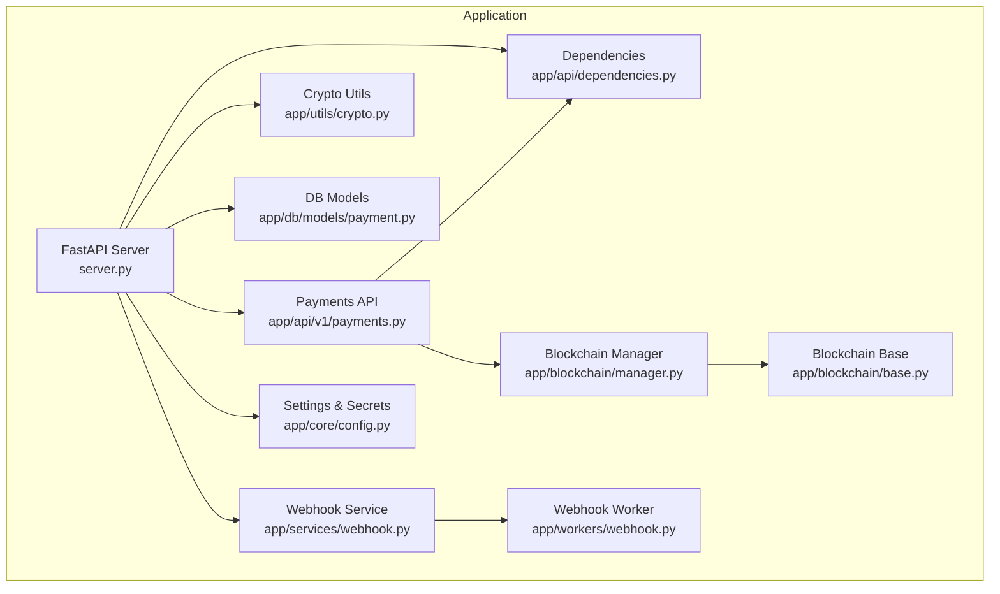
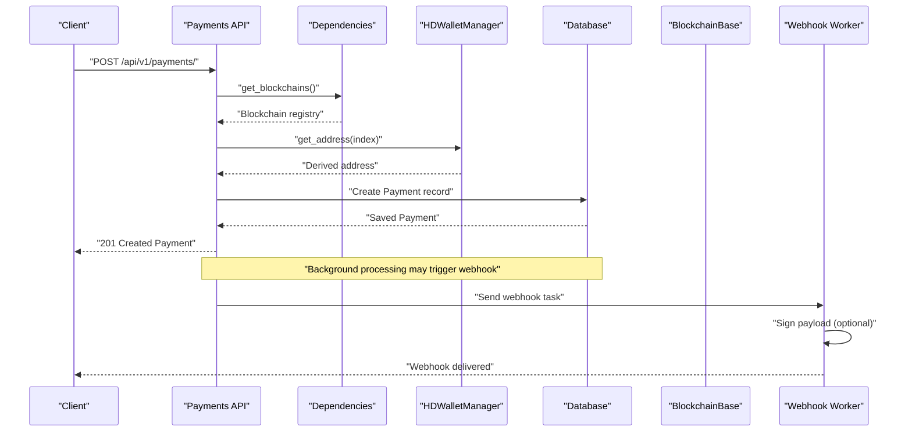
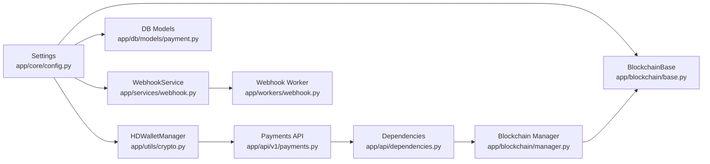

# Security Configuration

<cite>
**Referenced Files in This Document**
- [config.py](https://github.com/rakibhossain72/ctrip/blob/main/app/core/config.py)
- [crypto.py](https://github.com/rakibhossain72/ctrip/blob/main/app/utils/crypto.py)
- [server.py](https://github.com/rakibhossain72/ctrip/blob/main/server.py)
- [docker-compose.yml](https://github.com/rakibhossain72/ctrip/blob/main/docker-compose.yml)
- [chains.yaml](https://github.com/rakibhossain72/ctrip/blob/main/chains.yaml)
- [payments.py](https://github.com/rakibhossain72/ctrip/blob/main/app/api/v1/payments.py)
- [dependencies.py](https://github.com/rakibhossain72/ctrip/blob/main/app/api/dependencies.py)
- [manager.py](https://github.com/rakibhossain72/ctrip/blob/main/app/blockchain/manager.py)
- [base.py](https://github.com/rakibhossain72/ctrip/blob/main/app/blockchain/base.py)
- [payment.py](https://github.com/rakibhossain72/ctrip/blob/main/app/db/models/payment.py)
- [webhook.py](https://github.com/rakibhossain72/ctrip/blob/main/app/services/webhook.py)
- [webhook_worker.py](https://github.com/rakibhossain72/ctrip/blob/main/app/workers/webhook.py)
- [requirements.txt](https://github.com/rakibhossain72/ctrip/blob/main/requirements.txt)
</cite>

## Table of Contents
1. [Introduction](#introduction)
2. [Project Structure](#project-structure)
3. [Core Components](#core-components)
4. [Architecture Overview](#architecture-overview)
5. [Detailed Component Analysis](#detailed-component-analysis)
6. [Dependency Analysis](#dependency-analysis)
7. [Performance Considerations](#performance-considerations)
8. [Troubleshooting Guide](#troubleshooting-guide)
9. [Conclusion](#conclusion)
10. [Appendices](#appendices)

## Introduction
This document provides comprehensive security configuration guidance for the cTrip Payment Gateway. It focuses on secure handling of cryptographic keys, HD wallet mnemonics, and private key management; environment variable security practices; configuration encryption and credential protection; API security configuration including authentication, rate limiting, and access controls; network security settings, SSL/TLS configuration, and secure communication protocols; production deployment best practices; vulnerability assessment and security monitoring; secure configuration patterns; sensitive data handling; incident response; and compliance and audit procedures.

## Project Structure
The cTrip Payment Gateway is a FastAPI application with integrated blockchain connectivity, database persistence, and asynchronous workers. Security-relevant areas include:
- Centralized settings and secrets management
- HD wallet generation and derivation
- Blockchain provider connections and transaction signing
- Webhook delivery with optional HMAC signing
- Asynchronous workers for background tasks
- Database models for payment and HD wallet address tracking

**Diagram sources**
- [server.py](https://github.com/rakibhossain72/ctrip/blob/main/server.py#L1-L56)
- [config.py](https://github.com/rakibhossain72/ctrip/blob/main/app/core/config.py#L1-L126)
- [dependencies.py](https://github.com/rakibhossain72/ctrip/blob/main/app/api/dependencies.py#L1-L15)
- [payments.py](https://github.com/rakibhossain72/ctrip/blob/main/app/api/v1/payments.py#L1-L62)
- [manager.py](https://github.com/rakibhossain72/ctrip/blob/main/app/blockchain/manager.py#L1-L33)
- [base.py](https://github.com/rakibhossain72/ctrip/blob/main/app/blockchain/base.py#L1-L146)
- [crypto.py](https://github.com/rakibhossain72/ctrip/blob/main/app/utils/crypto.py#L1-L90)
- [payment.py](https://github.com/rakibhossain72/ctrip/blob/main/app/db/models/payment.py#L1-L74)
- [webhook.py](https://github.com/rakibhossain72/ctrip/blob/main/app/services/webhook.py#L1-L45)
- [webhook_worker.py](https://github.com/rakibhossain72/ctrip/blob/main/app/workers/webhook.py#L1-L37)

**Section sources**
- [server.py](https://github.com/rakibhossain72/ctrip/blob/main/server.py#L1-L56)
- [config.py](https://github.com/rakibhossain72/ctrip/blob/main/app/core/config.py#L1-L126)
- [dependencies.py](https://github.com/rakibhossain72/ctrip/blob/main/app/api/dependencies.py#L1-L15)
- [payments.py](https://github.com/rakibhossain72/ctrip/blob/main/app/api/v1/payments.py#L1-L62)
- [manager.py](https://github.com/rakibhossain72/ctrip/blob/main/app/blockchain/manager.py#L1-L33)
- [base.py](https://github.com/rakibhossain72/ctrip/blob/main/app/blockchain/base.py#L1-L146)
- [crypto.py](https://github.com/rakibhossain72/ctrip/blob/main/app/utils/crypto.py#L1-L90)
- [payment.py](https://github.com/rakibhossain72/ctrip/blob/main/app/db/models/payment.py#L1-L74)
- [webhook.py](https://github.com/rakibhossain72/ctrip/blob/main/app/services/webhook.py#L1-L45)
- [webhook_worker.py](https://github.com/rakibhossain72/ctrip/blob/main/app/workers/webhook.py#L1-L37)

## Core Components
- Settings and Secrets Management
  - Centralized configuration with environment-driven loading and strict validation for private keys and application secrets.
  - Production enforcement for changing default secrets.
- HD Wallet Management
  - Mnemonic-based HD derivation with BIP-44 path for Ethereum-compatible addresses.
- Blockchain Provider Integration
  - AsyncWeb3-based providers with POA support and gas estimation/caching.
- Transaction Signing and Submission
  - Private key usage for signing transactions with robust fallbacks.
- Webhook Delivery
  - Optional HMAC-SHA256 signing for payload integrity and authenticity.
- Asynchronous Workers
  - Dramatiq actors for background webhook delivery with retry logic.

**Section sources**
- [config.py](https://github.com/rakibhossain72/ctrip/blob/main/app/core/config.py#L1-L126)
- [crypto.py](https://github.com/rakibhossain72/ctrip/blob/main/app/utils/crypto.py#L1-L90)
- [base.py](https://github.com/rakibhossain72/ctrip/blob/main/app/blockchain/base.py#L1-L146)
- [webhook.py](https://github.com/rakibhossain72/ctrip/blob/main/app/services/webhook.py#L1-L45)
- [webhook_worker.py](https://github.com/rakibhossain72/ctrip/blob/main/app/workers/webhook.py#L1-L37)

## Architecture Overview
The security-critical flow involves:
- Application startup initializes settings, HD wallet, and blockchain providers.
- Payments API creates payment records and derives addresses using the HD wallet.
- Blockchain operations sign and submit transactions using the configured private key.
- Webhooks are sent with optional HMAC signatures to external systems.

**Diagram sources**
- [payments.py](https://github.com/rakibhossain72/ctrip/blob/main/app/api/v1/payments.py#L1-L62)
- [dependencies.py](https://github.com/rakibhossain72/ctrip/blob/main/app/api/dependencies.py#L1-L15)
- [crypto.py](https://github.com/rakibhossain72/ctrip/blob/main/app/utils/crypto.py#L1-L90)
- [payment.py](https://github.com/rakibhossain72/ctrip/blob/main/app/db/models/payment.py#L1-L74)
- [webhook_worker.py](https://github.com/rakibhossain72/ctrip/blob/main/app/workers/webhook.py#L1-L37)

## Detailed Component Analysis

### Settings and Secrets Management
- Environment-driven configuration with dotenv loading.
- Validation ensures:
  - Private key is a valid Ethereum key.
  - Production requires a non-default application secret.
- Sensitive fields are typed as SecretStr to avoid accidental logging.
- Dynamic database URL selection based on environment.

Security recommendations:
- Enforce runtime checks for production secrets and disallow defaults.
- Restrict filesystem permissions for .env and configuration files.
- Use secrets managers (e.g., Vault, AWS Secrets Manager) for production deployments.
- Rotate secrets regularly and maintain audit trails.

**Section sources**
- [config.py](https://github.com/rakibhossain72/ctrip/blob/main/app/core/config.py#L1-L126)

### HD Wallet Mnemonics and Private Key Management
- Mnemonic-based HD derivation using BIP-44 path for Ethereum.
- Private key used for signing transactions; must be stored securely and never exposed.
- Example mnemonic is provided for development/testing only.

Security recommendations:
- Never commit mnemonics or private keys to version control.
- Use hardware security modules (HSM) or secure enclaves for key storage.
- Limit access to key material to least-privileged identities.
- Implement key splitting and multi-signature schemes for high-value operations.

**Section sources**
- [crypto.py](https://github.com/rakibhossain72/ctrip/blob/main/app/utils/crypto.py#L1-L90)
- [base.py](https://github.com/rakibhossain72/ctrip/blob/main/app/blockchain/base.py#L135-L139)

### Blockchain Provider Integration and Transaction Signing
- AsyncWeb3 provider with configurable timeouts and optional POA middleware.
- Gas price caching and EIP-1559 fee estimation with fallbacks.
- Transaction building and signing using the private key.

Security recommendations:
- Use HTTPS endpoints for RPC providers.
- Validate chain IDs and enforce strict provider URLs.
- Cache gas prices judiciously and refresh on chain changes.
- Sign transactions offline when possible and use transaction builders with strict validation.

**Section sources**
- [base.py](https://github.com/rakibhossain72/ctrip/blob/main/app/blockchain/base.py#L1-L146)
- [manager.py](https://github.com/rakibhossain72/ctrip/blob/main/app/blockchain/manager.py#L1-L33)

### Webhook Delivery and Payload Integrity
- Optional HMAC-SHA256 signing using a shared secret header.
- Asynchronous delivery via Dramatiq actors with retries.

Security recommendations:
- Use HTTPS endpoints for webhook receivers.
- Rotate webhook secrets periodically and revoke old ones.
- Verify signatures on the receiver side and log verification failures.
- Implement idempotency to prevent duplicate processing.

**Section sources**
- [webhook.py](https://github.com/rakibhossain72/ctrip/blob/main/app/services/webhook.py#L1-L45)
- [webhook_worker.py](https://github.com/rakibhossain72/ctrip/blob/main/app/workers/webhook.py#L1-L37)

### Database Models and Sensitive Data Handling
- Payment and HD wallet address models persist derived addresses and metadata.
- Sensitive data (private keys, mnemonics) are not persisted in the database.

Security recommendations:
- Encrypt sensitive columns at rest if storing keys.
- Apply database row-level access controls and audit logging.
- Sanitize logs to avoid capturing sensitive fields.

**Section sources**
- [payment.py](https://github.com/rakibhossain72/ctrip/blob/main/app/db/models/payment.py#L1-L74)

### API Security Configuration
Current state:
- No explicit authentication, rate limiting, or access control middleware.
- Public endpoints for payments and health.

Recommended enhancements:
- Authentication: JWT, API keys, or mutual TLS for service-to-service and client integrations.
- Authorization: Role-based access control (RBAC) for administrative endpoints.
- Rate limiting: Per-IP and per-API key limits using middleware or gateway controls.
- Input validation and sanitization: Strict schemas and length/size limits.
- CORS: Configure allowed origins and credentials carefully.
- Transport security: Enforce HTTPS and HSTS.

[No sources needed since this section provides general guidance]

### Network Security and Secure Communication
- RPC endpoints are configurable; default development endpoint is HTTP.
- Webhook delivery uses httpx with a configurable timeout.

Recommendations:
- Use HTTPS for all RPC endpoints and webhook receivers.
- Configure TLS minimum versions and strong cipher suites.
- Implement certificate pinning for critical endpoints.
- Restrict outbound traffic to trusted domains only.

**Section sources**
- [base.py](https://github.com/rakibhossain72/ctrip/blob/main/app/blockchain/base.py#L34-L36)
- [webhook.py](https://github.com/rakibhossain72/ctrip/blob/main/app/services/webhook.py#L33-L35)

### Environment Variable Security Practices
- Environment variables are loaded from a dotenv file with case-insensitive keys.
- Private key and mnemonic are passed via environment variables in compose.

Recommendations:
- Use separate .env files per environment with restricted permissions.
- Avoid embedding secrets in images; pass via orchestration secrets.
- Scan for secrets in CI/CD pipelines and remove from logs.

**Section sources**
- [config.py](https://github.com/rakibhossain72/ctrip/blob/main/app/core/config.py#L115-L122)
- [docker-compose.yml](https://github.com/rakibhossain72/ctrip/blob/main/docker-compose.yml#L26-L50)

### Configuration Encryption and Credential Protection
- Sensitive fields are typed as SecretStr to reduce accidental exposure.
- Chain configurations are loaded from a YAML file.

Recommendations:
- Encrypt configuration files at rest.
- Use encrypted volumes or secret stores for production.
- Protect chains.yaml similarly if it contains sensitive RPC credentials.

**Section sources**
- [config.py](https://github.com/rakibhossain72/ctrip/blob/main/app/core/config.py#L1-L126)
- [chains.yaml](https://github.com/rakibhossain72/ctrip/blob/main/chains.yaml#L1-L24)

### Production Deployment Best Practices
- Run as non-root user with minimal privileges.
- Enable process isolation and resource limits.
- Use reverse proxies with WAF and rate limiting.
- Monitor and alert on anomalous API usage and key access patterns.
- Back up configuration and rotate secrets regularly.

[No sources needed since this section provides general guidance]

### Vulnerability Assessment and Security Monitoring
- Integrate static and dynamic analysis in CI/CD.
- Use dependency scanning for Python packages.
- Monitor logs for suspicious activity and signature verification failures.
- Implement distributed tracing and correlation for security events.

**Section sources**
- [requirements.txt](https://github.com/rakibhossain72/ctrip/blob/main/requirements.txt#L1-L106)

### Secure Configuration Patterns
- Load secrets from environment variables or secret managers.
- Validate inputs and enforce strict schemas.
- Use ephemeral credentials where possible; prefer short-lived tokens.
- Separate concerns: keep key material out of application logs and databases.

[No sources needed since this section provides general guidance]

### Handling Sensitive Data
- Avoid logging private keys, mnemonics, or HMAC secrets.
- Sanitize error messages to prevent information disclosure.
- Use secure deletion and zeroing of memory buffers containing secrets.

[No sources needed since this section provides general guidance]

### Responding to Security Incidents
- Immediately revoke compromised secrets and rotate keys.
- Audit access logs and change control records.
- Notify affected parties and regulatory bodies as required.
- Conduct post-mortem analysis and update security controls.

[No sources needed since this section provides general guidance]

### Compliance and Security Audit Procedures
- Maintain evidence of configuration changes and secret rotations.
- Document access controls and authorization policies.
- Perform periodic third-party audits and penetration testing.
- Align with standards such as SOC 2, ISO 27001, PCI DSS (if applicable).

[No sources needed since this section provides general guidance]

## Dependency Analysis
The following diagram highlights security-relevant dependencies among components.

**Diagram sources**
- [config.py](https://github.com/rakibhossain72/ctrip/blob/main/app/core/config.py#L1-L126)
- [crypto.py](https://github.com/rakibhossain72/ctrip/blob/main/app/utils/crypto.py#L1-L90)
- [base.py](https://github.com/rakibhossain72/ctrip/blob/main/app/blockchain/base.py#L1-L146)
- [payment.py](https://github.com/rakibhossain72/ctrip/blob/main/app/db/models/payment.py#L1-L74)
- [webhook.py](https://github.com/rakibhossain72/ctrip/blob/main/app/services/webhook.py#L1-L45)
- [webhook_worker.py](https://github.com/rakibhossain72/ctrip/blob/main/app/workers/webhook.py#L1-L37)
- [payments.py](https://github.com/rakibhossain72/ctrip/blob/main/app/api/v1/payments.py#L1-L62)
- [dependencies.py](https://github.com/rakibhossain72/ctrip/blob/main/app/api/dependencies.py#L1-L15)
- [manager.py](https://github.com/rakibhossain72/ctrip/blob/main/app/blockchain/manager.py#L1-L33)

**Section sources**
- [config.py](https://github.com/rakibhossain72/ctrip/blob/main/app/core/config.py#L1-L126)
- [crypto.py](https://github.com/rakibhossain72/ctrip/blob/main/app/utils/crypto.py#L1-L90)
- [base.py](https://github.com/rakibhossain72/ctrip/blob/main/app/blockchain/base.py#L1-L146)
- [payment.py](https://github.com/rakibhossain72/ctrip/blob/main/app/db/models/payment.py#L1-L74)
- [webhook.py](https://github.com/rakibhossain72/ctrip/blob/main/app/services/webhook.py#L1-L45)
- [webhook_worker.py](https://github.com/rakibhossain72/ctrip/blob/main/app/workers/webhook.py#L1-L37)
- [payments.py](https://github.com/rakibhossain72/ctrip/blob/main/app/api/v1/payments.py#L1-L62)
- [dependencies.py](https://github.com/rakibhossain72/ctrip/blob/main/app/api/dependencies.py#L1-L15)
- [manager.py](https://github.com/rakibhossain72/ctrip/blob/main/app/blockchain/manager.py#L1-L33)

## Performance Considerations
- Gas price caching reduces RPC calls; tune cache duration based on network volatility.
- Asynchronous operations improve throughput; ensure proper backpressure and queue sizing.
- Logging overhead should be minimized in hot paths; defer expensive formatting.

[No sources needed since this section provides general guidance]

## Troubleshooting Guide
Common security-related issues and resolutions:
- Invalid private key errors during startup or transaction signing.
  - Validate private key format and ensure it matches the configured network.
- Missing or uninitialized HD wallet or blockchain registry.
  - Confirm settings initialization in application lifespan and environment variables.
- Webhook signature verification failures.
  - Ensure both sender and receiver share the same secret and algorithm.
- Database connectivity issues in production.
  - Verify production database URL and credentials; restrict access to internal networks.

**Section sources**
- [config.py](https://github.com/rakibhossain72/ctrip/blob/main/app/core/config.py#L94-L112)
- [base.py](https://github.com/rakibhossain72/ctrip/blob/main/app/blockchain/base.py#L135-L139)
- [dependencies.py](https://github.com/rakibhossain72/ctrip/blob/main/app/api/dependencies.py#L5-L15)
- [webhook.py](https://github.com/rakibhossain72/ctrip/blob/main/app/services/webhook.py#L25-L31)

## Conclusion
The cTrip Payment Gateway integrates several security-critical components around cryptographic keys, HD wallet management, blockchain interactions, and webhook delivery. While the codebase includes foundational validations and secret typing, production readiness requires hardened environment management, transport security, access controls, and continuous monitoring. Implementing the recommendations in this document will significantly strengthen the system’s security posture and align with industry best practices.

## Appendices
- Example configuration locations:
  - Settings dotenv path and environment variables are defined in the settings module and docker-compose.
  - Chains configuration is loaded from a YAML file.

**Section sources**
- [config.py](https://github.com/rakibhossain72/ctrip/blob/main/app/core/config.py#L115-L122)
- [docker-compose.yml](https://github.com/rakibhossain72/ctrip/blob/main/docker-compose.yml#L26-L50)
- [chains.yaml](https://github.com/rakibhossain72/ctrip/blob/main/chains.yaml#L1-L24)