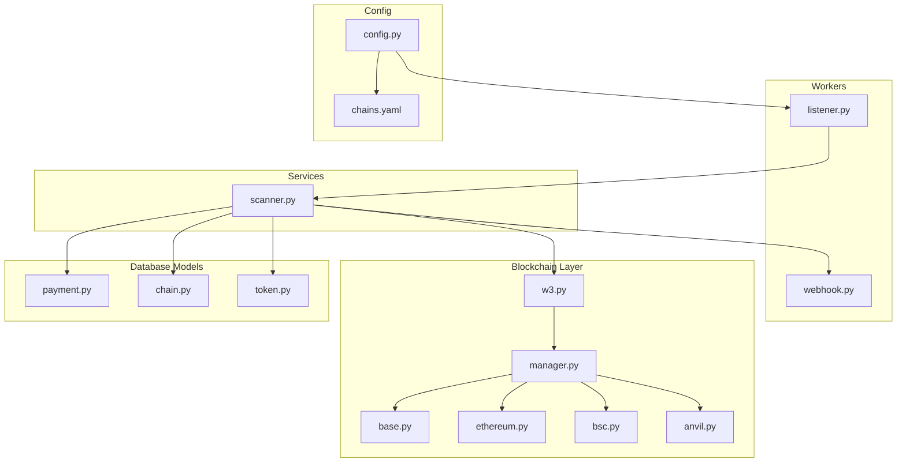
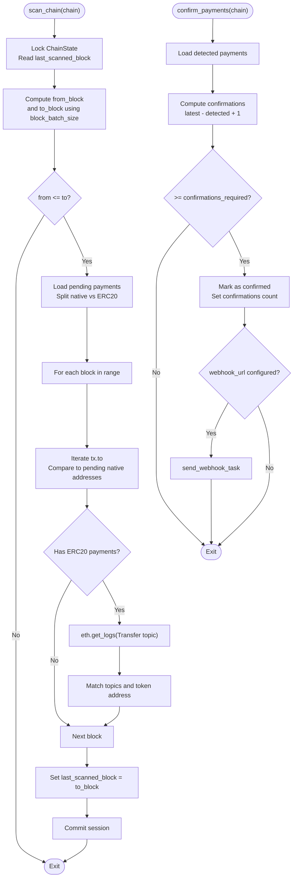
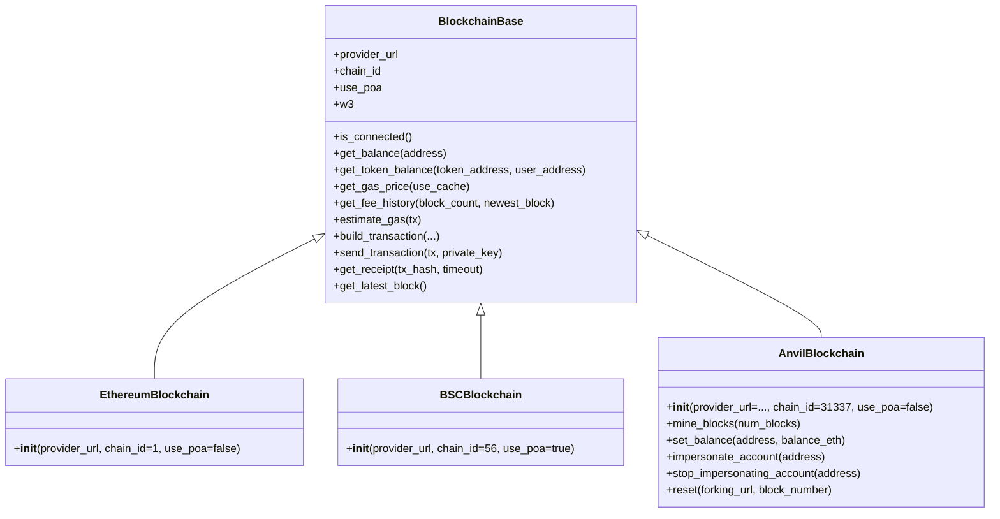
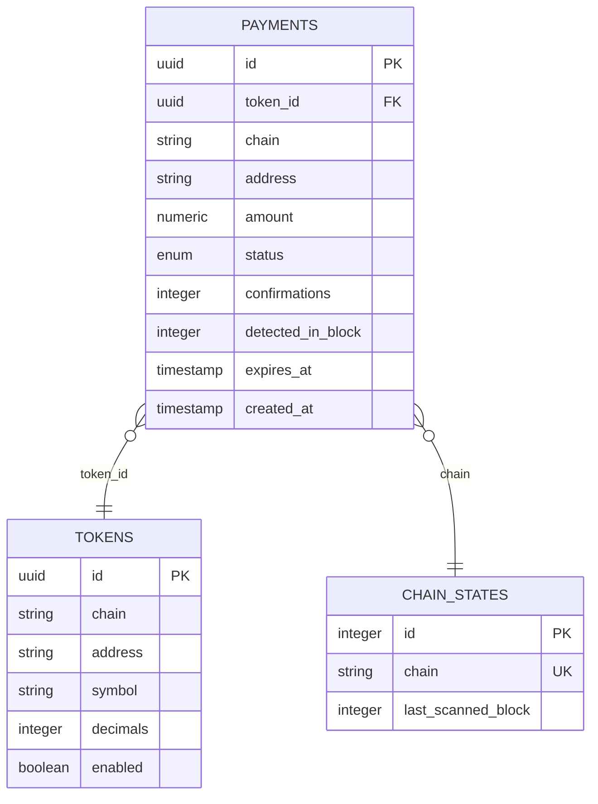
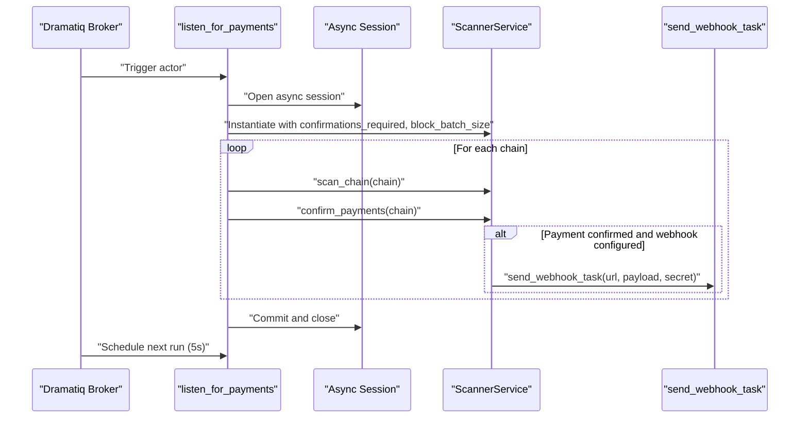
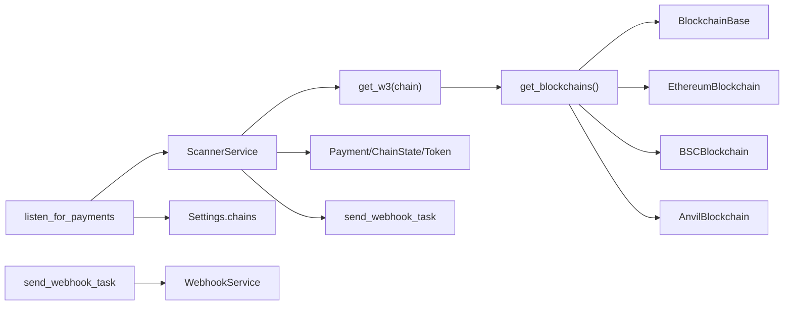

# Blockchain Scanner Service

<cite>
**Referenced Files in This Document**
- [scanner.py](https://github.com/rakibhossain72/ctrip/blob/main/app/services/blockchain/scanner.py)
- [w3.py](https://github.com/rakibhossain72/ctrip/blob/main/app/blockchain/w3.py)
- [manager.py](https://github.com/rakibhossain72/ctrip/blob/main/app/blockchain/manager.py)
- [base.py](https://github.com/rakibhossain72/ctrip/blob/main/app/blockchain/base.py)
- [ethereum.py](https://github.com/rakibhossain72/ctrip/blob/main/app/blockchain/ethereum.py)
- [bsc.py](https://github.com/rakibhossain72/ctrip/blob/main/app/blockchain/bsc.py)
- [anvil.py](https://github.com/rakibhossain72/ctrip/blob/main/app/blockchain/anvil.py)
- [payment.py](https://github.com/rakibhossain72/ctrip/blob/main/app/db/models/payment.py)
- [chain.py](https://github.com/rakibhossain72/ctrip/blob/main/app/db/models/chain.py)
- [token.py](https://github.com/rakibhossain72/ctrip/blob/main/app/db/models/token.py)
- [config.py](https://github.com/rakibhossain72/ctrip/blob/main/app/core/config.py)
- [listener.py](https://github.com/rakibhossain72/ctrip/blob/main/app/workers/listener.py)
- [webhook.py](https://github.com/rakibhossain72/ctrip/blob/main/app/workers/webhook.py)
- [chains.yaml](https://github.com/rakibhossain72/ctrip/blob/main/chains.yaml)
</cite>

## Table of Contents
1. [Introduction](#introduction)
2. [Project Structure](#project-structure)
3. [Core Components](#core-components)
4. [Architecture Overview](#architecture-overview)
5. [Detailed Component Analysis](#detailed-component-analysis)
6. [Dependency Analysis](#dependency-analysis)
7. [Performance Considerations](#performance-considerations)
8. [Troubleshooting Guide](#troubleshooting-guide)
9. [Conclusion](#conclusion)
10. [Appendices](#appendices)

## Introduction
This document describes the Blockchain Scanner Service responsible for real-time detection of incoming payments across multiple blockchain networks. It explains the scanning algorithm that monitors new blocks for pending payments, the dual-mode detection system for native currency transfers and ERC20 token transfers via event logs, the block batch processing mechanism, confirmation threshold checking, and payment status updates. It also covers integration with Web3 providers, database session management, concurrent payment processing, configuration parameters, performance optimization techniques, error handling strategies, and monitoring approaches.

## Project Structure
The scanner service is part of a modular Python application with distinct layers:
- Services: Business logic for scanning and confirming payments
- Blockchain: Web3 provider abstraction and chain-specific implementations
- Database: SQLAlchemy ORM models for payments, chain state, and tokens
- Workers: Asynchronous actors orchestrating scanning and sweeping cycles
- Configuration: Centralized settings and chain configuration



**Diagram sources**
- [listener.py](https://github.com/rakibhossain72/ctrip/blob/main/app/workers/listener.py#L1-L46)
- [scanner.py](https://github.com/rakibhossain72/ctrip/blob/main/app/services/blockchain/scanner.py#L1-L134)
- [w3.py](https://github.com/rakibhossain72/ctrip/blob/main/app/blockchain/w3.py#L1-L9)
- [manager.py](https://github.com/rakibhossain72/ctrip/blob/main/app/blockchain/manager.py#L1-L33)
- [base.py](https://github.com/rakibhossain72/ctrip/blob/main/app/blockchain/base.py#L1-L146)
- [ethereum.py](https://github.com/rakibhossain72/ctrip/blob/main/app/blockchain/ethereum.py#L1-L7)
- [bsc.py](https://github.com/rakibhossain72/ctrip/blob/main/app/blockchain/bsc.py#L1-L7)
- [anvil.py](https://github.com/rakibhossain72/ctrip/blob/main/app/blockchain/anvil.py#L1-L57)
- [payment.py](https://github.com/rakibhossain72/ctrip/blob/main/app/db/models/payment.py#L1-L74)
- [chain.py](https://github.com/rakibhossain72/ctrip/blob/main/app/db/models/chain.py#L1-L17)
- [token.py](https://github.com/rakibhossain72/ctrip/blob/main/app/db/models/token.py#L1-L15)
- [config.py](https://github.com/rakibhossain72/ctrip/blob/main/app/core/config.py#L1-L126)
- [chains.yaml](https://github.com/rakibhossain72/ctrip/blob/main/chains.yaml#L1-L24)

**Section sources**
- [listener.py](https://github.com/rakibhossain72/ctrip/blob/main/app/workers/listener.py#L1-L46)
- [scanner.py](https://github.com/rakibhossain72/ctrip/blob/main/app/services/blockchain/scanner.py#L1-L134)
- [w3.py](https://github.com/rakibhossain72/ctrip/blob/main/app/blockchain/w3.py#L1-L9)
- [manager.py](https://github.com/rakibhossain72/ctrip/blob/main/app/blockchain/manager.py#L1-L33)
- [base.py](https://github.com/rakibhossain72/ctrip/blob/main/app/blockchain/base.py#L1-L146)
- [payment.py](https://github.com/rakibhossain72/ctrip/blob/main/app/db/models/payment.py#L1-L74)
- [chain.py](https://github.com/rakibhossain72/ctrip/blob/main/app/db/models/chain.py#L1-L17)
- [token.py](https://github.com/rakibhossain72/ctrip/blob/main/app/db/models/token.py#L1-L15)
- [config.py](https://github.com/rakibhossain72/ctrip/blob/main/app/core/config.py#L1-L126)
- [chains.yaml](https://github.com/rakibhossain72/ctrip/blob/main/chains.yaml#L1-L24)

## Core Components
- ScannerService: Implements scanning and confirmation logic for pending payments, including dual-mode detection for native and ERC20 transfers, block batching, and confirmation thresholds.
- Web3 Provider Abstraction: Centralized provider retrieval via a chain registry, enabling per-chain provider configuration and POA support.
- Database Models: Payments, ChainState, and Tokens define the persistence layer for pending transactions, last scanned block tracking, and token metadata.
- Worker Orchestration: Dramatiq actors schedule periodic scanning and sweeping cycles, manage async sessions, and trigger webhooks upon confirmation.

Key configuration parameters:
- confirmations_required: Minimum number of confirmations needed to mark a detected payment as confirmed.
- block_batch_size: Number of blocks processed in a single scanning cycle per chain.

**Section sources**
- [scanner.py](https://github.com/rakibhossain72/ctrip/blob/main/app/services/blockchain/scanner.py#L14-L18)
- [config.py](https://github.com/rakibhossain72/ctrip/blob/main/app/core/config.py#L63-L71)
- [chains.yaml](https://github.com/rakibhossain72/ctrip/blob/main/chains.yaml#L1-L24)
- [listener.py](https://github.com/rakibhossain72/ctrip/blob/main/app/workers/listener.py#L15-L16)

## Architecture Overview
The scanner operates in two phases per cycle:
1. Scanning phase: Retrieve pending payments, fetch a block range, and detect native and ERC20 transfers.
2. Confirmation phase: Evaluate detected payments against the current block height and the configured confirmation threshold.

```mermaid
sequenceDiagram
participant Actor as "Dramatiq Listener"
participant Session as "Async DB Session"
participant Scanner as "ScannerService"
participant W3 as "Web3 Provider"
participant Chain as "Chain State"
participant Payments as "Payments"
Actor->>Session : "Open async session"
Actor->>Scanner : "Instantiate with confirmations_required, block_batch_size"
loop For each chain
Actor->>Scanner : "scan_chain(chain)"
Scanner->>W3 : "eth.block_number"
Scanner->>Chain : "select ChainState with_for_update()"
Chain-->>Scanner : "last_scanned_block"
Scanner->>W3 : "get_block(from..to, full_transactions=true)"
alt Native transfer detection
Scanner->>Payments : "match tx.to against pending native payments"
Payments-->>Scanner : "update status to detected"
end
alt ERC20 transfer detection
Scanner->>W3 : "eth.get_logs(Transfer topic)"
Scanner->>Payments : "match log topics against pending ERC20 payments"
Payments-->>Scanner : "update status to detected"
end
Scanner->>Chain : "update last_scanned_block"
Actor->>Scanner : "confirm_payments(chain)"
Scanner->>W3 : "eth.block_number"
Scanner->>Payments : "check confirmations vs threshold"
alt Confirmed
Scanner->>Actor : "trigger webhook if configured"
end
end
Actor->>Session : "commit and close"
```

**Diagram sources**
- [listener.py](https://github.com/rakibhossain72/ctrip/blob/main/app/workers/listener.py#L21-L46)
- [scanner.py](https://github.com/rakibhossain72/ctrip/blob/main/app/services/blockchain/scanner.py#L20-L134)
- [w3.py](https://github.com/rakibhossain72/ctrip/blob/main/app/blockchain/w3.py#L6-L9)
- [chain.py](https://github.com/rakibhossain72/ctrip/blob/main/app/db/models/chain.py#L9-L17)
- [payment.py](https://github.com/rakibhossain72/ctrip/blob/main/app/db/models/payment.py#L41-L57)
- [webhook.py](https://github.com/rakibhossain72/ctrip/blob/main/app/workers/webhook.py#L13-L37)

## Detailed Component Analysis

### ScannerService
ScannerService coordinates scanning and confirmation of payments across chains. It maintains:
- Database session for transactional updates
- Block batch size and confirmation threshold
- Chain-specific Web3 provider retrieval

Scanning algorithm:
- Lock and read ChainState for the target chain
- Compute block range from last scanned block plus batch size
- Fetch pending payments grouped by native vs ERC20
- For each block in the range:
  - Native: iterate transactions and compare recipient and value
  - ERC20: query Transfer event logs and match topics and token address
- Update ChainState with the highest processed block

Confirmation algorithm:
- Select detected payments for the chain
- Compute confirmations as latest block minus detected block plus one
- Mark confirmed if threshold met and optionally trigger webhook



**Diagram sources**
- [scanner.py](https://github.com/rakibhossain72/ctrip/blob/main/app/services/blockchain/scanner.py#L20-L134)

**Section sources**
- [scanner.py](https://github.com/rakibhossain72/ctrip/blob/main/app/services/blockchain/scanner.py#L14-L18)
- [scanner.py](https://github.com/rakibhossain72/ctrip/blob/main/app/services/blockchain/scanner.py#L20-L96)
- [scanner.py](https://github.com/rakibhossain72/ctrip/blob/main/app/services/blockchain/scanner.py#L97-L134)

### Web3 Provider Abstraction
The provider layer abstracts chain-specific differences and exposes a unified AsyncWeb3 interface:
- Manager constructs chain implementations based on configuration
- Base class initializes AsyncWeb3, optional POA middleware, and gas estimation helpers
- Chain-specific classes set chain IDs and POA flags
- Registry resolves provider by chain name



**Diagram sources**
- [base.py](https://github.com/rakibhossain72/ctrip/blob/main/app/blockchain/base.py#L22-L146)
- [ethereum.py](https://github.com/rakibhossain72/ctrip/blob/main/app/blockchain/ethereum.py#L3-L7)
- [bsc.py](https://github.com/rakibhossain72/ctrip/blob/main/app/blockchain/bsc.py#L3-L7)
- [anvil.py](https://github.com/rakibhossain72/ctrip/blob/main/app/blockchain/anvil.py#L8-L57)

**Section sources**
- [w3.py](https://github.com/rakibhossain72/ctrip/blob/main/app/blockchain/w3.py#L1-L9)
- [manager.py](https://github.com/rakibhossain72/ctrip/blob/main/app/blockchain/manager.py#L8-L33)
- [base.py](https://github.com/rakibhossain72/ctrip/blob/main/app/blockchain/base.py#L22-L146)
- [ethereum.py](https://github.com/rakibhossain72/ctrip/blob/main/app/blockchain/ethereum.py#L1-L7)
- [bsc.py](https://github.com/rakibhossain72/ctrip/blob/main/app/blockchain/bsc.py#L1-L7)
- [anvil.py](https://github.com/rakibhossain72/ctrip/blob/main/app/blockchain/anvil.py#L1-L57)

### Database Models and Relationships
Payments track pending and confirmed transfers, ChainState tracks scanning progress per chain, and Tokens define ERC20 metadata.



**Diagram sources**
- [payment.py](https://github.com/rakibhossain72/ctrip/blob/main/app/db/models/payment.py#L41-L57)
- [chain.py](https://github.com/rakibhossain72/ctrip/blob/main/app/db/models/chain.py#L9-L17)
- [token.py](https://github.com/rakibhossain72/ctrip/blob/main/app/db/models/token.py#L6-L15)

**Section sources**
- [payment.py](https://github.com/rakibhossain72/ctrip/blob/main/app/db/models/payment.py#L21-L57)
- [chain.py](https://github.com/rakibhossain72/ctrip/blob/main/app/db/models/chain.py#L9-L17)
- [token.py](https://github.com/rakibhossain72/ctrip/blob/main/app/db/models/token.py#L6-L15)

### Worker Orchestration and Webhook Integration
The listener actor:
- Loads configured chains from settings
- Creates an async database session
- Instantiates ScannerService with configurable parameters
- Iterates chains, invoking scan_chain and confirm_payments
- Schedules the next run after a fixed delay

The webhook actor:
- Sends asynchronous webhooks with retry logic
- Integrates with the global webhook configuration



**Diagram sources**
- [listener.py](https://github.com/rakibhossain72/ctrip/blob/main/app/workers/listener.py#L21-L46)
- [scanner.py](https://github.com/rakibhossain72/ctrip/blob/main/app/services/blockchain/scanner.py#L97-L134)
- [webhook.py](https://github.com/rakibhossain72/ctrip/blob/main/app/workers/webhook.py#L13-L37)

**Section sources**
- [listener.py](https://github.com/rakibhossain72/ctrip/blob/main/app/workers/listener.py#L15-L46)
- [webhook.py](https://github.com/rakibhossain72/ctrip/blob/main/app/workers/webhook.py#L13-L37)
- [config.py](https://github.com/rakibhossain72/ctrip/blob/main/app/core/config.py#L63-L71)

## Dependency Analysis
- ScannerService depends on:
  - Web3 provider retrieval via w3.get_w3
  - Database models for payments, chain state, and tokens
  - Worker webhook task for notifications
  - Configuration for confirmations and webhook settings
- Provider layer depends on:
  - Manager to construct chain-specific implementations
  - Base class for shared Web3 utilities
- Workers depend on:
  - Async database sessions
  - Settings for chain configuration and webhook parameters



**Diagram sources**
- [scanner.py](https://github.com/rakibhossain72/ctrip/blob/main/app/services/blockchain/scanner.py#L1-L10)
- [w3.py](https://github.com/rakibhossain72/ctrip/blob/main/app/blockchain/w3.py#L1-L9)
- [manager.py](https://github.com/rakibhossain72/ctrip/blob/main/app/blockchain/manager.py#L1-L33)
- [base.py](https://github.com/rakibhossain72/ctrip/blob/main/app/blockchain/base.py#L1-L146)
- [listener.py](https://github.com/rakibhossain72/ctrip/blob/main/app/workers/listener.py#L1-L46)
- [webhook.py](https://github.com/rakibhossain72/ctrip/blob/main/app/workers/webhook.py#L1-L37)

**Section sources**
- [scanner.py](https://github.com/rakibhossain72/ctrip/blob/main/app/services/blockchain/scanner.py#L1-L10)
- [w3.py](https://github.com/rakibhossain72/ctrip/blob/main/app/blockchain/w3.py#L1-L9)
- [manager.py](https://github.com/rakibhossain72/ctrip/blob/main/app/blockchain/manager.py#L1-L33)
- [listener.py](https://github.com/rakibhossain72/ctrip/blob/main/app/workers/listener.py#L1-L46)
- [webhook.py](https://github.com/rakibhossain72/ctrip/blob/main/app/workers/webhook.py#L1-L37)

## Performance Considerations
- Block batching: Limit the number of blocks processed per cycle using block_batch_size to reduce load on RPC nodes and memory usage.
- Confirmation threshold: Tune confirmations_required to balance safety and latency; higher values reduce reorg risk but increase confirmation time.
- Efficient matching:
  - Use address maps for pending payments to avoid repeated database queries during block processing.
  - Filter ERC20 logs by Transfer topic to minimize irrelevant data.
- Gas and fee estimation: The provider base class caches gas price and uses fee history for EIP-1559; leverage these to optimize transaction building and reduce RPC calls.
- Concurrency: The listener actor runs per chain sequentially; consider parallelizing chains if the workload permits and resources allow.
- Logging and monitoring: Use structured logs to track scan throughput, detection rates, and confirmation latencies.

[No sources needed since this section provides general guidance]

## Troubleshooting Guide
Common issues and resolutions:
- Missing chain configuration: If chains.yaml is empty or missing, the manager falls back to an Anvil chain; verify chains.yaml and environment settings.
- Provider connectivity: The base class logs connection errors; check RPC URLs and network availability.
- No chain state found: If ChainState does not exist for a chain, scanning is skipped; ensure ChainState is initialized.
- Insufficient confirmations: Detected payments remain in the detected state until the threshold is met; adjust confirmations_required accordingly.
- Webhook failures: The webhook actor raises exceptions on failure; configure retries and secrets properly.

**Section sources**
- [manager.py](https://github.com/rakibhossain72/ctrip/blob/main/app/blockchain/manager.py#L28-L32)
- [base.py](https://github.com/rakibhossain72/ctrip/blob/main/app/blockchain/base.py#L45-L50)
- [chain.py](https://github.com/rakibhossain72/ctrip/blob/main/app/db/models/chain.py#L9-L17)
- [scanner.py](https://github.com/rakibhossain72/ctrip/blob/main/app/services/blockchain/scanner.py#L30-L32)
- [webhook.py](https://github.com/rakibhossain72/ctrip/blob/main/app/workers/webhook.py#L24-L36)

## Conclusion
The Blockchain Scanner Service provides a robust, extensible framework for real-time payment detection across multiple blockchains. Its dual-mode detection, block batching, and confirmation threshold mechanisms ensure accurate and timely payment processing. By leveraging the Web3 provider abstraction, database models, and worker orchestration, it supports reliable operation in development and production environments.

[No sources needed since this section summarizes without analyzing specific files]

## Appendices

### Configuration Parameters
- confirmations_required: Number of confirmations required to mark a detected payment as confirmed.
- block_batch_size: Maximum number of blocks to process in a single scanning cycle per chain.
- webhook_url and webhook_secret: Global webhook endpoint and signature secret for payment notifications.

**Section sources**
- [scanner.py](https://github.com/rakibhossain72/ctrip/blob/main/app/services/blockchain/scanner.py#L15-L18)
- [config.py](https://github.com/rakibhossain72/ctrip/blob/main/app/core/config.py#L63-L71)
- [chains.yaml](https://github.com/rakibhossain72/ctrip/blob/main/chains.yaml#L1-L24)