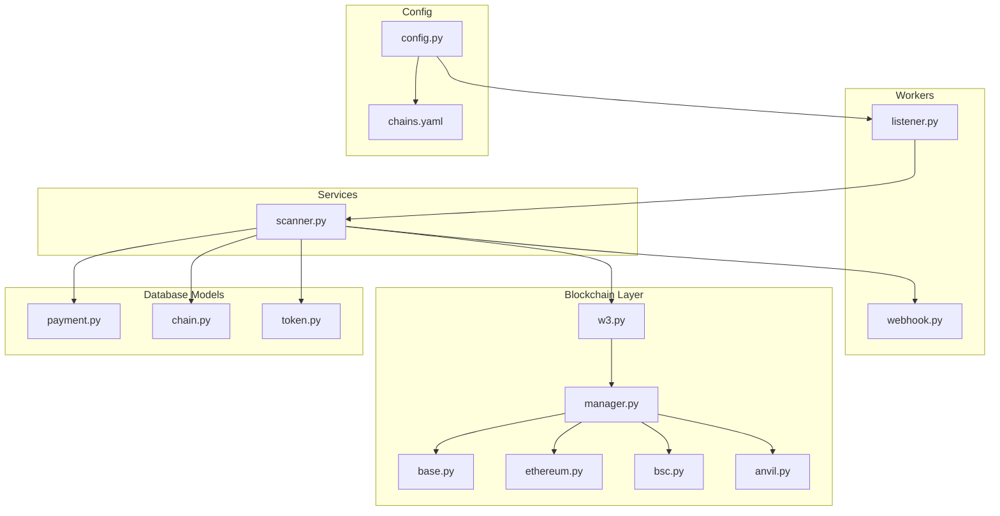
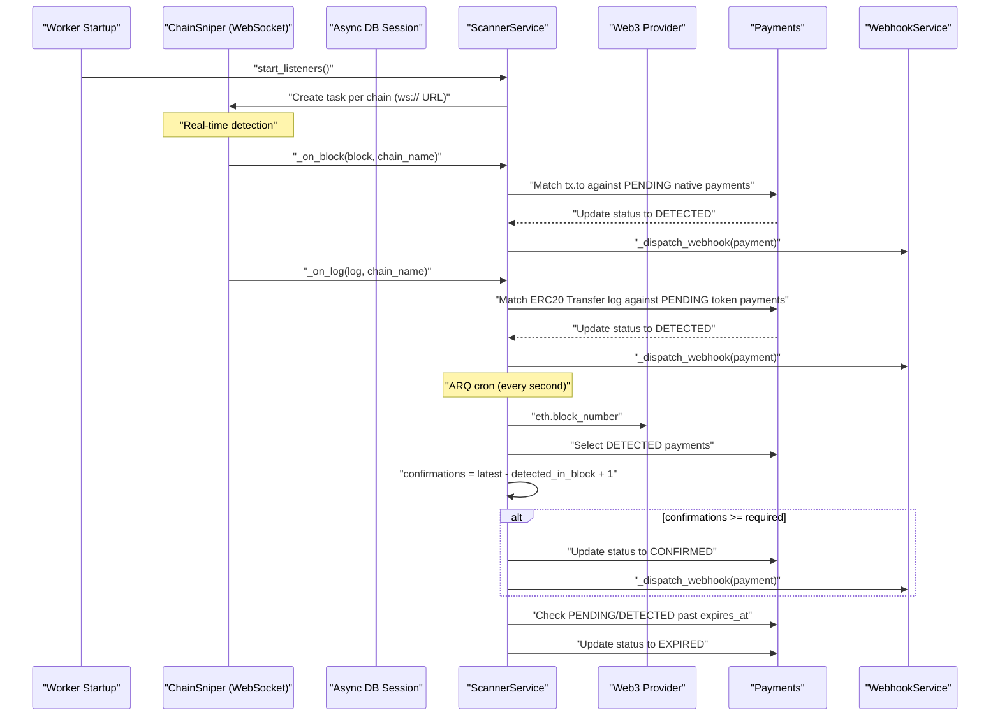
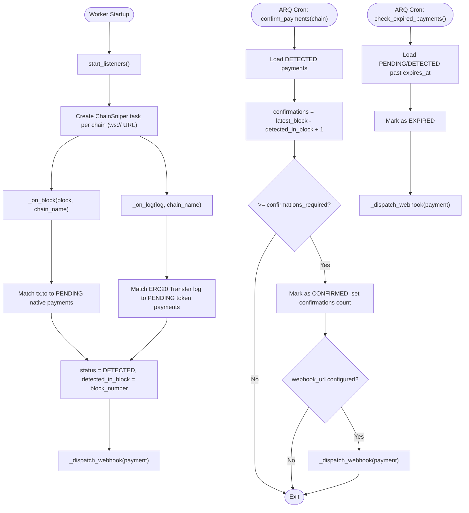
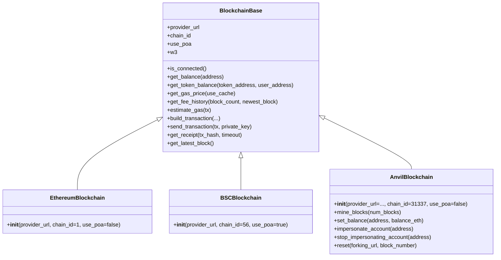
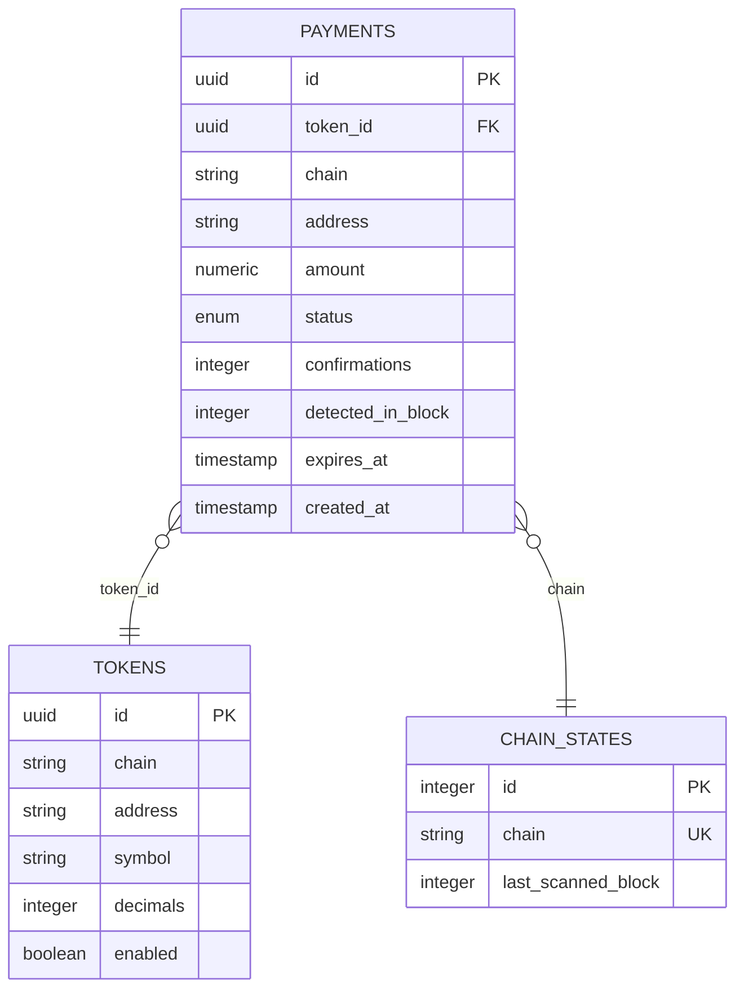
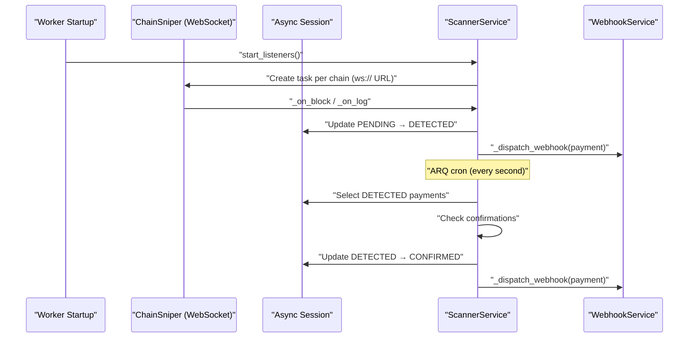
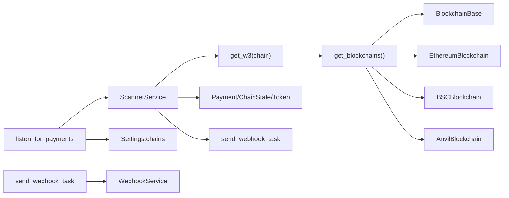

# Blockchain Scanner Service

<cite>
**Referenced Files in This Document**
- [scanner.py](https://github.com/rakibhossain72/ctrip/blob/main/app/services/blockchain/scanner.py)
- [w3.py](https://github.com/rakibhossain72/ctrip/blob/main/app/blockchain/w3.py)
- [manager.py](https://github.com/rakibhossain72/ctrip/blob/main/app/blockchain/manager.py)
- [base.py](https://github.com/rakibhossain72/ctrip/blob/main/app/blockchain/base.py)
- [ethereum.py](https://github.com/rakibhossain72/ctrip/blob/main/app/blockchain/ethereum.py)
- [bsc.py](https://github.com/rakibhossain72/ctrip/blob/main/app/blockchain/bsc.py)
- [anvil.py](https://github.com/rakibhossain72/ctrip/blob/main/app/blockchain/anvil.py)
- [payment.py](https://github.com/rakibhossain72/ctrip/blob/main/app/db/models/payment.py)
- [chain.py](https://github.com/rakibhossain72/ctrip/blob/main/app/db/models/chain.py)
- [token.py](https://github.com/rakibhossain72/ctrip/blob/main/app/db/models/token.py)
- [config.py](https://github.com/rakibhossain72/ctrip/blob/main/app/core/config.py)
- [listener.py](https://github.com/rakibhossain72/ctrip/blob/main/app/workers/listener.py)
- [webhook.py](https://github.com/rakibhossain72/ctrip/blob/main/app/workers/webhook.py)
- [chains.yaml](https://github.com/rakibhossain72/ctrip/blob/main/chains.yaml)
</cite>

## Table of Contents
1. [Introduction](#introduction)
2. [Project Structure](#project-structure)
3. [Core Components](#core-components)
4. [Architecture Overview](#architecture-overview)
5. [Detailed Component Analysis](#detailed-component-analysis)
6. [Dependency Analysis](#dependency-analysis)
7. [Performance Considerations](#performance-considerations)
8. [Troubleshooting Guide](#troubleshooting-guide)
9. [Conclusion](#conclusion)
10. [Appendices](#appendices)

## Introduction
This document describes the Blockchain Scanner Service responsible for real-time detection of incoming payments across multiple blockchain networks. 

The scanner uses a **two-phase approach**:

1. **Real-time detection** via ChainSniper WebSocket listeners — `ScannerService.start_listeners()` is called once on worker startup and creates one `asyncio.Task` per chain that has a `ws://` or `wss://` RPC URL. These listeners push new full blocks and ERC20 Transfer logs directly to handler functions (`_on_block`, `_on_log`), updating payment status to `DETECTED` immediately without polling.

2. **Periodic confirmation and expiry** via ARQ cron — `confirm_payments()` runs every second to promote `DETECTED` payments to `CONFIRMED` once enough blocks have passed. `check_expired_payments()` marks stale payments as `EXPIRED`.

It also covers integration with Web3 providers, database session management, concurrent payment processing, configuration parameters, performance optimization techniques, error handling strategies, and monitoring approaches.

## Project Structure
The scanner service is part of a modular Python application with distinct layers:
- Services: Business logic for scanning and confirming payments
- Blockchain: Web3 provider abstraction and chain-specific implementations
- Database: SQLAlchemy ORM models for payments, chain state, and tokens
- Workers: Asynchronous actors orchestrating scanning and sweeping cycles
- Configuration: Centralized settings and chain configuration

```mermaid
graph TB
subgraph "Workers"
L["listener.py"]
W["webhook.py"]
end
subgraph "Services"
S["scanner.py"]
end
subgraph "Blockchain Layer"
M["manager.py"]
W3["w3.py"]
B["base.py"]
E["ethereum.py"]
BS["bsc.py"]
A["anvil.py"]
end
subgraph "Database Models"
PM["payment.py"]
CM["chain.py"]
TM["token.py"]
end
subgraph "Config"
C["config.py"]
Y["chains.yaml"]
end
L --> S
S --> W3
W3 --> M
M --> B
M --> E
M --> BS
M --> A
S --> PM
S --> CM
S --> TM
S --> W
C --> L
C --> Y
```

**Diagram sources**
- [listener.py](https://github.com/rakibhossain72/ctrip/blob/main/app/workers/listener.py#L1-L46)
- [scanner.py](https://github.com/rakibhossain72/ctrip/blob/main/app/services/blockchain/scanner.py#L1-L134)
- [w3.py](https://github.com/rakibhossain72/ctrip/blob/main/app/blockchain/w3.py#L1-L9)
- [manager.py](https://github.com/rakibhossain72/ctrip/blob/main/app/blockchain/manager.py#L1-L33)
- [base.py](https://github.com/rakibhossain72/ctrip/blob/main/app/blockchain/base.py#L1-L146)
- [ethereum.py](https://github.com/rakibhossain72/ctrip/blob/main/app/blockchain/ethereum.py#L1-L7)
- [bsc.py](https://github.com/rakibhossain72/ctrip/blob/main/app/blockchain/bsc.py#L1-L7)
- [anvil.py](https://github.com/rakibhossain72/ctrip/blob/main/app/blockchain/anvil.py#L1-L57)
- [payment.py](https://github.com/rakibhossain72/ctrip/blob/main/app/db/models/payment.py#L1-L74)
- [chain.py](https://github.com/rakibhossain72/ctrip/blob/main/app/db/models/chain.py#L1-L17)
- [token.py](https://github.com/rakibhossain72/ctrip/blob/main/app/db/models/token.py#L1-L15)
- [config.py](https://github.com/rakibhossain72/ctrip/blob/main/app/core/config.py#L1-L126)
- [chains.yaml](https://github.com/rakibhossain72/ctrip/blob/main/chains.yaml#L1-L24)

**Section sources**
- [listener.py](https://github.com/rakibhossain72/ctrip/blob/main/app/workers/listener.py#L1-L46)
- [scanner.py](https://github.com/rakibhossain72/ctrip/blob/main/app/services/blockchain/scanner.py#L1-L134)
- [w3.py](https://github.com/rakibhossain72/ctrip/blob/main/app/blockchain/w3.py#L1-L9)
- [manager.py](https://github.com/rakibhossain72/ctrip/blob/main/app/blockchain/manager.py#L1-L33)
- [base.py](https://github.com/rakibhossain72/ctrip/blob/main/app/blockchain/base.py#L1-L146)
- [payment.py](https://github.com/rakibhossain72/ctrip/blob/main/app/db/models/payment.py#L1-L74)
- [chain.py](https://github.com/rakibhossain72/ctrip/blob/main/app/db/models/chain.py#L1-L17)
- [token.py](https://github.com/rakibhossain72/ctrip/blob/main/app/db/models/token.py#L1-L15)
- [config.py](https://github.com/rakibhossain72/ctrip/blob/main/app/core/config.py#L1-L126)
- [chains.yaml](https://github.com/rakibhossain72/ctrip/blob/main/chains.yaml#L1-L24)

## Core Components
- ScannerService: Provides real-time detection via ChainSniper WebSocket listeners and periodic confirmation/expiry logic.
- Web3 Provider Abstraction: Centralized provider retrieval via a chain registry, enabling per-chain provider configuration and POA support. Used for confirmation checks (getting latest block number).
- Database Models: Payments, ChainState, and Tokens define the persistence layer for pending transactions, last scanned block tracking, and token metadata.
- Worker Orchestration: ARQ cron jobs schedule periodic confirmation and expiry checks. ChainSniper listeners are started once on worker startup.

Key configuration parameters:
- `CONFIRMATIONS_REQUIRED`: Minimum number of confirmations needed to mark a detected payment as confirmed (default: 1 in `app/workers/listener.py`).
- WebSocket RPC URLs in `chains.yaml`: Required for ChainSniper detection. Chains without a `ws://` or `wss://` URL will be skipped for detection.

**Section sources**
- [scanner.py](https://github.com/rakibhossain72/ctrip/blob/main/app/services/blockchain/scanner.py#L14-L18)
- [config.py](https://github.com/rakibhossain72/ctrip/blob/main/app/core/config.py#L63-L71)
- [chains.yaml](https://github.com/rakibhossain72/ctrip/blob/main/chains.yaml#L1-L24)
- [listener.py](https://github.com/rakibhossain72/ctrip/blob/main/app/workers/listener.py#L15-L16)

## Architecture Overview
The scanner operates in two independent phases:

**Phase 1 — Real-time detection (ChainSniper WebSocket):**
- On worker startup, `start_listeners()` creates one ChainSniper task per chain with a WebSocket URL.
- Each new block triggers `_on_block()` which checks native transfers against pending payments.
- Each ERC20 Transfer log triggers `_on_log()` which checks the recipient against pending ERC20 payments.
- Matching payments are immediately updated to `DETECTED`.

**Phase 2 — Periodic confirmation (ARQ cron, every second):**
- `confirm_payments()` queries `DETECTED` payments and checks if `(latest_block - detected_in_block + 1) >= confirmations_required`.
- Confirmed payments are updated to `CONFIRMED` and a webhook is dispatched.
- `check_expired_payments()` marks `PENDING`/`DETECTED` payments past their `expires_at` as `EXPIRED`.

```mermaid
sequenceDiagram
participant Startup as "Worker Startup"
participant Sniper as "ChainSniper (WebSocket)"
participant Session as "Async DB Session"
participant Scanner as "ScannerService"
participant W3 as "Web3 Provider"
participant Payments as "Payments"
participant Webhook as "WebhookService"

Startup->>Scanner : "start_listeners()"
Scanner->>Sniper : "Create task per chain (ws:// URL)"

Note over Sniper : "Real-time detection"
Sniper->>Scanner : "_on_block(block, chain_name)"
Scanner->>Payments : "Match tx.to against PENDING native payments"
Payments-->>Scanner : "Update status to DETECTED"
Scanner->>Webhook : "_dispatch_webhook(payment)"

Sniper->>Scanner : "_on_log(log, chain_name)"
Scanner->>Payments : "Match ERC20 Transfer log against PENDING token payments"
Payments-->>Scanner : "Update status to DETECTED"
Scanner->>Webhook : "_dispatch_webhook(payment)"

Note over Scanner : "ARQ cron (every second)"
Scanner->>W3 : "eth.block_number"
Scanner->>Payments : "Select DETECTED payments"
Scanner->>Scanner : "confirmations = latest - detected_in_block + 1"
alt confirmations >= required
Scanner->>Payments : "Update status to CONFIRMED"
Scanner->>Webhook : "_dispatch_webhook(payment)"
end
Scanner->>Payments : "Check PENDING/DETECTED past expires_at"
Scanner->>Payments : "Update status to EXPIRED"
```

**Diagram sources**
- [listener.py](https://github.com/rakibhossain72/ctrip/blob/main/app/workers/listener.py#L21-L46)
- [scanner.py](https://github.com/rakibhossain72/ctrip/blob/main/app/services/blockchain/scanner.py#L20-L134)
- [w3.py](https://github.com/rakibhossain72/ctrip/blob/main/app/blockchain/w3.py#L6-L9)
- [chain.py](https://github.com/rakibhossain72/ctrip/blob/main/app/db/models/chain.py#L9-L17)
- [payment.py](https://github.com/rakibhossain72/ctrip/blob/main/app/db/models/payment.py#L41-L57)
- [webhook.py](https://github.com/rakibhossain72/ctrip/blob/main/app/workers/webhook.py#L13-L37)

## Detailed Component Analysis

### ScannerService
ScannerService coordinates scanning and confirmation of payments across chains. It maintains:
- Database session for transactional updates
- Block batch size and confirmation threshold
- Chain-specific Web3 provider retrieval

Scanning algorithm:
- Lock and read ChainState for the target chain
- Compute block range from last scanned block plus batch size
- Fetch pending payments grouped by native vs ERC20
- For each block in the range:
  - Native: iterate transactions and compare recipient and value
  - ERC20: query Transfer event logs and match topics and token address
- Update ChainState with the highest processed block

Confirmation algorithm:
- Select detected payments for the chain
- Compute confirmations as latest block minus detected block plus one
- Mark confirmed if threshold met and optionally trigger webhook

```mermaid
flowchart TD
WorkerStart(["Worker Startup"]) --> StartListeners["start_listeners()"]
StartListeners --> CreateSniper["Create ChainSniper task per chain (ws:// URL)"]
CreateSniper --> OnBlock["_on_block(block, chain_name)"]
CreateSniper --> OnLog["_on_log(log, chain_name)"]
OnBlock --> MatchNative["Match tx.to to PENDING native payments"]
OnLog --> MatchERC20["Match ERC20 Transfer log to PENDING token payments"]
MatchNative --> SetDetected["status = DETECTED, detected_in_block = block_number"]
MatchERC20 --> SetDetected
SetDetected --> DispatchWebhook["_dispatch_webhook(payment)"]

ConfirmStart(["ARQ Cron: confirm_payments(chain)"]) --> LoadDetected["Load DETECTED payments"]
LoadDetected --> CheckConf["confirmations = latest_block - detected_in_block + 1"]
CheckConf --> Threshold{">= confirmations_required?"}
Threshold --> |No| ConfirmEnd(["Exit"])
Threshold --> |Yes| MarkConfirmed["Mark as CONFIRMED, set confirmations count"]
MarkConfirmed --> Webhook{"webhook_url configured?"}
Webhook --> |Yes| SendHook["_dispatch_webhook(payment)"]
Webhook --> |No| ConfirmEnd
SendHook --> ConfirmEnd

ExpireStart(["ARQ Cron: check_expired_payments()"]) --> LoadExpired["Load PENDING/DETECTED past expires_at"]
LoadExpired --> MarkExpired["Mark as EXPIRED"]
MarkExpired --> DispatchExpiredWebhook["_dispatch_webhook(payment)"]
```

**Diagram sources**
- [scanner.py](https://github.com/rakibhossain72/ctrip/blob/main/app/services/blockchain/scanner.py#L20-L134)

**Section sources**
- [scanner.py](https://github.com/rakibhossain72/ctrip/blob/main/app/services/blockchain/scanner.py#L14-L18)
- [scanner.py](https://github.com/rakibhossain72/ctrip/blob/main/app/services/blockchain/scanner.py#L20-L96)
- [scanner.py](https://github.com/rakibhossain72/ctrip/blob/main/app/services/blockchain/scanner.py#L97-L134)

### Web3 Provider Abstraction
The provider layer abstracts chain-specific differences and exposes a unified AsyncWeb3 interface:
- Manager constructs chain implementations based on configuration
- Base class initializes AsyncWeb3, optional POA middleware, and gas estimation helpers
- Chain-specific classes set chain IDs and POA flags
- Registry resolves provider by chain name

```mermaid
classDiagram
class BlockchainBase {
+provider_url
+chain_id
+use_poa
+w3
+is_connected()
+get_balance(address)
+get_token_balance(token_address, user_address)
+get_gas_price(use_cache)
+get_fee_history(block_count, newest_block)
+estimate_gas(tx)
+build_transaction(...)
+send_transaction(tx, private_key)
+get_receipt(tx_hash, timeout)
+get_latest_block()
}
class EthereumBlockchain {
+__init__(provider_url, chain_id=1, use_poa=false)
}
class BSCBlockchain {
+__init__(provider_url, chain_id=56, use_poa=true)
}
class AnvilBlockchain {
+__init__(provider_url=..., chain_id=31337, use_poa=false)
+mine_blocks(num_blocks)
+set_balance(address, balance_eth)
+impersonate_account(address)
+stop_impersonating_account(address)
+reset(forking_url, block_number)
}
BlockchainBase <|-- EthereumBlockchain
BlockchainBase <|-- BSCBlockchain
BlockchainBase <|-- AnvilBlockchain
```

**Diagram sources**
- [base.py](https://github.com/rakibhossain72/ctrip/blob/main/app/blockchain/base.py#L22-L146)
- [ethereum.py](https://github.com/rakibhossain72/ctrip/blob/main/app/blockchain/ethereum.py#L3-L7)
- [bsc.py](https://github.com/rakibhossain72/ctrip/blob/main/app/blockchain/bsc.py#L3-L7)
- [anvil.py](https://github.com/rakibhossain72/ctrip/blob/main/app/blockchain/anvil.py#L8-L57)

**Section sources**
- [w3.py](https://github.com/rakibhossain72/ctrip/blob/main/app/blockchain/w3.py#L1-L9)
- [manager.py](https://github.com/rakibhossain72/ctrip/blob/main/app/blockchain/manager.py#L8-L33)
- [base.py](https://github.com/rakibhossain72/ctrip/blob/main/app/blockchain/base.py#L22-L146)
- [ethereum.py](https://github.com/rakibhossain72/ctrip/blob/main/app/blockchain/ethereum.py#L1-L7)
- [bsc.py](https://github.com/rakibhossain72/ctrip/blob/main/app/blockchain/bsc.py#L1-L7)
- [anvil.py](https://github.com/rakibhossain72/ctrip/blob/main/app/blockchain/anvil.py#L1-L57)

### Database Models and Relationships
Payments track pending and confirmed transfers, ChainState tracks scanning progress per chain, and Tokens define ERC20 metadata.

```mermaid
erDiagram
PAYMENTS {
uuid id PK
uuid token_id FK
string chain
string address
numeric amount
enum status
integer confirmations
integer detected_in_block
timestamp expires_at
timestamp created_at
}
CHAIN_STATES {
integer id PK
string chain UK
integer last_scanned_block
}
TOKENS {
uuid id PK
string chain
string address
string symbol
integer decimals
boolean enabled
}
PAYMENTS }o--|| TOKENS : "token_id"
PAYMENTS }o--|| CHAIN_STATES : "chain"
```

**Diagram sources**
- [payment.py](https://github.com/rakibhossain72/ctrip/blob/main/app/db/models/payment.py#L41-L57)
- [chain.py](https://github.com/rakibhossain72/ctrip/blob/main/app/db/models/chain.py#L9-L17)
- [token.py](https://github.com/rakibhossain72/ctrip/blob/main/app/db/models/token.py#L6-L15)

**Section sources**
- [payment.py](https://github.com/rakibhossain72/ctrip/blob/main/app/db/models/payment.py#L21-L57)
- [chain.py](https://github.com/rakibhossain72/ctrip/blob/main/app/db/models/chain.py#L9-L17)
- [token.py](https://github.com/rakibhossain72/ctrip/blob/main/app/db/models/token.py#L6-L15)

### Worker Orchestration and Webhook Integration
The ARQ worker:
- On startup, calls `ScannerService.start_listeners()` which creates one ChainSniper WebSocket task per chain with a `ws://` or `wss://` URL.
- The `listen_for_payments` cron task (every second) calls `confirm_payments()` for each chain and `check_expired_payments()` globally.
- Webhooks are dispatched directly from `ScannerService._dispatch_webhook()` — no separate webhook actor is needed for detection/confirmation events.

The `send_webhook_notification` ARQ task is available for manual webhook delivery via the admin API.

```mermaid
sequenceDiagram
participant Startup as "Worker Startup"
participant Sniper as "ChainSniper (WebSocket)"
participant DB as "Async Session"
participant Scanner as "ScannerService"
participant Webhook as "WebhookService"
Startup->>Scanner : "start_listeners()"
Scanner->>Sniper : "Create task per chain (ws:// URL)"
Sniper->>Scanner : "_on_block / _on_log"
Scanner->>DB : "Update PENDING → DETECTED"
Scanner->>Webhook : "_dispatch_webhook(payment)"
Note over Scanner : "ARQ cron (every second)"
Scanner->>DB : "Select DETECTED payments"
Scanner->>Scanner : "Check confirmations"
Scanner->>DB : "Update DETECTED → CONFIRMED"
Scanner->>Webhook : "_dispatch_webhook(payment)"
```

**Diagram sources**
- [listener.py](https://github.com/rakibhossain72/ctrip/blob/main/app/workers/listener.py#L21-L46)
- [scanner.py](https://github.com/rakibhossain72/ctrip/blob/main/app/services/blockchain/scanner.py#L97-L134)
- [webhook.py](https://github.com/rakibhossain72/ctrip/blob/main/app/workers/webhook.py#L13-L37)

**Section sources**
- [listener.py](https://github.com/rakibhossain72/ctrip/blob/main/app/workers/listener.py#L15-L46)
- [webhook.py](https://github.com/rakibhossain72/ctrip/blob/main/app/workers/webhook.py#L13-L37)
- [config.py](https://github.com/rakibhossain72/ctrip/blob/main/app/core/config.py#L63-L71)

## Dependency Analysis
- ScannerService depends on:
  - Web3 provider retrieval via w3.get_w3
  - Database models for payments, chain state, and tokens
  - Worker webhook task for notifications
  - Configuration for confirmations and webhook settings
- Provider layer depends on:
  - Manager to construct chain-specific implementations
  - Base class for shared Web3 utilities
- Workers depend on:
  - Async database sessions
  - Settings for chain configuration and webhook parameters

```mermaid
graph LR
Scanner["ScannerService"] --> W3["get_w3(chain)"]
Scanner --> Models["Payment/ChainState/Token"]
Scanner --> Webhook["send_webhook_task"]
W3 --> Manager["get_blockchains()"]
Manager --> Base["BlockchainBase"]
Manager --> Eth["EthereumBlockchain"]
Manager --> Bsc["BSCBlockchain"]
Manager --> Anv["AnvilBlockchain"]
Listener["listen_for_payments"] --> Scanner
Listener --> Settings["Settings.chains"]
WebhookActor["send_webhook_task"] --> WebhookSvc["WebhookService"]
```

**Diagram sources**
- [scanner.py](https://github.com/rakibhossain72/ctrip/blob/main/app/services/blockchain/scanner.py#L1-L10)
- [w3.py](https://github.com/rakibhossain72/ctrip/blob/main/app/blockchain/w3.py#L1-L9)
- [manager.py](https://github.com/rakibhossain72/ctrip/blob/main/app/blockchain/manager.py#L1-L33)
- [base.py](https://github.com/rakibhossain72/ctrip/blob/main/app/blockchain/base.py#L1-L146)
- [listener.py](https://github.com/rakibhossain72/ctrip/blob/main/app/workers/listener.py#L1-L46)
- [webhook.py](https://github.com/rakibhossain72/ctrip/blob/main/app/workers/webhook.py#L1-L37)

**Section sources**
- [scanner.py](https://github.com/rakibhossain72/ctrip/blob/main/app/services/blockchain/scanner.py#L1-L10)
- [w3.py](https://github.com/rakibhossain72/ctrip/blob/main/app/blockchain/w3.py#L1-L9)
- [manager.py](https://github.com/rakibhossain72/ctrip/blob/main/app/blockchain/manager.py#L1-L33)
- [listener.py](https://github.com/rakibhossain72/ctrip/blob/main/app/workers/listener.py#L1-L46)
- [webhook.py](https://github.com/rakibhossain72/ctrip/blob/main/app/workers/webhook.py#L1-L37)

## Performance Considerations
- Block batching: Limit the number of blocks processed per cycle using block_batch_size to reduce load on RPC nodes and memory usage.
- Confirmation threshold: Tune confirmations_required to balance safety and latency; higher values reduce reorg risk but increase confirmation time.
- Efficient matching:
  - Use address maps for pending payments to avoid repeated database queries during block processing.
  - Filter ERC20 logs by Transfer topic to minimize irrelevant data.
- Gas and fee estimation: The provider base class caches gas price and uses fee history for EIP-1559; leverage these to optimize transaction building and reduce RPC calls.
- Concurrency: The listener actor runs per chain sequentially; consider parallelizing chains if the workload permits and resources allow.
- Logging and monitoring: Use structured logs to track scan throughput, detection rates, and confirmation latencies.

[No sources needed since this section provides general guidance]

## Troubleshooting Guide
Common issues and resolutions:
- Missing chain configuration: If chains.yaml is empty or missing, the manager falls back to an Anvil chain; verify chains.yaml and environment settings.
- Provider connectivity: The base class logs connection errors; check RPC URLs and network availability.
- No chain state found: If ChainState does not exist for a chain, scanning is skipped; ensure ChainState is initialized.
- Insufficient confirmations: Detected payments remain in the detected state until the threshold is met; adjust confirmations_required accordingly.
- Webhook failures: The webhook actor raises exceptions on failure; configure retries and secrets properly.

**Section sources**
- [manager.py](https://github.com/rakibhossain72/ctrip/blob/main/app/blockchain/manager.py#L28-L32)
- [base.py](https://github.com/rakibhossain72/ctrip/blob/main/app/blockchain/base.py#L45-L50)
- [chain.py](https://github.com/rakibhossain72/ctrip/blob/main/app/db/models/chain.py#L9-L17)
- [scanner.py](https://github.com/rakibhossain72/ctrip/blob/main/app/services/blockchain/scanner.py#L30-L32)
- [webhook.py](https://github.com/rakibhossain72/ctrip/blob/main/app/workers/webhook.py#L24-L36)

## Conclusion
The Blockchain Scanner Service provides a robust, extensible framework for real-time payment detection across multiple blockchains. Its dual-mode detection, block batching, and confirmation threshold mechanisms ensure accurate and timely payment processing. By leveraging the Web3 provider abstraction, database models, and worker orchestration, it supports reliable operation in development and production environments.

[No sources needed since this section summarizes without analyzing specific files]

## Appendices

### Configuration Parameters
- confirmations_required: Number of confirmations required to mark a detected payment as confirmed.
- block_batch_size: Maximum number of blocks to process in a single scanning cycle per chain.
- webhook_url and webhook_secret: Global webhook endpoint and signature secret for payment notifications.

**Section sources**
- [scanner.py](https://github.com/rakibhossain72/ctrip/blob/main/app/services/blockchain/scanner.py#L15-L18)
- [config.py](https://github.com/rakibhossain72/ctrip/blob/main/app/core/config.py#L63-L71)
- [chains.yaml](https://github.com/rakibhossain72/ctrip/blob/main/chains.yaml#L1-L24)