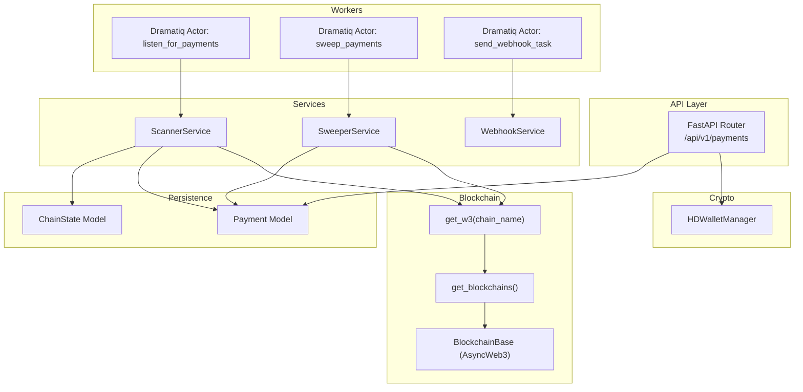
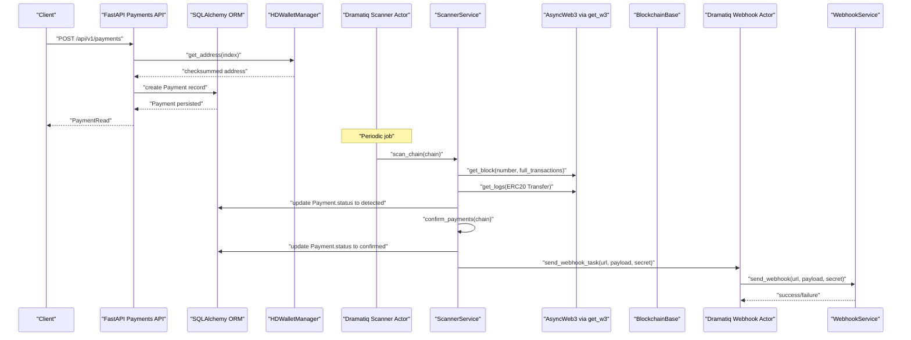
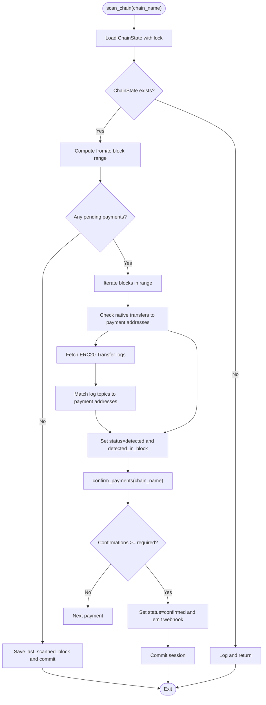
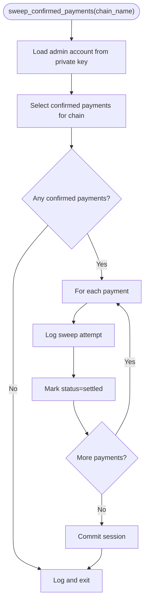
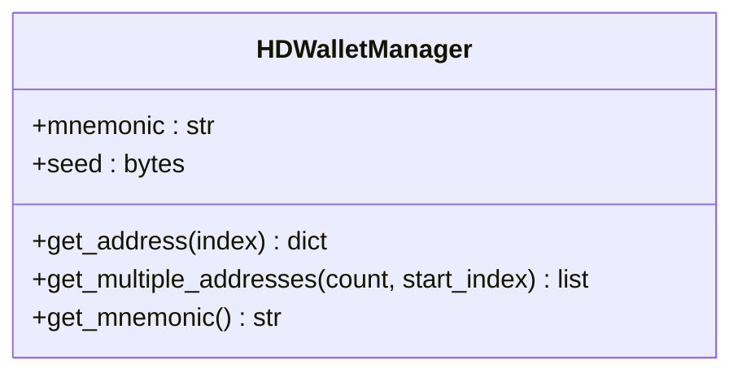
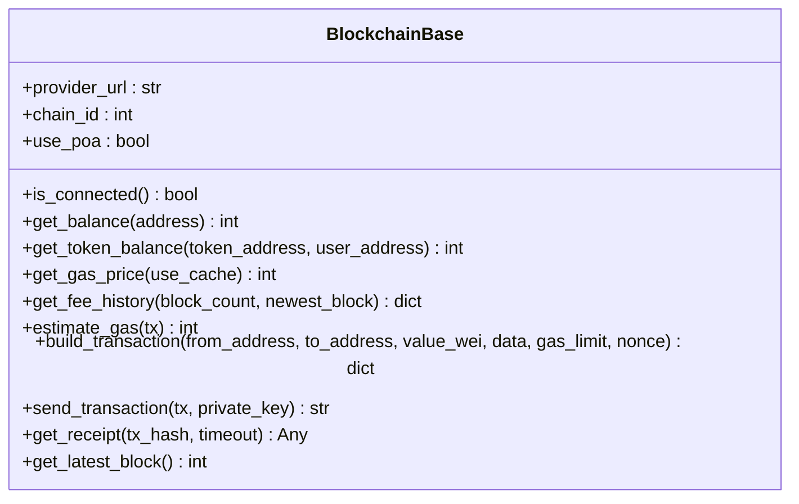
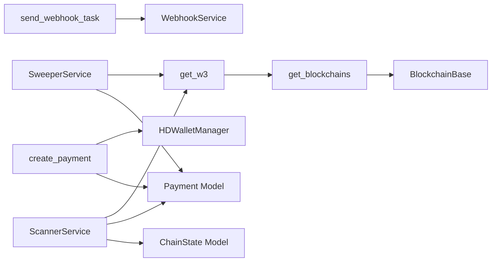

# Core Services

<cite>
**Referenced Files in This Document**
- [app/services/blockchain/scanner.py](file://app/services/blockchain/scanner.py)
- [app/services/blockchain/sweeper.py](file://app/services/blockchain/sweeper.py)
- [app/services/webhook.py](file://app/services/webhook.py)
- [app/utils/crypto.py](file://app/utils/crypto.py)
- [app/blockchain/base.py](file://app/blockchain/base.py)
- [app/blockchain/w3.py](file://app/blockchain/w3.py)
- [app/blockchain/manager.py](file://app/blockchain/manager.py)
- [app/db/models/payment.py](file://app/db/models/payment.py)
- [app/db/models/chain.py](file://app/db/models/chain.py)
- [app/core/config.py](file://app/core/config.py)
- [app/workers/listener.py](file://app/workers/listener.py)
- [app/workers/sweeper.py](file://app/workers/sweeper.py)
- [app/workers/webhook.py](file://app/workers/webhook.py)
- [app/api/dependencies.py](file://app/api/dependencies.py)
- [app/api/v1/payments.py](file://app/api/v1/payments.py)
</cite>

## Table of Contents
1. [Introduction](#introduction)
2. [Project Structure](#project-structure)
3. [Core Components](#core-components)
4. [Architecture Overview](#architecture-overview)
5. [Detailed Component Analysis](#detailed-component-analysis)
6. [Dependency Analysis](#dependency-analysis)
7. [Performance Considerations](#performance-considerations)
8. [Troubleshooting Guide](#troubleshooting-guide)
9. [Conclusion](#conclusion)
10. [Appendices](#appendices)

## Introduction
This document describes the core services powering the cTrip Payment Gateway business logic. It focuses on:
- Blockchain scanner service for real-time payment detection and confirmation monitoring across multiple chains
- Sweeper service for automated fund transfer to admin wallets after successful payments
- Webhook service for notifying external systems about payment status changes
- Crypto utilities for HD wallet management, address generation, and cryptographic operations
It also covers initialization patterns, dependency injection, error handling strategies, service interfaces, integration patterns, performance considerations, retry logic, and monitoring approaches.

## Project Structure
The core services are organized around domain-driven boundaries:
- Services: business logic for scanning, sweeping, and webhook delivery
- Blockchain: chain abstraction and RPC integration via AsyncWeb3
- Utils: cryptographic helpers and HD wallet management
- Workers: scheduled actors orchestrated by Dramatiq
- API: payment creation and dependency injection points
- DB Models: persistence schema for payments and chain state
- Config: centralized settings and validation



**Diagram sources**
- [app/api/v1/payments.py](file://app/api/v1/payments.py#L1-L62)
- [app/workers/listener.py](file://app/workers/listener.py#L1-L46)
- [app/workers/sweeper.py](file://app/workers/sweeper.py#L1-L40)
- [app/workers/webhook.py](file://app/workers/webhook.py#L1-L37)
- [app/services/blockchain/scanner.py](file://app/services/blockchain/scanner.py#L1-L134)
- [app/services/blockchain/sweeper.py](file://app/services/blockchain/sweeper.py#L1-L54)
- [app/services/webhook.py](file://app/services/webhook.py#L1-L45)
- [app/blockchain/w3.py](file://app/blockchain/w3.py#L1-L9)
- [app/blockchain/manager.py](file://app/blockchain/manager.py#L1-L33)
- [app/blockchain/base.py](file://app/blockchain/base.py#L1-L146)
- [app/utils/crypto.py](file://app/utils/crypto.py#L1-L90)
- [app/db/models/payment.py](file://app/db/models/payment.py#L1-L74)
- [app/db/models/chain.py](file://app/db/models/chain.py#L1-L17)

**Section sources**
- [app/api/v1/payments.py](file://app/api/v1/payments.py#L1-L62)
- [app/workers/listener.py](file://app/workers/listener.py#L1-L46)
- [app/workers/sweeper.py](file://app/workers/sweeper.py#L1-L40)
- [app/workers/webhook.py](file://app/workers/webhook.py#L1-L37)
- [app/services/blockchain/scanner.py](file://app/services/blockchain/scanner.py#L1-L134)
- [app/services/blockchain/sweeper.py](file://app/services/blockchain/sweeper.py#L1-L54)
- [app/services/webhook.py](file://app/services/webhook.py#L1-L45)
- [app/blockchain/w3.py](file://app/blockchain/w3.py#L1-L9)
- [app/blockchain/manager.py](file://app/blockchain/manager.py#L1-L33)
- [app/blockchain/base.py](file://app/blockchain/base.py#L1-L146)
- [app/utils/crypto.py](file://app/utils/crypto.py#L1-L90)
- [app/db/models/payment.py](file://app/db/models/payment.py#L1-L74)
- [app/db/models/chain.py](file://app/db/models/chain.py#L1-L17)

## Core Components
- ScannerService: Scans blocks for native and ERC20 transfers, updates detection and confirmation statuses, and triggers webhooks upon confirmation.
- SweeperService: Transfers funds from payment addresses to an admin wallet after confirmation and marks payments as settled.
- WebhookService: Sends signed webhook notifications to external systems with HMAC-SHA256 when a secret is provided.
- HDWalletManager: Generates deterministic payment addresses using BIP-44 derivation from a mnemonic.
- BlockchainBase: Provides AsyncWeb3 integration, gas estimation, transaction building, and receipt polling.
- Worker orchestration: Dramatiq actors schedule periodic scanning, sweeping, and webhook delivery.

Key interfaces and responsibilities:
- ScannerService.scan_chain(chain_name): Scans a chain within a block range and detects incoming payments.
- ScannerService.confirm_payments(chain_name): Confirms detected payments based on required confirmations and emits webhooks.
- SweeperService.sweep_confirmed_payments(chain_name): Sweeps confirmed payments to the admin wallet.
- WebhookService.send_webhook(url, payload, secret): Asynchronously posts signed webhook payloads.
- HDWalletManager.get_address(index): Derives a checksummed address for a payment index.
- BlockchainBase.build_transaction(...) and send_transaction(...): Constructs and submits transactions with dynamic gas pricing.

**Section sources**
- [app/services/blockchain/scanner.py](file://app/services/blockchain/scanner.py#L14-L134)
- [app/services/blockchain/sweeper.py](file://app/services/blockchain/sweeper.py#L11-L54)
- [app/services/webhook.py](file://app/services/webhook.py#L10-L45)
- [app/utils/crypto.py](file://app/utils/crypto.py#L5-L67)
- [app/blockchain/base.py](file://app/blockchain/base.py#L22-L146)

## Architecture Overview
The system integrates FastAPI for payment creation, Dramatiq for background jobs, SQLAlchemy for persistence, and AsyncWeb3 for blockchain interactions. Configuration is centralized via Settings with validation and environment-aware defaults.



**Diagram sources**
- [app/api/v1/payments.py](file://app/api/v1/payments.py#L18-L54)
- [app/workers/listener.py](file://app/workers/listener.py#L21-L46)
- [app/services/blockchain/scanner.py](file://app/services/blockchain/scanner.py#L20-L134)
- [app/blockchain/w3.py](file://app/blockchain/w3.py#L6-L9)
- [app/blockchain/base.py](file://app/blockchain/base.py#L34-L146)
- [app/workers/webhook.py](file://app/workers/webhook.py#L13-L37)
- [app/services/webhook.py](file://app/services/webhook.py#L12-L45)

## Detailed Component Analysis

### ScannerService
Responsibilities:
- Scan a chain within a bounded block range
- Detect native ETH transfers and ERC20 token transfers
- Update payment records to detected and later confirmed
- Emit webhooks on confirmation when configured

Key behaviors:
- Uses ChainState to track last scanned block per chain
- Filters pending payments by chain and address
- Compares received amounts against required amounts
- Applies configurable confirmations threshold before marking confirmed
- Emits webhooks asynchronously via Dramatiq



**Diagram sources**
- [app/services/blockchain/scanner.py](file://app/services/blockchain/scanner.py#L20-L134)
- [app/db/models/chain.py](file://app/db/models/chain.py#L9-L17)
- [app/db/models/payment.py](file://app/db/models/payment.py#L41-L57)

**Section sources**
- [app/services/blockchain/scanner.py](file://app/services/blockchain/scanner.py#L14-L134)
- [app/db/models/chain.py](file://app/db/models/chain.py#L9-L17)
- [app/db/models/payment.py](file://app/db/models/payment.py#L41-L57)

### SweeperService
Responsibilities:
- Sweep confirmed payments to an admin wallet
- Placeholder for transaction construction and submission
- Marks payments as settled after sweeping

Current implementation highlights:
- Loads admin account from a configured private key
- Iterates confirmed payments per chain
- Logs sweep attempts and marks as settled (placeholder for actual transfer)



**Diagram sources**
- [app/services/blockchain/sweeper.py](file://app/services/blockchain/sweeper.py#L16-L54)
- [app/db/models/payment.py](file://app/db/models/payment.py#L41-L57)

**Section sources**
- [app/services/blockchain/sweeper.py](file://app/services/blockchain/sweeper.py#L11-L54)
- [app/db/models/payment.py](file://app/db/models/payment.py#L41-L57)

### WebhookService
Responsibilities:
- Send signed webhook payloads to external systems
- Sign payloads using HMAC-SHA256 when a secret is provided
- Asynchronous HTTP posting with structured logging

Integration pattern:
- Called by ScannerService on confirmation
- Wrapped in a Dramatiq actor with retry policy

```mermaid
sequenceDiagram
participant Scanner as "ScannerService"
participant Settings as "Settings"
participant Actor as "send_webhook_task"
participant Service as "WebhookService"
participant Remote as "External System"
Scanner->>Settings : "Read webhook_url and webhook_secret"
Scanner->>Actor : "send_webhook_task(url, payload, secret)"
Actor->>Service : "send_webhook(url, payload, secret)"
Service->>Service : "Sign payload with HMAC-SHA256"
Service->>Remote : "POST JSON with X-Webhook-Signature"
Remote-->>Service : "HTTP 2xx/4xx/5xx"
Service-->>Actor : "Success/Failure"
Actor-->>Scanner : "Retry on failure"
```

**Diagram sources**
- [app/services/blockchain/scanner.py](file://app/services/blockchain/scanner.py#L117-L131)
- [app/workers/webhook.py](file://app/workers/webhook.py#L13-L37)
- [app/services/webhook.py](file://app/services/webhook.py#L12-L45)
- [app/core/config.py](file://app/core/config.py#L63-L71)

**Section sources**
- [app/services/webhook.py](file://app/services/webhook.py#L10-L45)
- [app/workers/webhook.py](file://app/workers/webhook.py#L13-L37)
- [app/core/config.py](file://app/core/config.py#L63-L71)

### HDWalletManager
Responsibilities:
- Generate mnemonic phrases or accept provided mnemonics
- Derive checksummed addresses using BIP-44 path m/44'/60'/0'/0/{index}
- Provide multiple addresses for batch generation

Usage:
- Used by API to generate payment addresses during creation
- Injected via dependency to ensure consistent state across requests



**Diagram sources**
- [app/utils/crypto.py](file://app/utils/crypto.py#L5-L67)

**Section sources**
- [app/utils/crypto.py](file://app/utils/crypto.py#L5-L67)
- [app/api/v1/payments.py](file://app/api/v1/payments.py#L36-L37)
- [app/api/dependencies.py](file://app/api/dependencies.py#L11-L14)

### BlockchainBase and RPC Integration
Responsibilities:
- Manage AsyncWeb3 connections and middleware
- Provide balance queries, gas estimation, and transaction building
- Support EIP-1559 fee calculation with fallback to legacy gas pricing
- Send raw transactions and wait for receipts

Integration:
- get_w3(chain_name) resolves AsyncWeb3 instances via BlockchainBase
- get_blockchains() constructs chain-specific providers from configuration



**Diagram sources**
- [app/blockchain/base.py](file://app/blockchain/base.py#L22-L146)
- [app/blockchain/w3.py](file://app/blockchain/w3.py#L6-L9)
- [app/blockchain/manager.py](file://app/blockchain/manager.py#L8-L33)

**Section sources**
- [app/blockchain/base.py](file://app/blockchain/base.py#L22-L146)
- [app/blockchain/w3.py](file://app/blockchain/w3.py#L6-L9)
- [app/blockchain/manager.py](file://app/blockchain/manager.py#L8-L33)

### Worker Orchestration
- listen_for_payments: Periodic actor that scans and confirms payments across configured chains
- sweep_payments: Periodic actor that sweeps confirmed payments to admin wallet
- send_webhook_task: Retriable actor that sends signed webhooks

Initialization and scheduling:
- Actors are decorated with time limits and retry policies
- Chains are loaded from settings and used to iterate work
- Sessions are scoped per actor run

**Section sources**
- [app/workers/listener.py](file://app/workers/listener.py#L21-L46)
- [app/workers/sweeper.py](file://app/workers/sweeper.py#L19-L40)
- [app/workers/webhook.py](file://app/workers/webhook.py#L13-L37)
- [app/core/config.py](file://app/core/config.py#L44-L56)

## Dependency Analysis
- ScannerService depends on AsyncWeb3 via get_w3, ChainState, Payment, and Token models, and the webhook actor
- SweeperService depends on AsyncWeb3 via get_w3, Payment model, and HDWalletManager
- WebhookService depends on httpx and HMAC signing
- API depends on HDWalletManager and Payment model
- BlockchainBase encapsulates AsyncWeb3 and gas/fee logic
- Workers depend on services and settings



**Diagram sources**
- [app/services/blockchain/scanner.py](file://app/services/blockchain/scanner.py#L1-L10)
- [app/services/blockchain/sweeper.py](file://app/services/blockchain/sweeper.py#L1-L7)
- [app/services/webhook.py](file://app/services/webhook.py#L1-L8)
- [app/api/v1/payments.py](file://app/api/v1/payments.py#L18-L54)
- [app/blockchain/w3.py](file://app/blockchain/w3.py#L1-L9)
- [app/blockchain/manager.py](file://app/blockchain/manager.py#L1-L33)
- [app/blockchain/base.py](file://app/blockchain/base.py#L1-L146)
- [app/db/models/payment.py](file://app/db/models/payment.py#L41-L57)
- [app/db/models/chain.py](file://app/db/models/chain.py#L9-L17)

**Section sources**
- [app/services/blockchain/scanner.py](file://app/services/blockchain/scanner.py#L1-L10)
- [app/services/blockchain/sweeper.py](file://app/services/blockchain/sweeper.py#L1-L7)
- [app/services/webhook.py](file://app/services/webhook.py#L1-L8)
- [app/api/v1/payments.py](file://app/api/v1/payments.py#L18-L54)
- [app/blockchain/w3.py](file://app/blockchain/w3.py#L1-L9)
- [app/blockchain/manager.py](file://app/blockchain/manager.py#L1-L33)
- [app/blockchain/base.py](file://app/blockchain/base.py#L1-L146)
- [app/db/models/payment.py](file://app/db/models/payment.py#L41-L57)
- [app/db/models/chain.py](file://app/db/models/chain.py#L9-L17)

## Performance Considerations
- Block scanning batching: Limit block ranges per cycle to avoid long-running operations and excessive RPC calls
- Gas caching: BlockchainBase caches gas price for a short duration to reduce repeated network calls
- Confirmation thresholds: Tune confirmations_required to balance speed vs. reorg safety
- Retry and backoff: Webhook actor has retries; consider exponential backoff for resilience
- Concurrency: Use separate actors per chain to parallelize work; ensure database sessions are not shared across chains
- Monitoring: Log scan windows, detected counts, confirmation rates, and webhook delivery outcomes

[No sources needed since this section provides general guidance]

## Troubleshooting Guide
Common issues and resolutions:
- Chain not configured: get_w3 raises an error if chain_name is not present in registered blockchains
- Invalid private key: Settings validates private key format; ensure a proper Ethereum private key is set
- Webhook failures: WebhookService logs HTTP errors; verify URL, secret, and network connectivity
- No payments detected: Verify pending payments exist for the target chain and addresses match
- Sweeping placeholder: Actual transaction sending is not implemented; implement transaction building and submission before enabling production sweeping

Operational checks:
- Verify settings.chains and chains.yaml are correctly loaded
- Confirm AsyncWeb3 connectivity via BlockchainBase.is_connected
- Inspect ChainState.last_scanned_block progression
- Review webhook actor logs for retryable failures

**Section sources**
- [app/blockchain/w3.py](file://app/blockchain/w3.py#L7-L9)
- [app/core/config.py](file://app/core/config.py#L94-L102)
- [app/services/webhook.py](file://app/services/webhook.py#L39-L44)
- [app/blockchain/base.py](file://app/blockchain/base.py#L45-L50)
- [app/db/models/chain.py](file://app/db/models/chain.py#L9-L17)

## Conclusion
The cTrip Payment Gateway implements a modular, asynchronous architecture for payment lifecycle management. ScannerService provides robust detection and confirmation logic, SweeperService prepares the foundation for automated fund settlement, and WebhookService enables reliable external notifications. HDWalletManager ensures deterministic address generation, while BlockchainBase abstracts RPC complexity. Workers orchestrate periodic tasks with clear retry semantics. Together, these components form a scalable and maintainable payment infrastructure.

[No sources needed since this section summarizes without analyzing specific files]

## Appendices

### Service Interfaces and Method Signatures
- ScannerService
  - scan_chain(chain_name: str) -> None
  - confirm_payments(chain_name: str) -> None
- SweeperService
  - sweep_confirmed_payments(chain_name: str) -> None
- WebhookService
  - send_webhook(url: str, payload: Dict[str, Any], secret: Optional[str] = None) -> bool
- HDWalletManager
  - get_address(index: int) -> Dict[str, Any]
  - get_multiple_addresses(count: int, start_index: int = 0) -> List[Dict[str, Any]]
  - get_mnemonic() -> str

**Section sources**
- [app/services/blockchain/scanner.py](file://app/services/blockchain/scanner.py#L20-L134)
- [app/services/blockchain/sweeper.py](file://app/services/blockchain/sweeper.py#L16-L54)
- [app/services/webhook.py](file://app/services/webhook.py#L12-L16)
- [app/utils/crypto.py](file://app/utils/crypto.py#L27-L66)

### Initialization Patterns and Dependency Injection
- Settings: Centralized configuration with environment-aware defaults and validators
- API dependencies: get_hdwallet and get_blockchains inject runtime-managed instances
- Worker initialization: Actors construct services with database sessions and settings
- Blockchain registry: get_blockchains builds provider instances from chains configuration

**Section sources**
- [app/core/config.py](file://app/core/config.py#L10-L126)
- [app/api/dependencies.py](file://app/api/dependencies.py#L5-L14)
- [app/workers/listener.py](file://app/workers/listener.py#L30-L35)
- [app/workers/sweeper.py](file://app/workers/sweeper.py#L28-L30)
- [app/blockchain/manager.py](file://app/blockchain/manager.py#L8-L33)

### Integration Patterns
- Payment creation: API creates Payment records and derives addresses via HDWalletManager
- Background processing: Workers schedule scanning, sweeping, and webhook delivery
- External notifications: WebhookService signs and posts payloads to remote systems
- Persistence: SQLAlchemy models define payment lifecycle and chain state

**Section sources**
- [app/api/v1/payments.py](file://app/api/v1/payments.py#L18-L54)
- [app/workers/listener.py](file://app/workers/listener.py#L21-L46)
- [app/workers/sweeper.py](file://app/workers/sweeper.py#L19-L40)
- [app/workers/webhook.py](file://app/workers/webhook.py#L13-L37)
- [app/services/webhook.py](file://app/services/webhook.py#L12-L45)
- [app/db/models/payment.py](file://app/db/models/payment.py#L41-L57)
- [app/db/models/chain.py](file://app/db/models/chain.py#L9-L17)