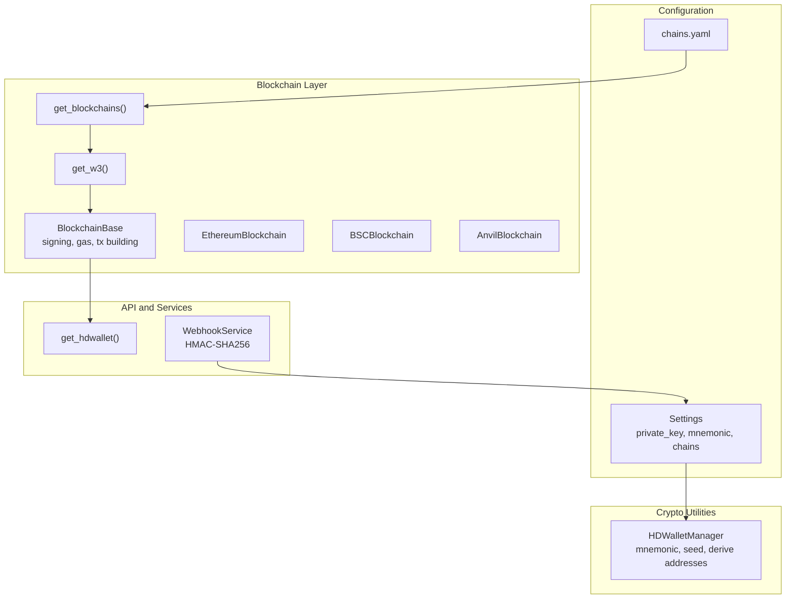
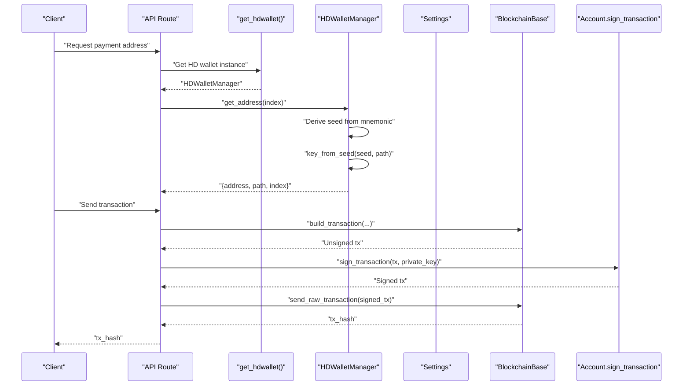
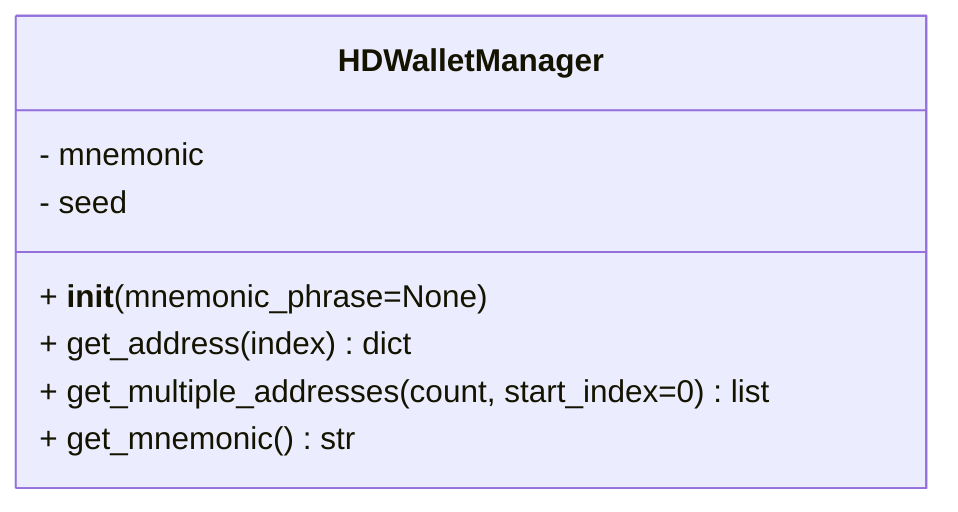
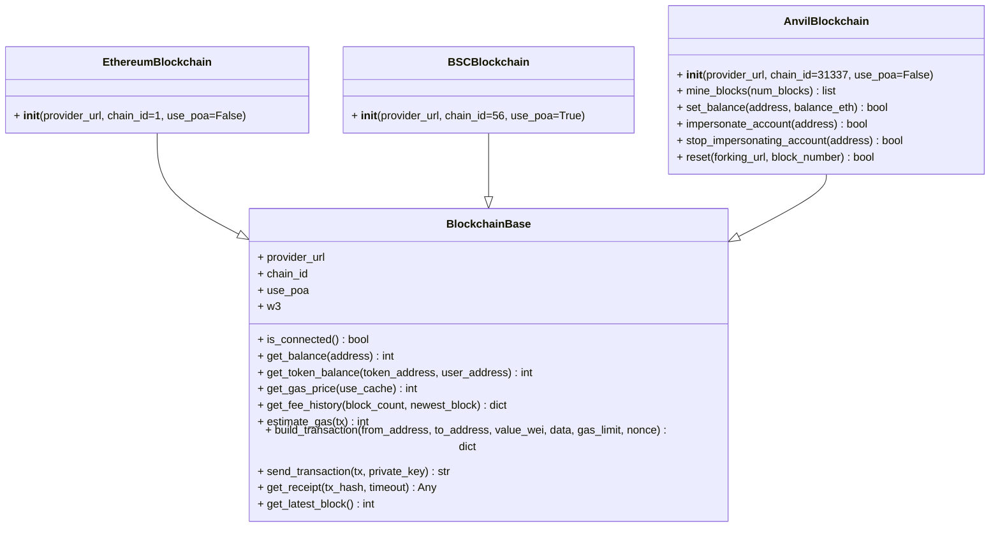
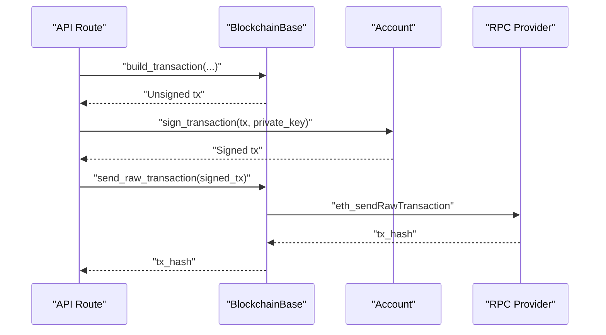
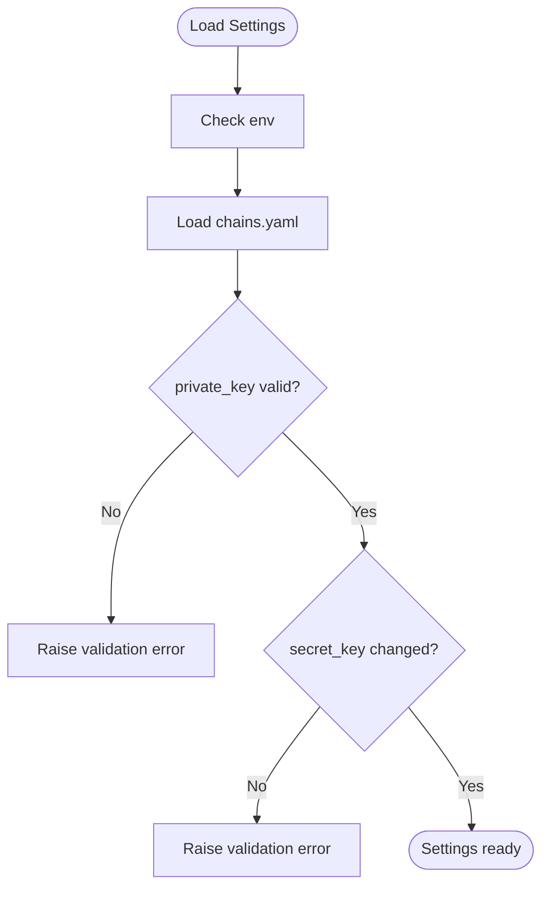
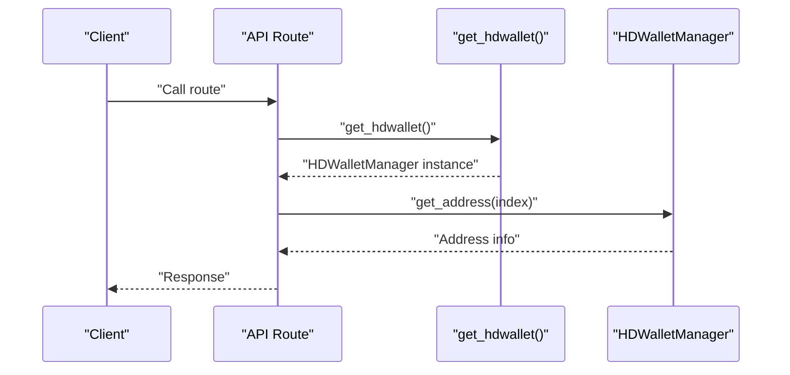
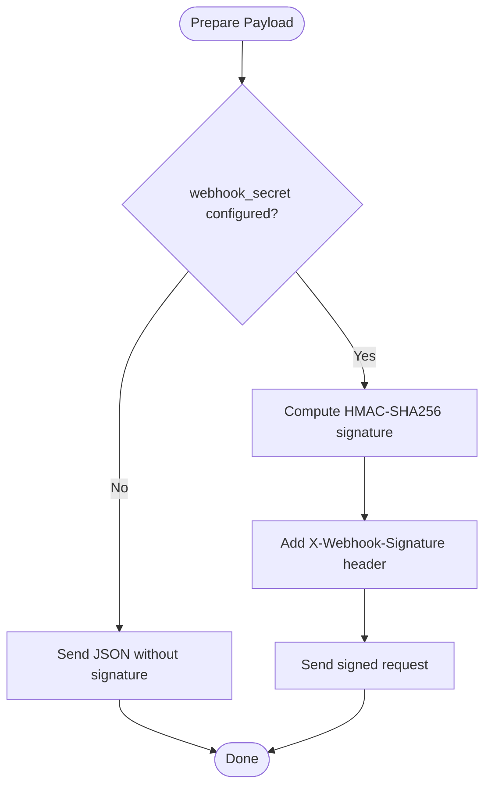
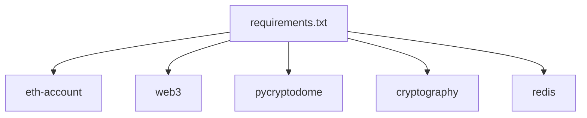

# Crypto Utilities

<cite>
**Referenced Files in This Document**
- [crypto.py](file://app/utils/crypto.py)
- [config.py](file://app/core/config.py)
- [dependencies.py](file://app/api/dependencies.py)
- [manager.py](file://app/blockchain/manager.py)
- [base.py](file://app/blockchain/base.py)
- [ethereum.py](file://app/blockchain/ethereum.py)
- [bsc.py](file://app/blockchain/bsc.py)
- [anvil.py](file://app/blockchain/anvil.py)
- [w3.py](file://app/blockchain/w3.py)
- [chains.yaml](file://chains.yaml)
- [requirements.txt](file://requirements.txt)
- [payment.py](file://app/db/models/payment.py)
- [webhook.py](file://app/services/webhook.py)
</cite>

## Table of Contents
1. [Introduction](#introduction)
2. [Project Structure](#project-structure)
3. [Core Components](#core-components)
4. [Architecture Overview](#architecture-overview)
5. [Detailed Component Analysis](#detailed-component-analysis)
6. [Dependency Analysis](#dependency-analysis)
7. [Performance Considerations](#performance-considerations)
8. [Troubleshooting Guide](#troubleshooting-guide)
9. [Conclusion](#conclusion)
10. [Appendices](#appendices)

## Introduction
This document describes the Crypto Utilities module responsible for cryptographic operations in the payment gateway. It focuses on HD wallet management using BIP-44 derivation, mnemonic phrase generation and handling, address derivation for supported blockchains, and integration with blockchain providers via Web3. It also outlines cryptographic functions used for signing transactions and securing webhook communications, along with operational guidance for private key management, entropy sources, and compliance considerations.

## Project Structure
The Crypto Utilities module is primarily implemented in a single utility file and integrates with configuration, blockchain adapters, and API dependencies. The following diagram shows the high-level structure and relationships among the key components involved in cryptographic operations.

**Diagram sources**
- [config.py](file://app/core/config.py#L58-L82)
- [chains.yaml](file://chains.yaml#L1-L24)
- [crypto.py](file://app/utils/crypto.py#L5-L66)
- [manager.py](file://app/blockchain/manager.py#L8-L32)
- [base.py](file://app/blockchain/base.py#L22-L146)
- [ethereum.py](file://app/blockchain/ethereum.py#L3-L7)
- [bsc.py](file://app/blockchain/bsc.py#L3-L7)
- [anvil.py](file://app/blockchain/anvil.py#L8-L57)
- [w3.py](file://app/blockchain/w3.py#L4-L9)
- [dependencies.py](file://app/api/dependencies.py#L11-L15)
- [webhook.py](file://app/services/webhook.py#L10-L44)

**Section sources**
- [config.py](file://app/core/config.py#L58-L82)
- [chains.yaml](file://chains.yaml#L1-L24)
- [crypto.py](file://app/utils/crypto.py#L5-L66)
- [manager.py](file://app/blockchain/manager.py#L8-L32)
- [base.py](file://app/blockchain/base.py#L22-L146)
- [dependencies.py](file://app/api/dependencies.py#L11-L15)
- [webhook.py](file://app/services/webhook.py#L10-L44)

## Core Components
- HDWalletManager: Generates mnemonics, derives seeds, and produces Ethereum addresses using BIP-44 derivation path m/44'/60'/0'/0/{index}. It exposes methods to retrieve a single address, a batch of sequential addresses, and the mnemonic phrase.
- BlockchainBase and chain-specific classes: Provide Web3 integration, gas estimation, transaction building, signing, and sending. They encapsulate chain-specific parameters (e.g., chain IDs, PoA handling).
- Configuration and secrets: Centralized settings define private keys, mnemonics, and chain configurations. Validators ensure private key correctness and enforce production secret key changes.
- API dependencies: Provide access to HDWalletManager and blockchain instances to API routes.
- Webhook service: Implements HMAC-SHA256 signing for outbound webhooks using a configurable secret.

**Section sources**
- [crypto.py](file://app/utils/crypto.py#L5-L66)
- [base.py](file://app/blockchain/base.py#L22-L146)
- [ethereum.py](file://app/blockchain/ethereum.py#L3-L7)
- [bsc.py](file://app/blockchain/bsc.py#L3-L7)
- [config.py](file://app/core/config.py#L58-L102)
- [dependencies.py](file://app/api/dependencies.py#L11-L15)
- [webhook.py](file://app/services/webhook.py#L10-L44)

## Architecture Overview
The cryptographic stack integrates HD wallet derivation with blockchain operations and secure configuration management. The sequence below illustrates how a payment address is derived and how a transaction is built and signed.

**Diagram sources**
- [dependencies.py](file://app/api/dependencies.py#L11-L15)
- [crypto.py](file://app/utils/crypto.py#L27-L46)
- [base.py](file://app/blockchain/base.py#L93-L139)
- [config.py](file://app/core/config.py#L74-L102)

## Detailed Component Analysis

### HD Wallet Manager
The HDWalletManager encapsulates mnemonic handling, seed derivation, and BIP-44 address derivation for Ethereum. It supports generating a new mnemonic or accepting an existing one, deriving a seed, and computing addresses for payment routing.

Key capabilities:
- Mnemonic generation and storage
- Seed derivation from mnemonic
- BIP-44 path construction m/44'/60'/0'/0/{index}
- Private key derivation and Ethereum address computation
- Batch address generation

**Diagram sources**
- [crypto.py](file://app/utils/crypto.py#L5-L66)

Operational notes:
- The manager does not implement explicit mnemonic validation; it relies on the underlying library’s validation during seed derivation.
- Private keys are derived on-demand per address and are not persisted by the manager.
- The manager’s methods return checksummed Ethereum addresses.

Best practices:
- Keep the mnemonic secret and protect it according to organizational policies.
- Prefer deterministic derivation for payment routing and avoid reusing addresses.
- Rotate derivation indices carefully to prevent address reuse.

**Section sources**
- [crypto.py](file://app/utils/crypto.py#L5-L66)

### Blockchain Integration and Transaction Signing
BlockchainBase provides a unified interface for interacting with EVM-compatible chains. It handles connection checks, balance queries, gas estimation, transaction building, signing, and sending. Chain-specific subclasses set appropriate chain IDs and consensus parameters.

**Diagram sources**
- [base.py](file://app/blockchain/base.py#L22-L146)
- [ethereum.py](file://app/blockchain/ethereum.py#L3-L7)
- [bsc.py](file://app/blockchain/bsc.py#L3-L7)
- [anvil.py](file://app/blockchain/anvil.py#L8-L57)

Transaction signing and sending flow:

**Diagram sources**
- [base.py](file://app/blockchain/base.py#L135-L139)

**Section sources**
- [base.py](file://app/blockchain/base.py#L22-L146)
- [ethereum.py](file://app/blockchain/ethereum.py#L3-L7)
- [bsc.py](file://app/blockchain/bsc.py#L3-L7)
- [anvil.py](file://app/blockchain/anvil.py#L8-L57)

### Configuration and Secrets
Settings centralize cryptographic and operational configuration:
- private_key: Validated as a proper Ethereum private key; required in production.
- secret_key: Application secret for cryptography; must be changed in production.
- mnemonic: HD wallet mnemonic used by HDWalletManager.
- chains: Loaded from chains.yaml to configure blockchain providers.

**Diagram sources**
- [config.py](file://app/core/config.py#L58-L102)
- [chains.yaml](file://chains.yaml#L1-L24)

**Section sources**
- [config.py](file://app/core/config.py#L58-L102)
- [chains.yaml](file://chains.yaml#L1-L24)

### API Dependencies and Access Patterns
The API exposes dependency functions to retrieve blockchain instances and the HD wallet manager. These functions ensure initialization occurs during application lifespan and provide safe access to shared resources.

**Diagram sources**
- [dependencies.py](file://app/api/dependencies.py#L11-L15)
- [crypto.py](file://app/utils/crypto.py#L27-L46)

**Section sources**
- [dependencies.py](file://app/api/dependencies.py#L11-L15)

### Webhook Security
The WebhookService signs outbound payloads using HMAC-SHA256 when a secret is configured. This ensures message integrity and authenticity for payment notifications.

**Diagram sources**
- [webhook.py](file://app/services/webhook.py#L10-L44)
- [config.py](file://app/core/config.py#L68-L71)

**Section sources**
- [webhook.py](file://app/services/webhook.py#L10-L44)
- [config.py](file://app/core/config.py#L68-L71)

## Dependency Analysis
External libraries underpinning cryptographic operations:
- eth-account: Mnemonic generation, seed derivation, private key creation, signing.
- web3: Async RPC communication, transaction building, gas estimation.
- pycryptodome and cryptography: General-purpose cryptographic primitives (present in requirements).
- redis: Background tasks and messaging infrastructure.

**Diagram sources**
- [requirements.txt](file://requirements.txt#L27-L106)

**Section sources**
- [requirements.txt](file://requirements.txt#L27-L106)

## Performance Considerations
- Gas estimation and caching: BlockchainBase caches gas price for a short duration to reduce RPC calls.
- EIP-1559 fee calculation: Uses fee history to compute dynamic fees; falls back to legacy gas price when unavailable.
- Asynchronous operations: Web3 calls are asynchronous to improve throughput under concurrent load.
- Mnemonic and seed derivation: Per-call cost is acceptable for low-frequency operations; cache derived private keys only in-memory for the shortest necessary time.

[No sources needed since this section provides general guidance]

## Troubleshooting Guide
Common issues and resolutions:
- Invalid private key: Validation raises an error if the private key is malformed. Ensure the key is a valid Ethereum private key.
- HD wallet not initialized: API dependency functions raise runtime errors if the HD wallet is not initialized during application lifespan.
- Blockchain not configured: get_blockchains returns a fallback chain if chains.yaml is missing or empty.
- Webhook signature failures: Verify webhook_secret is set and matches the receiver’s expectations.

**Section sources**
- [config.py](file://app/core/config.py#L94-L102)
- [dependencies.py](file://app/api/dependencies.py#L11-L15)
- [manager.py](file://app/blockchain/manager.py#L28-L32)
- [webhook.py](file://app/services/webhook.py#L10-L44)

## Conclusion
The Crypto Utilities module provides a focused set of cryptographic capabilities for HD wallet management, address derivation, and transaction signing. It integrates cleanly with configuration, blockchain adapters, and API dependencies while leveraging established libraries for security-critical operations. Adhering to the best practices outlined here will help maintain robustness, security, and compliance in production deployments.

[No sources needed since this section summarizes without analyzing specific files]

## Appendices

### Best Practices for Private Key Management
- Never hardcode private keys; use validated configuration fields.
- Enforce mandatory secret key changes in production.
- Limit private key exposure to memory-only usage during signing operations.
- Use separate keys for signing versus operational duties when possible.
- Audit and rotate keys regularly; track key usage for compliance.

**Section sources**
- [config.py](file://app/core/config.py#L74-L112)

### Entropy Sources and Secure Randomness
- Mnemonic generation uses a cryptographically secure random number generator via the underlying library.
- Avoid using predictable sources for entropy; rely on OS-provided randomness.

**Section sources**
- [crypto.py](file://app/utils/crypto.py#L18-L22)

### Compliance and Audit Considerations
- Maintain audit logs for cryptographic operations (address derivation, signing, sending).
- Validate private keys and secrets at startup to fail fast on misconfiguration.
- Document and review chain configurations and RPC endpoints.
- Ensure webhook signatures are enabled and consistently applied for payment notifications.

**Section sources**
- [config.py](file://app/core/config.py#L94-L102)
- [webhook.py](file://app/services/webhook.py#L10-L44)

### Database Model Notes for HD Wallet Addresses
- The HDWalletAddress model stores derived addresses and their indices for tracking and auditing.
- Consider adding constraints to prevent duplicate indices and ensure data integrity.

**Section sources**
- [payment.py](file://app/db/models/payment.py#L65-L74)