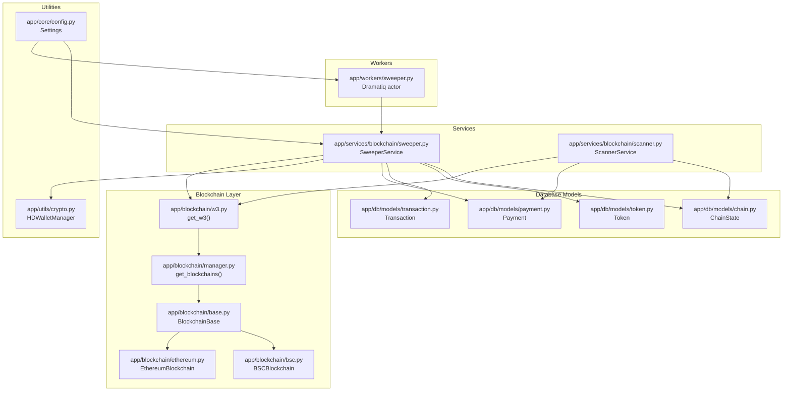
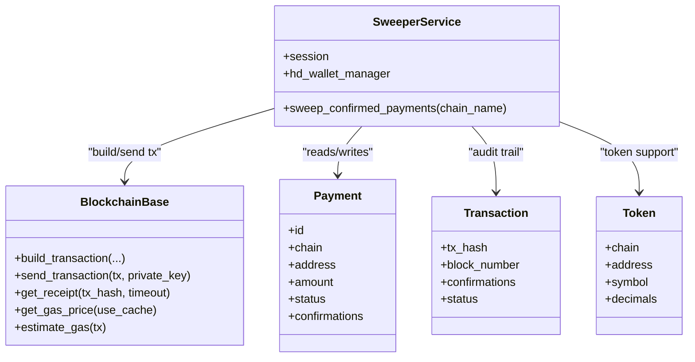
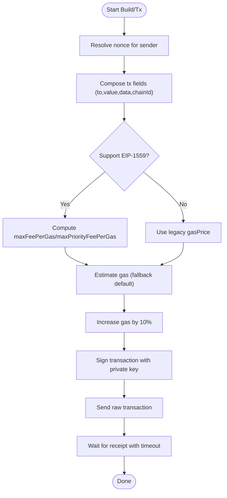
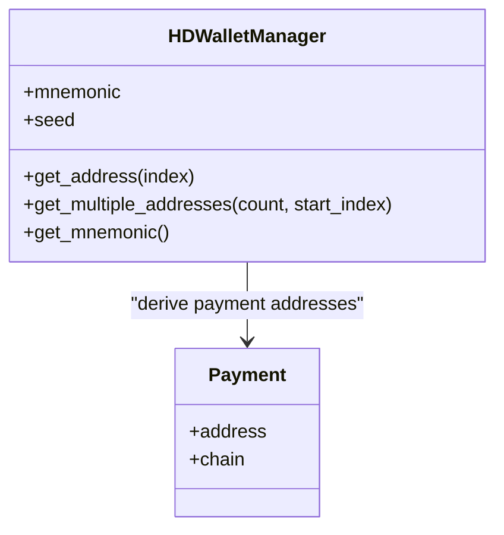
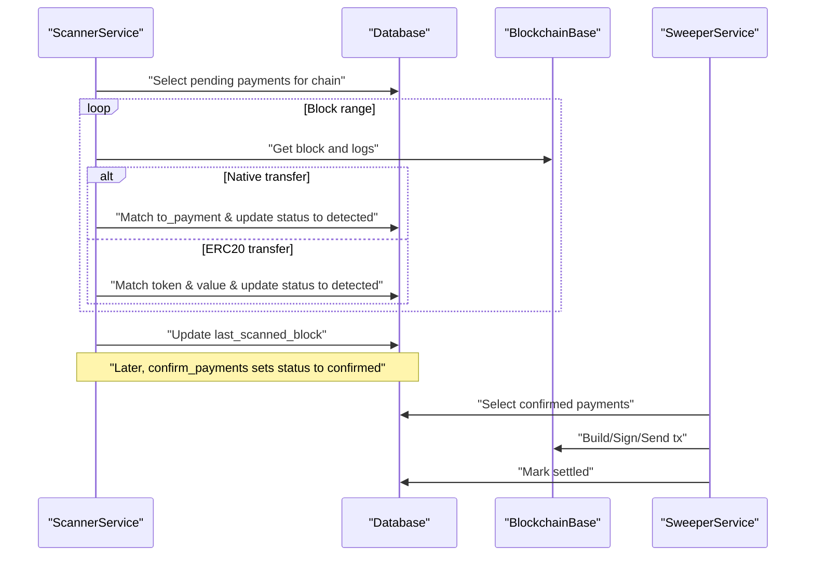
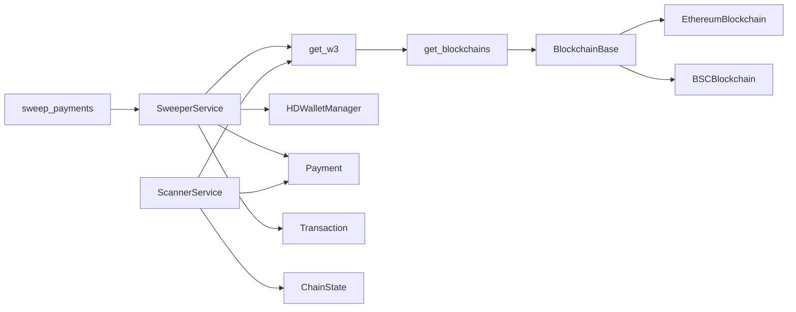
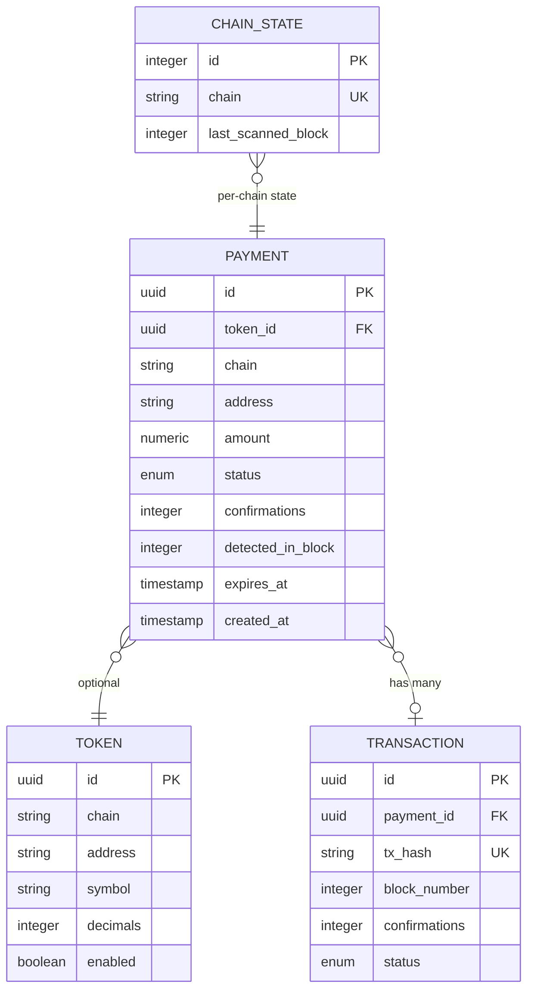

# Sweeper Service

<cite>
**Referenced Files in This Document**
- [app/services/blockchain/sweeper.py](https://github.com/rakibhossain72/ctrip/blob/main/app/services/blockchain/sweeper.py)
- [app/workers/sweeper.py](https://github.com/rakibhossain72/ctrip/blob/main/app/workers/sweeper.py)
- [app/blockchain/base.py](https://github.com/rakibhossain72/ctrip/blob/main/app/blockchain/base.py)
- [app/blockchain/w3.py](https://github.com/rakibhossain72/ctrip/blob/main/app/blockchain/w3.py)
- [app/blockchain/manager.py](https://github.com/rakibhossain72/ctrip/blob/main/app/blockchain/manager.py)
- [app/blockchain/ethereum.py](https://github.com/rakibhossain72/ctrip/blob/main/app/blockchain/ethereum.py)
- [app/blockchain/bsc.py](https://github.com/rakibhossain72/ctrip/blob/main/app/blockchain/bsc.py)
- [app/services/blockchain/scanner.py](https://github.com/rakibhossain72/ctrip/blob/main/app/services/blockchain/scanner.py)
- [app/utils/crypto.py](https://github.com/rakibhossain72/ctrip/blob/main/app/utils/crypto.py)
- [app/core/config.py](https://github.com/rakibhossain72/ctrip/blob/main/app/core/config.py)
- [app/db/models/payment.py](https://github.com/rakibhossain72/ctrip/blob/main/app/db/models/payment.py)
- [app/db/models/transaction.py](https://github.com/rakibhossain72/ctrip/blob/main/app/db/models/transaction.py)
- [app/db/models/token.py](https://github.com/rakibhossain72/ctrip/blob/main/app/db/models/token.py)
- [app/db/models/chain.py](https://github.com/rakibhossain72/ctrip/blob/main/app/db/models/chain.py)
- [chains.yaml](https://github.com/rakibhossain72/ctrip/blob/main/chains.yaml)
</cite>

## Table of Contents
1. [Introduction](#introduction)
2. [Project Structure](#project-structure)
3. [Core Components](#core-components)
4. [Architecture Overview](#architecture-overview)
5. [Detailed Component Analysis](#detailed-component-analysis)
6. [Dependency Analysis](#dependency-analysis)
7. [Performance Considerations](#performance-considerations)
8. [Troubleshooting Guide](#troubleshooting-guide)
9. [Security Considerations](#security-considerations)
10. [Conclusion](#conclusion)
11. [Appendices](#appendices)

## Introduction
This document describes the Sweeper Service responsible for automatically transferring confirmed payments to administrator wallets. It covers the fund extraction process from merchant addresses to admin wallets, transaction fee management and gas optimization, HD wallet integration for secure private key management and address derivation, the transaction signing workflow and broadcast mechanisms, confirmation monitoring, error handling and retry logic, and security considerations for private key storage, transaction validation, and audit trail maintenance. It also addresses performance optimization for batch sweeps and integration with the blockchain scanner service.

## Project Structure
The Sweeper Service is implemented as a worker actor that periodically triggers sweeping cycles across configured chains. It relies on a blockchain abstraction layer for gas estimation, transaction building, signing, and broadcasting, and integrates with the Scanner Service to move payments from pending to confirmed status prior to sweeping.



**Diagram sources**
- [app/workers/sweeper.py](https://github.com/rakibhossain72/ctrip/blob/main/app/workers/sweeper.py#L1-L40)
- [app/services/blockchain/sweeper.py](https://github.com/rakibhossain72/ctrip/blob/main/app/services/blockchain/sweeper.py#L1-L54)
- [app/blockchain/w3.py](https://github.com/rakibhossain72/ctrip/blob/main/app/blockchain/w3.py#L1-L9)
- [app/blockchain/manager.py](https://github.com/rakibhossain72/ctrip/blob/main/app/blockchain/manager.py#L1-L33)
- [app/blockchain/base.py](https://github.com/rakibhossain72/ctrip/blob/main/app/blockchain/base.py#L1-L146)
- [app/blockchain/ethereum.py](https://github.com/rakibhossain72/ctrip/blob/main/app/blockchain/ethereum.py#L1-L7)
- [app/blockchain/bsc.py](https://github.com/rakibhossain72/ctrip/blob/main/app/blockchain/bsc.py#L1-L7)
- [app/services/blockchain/scanner.py](https://github.com/rakibhossain72/ctrip/blob/main/app/services/blockchain/scanner.py#L1-L134)
- [app/utils/crypto.py](https://github.com/rakibhossain72/ctrip/blob/main/app/utils/crypto.py#L1-L90)
- [app/core/config.py](https://github.com/rakibhossain72/ctrip/blob/main/app/core/config.py#L1-L126)
- [app/db/models/payment.py](https://github.com/rakibhossain72/ctrip/blob/main/app/db/models/payment.py#L1-L74)
- [app/db/models/transaction.py](https://github.com/rakibhossain72/ctrip/blob/main/app/db/models/transaction.py#L1-L40)
- [app/db/models/token.py](https://github.com/rakibhossain72/ctrip/blob/main/app/db/models/token.py#L1-L15)
- [app/db/models/chain.py](https://github.com/rakibhossain72/ctrip/blob/main/app/db/models/chain.py#L1-L17)

**Section sources**
- [app/workers/sweeper.py](https://github.com/rakibhossain72/ctrip/blob/main/app/workers/sweeper.py#L1-L40)
- [app/services/blockchain/sweeper.py](https://github.com/rakibhossain72/ctrip/blob/main/app/services/blockchain/sweeper.py#L1-L54)
- [app/blockchain/w3.py](https://github.com/rakibhossain72/ctrip/blob/main/app/blockchain/w3.py#L1-L9)
- [app/blockchain/manager.py](https://github.com/rakibhossain72/ctrip/blob/main/app/blockchain/manager.py#L1-L33)
- [app/blockchain/base.py](https://github.com/rakibhossain72/ctrip/blob/main/app/blockchain/base.py#L1-L146)
- [app/blockchain/ethereum.py](https://github.com/rakibhossain72/ctrip/blob/main/app/blockchain/ethereum.py#L1-L7)
- [app/blockchain/bsc.py](https://github.com/rakibhossain72/ctrip/blob/main/app/blockchain/bsc.py#L1-L7)
- [app/services/blockchain/scanner.py](https://github.com/rakibhossain72/ctrip/blob/main/app/services/blockchain/scanner.py#L1-L134)
- [app/utils/crypto.py](https://github.com/rakibhossain72/ctrip/blob/main/app/utils/crypto.py#L1-L90)
- [app/core/config.py](https://github.com/rakibhossain72/ctrip/blob/main/app/core/config.py#L1-L126)
- [app/db/models/payment.py](https://github.com/rakibhossain72/ctrip/blob/main/app/db/models/payment.py#L1-L74)
- [app/db/models/transaction.py](https://github.com/rakibhossain72/ctrip/blob/main/app/db/models/transaction.py#L1-L40)
- [app/db/models/token.py](https://github.com/rakibhossain72/ctrip/blob/main/app/db/models/token.py#L1-L15)
- [app/db/models/chain.py](https://github.com/rakibhossain72/ctrip/blob/main/app/db/models/chain.py#L1-L17)

## Core Components
- SweeperService orchestrates the sweeping of confirmed payments per chain. It retrieves payments marked as confirmed, prepares transactions, signs them, broadcasts to the network, and marks payments as settled upon success. It currently contains placeholder logic and is intended to integrate with the blockchain layer for transaction construction and submission.
- Worker actor sweep_payments schedules periodic sweeping runs across configured chains, instantiates the SweeperService with an HD wallet manager, and retries itself after each cycle.
- BlockchainBase provides gas estimation, EIP-1559 fee calculation, transaction building, signing, and broadcast capabilities. It caches gas prices and supports POA middleware for specific chains.
- ScannerService advances payments from pending/detected to confirmed by scanning blocks and validating confirmations, enabling the sweeper to operate on finalized funds.
- HDWalletManager manages mnemonic-based HD derivation for Ethereum addresses using BIP-44 and exposes methods to derive addresses and retrieve mnemonics.
- Configuration Settings centralizes chain configuration, secrets, and webhook settings used by both sweeper and scanner.

**Section sources**
- [app/services/blockchain/sweeper.py](https://github.com/rakibhossain72/ctrip/blob/main/app/services/blockchain/sweeper.py#L11-L54)
- [app/workers/sweeper.py](https://github.com/rakibhossain72/ctrip/blob/main/app/workers/sweeper.py#L19-L40)
- [app/blockchain/base.py](https://github.com/rakibhossain72/ctrip/blob/main/app/blockchain/base.py#L22-L146)
- [app/services/blockchain/scanner.py](https://github.com/rakibhossain72/ctrip/blob/main/app/services/blockchain/scanner.py#L14-L134)
- [app/utils/crypto.py](https://github.com/rakibhossain72/ctrip/blob/main/app/utils/crypto.py#L5-L90)
- [app/core/config.py](https://github.com/rakibhossain72/ctrip/blob/main/app/core/config.py#L10-L126)

## Architecture Overview
The Sweeper Service operates as a periodic job that depends on ScannerService to finalize payments. It interacts with the blockchain via a chain-specific adapter resolved by get_w3/get_blockchains, constructs transactions using BlockchainBase, and updates persistence accordingly.

```mermaid
sequenceDiagram
participant Cron as "Scheduler"
participant Actor as "sweep_payments (Dramatiq)"
participant DB as "Database Session"
participant Sweeper as "SweeperService"
participant Scanner as "ScannerService"
participant Chain as "BlockchainBase"
participant Net as "EVM Network"
Cron->>Actor : "Trigger sweep_payments"
Actor->>DB : "Open async session"
Actor->>Sweeper : "Instantiate with HDWalletManager"
loop For each chain
Actor->>Sweeper : "sweep_confirmed_payments(chain)"
Sweeper->>DB : "Select confirmed payments"
alt Payments found
Sweeper->>Chain : "Build/Sign/Send tx (placeholder)"
Chain->>Net : "Broadcast raw transaction"
Net-->>Chain : "Tx hash"
Chain-->>Sweeper : "Receipt"
Sweeper->>DB : "Mark payment settled"
else No payments
Sweeper-->>Actor : "Skip"
end
end
Actor->>DB : "Commit"
Actor-->>Cron : "Schedule next run"
```

**Diagram sources**
- [app/workers/sweeper.py](https://github.com/rakibhossain72/ctrip/blob/main/app/workers/sweeper.py#L19-L40)
- [app/services/blockchain/sweeper.py](https://github.com/rakibhossain72/ctrip/blob/main/app/services/blockchain/sweeper.py#L16-L54)
- [app/blockchain/base.py](https://github.com/rakibhossain72/ctrip/blob/main/app/blockchain/base.py#L93-L146)
- [app/services/blockchain/scanner.py](https://github.com/rakibhossain72/ctrip/blob/main/app/services/blockchain/scanner.py#L97-L134)

## Detailed Component Analysis

### SweeperService
Responsibilities:
- Select confirmed payments per chain.
- Prepare transactions (placeholder) and sign/broadcast via BlockchainBase.
- Mark payments as settled upon successful broadcast/receipt.
- Handle per-payment exceptions and continue processing remaining items.

Key behaviors:
- Uses get_w3(chain_name) to resolve the chain’s Web3 provider.
- Retrieves admin address from a configured private key.
- Iterates confirmed payments and updates status to settled (placeholder).



**Diagram sources**
- [app/services/blockchain/sweeper.py](https://github.com/rakibhossain72/ctrip/blob/main/app/services/blockchain/sweeper.py#L11-L54)
- [app/blockchain/base.py](https://github.com/rakibhossain72/ctrip/blob/main/app/blockchain/base.py#L93-L146)
- [app/db/models/payment.py](https://github.com/rakibhossain72/ctrip/blob/main/app/db/models/payment.py#L41-L74)
- [app/db/models/transaction.py](https://github.com/rakibhossain72/ctrip/blob/main/app/db/models/transaction.py#L29-L40)
- [app/db/models/token.py](https://github.com/rakibhossain72/ctrip/blob/main/app/db/models/token.py#L6-L15)

**Section sources**
- [app/services/blockchain/sweeper.py](https://github.com/rakibhossain72/ctrip/blob/main/app/services/blockchain/sweeper.py#L11-L54)

### Worker Actor: sweep_payments
Responsibilities:
- Periodically trigger sweeping across configured chains.
- Instantiate SweeperService with an HDWalletManager built from the mnemonic.
- Schedule the next run after completion.

Operational details:
- Reads chains from settings.chains and falls back to a default chain if none configured.
- Creates async session and runs the sweeping coroutine.
- Schedules itself again after a fixed delay.

```mermaid
sequenceDiagram
participant Timer as "Actor Timer"
participant Actor as "sweep_payments"
participant DB as "AsyncSession"
participant HD as "HDWalletManager"
participant SW as "SweeperService"
Timer->>Actor : "Invoke"
Actor->>DB : "async with session()"
Actor->>HD : "Initialize from settings.mnemonic"
Actor->>SW : "Instantiate SweeperService"
loop For each chain
Actor->>SW : "sweep_confirmed_payments(chain)"
end
Actor->>DB : "Commit"
Actor-->>Timer : "Reschedule after delay"
```

**Diagram sources**
- [app/workers/sweeper.py](https://github.com/rakibhossain72/ctrip/blob/main/app/workers/sweeper.py#L19-L40)

**Section sources**
- [app/workers/sweeper.py](https://github.com/rakibhossain72/ctrip/blob/main/app/workers/sweeper.py#L19-L40)

### Blockchain Layer: Gas Management and Transaction Construction
Capabilities:
- EIP-1559 fee calculation using fee history with fallback to legacy gas price.
- Gas estimation with defaults and 10% buffer.
- Transaction building with nonce resolution and chain ID.
- Signing and raw transaction broadcast.
- Receipt polling with timeout.



**Diagram sources**
- [app/blockchain/base.py](https://github.com/rakibhossain72/ctrip/blob/main/app/blockchain/base.py#L65-L146)

**Section sources**
- [app/blockchain/base.py](https://github.com/rakibhossain72/ctrip/blob/main/app/blockchain/base.py#L65-L146)

### HD Wallet Integration
Capabilities:
- Mnemonic generation and seed derivation.
- BIP-44 derivation path for Ethereum (m/44'/60'/0'/0/index).
- Address derivation and retrieval for sequential indices.
- Mnemonic exposure for backup/recovery.



**Diagram sources**
- [app/utils/crypto.py](https://github.com/rakibhossain72/ctrip/blob/main/app/utils/crypto.py#L5-L90)
- [app/db/models/payment.py](https://github.com/rakibhossain72/ctrip/blob/main/app/db/models/payment.py#L65-L74)

**Section sources**
- [app/utils/crypto.py](https://github.com/rakibhossain72/ctrip/blob/main/app/utils/crypto.py#L5-L90)

### Integration with Scanner Service
The ScannerService moves payments from pending to confirmed by scanning blocks and verifying confirmations. The SweeperService then operates on confirmed payments only.



**Diagram sources**
- [app/services/blockchain/scanner.py](https://github.com/rakibhossain72/ctrip/blob/main/app/services/blockchain/scanner.py#L20-L134)
- [app/services/blockchain/sweeper.py](https://github.com/rakibhossain72/ctrip/blob/main/app/services/blockchain/sweeper.py#L16-L54)

**Section sources**
- [app/services/blockchain/scanner.py](https://github.com/rakibhossain72/ctrip/blob/main/app/services/blockchain/scanner.py#L14-L134)
- [app/services/blockchain/sweeper.py](https://github.com/rakibhossain72/ctrip/blob/main/app/services/blockchain/sweeper.py#L16-L54)

## Dependency Analysis
- SweeperService depends on:
  - get_w3(chain_name) for chain provider resolution.
  - HDWalletManager for private key derivation (to be integrated).
  - Database models for payment and transaction state.
- Worker actor depends on:
  - Settings for chains and secrets.
  - Async session for database operations.
- BlockchainBase depends on:
  - AsyncWeb3 provider and middleware stack.
  - Chain-specific subclasses for chain ID and POA handling.
- ScannerService depends on:
  - Chain state persistence and payment models.
  - Event logs for ERC20 detection.



**Diagram sources**
- [app/workers/sweeper.py](https://github.com/rakibhossain72/ctrip/blob/main/app/workers/sweeper.py#L19-L40)
- [app/services/blockchain/sweeper.py](https://github.com/rakibhossain72/ctrip/blob/main/app/services/blockchain/sweeper.py#L1-L54)
- [app/blockchain/w3.py](https://github.com/rakibhossain72/ctrip/blob/main/app/blockchain/w3.py#L1-L9)
- [app/blockchain/manager.py](https://github.com/rakibhossain72/ctrip/blob/main/app/blockchain/manager.py#L1-L33)
- [app/blockchain/base.py](https://github.com/rakibhossain72/ctrip/blob/main/app/blockchain/base.py#L1-L146)
- [app/blockchain/ethereum.py](https://github.com/rakibhossain72/ctrip/blob/main/app/blockchain/ethereum.py#L1-L7)
- [app/blockchain/bsc.py](https://github.com/rakibhossain72/ctrip/blob/main/app/blockchain/bsc.py#L1-L7)
- [app/services/blockchain/scanner.py](https://github.com/rakibhossain72/ctrip/blob/main/app/services/blockchain/scanner.py#L1-L134)
- [app/db/models/payment.py](https://github.com/rakibhossain72/ctrip/blob/main/app/db/models/payment.py#L1-L74)
- [app/db/models/transaction.py](https://github.com/rakibhossain72/ctrip/blob/main/app/db/models/transaction.py#L1-L40)
- [app/db/models/chain.py](https://github.com/rakibhossain72/ctrip/blob/main/app/db/models/chain.py#L1-L17)

**Section sources**
- [app/workers/sweeper.py](https://github.com/rakibhossain72/ctrip/blob/main/app/workers/sweeper.py#L19-L40)
- [app/services/blockchain/sweeper.py](https://github.com/rakibhossain72/ctrip/blob/main/app/services/blockchain/sweeper.py#L1-L54)
- [app/blockchain/w3.py](https://github.com/rakibhossain72/ctrip/blob/main/app/blockchain/w3.py#L1-L9)
- [app/blockchain/manager.py](https://github.com/rakibhossain72/ctrip/blob/main/app/blockchain/manager.py#L1-L33)
- [app/blockchain/base.py](https://github.com/rakibhossain72/ctrip/blob/main/app/blockchain/base.py#L1-L146)
- [app/blockchain/ethereum.py](https://github.com/rakibhossain72/ctrip/blob/main/app/blockchain/ethereum.py#L1-L7)
- [app/blockchain/bsc.py](https://github.com/rakibhossain72/ctrip/blob/main/app/blockchain/bsc.py#L1-L7)
- [app/services/blockchain/scanner.py](https://github.com/rakibhossain72/ctrip/blob/main/app/services/blockchain/scanner.py#L1-L134)
- [app/db/models/payment.py](https://github.com/rakibhossain72/ctrip/blob/main/app/db/models/payment.py#L1-L74)
- [app/db/models/transaction.py](https://github.com/rakibhossain72/ctrip/blob/main/app/db/models/transaction.py#L1-L40)
- [app/db/models/chain.py](https://github.com/rakibhossain72/ctrip/blob/main/app/db/models/chain.py#L1-L17)

## Performance Considerations
- Batch scanning and sweeping:
  - ScannerService scans blocks in batches to reduce load. Adjust block_batch_size for throughput vs. latency trade-offs.
  - SweeperService iterates confirmed payments per chain; consider batching multiple sends per chain with shared gas strategy.
- Gas optimization:
  - BlockchainBase caches gas price and applies a 10% buffer on estimated gas. Tune buffers based on observed congestion.
  - Prefer EIP-1559 where supported for dynamic fees; fallback to legacy gas price gracefully.
- Concurrency and parallelism:
  - Use separate actors or tasks per chain to parallelize sweeping across chains.
  - Avoid blocking operations; keep database sessions scoped to each iteration.
- Persistence overhead:
  - Commit in batches to reduce write contention.
  - Use read-only queries for detection and write-only for settlement updates.

[No sources needed since this section provides general guidance]

## Troubleshooting Guide
Common issues and remedies:
- No confirmed payments to sweep:
  - Expected when scanner has not yet advanced payments to confirmed. Verify scanner operation and confirmations_required.
- Transaction broadcast failures:
  - Inspect gas estimation and fee parameters; ensure sufficient native balance for gas.
  - Check nonce synchronization; ensure pending transactions are not stale.
- Private key or mnemonic misconfiguration:
  - Validate private_key format and mnemonic correctness; ensure secrets are loaded from environment.
- Chain not configured:
  - Ensure chains.yaml contains entries and settings.chains resolves to configured chains.

Operational hooks:
- Logging:
  - SweeperService logs per-payment attempts and errors.
  - Worker actor logs lifecycle events and scheduling.
- Retry scheduling:
  - Worker actor reschedules itself after each run; adjust delay as needed.

**Section sources**
- [app/services/blockchain/sweeper.py](https://github.com/rakibhossain72/ctrip/blob/main/app/services/blockchain/sweeper.py#L30-L54)
- [app/workers/sweeper.py](https://github.com/rakibhossain72/ctrip/blob/main/app/workers/sweeper.py#L19-L40)
- [app/core/config.py](https://github.com/rakibhossain72/ctrip/blob/main/app/core/config.py#L94-L102)

## Security Considerations
- Private key storage:
  - Admin private key must be validated and stored securely. The configuration enforces a valid Ethereum private key format.
  - Avoid logging private keys or sensitive fields; restrict access to secrets.
- HD wallet usage:
  - Use HDWalletManager to derive payment addresses without exposing private keys.
  - Keep mnemonic secure; rotate and back up as appropriate.
- Transaction validation:
  - Validate balances and amounts before constructing transactions.
  - Ensure correct chain ID and proper fee parameters to prevent re-org risks.
- Audit trail:
  - Persist transaction hashes, block numbers, and statuses to maintain an audit trail.
  - Track payment state transitions from confirmed to settled.

**Section sources**
- [app/core/config.py](https://github.com/rakibhossain72/ctrip/blob/main/app/core/config.py#L74-L102)
- [app/utils/crypto.py](https://github.com/rakibhossain72/ctrip/blob/main/app/utils/crypto.py#L5-L90)
- [app/db/models/transaction.py](https://github.com/rakibhossain72/ctrip/blob/main/app/db/models/transaction.py#L17-L40)
- [app/db/models/payment.py](https://github.com/rakibhossain72/ctrip/blob/main/app/db/models/payment.py#L21-L74)

## Conclusion
The Sweeper Service is designed to periodically extract confirmed funds from merchant addresses to an administrator wallet. It leverages a robust blockchain abstraction for gas management and transaction lifecycle, integrates with the Scanner Service for payment finalization, and uses an HD wallet for secure address derivation. While the current SweeperService contains placeholder transaction logic, the supporting infrastructure provides a strong foundation for implementing secure, gas-optimized, and auditable fund transfers.

[No sources needed since this section summarizes without analyzing specific files]

## Appendices

### Configuration Reference
- Chains:
  - Loaded from chains.yaml; supports multiple chains with RPC endpoints and token metadata.
- Settings:
  - private_key: Required admin private key.
  - mnemonic: HD wallet mnemonic for deriving payment addresses.
  - webhook_url/webhook_secret: Optional notification settings.

**Section sources**
- [chains.yaml](https://github.com/rakibhossain72/ctrip/blob/main/chains.yaml#L1-L24)
- [app/core/config.py](https://github.com/rakibhossain72/ctrip/blob/main/app/core/config.py#L44-L126)

### Data Model Overview


**Diagram sources**
- [app/db/models/payment.py](https://github.com/rakibhossain72/ctrip/blob/main/app/db/models/payment.py#L41-L74)
- [app/db/models/token.py](https://github.com/rakibhossain72/ctrip/blob/main/app/db/models/token.py#L6-L15)
- [app/db/models/transaction.py](https://github.com/rakibhossain72/ctrip/blob/main/app/db/models/transaction.py#L29-L40)
- [app/db/models/chain.py](https://github.com/rakibhossain72/ctrip/blob/main/app/db/models/chain.py#L9-L17)