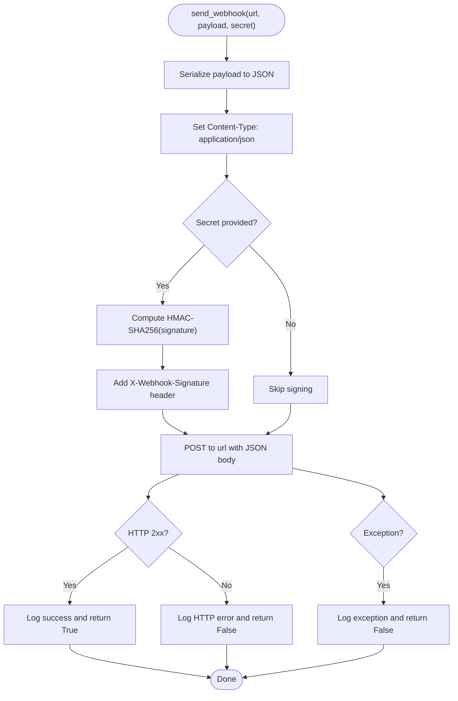
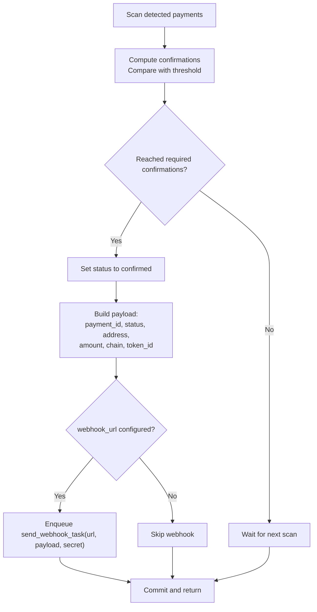

# Webhook Service

<cite>
**Referenced Files in This Document**
- [webhook.py](https://github.com/rakibhossain72/ctrip/blob/main/app/services/webhook.py)
- [webhook.py](https://github.com/rakibhossain72/ctrip/blob/main/app/workers/webhook.py)
- [scanner.py](https://github.com/rakibhossain72/ctrip/blob/main/app/services/blockchain/scanner.py)
- [sweeper.py](https://github.com/rakibhossain72/ctrip/blob/main/app/services/blockchain/sweeper.py)
- [config.py](https://github.com/rakibhossain72/ctrip/blob/main/app/core/config.py)
- [__init__.py](https://github.com/rakibhossain72/ctrip/blob/main/app/workers/__init__.py)
- [payments.py](https://github.com/rakibhossain72/ctrip/blob/main/app/api/v1/payments.py)
- [payment.py](https://github.com/rakibhossain72/ctrip/blob/main/app/db/models/payment.py)
- [payment.py](https://github.com/rakibhossain72/ctrip/blob/main/app/schemas/payment.py)
- [README.md](https://github.com/rakibhossain72/ctrip/blob/main/README.md)
</cite>

## Table of Contents
1. [Introduction](#introduction)
2. [Project Structure](#project-structure)
3. [Core Components](#core-components)
4. [Architecture Overview](#architecture-overview)
5. [Detailed Component Analysis](#detailed-component-analysis)
6. [Dependency Analysis](#dependency-analysis)
7. [Performance Considerations](#performance-considerations)
8. [Troubleshooting Guide](#troubleshooting-guide)
9. [Conclusion](#conclusion)
10. [Appendices](#appendices)

## Introduction
This document describes the Webhook Service that notifies external systems about payment status changes. It covers the webhook delivery mechanism, payload formatting, HMAC signature verification, integration with Dramatiq workers for asynchronous processing, retry behavior, configuration of webhook URLs and secrets, and payload validation. It also documents supported events, error handling strategies, and operational guidance for testing and security.

## Project Structure
The webhook capability spans several modules:
- Service layer for outbound webhook delivery
- Dramatiq actor for asynchronous processing
- Blockchain scanner that triggers webhooks upon payment confirmation
- Configuration for webhook URL and secret
- Worker broker initialization for Dramatiq

```mermaid
graph TB
subgraph "Configuration"
CFG["Settings<br/>webhook_url, webhook_secret"]
end
subgraph "Workers"
BROKER["Dramatiq Broker<br/>Redis"]
ACTOR["Actor send_webhook_task"]
end
subgraph "Services"
SVC["WebhookService<br/>send_webhook"]
SCN["ScannerService<br/>confirm_payments"]
end
subgraph "External"
ENDPT["Webhook Endpoint"]
end
CFG --> ACTOR
BROKER <- --> ACTOR
SCN --> ACTOR
ACTOR --> SVC
SVC --> ENDPT
```

**Diagram sources**
- [config.py](https://github.com/rakibhossain72/ctrip/blob/main/app/core/config.py#L63-L71)
- [__init__.py](https://github.com/rakibhossain72/ctrip/blob/main/app/workers/__init__.py#L1-L8)
- [webhook.py](https://github.com/rakibhossain72/ctrip/blob/main/app/workers/webhook.py#L13-L36)
- [webhook.py](https://github.com/rakibhossain72/ctrip/blob/main/app/services/webhook.py#L10-L44)
- [scanner.py](https://github.com/rakibhossain72/ctrip/blob/main/app/services/blockchain/scanner.py#L97-L133)

**Section sources**
- [config.py](https://github.com/rakibhossain72/ctrip/blob/main/app/core/config.py#L63-L71)
- [__init__.py](https://github.com/rakibhossain72/ctrip/blob/main/app/workers/__init__.py#L1-L8)
- [webhook.py](https://github.com/rakibhossain72/ctrip/blob/main/app/workers/webhook.py#L13-L36)
- [webhook.py](https://github.com/rakibhossain72/ctrip/blob/main/app/services/webhook.py#L10-L44)
- [scanner.py](https://github.com/rakibhossain72/ctrip/blob/main/app/services/blockchain/scanner.py#L97-L133)

## Core Components
- WebhookService: Asynchronous HTTP client that sends JSON payloads and optional HMAC signatures.
- Dramatiq Actor: Background task that invokes WebhookService and leverages built-in retries.
- ScannerService: Detects and confirms payments; emits webhooks when a payment reaches the confirmed state.
- Configuration: Provides webhook URL and secret for signing.

Key responsibilities:
- Delivery: Async HTTP POST with JSON body and optional X-Webhook-Signature header.
- Signing: HMAC-SHA256 over the JSON payload using the configured secret.
- Retry: Dramatiq actor configured with a fixed number of retries.
- Trigger: Webhook emission occurs when a payment transitions to confirmed.

**Section sources**
- [webhook.py](https://github.com/rakibhossain72/ctrip/blob/main/app/services/webhook.py#L10-L44)
- [webhook.py](https://github.com/rakibhossain72/ctrip/blob/main/app/workers/webhook.py#L13-L36)
- [scanner.py](https://github.com/rakibhossain72/ctrip/blob/main/app/services/blockchain/scanner.py#L97-L133)
- [config.py](https://github.com/rakibhossain72/ctrip/blob/main/app/core/config.py#L63-L71)

## Architecture Overview
The webhook pipeline integrates blockchain scanning, internal state transitions, and asynchronous delivery via Dramatiq.

```mermaid
sequenceDiagram
participant Scanner as "ScannerService"
participant DB as "Database"
participant Actor as "Dramatiq Actor"
participant Service as "WebhookService"
participant Endpoint as "External Webhook Endpoint"
Scanner->>DB : "Update payment status to confirmed"
Scanner->>Actor : "send_webhook_task(url, payload, secret)"
Actor->>Service : "send_webhook(url, payload, secret)"
Service->>Endpoint : "POST JSON body<br/>Header : X-Webhook-Signature (optional)"
Endpoint-->>Service : "HTTP 2xx"
Service-->>Actor : "Success"
Actor-->>Scanner : "Task processed"
```

**Diagram sources**
- [scanner.py](https://github.com/rakibhossain72/ctrip/blob/main/app/services/blockchain/scanner.py#L97-L133)
- [webhook.py](https://github.com/rakibhossain72/ctrip/blob/main/app/workers/webhook.py#L13-L36)
- [webhook.py](https://github.com/rakibhossain72/ctrip/blob/main/app/services/webhook.py#L10-L44)

## Detailed Component Analysis

### WebhookService
Responsibilities:
- Serialize payload to JSON.
- Optionally compute HMAC-SHA256 signature and attach X-Webhook-Signature header.
- Perform async HTTP POST with a timeout.
- Log successes and failures.

Behavior:
- On HTTP status errors, logs the status code.
- On exceptions, logs the error and returns failure.



**Diagram sources**
- [webhook.py](https://github.com/rakibhossain72/ctrip/blob/main/app/services/webhook.py#L10-L44)

**Section sources**
- [webhook.py](https://github.com/rakibhossain72/ctrip/blob/main/app/services/webhook.py#L10-L44)

### Dramatiq Actor: send_webhook_task
Responsibilities:
- Wrap async operation in a synchronous actor loop.
- Invoke WebhookService and raise on failure to trigger Dramatiq retries.
- Log actor-level errors and re-raise to allow broker retry policy.

Notes:
- Actor is configured with a fixed number of retries.
- The actor sets up an event loop for async operations.

```mermaid
sequenceDiagram
participant Broker as "Dramatiq Broker"
participant Actor as "send_webhook_task"
participant Loop as "Event Loop"
participant Service as "WebhookService"
Broker->>Actor : "Invoke with (url, payload, secret)"
Actor->>Loop : "run_until_complete(run())"
Actor->>Service : "send_webhook(url, payload, secret)"
alt Success
Service-->>Actor : "True"
Actor-->>Broker : "Acknowledge"
else Failure
Service-->>Actor : "False"
Actor->>Actor : "Raise Exception"
Actor-->>Broker : "Retry per policy"
end
```

**Diagram sources**
- [webhook.py](https://github.com/rakibhossain72/ctrip/blob/main/app/workers/webhook.py#L13-L36)
- [webhook.py](https://github.com/rakibhossain72/ctrip/blob/main/app/services/webhook.py#L10-L44)

**Section sources**
- [webhook.py](https://github.com/rakibhossain72/ctrip/blob/main/app/workers/webhook.py#L13-L36)

### Webhook Triggering: ScannerService.confirm_payments
Responsibilities:
- Transition payments to confirmed after sufficient confirmations.
- Build a standardized payload for the webhook.
- Enqueue the Dramatiq task with configured URL and secret.

Payload fields emitted:
- payment_id
- status
- address
- amount
- chain
- token_id (optional)



**Diagram sources**
- [scanner.py](https://github.com/rakibhossain72/ctrip/blob/main/app/services/blockchain/scanner.py#L97-L133)
- [config.py](https://github.com/rakibhossain72/ctrip/blob/main/app/core/config.py#L63-L71)

**Section sources**
- [scanner.py](https://github.com/rakibhossain72/ctrip/blob/main/app/services/blockchain/scanner.py#L97-L133)
- [config.py](https://github.com/rakibhossain72/ctrip/blob/main/app/core/config.py#L63-L71)

### Payload Validation and Supported Events
Supported event type:
- payment.confirmed

Payload fields:
- payment_id: UUID string
- status: "confirmed"
- address: destination address
- amount: numeric amount as string
- chain: blockchain identifier
- token_id: UUID string or null

Validation behavior:
- The service does not validate payload fields; it forwards whatever is provided to the actor.
- The actor and service do not enforce strict schema checks; downstream consumers should validate.

**Section sources**
- [scanner.py](https://github.com/rakibhossain72/ctrip/blob/main/app/services/blockchain/scanner.py#L117-L131)
- [payment.py](https://github.com/rakibhossain72/ctrip/blob/main/app/db/models/payment.py#L21-L38)

### Security Verification Using HMAC Signatures
Signature computation:
- HMAC-SHA256 over the JSON payload.
- Header: X-Webhook-Signature.

Verification steps (consumer-side):
- Recompute HMAC-SHA256 over the received JSON body using the shared secret.
- Compare the computed value with the header value.
- Reject if mismatch or header missing.

Notes:
- Signature is optional; if no secret is configured, no header is attached.
- Consumers must independently manage and protect the shared secret.

**Section sources**
- [webhook.py](https://github.com/rakibhossain72/ctrip/blob/main/app/services/webhook.py#L25-L31)
- [config.py](https://github.com/rakibhossain72/ctrip/blob/main/app/core/config.py#L68-L71)

### Webhook URL Configuration and Secret Management
Configuration keys:
- webhook_url: Global URL for payment notifications.
- webhook_secret: Secret used to sign payloads.

Environment and defaults:
- Values are loaded from settings; defaults are None.
- Production environments should override defaults via environment variables.

Operational guidance:
- Set webhook_url to the target endpoint.
- Set webhook_secret to a strong secret value.
- Keep secrets out of source control; use environment variables.

**Section sources**
- [config.py](https://github.com/rakibhossain72/ctrip/blob/main/app/core/config.py#L63-L71)

### Integration with Dramatiq Workers
Worker startup:
- Redis broker is initialized from settings.
- Workers are started with dramatiq CLI pointing to the webhook module.

Actor configuration:
- send_webhook_task is decorated with max_retries to enable automatic retries.

**Section sources**
- [__init__.py](https://github.com/rakibhossain72/ctrip/blob/main/app/workers/__init__.py#L1-L8)
- [webhook.py](https://github.com/rakibhossain72/ctrip/blob/main/app/workers/webhook.py#L13-L36)
- [README.md](https://github.com/rakibhossain72/ctrip/blob/main/README.md#L66-L69)

### Error Handling Strategies
- HTTP errors: Logged with status code; returns failure.
- Exceptions: Logged; returns failure.
- Actor-level failures: Raise to trigger Dramatiq retries.

Recommended improvements (not currently implemented):
- Exponential backoff with jitter for retries.
- Dead letter queue handling for persistent failures.
- Idempotency keys to prevent duplicate processing.

**Section sources**
- [webhook.py](https://github.com/rakibhossain72/ctrip/blob/main/app/services/webhook.py#L39-L44)
- [webhook.py](https://github.com/rakibhossain72/ctrip/blob/main/app/workers/webhook.py#L26-L30)

### Payload Formatting and Event Types
Event type:
- payment.confirmed

Payload fields:
- payment_id: string (UUID)
- status: "confirmed"
- address: string
- amount: string (numeric)
- chain: string
- token_id: string or null

Note:
- The current implementation emits only the confirmed event.
- Additional events (e.g., created, failed) are not emitted by the scanner.

**Section sources**
- [scanner.py](https://github.com/rakibhossain72/ctrip/blob/main/app/services/blockchain/scanner.py#L117-L131)
- [payment.py](https://github.com/rakibhossain72/ctrip/blob/main/app/db/models/payment.py#L21-L38)

### Webhook Endpoint Testing Procedures
Recommended testing steps:
- Use a local webhook receiver (e.g., ngrok) to capture requests.
- Verify JSON body and presence of X-Webhook-Signature when secret is set.
- Simulate network failures and timeouts to exercise retry behavior.
- Test signature verification using the same shared secret.

Operational tips:
- Start workers before generating payments to ensure timely delivery.
- Monitor logs for HTTP errors and actor exceptions.

**Section sources**
- [README.md](https://github.com/rakibhossain72/ctrip/blob/main/README.md#L66-L69)
- [webhook.py](https://github.com/rakibhossain72/ctrip/blob/main/app/services/webhook.py#L39-L44)

## Dependency Analysis
High-level dependencies:
- ScannerService depends on Settings for webhook configuration and enqueues the actor.
- Actor depends on WebhookService for delivery.
- WebhookService depends on httpx for HTTP operations.
- Dramatiq broker is initialized from settings and used by the actor.

```mermaid
graph LR
Settings["Settings<br/>webhook_url, webhook_secret"] --> Actor["send_webhook_task"]
Settings --> Scanner["ScannerService"]
Scanner --> Actor
Actor --> Service["WebhookService"]
Service --> HTTP["httpx.AsyncClient"]
Settings --> Broker["Dramatiq Redis Broker"]
Broker <- --> Actor
```

**Diagram sources**
- [config.py](https://github.com/rakibhossain72/ctrip/blob/main/app/core/config.py#L63-L71)
- [scanner.py](https://github.com/rakibhossain72/ctrip/blob/main/app/services/blockchain/scanner.py#L97-L133)
- [webhook.py](https://github.com/rakibhossain72/ctrip/blob/main/app/workers/webhook.py#L13-L36)
- [webhook.py](https://github.com/rakibhossain72/ctrip/blob/main/app/services/webhook.py#L10-L44)
- [__init__.py](https://github.com/rakibhossain72/ctrip/blob/main/app/workers/__init__.py#L1-L8)

**Section sources**
- [config.py](https://github.com/rakibhossain72/ctrip/blob/main/app/core/config.py#L63-L71)
- [scanner.py](https://github.com/rakibhossain72/ctrip/blob/main/app/services/blockchain/scanner.py#L97-L133)
- [webhook.py](https://github.com/rakibhossain72/ctrip/blob/main/app/workers/webhook.py#L13-L36)
- [webhook.py](https://github.com/rakibhossain72/ctrip/blob/main/app/services/webhook.py#L10-L44)
- [__init__.py](https://github.com/rakibhossain72/ctrip/blob/main/app/workers/__init__.py#L1-L8)

## Performance Considerations
- Async HTTP client reduces blocking overhead.
- Fixed retry count in actor limits resource consumption on repeated failures.
- Consider adding exponential backoff and jitter to reduce thundering herd effects.
- Tune broker and worker concurrency based on traffic volume.

[No sources needed since this section provides general guidance]

## Troubleshooting Guide
Common issues and resolutions:
- Webhook delivery fails with HTTP error:
  - Check endpoint availability and response codes.
  - Review service logs for detailed error messages.
- Signature verification fails:
  - Ensure the consumer uses the same shared secret.
  - Verify the header X-Webhook-Signature is present when secret is configured.
- Actor keeps retrying:
  - Confirm the actor’s max_retries setting.
  - Investigate persistent failures and adjust policies.
- No webhooks emitted:
  - Verify webhook_url is configured.
  - Ensure payments reach the confirmed state.

**Section sources**
- [webhook.py](https://github.com/rakibhossain72/ctrip/blob/main/app/services/webhook.py#L39-L44)
- [webhook.py](https://github.com/rakibhossain72/ctrip/blob/main/app/workers/webhook.py#L26-L30)
- [config.py](https://github.com/rakibhossain72/ctrip/blob/main/app/core/config.py#L63-L71)

## Conclusion
The Webhook Service provides a focused, asynchronous notification mechanism for payment confirmations. It supports HMAC-signed payloads, integrates with Dramatiq for reliable delivery, and can be extended to support additional events and improved retry strategies. Proper configuration of webhook URL and secret, combined with consumer-side signature verification, ensures secure and reliable integrations.

[No sources needed since this section summarizes without analyzing specific files]

## Appendices

### Appendix A: Supported Events and Payloads
- Event: payment.confirmed
  - Fields: payment_id, status, address, amount, chain, token_id (optional)

**Section sources**
- [scanner.py](https://github.com/rakibhossain72/ctrip/blob/main/app/services/blockchain/scanner.py#L117-L131)
- [payment.py](https://github.com/rakibhossain72/ctrip/blob/main/app/db/models/payment.py#L21-L38)

### Appendix B: Configuration Reference
- webhook_url: Target endpoint URL for webhooks.
- webhook_secret: Shared secret for HMAC signing.

**Section sources**
- [config.py](https://github.com/rakibhossain72/ctrip/blob/main/app/core/config.py#L63-L71)

### Appendix C: Worker Startup and Commands
- Start workers using the dramatiq command with the webhook module.

**Section sources**
- [README.md](https://github.com/rakibhossain72/ctrip/blob/main/README.md#L66-L69)