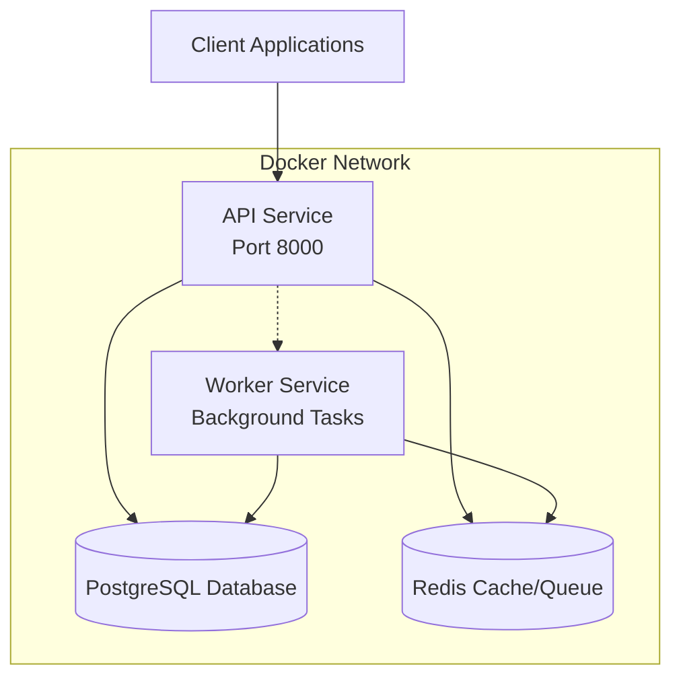

# Getting Started

<cite>
**Referenced Files in This Document**
- [README.md](file://README.md)
- [docker-compose.yml](file://docker-compose.yml)
- [Dockerfile](file://Dockerfile)
- [chains.yaml](file://chains.yaml)
- [requirements.txt](file://requirements.txt)
- [pyproject.toml](file://pyproject.toml)
- [app/core/config.py](file://app/core/config.py)
- [server.py](file://server.py)
- [migrate.py](file://migrate.py)
- [app/db/engine.py](file://app/db/engine.py)
- [app/blockchain/manager.py](file://app/blockchain/manager.py)
- [app/utils/crypto.py](file://app/utils/crypto.py)
- [app/workers/__init__.py](file://app/workers/__init__.py)
- [app/api/health.py](file://app/api/health.py)
- [app/api/v1/payments.py](file://app/api/v1/payments.py)
</cite>

## Table of Contents
1. [Introduction](#introduction)
2. [Prerequisites](#prerequisites)
3. [Quick Start](#quick-start)
4. [Environment Configuration](#environment-configuration)
5. [Chains Configuration](#chains-configuration)
6. [HD Wallet Mnemonic](#hd-wallet-mnemonic)
7. [Installation Methods](#installation-methods)
8. [Verification Steps](#verification-steps)
9. [Troubleshooting Guide](#troubleshooting-guide)
10. [Conclusion](#conclusion)

## Introduction
cTrip Payment Gateway is a high-performance, multi-chain cryptocurrency payment gateway built with FastAPI. It supports automated payment detection, confirmation monitoring, and funds sweeping across multiple EVM-compatible blockchains. The system uses an asynchronous architecture with PostgreSQL/SQLite for persistence, Redis for background task processing via Dramatiq, and Web3.py for blockchain interactions.

Key capabilities include:
- Multi-chain support for BSC, Ethereum, and local testing environments
- Real-time blockchain scanning for incoming payments
- Asynchronous API and database operations
- Background workers for distributed task processing
- HD Wallet integration for secure address management
- Webhook notifications for payment status changes
- Robust database migration system using Alembic

## Prerequisites
Before installing cTrip Payment Gateway, ensure you have the following prerequisites:

- Python 3.10 or higher
- Docker and Docker Compose for containerized deployment
- Redis for background worker messaging
- PostgreSQL for production database storage

These requirements are essential for both Docker deployment and local development setups. The project includes comprehensive configuration for both environments.

**Section sources**
- [README.md](file://README.md#L24-L30)
- [requirements.txt](file://requirements.txt#L1-L106)
- [pyproject.toml](file://pyproject.toml#L10-L32)

## Quick Start
Choose one of the two recommended installation approaches:

### Option A: Docker Deployment (Recommended)
The fastest way to get started is using Docker Compose, which provisions all required services automatically:

```bash
docker-compose up --build
```

This single command starts:
- PostgreSQL database service
- Redis cache/queue service  
- Application API service
- Background worker service

### Option B: Local Development Setup
For development, follow these steps:

1. **Create and activate virtual environment:**
   ```bash
   python -m venv venv
   source venv/bin/activate  # On Windows use: venv\Scripts\activate
   ```

2. **Install dependencies:**
   ```bash
   pip install -r requirements.txt
   ```

3. **Run database migrations:**
   ```bash
   python migrate.py upgrade
   ```

4. **Start the API server:**
   ```bash
   uvicorn server:app --reload
   ```

5. **Start background workers:**
   ```bash
   dramatiq app.workers.listener app.workers.sweeper app.workers.webhook
   ```

**Section sources**
- [README.md](file://README.md#L37-L70)
- [docker-compose.yml](file://docker-compose.yml#L1-L54)
- [Dockerfile](file://Dockerfile#L1-L33)

## Environment Configuration
The application uses environment-based configuration managed through Pydantic Settings. Configuration is loaded from a `.env` file located at the project root.

### Required Environment Variables
Set these variables in your `.env` file:

- `DATABASE_URL` - Production database connection string
- `DATABASE_URL_DEV` - Development database connection string (defaults to SQLite)
- `REDIS_URL` - Redis connection URL for background tasks
- `RPC_URL` - Ethereum RPC endpoint URL
- `PRIVATE_KEY` - Ethereum private key for wallet operations
- `MNEMONIC` - HD Wallet mnemonic phrase (defaults to test phrase)
- `WEBHOOK_URL` - Global webhook URL for payment notifications
- `WEBHOOK_SECRET` - Secret key for signing webhook payloads
- `SECRET_KEY` - Application secret key for cryptography

### Environment-Specific Settings
The application supports three environments:
- `development` - Uses SQLite by default
- `production` - Requires explicit database URL configuration
- `testing` - For test suite execution

### Configuration Loading
Configuration is loaded from the `.env` file with automatic validation and type conversion. The system validates Ethereum private keys and enforces production security requirements.

**Section sources**
- [app/core/config.py](file://app/core/config.py#L10-L126)
- [server.py](file://server.py#L18-L47)

## Chains Configuration
Configure supported blockchain networks in `chains.yaml`. This file defines RPC endpoints and token configurations for each chain.

### Supported Chains
The system currently supports:
- **BSC (Binance Smart Chain)** - Mainnet RPC endpoint with USDT token
- **Ethereum** - Placeholder for mainnet configuration
- **Anvil** - Local development/testing RPC endpoint

### Chain Configuration Format
Each chain requires:
- `name` - Chain identifier (ethereum, bsc, anvil)
- `rpc_url` - RPC endpoint URL
- `tokens` - Array of supported tokens with:
  - `symbol` - Token symbol
  - `address` - Contract address (for mainnet tokens)
  - `decimals` - Token decimal precision

### Default Configuration
The default configuration includes BSC mainnet with USDT token and Anvil local testing network. Remove comments to enable additional chains.

**Section sources**
- [chains.yaml](file://chains.yaml#L1-L24)
- [app/blockchain/manager.py](file://app/blockchain/manager.py#L8-L33)
- [app/core/config.py](file://app/core/config.py#L44-L56)

## HD Wallet Mnemonic
The system uses Hierarchical Deterministic (HD) Wallets for secure address generation following BIP-44 standards.

### Mnemonic Configuration
- **Default**: Test mnemonic phrase included for development
- **Production**: Replace with your secure mnemonic phrase
- **Security**: Never commit mnemonics to version control

### Address Derivation
Addresses are derived using the path: `m/44'/60'/0'/0/{index}` where index corresponds to payment identifiers.

### Wallet Management
The HDWalletManager class provides:
- Mnemonic phrase validation and generation
- Sequential address derivation
- Private key derivation for fund management
- Batch address generation for multiple payments

### Security Best Practices
- Use strong, random mnemonics in production
- Store mnemonics in secure environment variables
- Rotate keys periodically
- Limit mnemonic exposure in logs and error messages

**Section sources**
- [app/utils/crypto.py](file://app/utils/crypto.py#L5-L67)
- [app/core/config.py](file://app/core/config.py#L58-L61)

## Installation Methods

### Docker Deployment (Recommended)
The Docker-based installation provides a complete, isolated environment with all dependencies pre-configured.

#### Prerequisites
- Docker Engine 20.10+ installed
- Docker Compose v2+ installed
- Port 8000 (API), 5432 (PostgreSQL), and 6379 (Redis) available

#### Build and Run
```bash
# Clone repository and navigate to project directory
git clone <repository-url>
cd ctrip

# Start all services
docker-compose up --build
```

#### Service Architecture


**Diagram sources**
- [docker-compose.yml](file://docker-compose.yml#L3-L54)

#### Container Configuration
- **App Service**: Builds from Dockerfile, exposes port 8000, mounts code volume
- **Worker Service**: Runs Dramatiq workers for background processing
- **Database Service**: PostgreSQL 15 with persistent volume storage
- **Cache Service**: Redis 7 for task queue and caching

**Section sources**
- [docker-compose.yml](file://docker-compose.yml#L1-L54)
- [Dockerfile](file://Dockerfile#L1-L33)

### Local Development Setup
For development and testing, set up the environment locally with Python dependencies.

#### Step-by-Step Installation
1. **Python Environment**
   ```bash
   # Create virtual environment
   python -m venv venv
   
   # Activate environment
   source venv/bin/activate  # Linux/Mac
   # venv\Scripts\activate    # Windows
   
   # Install dependencies
   pip install -r requirements.txt
   ```

2. **Database Setup**
   - **Development**: SQLite database file (auto-created)
   - **Production**: PostgreSQL server with configured credentials

3. **Configuration**
   - Create `.env` file from template
   - Configure chains in `chains.yaml`
   - Set HD wallet mnemonic and private key

4. **Migration Execution**
   ```bash
   # Apply database migrations
   python migrate.py upgrade
   
   # Verify migration status
   python migrate.py current
   ```

5. **Service Startup**
   ```bash
   # Start API server
   uvicorn server:app --reload
   
   # Start background workers
   dramatiq app.workers.listener app.workers.sweeper app.workers.webhook
   ```

**Section sources**
- [README.md](file://README.md#L47-L70)
- [requirements.txt](file://requirements.txt#L1-L106)
- [migrate.py](file://migrate.py#L1-L112)

## Verification Steps
After installation, verify the system is functioning correctly using these steps:

### Health Check
Test the health endpoint to ensure the API is responsive:
```bash
curl http://localhost:8000/health
```

Expected response: `{"status": "ok"}`

### Database Connectivity
Verify database connectivity and migration status:
```bash
python migrate.py current
```

### Chain Configuration Validation
Check that configured chains are properly loaded:
```bash
# Start Python interpreter
python

# Test chain loading
from app.core.config import settings
print(settings.chains)
```

### Background Worker Status
Verify background workers are processing tasks:
```bash
# Check Redis for queued tasks
redis-cli ping
# Should return: PONG

# Monitor Dramatiq worker logs
dramatiq app.workers.listener app.workers.sweeper app.workers.webhook
```

### Basic API Functionality
Test payment creation endpoint:
```bash
curl -X POST "http://localhost:8000/api/v1/payments/" \
  -H "Content-Type: application/json" \
  -d '{
    "chain": "bsc",
    "amount": "1000000000000000000",
    "token_id": null
  }'
```

### Docker Environment Verification
For Docker deployments, verify all containers are healthy:
```bash
docker-compose ps
```

Expected status: All services should show "Up" status

**Section sources**
- [app/api/health.py](file://app/api/health.py#L1-L7)
- [app/api/v1/payments.py](file://app/api/v1/payments.py#L1-L62)
- [migrate.py](file://migrate.py#L50-L57)

## Troubleshooting Guide

### Common Installation Issues

#### Docker Build Failures
**Problem**: Docker build fails during dependency installation
**Solution**: 
- Clear Docker build cache: `docker builder prune --all`
- Increase Docker memory allocation
- Check internet connectivity for package downloads

#### Port Conflicts
**Problem**: Ports 8000, 5432, or 6379 already in use
**Solution**:
```bash
# Find processes using ports
lsof -i :8000
lsof -i :5432  
lsof -i :6379

# Kill conflicting processes or change ports in docker-compose.yml
```

#### Database Connection Errors
**Problem**: Cannot connect to PostgreSQL
**Solution**:
- Verify PostgreSQL service is running: `docker-compose up db`
- Check database credentials in `.env` file
- Ensure database volume permissions are correct

#### Redis Connection Issues
**Problem**: Background workers cannot connect to Redis
**Solution**:
- Verify Redis service health: `docker-compose up redis`
- Check Redis URL format in environment variables
- Ensure firewall allows connections on port 6379

#### Migration Failures
**Problem**: Database migrations fail or hang
**Solution**:
```bash
# Reset migrations (use with caution - backup database first)
python migrate.py downgrade -1
python migrate.py upgrade

# Check migration history
python migrate.py history
```

#### Chain Configuration Problems
**Problem**: Unsupported chain or RPC errors
**Solution**:
- Verify chain names match exactly: "ethereum", "bsc", "anvil"
- Test RPC endpoint connectivity manually
- Check token contract addresses for correct chain

#### HD Wallet Issues
**Problem**: Invalid mnemonic or address derivation failures
**Solution**:
- Use valid 12-word mnemonic phrases
- Verify private key format matches Ethereum standards
- Check mnemonic encoding in environment variables

### Development Environment Issues

#### Python Dependency Conflicts
**Problem**: Import errors or missing modules
**Solution**:
```bash
# Clean virtual environment
deactivate
rm -rf venv
python -m venv venv
source venv/bin/activate

# Reinstall dependencies
pip install --upgrade pip
pip install -r requirements.txt
```

#### Alembic Configuration Problems
**Problem**: Alembic cannot find database configuration
**Solution**:
- Verify `alembic.ini` and `alembic/env.py` are present
- Check database URL format in environment variables
- Ensure `DATABASE_URL` is exported to environment

#### Uvicorn Reload Issues
**Problem**: Hot reload not working or frequent restarts
**Solution**:
- Check for syntax errors in Python files
- Verify file permissions in mounted volumes
- Disable auto-reload during debugging: `uvicorn server:app`

### Production Deployment Considerations

#### Security Hardening
- Change default secret keys immediately
- Use HTTPS termination in front of API
- Implement rate limiting and input validation
- Regular security audits of dependencies

#### Performance Optimization
- Scale Redis and PostgreSQL instances
- Implement connection pooling
- Monitor database query performance
- Use appropriate hardware resources

#### Monitoring and Logging
- Set up centralized logging
- Implement health checks and alerts
- Monitor background worker queues
- Track API response times and error rates

**Section sources**
- [docker-compose.yml](file://docker-compose.yml#L1-L54)
- [app/core/config.py](file://app/core/config.py#L94-L112)
- [migrate.py](file://migrate.py#L22-L27)

## Conclusion
cTrip Payment Gateway provides a robust foundation for building multi-chain cryptocurrency payment solutions. The recommended Docker deployment approach ensures consistent environments and simplified dependency management. For development, the local setup offers flexibility and debugging capabilities.

Key success factors:
- Proper environment configuration with secure secrets
- Correct chain configuration for target networks
- HD wallet security best practices
- Comprehensive testing and monitoring setup

The modular architecture supports easy extension for additional blockchain networks and payment features. Regular maintenance includes dependency updates, database migrations, and security audits to ensure long-term reliability and security.