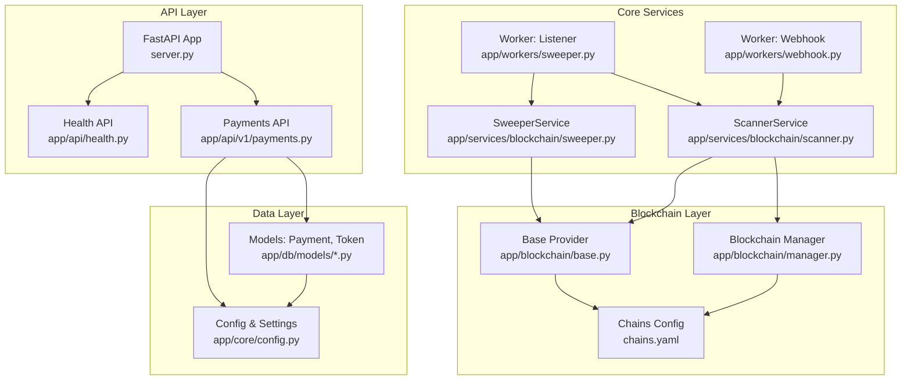
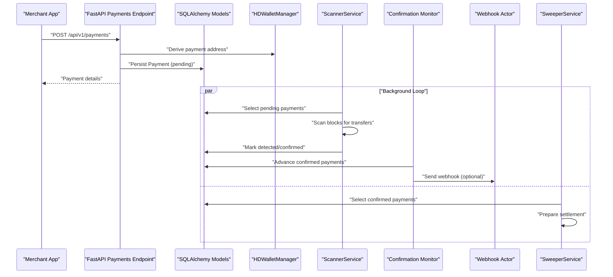
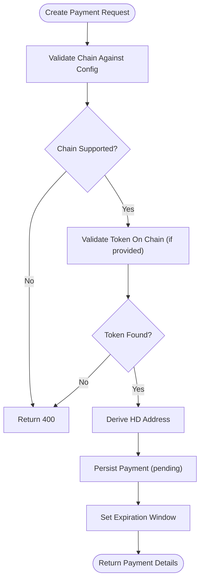
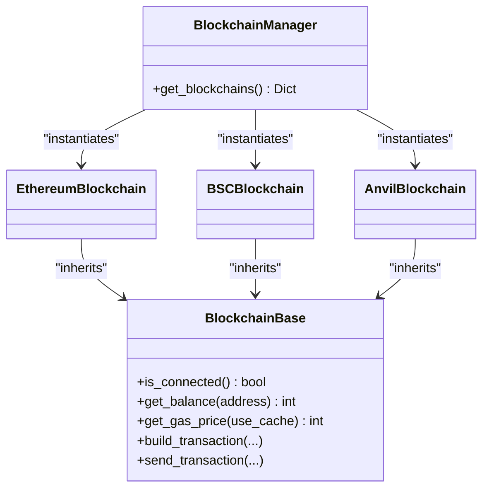
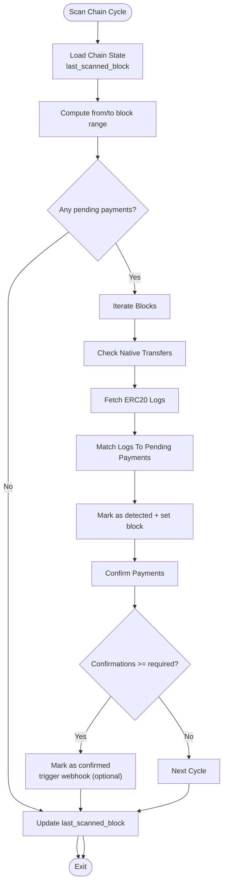
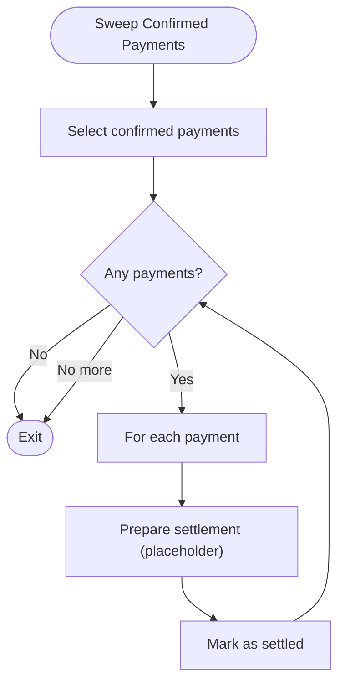
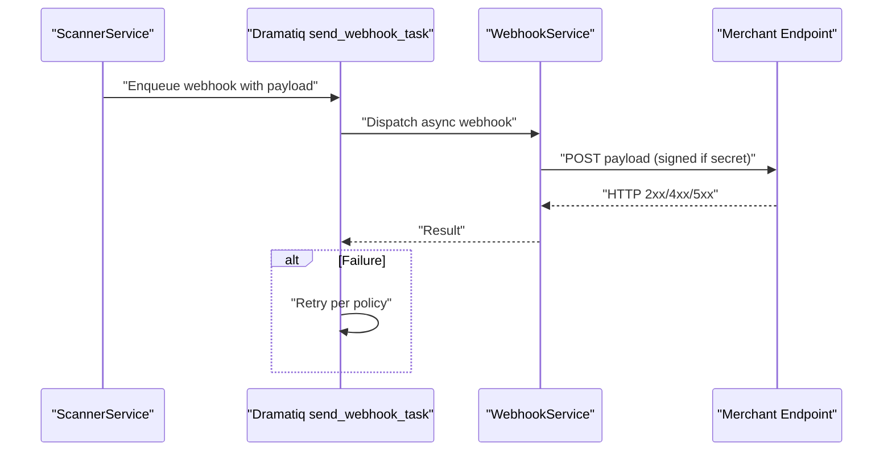
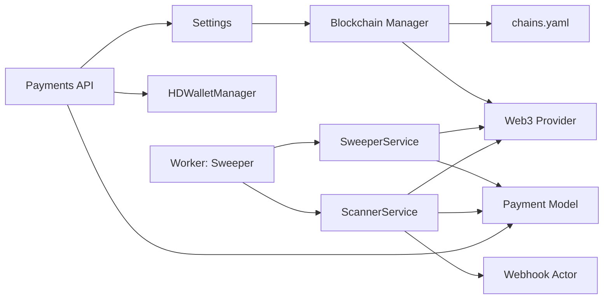

# Introduction and Purpose

<cite>
**Referenced Files in This Document**
- [README.md](https://github.com/rakibhossain72/ctrip/blob/main/README.md)
- [server.py](https://github.com/rakibhossain72/ctrip/blob/main/server.py)
- [app/api/v1/payments.py](https://github.com/rakibhossain72/ctrip/blob/main/app/api/v1/payments.py)
- [app/blockchain/manager.py](https://github.com/rakibhossain72/ctrip/blob/main/app/blockchain/manager.py)
- [app/services/blockchain/scanner.py](https://github.com/rakibhossain72/ctrip/blob/main/app/services/blockchain/scanner.py)
- [app/db/models/payment.py](https://github.com/rakibhossain72/ctrip/blob/main/app/db/models/payment.py)
- [app/utils/crypto.py](https://github.com/rakibhossain72/ctrip/blob/main/app/utils/crypto.py)
- [app/core/config.py](https://github.com/rakibhossain72/ctrip/blob/main/app/core/config.py)
- [app/workers/sweeper.py](https://github.com/rakibhossain72/ctrip/blob/main/app/workers/sweeper.py)
- [app/blockchain/base.py](https://github.com/rakibhossain72/ctrip/blob/main/app/blockchain/base.py)
- [chains.yaml](https://github.com/rakibhossain72/ctrip/blob/main/chains.yaml)
- [app/workers/webhook.py](https://github.com/rakibhossain72/ctrip/blob/main/app/workers/webhook.py)
- [app/api/health.py](https://github.com/rakibhossain72/ctrip/blob/main/app/api/health.py)
- [app/db/models/token.py](https://github.com/rakibhossain72/ctrip/blob/main/app/db/models/token.py)
</cite>

## Table of Contents
1. [Introduction](#introduction)
2. [Project Structure](#project-structure)
3. [Core Components](#core-components)
4. [Architecture Overview](#architecture-overview)
5. [Detailed Component Analysis](#detailed-component-analysis)
6. [Dependency Analysis](#dependency-analysis)
7. [Performance Considerations](#performance-considerations)
8. [Troubleshooting Guide](#troubleshooting-guide)
9. [Conclusion](#conclusion)

## Introduction
cTrip is a high-performance, multi-chain cryptocurrency payment gateway designed to simplify and accelerate crypto payments for merchants and developers. Its core value proposition lies in enabling seamless, real-time detection of incoming payments across multiple EVM-compatible blockchains, combined with automated confirmation monitoring and secure fund management. By abstracting the complexities of multi-chain support, cTrip lets businesses accept digital payments reliably without deep blockchain engineering expertise.

Key problems cTrip solves in the cryptocurrency payment space:
- Multi-chain support: Accept payments across Ethereum, BSC, and local development networks with a unified interface.
- Real-time payment detection: Continuously scan blocks to detect incoming native and token payments to merchant addresses.
- Automated fund management: Confirm payments based on block confirmations and prepare funds for settlement, with hooks for webhook notifications and future sweeping logic.

Target audience:
- E-commerce platforms integrating crypto payments
- Crypto exchanges needing robust on-ramp/off-ramp infrastructure
- Blockchain-based applications requiring automated, trustless payment processing

Mission statement:
cTrip aims to lower the barrier to adopting cryptocurrency payments by providing a developer-friendly, production-grade platform that handles the heavy lifting of blockchain integration, real-time detection, and secure fund management—so teams can focus on building their core product.

Differentiators:
- Native multi-chain support with a single configuration model
- Asynchronous, scalable architecture using FastAPI, SQLAlchemy 2.0, and Dramatiq
- HD wallet-backed address generation for secure, deterministic payment addresses
- Built-in confirmation monitoring and webhook-driven automation
- Extensible base class for blockchain providers and pluggable chain implementations

Positioning:
cTrip occupies the middle layer of the crypto stack—between merchant integrations and blockchain nodes—offering a pragmatic balance of performance, reliability, and flexibility for modern crypto-enabled businesses.

## Project Structure
The repository follows a clean, feature-oriented layout:
- app/api/: REST endpoints for payment creation and health checks
- app/blockchain/: Multi-chain implementations and base Web3 utilities
- app/db/: SQLAlchemy models, sessions, and migrations
- app/services/: Business logic for scanning and sweeping
- app/workers/: Dramatiq actors orchestrating background tasks
- app/utils/: Cryptographic helpers (HD wallet)
- app/core/: Application settings and configuration
- Root configs: chains.yaml, Docker, migrations, and server entrypoint

**Diagram sources**
- [server.py](https://github.com/rakibhossain72/ctrip/blob/main/server.py#L21-L47)
- [app/api/v1/payments.py](https://github.com/rakibhossain72/ctrip/blob/main/app/api/v1/payments.py#L12-L54)
- [app/services/blockchain/scanner.py](https://github.com/rakibhossain72/ctrip/blob/main/app/services/blockchain/scanner.py#L14-L95)
- [app/services/blockchain/sweeper.py](https://github.com/rakibhossain72/ctrip/blob/main/app/services/blockchain/sweeper.py#L11-L53)
- [app/workers/sweeper.py](https://github.com/rakibhossain72/ctrip/blob/main/app/workers/sweeper.py#L19-L40)
- [app/workers/webhook.py](https://github.com/rakibhossain72/ctrip/blob/main/app/workers/webhook.py#L13-L36)
- [app/blockchain/manager.py](https://github.com/rakibhossain72/ctrip/blob/main/app/blockchain/manager.py#L8-L32)
- [app/blockchain/base.py](https://github.com/rakibhossain72/ctrip/blob/main/app/blockchain/base.py#L22-L145)
- [chains.yaml](https://github.com/rakibhossain72/ctrip/blob/main/chains.yaml#L1-L24)
- [app/db/models/payment.py](https://github.com/rakibhossain72/ctrip/blob/main/app/db/models/payment.py#L41-L57)
- [app/db/models/token.py](https://github.com/rakibhossain72/ctrip/blob/main/app/db/models/token.py#L6-L14)
- [app/core/config.py](https://github.com/rakibhossain72/ctrip/blob/main/app/core/config.py#L10-L122)

**Section sources**
- [README.md](https://github.com/rakibhossain72/ctrip/blob/main/README.md#L71-L78)
- [server.py](https://github.com/rakibhossain72/ctrip/blob/main/server.py#L21-L47)

## Core Components
- Multi-chain configuration and discovery: Loads supported chains from configuration and instantiates appropriate blockchain providers.
- Payment creation: Generates unique payment addresses using an HD wallet and persists payment metadata with expiry and chain/token context.
- Real-time scanning: Scans recent blocks for native and ERC20 transfers to known payment addresses, marking detections and confirmations.
- Confirmation monitoring: Advances payments to confirmed state after sufficient block confirmations and triggers optional webhooks.
- Fund sweeping: Prepares confirmed payments for settlement; placeholder logic indicates future integration with private key management and transaction broadcasting.
- Background workers: Dramatiq actors schedule continuous scanning and sweeping loops with retry and delay mechanisms.
- Webhook delivery: Asynchronously dispatches payment status updates to merchant endpoints with optional signature verification.

**Section sources**
- [app/blockchain/manager.py](https://github.com/rakibhossain72/ctrip/blob/main/app/blockchain/manager.py#L8-L32)
- [app/api/v1/payments.py](https://github.com/rakibhossain72/ctrip/blob/main/app/api/v1/payments.py#L18-L54)
- [app/services/blockchain/scanner.py](https://github.com/rakibhossain72/ctrip/blob/main/app/services/blockchain/scanner.py#L20-L95)
- [app/services/blockchain/sweeper.py](https://github.com/rakibhossain72/ctrip/blob/main/app/services/blockchain/sweeper.py#L16-L53)
- [app/workers/sweeper.py](https://github.com/rakibhossain72/ctrip/blob/main/app/workers/sweeper.py#L19-L40)
- [app/workers/webhook.py](https://github.com/rakibhossain72/ctrip/blob/main/app/workers/webhook.py#L13-L36)
- [app/utils/crypto.py](https://github.com/rakibhossain72/ctrip/blob/main/app/utils/crypto.py#L5-L66)
- [app/core/config.py](https://github.com/rakibhossain72/ctrip/blob/main/app/core/config.py#L58-L71)

## Architecture Overview
cTrip’s runtime architecture integrates API requests, background workers, blockchain scanning, and settlement logic across multiple chains. The system initializes blockchain providers and HD wallet at startup, exposes REST endpoints for payment creation, and runs continuous background tasks to detect, confirm, and settle payments.

**Diagram sources**
- [app/api/v1/payments.py](https://github.com/rakibhossain72/ctrip/blob/main/app/api/v1/payments.py#L18-L54)
- [app/utils/crypto.py](https://github.com/rakibhossain72/ctrip/blob/main/app/utils/crypto.py#L27-L46)
- [app/services/blockchain/scanner.py](https://github.com/rakibhossain72/ctrip/blob/main/app/services/blockchain/scanner.py#L20-L95)
- [app/services/blockchain/scanner.py](https://github.com/rakibhossain72/ctrip/blob/main/app/services/blockchain/scanner.py#L97-L133)
- [app/workers/webhook.py](https://github.com/rakibhossain72/ctrip/blob/main/app/workers/webhook.py#L14-L36)
- [app/services/blockchain/sweeper.py](https://github.com/rakibhossain72/ctrip/blob/main/app/services/blockchain/sweeper.py#L16-L53)

## Detailed Component Analysis

### Payment Creation Workflow
- Validates requested chain against configured chains
- Optionally validates token presence on the selected chain
- Derives a unique payment address from the HD wallet
- Sets an expiration window and persists the record
- Returns the created payment resource

**Diagram sources**
- [app/api/v1/payments.py](https://github.com/rakibhossain72/ctrip/blob/main/app/api/v1/payments.py#L25-L54)
- [app/utils/crypto.py](https://github.com/rakibhossain72/ctrip/blob/main/app/utils/crypto.py#L27-L46)
- [app/db/models/token.py](https://github.com/rakibhossain72/ctrip/blob/main/app/db/models/token.py#L6-L14)

**Section sources**
- [app/api/v1/payments.py](https://github.com/rakibhossain72/ctrip/blob/main/app/api/v1/payments.py#L18-L54)
- [app/utils/crypto.py](https://github.com/rakibhossain72/ctrip/blob/main/app/utils/crypto.py#L5-L66)
- [app/db/models/token.py](https://github.com/rakibhossain72/ctrip/blob/main/app/db/models/token.py#L6-L14)

### Multi-Chain Support and Discovery
- Reads chain configurations from a YAML file
- Instantiates provider-specific implementations per chain (e.g., Ethereum, BSC, Anvil)
- Falls back to a local development provider if none configured

**Diagram sources**
- [app/blockchain/manager.py](https://github.com/rakibhossain72/ctrip/blob/main/app/blockchain/manager.py#L8-L32)
- [app/blockchain/base.py](https://github.com/rakibhossain72/ctrip/blob/main/app/blockchain/base.py#L22-L145)

**Section sources**
- [app/blockchain/manager.py](https://github.com/rakibhossain72/ctrip/blob/main/app/blockchain/manager.py#L8-L32)
- [chains.yaml](https://github.com/rakibhossain72/ctrip/blob/main/chains.yaml#L1-L24)
- [app/blockchain/base.py](https://github.com/rakibhossain72/ctrip/blob/main/app/blockchain/base.py#L22-L145)

### Real-Time Payment Detection and Confirmation
- Scans a bounded range of blocks per cycle
- Detects native transfers and ERC20 events for pending payments
- Updates statuses to detected and later confirmed based on block confirmations
- Emits webhooks upon confirmation when configured

**Diagram sources**
- [app/services/blockchain/scanner.py](https://github.com/rakibhossain72/ctrip/blob/main/app/services/blockchain/scanner.py#L20-L95)
- [app/services/blockchain/scanner.py](https://github.com/rakibhossain72/ctrip/blob/main/app/services/blockchain/scanner.py#L97-L133)

**Section sources**
- [app/services/blockchain/scanner.py](https://github.com/rakibhossain72/ctrip/blob/main/app/services/blockchain/scanner.py#L14-L133)
- [app/db/models/payment.py](https://github.com/rakibhossain72/ctrip/blob/main/app/db/models/payment.py#L21-L38)

### Fund Sweeping and Settlement Preparation
- Selects confirmed payments eligible for settlement
- Prepares transactions to move funds to an administrative address
- Placeholder logic currently marks as settled; future versions will broadcast transactions using the configured private key

**Diagram sources**
- [app/services/blockchain/sweeper.py](https://github.com/rakibhossain72/ctrip/blob/main/app/services/blockchain/sweeper.py#L16-L53)
- [app/workers/sweeper.py](https://github.com/rakibhossain72/ctrip/blob/main/app/workers/sweeper.py#L19-L40)

**Section sources**
- [app/services/blockchain/sweeper.py](https://github.com/rakibhossain72/ctrip/blob/main/app/services/blockchain/sweeper.py#L11-L53)
- [app/workers/sweeper.py](https://github.com/rakibhossain72/ctrip/blob/main/app/workers/sweeper.py#L19-L40)

### Webhook Delivery Pipeline
- On confirmation, the scanner enqueues a webhook task
- The webhook actor sends the payload to the configured URL with optional secret signing
- Retries are managed by Dramatiq

**Diagram sources**
- [app/services/blockchain/scanner.py](https://github.com/rakibhossain72/ctrip/blob/main/app/services/blockchain/scanner.py#L117-L131)
- [app/workers/webhook.py](https://github.com/rakibhossain72/ctrip/blob/main/app/workers/webhook.py#L14-L36)

**Section sources**
- [app/services/blockchain/scanner.py](https://github.com/rakibhossain72/ctrip/blob/main/app/services/blockchain/scanner.py#L117-L131)
- [app/workers/webhook.py](https://github.com/rakibhossain72/ctrip/blob/main/app/workers/webhook.py#L13-L36)

## Dependency Analysis
- API depends on database models and configuration for validation and persistence
- Scanner and Sweeper depend on blockchain providers and chain state
- Workers orchestrate periodic tasks and schedule retries
- Configuration drives chain selection and secrets management

**Diagram sources**
- [app/api/v1/payments.py](https://github.com/rakibhossain72/ctrip/blob/main/app/api/v1/payments.py#L18-L54)
- [app/db/models/payment.py](https://github.com/rakibhossain72/ctrip/blob/main/app/db/models/payment.py#L41-L57)
- [app/utils/crypto.py](https://github.com/rakibhossain72/ctrip/blob/main/app/utils/crypto.py#L5-L66)
- [app/services/blockchain/scanner.py](https://github.com/rakibhossain72/ctrip/blob/main/app/services/blockchain/scanner.py#L20-L95)
- [app/services/blockchain/sweeper.py](https://github.com/rakibhossain72/ctrip/blob/main/app/services/blockchain/sweeper.py#L16-L53)
- [app/workers/sweeper.py](https://github.com/rakibhossain72/ctrip/blob/main/app/workers/sweeper.py#L19-L40)
- [app/blockchain/manager.py](https://github.com/rakibhossain72/ctrip/blob/main/app/blockchain/manager.py#L8-L32)
- [chains.yaml](https://github.com/rakibhossain72/ctrip/blob/main/chains.yaml#L1-L24)
- [app/core/config.py](https://github.com/rakibhossain72/ctrip/blob/main/app/core/config.py#L44-L56)

**Section sources**
- [app/core/config.py](https://github.com/rakibhossain72/ctrip/blob/main/app/core/config.py#L44-L56)
- [app/blockchain/manager.py](https://github.com/rakibhossain72/ctrip/blob/main/app/blockchain/manager.py#L8-L32)
- [chains.yaml](https://github.com/rakibhossain72/ctrip/blob/main/chains.yaml#L1-L24)

## Performance Considerations
- Asynchronous design: FastAPI and async Web3 minimize blocking during I/O-heavy operations.
- Batch scanning: Limits scanned block ranges per cycle to balance responsiveness and throughput.
- Gas estimation and caching: Reduces repeated RPC calls for gas metrics.
- Event-based confirmation: Uses block confirmations rather than polling transaction receipts for efficiency.
- Background workers: Offloads scanning and sweeping to separate processes for scalability.

## Troubleshooting Guide
- Health check: Use the health endpoint to verify service availability.
- Chain configuration: Ensure chains.yaml contains valid entries and RPC URLs.
- Private key validation: Production requires a valid Ethereum private key; invalid keys cause configuration errors.
- Webhook failures: Verify webhook URL and secret; the actor retries on failure.
- Database migrations: Use the migration helper script to apply schema changes.

**Section sources**
- [app/api/health.py](https://github.com/rakibhossain72/ctrip/blob/main/app/api/health.py#L5-L7)
- [chains.yaml](https://github.com/rakibhossain72/ctrip/blob/main/chains.yaml#L1-L24)
- [app/core/config.py](https://github.com/rakibhossain72/ctrip/blob/main/app/core/config.py#L94-L102)
- [app/workers/webhook.py](https://github.com/rakibhossain72/ctrip/blob/main/app/workers/webhook.py#L33-L36)
- [README.md](https://github.com/rakibhossain72/ctrip/blob/main/README.md#L56-L59)

## Conclusion
cTrip delivers a focused, high-performance solution for multi-chain crypto payments. By combining real-time detection, confirmation monitoring, webhook automation, and a clear path toward automated fund sweeping, it enables merchants and developers to integrate cryptocurrency payments efficiently. Its modular architecture, async-first design, and strong configuration model position it as a practical choice for production deployments across diverse blockchain ecosystems.