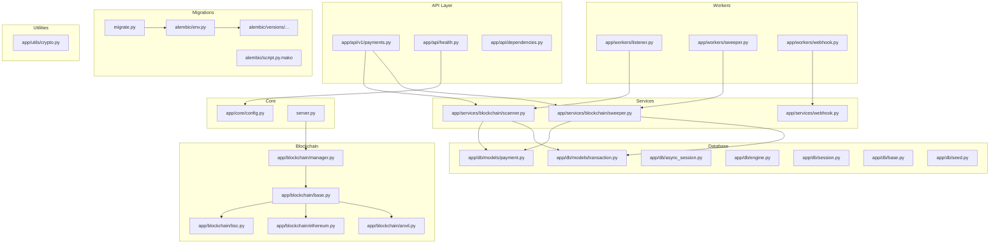
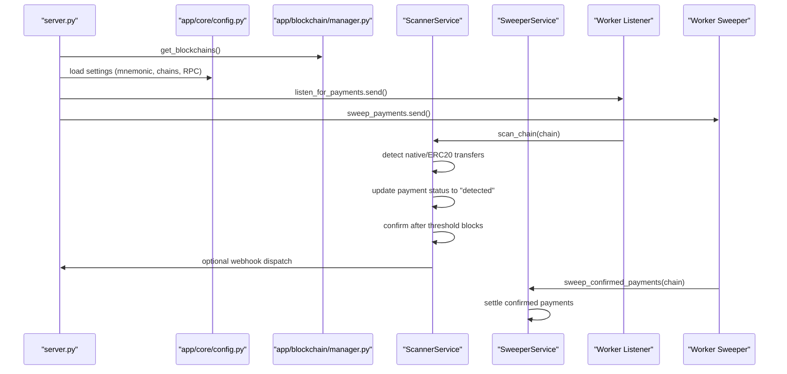
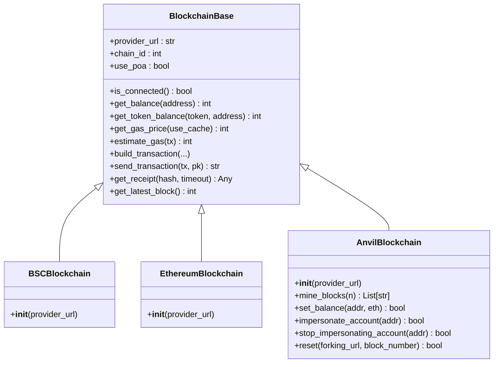
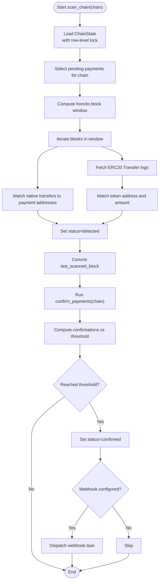
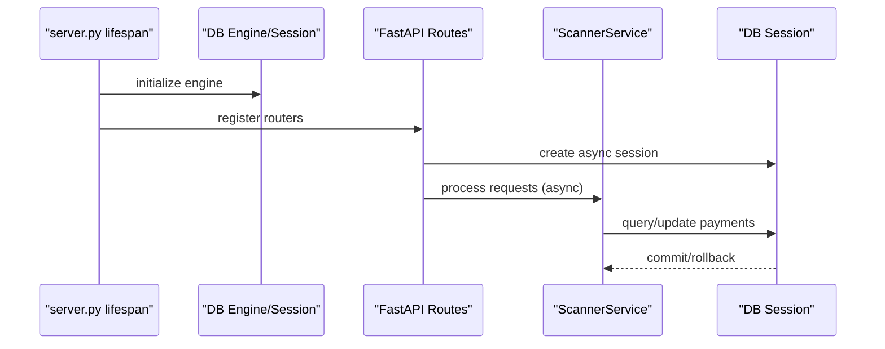
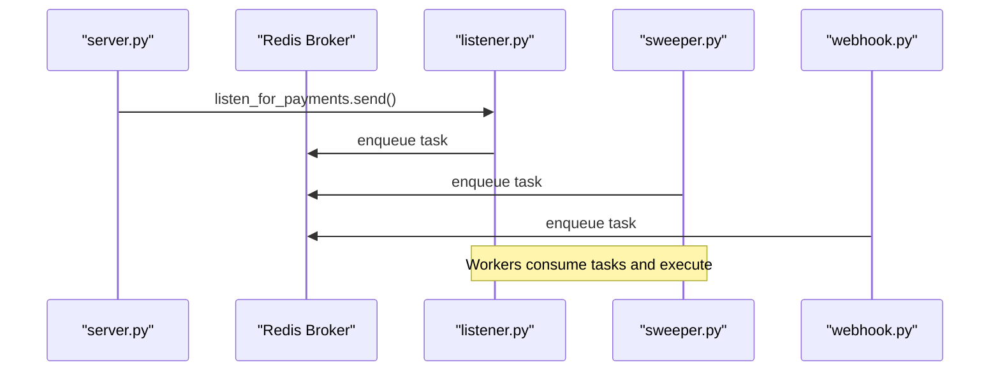
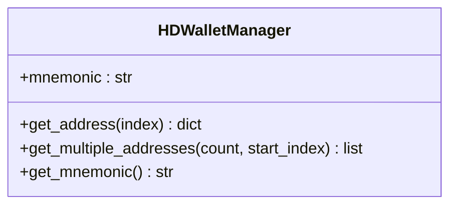
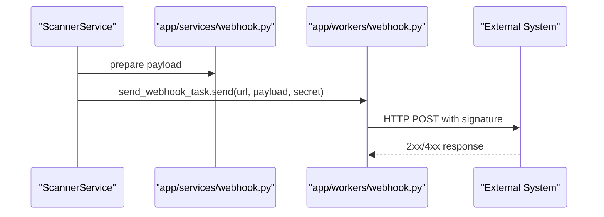
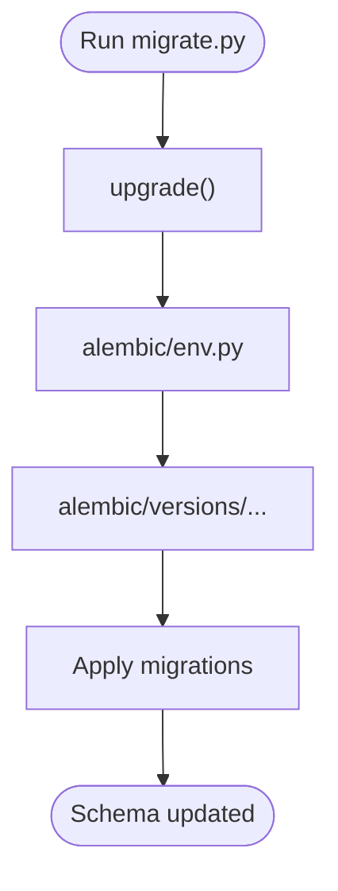
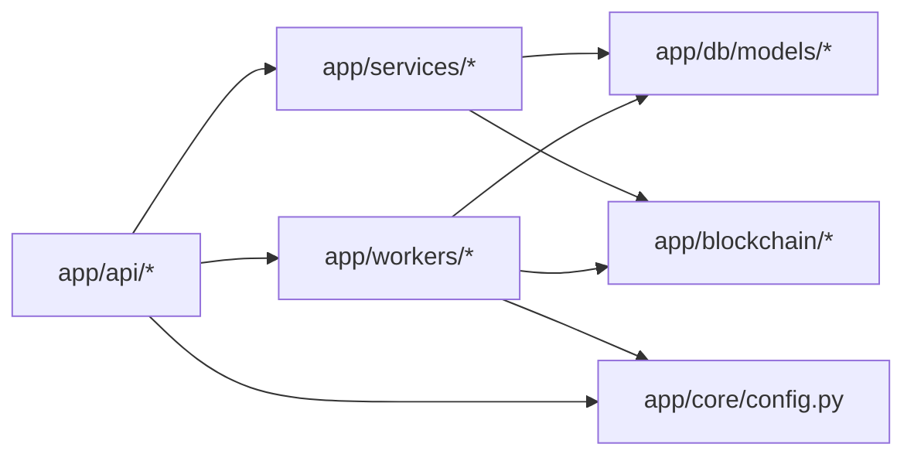

# Key Features and Capabilities

<cite>
**Referenced Files in This Document**
- [README.md](https://github.com/rakibhossain72/ctrip/blob/main/README.md)
- [server.py](https://github.com/rakibhossain72/ctrip/blob/main/server.py)
- [app/core/config.py](https://github.com/rakibhossain72/ctrip/blob/main/app/core/config.py)
- [chains.yaml](https://github.com/rakibhossain72/ctrip/blob/main/chains.yaml)
- [docker-compose.yml](https://github.com/rakibhossain72/ctrip/blob/main/docker-compose.yml)
- [app/blockchain/manager.py](https://github.com/rakibhossain72/ctrip/blob/main/app/blockchain/manager.py)
- [app/blockchain/base.py](https://github.com/rakibhossain72/ctrip/blob/main/app/blockchain/base.py)
- [app/blockchain/bsc.py](https://github.com/rakibhossain72/ctrip/blob/main/app/blockchain/bsc.py)
- [app/blockchain/ethereum.py](https://github.com/rakibhossain72/ctrip/blob/main/app/blockchain/ethereum.py)
- [app/blockchain/anvil.py](https://github.com/rakibhossain72/ctrip/blob/main/app/blockchain/anvil.py)
- [app/db/models/payment.py](https://github.com/rakibhossain72/ctrip/blob/main/app/db/models/payment.py)
- [app/db/models/transaction.py](https://github.com/rakibhossain72/ctrip/blob/main/app/db/models/transaction.py)
- [app/services/blockchain/scanner.py](https://github.com/rakibhossain72/ctrip/blob/main/app/services/blockchain/scanner.py)
- [app/services/blockchain/sweeper.py](https://github.com/rakibhossain72/ctrip/blob/main/app/services/blockchain/sweeper.py)
- [app/utils/crypto.py](https://github.com/rakibhossain72/ctrip/blob/main/app/utils/crypto.py)
- [app/api/v1/payments.py](https://github.com/rakibhossain72/ctrip/blob/main/app/api/v1/payments.py)
- [app/api/health.py](https://github.com/rakibhossain72/ctrip/blob/main/app/api/health.py)
- [app/api/dependencies.py](https://github.com/rakibhossain72/ctrip/blob/main/app/api/dependencies.py)
- [app/workers/listener.py](https://github.com/rakibhossain72/ctrip/blob/main/app/workers/listener.py)
- [app/workers/sweeper.py](https://github.com/rakibhossain72/ctrip/blob/main/app/workers/sweeper.py)
- [app/workers/webhook.py](https://github.com/rakibhossain72/ctrip/blob/main/app/workers/webhook.py)
- [app/services/webhook.py](https://github.com/rakibhossain72/ctrip/blob/main/app/services/webhook.py)
- [app/db/async_session.py](https://github.com/rakibhossain72/ctrip/blob/main/app/db/async_session.py)
- [app/db/engine.py](https://github.com/rakibhossain72/ctrip/blob/main/app/db/engine.py)
- [app/db/session.py](https://github.com/rakibhossain72/ctrip/blob/main/app/db/session.py)
- [app/db/base.py](https://github.com/rakibhossain72/ctrip/blob/main/app/db/base.py)
- [app/db/seed.py](https://github.com/rakibhossain72/ctrip/blob/main/app/db/seed.py)
- [migrate.py](https://github.com/rakibhossain72/ctrip/blob/main/migrate.py)
- [alembic/env.py](https://github.com/rakibhossain72/ctrip/blob/main/alembic/env.py)
- [alembic/script.py.mako](https://github.com/rakibhossain72/ctrip/blob/main/alembic/script.py.mako)
- [alembic/versions/2026_01_27_1807-5ec6405addd0_initial_database_schema.py](https://github.com/rakibhossain72/ctrip/blob/main/alembic/versions/2026_01_27_1807-5ec6405addd0_initial_database_schema.py)
</cite>

## Table of Contents
1. [Introduction](#introduction)
2. [Project Structure](#project-structure)
3. [Core Components](#core-components)
4. [Architecture Overview](#architecture-overview)
5. [Detailed Component Analysis](#detailed-component-analysis)
6. [Dependency Analysis](#dependency-analysis)
7. [Performance Considerations](#performance-considerations)
8. [Troubleshooting Guide](#troubleshooting-guide)
9. [Conclusion](#conclusion)
10. [Appendices](#appendices)

## Introduction
This document explains cTrip’s core features and capabilities with a focus on multi-chain support, automated payment detection, confirmation monitoring, async architecture, background workers, HD wallet integration, webhook notifications, and database migrations. It provides practical examples, configuration requirements, integration patterns, and discusses performance, scalability, and reliability.

## Project Structure
The project is organized around a FastAPI application with modular components:
- API layer: endpoints for payments and health checks
- Blockchain layer: multi-chain implementations and Web3 integration
- Services: scanning and sweeping logic
- Workers: background tasks orchestrated by Dramatiq and Redis
- Database: SQLAlchemy ORM models and Alembic migrations
- Utilities: HD wallet management

**Diagram sources**
- [server.py](https://github.com/rakibhossain72/ctrip/blob/main/server.py#L1-L56)
- [app/core/config.py](https://github.com/rakibhossain72/ctrip/blob/main/app/core/config.py#L1-L126)
- [app/blockchain/manager.py](https://github.com/rakibhossain72/ctrip/blob/main/app/blockchain/manager.py#L1-L33)
- [app/blockchain/base.py](https://github.com/rakibhossain72/ctrip/blob/main/app/blockchain/base.py#L1-L146)
- [app/blockchain/bsc.py](https://github.com/rakibhossain72/ctrip/blob/main/app/blockchain/bsc.py#L1-L7)
- [app/blockchain/ethereum.py](https://github.com/rakibhossain72/ctrip/blob/main/app/blockchain/ethereum.py#L1-L7)
- [app/blockchain/anvil.py](https://github.com/rakibhossain72/ctrip/blob/main/app/blockchain/anvil.py#L1-L57)
- [app/services/blockchain/scanner.py](https://github.com/rakibhossain72/ctrip/blob/main/app/services/blockchain/scanner.py#L1-L134)
- [app/services/blockchain/sweeper.py](https://github.com/rakibhossain72/ctrip/blob/main/app/services/blockchain/sweeper.py#L1-L54)
- [app/workers/listener.py](https://github.com/rakibhossain72/ctrip/blob/main/app/workers/listener.py)
- [app/workers/sweeper.py](https://github.com/rakibhossain72/ctrip/blob/main/app/workers/sweeper.py)
- [app/workers/webhook.py](https://github.com/rakibhossain72/ctrip/blob/main/app/workers/webhook.py)
- [app/db/models/payment.py](https://github.com/rakibhossain72/ctrip/blob/main/app/db/models/payment.py#L1-L74)
- [app/db/models/transaction.py](https://github.com/rakibhossain72/ctrip/blob/main/app/db/models/transaction.py#L1-L40)
- [app/db/async_session.py](https://github.com/rakibhossain72/ctrip/blob/main/app/db/async_session.py)
- [app/db/engine.py](https://github.com/rakibhossain72/ctrip/blob/main/app/db/engine.py)
- [app/db/session.py](https://github.com/rakibhossain72/ctrip/blob/main/app/db/session.py)
- [app/db/base.py](https://github.com/rakibhossain72/ctrip/blob/main/app/db/base.py)
- [app/db/seed.py](https://github.com/rakibhossain72/ctrip/blob/main/app/db/seed.py)
- [migrate.py](https://github.com/rakibhossain72/ctrip/blob/main/migrate.py)
- [alembic/env.py](https://github.com/rakibhossain72/ctrip/blob/main/alembic/env.py)
- [alembic/script.py.mako](https://github.com/rakibhossain72/ctrip/blob/main/alembic/script.py.mako)
- [alembic/versions/2026_01_27_1807-5ec6405addd0_initial_database_schema.py](https://github.com/rakibhossain72/ctrip/blob/main/alembic/versions/2026_01_27_1807-5ec6405addd0_initial_database_schema.py)

**Section sources**
- [README.md](https://github.com/rakibhossain72/ctrip/blob/main/README.md#L1-L87)
- [server.py](https://github.com/rakibhossain72/ctrip/blob/main/server.py#L1-L56)
- [docker-compose.yml](https://github.com/rakibhossain72/ctrip/blob/main/docker-compose.yml#L1-L54)

## Core Components
- Multi-chain support across BSC, Ethereum, and Anvil test networks
- Automated payment detection and confirmation monitoring
- Async FastAPI and SQLAlchemy architecture
- Background workers via Dramatiq and Redis
- HD wallet for unique address generation
- Webhook notifications for payment status updates
- Alembic-based database migrations

**Section sources**
- [README.md](https://github.com/rakibhossain72/ctrip/blob/main/README.md#L5-L13)
- [app/blockchain/manager.py](https://github.com/rakibhossain72/ctrip/blob/main/app/blockchain/manager.py#L1-L33)
- [app/blockchain/base.py](https://github.com/rakibhossain72/ctrip/blob/main/app/blockchain/base.py#L1-L146)
- [app/services/blockchain/scanner.py](https://github.com/rakibhossain72/ctrip/blob/main/app/services/blockchain/scanner.py#L1-L134)
- [app/services/blockchain/sweeper.py](https://github.com/rakibhossain72/ctrip/blob/main/app/services/blockchain/sweeper.py#L1-L54)
- [app/utils/crypto.py](https://github.com/rakibhossain72/ctrip/blob/main/app/utils/crypto.py#L1-L90)
- [app/services/webhook.py](https://github.com/rakibhossain72/ctrip/blob/main/app/services/webhook.py)
- [migrate.py](https://github.com/rakibhossain72/ctrip/blob/main/migrate.py)

## Architecture Overview
cTrip runs an async FastAPI application that loads configured blockchains at startup, initializes an HD wallet, seeds chain states, and triggers background workers. The scanner service periodically scans blocks for incoming payments, while the sweeper service consolidates funds after confirmation. Webhooks notify external systems upon status changes.

**Diagram sources**
- [server.py](https://github.com/rakibhossain72/ctrip/blob/main/server.py#L21-L47)
- [app/core/config.py](https://github.com/rakibhossain72/ctrip/blob/main/app/core/config.py#L1-L126)
- [app/blockchain/manager.py](https://github.com/rakibhossain72/ctrip/blob/main/app/blockchain/manager.py#L1-L33)
- [app/services/blockchain/scanner.py](https://github.com/rakibhossain72/ctrip/blob/main/app/services/blockchain/scanner.py#L1-L134)
- [app/services/blockchain/sweeper.py](https://github.com/rakibhossain72/ctrip/blob/main/app/services/blockchain/sweeper.py#L1-L54)
- [app/workers/listener.py](https://github.com/rakibhossain72/ctrip/blob/main/app/workers/listener.py)
- [app/workers/sweeper.py](https://github.com/rakibhossain72/ctrip/blob/main/app/workers/sweeper.py)

## Detailed Component Analysis

### Multi-Chain Support (BSC, Ethereum, Anvil)
- Implementation pattern: A base class encapsulates shared Web3 operations; chain-specific subclasses override chain ID and PoA handling.
- Configuration: Chains are loaded from a YAML file and mapped to blockchain instances at runtime.
- Benefits:
  - Unified interface for native and token transfers
  - Pluggable chain selection
  - Test network support via Anvil

**Diagram sources**
- [app/blockchain/base.py](https://github.com/rakibhossain72/ctrip/blob/main/app/blockchain/base.py#L22-L146)
- [app/blockchain/bsc.py](https://github.com/rakibhossain72/ctrip/blob/main/app/blockchain/bsc.py#L1-L7)
- [app/blockchain/ethereum.py](https://github.com/rakibhossain72/ctrip/blob/main/app/blockchain/ethereum.py#L1-L7)
- [app/blockchain/anvil.py](https://github.com/rakibhossain72/ctrip/blob/main/app/blockchain/anvil.py#L8-L57)

Practical example:
- Configure chains in the YAML file and ensure the manager creates instances for each chain.
- Use the base class methods to query balances, estimate fees, and build transactions.

Configuration requirements:
- Provide RPC endpoints per chain in the YAML file.
- Ensure chain IDs and PoA flags match the target network.

Integration pattern:
- Resolve a Web3 client per chain and pass it to services that operate on that chain.

**Section sources**
- [app/blockchain/manager.py](https://github.com/rakibhossain72/ctrip/blob/main/app/blockchain/manager.py#L1-L33)
- [chains.yaml](https://github.com/rakibhossain72/ctrip/blob/main/chains.yaml#L1-L24)
- [app/blockchain/base.py](https://github.com/rakibhossain72/ctrip/blob/main/app/blockchain/base.py#L1-L146)
- [app/blockchain/bsc.py](https://github.com/rakibhossain72/ctrip/blob/main/app/blockchain/bsc.py#L1-L7)
- [app/blockchain/ethereum.py](https://github.com/rakibhossain72/ctrip/blob/main/app/blockchain/ethereum.py#L1-L7)
- [app/blockchain/anvil.py](https://github.com/rakibhossain72/ctrip/blob/main/app/blockchain/anvil.py#L1-L57)

### Automated Payment Detection and Confirmation Monitoring
- Detection: Scans blocks within a batch window, matches native transfers and ERC20 logs to pending payments, and marks them as detected.
- Confirmation: After a configurable threshold, updates status to confirmed and optionally triggers a webhook.
- Async architecture: Uses async Web3 and SQLAlchemy sessions for non-blocking IO.

**Diagram sources**
- [app/services/blockchain/scanner.py](https://github.com/rakibhossain72/ctrip/blob/main/app/services/blockchain/scanner.py#L20-L134)

Operational example:
- Start the API and workers; the listener will schedule scanning and sweeping tasks.
- Pending payments on a chain will be detected and confirmed according to the configured threshold.

Configuration requirements:
- Set the number of confirmations required and block batch size in the scanner service initialization.
- Configure the global webhook URL and secret if notifications are desired.

Integration pattern:
- Call the scanner service from a worker actor or periodic scheduler.
- Use the same session for database reads/writes within a single task.

**Section sources**
- [app/services/blockchain/scanner.py](https://github.com/rakibhossain72/ctrip/blob/main/app/services/blockchain/scanner.py#L1-L134)
- [app/db/models/payment.py](https://github.com/rakibhossain72/ctrip/blob/main/app/db/models/payment.py#L41-L74)
- [app/db/models/transaction.py](https://github.com/rakibhossain72/ctrip/blob/main/app/db/models/transaction.py#L29-L40)

### Async Architecture (SQLAlchemy and FastAPI)
- FastAPI routes are async; the lifespan hook initializes blockchains, HD wallet, and seeds chain states.
- Database sessions are async; models define payment and transaction states.
- Reliability: Transactions are committed per batch; errors are logged and tasks are retried by workers.

**Diagram sources**
- [server.py](https://github.com/rakibhossain72/ctrip/blob/main/server.py#L21-L47)
- [app/db/async_session.py](https://github.com/rakibhossain72/ctrip/blob/main/app/db/async_session.py)
- [app/db/engine.py](https://github.com/rakibhossain72/ctrip/blob/main/app/db/engine.py)
- [app/db/session.py](https://github.com/rakibhossain72/ctrip/blob/main/app/db/session.py)
- [app/db/base.py](https://github.com/rakibhossain72/ctrip/blob/main/app/db/base.py)
- [app/services/blockchain/scanner.py](https://github.com/rakibhossain72/ctrip/blob/main/app/services/blockchain/scanner.py#L1-L134)

**Section sources**
- [server.py](https://github.com/rakibhossain72/ctrip/blob/main/server.py#L1-L56)
- [app/db/models/payment.py](https://github.com/rakibhossain72/ctrip/blob/main/app/db/models/payment.py#L41-L74)
- [app/db/models/transaction.py](https://github.com/rakibhossain72/ctrip/blob/main/app/db/models/transaction.py#L29-L40)

### Background Worker System (Dramatiq + Redis)
- Dramatiq actors handle listening for payments, sweeping confirmed payments, and sending webhooks.
- Redis serves as the broker; workers are started via the container command.
- Scalability: Multiple worker containers can be deployed behind the same Redis instance.

**Diagram sources**
- [server.py](https://github.com/rakibhossain72/ctrip/blob/main/server.py#L36-L40)
- [docker-compose.yml](https://github.com/rakibhossain72/ctrip/blob/main/docker-compose.yml#L37-L50)
- [app/workers/listener.py](https://github.com/rakibhossain72/ctrip/blob/main/app/workers/listener.py)
- [app/workers/sweeper.py](https://github.com/rakibhossain72/ctrip/blob/main/app/workers/sweeper.py)
- [app/workers/webhook.py](https://github.com/rakibhossain72/ctrip/blob/main/app/workers/webhook.py)

Operational example:
- Run the worker container; it will start consuming tasks from Redis and execute background jobs.

Configuration requirements:
- Set Redis URL in environment variables.
- Ensure the worker command includes the three actors.

**Section sources**
- [docker-compose.yml](https://github.com/rakibhossain72/ctrip/blob/main/docker-compose.yml#L37-L50)
- [server.py](https://github.com/rakibhossain72/ctrip/blob/main/server.py#L36-L40)

### Secure HD Wallet Integration
- Generates unique payment addresses using BIP-44 derivation from a mnemonic.
- Provides deterministic address derivation for each payment index.
- Security: mnemonic and derived keys are handled via the underlying cryptographic libraries.

**Diagram sources**
- [app/utils/crypto.py](https://github.com/rakibhossain72/ctrip/blob/main/app/utils/crypto.py#L5-L90)

Operational example:
- Initialize the HD wallet manager with a mnemonic; derive addresses for each payment.
- Persist addresses and indices in the database for future sweeping.

Configuration requirements:
- Provide a secure mnemonic via environment variables.
- Seed chain states and ensure address uniqueness per payment.

**Section sources**
- [app/utils/crypto.py](https://github.com/rakibhossain72/ctrip/blob/main/app/utils/crypto.py#L1-L90)
- [app/db/models/payment.py](https://github.com/rakibhossain72/ctrip/blob/main/app/db/models/payment.py#L65-L74)

### Webhook Notification System
- On confirmation, the scanner service can dispatch a webhook task if configured.
- Payload includes payment metadata; signature can be validated using the configured secret.

**Diagram sources**
- [app/services/blockchain/scanner.py](https://github.com/rakibhossain72/ctrip/blob/main/app/services/blockchain/scanner.py#L117-L131)
- [app/services/webhook.py](https://github.com/rakibhossain72/ctrip/blob/main/app/services/webhook.py)
- [app/workers/webhook.py](https://github.com/rakibhossain72/ctrip/blob/main/app/workers/webhook.py)

Operational example:
- Configure the global webhook URL and secret; on confirmed payments, a task is enqueued and delivered asynchronously.

Configuration requirements:
- Set webhook URL and secret in settings.
- Implement signature verification on the receiving end.

**Section sources**
- [app/services/blockchain/scanner.py](https://github.com/rakibhossain72/ctrip/blob/main/app/services/blockchain/scanner.py#L117-L131)
- [app/core/config.py](https://github.com/rakibhossain72/ctrip/blob/main/app/core/config.py#L63-L71)

### Robust Migration System (Alembic)
- Alembic manages database schema evolution; a helper script wraps migration commands.
- Initial schema defines payments and transactions with appropriate statuses and relationships.

**Diagram sources**
- [migrate.py](https://github.com/rakibhossain72/ctrip/blob/main/migrate.py)
- [alembic/env.py](https://github.com/rakibhossain72/ctrip/blob/main/alembic/env.py)
- [alembic/script.py.mako](https://github.com/rakibhossain72/ctrip/blob/main/alembic/script.py.mako)
- [alembic/versions/2026_01_27_1807-5ec6405addd0_initial_database_schema.py](https://github.com/rakibhossain72/ctrip/blob/main/alembic/versions/2026_01_27_1807-5ec6405addd0_initial_database_schema.py)

Operational example:
- Run the migration helper to upgrade/downgrade schema as needed.

Configuration requirements:
- Configure the database URL in environment variables.
- Keep migrations versioned and review changes before applying.

**Section sources**
- [migrate.py](https://github.com/rakibhossain72/ctrip/blob/main/migrate.py)
- [alembic/env.py](https://github.com/rakibhossain72/ctrip/blob/main/alembic/env.py)
- [alembic/script.py.mako](https://github.com/rakibhossain72/ctrip/blob/main/alembic/script.py.mako)
- [alembic/versions/2026_01_27_1807-5ec6405addd0_initial_database_schema.py](https://github.com/rakibhossain72/ctrip/blob/main/alembic/versions/2026_01_27_1807-5ec6405addd0_initial_database_schema.py)

## Dependency Analysis
- API depends on services and workers; services depend on blockchain clients and database sessions.
- Blockchain layer abstracts chain differences; workers depend on Redis.
- Database models define relationships between payments and transactions.

**Diagram sources**
- [app/api/v1/payments.py](https://github.com/rakibhossain72/ctrip/blob/main/app/api/v1/payments.py)
- [app/api/health.py](https://github.com/rakibhossain72/ctrip/blob/main/app/api/health.py)
- [app/api/dependencies.py](https://github.com/rakibhossain72/ctrip/blob/main/app/api/dependencies.py)
- [app/services/blockchain/scanner.py](https://github.com/rakibhossain72/ctrip/blob/main/app/services/blockchain/scanner.py#L1-L134)
- [app/services/blockchain/sweeper.py](https://github.com/rakibhossain72/ctrip/blob/main/app/services/blockchain/sweeper.py#L1-L54)
- [app/workers/listener.py](https://github.com/rakibhossain72/ctrip/blob/main/app/workers/listener.py)
- [app/workers/sweeper.py](https://github.com/rakibhossain72/ctrip/blob/main/app/workers/sweeper.py)
- [app/workers/webhook.py](https://github.com/rakibhossain72/ctrip/blob/main/app/workers/webhook.py)
- [app/db/models/payment.py](https://github.com/rakibhossain72/ctrip/blob/main/app/db/models/payment.py#L41-L74)
- [app/db/models/transaction.py](https://github.com/rakibhossain72/ctrip/blob/main/app/db/models/transaction.py#L29-L40)
- [app/blockchain/manager.py](https://github.com/rakibhossain72/ctrip/blob/main/app/blockchain/manager.py#L1-L33)
- [app/core/config.py](https://github.com/rakibhossain72/ctrip/blob/main/app/core/config.py#L1-L126)

**Section sources**
- [app/blockchain/manager.py](https://github.com/rakibhossain72/ctrip/blob/main/app/blockchain/manager.py#L1-L33)
- [app/services/blockchain/scanner.py](https://github.com/rakibhossain72/ctrip/blob/main/app/services/blockchain/scanner.py#L1-L134)
- [app/services/blockchain/sweeper.py](https://github.com/rakibhossain72/ctrip/blob/main/app/services/blockchain/sweeper.py#L1-L54)
- [app/workers/listener.py](https://github.com/rakibhossain72/ctrip/blob/main/app/workers/listener.py)
- [app/workers/sweeper.py](https://github.com/rakibhossain72/ctrip/blob/main/app/workers/sweeper.py)
- [app/workers/webhook.py](https://github.com/rakibhossain72/ctrip/blob/main/app/workers/webhook.py)
- [app/db/models/payment.py](https://github.com/rakibhossain72/ctrip/blob/main/app/db/models/payment.py#L41-L74)
- [app/db/models/transaction.py](https://github.com/rakibhossain72/ctrip/blob/main/app/db/models/transaction.py#L29-L40)
- [app/core/config.py](https://github.com/rakibhossain72/ctrip/blob/main/app/core/config.py#L1-L126)

## Performance Considerations
- Block scanning batch size controls throughput versus latency; tune based on chain throughput and worker capacity.
- Gas price caching reduces repeated RPC calls; adjust cache duration for volatility.
- Async IO prevents blocking on network calls; ensure database connections pool appropriately.
- Webhook delivery is offloaded to workers; configure retry/backoff on the receiver.
- HD wallet derivation is CPU-light; batching address generation improves throughput.

[No sources needed since this section provides general guidance]

## Troubleshooting Guide
- Connectivity: Verify RPC URLs and chain IDs; check base class connection method.
- Database: Ensure migrations are applied and the database URL is correct.
- Workers: Confirm Redis connectivity and that the worker command includes the actors.
- Webhooks: Validate webhook URL and secret; inspect worker logs for delivery failures.
- Addresses: Regenerate addresses from the HD wallet if collisions occur.

**Section sources**
- [app/blockchain/base.py](https://github.com/rakibhossain72/ctrip/blob/main/app/blockchain/base.py#L45-L50)
- [migrate.py](https://github.com/rakibhossain72/ctrip/blob/main/migrate.py)
- [docker-compose.yml](https://github.com/rakibhossain72/ctrip/blob/main/docker-compose.yml#L37-L50)
- [app/services/blockchain/scanner.py](https://github.com/rakibhossain72/ctrip/blob/main/app/services/blockchain/scanner.py#L117-L131)
- [app/utils/crypto.py](https://github.com/rakibhossain72/ctrip/blob/main/app/utils/crypto.py#L1-L90)

## Conclusion
cTrip delivers a robust, scalable payment infrastructure with multi-chain support, automated detection and confirmation, async processing, distributed workers, secure HD wallets, webhooks, and migrations. By tuning configuration parameters and leveraging the modular architecture, teams can achieve high reliability and performance across production and test environments.

[No sources needed since this section summarizes without analyzing specific files]

## Appendices

### Configuration Checklist
- Environment variables: database URL, Redis URL, RPC URL, private key, mnemonic, webhook URL and secret.
- Chains YAML: RPC endpoints and token lists per chain.
- Docker Compose: services for app, worker, db, and redis.

**Section sources**
- [app/core/config.py](https://github.com/rakibhossain72/ctrip/blob/main/app/core/config.py#L18-L82)
- [chains.yaml](https://github.com/rakibhossain72/ctrip/blob/main/chains.yaml#L1-L24)
- [docker-compose.yml](https://github.com/rakibhossain72/ctrip/blob/main/docker-compose.yml#L26-L47)