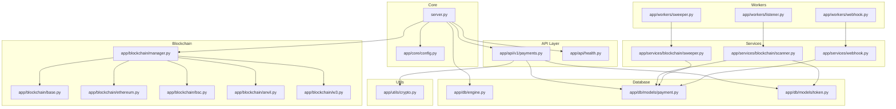
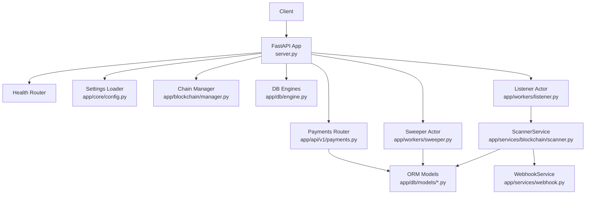
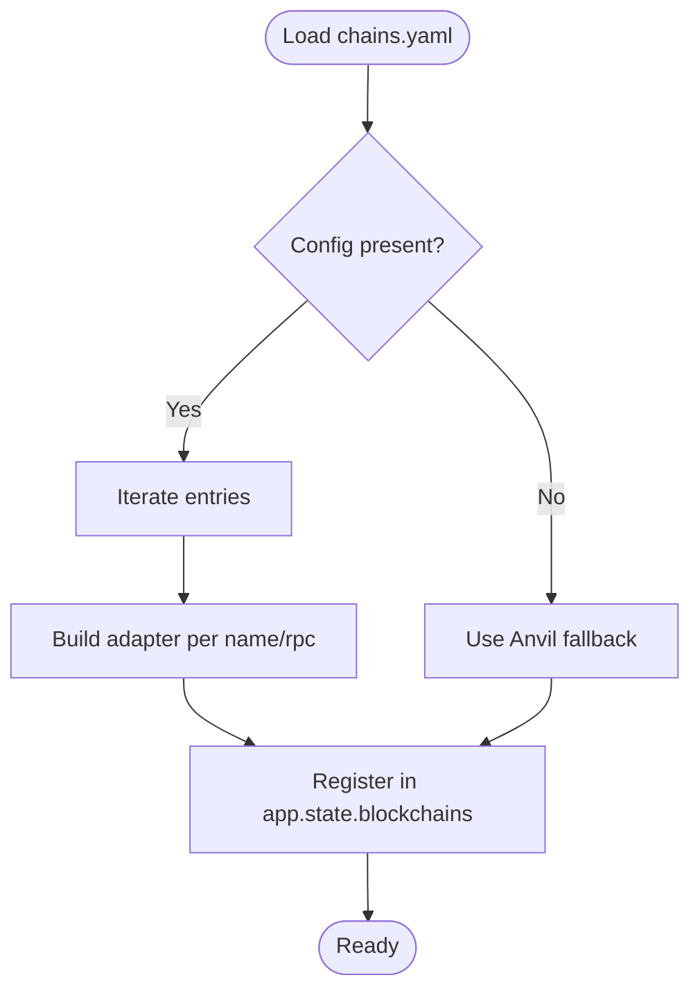
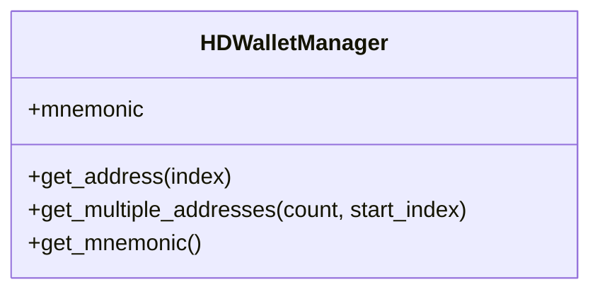
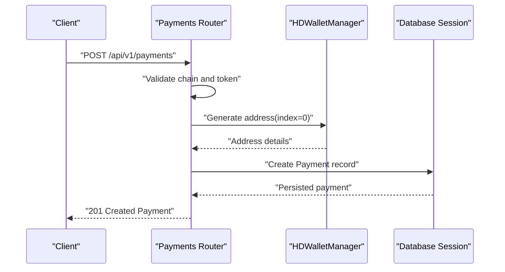
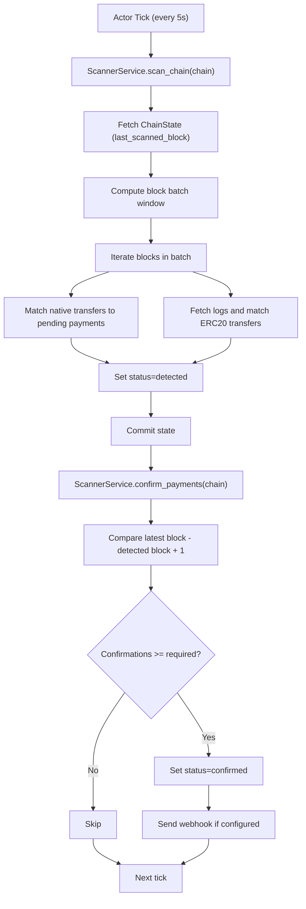
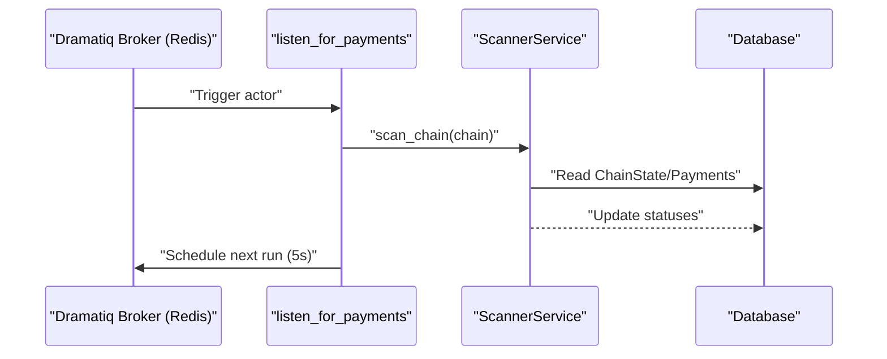
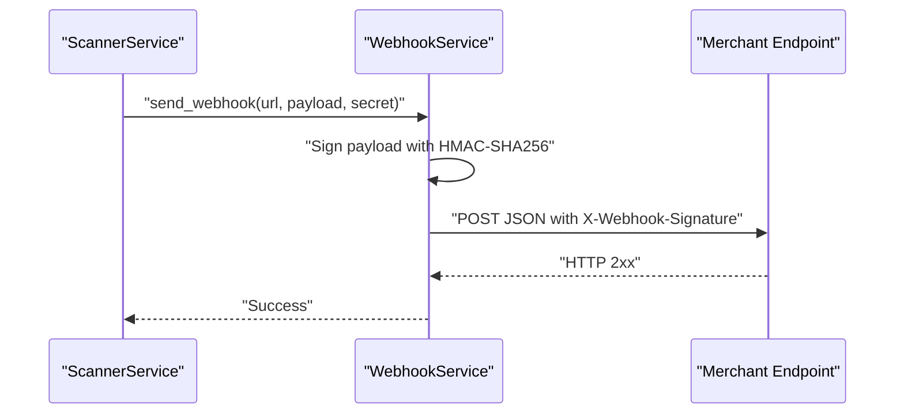
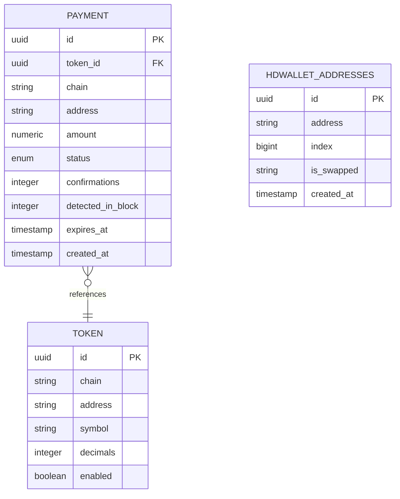
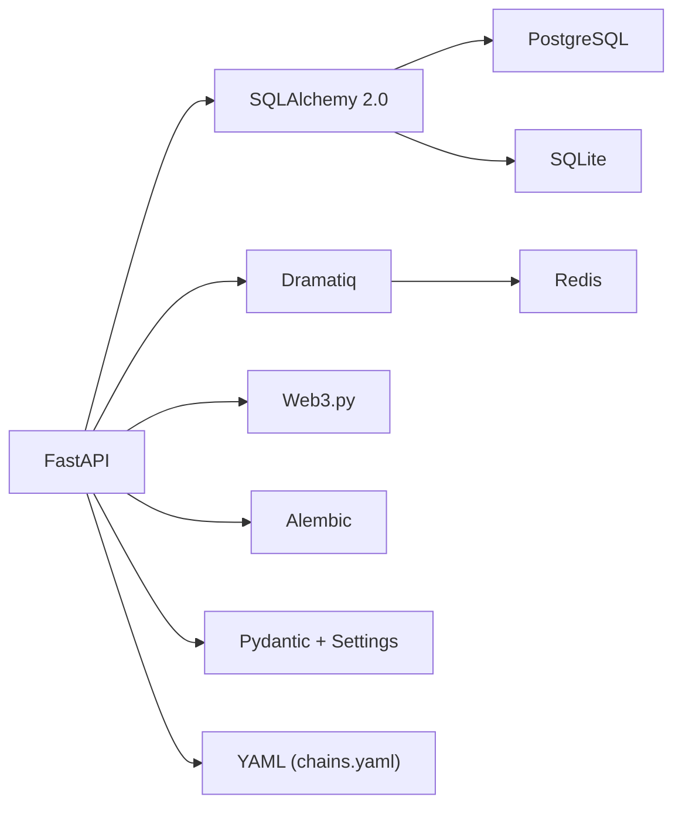

# Project Overview

<cite>
**Referenced Files in This Document**
- [README.md](file://README.md)
- [server.py](file://server.py)
- [pyproject.toml](file://pyproject.toml)
- [chains.yaml](file://chains.yaml)
- [app/core/config.py](file://app/core/config.py)
- [app/blockchain/manager.py](file://app/blockchain/manager.py)
- [app/api/v1/payments.py](file://app/api/v1/payments.py)
- [app/db/models/payment.py](file://app/db/models/payment.py)
- [app/db/models/token.py](file://app/db/models/token.py)
- [app/db/engine.py](file://app/db/engine.py)
- [app/workers/listener.py](file://app/workers/listener.py)
- [app/workers/sweeper.py](file://app/workers/sweeper.py)
- [app/services/blockchain/scanner.py](file://app/services/blockchain/scanner.py)
- [app/services/webhook.py](file://app/services/webhook.py)
- [app/utils/crypto.py](file://app/utils/crypto.py)
</cite>

## Table of Contents
1. [Introduction](#introduction)
2. [Project Structure](#project-structure)
3. [Core Components](#core-components)
4. [Architecture Overview](#architecture-overview)
5. [Detailed Component Analysis](#detailed-component-analysis)
6. [Dependency Analysis](#dependency-analysis)
7. [Performance Considerations](#performance-considerations)
8. [Troubleshooting Guide](#troubleshooting-guide)
9. [Conclusion](#conclusion)
10. [Appendices](#appendices)

## Introduction
cTrip is a high-performance, multi-chain cryptocurrency payment gateway built with FastAPI. It enables merchants and developers to accept payments across multiple EVM-compatible blockchains with automated detection, confirmation monitoring, and secure address generation. The system emphasizes asynchronous operations, robust background processing, and a clean separation of concerns across API, blockchain, database, and worker layers.

Key positioning in the cryptocurrency payment processing ecosystem:
- Provides a unified interface for multi-chain payments without requiring deep blockchain expertise.
- Offers real-time detection and confirmation workflows suitable for high-throughput scenarios.
- Delivers secure address management via HD Wallet integration and configurable webhook notifications for payment lifecycle events.

Target use cases:
- E-commerce platforms needing multi-token, multi-chain checkout experiences.
- Developers integrating cryptocurrency payments into existing systems with minimal operational overhead.
- Payment processors requiring scalable, asynchronous background processing for detection and settlement.

Benefits:
- For merchants: Simplified integration, multi-chain support, and reliable confirmation workflows.
- For developers: Clear APIs, modular architecture, and extensible blockchain adapters.

**Section sources**
- [README.md](file://README.md#L1-L87)

## Project Structure
The project follows a layered architecture:
- API layer: FastAPI routers and endpoints for payment creation and health checks.
- Blockchain layer: Adapters for Ethereum, BSC, and Anvil (local testing), with a manager coordinating chain configurations.
- Database layer: SQLAlchemy 2.0 ORM models and async engine configuration.
- Worker layer: Dramatiq actors orchestrating background tasks (listener and sweeper).
- Services layer: Business logic for scanning, confirming, sweeping, and webhook delivery.
- Utilities: HD Wallet management and cryptographic helpers.

**Diagram sources**
- [server.py](file://server.py#L1-L56)
- [app/api/v1/payments.py](file://app/api/v1/payments.py#L1-L62)
- [app/blockchain/manager.py](file://app/blockchain/manager.py#L1-L33)
- [app/db/engine.py](file://app/db/engine.py#L1-L32)
- [app/db/models/payment.py](file://app/db/models/payment.py#L1-L74)
- [app/db/models/token.py](file://app/db/models/token.py#L1-L15)
- [app/workers/listener.py](file://app/workers/listener.py#L1-L46)
- [app/workers/sweeper.py](file://app/workers/sweeper.py#L1-L40)
- [app/services/blockchain/scanner.py](file://app/services/blockchain/scanner.py#L1-L134)
- [app/services/webhook.py](file://app/services/webhook.py#L1-L45)
- [app/utils/crypto.py](file://app/utils/crypto.py#L1-L90)

**Section sources**
- [README.md](file://README.md#L71-L78)
- [server.py](file://server.py#L1-L56)

## Core Components
- FastAPI Application: Defines routes, startup lifecycle, and global state initialization for blockchains, HD wallet, and background workers.
- Configuration: Centralized settings loader with environment-aware database URLs, RPC endpoints, Redis, chains YAML, and secrets validation.
- Multi-Chain Manager: Builds blockchain adapters from chains.yaml or falls back to Anvil for local development.
- Payment API: Creates payment requests, validates chain and token availability, generates HD-derived addresses, and persists records.
- Database Models: Payment lifecycle tracking, token definitions, and HD wallet address indexing.
- Background Workers: Listener scans for incoming payments and confirms them; Sweeper handles fund sweeping; Webhook service dispatches notifications.
- Services: ScannerService performs block scanning and confirmation logic; WebhookService signs and sends notifications.
- Utilities: HDWalletManager for BIP-44 derivation and address generation.

**Section sources**
- [server.py](file://server.py#L21-L47)
- [app/core/config.py](file://app/core/config.py#L10-L126)
- [app/blockchain/manager.py](file://app/blockchain/manager.py#L8-L33)
- [app/api/v1/payments.py](file://app/api/v1/payments.py#L12-L62)
- [app/db/models/payment.py](file://app/db/models/payment.py#L41-L74)
- [app/db/models/token.py](file://app/db/models/token.py#L6-L15)
- [app/workers/listener.py](file://app/workers/listener.py#L21-L46)
- [app/workers/sweeper.py](file://app/workers/sweeper.py#L19-L40)
- [app/services/blockchain/scanner.py](file://app/services/blockchain/scanner.py#L14-L134)
- [app/services/webhook.py](file://app/services/webhook.py#L10-L45)
- [app/utils/crypto.py](file://app/utils/crypto.py#L5-L67)

## Architecture Overview
The system integrates FastAPI, PostgreSQL/SQLite, SQLAlchemy 2.0, Dramatiq with Redis, Web3.py, and Alembic. The runtime lifecycle initializes blockchain adapters and HD wallet, seeds chain states, and triggers background workers. Payments are created via API, scanned for detection and confirmation, and settled via sweeping with optional webhook notifications.

**Diagram sources**
- [server.py](file://server.py#L21-L47)
- [app/api/v1/payments.py](file://app/api/v1/payments.py#L12-L62)
- [app/core/config.py](file://app/core/config.py#L10-L126)
- [app/blockchain/manager.py](file://app/blockchain/manager.py#L8-L33)
- [app/db/engine.py](file://app/db/engine.py#L1-L32)
- [app/db/models/payment.py](file://app/db/models/payment.py#L41-L74)
- [app/workers/listener.py](file://app/workers/listener.py#L21-L46)
- [app/workers/sweeper.py](file://app/workers/sweeper.py#L19-L40)
- [app/services/blockchain/scanner.py](file://app/services/blockchain/scanner.py#L14-L134)
- [app/services/webhook.py](file://app/services/webhook.py#L10-L45)

## Detailed Component Analysis

### Multi-Chain Support and Configuration
- Chains are loaded from chains.yaml and mapped to blockchain adapters. Supported chains include Ethereum, BSC, and Anvil. If no configuration is present, the system defaults to Anvil.
- The manager constructs chain-specific providers and exposes them to the application state.

**Diagram sources**
- [app/blockchain/manager.py](file://app/blockchain/manager.py#L8-L33)
- [app/core/config.py](file://app/core/config.py#L44-L56)

**Section sources**
- [chains.yaml](file://chains.yaml#L1-L24)
- [app/blockchain/manager.py](file://app/blockchain/manager.py#L8-L33)
- [app/core/config.py](file://app/core/config.py#L39-L56)

### Secure Address Management (HD Wallet)
- HDWalletManager derives Ethereum addresses using BIP-44 at m/44'/60'/0'/0/{index}.
- Addresses are generated per payment request and persisted with the payment record.
- Mnemonic is configurable via environment settings and validated during runtime.

**Diagram sources**
- [app/utils/crypto.py](file://app/utils/crypto.py#L5-L67)

**Section sources**
- [app/utils/crypto.py](file://app/utils/crypto.py#L5-L67)
- [app/api/v1/payments.py](file://app/api/v1/payments.py#L36-L38)
- [app/core/config.py](file://app/core/config.py#L58-L61)

### Payment Creation Workflow
- Validates requested chain against configured adapters.
- Optionally validates token presence on the selected chain.
- Generates a unique payment address via HD wallet.
- Persists payment metadata with expiration and created timestamps.

**Diagram sources**
- [app/api/v1/payments.py](file://app/api/v1/payments.py#L18-L54)
- [app/utils/crypto.py](file://app/utils/crypto.py#L27-L46)
- [app/db/models/payment.py](file://app/db/models/payment.py#L41-L58)

**Section sources**
- [app/api/v1/payments.py](file://app/api/v1/payments.py#L18-L54)
- [app/db/models/payment.py](file://app/db/models/payment.py#L41-L58)

### Automated Detection and Confirmation
- The listener actor periodically runs a ScannerService that:
  - Reads chain state and scans recent blocks in batches.
  - Detects native and ERC20 transfers matching pending payments.
  - Updates payment status to detected and records block number.
- Confirmation logic compares detected block height to latest block to meet required confirmations.

**Diagram sources**
- [app/workers/listener.py](file://app/workers/listener.py#L21-L46)
- [app/services/blockchain/scanner.py](file://app/services/blockchain/scanner.py#L20-L134)

**Section sources**
- [app/workers/listener.py](file://app/workers/listener.py#L21-L46)
- [app/services/blockchain/scanner.py](file://app/services/blockchain/scanner.py#L14-L134)

### Background Workers and Task Queue
- Dramatiq actors are used for long-running tasks:
  - listen_for_payments: Runs periodic scanning and confirmation cycles.
  - sweep_payments: Periodically sweeps confirmed payments using HD wallet credentials.
- Redis serves as the broker for Dramatiq.

**Diagram sources**
- [app/workers/listener.py](file://app/workers/listener.py#L21-L46)
- [app/services/blockchain/scanner.py](file://app/services/blockchain/scanner.py#L20-L96)

**Section sources**
- [app/workers/listener.py](file://app/workers/listener.py#L1-L46)
- [app/workers/sweeper.py](file://app/workers/sweeper.py#L1-L40)

### Webhooks and Security
- WebhookService signs payloads using HMAC-SHA256 when a secret is provided and sends them asynchronously.
- ScannerService triggers webhooks upon confirmation when configured.

**Diagram sources**
- [app/services/blockchain/scanner.py](file://app/services/blockchain/scanner.py#L117-L131)
- [app/services/webhook.py](file://app/services/webhook.py#L10-L45)

**Section sources**
- [app/services/webhook.py](file://app/services/webhook.py#L10-L45)
- [app/core/config.py](file://app/core/config.py#L63-L71)

### Database Models and Schema
- Payment tracks chain, address, amount, status, confirmations, detection block, expiration, and timestamps.
- Token defines chain, address, symbol, decimals, and enabled flag.
- HDWalletAddress stores derived addresses and indices.

**Diagram sources**
- [app/db/models/payment.py](file://app/db/models/payment.py#L41-L74)
- [app/db/models/token.py](file://app/db/models/token.py#L6-L15)

**Section sources**
- [app/db/models/payment.py](file://app/db/models/payment.py#L41-L74)
- [app/db/models/token.py](file://app/db/models/token.py#L6-L15)

## Dependency Analysis
Technology stack and relationships:
- FastAPI: Web framework powering API routes and application lifecycle.
- SQLAlchemy 2.0: ORM for database modeling and async engine support.
- PostgreSQL/SQLite: Storage backends with environment-aware selection.
- Alembic: Migration system orchestrated via a helper script.
- Dramatiq + Redis: Task queue for background processing.
- Web3.py: Interaction with EVM-compatible blockchains.
- Pydantic + Pydantic-Settings: Strongly-typed configuration and validation.
- YAML: Chain configuration file.

**Diagram sources**
- [pyproject.toml](file://pyproject.toml#L14-L32)
- [app/db/engine.py](file://app/db/engine.py#L1-L32)
- [app/core/config.py](file://app/core/config.py#L10-L126)
- [chains.yaml](file://chains.yaml#L1-L24)

**Section sources**
- [pyproject.toml](file://pyproject.toml#L14-L32)
- [app/db/engine.py](file://app/db/engine.py#L1-L32)
- [app/core/config.py](file://app/core/config.py#L10-L126)

## Performance Considerations
- Asynchronous operations: SQLAlchemy async engines and FastAPI async handlers reduce blocking IO.
- Batched scanning: Block windows limit per-iteration work and reduce RPC load.
- Minimal retries: Actors set conservative retry policies to avoid thundering herds.
- Connection pooling: Engine configuration includes pre-ping and sizing for stability.
- Recommendations:
  - Scale Redis and Dramatiq workers horizontally for throughput.
  - Tune block batch sizes and confirmation thresholds per chain characteristics.
  - Monitor webhook delivery latency and configure exponential backoff at the consumer.

[No sources needed since this section provides general guidance]

## Troubleshooting Guide
Common issues and diagnostics:
- Invalid private key or secret key in production: Settings validator enforces valid Ethereum private keys and requires changing default secret keys in production.
- Missing chains.yaml or invalid entries: Manager falls back to Anvil; ensure chains.yaml is present and formatted correctly.
- Webhook failures: WebhookService logs HTTP errors and exceptions; verify URL, secret, and network connectivity.
- Database connectivity: Verify DATABASE_URL and driver variants for async connections.

**Section sources**
- [app/core/config.py](file://app/core/config.py#L94-L112)
- [app/blockchain/manager.py](file://app/blockchain/manager.py#L28-L31)
- [app/services/webhook.py](file://app/services/webhook.py#L39-L44)

## Conclusion
cTrip delivers a pragmatic, high-performance solution for multi-chain cryptocurrency payments. Its modular design, asynchronous foundations, and robust background processing enable reliable payment detection, confirmation, and settlement. By combining FastAPI, SQLAlchemy 2.0, Dramatiq, Web3.py, and Alembic, it provides a solid foundation for merchants and developers to integrate seamless crypto payments across EVM-compatible networks.

[No sources needed since this section summarizes without analyzing specific files]

## Appendices

### Technology Stack Overview
- Framework: FastAPI
- Database: PostgreSQL / SQLite (dev)
- ORM: SQLAlchemy 2.0
- Task Queue: Dramatiq with Redis
- Blockchain: Web3.py
- Migrations: Alembic

**Section sources**
- [README.md](file://README.md#L15-L22)
- [pyproject.toml](file://pyproject.toml#L14-L32)