# Technology Stack and Architecture

<cite>
**Referenced Files in This Document**
- [server.py](file://server.py)
- [app/core/config.py](file://app/core/config.py)
- [app/db/engine.py](file://app/db/engine.py)
- [app/db/async_session.py](file://app/db/async_session.py)
- [app/blockchain/manager.py](file://app/blockchain/manager.py)
- [app/blockchain/base.py](file://app/blockchain/base.py)
- [app/api/v1/payments.py](file://app/api/v1/payments.py)
- [app/services/blockchain/scanner.py](file://app/services/blockchain/scanner.py)
- [app/workers/listener.py](file://app/workers/listener.py)
- [docker-compose.yml](file://docker-compose.yml)
- [requirements.txt](file://requirements.txt)
- [pyproject.toml](file://pyproject.toml)
- [alembic.ini](file://alembic.ini)
- [app/db/models/payment.py](file://app/db/models/payment.py)
- [app/utils/crypto.py](file://app/utils/crypto.py)
</cite>

## Table of Contents
1. [Introduction](#introduction)
2. [Project Structure](#project-structure)
3. [Core Components](#core-components)
4. [Architecture Overview](#architecture-overview)
5. [Detailed Component Analysis](#detailed-component-analysis)
6. [Dependency Analysis](#dependency-analysis)
7. [Performance Considerations](#performance-considerations)
8. [Troubleshooting Guide](#troubleshooting-guide)
9. [Conclusion](#conclusion)

## Introduction
This document describes the technology stack and system architecture of cTrip, a multi-chain cryptocurrency payment gateway. The system is built on FastAPI as the web framework foundation, with PostgreSQL and SQLite for data persistence and SQLAlchemy 2.0 for async ORM operations. Background tasks are processed using Dramatiq with Redis, blockchain interactions leverage Web3.py, and Alembic manages database migrations. The architecture follows a layered pattern separating API, service, blockchain, and database layers. Async/await patterns are used throughout, and the system is containerized with Docker. Background workers are decomposed into microservice-like actors for payment listening, sweeping, and webhook dispatch.

## Project Structure
The repository is organized into feature-focused packages:
- app/api: FastAPI routers and HTTP endpoints
- app/services: Business logic and orchestration
- app/blockchain: Blockchain abstraction and chain-specific implementations
- app/db: SQLAlchemy models, async engines, and sessions
- app/workers: Dramatiq actors for background jobs
- alembic: Database migration scripts and configuration
- Root configuration and deployment files for Docker and project metadata

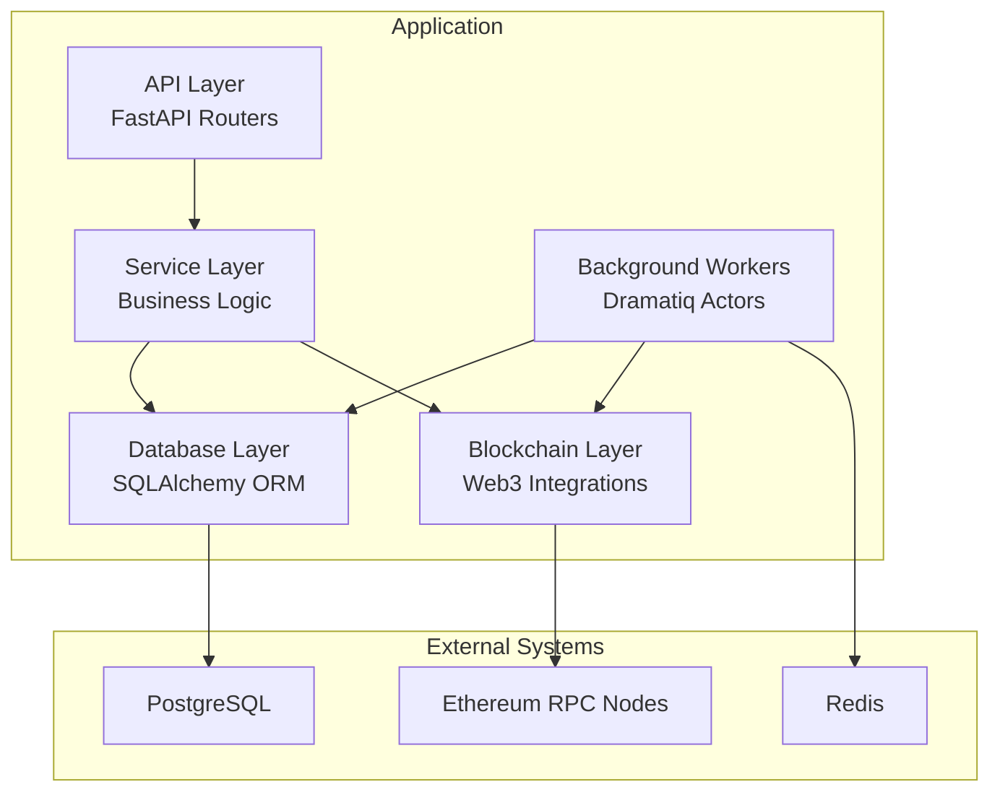

**Diagram sources**
- [server.py](file://server.py#L45-L56)
- [app/api/v1/payments.py](file://app/api/v1/payments.py#L12-L62)
- [app/services/blockchain/scanner.py](file://app/services/blockchain/scanner.py#L14-L134)
- [app/db/engine.py](file://app/db/engine.py#L19-L32)
- [docker-compose.yml](file://docker-compose.yml#L1-L54)

**Section sources**
- [server.py](file://server.py#L1-L56)
- [docker-compose.yml](file://docker-compose.yml#L1-L54)

## Core Components
- Web Framework: FastAPI with lifespan for startup initialization and router composition
- Configuration: Centralized settings with environment-aware database and RPC configuration
- Database: SQLAlchemy 2.0 async engine with asyncpg for PostgreSQL and aiosqlite for SQLite
- Blockchain: Web3.py-based async client with POA middleware support and caching
- Background Tasks: Dramatiq actors orchestrated via Redis broker
- Migration Tooling: Alembic for schema evolution
- Containerization: Docker Compose for local development with Postgres, Redis, and worker processes

**Section sources**
- [server.py](file://server.py#L21-L47)
- [app/core/config.py](file://app/core/config.py#L10-L126)
- [app/db/engine.py](file://app/db/engine.py#L1-L32)
- [app/blockchain/base.py](file://app/blockchain/base.py#L22-L146)
- [docker-compose.yml](file://docker-compose.yml#L1-L54)
- [requirements.txt](file://requirements.txt#L1-L106)
- [pyproject.toml](file://pyproject.toml#L14-L32)
- [alembic.ini](file://alembic.ini#L86-L90)

## Architecture Overview
The system follows a layered architecture:
- API Layer: Exposes HTTP endpoints for payment creation and health checks
- Service Layer: Implements business logic, including blockchain scanning and confirmation workflows
- Blockchain Layer: Provides chain abstraction and async Web3 integrations
- Database Layer: Manages persistent state with async ORM and migrations
- Background Workers: Microservice-like actors for continuous monitoring and event dispatch

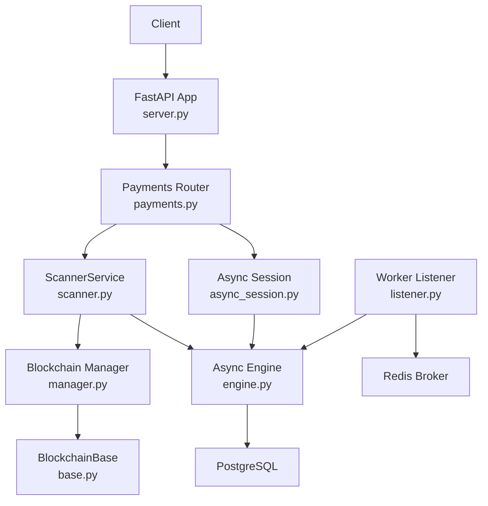

**Diagram sources**
- [server.py](file://server.py#L45-L56)
- [app/api/v1/payments.py](file://app/api/v1/payments.py#L12-L62)
- [app/services/blockchain/scanner.py](file://app/services/blockchain/scanner.py#L14-L134)
- [app/db/engine.py](file://app/db/engine.py#L19-L32)
- [app/db/async_session.py](file://app/db/async_session.py#L6-L15)
- [app/blockchain/manager.py](file://app/blockchain/manager.py#L8-L33)
- [app/blockchain/base.py](file://app/blockchain/base.py#L22-L146)
- [app/workers/listener.py](file://app/workers/listener.py#L21-L46)

## Detailed Component Analysis

### FastAPI Application Lifecycle and Entrypoint
- Lifespan initializes blockchain clients, HD wallet manager, and seeds chain states
- Registers health and payment routers
- Triggers background workers via Dramatiq on startup

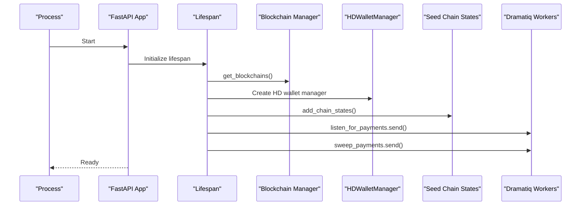

**Diagram sources**
- [server.py](file://server.py#L21-L47)
- [app/blockchain/manager.py](file://app/blockchain/manager.py#L8-L33)
- [app/utils/crypto.py](file://app/utils/crypto.py#L5-L47)

**Section sources**
- [server.py](file://server.py#L21-L47)

### Configuration Management
- Centralized settings with environment detection and dynamic database URL selection
- RPC and Redis URLs, chain configurations loaded from YAML, and secret validation
- Private key and secret key validation for production safety

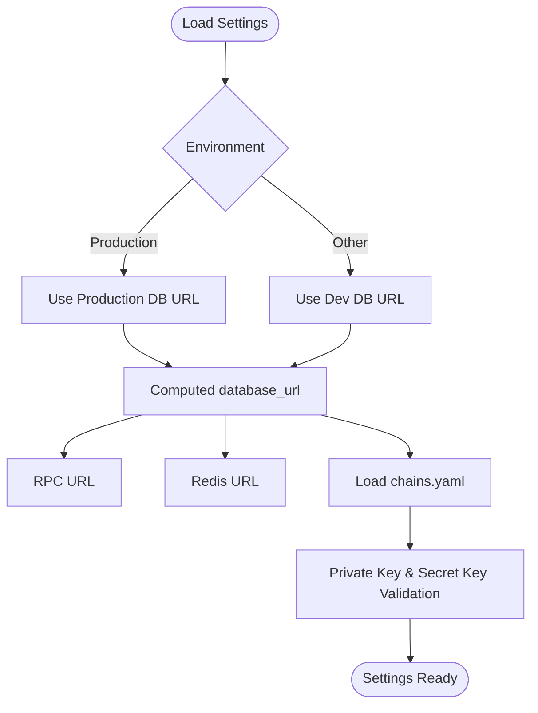

**Diagram sources**
- [app/core/config.py](file://app/core/config.py#L86-L92)
- [app/core/config.py](file://app/core/config.py#L44-L57)
- [app/core/config.py](file://app/core/config.py#L94-L112)

**Section sources**
- [app/core/config.py](file://app/core/config.py#L10-L126)

### Database Layer and Async ORM
- Dynamic URL construction switching between PostgreSQL and SQLite based on environment
- Asynchronous engine creation with asyncpg for PostgreSQL and aiosqlite for SQLite
- Async session factory for dependency injection in services and workers

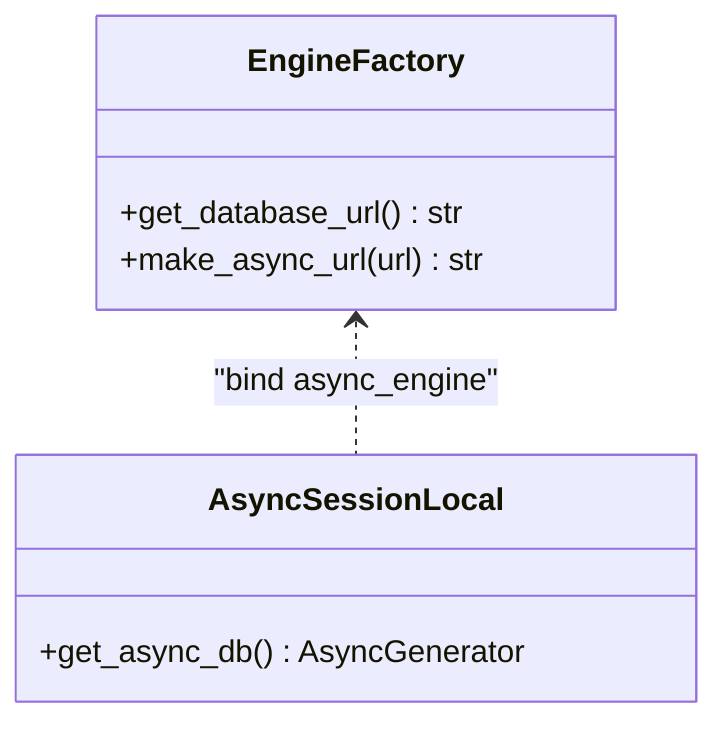

**Diagram sources**
- [app/db/engine.py](file://app/db/engine.py#L5-L32)
- [app/db/async_session.py](file://app/db/async_session.py#L6-L15)

**Section sources**
- [app/db/engine.py](file://app/db/engine.py#L1-L32)
- [app/db/async_session.py](file://app/db/async_session.py#L1-L15)

### Blockchain Abstraction and Chain Management
- BlockchainBase encapsulates async Web3 operations, gas estimation, and transaction building
- Manager constructs chain instances from configuration or falls back to Anvil
- Supports POA networks and caches gas prices for performance

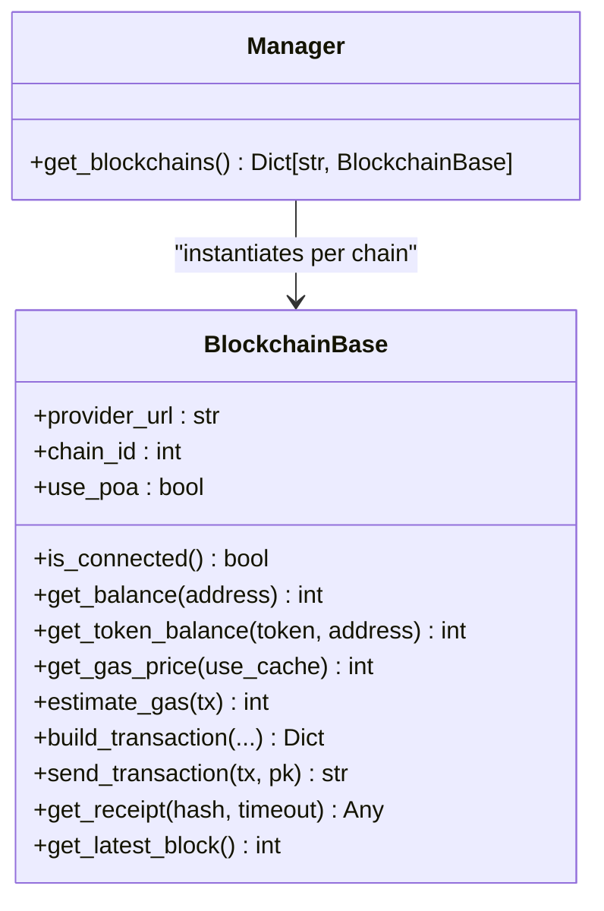

**Diagram sources**
- [app/blockchain/base.py](file://app/blockchain/base.py#L22-L146)
- [app/blockchain/manager.py](file://app/blockchain/manager.py#L8-L33)

**Section sources**
- [app/blockchain/base.py](file://app/blockchain/base.py#L1-L146)
- [app/blockchain/manager.py](file://app/blockchain/manager.py#L1-L33)

### API Layer: Payment Creation Workflow
- Endpoint validates chain and optional token, derives a new payment address via HD wallet, persists the record, and returns the created entity
- Uses synchronous SQLAlchemy session for write operations

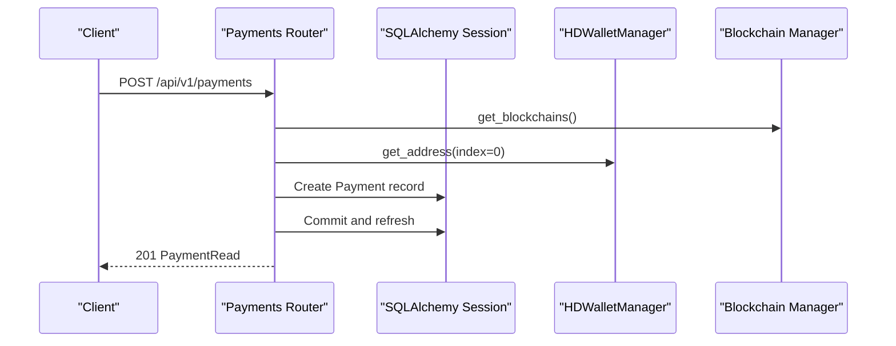

**Diagram sources**
- [app/api/v1/payments.py](file://app/api/v1/payments.py#L18-L54)
- [app/utils/crypto.py](file://app/utils/crypto.py#L27-L47)

**Section sources**
- [app/api/v1/payments.py](file://app/api/v1/payments.py#L1-L62)
- [app/utils/crypto.py](file://app/utils/crypto.py#L1-L90)

### Service Layer: Blockchain Scanning and Confirmation
- ScannerService scans blocks for native and ERC20 transfers matching pending payments
- Applies confirmation thresholds and updates statuses, optionally triggering webhooks
- Uses async ORM for state and payment queries

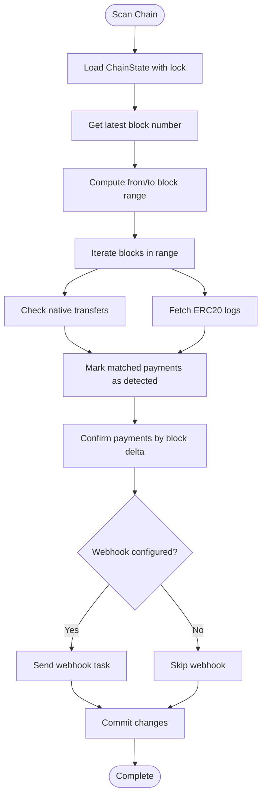

**Diagram sources**
- [app/services/blockchain/scanner.py](file://app/services/blockchain/scanner.py#L20-L134)

**Section sources**
- [app/services/blockchain/scanner.py](file://app/services/blockchain/scanner.py#L1-L134)

### Background Workers: Dramatiq Actors
- Worker actors run continuously, scanning chains and confirming payments at intervals
- Use async sessions and schedule themselves for periodic execution
- Redis serves as the message broker for Dramatiq

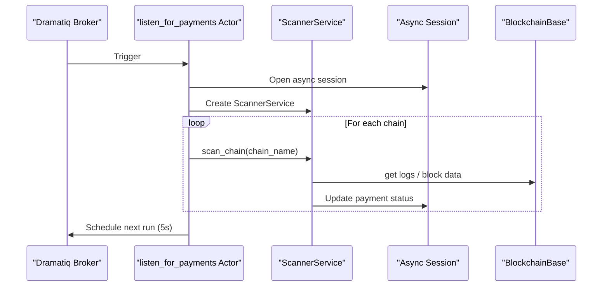

**Diagram sources**
- [app/workers/listener.py](file://app/workers/listener.py#L21-L46)
- [app/services/blockchain/scanner.py](file://app/services/blockchain/scanner.py#L14-L134)
- [app/db/async_session.py](file://app/db/async_session.py#L12-L15)

**Section sources**
- [app/workers/listener.py](file://app/workers/listener.py#L1-L46)

### Data Model: Payments and Related Entities
- Payment entity tracks chain, address, amount, status, confirmations, and expiry
- Enumerated status supports pending, detected, confirmed, paid, expired, settled, failed
- Relationship to Token for ERC20 tracking

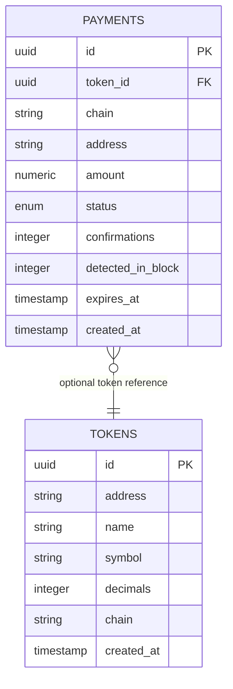

**Diagram sources**
- [app/db/models/payment.py](file://app/db/models/payment.py#L41-L58)

**Section sources**
- [app/db/models/payment.py](file://app/db/models/payment.py#L1-L74)

## Dependency Analysis
- Runtime dependencies include FastAPI, SQLAlchemy 2.0, Web3.py, Dramatiq, Redis, Alembic, and Pydantic settings
- Project metadata declares optional dev dependencies for testing and linting
- Alembic configuration references the project’s env to resolve database URLs

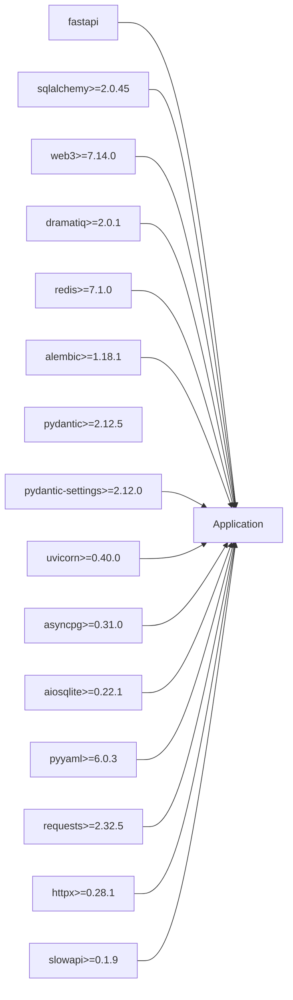

**Diagram sources**
- [requirements.txt](file://requirements.txt#L36-L106)
- [pyproject.toml](file://pyproject.toml#L14-L32)

**Section sources**
- [requirements.txt](file://requirements.txt#L1-L106)
- [pyproject.toml](file://pyproject.toml#L1-L59)
- [alembic.ini](file://alembic.ini#L86-L90)

## Performance Considerations
- Async ORM and engines reduce blocking I/O and improve throughput under concurrent loads
- Gas price caching and batched block scanning minimize RPC calls and network latency
- Redis-backed Dramatiq actors enable decoupled, scalable background processing
- Environment-aware database selection allows lightweight SQLite for development and robust asyncpg for production
- Containerization simplifies scaling and resource isolation

## Troubleshooting Guide
- Health endpoint: Verify application readiness via the root endpoint and blockchain connectivity
- Database migrations: Use Alembic to upgrade/downgrade schemas; ensure DATABASE_URL is set correctly
- Worker scheduling: Confirm Redis availability and that Dramatiq actors are started with the correct broker URL
- Chain configuration: Validate chains.yaml and RPC URLs; ensure POA middleware is enabled when required
- Secrets: Ensure private keys and secret keys meet validation criteria for production environments

**Section sources**
- [server.py](file://server.py#L52-L56)
- [alembic.ini](file://alembic.ini#L86-L90)
- [docker-compose.yml](file://docker-compose.yml#L37-L50)
- [app/core/config.py](file://app/core/config.py#L94-L112)

## Conclusion
cTrip’s architecture leverages modern asynchronous technologies to deliver a scalable, maintainable payment infrastructure across multiple blockchains. FastAPI and SQLAlchemy 2.0 provide a responsive API and robust ORM, while Web3.py and Dramatiq enable efficient blockchain interactions and background processing. Alembic ensures safe schema evolution, and Docker facilitates reproducible deployments. The layered design and microservice-like workers promote separation of concerns and operational flexibility.