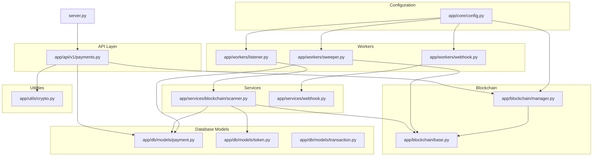
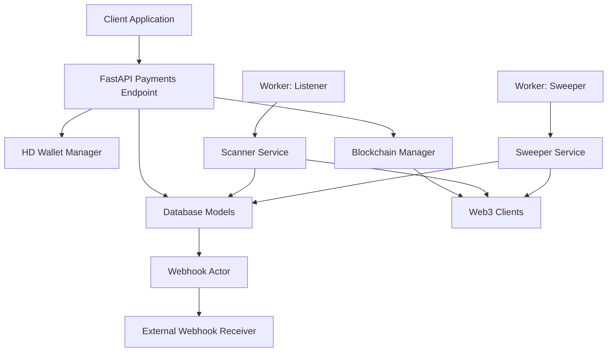
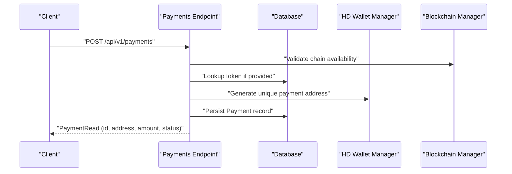
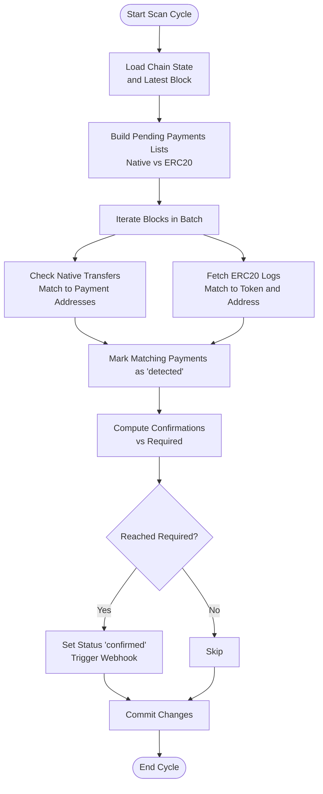
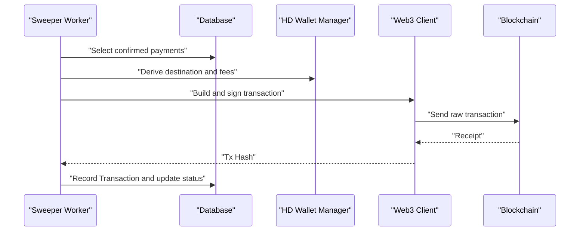
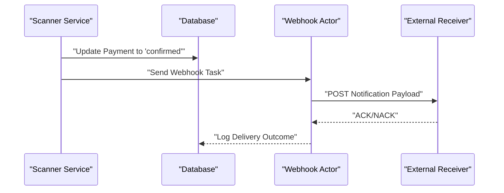
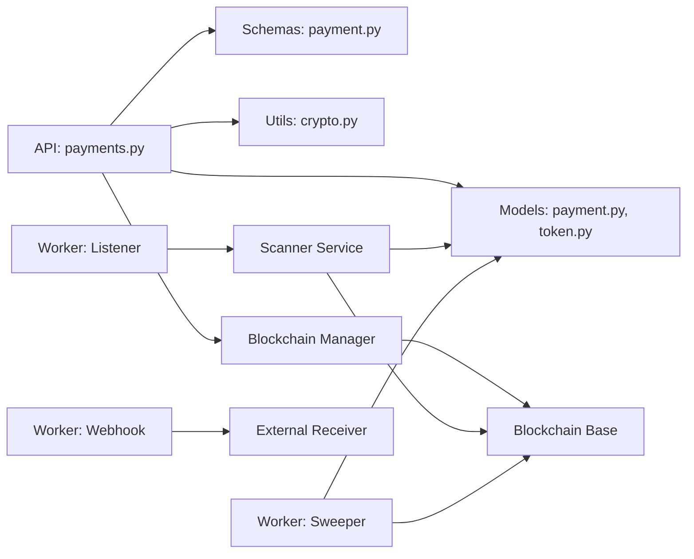

# Use Cases and Benefits

<cite>
**Referenced Files in This Document**
- [README.md](file://README.md)
- [server.py](file://server.py)
- [app/api/v1/payments.py](file://app/api/v1/payments.py)
- [app/schemas/payment.py](file://app/schemas/payment.py)
- [app/db/models/payment.py](file://app/db/models/payment.py)
- [app/db/models/token.py](file://app/db/models/token.py)
- [app/db/models/transaction.py](file://app/db/models/transaction.py)
- [app/blockchain/manager.py](file://app/blockchain/manager.py)
- [app/blockchain/base.py](file://app/blockchain/base.py)
- [app/services/blockchain/scanner.py](file://app/services/blockchain/scanner.py)
- [app/workers/listener.py](file://app/workers/listener.py)
- [app/workers/sweeper.py](file://app/workers/sweeper.py)
- [app/workers/webhook.py](file://app/workers/webhook.py)
- [app/utils/crypto.py](file://app/utils/crypto.py)
- [app/core/config.py](file://app/core/config.py)
</cite>

## Table of Contents
1. [Introduction](#introduction)
2. [Project Structure](#project-structure)
3. [Core Components](#core-components)
4. [Architecture Overview](#architecture-overview)
5. [Detailed Component Analysis](#detailed-component-analysis)
6. [Dependency Analysis](#dependency-analysis)
7. [Performance Considerations](#performance-considerations)
8. [Troubleshooting Guide](#troubleshooting-guide)
9. [Conclusion](#conclusion)
10. [Appendices](#appendices)

## Introduction
cTrip Payment Gateway is a high-performance, multi-chain cryptocurrency payment gateway designed to simplify crypto payments for applications. It offers automated payment detection, confirmation monitoring, and funds sweeping across multiple EVM-compatible blockchains. The system is built with FastAPI, supports asynchronous operations, and leverages background workers for scalable, resilient processing. It integrates HD Wallet management for secure address generation and webhook notifications for real-time updates.

Key capabilities include:
- Multi-chain support for BSC, Ethereum, and local testing environments
- Automated detection of native and ERC20 transfers
- Asynchronous API and database operations
- Background workers for scanning and sweeping
- Webhooks for payment status notifications
- Migration system using Alembic

These features enable practical use cases such as e-commerce integration, decentralized exchange liquidity provision, blockchain-based service monetization, and cross-chain payment facilitation.

**Section sources**
- [README.md](file://README.md#L1-L87)

## Project Structure
The repository is organized into modular components that separate concerns across API, blockchain integration, database models, services, workers, and configuration. This layout supports maintainability, scalability, and clear separation of responsibilities.

**Diagram sources**
- [server.py](file://server.py#L1-L56)
- [app/api/v1/payments.py](file://app/api/v1/payments.py#L1-L62)
- [app/services/blockchain/scanner.py](file://app/services/blockchain/scanner.py#L1-L134)
- [app/workers/listener.py](file://app/workers/listener.py#L1-L46)
- [app/workers/sweeper.py](file://app/workers/sweeper.py#L1-L40)
- [app/workers/webhook.py](file://app/workers/webhook.py#L1-L37)
- [app/blockchain/manager.py](file://app/blockchain/manager.py#L1-L33)
- [app/blockchain/base.py](file://app/blockchain/base.py#L1-L146)
- [app/db/models/payment.py](file://app/db/models/payment.py#L1-L74)
- [app/db/models/token.py](file://app/db/models/token.py#L1-L15)
- [app/db/models/transaction.py](file://app/db/models/transaction.py#L1-L40)
- [app/utils/crypto.py](file://app/utils/crypto.py#L1-L90)
- [app/core/config.py](file://app/core/config.py#L1-L126)

**Section sources**
- [README.md](file://README.md#L71-L79)
- [server.py](file://server.py#L1-L56)

## Core Components
This section outlines the primary components and their roles in enabling the gateway’s capabilities.

- API Layer
  - Payment creation endpoint validates chain and token, generates a unique payment address via HD Wallet, and persists payment metadata.
  - Schemas define request/response structures and constraints for payment operations.

- Blockchain Integration
  - Manager resolves configured chains and instantiates appropriate blockchain clients.
  - Base client encapsulates Web3 operations, gas estimation, transaction building, and receipt polling.

- Services
  - Scanner service detects incoming native and ERC20 payments by scanning blocks and matching logs, then confirms transactions based on required confirmations.
  - Webhook service handles asynchronous notifications for payment events.

- Workers
  - Listener triggers periodic scanning and confirmation checks across configured chains.
  - Sweeper periodically sweeps confirmed payments using the HD Wallet.
  - Webhook actor sends notifications to external systems.

- Database Models
  - Payment model tracks payment lifecycle, amounts, confirmations, and timestamps.
  - Token model defines supported tokens per chain.
  - Transaction model records sweep transactions and statuses.

- Utilities and Configuration
  - HD Wallet manager derives addresses deterministically for secure, auditable payment routing.
  - Settings centralizes environment-specific configuration, secrets, and chain definitions.

**Section sources**
- [app/api/v1/payments.py](file://app/api/v1/payments.py#L1-L62)
- [app/schemas/payment.py](file://app/schemas/payment.py#L1-L62)
- [app/blockchain/manager.py](file://app/blockchain/manager.py#L1-L33)
- [app/blockchain/base.py](file://app/blockchain/base.py#L1-L146)
- [app/services/blockchain/scanner.py](file://app/services/blockchain/scanner.py#L1-L134)
- [app/workers/listener.py](file://app/workers/listener.py#L1-L46)
- [app/workers/sweeper.py](file://app/workers/sweeper.py#L1-L40)
- [app/workers/webhook.py](file://app/workers/webhook.py#L1-L37)
- [app/db/models/payment.py](file://app/db/models/payment.py#L1-L74)
- [app/db/models/token.py](file://app/db/models/token.py#L1-L15)
- [app/db/models/transaction.py](file://app/db/models/transaction.py#L1-L40)
- [app/utils/crypto.py](file://app/utils/crypto.py#L1-L90)
- [app/core/config.py](file://app/core/config.py#L1-L126)

## Architecture Overview
The system follows an asynchronous, event-driven architecture with clear separation between API, background processing, blockchain interaction, and persistence.

**Diagram sources**
- [server.py](file://server.py#L21-L47)
- [app/api/v1/payments.py](file://app/api/v1/payments.py#L12-L54)
- [app/blockchain/manager.py](file://app/blockchain/manager.py#L8-L32)
- [app/blockchain/base.py](file://app/blockchain/base.py#L34-L145)
- [app/services/blockchain/scanner.py](file://app/services/blockchain/scanner.py#L14-L134)
- [app/workers/listener.py](file://app/workers/listener.py#L21-L46)
- [app/workers/sweeper.py](file://app/workers/sweeper.py#L19-L40)
- [app/workers/webhook.py](file://app/workers/webhook.py#L13-L37)

## Detailed Component Analysis

### Payment Creation Workflow
This sequence illustrates how a client creates a payment, receives a unique address, and how the system validates chain and token eligibility.

**Diagram sources**
- [app/api/v1/payments.py](file://app/api/v1/payments.py#L18-L54)
- [app/blockchain/manager.py](file://app/blockchain/manager.py#L8-L32)
- [app/db/models/token.py](file://app/db/models/token.py#L6-L15)
- [app/utils/crypto.py](file://app/utils/crypto.py#L27-L46)

**Section sources**
- [app/api/v1/payments.py](file://app/api/v1/payments.py#L18-L54)
- [app/schemas/payment.py](file://app/schemas/payment.py#L20-L41)

### Payment Detection and Confirmation
The scanner service continuously scans blocks to detect incoming payments and confirms them based on required confirmations. It distinguishes between native and ERC20 transfers.

**Diagram sources**
- [app/services/blockchain/scanner.py](file://app/services/blockchain/scanner.py#L20-L134)
- [app/db/models/payment.py](file://app/db/models/payment.py#L41-L57)

**Section sources**
- [app/services/blockchain/scanner.py](file://app/services/blockchain/scanner.py#L20-L134)
- [app/db/models/payment.py](file://app/db/models/payment.py#L21-L57)

### Funds Sweeping and Settlement
The sweeper worker aggregates confirmed payments and builds transactions to sweep funds using the HD Wallet, ensuring operational efficiency and reduced overhead for platform operators.

**Diagram sources**
- [app/workers/sweeper.py](file://app/workers/sweeper.py#L19-L40)
- [app/utils/crypto.py](file://app/utils/crypto.py#L5-L46)
- [app/blockchain/base.py](file://app/blockchain/base.py#L93-L145)
- [app/db/models/transaction.py](file://app/db/models/transaction.py#L29-L40)

**Section sources**
- [app/workers/sweeper.py](file://app/workers/sweeper.py#L19-L40)
- [app/utils/crypto.py](file://app/utils/crypto.py#L5-L46)
- [app/blockchain/base.py](file://app/blockchain/base.py#L93-L145)
- [app/db/models/transaction.py](file://app/db/models/transaction.py#L29-L40)

### Webhook Notifications
When payments reach confirmed status, the system dispatches webhook notifications asynchronously to external systems for real-time integration.

**Diagram sources**
- [app/services/blockchain/scanner.py](file://app/services/blockchain/scanner.py#L117-L131)
- [app/workers/webhook.py](file://app/workers/webhook.py#L13-L37)

**Section sources**
- [app/services/blockchain/scanner.py](file://app/services/blockchain/scanner.py#L117-L131)
- [app/workers/webhook.py](file://app/workers/webhook.py#L13-L37)

## Dependency Analysis
The system exhibits strong modularity with clear dependencies between modules. The API depends on database models, schemas, and blockchain utilities. Workers orchestrate services and interact with blockchain clients and the database. Configuration drives chain selection and runtime behavior.

**Diagram sources**
- [app/api/v1/payments.py](file://app/api/v1/payments.py#L1-L11)
- [app/db/models/payment.py](file://app/db/models/payment.py#L41-L57)
- [app/db/models/token.py](file://app/db/models/token.py#L6-L15)
- [app/schemas/payment.py](file://app/schemas/payment.py#L12-L41)
- [app/utils/crypto.py](file://app/utils/crypto.py#L5-L46)
- [app/blockchain/manager.py](file://app/blockchain/manager.py#L8-L32)
- [app/blockchain/base.py](file://app/blockchain/base.py#L22-L145)
- [app/services/blockchain/scanner.py](file://app/services/blockchain/scanner.py#L14-L134)
- [app/workers/listener.py](file://app/workers/listener.py#L21-L46)
- [app/workers/sweeper.py](file://app/workers/sweeper.py#L19-L40)
- [app/workers/webhook.py](file://app/workers/webhook.py#L13-L37)

**Section sources**
- [app/core/config.py](file://app/core/config.py#L44-L56)
- [app/blockchain/manager.py](file://app/blockchain/manager.py#L8-L32)

## Performance Considerations
- Asynchronous Operations: The API and services leverage asynchronous patterns to improve throughput and reduce latency under concurrent load.
- Background Workers: Dramatiq actors process scanning and sweeping independently, preventing blocking of the main API and enabling horizontal scaling.
- Gas Estimation and Caching: The base blockchain client caches gas prices and uses buffered gas limits to optimize transaction costs and reduce RPC calls.
- Batch Scanning: The scanner processes blocks in batches to balance responsiveness and resource usage.
- Confirmation Thresholds: Adjustable confirmations reduce false positives while minimizing settlement delays.

[No sources needed since this section provides general guidance]

## Troubleshooting Guide
Common operational issues and their mitigations:

- Chain Configuration Issues
  - Symptom: Unsupported chain errors during payment creation.
  - Resolution: Verify chain entries in configuration and ensure RPC URLs are set correctly.

- Payment Not Detected
  - Symptom: Payments remain pending despite inbound transfers.
  - Resolution: Confirm scanner is running, check batch sizes and confirmations thresholds, and verify chain state last scanned block.

- Webhook Failures
  - Symptom: Webhooks not delivered or delayed.
  - Resolution: Check webhook URL and secret configuration, inspect actor logs, and review retry behavior.

- Database Connectivity
  - Symptom: Operational errors when persisting or querying payment data.
  - Resolution: Validate database URL per environment and ensure migrations are applied.

**Section sources**
- [app/api/v1/payments.py](file://app/api/v1/payments.py#L25-L34)
- [app/services/blockchain/scanner.py](file://app/services/blockchain/scanner.py#L24-L39)
- [app/workers/webhook.py](file://app/workers/webhook.py#L13-L37)
- [app/core/config.py](file://app/core/config.py#L84-L92)

## Conclusion
cTrip Payment Gateway delivers a robust, extensible foundation for integrating cryptocurrency payments across multiple blockchains. Its asynchronous architecture, automated detection and confirmation, HD Wallet-based address management, and webhook integrations provide clear benefits for merchants, developers, and platform operators. By reducing infrastructure complexity, improving operational efficiency, and enabling real-time tracking and settlement, cTrip helps organizations accelerate adoption of crypto payments with confidence.

[No sources needed since this section summarizes without analyzing specific files]

## Appendices

### Use Case Scenarios and Benefits

- E-commerce Integration for Accepting Cryptocurrency Payments
  - Scenario: An online retailer accepts ETH and USDC on Ethereum and BSC.
  - Benefits: Merchants gain access to multiple cryptocurrencies without maintaining separate banking infrastructures; developers receive a ready-to-use payment processing solution; platform operators reduce operational overhead.
  - Integration Pattern: Use the payment creation endpoint to generate unique addresses per order; rely on scanner and sweeper for detection and settlement; configure tokens and chains via configuration files.

- Decentralized Exchange Liquidity Provision
  - Scenario: A DEX uses cTrip to automate liquidity provisioning and withdrawal.
  - Benefits: Automated sweeping reduces manual intervention; real-time tracking ensures accurate bookkeeping; multi-chain support simplifies cross-chain swaps.
  - Integration Pattern: Configure multiple chains and tokens; schedule sweeper runs to aggregate liquidity; monitor transaction models for audit trails.

- Blockchain-Based Service Monetization
  - Scenario: A SaaS platform bills customers in native tokens or stablecoins.
  - Benefits: Seamless multi-currency billing; transparent, immutable records; reduced chargeback risks.
  - Integration Pattern: Issue invoices with payment addresses; track confirmations; emit webhooks to internal billing systems.

- Cross-Chain Payment Facilitation
  - Scenario: A marketplace enables payments across Ethereum and BSC with unified settlement.
  - Benefits: Unified UX for users; streamlined reconciliation; lower operational costs.
  - Integration Pattern: Configure chains and tokens; use scanner to detect incoming payments on each chain; sweep funds into a single operational wallet.

### Expected Performance Metrics (Conceptual)
- Throughput: Hundreds of concurrent payment requests with sub-second response times for payment creation.
- Detection Latency: Sub-minute detection for native transfers; ERC20 detection bounded by block time and batch size.
- Settlement Latency: Immediate confirmation upon reaching required confirmations; sweeping completes within a few minutes post-confirmation.
- Scalability: Horizontal scaling of workers and database connections; sharding of chain states for multi-chain deployments.

### Cost Savings and Competitive Advantages
- Cost Savings: Reduced engineering effort compared to building custom blockchain integrations; lower maintenance overhead with managed workers and migrations.
- Competitive Advantages: Faster time-to-market for crypto payments; improved reliability with asynchronous processing and robust error handling; transparent auditability via database models.

### Security and Operational Efficiency
- Security Improvements: Deterministic HD Wallet derivation for auditable address generation; validated private keys and secrets; minimal exposure of sensitive credentials.
- Operational Efficiency: Automated scanning and sweeping reduce manual oversight; webhook notifications enable real-time integrations; configurable chains and tokens streamline onboarding.

[No sources needed since this section provides general guidance]