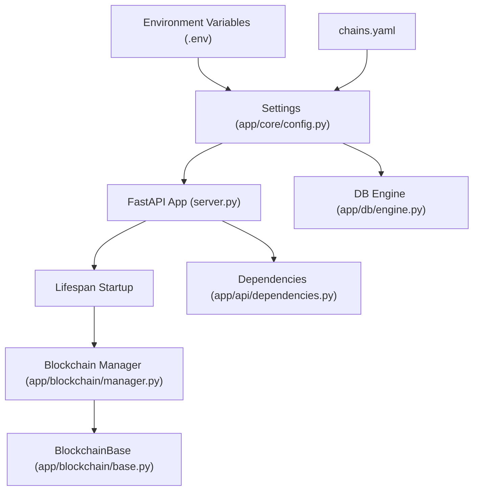
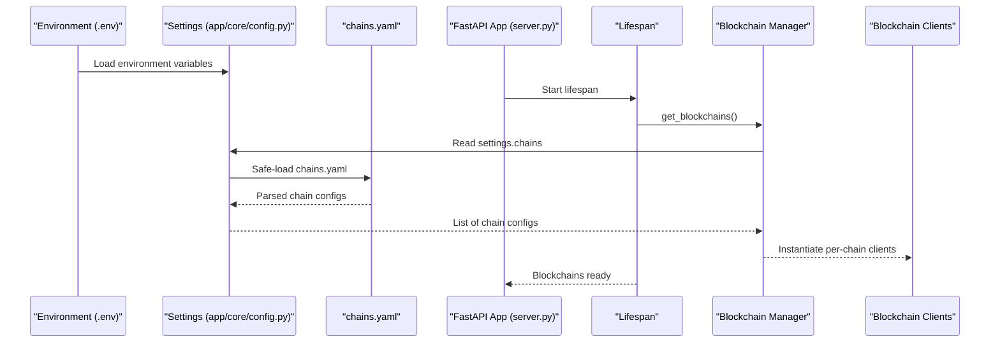
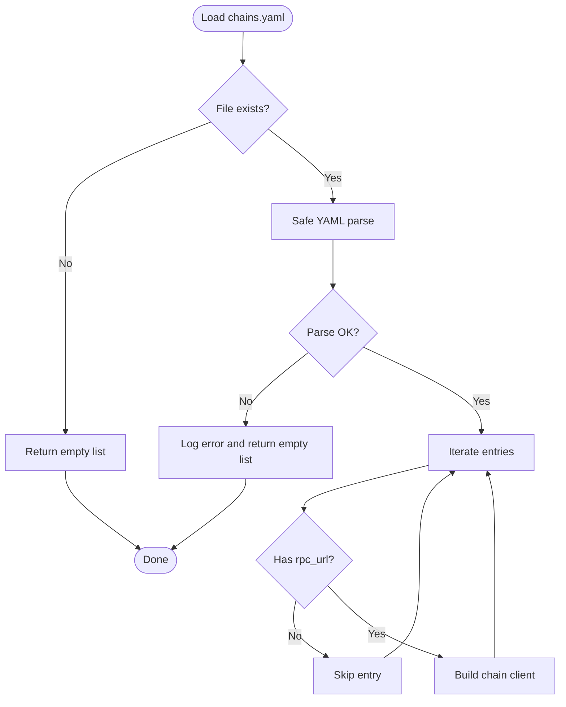
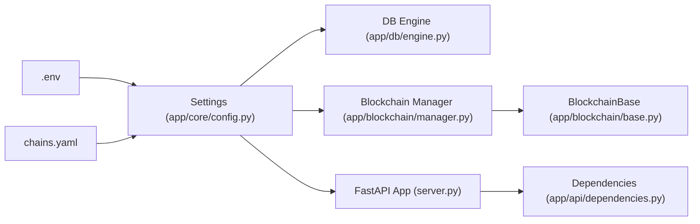

# Configuration Security

<cite>
**Referenced Files in This Document**
- [app/core/config.py](file://app/core/config.py)
- [chains.yaml](file://chains.yaml)
- [docker-compose.yml](file://docker-compose.yml)
- [Dockerfile](file://Dockerfile)
- [server.py](file://server.py)
- [app/blockchain/manager.py](file://app/blockchain/manager.py)
- [app/blockchain/base.py](file://app/blockchain/base.py)
- [app/utils/crypto.py](file://app/utils/crypto.py)
- [app/db/engine.py](file://app/db/engine.py)
- [app/api/dependencies.py](file://app/api/dependencies.py)
- [app/services/webhook.py](file://app/services/webhook.py)
- [requirements.txt](file://requirements.txt)
</cite>

## Table of Contents
1. [Introduction](#introduction)
2. [Project Structure](#project-structure)
3. [Core Components](#core-components)
4. [Architecture Overview](#architecture-overview)
5. [Detailed Component Analysis](#detailed-component-analysis)
6. [Dependency Analysis](#dependency-analysis)
7. [Performance Considerations](#performance-considerations)
8. [Troubleshooting Guide](#troubleshooting-guide)
9. [Conclusion](#conclusion)
10. [Appendices](#appendices)

## Introduction
This document provides comprehensive configuration security guidance for the cTrip Payment Gateway. It focuses on environment variable security practices, sensitive data handling, encryption at rest, access control, configuration file security for chains.yaml, secrets management for API keys and RPC endpoints, validation and defaults, runtime configuration updates, secure deployment patterns, auditing, change management, protection of configuration data in transit and storage, and secure backup practices. It also highlights common configuration vulnerabilities and mitigation strategies observed in the codebase.

## Project Structure
The configuration system spans environment-driven settings, static YAML configuration, blockchain initialization, and runtime dependencies. Key areas include:
- Centralized settings model with environment variable binding and validators
- Static chain configuration loaded at startup
- Runtime dependencies injected via FastAPI lifespan
- Blockchain providers initialized from configuration
- Database and Redis connectivity managed via settings

**Diagram sources**
- [app/core/config.py](file://app/core/config.py#L10-L126)
- [chains.yaml](file://chains.yaml#L1-L24)
- [server.py](file://server.py#L21-L47)
- [app/blockchain/manager.py](file://app/blockchain/manager.py#L8-L32)
- [app/blockchain/base.py](file://app/blockchain/base.py#L22-L44)
- [app/db/engine.py](file://app/db/engine.py#L5-L31)
- [app/api/dependencies.py](file://app/api/dependencies.py#L5-L14)

**Section sources**
- [app/core/config.py](file://app/core/config.py#L10-L126)
- [chains.yaml](file://chains.yaml#L1-L24)
- [server.py](file://server.py#L21-L47)
- [app/blockchain/manager.py](file://app/blockchain/manager.py#L8-L32)
- [app/blockchain/base.py](file://app/blockchain/base.py#L22-L44)
- [app/db/engine.py](file://app/db/engine.py#L5-L31)
- [app/api/dependencies.py](file://app/api/dependencies.py#L5-L14)

## Core Components
- Settings model encapsulates environment, database URLs, RPC endpoints, Redis, chains YAML path, mnemonic, webhook URL/secret, private key, and application secret. It validates Ethereum private keys and enforces production secret key changes.
- chains.yaml defines supported chains and their RPC endpoints and tokens. The settings loader reads and parses this file safely.
- Blockchain manager constructs blockchain clients from settings-derived configuration, with a fallback to a default RPC if configuration is missing.
- Database engine selects production or development URLs based on environment and creates synchronous and asynchronous engines.
- Dependencies inject blockchain instances and HD wallet manager into request handlers during lifespan.

Security-relevant behaviors:
- Sensitive fields are typed as SecretStr and validated at assignment.
- Private key validation ensures a valid Ethereum key.
- Production secret enforcement prevents default secret usage.
- Chains YAML is loaded via safe YAML parsing with defensive error handling.
- Environment variables are bound to settings with case-insensitive lookup and ignored extras.

**Section sources**
- [app/core/config.py](file://app/core/config.py#L10-L126)
- [chains.yaml](file://chains.yaml#L12-L24)
- [app/blockchain/manager.py](file://app/blockchain/manager.py#L8-L32)
- [app/db/engine.py](file://app/db/engine.py#L5-L31)
- [app/api/dependencies.py](file://app/api/dependencies.py#L5-L14)

## Architecture Overview
The configuration architecture integrates environment variables, static YAML, and runtime initialization. The FastAPI lifespan loads chain configurations, initializes HD wallet, seeds chain states, and starts background workers. Blockchain clients are created from settings and used by services.

**Diagram sources**
- [app/core/config.py](file://app/core/config.py#L44-L56)
- [chains.yaml](file://chains.yaml#L12-L24)
- [app/blockchain/manager.py](file://app/blockchain/manager.py#L8-L32)
- [server.py](file://server.py#L21-L47)

## Detailed Component Analysis

### Environment Variable Security and Sensitive Data Handling
- Binding: Settings bind to a .env file located relative to the settings module path. Environment variables are case-insensitive and extra fields are ignored.
- Sensitive fields: private_key and secret_key are SecretStr. Validators enforce:
  - Private key must represent a valid Ethereum key.
  - In production, secret_key must not match default values.
- Defaults: Non-sensitive defaults are provided for database URLs, RPC, Redis, mnemonic, webhook URL/secret. Sensitive defaults include a test mnemonic and a placeholder application secret.
- Access control: No explicit ACLs are present; secrets are typed and validated to reduce accidental exposure.

Mitigations and best practices:
- Rotate production secret_key immediately after deployment.
- Avoid committing secrets to source control; rely on environment injection.
- Restrict filesystem permissions for .env and application directories.
- Use secrets managers or vaults for dynamic rotation.

**Section sources**
- [app/core/config.py](file://app/core/config.py#L115-L122)
- [app/core/config.py](file://app/core/config.py#L94-L112)

### Encryption at Rest
- Database encryption: PostgreSQL supports transparent data encryption and TLS for connections. Configure database TLS and encryption-at-rest policies externally to the application.
- Local SQLite (dev): The development database path is configurable but not encrypted by default; avoid storing sensitive data in dev databases.
- Logs and caches: Redis and logs should be secured with network controls and encryption where applicable.

Recommendations:
- Enable TLS for database connections and require encrypted storage.
- Use OS-level encryption for persistent volumes backing Postgres and Redis.
- Avoid logging secrets; sanitize logs and disable verbose secrets output.

**Section sources**
- [app/core/config.py](file://app/core/config.py#L18-L26)
- [app/db/engine.py](file://app/db/engine.py#L22-L31)

### Access Control Mechanisms
- Network isolation: Database and Redis containers are isolated in Docker Compose. Restrict service exposure to internal networks.
- Container privileges: The Dockerfile does not elevate privileges; keep containers minimal and non-root where feasible.
- Secrets injection: Private key and mnemonic are passed via environment variables; ensure only authorized processes can read these variables.

Recommendations:
- Use Kubernetes RBAC or equivalent to restrict pod/service account permissions.
- Limit environment variable exposure; avoid printing secrets in logs.
- Enforce least privilege for database users and Redis access.

**Section sources**
- [docker-compose.yml](file://docker-compose.yml#L4-L18)
- [docker-compose.yml](file://docker-compose.yml#L26-L32)
- [Dockerfile](file://Dockerfile#L27-L32)

### Configuration File Security for chains.yaml
- Validation: The settings property safely loads chains.yaml using safe YAML parsing. Errors are caught and logged, returning an empty list to prevent startup failures.
- Sanitization: The blockchain manager iterates over parsed configs, extracting name and rpc_url, skipping entries without rpc_url. Unknown chain names fall back to a generic base class.
- Secure loading: The YAML path is configurable via settings.chains_yaml_path. Ensure the application process has read-only access to the file and restrict filesystem permissions.

Recommendations:
- Sign and verify chains.yaml externally if distributed.
- Use immutable deployments to prevent tampering.
- Monitor file integrity and ownership; alert on unauthorized changes.

**Diagram sources**
- [app/core/config.py](file://app/core/config.py#L44-L56)
- [app/blockchain/manager.py](file://app/blockchain/manager.py#L12-L26)

**Section sources**
- [app/core/config.py](file://app/core/config.py#L44-L56)
- [app/blockchain/manager.py](file://app/blockchain/manager.py#L12-L26)
- [chains.yaml](file://chains.yaml#L12-L24)

### Secrets Management Strategies
- API keys and RPC endpoints:
  - RPC endpoints are configurable via environment variables and chains.yaml. Prefer environment variables for runtime overrides and keep hardcoded defaults minimal.
  - For third-party RPC providers, inject API keys via environment variables and avoid embedding them in code or YAML.
- Database credentials:
  - DATABASE_URL is injected via environment variables. Ensure strong credentials and rotate passwords regularly.
- Application secrets:
  - private_key is required and validated as a valid Ethereum key. Store in a secrets manager and inject via environment variables.
  - secret_key must be changed in production; the validator enforces this.

Recommendations:
- Use a secrets manager (e.g., HashiCorp Vault, AWS Secrets Manager) to inject secrets at runtime.
- Implement secret rotation policies and revocation checks.
- Encrypt secrets at rest and in transit; enforce strict access controls.

**Section sources**
- [app/core/config.py](file://app/core/config.py#L28-L37)
- [app/core/config.py](file://app/core/config.py#L74-L82)
- [docker-compose.yml](file://docker-compose.yml#L27-L32)
- [app/blockchain/manager.py](file://app/blockchain/manager.py#L13-L26)

### Configuration Validation, Defaults, and Runtime Updates
- Validation:
  - Private key is validated as a valid Ethereum key.
  - Production secret enforcement prevents default secret usage.
  - Extra environment fields are ignored to reduce risk of misconfiguration.
- Defaults:
  - Conservative defaults are provided for non-sensitive settings; sensitive defaults are minimal and test-like.
- Runtime updates:
  - Settings re-validate on assignment due to validate_assignment enabled.

Recommendations:
- Add schema-level validation for chains.yaml entries (e.g., required fields, allowed values).
- Implement hot-reload hooks for chains.yaml with graceful restarts for safety.
- Audit and log configuration changes at startup and on reload.

**Section sources**
- [app/core/config.py](file://app/core/config.py#L94-L112)
- [app/core/config.py](file://app/core/config.py#L115-L122)

### Secure Deployment Patterns
- Containerization:
  - The Dockerfile sets non-writable bytecode cache and unbuffered Python output to reduce side channels.
  - Exposes only necessary ports; host binds are explicit.
- Orchestration:
  - docker-compose isolates services and mounts application code; restrict volume permissions and avoid mounting secrets as writable.
- Networking:
  - Services depend on db and redis; expose only necessary ports externally.

Recommendations:
- Use immutable images and signed base layers.
- Apply pod security standards and network policies.
- Store secrets outside containers; mount only read-only where possible.

**Section sources**
- [Dockerfile](file://Dockerfile#L27-L32)
- [docker-compose.yml](file://docker-compose.yml#L20-L36)

### Configuration Auditing and Change Management
- Auditing:
  - Log configuration load errors and validation failures.
  - Record environment variable overrides and effective settings at startup.
- Change management:
  - Approve and track changes to .env, chains.yaml, and deployment manifests.
  - Use blue-green or canary deployments for configuration rollouts.

Recommendations:
- Integrate configuration audits into CI/CD pipelines.
- Require peer review for any configuration changes affecting security.

**Section sources**
- [app/core/config.py](file://app/core/config.py#L54-L56)
- [server.py](file://server.py#L21-L47)

### Protecting Configuration Data in Transit and Storage
- In transit:
  - Use HTTPS/TLS for RPC endpoints and webhook delivery.
  - Enforce mutual TLS for inter-service communication if applicable.
- At rest:
  - Enable database encryption and encrypted volumes.
  - Restrict filesystem permissions for .env and configuration files.

Recommendations:
- Enforce TLS everywhere; disable plain HTTP.
- Use encrypted storage for backups and snapshots.

**Section sources**
- [app/blockchain/base.py](file://app/blockchain/base.py#L34-L36)
- [app/services/webhook.py](file://app/services/webhook.py#L12-L36)

### Secure Backup Practices
- Back up .env and chains.yaml separately from application binaries.
- Encrypt backups and store offsite; apply retention policies.
- Test restoration procedures periodically.

[No sources needed since this section provides general guidance]

## Dependency Analysis
Configuration dependencies span environment variables, static YAML, blockchain initialization, and database connectivity.

**Diagram sources**
- [app/core/config.py](file://app/core/config.py#L115-L122)
- [chains.yaml](file://chains.yaml#L12-L24)
- [app/db/engine.py](file://app/db/engine.py#L5-L31)
- [app/blockchain/manager.py](file://app/blockchain/manager.py#L8-L32)
- [app/blockchain/base.py](file://app/blockchain/base.py#L22-L44)
- [server.py](file://server.py#L21-L47)
- [app/api/dependencies.py](file://app/api/dependencies.py#L5-L14)

**Section sources**
- [app/core/config.py](file://app/core/config.py#L115-L122)
- [app/db/engine.py](file://app/db/engine.py#L5-L31)
- [app/blockchain/manager.py](file://app/blockchain/manager.py#L8-L32)
- [app/blockchain/base.py](file://app/blockchain/base.py#L22-L44)
- [server.py](file://server.py#L21-L47)
- [app/api/dependencies.py](file://app/api/dependencies.py#L5-L14)

## Performance Considerations
- YAML parsing is lightweight; caching parsed chains in memory avoids repeated disk I/O.
- Database URL selection is constant-time; ensure connection pools are sized appropriately.
- Blockchain initialization occurs once at startup; avoid frequent re-initialization.

[No sources needed since this section provides general guidance]

## Troubleshooting Guide
Common configuration issues and mitigations:
- Invalid private key:
  - Symptom: Validation error during settings load.
  - Mitigation: Ensure private key is a valid Ethereum key and injected via environment variable.
- Production secret unchanged:
  - Symptom: Validation error indicating default secret must be changed.
  - Mitigation: Set secret_key to a strong, unique value in production.
- chains.yaml load failure:
  - Symptom: Empty chain list and error log.
  - Mitigation: Fix YAML syntax and ensure file readability; verify path via settings.chains_yaml_path.
- Missing RPC URL:
  - Symptom: Blockchain client skipped or fallback used.
  - Mitigation: Provide rpc_url in chains.yaml or configure settings.rpc_url.

**Section sources**
- [app/core/config.py](file://app/core/config.py#L94-L112)
- [app/core/config.py](file://app/core/config.py#L44-L56)
- [app/blockchain/manager.py](file://app/blockchain/manager.py#L12-L30)

## Conclusion
The cTrip Payment Gateway employs a robust configuration model with environment-driven settings, safe YAML loading, and validators for sensitive data. To harden security further, adopt secrets managers, enforce encryption at rest and in transit, implement strict access controls, and establish auditing and change management processes. These steps will strengthen the overall configuration security posture while maintaining operational reliability.

## Appendices

### Appendix A: Configuration Reference
- Environment variables:
  - DATABASE_URL, REDIS_URL, RPC_URL, PRIVATE_KEY, MNEMONIC, ENV
- Settings fields:
  - env, database_url_prod, database_url_dev, rpc_url, redis_url, chains_yaml_path, mnemonic, webhook_url, webhook_secret, private_key, secret_key
- Chains YAML:
  - name, rpc_url, tokens (symbol, address, decimals)

**Section sources**
- [docker-compose.yml](file://docker-compose.yml#L26-L32)
- [app/core/config.py](file://app/core/config.py#L12-L82)
- [chains.yaml](file://chains.yaml#L12-L24)