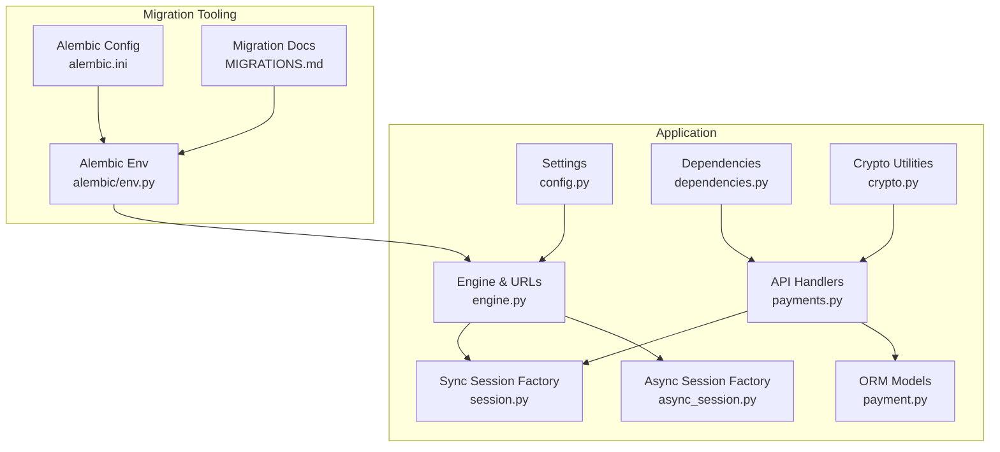
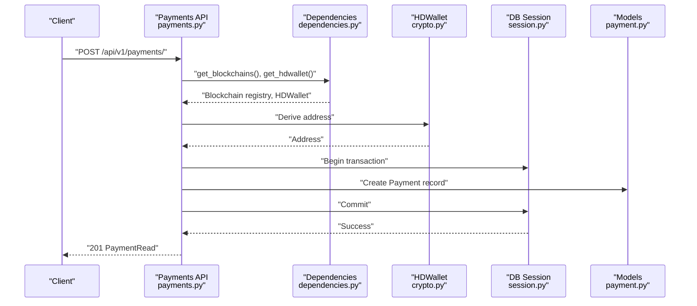
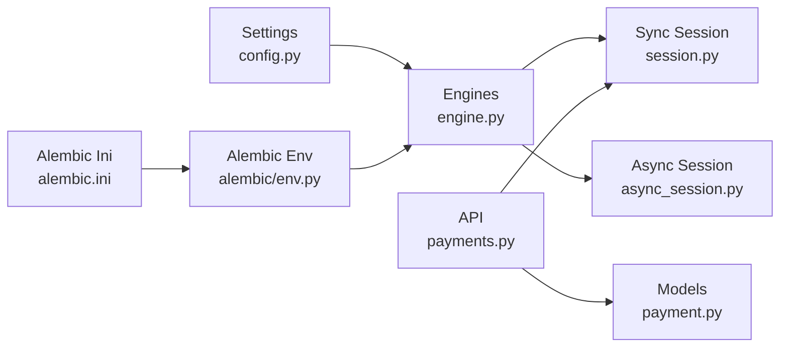

# Database Security

<cite>
**Referenced Files in This Document**
- [engine.py](https://github.com/rakibhossain72/ctrip/blob/main/app/db/engine.py)
- [session.py](https://github.com/rakibhossain72/ctrip/blob/main/app/db/session.py)
- [async_session.py](https://github.com/rakibhossain72/ctrip/blob/main/app/db/async_session.py)
- [config.py](https://github.com/rakibhossain72/ctrip/blob/main/app/core/config.py)
- [payments.py](https://github.com/rakibhossain72/ctrip/blob/main/app/api/v1/payments.py)
- [payment.py](https://github.com/rakibhossain72/ctrip/blob/main/app/db/models/payment.py)
- [dependencies.py](https://github.com/rakibhossain72/ctrip/blob/main/app/api/dependencies.py)
- [crypto.py](https://github.com/rakibhossain72/ctrip/blob/main/app/utils/crypto.py)
- [env.py](https://github.com/rakibhossain72/ctrip/blob/main/alembic/env.py)
- [alembic.ini](https://github.com/rakibhossain72/ctrip/blob/main/alembic.ini)
- [MIGRATIONS.md](https://github.com/rakibhossain72/ctrip/blob/main/MIGRATIONS.md)
- [requirements.txt](https://github.com/rakibhossain72/ctrip/blob/main/requirements.txt)
</cite>

## Table of Contents
1. [Introduction](#introduction)
2. [Project Structure](#project-structure)
3. [Core Components](#core-components)
4. [Architecture Overview](#architecture-overview)
5. [Detailed Component Analysis](#detailed-component-analysis)
6. [Dependency Analysis](#dependency-analysis)
7. [Performance Considerations](#performance-considerations)
8. [Troubleshooting Guide](#troubleshooting-guide)
9. [Conclusion](#conclusion)
10. [Appendices](#appendices)

## Introduction
This document provides comprehensive database security guidance for the cTrip Payment Gateway. It focuses on connection encryption, certificate management, secure connection pooling, access control, privilege management, SQL injection prevention, audit logging, backup encryption, secure retention and deletion, database hardening, vulnerability assessment, and secure administration practices. Where applicable, the analysis references actual code and configuration files from the repository.

## Project Structure
The database layer is implemented with SQLAlchemy and Alembic. Connections are configured via environment-driven settings, with separate development and production URLs. Sessions are created using scoped factories, and asynchronous sessions are supported for PostgreSQL. Migrations are managed centrally with Alembic and environment overrides.

**Diagram sources**
- [config.py](https://github.com/rakibhossain72/ctrip/blob/main/app/core/config.py#L10-L126)
- [engine.py](https://github.com/rakibhossain72/ctrip/blob/main/app/db/engine.py#L1-L32)
- [session.py](https://github.com/rakibhossain72/ctrip/blob/main/app/db/session.py#L1-L17)
- [async_session.py](https://github.com/rakibhossain72/ctrip/blob/main/app/db/async_session.py#L1-L15)
- [payments.py](https://github.com/rakibhossain72/ctrip/blob/main/app/api/v1/payments.py#L1-L62)
- [payment.py](https://github.com/rakibhossain72/ctrip/blob/main/app/db/models/payment.py#L1-L74)
- [dependencies.py](https://github.com/rakibhossain72/ctrip/blob/main/app/api/dependencies.py#L1-L15)
- [crypto.py](https://github.com/rakibhossain72/ctrip/blob/main/app/utils/crypto.py#L1-L90)
- [env.py](https://github.com/rakibhossain72/ctrip/blob/main/alembic/env.py#L1-L142)
- [alembic.ini](https://github.com/rakibhossain72/ctrip/blob/main/alembic.ini#L1-L151)
- [MIGRATIONS.md](https://github.com/rakibhossain72/ctrip/blob/main/MIGRATIONS.md#L70-L124)

**Section sources**
- [engine.py](https://github.com/rakibhossain72/ctrip/blob/main/app/db/engine.py#L1-L32)
- [session.py](https://github.com/rakibhossain72/ctrip/blob/main/app/db/session.py#L1-L17)
- [async_session.py](https://github.com/rakibhossain72/ctrip/blob/main/app/db/async_session.py#L1-L15)
- [config.py](https://github.com/rakibhossain72/ctrip/blob/main/app/core/config.py#L10-L126)
- [env.py](https://github.com/rakibhossain72/ctrip/blob/main/alembic/env.py#L1-L142)
- [alembic.ini](https://github.com/rakibhossain72/ctrip/blob/main/alembic.ini#L1-L151)
- [MIGRATIONS.md](https://github.com/rakibhossain72/ctrip/blob/main/MIGRATIONS.md#L70-L124)

## Core Components
- Database configuration and environment selection are centralized in settings, which expose production and development URLs and dynamically select the active URL per environment.
- Engines and session factories are created with connection pooling and pre-ping enabled for resilience.
- Alembic manages schema migrations with environment-specific overrides and logging configuration.

Key implementation references:
- Settings and dynamic URL selection: [config.py](https://github.com/rakibhossain72/ctrip/blob/main/app/core/config.py#L10-L126)
- Engine and async engine creation with pooling: [engine.py](https://github.com/rakibhossain72/ctrip/blob/main/app/db/engine.py#L19-L32)
- Sync session factory and dependency: [session.py](https://github.com/rakibhossain72/ctrip/blob/main/app/db/session.py#L1-L17)
- Async session factory and dependency: [async_session.py](https://github.com/rakibhossain72/ctrip/blob/main/app/db/async_session.py#L1-L15)
- Alembic environment override and logging: [env.py](https://github.com/rakibhossain72/ctrip/blob/main/alembic/env.py#L20-L27), [alembic.ini](https://github.com/rakibhossain72/ctrip/blob/main/alembic.ini#L116-L151)

**Section sources**
- [config.py](https://github.com/rakibhossain72/ctrip/blob/main/app/core/config.py#L10-L126)
- [engine.py](https://github.com/rakibhossain72/ctrip/blob/main/app/db/engine.py#L19-L32)
- [session.py](https://github.com/rakibhossain72/ctrip/blob/main/app/db/session.py#L1-L17)
- [async_session.py](https://github.com/rakibhossain72/ctrip/blob/main/app/db/async_session.py#L1-L15)
- [env.py](https://github.com/rakibhossain72/ctrip/blob/main/alembic/env.py#L20-L27)
- [alembic.ini](https://github.com/rakibhossain72/ctrip/blob/main/alembic.ini#L116-L151)

## Architecture Overview
The database security architecture integrates environment-driven configuration, robust connection pooling, and strict input validation at the API boundary. Alembic enforces schema changes safely, while logging and migration practices support auditability.

**Diagram sources**
- [payments.py](https://github.com/rakibhossain72/ctrip/blob/main/app/api/v1/payments.py#L13-L54)
- [dependencies.py](https://github.com/rakibhossain72/ctrip/blob/main/app/api/dependencies.py#L5-L15)
- [crypto.py](https://github.com/rakibhossain72/ctrip/blob/main/app/utils/crypto.py#L27-L46)
- [session.py](https://github.com/rakibhossain72/ctrip/blob/main/app/db/session.py#L11-L16)
- [payment.py](https://github.com/rakibhossain72/ctrip/blob/main/app/db/models/payment.py#L41-L58)

## Detailed Component Analysis

### Connection Encryption and Certificate Management
- Current configuration uses SQLAlchemy URL schemes for PostgreSQL and SQLite. There is no explicit TLS/SSL parameterization in the engine creation code.
- To enforce encrypted connections:
  - Add TLS parameters to the database URL for PostgreSQL (e.g., sslmode parameters) in settings.
  - Ensure certificates are managed externally (e.g., CA bundles) and referenced via environment variables.
  - Validate TLS handshake failures and configure appropriate error handling.

Implementation references:
- URL selection and transformation: [engine.py](https://github.com/rakibhossain72/ctrip/blob/main/app/db/engine.py#L5-L20)
- Settings exposing production and development URLs: [config.py](https://github.com/rakibhossain72/ctrip/blob/main/app/core/config.py#L17-L26)

Security recommendations:
- Enforce sslmode=require or stricter modes in production URLs.
- Integrate certificate verification using trusted CA bundles.
- Monitor TLS handshake errors and configure retry/backoff policies.

**Section sources**
- [engine.py](https://github.com/rakibhossain72/ctrip/blob/main/app/db/engine.py#L5-L20)
- [config.py](https://github.com/rakibhossain72/ctrip/blob/main/app/core/config.py#L17-L26)

### Secure Connection Pooling
- Connection pooling is enabled with pool_pre_ping=True and fixed pool size for synchronous engines.
- Asynchronous engines use pre-ping but no explicit pool size is set in the current code.

Recommendations:
- Configure pool_size, max_overflow, pool_recycle, and pool_pre_ping consistently for both sync and async engines.
- Use NullPool only for offline/CLI operations (as seen in Alembic); avoid for runtime.

Implementation references:
- Synchronous engine pooling: [engine.py](https://github.com/rakibhossain72/ctrip/blob/main/app/db/engine.py#L22-L26)
- Asynchronous engine creation: [engine.py](https://github.com/rakibhossain72/ctrip/blob/main/app/db/engine.py#L28-L31)

**Section sources**
- [engine.py](https://github.com/rakibhossain72/ctrip/blob/main/app/db/engine.py#L22-L31)

### Access Control, Role-Based Permissions, and Privilege Management
- The codebase does not define database roles or RBAC logic. Privileges are typically managed at the database level.
- Recommended approach:
  - Create least-privilege database users per environment.
  - Separate read-only users for reporting and write users for application DML.
  - Restrict schema modification to dedicated administrative accounts.
  - Enforce row-level security or application-level filters where needed.

[No sources needed since this section provides general guidance]

### SQL Injection Prevention and Input Validation
- The Payments API validates chain and token existence using ORM queries with equality filters. These are safe as long as the filter arguments are derived from validated Pydantic models.
- Pydantic schemas enforce field constraints (min/max lengths, numeric bounds, types) before reaching the database layer.

Implementation references:
- API handler with validation and ORM query: [payments.py](https://github.com/rakibhossain72/ctrip/blob/main/app/api/v1/payments.py#L25-L34)
- Pydantic schema constraints: [schemas/payment.py](https://github.com/rakibhossain72/ctrip/blob/main/app/schemas/payment.py#L12-L27)

Additional recommendations:
- Avoid dynamic SQL or raw SQL concatenation.
- Prefer SQLAlchemy ORM constructs and typed parameters.
- Sanitize and validate all external inputs at the API boundary.

**Section sources**
- [payments.py](https://github.com/rakibhossain72/ctrip/blob/main/app/api/v1/payments.py#L25-L34)
- [payment.py](https://github.com/rakibhossain72/ctrip/blob/main/app/db/models/payment.py#L41-L58)

### Audit Logging, Data Access Monitoring, and Security Event Tracking
- Alembic logging configuration exists and can be extended to capture migration events.
- Application-level audit logs should capture:
  - Authentication/authorization failures
  - Schema changes and migrations
  - High-risk operations (deletes, truncates)
  - Database connection errors and retries

Implementation references:
- Alembic logging configuration: [alembic.ini](https://github.com/rakibhossain72/ctrip/blob/main/alembic.ini#L116-L151)
- Alembic environment logging setup: [env.py](https://github.com/rakibhossain72/ctrip/blob/main/alembic/env.py#L25-L27)

**Section sources**
- [alembic.ini](https://github.com/rakibhossain72/ctrip/blob/main/alembic.ini#L116-L151)
- [env.py](https://github.com/rakibhossain72/ctrip/blob/main/alembic/env.py#L25-L27)

### Database Backup Encryption, Secure Retention, and Deletion
- Alembic migration documentation advises backing up the database before applying migrations in production.
- Backup encryption and retention policies are not implemented in the codebase.

Recommendations:
- Encrypt backups at rest and in transit.
- Define retention windows aligned with compliance.
- Implement secure deletion procedures for sensitive data (e.g., GDPR right to erasure) using soft deletes or anonymization.

**Section sources**
- [MIGRATIONS.md](https://github.com/rakibhossain72/ctrip/blob/main/MIGRATIONS.md#L88-L95)

### Database Hardening, Vulnerability Assessment, and Penetration Testing
- Hardening checklist:
  - Disable unnecessary network exposure; prefer private networks and VPNs.
  - Enforce strong passwords and rotation policies.
  - Limit exposed ports and use bastion hosts.
  - Regularly patch database software and OS.
- Vulnerability assessment and penetration testing should be performed by qualified teams with proper authorization and scope.

[No sources needed since this section provides general guidance]

### Secure Database Administration Practices
- Use dedicated administrative accounts with MFA and least privilege.
- Apply schema changes only via Alembic migrations.
- Review and test migrations on staging before production.
- Monitor slow queries and resource usage to prevent abuse.

**Section sources**
- [MIGRATIONS.md](https://github.com/rakibhossain72/ctrip/blob/main/MIGRATIONS.md#L70-L116)
- [env.py](https://github.com/rakibhossain72/ctrip/blob/main/alembic/env.py#L120-L142)

## Dependency Analysis
The database layer depends on configuration for URLs, SQLAlchemy engines for connections, and session factories for transactions. Alembic depends on the environment to set the database URL and on logging configuration.

**Diagram sources**
- [config.py](https://github.com/rakibhossain72/ctrip/blob/main/app/core/config.py#L10-L126)
- [engine.py](https://github.com/rakibhossain72/ctrip/blob/main/app/db/engine.py#L1-L32)
- [session.py](https://github.com/rakibhossain72/ctrip/blob/main/app/db/session.py#L1-L17)
- [async_session.py](https://github.com/rakibhossain72/ctrip/blob/main/app/db/async_session.py#L1-L15)
- [payments.py](https://github.com/rakibhossain72/ctrip/blob/main/app/api/v1/payments.py#L1-L62)
- [payment.py](https://github.com/rakibhossain72/ctrip/blob/main/app/db/models/payment.py#L1-L74)
- [env.py](https://github.com/rakibhossain72/ctrip/blob/main/alembic/env.py#L1-L142)
- [alembic.ini](https://github.com/rakibhossain72/ctrip/blob/main/alembic.ini#L1-L151)

**Section sources**
- [config.py](https://github.com/rakibhossain72/ctrip/blob/main/app/core/config.py#L10-L126)
- [engine.py](https://github.com/rakibhossain72/ctrip/blob/main/app/db/engine.py#L1-L32)
- [session.py](https://github.com/rakibhossain72/ctrip/blob/main/app/db/session.py#L1-L17)
- [async_session.py](https://github.com/rakibhossain72/ctrip/blob/main/app/db/async_session.py#L1-L15)
- [payments.py](https://github.com/rakibhossain72/ctrip/blob/main/app/api/v1/payments.py#L1-L62)
- [payment.py](https://github.com/rakibhossain72/ctrip/blob/main/app/db/models/payment.py#L1-L74)
- [env.py](https://github.com/rakibhossain72/ctrip/blob/main/alembic/env.py#L1-L142)
- [alembic.ini](https://github.com/rakibhossain72/ctrip/blob/main/alembic.ini#L1-L151)

## Performance Considerations
- Connection pooling reduces overhead and improves throughput under load.
- Pre-ping ensures stale connections are recycled.
- For high-throughput scenarios, tune pool_size and overflow based on workload characteristics.
- Monitor slow queries and consider indexing strategies for frequently filtered columns.

[No sources needed since this section provides general guidance]

## Troubleshooting Guide
Common areas to investigate:
- Connection failures: Verify database URL correctness and TLS parameters.
- Migration errors: Confirm Alembic environment URL override and logging configuration.
- Slow queries: Profile ORM queries and add appropriate indexes.

References:
- Alembic environment URL override: [env.py](https://github.com/rakibhossain72/ctrip/blob/main/alembic/env.py#L20-L21)
- Alembic logging configuration: [alembic.ini](https://github.com/rakibhossain72/ctrip/blob/main/alembic.ini#L116-L151)

**Section sources**
- [env.py](https://github.com/rakibhossain72/ctrip/blob/main/alembic/env.py#L20-L21)
- [alembic.ini](https://github.com/rakibhossain72/ctrip/blob/main/alembic.ini#L116-L151)

## Conclusion
The cTrip Payment Gateway employs environment-driven database configuration and Alembic-based migrations. To achieve robust database security, integrate TLS enforcement, strengthen connection pooling, implement least-privilege database roles, enforce strict input validation, augment audit logging, and adopt secure backup and deletion practices. Perform regular hardening, assessments, and adhere to secure administration procedures.

[No sources needed since this section summarizes without analyzing specific files]

## Appendices

### Appendix A: TLS Parameterization Guidance
- Add sslmode and related parameters to PostgreSQL URLs in settings.
- Reference external CA bundles via environment variables.
- Validate TLS handshake outcomes and configure error handling.

**Section sources**
- [config.py](https://github.com/rakibhossain72/ctrip/blob/main/app/core/config.py#L17-L26)
- [engine.py](https://github.com/rakibhossain72/ctrip/blob/main/app/db/engine.py#L5-L20)

### Appendix B: Alembic Migration Security Checklist
- Back up the database before applying migrations in production.
- Review and test migrations on staging.
- Use descriptive migration messages and keep migrations reversible when possible.

**Section sources**
- [MIGRATIONS.md](https://github.com/rakibhossain72/ctrip/blob/main/MIGRATIONS.md#L70-L116)
- [env.py](https://github.com/rakibhossain72/ctrip/blob/main/alembic/env.py#L120-L142)