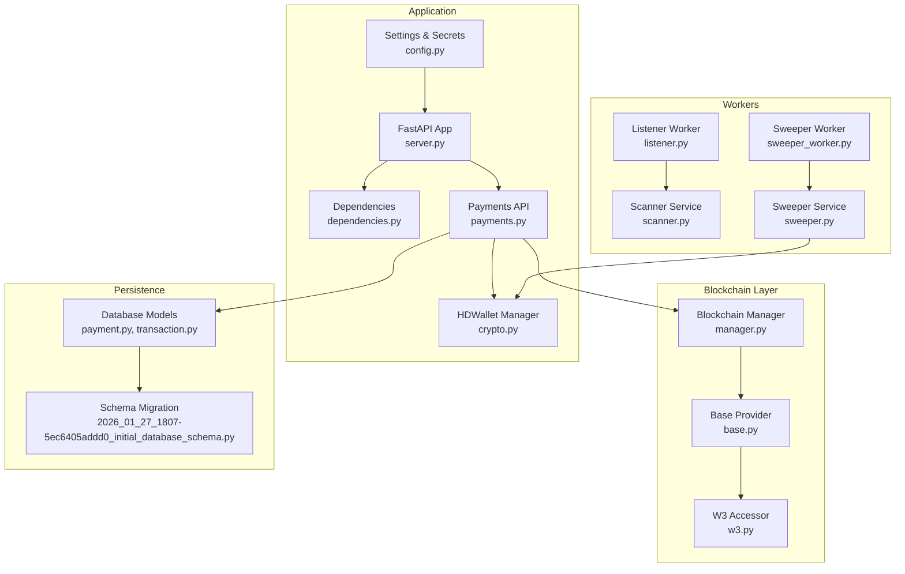
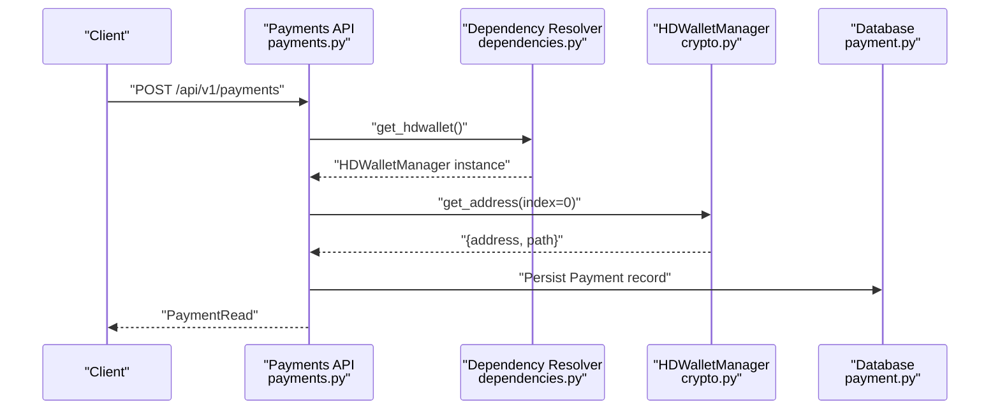
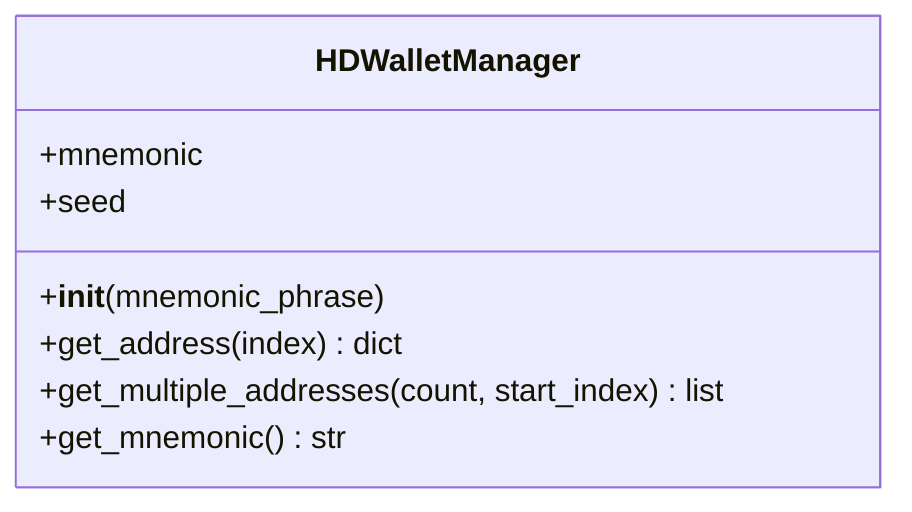
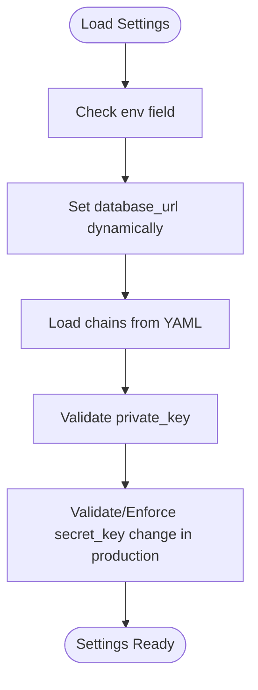
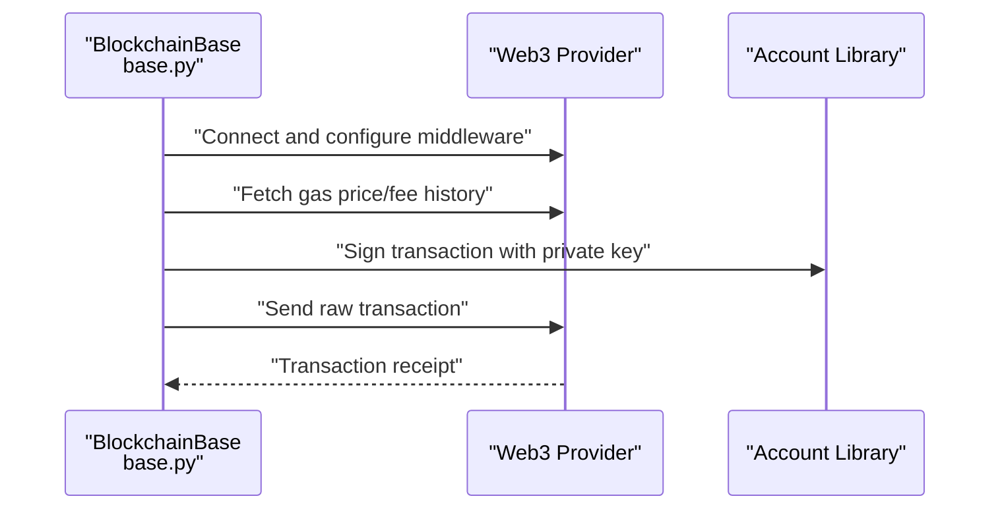
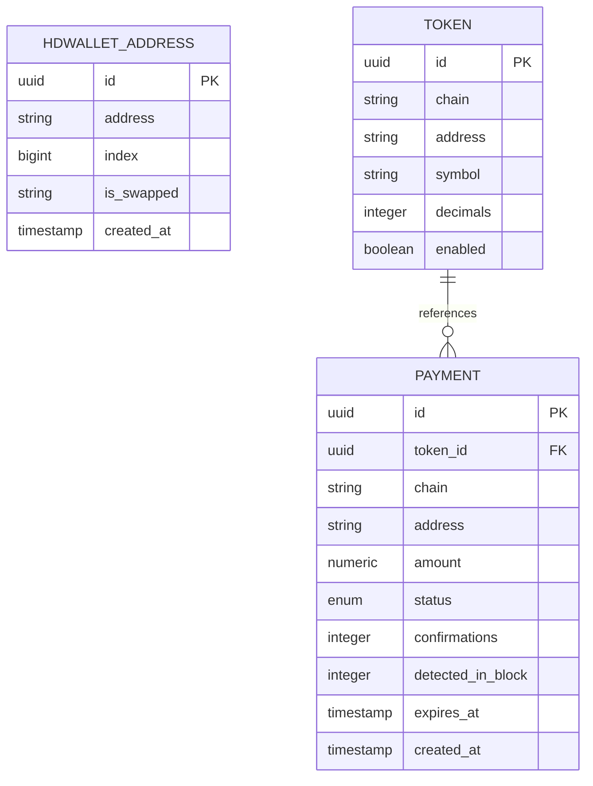
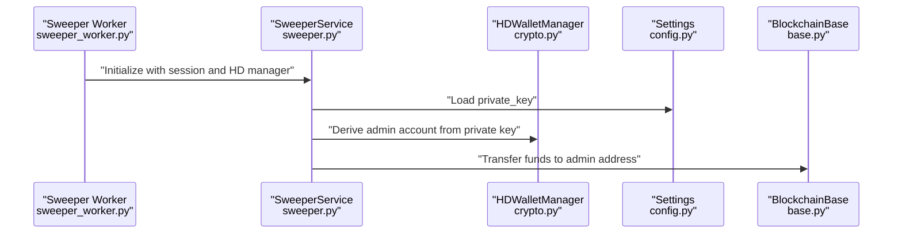
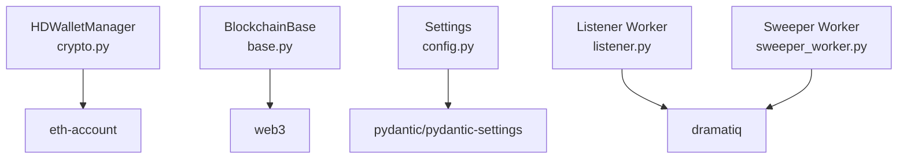

# HD Wallet Security

<cite>
**Referenced Files in This Document**
- [crypto.py](file://app/utils/crypto.py)
- [config.py](file://app/core/config.py)
- [server.py](file://server.py)
- [dependencies.py](file://app/api/dependencies.py)
- [payments.py](file://app/api/v1/payments.py)
- [payment.py](file://app/db/models/payment.py)
- [transaction.py](file://app/db/models/transaction.py)
- [manager.py](file://app/blockchain/manager.py)
- [base.py](file://app/blockchain/base.py)
- [w3.py](file://app/blockchain/w3.py)
- [scanner.py](file://app/services/blockchain/scanner.py)
- [sweeper.py](file://app/services/blockchain/sweeper.py)
- [listener.py](file://app/workers/listener.py)
- [sweeper_worker.py](file://app/workers/sweeper.py)
- [requirements.txt](file://requirements.txt)
- [2026_01_27_1807-5ec6405addd0_initial_database_schema.py](file://alembic/versions/2026_01_27_1807-5ec6405addd0_initial_database_schema.py)
</cite>

## Table of Contents
1. [Introduction](#introduction)
2. [Project Structure](#project-structure)
3. [Core Components](#core-components)
4. [Architecture Overview](#architecture-overview)
5. [Detailed Component Analysis](#detailed-component-analysis)
6. [Dependency Analysis](#dependency-analysis)
7. [Performance Considerations](#performance-considerations)
8. [Troubleshooting Guide](#troubleshooting-guide)
9. [Conclusion](#conclusion)
10. [Appendices](#appendices)

## Introduction
This document provides comprehensive security documentation for the Hierarchical Deterministic (HD) wallet implementation in the cTrip Payment Gateway. It focuses on the BIP-44 derivation path m/44'/60'/0'/0/{index}, cryptographic foundations, mnemonic generation and storage, private key derivation, seed protection, address generation, checksum validation, secure initialization patterns, backup and disaster recovery, production deployment guidelines, key management best practices, and vulnerability assessments. It also outlines remediation strategies for common pitfalls in HD wallet implementations.

## Project Structure
The HD wallet functionality is centered around a dedicated manager that derives Ethereum addresses using BIP-44. The system integrates with blockchain providers, database persistence for payment and address records, and background workers for scanning and sweeping. Initialization occurs during application startup, and runtime access is provided via FastAPI dependency injection.

**Diagram sources**
- [server.py](file://server.py#L21-L42)
- [dependencies.py](file://app/api/dependencies.py#L1-L15)
- [payments.py](file://app/api/v1/payments.py#L1-L62)
- [config.py](file://app/core/config.py#L1-L126)
- [crypto.py](file://app/utils/crypto.py#L1-L90)
- [manager.py](file://app/blockchain/manager.py#L1-L33)
- [base.py](file://app/blockchain/base.py#L1-L146)
- [w3.py](file://app/blockchain/w3.py#L1-L9)
- [payment.py](file://app/db/models/payment.py#L1-L74)
- [transaction.py](file://app/db/models/transaction.py#L1-L40)
- [listener.py](file://app/workers/listener.py#L1-L46)
- [sweeper_worker.py](file://app/workers/sweeper.py#L1-L40)
- [scanner.py](file://app/services/blockchain/scanner.py#L1-L134)
- [sweeper.py](file://app/services/blockchain/sweeper.py#L1-L54)
- [2026_01_27_1807-5ec6405addd0_initial_database_schema.py](file://alembic/versions/2026_01_27_1807-5ec6405addd0_initial_database_schema.py#L37-L56)

**Section sources**
- [server.py](file://server.py#L21-L42)
- [dependencies.py](file://app/api/dependencies.py#L1-L15)
- [payments.py](file://app/api/v1/payments.py#L1-L62)
- [config.py](file://app/core/config.py#L1-L126)
- [crypto.py](file://app/utils/crypto.py#L1-L90)
- [manager.py](file://app/blockchain/manager.py#L1-L33)
- [base.py](file://app/blockchain/base.py#L1-L146)
- [w3.py](file://app/blockchain/w3.py#L1-L9)
- [payment.py](file://app/db/models/payment.py#L1-L74)
- [transaction.py](file://app/db/models/transaction.py#L1-L40)
- [listener.py](file://app/workers/listener.py#L1-L46)
- [sweeper_worker.py](file://app/workers/sweeper.py#L1-L40)
- [scanner.py](file://app/services/blockchain/scanner.py#L1-L134)
- [sweeper.py](file://app/services/blockchain/sweeper.py#L1-L54)
- [2026_01_27_1807-5ec6405addd0_initial_database_schema.py](file://alembic/versions/2026_01_27_1807-5ec6405addd0_initial_database_schema.py#L37-L56)

## Core Components
- HDWalletManager: Implements BIP-44 derivation for Ethereum addresses, mnemonic generation, seed derivation, and address derivation with checksum validation.
- Settings: Centralized configuration including mnemonic and private key fields with validation.
- Blockchain Layer: Provider abstraction and Web3 integration for chain connectivity and transaction building/signing.
- Persistence: SQLAlchemy models for payments and HD wallet addresses, with Alembic migrations defining schema.
- Workers: Background tasks for scanning and sweeping, interacting with the HD wallet and blockchain providers.

Key security-relevant responsibilities:
- Mnemonic handling and seed derivation
- Private key derivation and usage
- Address derivation and checksum validation
- Secure initialization and dependency injection
- Production secrets validation

**Section sources**
- [crypto.py](file://app/utils/crypto.py#L5-L67)
- [config.py](file://app/core/config.py#L58-L102)
- [base.py](file://app/blockchain/base.py#L135-L139)
- [payment.py](file://app/db/models/payment.py#L41-L74)
- [2026_01_27_1807-5ec6405addd0_initial_database_schema.py](file://alembic/versions/2026_01_27_1807-5ec6405addd0_initial_database_schema.py#L37-L56)

## Architecture Overview
The HD wallet is initialized at application startup and exposed via a dependency for API endpoints. Payments requests derive a new payment address per request using BIP-44. Background workers scan for incoming payments and later sweep funds into an administrative wallet derived from a private key.

**Diagram sources**
- [payments.py](file://app/api/v1/payments.py#L18-L54)
- [dependencies.py](file://app/api/dependencies.py#L11-L15)
- [crypto.py](file://app/utils/crypto.py#L27-L46)
- [payment.py](file://app/db/models/payment.py#L41-L58)

**Section sources**
- [server.py](file://server.py#L21-L42)
- [dependencies.py](file://app/api/dependencies.py#L1-L15)
- [payments.py](file://app/api/v1/payments.py#L1-L62)
- [crypto.py](file://app/utils/crypto.py#L1-L90)

## Detailed Component Analysis

### HDWalletManager Security Analysis
- BIP-44 Derivation: Uses path m/44'/60'/0'/0/{index} for Ethereum, ensuring deterministic derivation and hierarchical structure.
- Mnemonic Generation: Generates a 12-word mnemonic when none is provided, suitable for secure backup and recovery.
- Seed Derivation: Derives a seed from the mnemonic with an empty passphrase, aligning with BIP-39 standards.
- Private Key Derivation: Derives private keys from the seed and path, then creates accounts for checksummed address generation.
- Address Derivation Security: Relies on the underlying library’s checksum validation for Ethereum addresses.

Security considerations:
- Mnemonic exposure: The mnemonic must be treated as a secret and protected at rest and in transit.
- Seed protection: Ensure seeds are not logged or persisted unnecessarily.
- Path hardening: The path uses hardened indices for purpose, coin type, and account; this prevents certain attacks but does not replace proper secret protection.
- Entropy sources: Mnemonic generation relies on the underlying library’s secure randomness.

**Diagram sources**
- [crypto.py](file://app/utils/crypto.py#L5-L67)

**Section sources**
- [crypto.py](file://app/utils/crypto.py#L5-L67)

### Settings and Secret Management
- Mnemonic field: Stored as a configurable setting with a default placeholder in development.
- Private key validation: Validates Ethereum private keys and enforces production secret key changes.
- Environment-specific behavior: Selects database URLs based on environment and loads chain configurations from YAML.

Security considerations:
- Never commit secrets; use environment variables and secure secret stores.
- Ensure production environments override defaults.
- Validate and sanitize configuration inputs.

**Diagram sources**
- [config.py](file://app/core/config.py#L84-L112)

**Section sources**
- [config.py](file://app/core/config.py#L58-L112)

### Blockchain Provider Integration
- Provider abstraction supports POA networks and caches gas prices.
- Transaction building includes EIP-1559 fee calculation with fallback to legacy pricing.
- Transaction signing and sending use the Account library with provided private keys.

Security considerations:
- Validate provider URLs and network IDs.
- Ensure gas estimation and fee calculations are performed securely.
- Avoid exposing private keys in logs or error messages.

**Diagram sources**
- [base.py](file://app/blockchain/base.py#L34-L139)

**Section sources**
- [base.py](file://app/blockchain/base.py#L1-L146)

### Payment Address Generation and Persistence
- API endpoint derives a payment address using the HD wallet manager and persists the payment record with chain, amount, and expiration.
- Database schema includes an HD wallet addresses table for tracking derived addresses.

Security considerations:
- Ensure address uniqueness and prevent reuse across payments.
- Persist only necessary fields; avoid storing mnemonics or private keys.
- Apply appropriate indexing and constraints for performance and integrity.

**Diagram sources**
- [payment.py](file://app/db/models/payment.py#L41-L74)
- [2026_01_27_1807-5ec6405addd0_initial_database_schema.py](file://alembic/versions/2026_01_27_1807-5ec6405addd0_initial_database_schema.py#L37-L56)

**Section sources**
- [payments.py](file://app/api/v1/payments.py#L18-L54)
- [payment.py](file://app/db/models/payment.py#L1-L74)
- [2026_01_27_1807-5ec6405addd0_initial_database_schema.py](file://alembic/versions/2026_01_27_1807-5ec6405addd0_initial_database_schema.py#L37-L56)

### Background Workers and Sweeping
- Listener worker periodically scans blocks for incoming payments and updates statuses.
- Sweeper worker moves confirmed funds to an administrative wallet derived from a private key.
- Both workers initialize their own HD wallet instances for sweeping operations.

Security considerations:
- Keep sweeping private keys separate from operational mnemonics.
- Limit sweeping to minimal necessary permissions.
- Monitor and alert on sweeping failures.

**Diagram sources**
- [sweeper_worker.py](file://app/workers/sweeper.py#L19-L40)
- [sweeper.py](file://app/services/blockchain/sweeper.py#L11-L54)
- [config.py](file://app/core/config.py#L74-L102)
- [base.py](file://app/blockchain/base.py#L135-L139)

**Section sources**
- [listener.py](file://app/workers/listener.py#L21-L46)
- [sweeper_worker.py](file://app/workers/sweeper.py#L1-L40)
- [scanner.py](file://app/services/blockchain/scanner.py#L1-L134)
- [sweeper.py](file://app/services/blockchain/sweeper.py#L1-L54)

## Dependency Analysis
External libraries and their roles:
- eth-account: Provides mnemonic generation, seed derivation, and private/public key/account operations.
- web3: Ethereum JSON-RPC client and transaction utilities.
- pydantic/pydantic-settings: Configuration loading and validation.
- dramatiq: Background task processing.

**Diagram sources**
- [crypto.py](file://app/utils/crypto.py#L1-L2)
- [base.py](file://app/blockchain/base.py#L8-L11)
- [config.py](file://app/core/config.py#L1-L8)
- [requirements.txt](file://requirements.txt#L27-L102)
- [listener.py](file://app/workers/listener.py#L4)
- [sweeper_worker.py](file://app/workers/sweeper.py#L4)

**Section sources**
- [requirements.txt](file://requirements.txt#L1-L106)

## Performance Considerations
- Gas price caching reduces repeated RPC calls.
- Batch block scanning limits per cycle to control resource usage.
- Transaction gas limits include a small buffer to reduce rejections.

Recommendations:
- Tune block batch sizes and polling intervals based on chain conditions.
- Monitor RPC latency and adjust timeouts accordingly.
- Use fee history for dynamic fee estimation under EIP-1559 networks.

**Section sources**
- [base.py](file://app/blockchain/base.py#L65-L133)
- [scanner.py](file://app/services/blockchain/scanner.py#L15-L96)

## Troubleshooting Guide
Common issues and remediations:
- HD wallet not initialized: Ensure the application lifespan initializes the HD wallet manager and exposes it via state.
- Unsupported chain errors: Verify chain configurations and provider URLs.
- Private key validation failures: Confirm the private key is a valid Ethereum key and environment-specific overrides are applied.
- Sweeper failures: Check administrative private key validity and network connectivity.

Operational checks:
- Validate mnemonic and private key presence in settings.
- Confirm database connectivity and migration status.
- Review worker logs for recurring errors and schedule adjustments.

**Section sources**
- [server.py](file://server.py#L21-L42)
- [dependencies.py](file://app/api/dependencies.py#L11-L15)
- [config.py](file://app/core/config.py#L94-L112)
- [payments.py](file://app/api/v1/payments.py#L26-L34)
- [sweeper.py](file://app/services/blockchain/sweeper.py#L35-L51)

## Conclusion
The cTrip Payment Gateway implements a secure, deterministic HD wallet using BIP-44 for Ethereum payment addresses. The design separates operational mnemonics from administrative private keys, validates secrets at runtime, and persists only necessary data. By following the production deployment guidelines, key management best practices, and remediation strategies outlined here, the system can maintain strong security posture while remaining operationally robust.

## Appendices

### BIP-44 Derivation Path Security
- Path: m/44'/60'/0'/0/{index}
- Purpose: BIP-44 purpose (44'), Ethereum coin type (60'), account (0'), change (external chain 0), and index for sequential addresses.
- Hardening: Hardened indices at purpose, coin type, and account mitigate certain attack vectors.
- Implications: Even if an attacker gains access to a derived public key, they cannot derive prior siblings without the seed.

**Section sources**
- [crypto.py](file://app/utils/crypto.py#L7-L8)
- [crypto.py](file://app/utils/crypto.py#L37-L38)

### Mnemonic Generation, Storage, and Rotation
- Generation: 12-word mnemonic generated securely when none is provided.
- Storage: Store mnemonics encrypted at rest and restrict access to authorized processes.
- Rotation: Replace mnemonics during controlled maintenance windows; re-derive addresses and update backups.

**Section sources**
- [crypto.py](file://app/utils/crypto.py#L18-L22)
- [config.py](file://app/core/config.py#L58-L61)

### Private Key Derivation and Seed Protection
- Derivation: Seed derived from mnemonic; private keys derived deterministically from seed and path.
- Protection: Avoid logging seeds or private keys; use environment variables and secret managers.
- Entropy: Rely on the library’s secure randomness for mnemonic generation.

**Section sources**
- [crypto.py](file://app/utils/crypto.py#L24-L25)
- [crypto.py](file://app/utils/crypto.py#L40-L41)

### Address Generation Security and Checksum Validation
- Derivation: Addresses derived via private keys and validated with checksums.
- Validation: Ensure checksummed addresses are used consistently across the system.

**Section sources**
- [crypto.py](file://app/utils/crypto.py#L43-L46)

### Secure Initialization Patterns
- Application lifespan: Initialize blockchain providers and HD wallet manager during startup.
- Dependency injection: Expose HD wallet via dependency resolver to API endpoints.
- Configuration: Load settings from environment and validate secrets.

**Section sources**
- [server.py](file://server.py#L21-L42)
- [dependencies.py](file://app/api/dependencies.py#L1-L15)
- [config.py](file://app/core/config.py#L1-L126)

### Backup and Disaster Recovery
- Backup strategies: Maintain offline, encrypted backups of mnemonics and administrative private keys.
- Recovery procedures: Test restoration in isolated environments; rotate keys after breach discovery.

**Section sources**
- [crypto.py](file://app/utils/crypto.py#L64-L66)
- [config.py](file://app/core/config.py#L74-L102)

### Production Deployment Guidelines
- Secrets management: Use environment variables and secret stores; never embed in code.
- Network isolation: Restrict access to private key material and mnemonic backups.
- Monitoring: Log security-relevant events without sensitive data; alert on failures.

**Section sources**
- [config.py](file://app/core/config.py#L94-L112)
- [requirements.txt](file://requirements.txt#L27-L102)

### Vulnerability Assessment for Wallet Components
- Risk areas: Mnemonic exposure, insecure storage, weak entropy, improper key separation, insufficient validation.
- Controls: Enforce secret validation, encrypt at rest, restrict access, audit logs, and regular penetration testing.

**Section sources**
- [config.py](file://app/core/config.py#L94-L112)
- [crypto.py](file://app/utils/crypto.py#L18-L22)

### Common Security Pitfalls and Remediation
- Pitfall: Storing plaintext mnemonics or private keys.
  - Remediation: Encrypt and restrict access; use secret managers.
- Pitfall: Using default secrets in production.
  - Remediation: Enforce environment-specific overrides and validation.
- Pitfall: Logging sensitive data.
  - Remediation: Sanitize logs; avoid printing mnemonics or private keys.
- Pitfall: Mixing operational and administrative keys.
  - Remediation: Separate HD wallet for payments and administrative private key for sweeping.

**Section sources**
- [config.py](file://app/core/config.py#L94-L112)
- [sweeper.py](file://app/services/blockchain/sweeper.py#L20-L22)