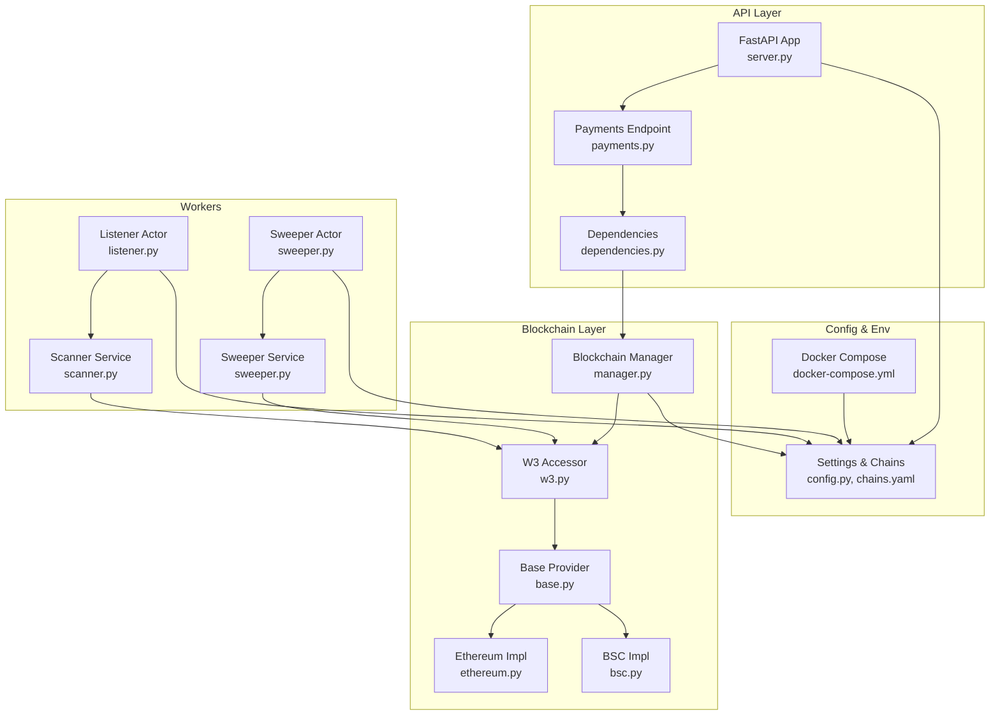
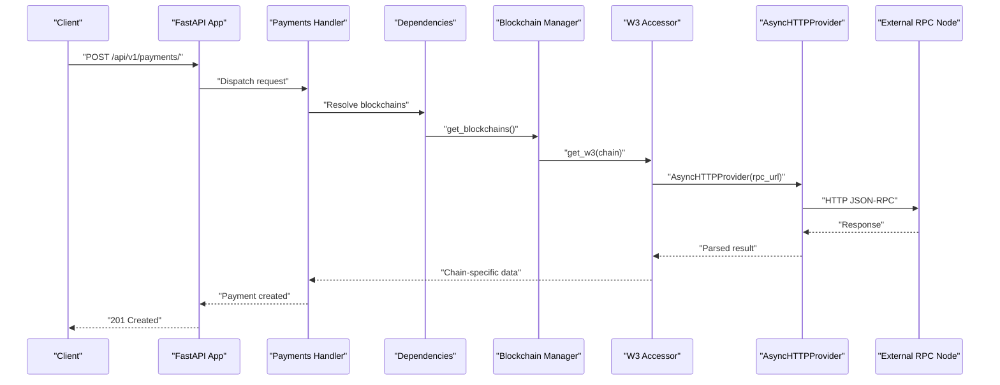
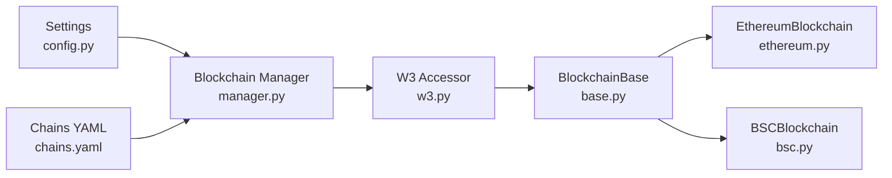

# Network Security

<cite>
**Referenced Files in This Document**
- [base.py](https://github.com/rakibhossain72/ctrip/blob/main/app/blockchain/base.py)
- [manager.py](https://github.com/rakibhossain72/ctrip/blob/main/app/blockchain/manager.py)
- [w3.py](https://github.com/rakibhossain72/ctrip/blob/main/app/blockchain/w3.py)
- [config.py](https://github.com/rakibhossain72/ctrip/blob/main/app/core/config.py)
- [server.py](https://github.com/rakibhossain72/ctrip/blob/main/server.py)
- [ethereum.py](https://github.com/rakibhossain72/ctrip/blob/main/app/blockchain/ethereum.py)
- [bsc.py](https://github.com/rakibhossain72/ctrip/blob/main/app/blockchain/bsc.py)
- [chains.yaml](https://github.com/rakibhossain72/ctrip/blob/main/chains.yaml)
- [requirements.txt](https://github.com/rakibhossain72/ctrip/blob/main/requirements.txt)
- [docker-compose.yml](https://github.com/rakibhossain72/ctrip/blob/main/docker-compose.yml)
- [payments.py](https://github.com/rakibhossain72/ctrip/blob/main/app/api/v1/payments.py)
- [dependencies.py](https://github.com/rakibhossain72/ctrip/blob/main/app/api/dependencies.py)
- [scanner.py](https://github.com/rakibhossain72/ctrip/blob/main/app/services/blockchain/scanner.py)
- [sweeper.py](https://github.com/rakibhossain72/ctrip/blob/main/app/services/blockchain/sweeper.py)
- [listener.py](https://github.com/rakibhossain72/ctrip/blob/main/app/workers/listener.py)
- [sweeper_worker.py](https://github.com/rakibhossain72/ctrip/blob/main/app/workers/sweeper.py)
</cite>

## Table of Contents
1. [Introduction](#introduction)
2. [Project Structure](#project-structure)
3. [Core Components](#core-components)
4. [Architecture Overview](#architecture-overview)
5. [Detailed Component Analysis](#detailed-component-analysis)
6. [Dependency Analysis](#dependency-analysis)
7. [Performance Considerations](#performance-considerations)
8. [Troubleshooting Guide](#troubleshooting-guide)
9. [Conclusion](#conclusion)
10. [Appendices](#appendices)

## Introduction
This document provides network security guidance for blockchain communication in the cTrip Payment Gateway. It focuses on securing RPC endpoint connections, implementing rate limiting and DDoS protections, establishing authentication and credential management, configuring SSL/TLS and certificates, and securing inter-service communications. It also covers secure node selection, redundancy, failover, monitoring, and incident response.

## Project Structure
The application integrates FastAPI with asynchronous Web3 providers for blockchain connectivity. Configuration is centralized via environment variables and YAML. Workers orchestrate scanning and sweeping tasks against configured chains. The following diagram shows the high-level runtime structure and data flow.

**Diagram sources**
- [server.py](https://github.com/rakibhossain72/ctrip/blob/main/server.py#L1-L56)
- [payments.py](https://github.com/rakibhossain72/ctrip/blob/main/app/api/v1/payments.py#L1-L62)
- [dependencies.py](https://github.com/rakibhossain72/ctrip/blob/main/app/api/dependencies.py#L1-L15)
- [manager.py](https://github.com/rakibhossain72/ctrip/blob/main/app/blockchain/manager.py#L1-L33)
- [w3.py](https://github.com/rakibhossain72/ctrip/blob/main/app/blockchain/w3.py#L1-L9)
- [base.py](https://github.com/rakibhossain72/ctrip/blob/main/app/blockchain/base.py#L1-L146)
- [ethereum.py](https://github.com/rakibhossain72/ctrip/blob/main/app/blockchain/ethereum.py#L1-L7)
- [bsc.py](https://github.com/rakibhossain72/ctrip/blob/main/app/blockchain/bsc.py#L1-L7)
- [listener.py](https://github.com/rakibhossain72/ctrip/blob/main/app/workers/listener.py#L1-L46)
- [sweeper_worker.py](https://github.com/rakibhossain72/ctrip/blob/main/app/workers/sweeper.py#L1-L40)
- [scanner.py](https://github.com/rakibhossain72/ctrip/blob/main/app/services/blockchain/scanner.py#L1-L134)
- [sweeper.py](https://github.com/rakibhossain72/ctrip/blob/main/app/services/blockchain/sweeper.py#L1-L54)
- [config.py](https://github.com/rakibhossain72/ctrip/blob/main/app/core/config.py#L1-L126)
- [chains.yaml](https://github.com/rakibhossain72/ctrip/blob/main/chains.yaml#L1-L24)
- [docker-compose.yml](https://github.com/rakibhossain72/ctrip/blob/main/docker-compose.yml#L1-L54)

**Section sources**
- [server.py](https://github.com/rakibhossain72/ctrip/blob/main/server.py#L1-L56)
- [config.py](https://github.com/rakibhossain72/ctrip/blob/main/app/core/config.py#L1-L126)
- [chains.yaml](https://github.com/rakibhossain72/ctrip/blob/main/chains.yaml#L1-L24)
- [docker-compose.yml](https://github.com/rakibhossain72/ctrip/blob/main/docker-compose.yml#L1-L54)

## Core Components
- BlockchainBase: Asynchronous Web3 provider wrapper with POA support, gas estimation, transaction building, signing, and receipt polling. It constructs an AsyncHTTPProvider with a configurable timeout.
- Chain-specific implementations: EthereumBlockchain and BSCBlockchain set chain IDs and POA flags.
- Manager and W3 accessor: Build a registry of configured chains from settings and chains.yaml, and expose AsyncWeb3 instances per chain.
- Settings: Centralized configuration including RPC endpoints, secrets, and environment controls.
- Workers: Asynchronous actors that scan blocks and confirm transactions, and sweep settled funds.

Security-relevant observations:
- RPC endpoints are loaded from configuration and chains.yaml. Currently, the default development configuration uses HTTP endpoints.
- Private keys and secrets are validated and loaded from environment variables.
- Workers operate on scheduled intervals and perform batched blockchain queries.

**Section sources**
- [base.py](https://github.com/rakibhossain72/ctrip/blob/main/app/blockchain/base.py#L1-L146)
- [ethereum.py](https://github.com/rakibhossain72/ctrip/blob/main/app/blockchain/ethereum.py#L1-L7)
- [bsc.py](https://github.com/rakibhossain72/ctrip/blob/main/app/blockchain/bsc.py#L1-L7)
- [manager.py](https://github.com/rakibhossain72/ctrip/blob/main/app/blockchain/manager.py#L1-L33)
- [w3.py](https://github.com/rakibhossain72/ctrip/blob/main/app/blockchain/w3.py#L1-L9)
- [config.py](https://github.com/rakibhossain72/ctrip/blob/main/app/core/config.py#L1-L126)
- [chains.yaml](https://github.com/rakibhossain72/ctrip/blob/main/chains.yaml#L1-L24)
- [listener.py](https://github.com/rakibhossain72/ctrip/blob/main/app/workers/listener.py#L1-L46)
- [sweeper_worker.py](https://github.com/rakibhossain72/ctrip/blob/main/app/workers/sweeper.py#L1-L40)

## Architecture Overview
The system connects to external RPC endpoints via AsyncHTTPProvider. Requests traverse the API layer, resolve chain providers through the manager, and reach the blockchain layer. Workers periodically poll blockchains for payment confirmations and settle funds.

**Diagram sources**
- [server.py](https://github.com/rakibhossain72/ctrip/blob/main/server.py#L1-L56)
- [payments.py](https://github.com/rakibhossain72/ctrip/blob/main/app/api/v1/payments.py#L1-L62)
- [dependencies.py](https://github.com/rakibhossain72/ctrip/blob/main/app/api/dependencies.py#L1-L15)
- [manager.py](https://github.com/rakibhossain72/ctrip/blob/main/app/blockchain/manager.py#L1-L33)
- [w3.py](https://github.com/rakibhossain72/ctrip/blob/main/app/blockchain/w3.py#L1-L9)
- [base.py](https://github.com/rakibhossain72/ctrip/blob/main/app/blockchain/base.py#L1-L146)

## Detailed Component Analysis

### RPC Endpoint Security
- HTTPS enforcement: The default development configuration uses HTTP endpoints. Production deployments must enforce HTTPS for RPC endpoints.
- Certificate validation: AsyncHTTPProvider relies on underlying HTTP client defaults. Ensure trusted CA bundles are used and consider pinning or validating certificate chains.
- Secure connection establishment: Configure timeouts and retries appropriately. Add circuit breaker behavior to handle transient failures and protect upstream nodes.

Recommendations:
- Replace HTTP endpoints with HTTPS in chains.yaml and environment variables.
- Pin or validate TLS certificates for RPC endpoints.
- Set conservative request timeouts and retry policies in the provider configuration.
- Introduce circuit breakers around RPC calls to prevent cascading failures.

**Section sources**
- [chains.yaml](https://github.com/rakibhossain72/ctrip/blob/main/chains.yaml#L1-L24)
- [docker-compose.yml](https://github.com/rakibhossain72/ctrip/blob/main/docker-compose.yml#L26-L32)
- [base.py](https://github.com/rakibhossain72/ctrip/blob/main/app/blockchain/base.py#L23-L40)

### Rate Limiting, Throttling, and DDoS Protection
Current code does not implement explicit rate limiting or throttling for RPC calls. To protect nodes and the gateway:
- Apply per-endpoint or per-chain rate limits using middleware or external rate limiting systems.
- Enforce per-user or per-API-key quotas.
- Use sliding window or token bucket algorithms to smooth bursts.
- Deploy WAF/DDoS mitigation at ingress and consider CDN caching for read-heavy endpoints.

Operational controls:
- Monitor requests per second per endpoint and alert on anomalies.
- Implement backpressure and queueing for high-load scenarios.

[No sources needed since this section provides general guidance]

### Authentication Security for RPC Endpoints
- API key management: If RPC providers require API keys, store them in environment variables and avoid hardcoding. Rotate keys regularly and revoke compromised ones.
- Credential rotation: Automate key rotation and update configuration without downtime.
- Least privilege: Use provider accounts with minimal permissions required for operations.

Note: The current configuration does not show explicit API key handling for RPC endpoints.

**Section sources**
- [config.py](https://github.com/rakibhossain72/ctrip/blob/main/app/core/config.py#L74-L82)
- [chains.yaml](https://github.com/rakibhossain72/ctrip/blob/main/chains.yaml#L1-L24)

### Network Topology Security, Firewall Configuration, and Inter-Service Communication
- Isolate services: Run database, Redis, and application in separate networks or containers with restricted ingress/egress.
- Firewall rules: Allow only necessary ports (e.g., 5432 for PostgreSQL, 6379 for Redis, 8000 for API) and restrict source IPs.
- Inter-service trust: Use internal networks and mutual TLS where applicable. Avoid exposing internal services to public networks.

**Section sources**
- [docker-compose.yml](https://github.com/rakibhossain72/ctrip/blob/main/docker-compose.yml#L1-L54)

### SSL/TLS Configuration, Cipher Suites, and Certificate Management
- TLS stack: Use modern TLS versions and strong cipher suites. Prefer ECDHE-based ciphers with AEAD modes.
- Certificate management: Use short-lived certificates, automate renewal, and maintain audit logs.
- Trust stores: Ensure the runtime uses updated CA bundles and validates certificate chains.

[No sources needed since this section provides general guidance]

### Secure Blockchain Node Selection, Redundancy, and Failover
- Node selection: Choose reputable RPC providers and diversify endpoints across providers.
- Redundancy: Maintain multiple RPC endpoints per chain and detect failures automatically.
- Failover: Implement automatic fallback to secondary endpoints with health checks and circuit breakers.

**Section sources**
- [manager.py](https://github.com/rakibhossain72/ctrip/blob/main/app/blockchain/manager.py#L8-L32)
- [w3.py](https://github.com/rakibhossain72/ctrip/blob/main/app/blockchain/w3.py#L6-L9)
- [chains.yaml](https://github.com/rakibhossain72/ctrip/blob/main/chains.yaml#L1-L24)

### Network Monitoring, Intrusion Detection, and Incident Response
- Observability: Instrument RPC calls with metrics (latency, errors, throughput) and traces.
- IDS/IPS: Deploy network-level detection for suspicious traffic patterns.
- Incident response: Define escalation procedures for RPC outages, rate limit breaches, and security incidents.

[No sources needed since this section provides general guidance]

## Dependency Analysis
The following diagram highlights key dependencies among blockchain components and configuration.

**Diagram sources**
- [config.py](https://github.com/rakibhossain72/ctrip/blob/main/app/core/config.py#L1-L126)
- [chains.yaml](https://github.com/rakibhossain72/ctrip/blob/main/chains.yaml#L1-L24)
- [manager.py](https://github.com/rakibhossain72/ctrip/blob/main/app/blockchain/manager.py#L1-L33)
- [w3.py](https://github.com/rakibhossain72/ctrip/blob/main/app/blockchain/w3.py#L1-L9)
- [base.py](https://github.com/rakibhossain72/ctrip/blob/main/app/blockchain/base.py#L1-L146)
- [ethereum.py](https://github.com/rakibhossain72/ctrip/blob/main/app/blockchain/ethereum.py#L1-L7)
- [bsc.py](https://github.com/rakibhossain72/ctrip/blob/main/app/blockchain/bsc.py#L1-L7)

**Section sources**
- [config.py](https://github.com/rakibhossain72/ctrip/blob/main/app/core/config.py#L1-L126)
- [chains.yaml](https://github.com/rakibhossain72/ctrip/blob/main/chains.yaml#L1-L24)
- [manager.py](https://github.com/rakibhossain72/ctrip/blob/main/app/blockchain/manager.py#L1-L33)
- [w3.py](https://github.com/rakibhossain72/ctrip/blob/main/app/blockchain/w3.py#L1-L9)
- [base.py](https://github.com/rakibhossain72/ctrip/blob/main/app/blockchain/base.py#L1-L146)
- [ethereum.py](https://github.com/rakibhossain72/ctrip/blob/main/app/blockchain/ethereum.py#L1-L7)
- [bsc.py](https://github.com/rakibhossain72/ctrip/blob/main/app/blockchain/bsc.py#L1-L7)

## Performance Considerations
- Batch queries: The scanner processes blocks in batches to reduce load on nodes.
- Gas estimation and caching: The base provider caches gas prices to minimize repeated calls.
- Timeouts: Configure appropriate request timeouts to avoid blocking threads.
- Backoff and jitter: Apply exponential backoff for retries to prevent thundering herds.

**Section sources**
- [scanner.py](https://github.com/rakibhossain72/ctrip/blob/main/app/services/blockchain/scanner.py#L14-L96)
- [base.py](https://github.com/rakibhossain72/ctrip/blob/main/app/blockchain/base.py#L65-L81)
- [base.py](https://github.com/rakibhossain72/ctrip/blob/main/app/blockchain/base.py#L23-L40)

## Troubleshooting Guide
Common issues and mitigations:
- Connection failures: Verify HTTPS endpoints, certificate trust, and network access. Check timeouts and retry policies.
- Invalid private keys: Ensure private keys are valid and environment variables are set correctly.
- Missing chain configuration: Confirm chains.yaml entries and that the manager initializes providers.

**Section sources**
- [base.py](https://github.com/rakibhossain72/ctrip/blob/main/app/blockchain/base.py#L45-L51)
- [config.py](https://github.com/rakibhossain72/ctrip/blob/main/app/core/config.py#L94-L102)
- [manager.py](https://github.com/rakibhossain72/ctrip/blob/main/app/blockchain/manager.py#L8-L32)

## Conclusion
The cTrip Payment Gateway currently uses HTTP RPC endpoints in development and lacks explicit rate limiting or DDoS protections. To achieve robust network security:
- Enforce HTTPS and validate certificates for all RPC endpoints.
- Implement rate limiting, throttling, and DDoS mitigation.
- Manage credentials securely and rotate them regularly.
- Harden network topology with firewalls and secure inter-service communication.
- Select redundant nodes, configure failover, and instrument monitoring and incident response.

[No sources needed since this section summarizes without analyzing specific files]

## Appendices

### Appendix A: Recommendations Checklist
- Enforce HTTPS for RPC endpoints and validate certificates.
- Add rate limiting and DDoS protections at ingress and application layers.
- Store RPC keys and secrets in environment variables; rotate regularly.
- Restrict service exposure via firewall and network segmentation.
- Use TLS 1.2+/strong cipher suites and maintain updated trust stores.
- Configure multiple RPC endpoints per chain with health checks and failover.
- Instrument metrics, tracing, and alerts; define incident response procedures.

[No sources needed since this section provides general guidance]