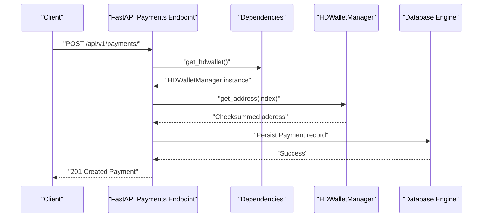
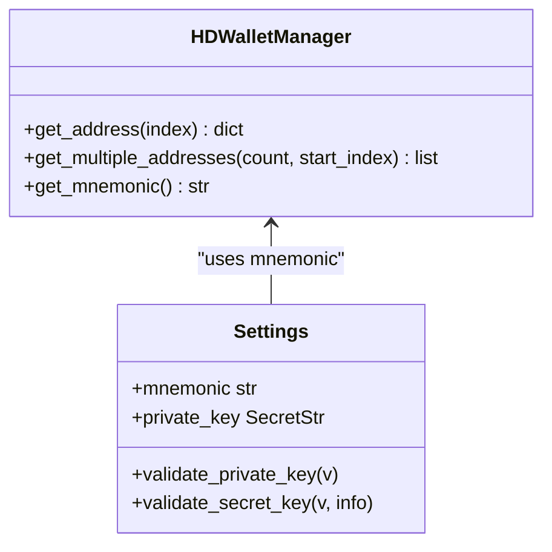
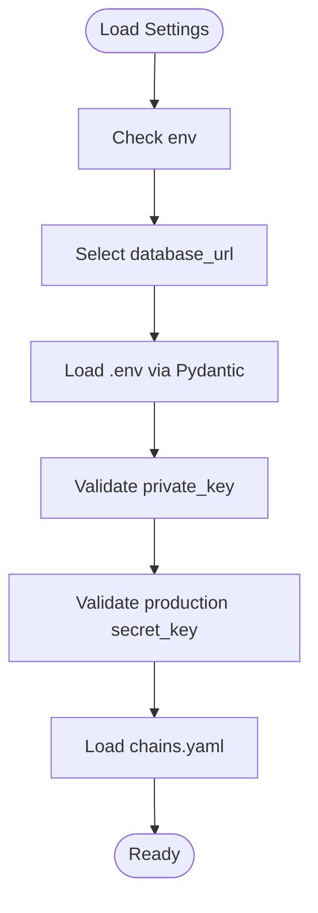
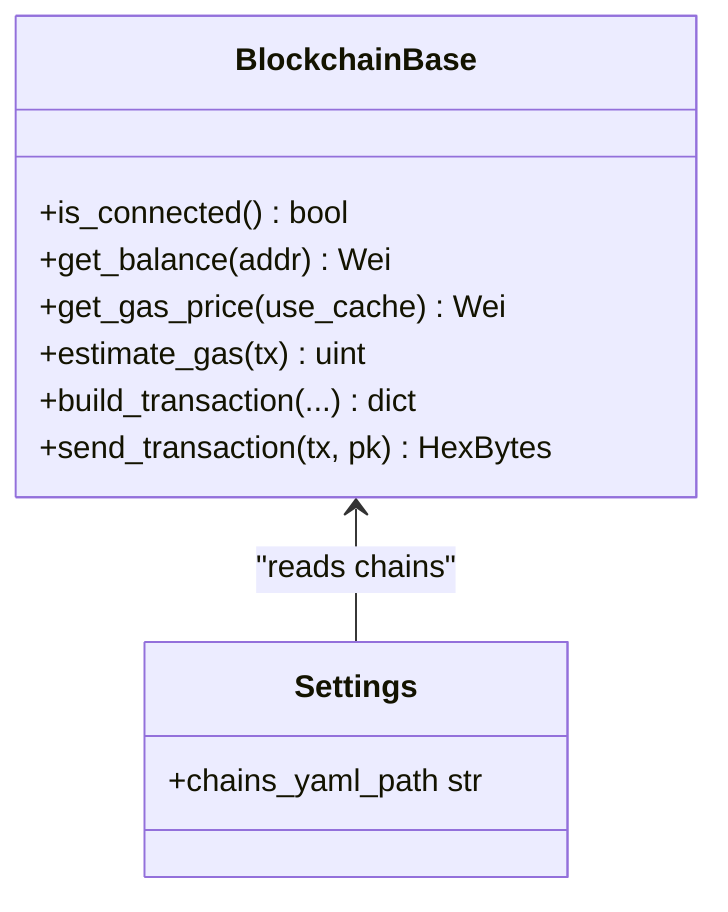
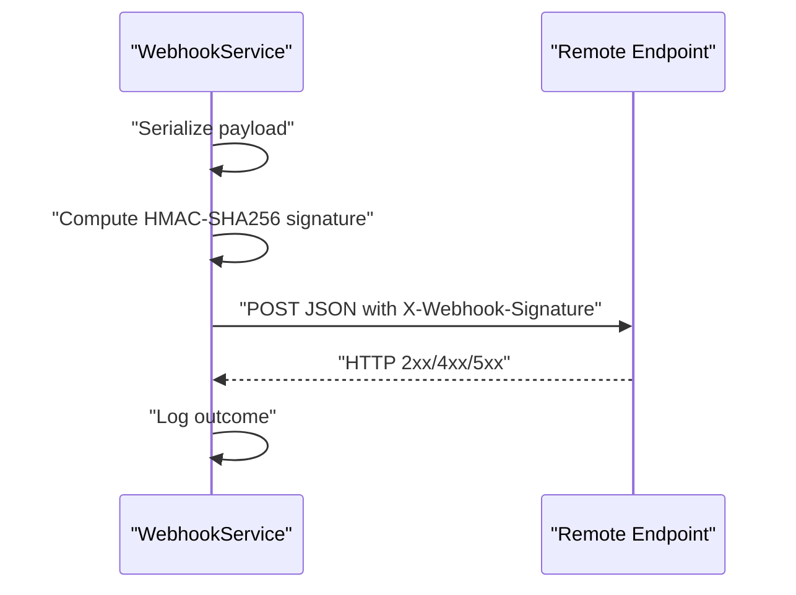
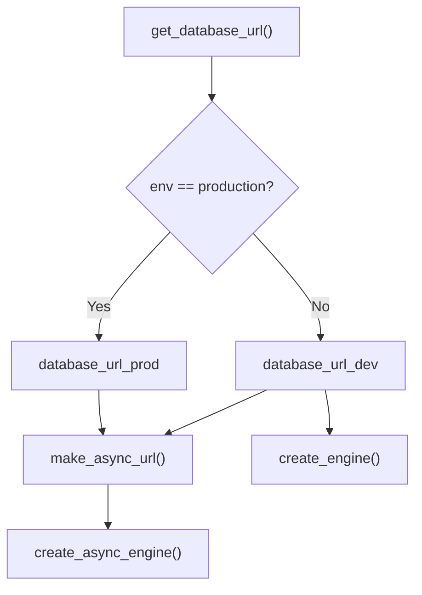
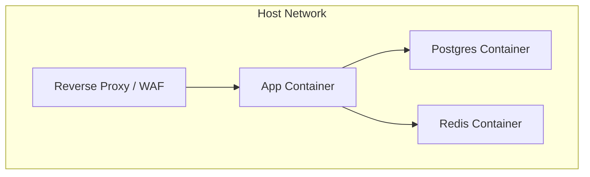
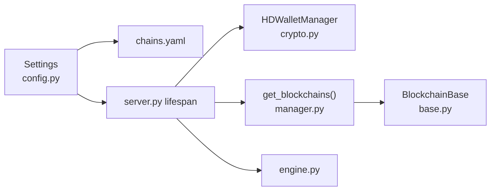

# Security Considerations

<cite>
**Referenced Files in This Document**
- [config.py](https://github.com/rakibhossain72/ctrip/blob/main/app/core/config.py)
- [crypto.py](https://github.com/rakibhossain72/ctrip/blob/main/app/utils/crypto.py)
- [manager.py](https://github.com/rakibhossain72/ctrip/blob/main/app/blockchain/manager.py)
- [base.py](https://github.com/rakibhossain72/ctrip/blob/main/app/blockchain/base.py)
- [w3.py](https://github.com/rakibhossain72/ctrip/blob/main/app/blockchain/w3.py)
- [chains.yaml](https://github.com/rakibhossain72/ctrip/blob/main/chains.yaml)
- [payments.py](https://github.com/rakibhossain72/ctrip/blob/main/app/api/v1/payments.py)
- [dependencies.py](https://github.com/rakibhossain72/ctrip/blob/main/app/api/dependencies.py)
- [engine.py](https://github.com/rakibhossain72/ctrip/blob/main/app/db/engine.py)
- [server.py](https://github.com/rakibhossain72/ctrip/blob/main/server.py)
- [docker-compose.yml](https://github.com/rakibhossain72/ctrip/blob/main/docker-compose.yml)
- [Dockerfile](https://github.com/rakibhossain72/ctrip/blob/main/Dockerfile)
- [webhook.py](https://github.com/rakibhossain72/ctrip/blob/main/app/services/webhook.py)
</cite>

## Table of Contents
1. [Introduction](#introduction)
2. [Project Structure](#project-structure)
3. [Core Components](#core-components)
4. [Architecture Overview](#architecture-overview)
5. [Detailed Component Analysis](#detailed-component-analysis)
6. [Dependency Analysis](#dependency-analysis)
7. [Performance Considerations](#performance-considerations)
8. [Troubleshooting Guide](#troubleshooting-guide)
9. [Conclusion](#conclusion)
10. [Appendices](#appendices)

## Introduction
This document provides comprehensive security guidance for the cTrip Payment Gateway. It focuses on HD wallet security practices (mnemonic storage, private key management, and BIP-44 derivation), environment variable and secrets management, blockchain RPC endpoint security, rate limiting and DDoS protections, webhook security, database security, network and deployment hardening, and production best practices including vulnerability assessment and incident response.

## Project Structure
The application is organized around a FastAPI service with modular components:
- Configuration and secrets management
- HD wallet and cryptographic utilities
- Blockchain abstraction and RPC connectivity
- Database connectivity and ORM
- API endpoints and dependency injection
- Worker processes for background tasks
- Containerization and orchestration

```mermaid
graph TB
subgraph "Runtime"
S["FastAPI App<br/>server.py"]
Cfg["Settings<br/>config.py"]
HD["HDWalletManager<br/>crypto.py"]
BC["BlockchainBase<br/>base.py"]
W3["get_w3()<br/>w3.py"]
DB["SQLAlchemy Engines<br/>engine.py"]
end
subgraph "Config & Data"
Chains["chains.yaml"]
Creds[".env/.env.* (external)"]
end
subgraph "Workers"
Workers["Background Tasks<br/>workers/*"]
end
S --> Cfg
S --> HD
S --> BC
W3 --> BC
S --> DB
Cfg --> Chains
Cfg --> Creds
Workers --> DB
Workers --> Cfg
```

**Diagram sources**
- [server.py](https://github.com/rakibhossain72/ctrip/blob/main/server.py#L21-L47)
- [config.py](https://github.com/rakibhossain72/ctrip/blob/main/app/core/config.py#L10-L126)
- [crypto.py](https://github.com/rakibhossain72/ctrip/blob/main/app/utils/crypto.py#L5-L67)
- [base.py](https://github.com/rakibhossain72/ctrip/blob/main/app/blockchain/base.py#L22-L146)
- [w3.py](https://github.com/rakibhossain72/ctrip/blob/main/app/blockchain/w3.py#L1-L9)
- [engine.py](https://github.com/rakibhossain72/ctrip/blob/main/app/db/engine.py#L1-L32)
- [chains.yaml](https://github.com/rakibhossain72/ctrip/blob/main/chains.yaml#L1-L24)

**Section sources**
- [server.py](https://github.com/rakibhossain72/ctrip/blob/main/server.py#L1-L56)
- [config.py](https://github.com/rakibhossain72/ctrip/blob/main/app/core/config.py#L1-L126)
- [crypto.py](https://github.com/rakibhossain72/ctrip/blob/main/app/utils/crypto.py#L1-L90)
- [base.py](https://github.com/rakibhossain72/ctrip/blob/main/app/blockchain/base.py#L1-L146)
- [w3.py](https://github.com/rakibhossain72/ctrip/blob/main/app/blockchain/w3.py#L1-L9)
- [engine.py](https://github.com/rakibhossain72/ctrip/blob/main/app/db/engine.py#L1-L32)
- [chains.yaml](https://github.com/rakibhossain72/ctrip/blob/main/chains.yaml#L1-L24)

## Core Components
- Settings and secrets: centralizes environment-driven configuration, validates private keys, and enforces production secret key changes.
- HD wallet manager: implements BIP-44 derivation for Ethereum-compatible addresses and manages mnemonic lifecycle.
- Blockchain base: abstracts RPC interactions, gas estimation, transaction building, and signing.
- Database engines: async/sync engines with connection pooling and pre-ping enabled.
- API and dependencies: injects HD wallet and blockchain instances via FastAPI lifespan and dependency injection.
- Webhook service: optional HMAC signature for outbound webhooks.

Key security-relevant responsibilities:
- Private key validation and production secret enforcement
- Mnemonic handling and BIP-44 derivation
- RPC endpoint selection and fallback behavior
- Database credentials and connection encryption
- Outbound webhook signing

**Section sources**
- [config.py](https://github.com/rakibhossain72/ctrip/blob/main/app/core/config.py#L10-L126)
- [crypto.py](https://github.com/rakibhossain72/ctrip/blob/main/app/utils/crypto.py#L5-L67)
- [base.py](https://github.com/rakibhossain72/ctrip/blob/main/app/blockchain/base.py#L22-L146)
- [engine.py](https://github.com/rakibhossain72/ctrip/blob/main/app/db/engine.py#L1-L32)
- [dependencies.py](https://github.com/rakibhossain72/ctrip/blob/main/app/api/dependencies.py#L1-L15)
- [webhook.py](https://github.com/rakibhossain72/ctrip/blob/main/app/services/webhook.py#L10-L45)

## Architecture Overview
The system initializes blockchain providers and HD wallet during application lifespan. Requests derive payment addresses using the HD wallet, while background workers interact with the database and blockchain networks.



**Diagram sources**
- [payments.py](https://github.com/rakibhossain72/ctrip/blob/main/app/api/v1/payments.py#L13-L54)
- [dependencies.py](https://github.com/rakibhossain72/ctrip/blob/main/app/api/dependencies.py#L11-L15)
- [crypto.py](https://github.com/rakibhossain72/ctrip/blob/main/app/utils/crypto.py#L27-L46)
- [engine.py](https://github.com/rakibhossain72/ctrip/blob/main/app/db/engine.py#L22-L31)

## Detailed Component Analysis

### HD Wallet Security Practices
- BIP-44 derivation: Uses deterministic path m/44'/60'/0'/0/{index} for Ethereum-compatible chains.
- Mnemonic storage: Mnemonic is configurable via settings; in production, it must be supplied via environment and protected.
- Private key management: Private key is validated as a valid Ethereum key and must be changed from defaults in production.
- Address generation: Addresses are checksummed and derived deterministically from seed.

Recommended hardening:
- Rotate mnemonics periodically and store offline backups encrypted.
- Use hardware security modules (HSM) or secure secret managers for private keys.
- Enforce strict filesystem permissions and encryption-at-rest for any local mnemonic backups.
- Limit in-memory lifetime of private keys; avoid logging or exposing them.



**Diagram sources**
- [crypto.py](https://github.com/rakibhossain72/ctrip/blob/main/app/utils/crypto.py#L5-L67)
- [config.py](https://github.com/rakibhossain72/ctrip/blob/main/app/core/config.py#L58-L112)

**Section sources**
- [crypto.py](https://github.com/rakibhossain72/ctrip/blob/main/app/utils/crypto.py#L5-L67)
- [config.py](https://github.com/rakibhossain72/ctrip/blob/main/app/core/config.py#L58-L112)

### Environment Variables, Configuration Encryption, and Secrets Management
- Environment detection and dynamic database URL selection.
- Private key validation and production secret key enforcement.
- External secrets via .env files loaded by Pydantic settings.
- Chain configurations loaded from chains.yaml.

Recommendations:
- Store all secrets in a dedicated secret manager (e.g., HashiCorp Vault, AWS Secrets Manager).
- Encrypt .env files at rest and restrict access to deployment accounts.
- Use separate .env files per environment and never commit secrets to version control.
- Rotate secrets regularly and revoke compromised keys immediately.



**Diagram sources**
- [config.py](https://github.com/rakibhossain72/ctrip/blob/main/app/core/config.py#L86-L122)
- [chains.yaml](https://github.com/rakibhossain72/ctrip/blob/main/chains.yaml#L1-L24)

**Section sources**
- [config.py](https://github.com/rakibhossain72/ctrip/blob/main/app/core/config.py#L10-L126)
- [chains.yaml](https://github.com/rakibhossain72/ctrip/blob/main/chains.yaml#L1-L24)

### Blockchain RPC Endpoint Security, Rate Limiting, and DDoS Protection
- RPC endpoints are configured per-chain and fall back to a local Anvil instance if none configured.
- Base provider uses AsyncHTTPProvider with timeouts.
- Gas price caching reduces repeated RPC calls.
- Transaction building supports EIP-1559 fee market dynamics.

Security considerations:
- Prefer HTTPS endpoints and validate TLS certificates.
- Use multiple RPC endpoints and failover strategies.
- Implement rate limiting at ingress (e.g., API gateway) and per-endpoint.
- Apply DDoS protection (rate limiting, IP allowlists, CDN/WAF).
- Monitor RPC latency and downtime; alert on anomalies.



**Diagram sources**
- [base.py](https://github.com/rakibhossain72/ctrip/blob/main/app/blockchain/base.py#L22-L146)
- [manager.py](https://github.com/rakibhossain72/ctrip/blob/main/app/blockchain/manager.py#L8-L32)
- [config.py](https://github.com/rakibhossain72/ctrip/blob/main/app/core/config.py#L39-L42)

**Section sources**
- [base.py](https://github.com/rakibhossain72/ctrip/blob/main/app/blockchain/base.py#L22-L146)
- [manager.py](https://github.com/rakibhossain72/ctrip/blob/main/app/blockchain/manager.py#L8-L32)
- [chains.yaml](https://github.com/rakibhossain72/ctrip/blob/main/chains.yaml#L1-L24)

### Webhook Security (Outbound)
- Optional HMAC-SHA256 signature header for outbound webhooks.
- JSON payload with explicit Content-Type.
- Structured logging for failures.

Recommendations:
- Enforce HTTPS for webhook endpoints.
- Implement replay attack prevention via timestamps and nonce fields.
- Use rotating secrets and rotate frequently.
- Log webhook attempts with masked signatures for audit trails.



**Diagram sources**
- [webhook.py](https://github.com/rakibhossain72/ctrip/blob/main/app/services/webhook.py#L12-L44)

**Section sources**
- [webhook.py](https://github.com/rakibhossain72/ctrip/blob/main/app/services/webhook.py#L10-L45)

### Database Security
- Asynchronous and synchronous engines with connection pooling and pre-ping enabled.
- Production vs development database URL selection.
- Alembic migrations manage schema; tables are not auto-created at startup.

Recommendations:
- Enable TLS for database connections.
- Restrict database user privileges to least-privilege roles.
- Audit logs for DDL/DML changes; monitor failed login attempts.
- Back up databases encrypted and test restoration procedures.



**Diagram sources**
- [engine.py](https://github.com/rakibhossain72/ctrip/blob/main/app/db/engine.py#L5-L31)

**Section sources**
- [engine.py](https://github.com/rakibhossain72/ctrip/blob/main/app/db/engine.py#L1-L32)

### Network Security, Firewall Configuration, and Secure Deployment
- Application exposes port 8000; Redis and PostgreSQL are internal services.
- Private key and mnemonic are passed via environment variables.
- Dockerfile sets safe defaults and exposes the application port.

Recommendations:
- Run application and workers behind a reverse proxy with TLS termination.
- Restrict inbound traffic to necessary ports only (e.g., 8000 for API).
- Use container runtime security policies and read-only root filesystems.
- Store secrets outside containers; mount via secret volumes or environment injection.



**Diagram sources**
- [docker-compose.yml](https://github.com/rakibhossain72/ctrip/blob/main/docker-compose.yml#L20-L50)
- [Dockerfile](https://github.com/rakibhossain72/ctrip/blob/main/Dockerfile#L24-L32)

**Section sources**
- [docker-compose.yml](https://github.com/rakibhossain72/ctrip/blob/main/docker-compose.yml#L1-L54)
- [Dockerfile](https://github.com/rakibhossain72/ctrip/blob/main/Dockerfile#L1-L33)

### Production Best Practices, Vulnerability Assessment, and Incident Response
- Environment separation and secret management.
- Private key and secret key validation in production.
- Minimal exposure of sensitive data in logs and responses.
- Background workers should run with least privilege and isolated secrets.

Vulnerability assessment checklist:
- Static analysis of cryptographic code paths.
- Dynamic scanning of exposed endpoints.
- Secrets leak prevention review.
- Penetration testing with authorized scope.

Incident response:
- Define escalation paths for secrets compromise.
- Automated alerting for failed authentications and unusual RPC errors.
- Immutable recovery procedures for compromised environments.

[No sources needed since this section provides general guidance]

## Dependency Analysis
The system’s security posture depends on correct initialization of settings, HD wallet, and blockchain providers during application lifespan.



**Diagram sources**
- [config.py](https://github.com/rakibhossain72/ctrip/blob/main/app/core/config.py#L10-L126)
- [chains.yaml](https://github.com/rakibhossain72/ctrip/blob/main/chains.yaml#L1-L24)
- [server.py](https://github.com/rakibhossain72/ctrip/blob/main/server.py#L21-L47)
- [crypto.py](https://github.com/rakibhossain72/ctrip/blob/main/app/utils/crypto.py#L5-L67)
- [manager.py](https://github.com/rakibhossain72/ctrip/blob/main/app/blockchain/manager.py#L8-L32)
- [base.py](https://github.com/rakibhossain72/ctrip/blob/main/app/blockchain/base.py#L22-L146)
- [engine.py](https://github.com/rakibhossain72/ctrip/blob/main/app/db/engine.py#L1-L32)

**Section sources**
- [server.py](https://github.com/rakibhossain72/ctrip/blob/main/server.py#L21-L47)
- [config.py](https://github.com/rakibhossain72/ctrip/blob/main/app/core/config.py#L10-L126)
- [manager.py](https://github.com/rakibhossain72/ctrip/blob/main/app/blockchain/manager.py#L8-L32)

## Performance Considerations
- Gas price caching reduces RPC load.
- Connection pooling and pre-ping improve reliability under load.
- Async engines minimize blocking I/O.

Recommendations:
- Tune pool sizes and timeouts based on workload.
- Monitor RPC latency and throughput; scale horizontally if needed.
- Implement circuit breakers for failing RPC endpoints.

[No sources needed since this section provides general guidance]

## Troubleshooting Guide
Common issues and mitigations:
- Invalid private key: ensure the private key is a valid Ethereum key and not the default value in production.
- Missing or invalid chains.yaml: verify chain entries and RPC URLs; fallback to local Anvil if needed.
- Database connection failures: check credentials, TLS settings, and network connectivity.
- Webhook delivery failures: inspect logs for HTTP status codes and signature mismatches.

**Section sources**
- [config.py](https://github.com/rakibhossain72/ctrip/blob/main/app/core/config.py#L94-L112)
- [manager.py](https://github.com/rakibhossain72/ctrip/blob/main/app/blockchain/manager.py#L8-L32)
- [engine.py](https://github.com/rakibhossain72/ctrip/blob/main/app/db/engine.py#L22-L31)
- [webhook.py](https://github.com/rakibhossain72/ctrip/blob/main/app/services/webhook.py#L39-L44)

## Conclusion
The cTrip Payment Gateway integrates HD wallet management, blockchain connectivity, and secure configuration through Pydantic settings. To achieve production-grade security, enforce strict secrets management, prefer HTTPS and rate limiting for RPC endpoints, implement robust webhook signing and replay protection, harden database and network configurations, and adopt continuous vulnerability assessment and incident response procedures.

[No sources needed since this section summarizes without analyzing specific files]

## Appendices

### Appendix A: Secure Development Practices Checklist
- Never commit secrets; use secret managers.
- Validate and sanitize all inputs; avoid logging sensitive data.
- Use HTTPS everywhere; disable insecure protocols.
- Implement least privilege for database and container users.
- Regularly rotate secrets and private keys.
- Instrument logs with structured auditing for compliance.

[No sources needed since this section provides general guidance]