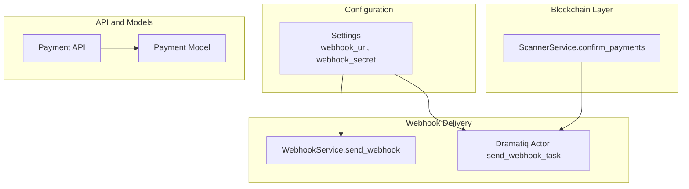
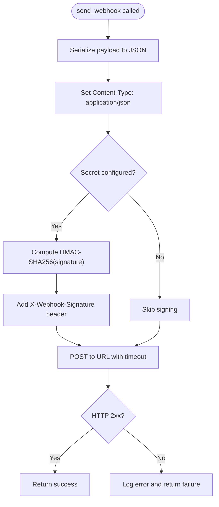
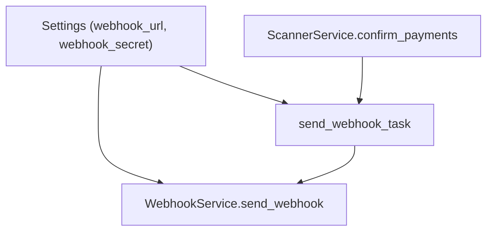

# Webhook Security

<cite>
**Referenced Files in This Document**
- [server.py](https://github.com/rakibhossain72/ctrip/blob/main/server.py)
- [app/core/config.py](https://github.com/rakibhossain72/ctrip/blob/main/app/core/config.py)
- [app/services/webhook.py](https://github.com/rakibhossain72/ctrip/blob/main/app/services/webhook.py)
- [app/workers/webhook.py](https://github.com/rakibhossain72/ctrip/blob/main/app/workers/webhook.py)
- [app/services/blockchain/scanner.py](https://github.com/rakibhossain72/ctrip/blob/main/app/services/blockchain/scanner.py)
- [app/api/v1/payments.py](https://github.com/rakibhossain72/ctrip/blob/main/app/api/v1/payments.py)
- [app/api/dependencies.py](https://github.com/rakibhossain72/ctrip/blob/main/app/api/dependencies.py)
- [app/db/models/payment.py](https://github.com/rakibhossain72/ctrip/blob/main/app/db/models/payment.py)
- [requirements.txt](https://github.com/rakibhossain72/ctrip/blob/main/requirements.txt)
</cite>

## Table of Contents
1. [Introduction](#introduction)
2. [Project Structure](#project-structure)
3. [Core Components](#core-components)
4. [Architecture Overview](#architecture-overview)
5. [Detailed Component Analysis](#detailed-component-analysis)
6. [Dependency Analysis](#dependency-analysis)
7. [Performance Considerations](#performance-considerations)
8. [Troubleshooting Guide](#troubleshooting-guide)
9. [Conclusion](#conclusion)
10. [Appendices](#appendices)

## Introduction
This document provides comprehensive webhook security guidance for the cTrip Payment Gateway. It focuses on signature verification mechanisms, HMAC implementation, and cryptographic signing practices used by the system. It also explains HTTPS enforcement, certificate validation, secure endpoint configuration, replay attack prevention, authentication patterns, shared secret management, payload validation, input sanitization, retry mechanisms with exponential backoff, failure handling, monitoring, anomaly detection, and security incident response for webhook-related threats.

## Project Structure
The webhook security implementation spans several modules:
- Configuration and secrets management
- Webhook sending service and worker
- Blockchain scanning and confirmation triggers
- Payment API and models
- Application lifecycle initialization



**Diagram sources**
- [app/core/config.py](https://github.com/rakibhossain72/ctrip/blob/main/app/core/config.py#L63-L71)
- [app/services/webhook.py](https://github.com/rakibhossain72/ctrip/blob/main/app/services/webhook.py#L10-L44)
- [app/workers/webhook.py](https://github.com/rakibhossain72/ctrip/blob/main/app/workers/webhook.py#L13-L36)
- [app/services/blockchain/scanner.py](https://github.com/rakibhossain72/ctrip/blob/main/app/services/blockchain/scanner.py#L117-L131)
- [app/api/v1/payments.py](https://github.com/rakibhossain72/ctrip/blob/main/app/api/v1/payments.py#L18-L54)
- [app/db/models/payment.py](https://github.com/rakibhossain72/ctrip/blob/main/app/db/models/payment.py#L41-L58)

**Section sources**
- [server.py](https://github.com/rakibhossain72/ctrip/blob/main/server.py#L21-L47)
- [app/core/config.py](https://github.com/rakibhossain72/ctrip/blob/main/app/core/config.py#L63-L71)
- [app/services/webhook.py](https://github.com/rakibhossain72/ctrip/blob/main/app/services/webhook.py#L10-L44)
- [app/workers/webhook.py](https://github.com/rakibhossain72/ctrip/blob/main/app/workers/webhook.py#L13-L36)
- [app/services/blockchain/scanner.py](https://github.com/rakibhossain72/ctrip/blob/main/app/services/blockchain/scanner.py#L117-L131)
- [app/api/v1/payments.py](https://github.com/rakibhossain72/ctrip/blob/main/app/api/v1/payments.py#L18-L54)
- [app/db/models/payment.py](https://github.com/rakibhossain72/ctrip/blob/main/app/db/models/payment.py#L41-L58)

## Core Components
- Settings: Defines webhook_url and webhook_secret for outbound webhook delivery.
- WebhookService: Implements HMAC-SHA256 signing and sends HTTP requests with X-Webhook-Signature header.
- Dramatiq Actor: Asynchronous task runner for webhook delivery with retry configuration.
- ScannerService: Triggers webhook delivery upon payment confirmation events.
- Payment API and Models: Define payment lifecycle and data structures used in webhook payloads.

Key security-relevant behaviors:
- Outbound webhooks are signed using HMAC-SHA256 when a secret is configured.
- Webhook delivery is asynchronous and retried via Dramatiq.
- Webhook URL and secret are loaded from configuration.

**Section sources**
- [app/core/config.py](https://github.com/rakibhossain72/ctrip/blob/main/app/core/config.py#L63-L71)
- [app/services/webhook.py](https://github.com/rakibhossain72/ctrip/blob/main/app/services/webhook.py#L10-L44)
- [app/workers/webhook.py](https://github.com/rakibhossain72/ctrip/blob/main/app/workers/webhook.py#L13-L36)
- [app/services/blockchain/scanner.py](https://github.com/rakibhossain72/ctrip/blob/main/app/services/blockchain/scanner.py#L117-L131)
- [app/api/v1/payments.py](https://github.com/rakibhossain72/ctrip/blob/main/app/api/v1/payments.py#L18-L54)
- [app/db/models/payment.py](https://github.com/rakibhossain72/ctrip/blob/main/app/db/models/payment.py#L41-L58)

## Architecture Overview
The webhook security architecture integrates configuration-driven signing, asynchronous delivery, and event-driven triggers.

```mermaid
sequenceDiagram
participant Client as "Client"
participant API as "Payment API"
participant DB as "Payment Model"
participant Scanner as "ScannerService"
participant Actor as "Dramatiq Actor"
participant Service as "WebhookService"
participant Dest as "External Webhook Endpoint"
Client->>API : "Create Payment"
API->>DB : "Persist Payment"
Note over API,DB : "Payment stored with status and metadata"
Scanner->>DB : "Scan and Confirm Payments"
Scanner->>Actor : "send_webhook_task(url, payload, secret)"
Actor->>Service : "send_webhook(url, payload, secret)"
Service->>Service : "Compute HMAC-SHA256 signature"
Service->>Dest : "POST JSON payload with X-Webhook-Signature"
Dest-->>Service : "HTTP 2xx/4xx/5xx"
Service-->>Actor : "Success/Failure"
Actor-->>Scanner : "Task result"
```

**Diagram sources**
- [app/api/v1/payments.py](https://github.com/rakibhossain72/ctrip/blob/main/app/api/v1/payments.py#L18-L54)
- [app/db/models/payment.py](https://github.com/rakibhossain72/ctrip/blob/main/app/db/models/payment.py#L41-L58)
- [app/services/blockchain/scanner.py](https://github.com/rakibhossain72/ctrip/blob/main/app/services/blockchain/scanner.py#L117-L131)
- [app/workers/webhook.py](https://github.com/rakibhossain72/ctrip/blob/main/app/workers/webhook.py#L13-L36)
- [app/services/webhook.py](https://github.com/rakibhossain72/ctrip/blob/main/app/services/webhook.py#L10-L44)

## Detailed Component Analysis

### Webhook Signing and Delivery
- HMAC-SHA256 signing is performed when a webhook secret is present.
- The signature is placed in the X-Webhook-Signature header.
- The payload is serialized to JSON and sent with Content-Type application/json.
- Delivery uses an asynchronous HTTP client with a timeout.

Security considerations:
- Ensure the secret is managed securely and rotated regularly.
- Validate the external endpoint supports TLS and certificate pinning where applicable.
- Implement idempotency and nonce/timestamp checks on the receiving endpoint.



**Diagram sources**
- [app/services/webhook.py](https://github.com/rakibhossain72/ctrip/blob/main/app/services/webhook.py#L10-L44)

**Section sources**
- [app/services/webhook.py](https://github.com/rakibhossain72/ctrip/blob/main/app/services/webhook.py#L10-L44)

### Webhook Delivery Worker
- Uses Dramatiq actor with a fixed number of retries.
- Raises exceptions to trigger retry logic.
- Runs within an event loop to support async operations.

Operational guidance:
- Tune max_retries and backoff policies based on downstream reliability.
- Monitor actor failures and configure dead-letter queues if needed.

```mermaid
sequenceDiagram
participant Scanner as "ScannerService"
participant Actor as "send_webhook_task"
participant Service as "WebhookService"
Scanner->>Actor : "send(url, payload, secret)"
Actor->>Service : "send_webhook(url, payload, secret)"
alt "Delivery succeeds"
Service-->>Actor : "True"
Actor-->>Scanner : "Success"
else "Delivery fails"
Service-->>Actor : "False"
Actor-->>Scanner : "Exception raised"
end
```

**Diagram sources**
- [app/services/blockchain/scanner.py](https://github.com/rakibhossain72/ctrip/blob/main/app/services/blockchain/scanner.py#L117-L131)
- [app/workers/webhook.py](https://github.com/rakibhossain72/ctrip/blob/main/app/workers/webhook.py#L13-L36)
- [app/services/webhook.py](https://github.com/rakibhossain72/ctrip/blob/main/app/services/webhook.py#L10-L44)

**Section sources**
- [app/workers/webhook.py](https://github.com/rakibhossain72/ctrip/blob/main/app/workers/webhook.py#L13-L36)

### Configuration and Secret Management
- webhook_url and webhook_secret are defined in settings.
- Private keys and application secrets are validated and enforced in production.

Guidelines:
- Store secrets in environment variables or a secure secret manager.
- Enforce mandatory secret rotation and deprecation of old keys.
- Restrict access to configuration and avoid embedding secrets in code.

**Section sources**
- [app/core/config.py](https://github.com/rakibhossain72/ctrip/blob/main/app/core/config.py#L63-L71)
- [app/core/config.py](https://github.com/rakibhossain72/ctrip/blob/main/app/core/config.py#L94-L112)

### Replay Attack Prevention
Current implementation does not include nonce or timestamp validation in outgoing webhooks. To mitigate replay attacks:
- Add a nonce and timestamp to the payload.
- On the receiver, enforce freshness windows and reject duplicates.
- Maintain a cache of processed nonces with TTL.

Note: The current signing mechanism relies on a shared secret but does not include built-in replay protection.

**Section sources**
- [app/services/webhook.py](https://github.com/rakibhossain72/ctrip/blob/main/app/services/webhook.py#L10-L44)

### Payload Validation and Input Sanitization
- Outbound payloads are constructed from payment records and include identifiers and amounts.
- Consider validating payload fields before signing and sending.

Recommendations:
- Normalize numeric values and sanitize identifiers.
- Reject payloads exceeding size limits.
- Apply schema validation prior to signing.

**Section sources**
- [app/services/blockchain/scanner.py](https://github.com/rakibhossain72/ctrip/blob/main/app/services/blockchain/scanner.py#L117-L131)
- [app/db/models/payment.py](https://github.com/rakibhossain72/ctrip/blob/main/app/db/models/payment.py#L41-L58)

### HTTPS Enforcement and Certificate Validation
- The outbound client uses an HTTP library; certificate validation depends on the underlying transport.
- Ensure the destination endpoint enforces HTTPS and validates certificates.

Best practices:
- Configure the client to verify certificates against trusted CAs.
- Pin certificates or use SNI validation where appropriate.
- Fail closed on certificate errors.

**Section sources**
- [app/services/webhook.py](https://github.com/rakibhossain72/ctrip/blob/main/app/services/webhook.py#L33-L35)
- [requirements.txt](https://github.com/rakibhossain72/ctrip/blob/main/requirements.txt#L47-L47)

### Secure Endpoint Configuration
- Configure webhook_url and webhook_secret in environment settings.
- Ensure the endpoint supports TLS and rejects plaintext traffic.

Operational controls:
- Use dedicated webhook endpoints per tenant or integration.
- Implement rate limiting and IP allowlists on the receiving side.

**Section sources**
- [app/core/config.py](https://github.com/rakibhossain72/ctrip/blob/main/app/core/config.py#L63-L71)

### Authentication Patterns and Credential Rotation
- Shared secret authentication via HMAC-SHA256.
- Rotate secrets by updating configuration and reissuing credentials to receivers.

Rotation procedure:
- Generate new secret and update configuration.
- Announce deprecation period and phase out old secret.
- Verify successful delivery with new secret before removing old one.

**Section sources**
- [app/services/webhook.py](https://github.com/rakibhossain72/ctrip/blob/main/app/services/webhook.py#L25-L31)
- [app/core/config.py](https://github.com/rakibhossain72/ctrip/blob/main/app/core/config.py#L63-L71)

### Retry Mechanisms and Failure Handling
- Actor-level retries are configured with a fixed maximum.
- On repeated failure, escalate to monitoring and alerting.

Retry policy recommendations:
- Implement exponential backoff with jitter.
- Distinguish transient vs. permanent failures.
- Use dead-letter queues for persistent failures.

**Section sources**
- [app/workers/webhook.py](https://github.com/rakibhossain72/ctrip/blob/main/app/workers/webhook.py#L13-L36)

### Monitoring, Anomaly Detection, and Incident Response
- Logging is performed on success and failure.
- Enhance with metrics for delivery latency, success rates, and error types.

Monitoring suggestions:
- Track webhook delivery counts and latencies.
- Alert on sustained failure rates or signature mismatches.
- Correlate with payment confirmation events.

Incident response:
- Isolate failing endpoints and temporarily disable webhooks if necessary.
- Validate signatures and investigate mismatch scenarios.
- Audit secret rotation history and access logs.

**Section sources**
- [app/services/webhook.py](https://github.com/rakibhossain72/ctrip/blob/main/app/services/webhook.py#L36-L42)
- [app/workers/webhook.py](https://github.com/rakibhossain72/ctrip/blob/main/app/workers/webhook.py#L22-L36)

## Dependency Analysis
The webhook security stack depends on configuration, asynchronous HTTP transport, and blockchain scanning.



**Diagram sources**
- [app/core/config.py](https://github.com/rakibhossain72/ctrip/blob/main/app/core/config.py#L63-L71)
- [app/services/blockchain/scanner.py](https://github.com/rakibhossain72/ctrip/blob/main/app/services/blockchain/scanner.py#L117-L131)
- [app/workers/webhook.py](https://github.com/rakibhossain72/ctrip/blob/main/app/workers/webhook.py#L13-L36)
- [app/services/webhook.py](https://github.com/rakibhossain72/ctrip/blob/main/app/services/webhook.py#L10-L44)

**Section sources**
- [app/core/config.py](https://github.com/rakibhossain72/ctrip/blob/main/app/core/config.py#L63-L71)
- [app/services/blockchain/scanner.py](https://github.com/rakibhossain72/ctrip/blob/main/app/services/blockchain/scanner.py#L117-L131)
- [app/workers/webhook.py](https://github.com/rakibhossain72/ctrip/blob/main/app/workers/webhook.py#L13-L36)
- [app/services/webhook.py](https://github.com/rakibhossain72/ctrip/blob/main/app/services/webhook.py#L10-L44)

## Performance Considerations
- Asynchronous delivery reduces blocking and improves throughput.
- Tune timeouts and retry backoff to balance responsiveness and reliability.
- Consider batching multiple payment confirmations into fewer webhook calls if supported by the receiver.

## Troubleshooting Guide
Common issues and resolutions:
- Signature mismatch: Verify the shared secret matches the receiver’s expectation and that the payload is identical.
- Network failures: Inspect logs for HTTP status errors and timeouts; adjust retry and backoff policies.
- Duplicate deliveries: Implement idempotency on the receiver and track nonces to suppress duplicates.
- Certificate errors: Ensure the destination endpoint uses valid TLS certificates and the client verifies them.

**Section sources**
- [app/services/webhook.py](https://github.com/rakibhossain72/ctrip/blob/main/app/services/webhook.py#L39-L42)
- [app/workers/webhook.py](https://github.com/rakibhossain72/ctrip/blob/main/app/workers/webhook.py#L34-L36)

## Conclusion
The cTrip Payment Gateway implements HMAC-SHA256-based webhook signing and asynchronous delivery. To achieve robust webhook security, complement the existing signing with replay protection (nonce/timestamp), enforce HTTPS and certificate validation, implement strict payload validation, and establish comprehensive monitoring and incident response procedures. Regular secret rotation and operational controls further strengthen the security posture.

## Appendices

### Security Checklist for Webhooks
- [ ] Enforce HTTPS and certificate validation for outbound requests
- [ ] Include nonce and timestamp in payloads; validate freshness on receiver
- [ ] Implement idempotent processing with deduplication
- [ ] Use rotating shared secrets and maintain audit trails
- [ ] Configure exponential backoff and dead-letter handling
- [ ] Monitor delivery metrics and alert on anomalies
- [ ] Validate payloads against schema and sanitize inputs